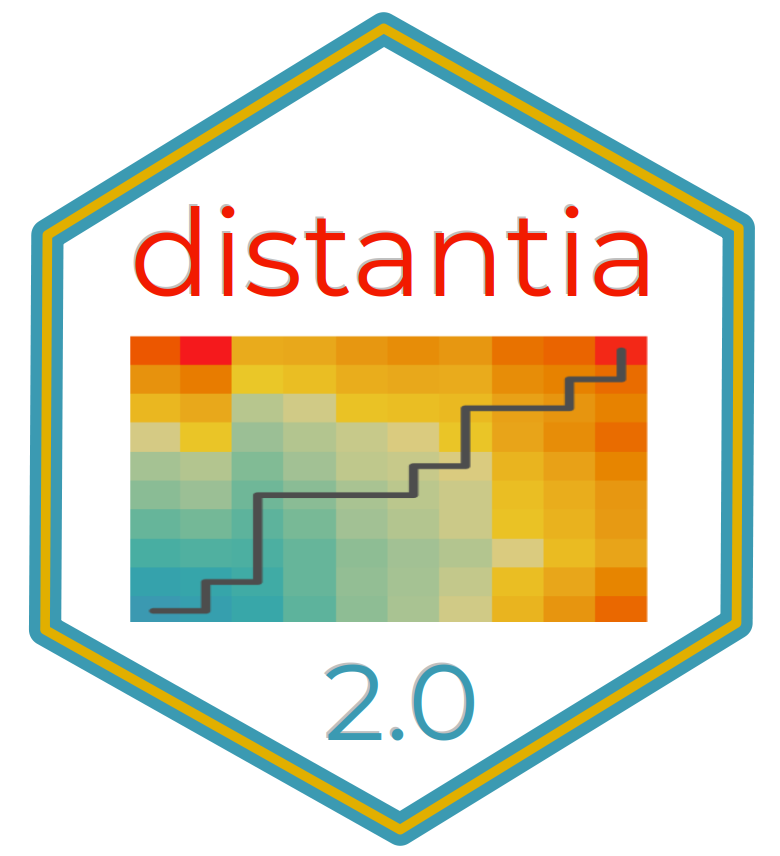

# `distantia` \n Time Series Dissimilarity <a href="https://github.com/BlasBenito/distantia"></a>

<!-- README.md is generated from README.Rmd. Please edit that file -->

```{r, echo = FALSE}
knitr::opts_chunk$set(
  collapse = TRUE,
  comment = "#>",
  fig.path = "man/figures/README-",
  eval = TRUE,
  dpi = 200
)
```

<!-- badges: start -->

[](https://zenodo.org/badge/latestdoi/187805264)
[](https://CRAN.R-project.org/package=distantia)
[](https://CRAN.R-project.org/package=distantia)
[](https://github.com/BlasBenito/distantia/actions/workflows/R-CMD-check.yaml)


<!-- badges: end -->

## Warning

Version 2.0.0 of `distantia` is a full re-write of the original package and **will break existing workflows** before **making them better**. Please refer to the [Changelog](https://blasbenito.github.io/distantia/news/index.html) for details before updating.

## Summary

The R package **`distantia`** offers an efficient, feature-rich toolkit for managing, comparing, and analyzing time series data. It is designed to handle a wide range of scenarios, including:

- Multivariate or univariate time series.
- Regular or irregular sampling. 
- Time series of different lengths.

### Key Features

#### Comprehensive Analytical Tools

  - 10 distance metrics: see `distantia::distances`.
  - The normalized dissimilarity metric `psi`.
  - Free and Restricted Dynamic Time Warping (DTW) for shape-based comparisons.
  - A Lock-Step method for sample-to-sample alignment.
  - Restricted permutation tests for robust inferential support.
  - Variable Importance Analysis: assessment of contribution to dissimilarity of individual variables in multivariate time series.
  - Hierarchical and K-means clustering of time series based on dissimilarity matrices.
  
#### Computational Efficiency

  - A **C++ back-end** powered by [Rcpp](https://www.rcpp.org/).
  - **Parallel processing** managed through the [future](https://future.futureverse.org/) package.
  - **Efficient data handling** via [zoo](https://cran.r-project.org/web/packages/zoo/index.html).

#### Time Series Management Tools

  - Introduces **time series lists** (TSL), a versatile format for handling collections of time series stored as lists of `zoo` objects.
  - Includes a suite of `tsl_...()` functions for generating, resampling, transforming, analyzing, and visualizing both univariate and multivariate time series.

## Citation

If you find this package useful, please cite it as:

*Blas M. Benito, H. John B. Birks (2020). distantia: an open-source toolset to quantify dissimilarity between multivariate ecological time-series. Ecography, 43(5), 660-667. doi: [10.1111/ecog.04895](https://nsojournals.onlinelibrary.wiley.com/doi/10.1111/ecog.04895).*

*Blas M. Benito (2024). distantia: A Toolset for Time Series Dissimilarity Analysis. R package version 2.0.0. url:  [https://blasbenito.github.io/distantia/](https://blasbenito.github.io/distantia/).*

## Install

The package `distantia` can be installed from CRAN.

```{r, eval = FALSE}
install.packages("distantia")
```


The development version can be installed from GitHub.

```{r, eval = FALSE}
remotes::install_github(
  repo = "blasbenito/distantia", 
  ref = "development"
  )
```

## Getting Started

This section showcases several features of the package `distantia`. Please, check the **Articles** section for further details.

### Setup

All heavy duty functions in `distantia` support parallelization via the [future](https://future.futureverse.org/) package, and progress bars provided by the [progressr](https://progressr.futureverse.org/) package. Unfortunately, the latter does not work in Rmarkdown documents like this one.

```{r packages, message = FALSE, warning = FALSE}
library(distantia)
library(future)
library(parallelly)
# library(progressr)


#parallelization setup
future::plan(
  future::multisession,
  workers = parallelly::availableCores() - 1
  )

#progress bar (does not work in Rmarkdown)
#progressr::handlers(global = TRUE)
```

### Example Data

The `albatross` data frame contains daily GPS data of 4 individuals of Waved Albatross in the Pacific captured during the summer of 2008. Below are the first 10 rows of this data frame:

```{r, echo = FALSE}
albatross |> 
  distantia::utils_drop_geometry() |> 
  head()
```

The code below transforms the data to a *Time Series List* with `tsl_initialize()` and applies global scaling and centering with `tsl_transform()` and `f_scale_global` to facilitate time series comparisons.

```{r, fig.width=5, fig.height=4.5, out.width = "100%"}
tsl <- tsl_initialize(
  x = albatross,
  name_column = "name",
  time_column = "time",
  lock_step = TRUE
) |> 
  tsl_transform(
    f = f_scale_global
  )

tsl_plot(
  tsl = tsl,
  ylim = "relative"
)
```
### Dissimilarity Analysis

#### Lock-Step Analysis

Lock-step analysis performs direct comparisons between samples observed at the same time without any time distortion. It requires time series of the same length, observed at the same times.

```{r}
df_ls <- distantia(
  tsl = tsl,
  lock_step = TRUE
)

df_ls[, c("x", "y", "psi")]
```

The "psi" column contains normalized dissimilarity values and is used to sort the data frame from lowest to highest dissimilarity. Hence, the first row shows the most similar pair of time series.

The function `distantia_boxplot()` enables a quick identification of the time series that are either more dissimilar (top) or similar (bottom) to others.

```{r, fig.width=4.5, fig.height=3, out.width = "75%"}
distantia_boxplot(df = df_ls)
```

#### Dynamic Time Warping

By default, `distantia()` computes unrestricted dynamic time warping with orthogonal and diagonal least cost paths. 

```{r}
df_dtw <- distantia(
  tsl = tsl
)

df_dtw[, c("x", "y", "psi")]
```

The function `distantia_plot()` provides detailed insights into the alignment between a pair of time series resulting from DTW.

```{r, fig.width=6, fig.height=5, out.width = "100%"}
distantia_plot(
  tsl = tsl[c("X132", "X153")]
)
```

Deviations from the perfect diagonal in the least-cost path reveal adjustments made by DTW to align time series by shape rather than time.

The article [Dynamic Time Warping vs Lock-Step](https://blasbenito.github.io/distantia/articles/dynamic_time_warping_and_lock_step.html) provides further insights on the advantages and disadvantages of each method in different scenarios.

### Permutation Test

The function `distantia()` implements restricted permutation tests to assess the significance of dissimilarity scores. It provides several setups to support different assumptions.

For example, the configuration below rearranges complete rows within 7-day blocks, assuming strong dependencies within rows and between observations that are close in time.

```{r}
df_dtw <- distantia(
  tsl = tsl,
  repetitions = 1000,
  permutation = "restricted_by_row",
  block_size = 7
)

df_dtw[, c("x", "y", "psi", "p_value")]
```

The "p_value" column represents the fraction of permutations yielding a psi score lower than the observed value. It indicates the strength of similarity between two time series. A significance threshold (e.g., 0.05, depending on iterations) helps identify strongly similar or dissimilar pairs. 

### Variable Importance

When comparing multivariate time series, certain variables contribute more to similarity or dissimilarity. The `momentum()` function uses a leave-one-out algorithm to quantify each variable's contribution to the overall dissimilarity between two time series.

```{r}
df_importance <- momentum(
  tsl = tsl
)

df_importance[, c("x", "y", "variable", "importance", "effect")]
```

Positive "importance" values indicate variables contributing to dissimilarity, while negative values indicate variables contributing to dissimilarity. The function documentation provides more details on how importance scores are computed.

The `distantia_boxplot()` function can provide insights into which variables contribute the most to similarity or dissimilarity.

```{r, fig.width=4.5, fig.height=3, out.width = "75%"}
distantia_boxplot(
  df = df_importance
)
```

### Clustering

The package `distantia` provides tools to group together time series by dissimilarity using hierarchical or K-means clustering. The example below applies the former to the `albatross` dataset to find out groups of individuals with the most similar movement time series.

```{r, fig.width=3, fig.height=2.5, out.width = "75%"}
dtw_hclust <- distantia_cluster_hclust(
  df = df_dtw,
  clusters = NULL, #automatic mode
  method = NULL    #automatic mode
  )

#cluster object
dtw_hclust$cluster_object

#number of clusters
dtw_hclust$clusters

#clustering data frame
#group label in column "cluster"
#negatives in column "silhouette_width" higlight anomalous cluster assignation
dtw_hclust$df

#tree plot
par(mar=c(3,1,1,3))

plot(
  x = stats::as.dendrogram(
    dtw_hclust$cluster_object
    ),
  horiz = TRUE
)
```
This is just a summary of the features implemented in the package. Please visit the **Articles** section to find out more about `distantia`.

## Getting help

If you encounter bugs or issues with the documentation, please [file a issue on GitHub](https://github.com/BlasBenito/distantia/issues).
