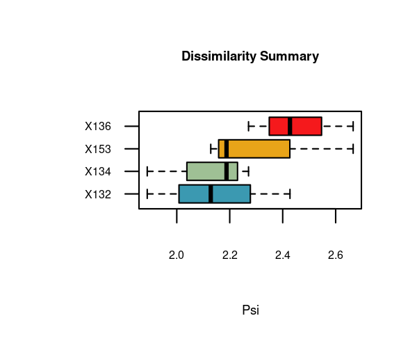
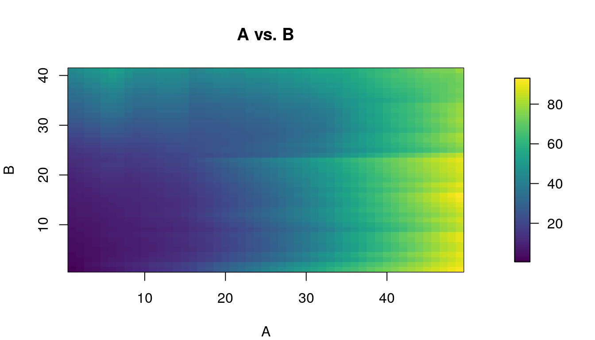
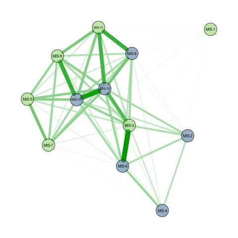
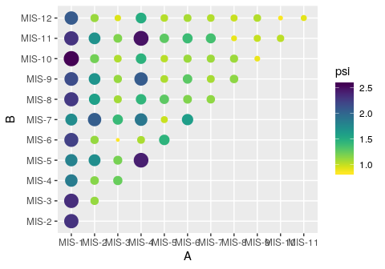
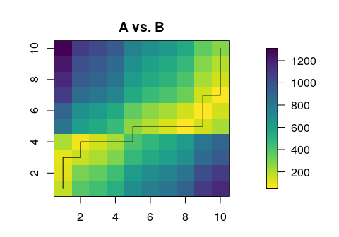

distantia: an R package to compute the dissimilarity between
multivariate time-series
================

<!-- README.md is generated from README.Rmd. Please edit that file -->

<!-- badges: start -->

[](https://zenodo.org/badge/latestdoi/187805264)
[](https://CRAN.R-project.org/package=distantia)
[](https://CRAN.R-project.org/package=distantia)

<!-- badges: end -->

## Summary

The package **distantia** allows to measure the dissimilarity between
multivariate ecological time-series (*METS* hereafter). The package
assumes that the target sequences are ordered along a given dimension,
being depth and time the most common ones, but others such as latitude
or elevation are also possible. Furthermore, the target METS can be
regular or irregular, and have their samples aligned (same
age/time/depth) or unaligned (different age/time/depth). The only
requirement is that the sequences must have at least two (but ideally
more) columns with the same name and units representing different
variables relevant to the dynamics of an ecological system.

In this document I explain the logics behind the method, show how to use
it, and demonstrate how the **distantia** package introduces useful
tools to compare multivariate time-series. The topics covered in this
document are:

  - Installation of the package.
  - Comparing two irregular METS.
  - Comparing multiple irregular METS.
  - Comparing regular and aligned METS.
  - Restricted permutation test to assess the significance of
    dissimilarity scores
  - Assessing the contribution of every variable to the dissimilarity
    between two METS.
  - Partial matching: finding the section in a long METS more similar to
    a given shorter one.
  - Sequence slotting: combining samples of two METS into a single
    composite sequence.
  - Tranferring an attribute from one METS to another: direct and
    interpolated modes.

## Installation

You can install the released version of distantia (currently *v1.0.0*)
from [CRAN](https://CRAN.R-project.org) with:

``` r
install.packages("distantia")
```

And the development version (currently v1.0.1) from
[GitHub](https://github.com/) with:

``` r
library(devtools)
devtools::install_github("BlasBenito/distantia")
```

Loading the library, plus other helper libraries:

``` r
library(distantia)
library(ggplot2)
library(viridis)
library(kableExtra)
library(qgraph)
library(tidyr)
```

## Comparing two irregular METS

In this section I will use two example datasets based on the Abernethy
pollen core (Birks and Mathewes, 1978) to fully explain the logical
backbone of the dissimilarity analyses implemented in *distantia*.

``` r
#loading sequences
data(sequenceA)
data(sequenceB)

#showing first rows
kable(sequenceA[1:15, ], caption = "Sequence A")
```

<table>

<caption>

Sequence A

</caption>

<thead>

<tr>

<th style="text-align:right;">

betula

</th>

<th style="text-align:right;">

pinus

</th>

<th style="text-align:right;">

corylu

</th>

<th style="text-align:right;">

junipe

</th>

<th style="text-align:right;">

empetr

</th>

<th style="text-align:right;">

gramin

</th>

<th style="text-align:right;">

cypera

</th>

<th style="text-align:right;">

artemi

</th>

<th style="text-align:right;">

rumex

</th>

</tr>

</thead>

<tbody>

<tr>

<td style="text-align:right;">

79

</td>

<td style="text-align:right;">

271

</td>

<td style="text-align:right;">

36

</td>

<td style="text-align:right;">

0

</td>

<td style="text-align:right;">

4

</td>

<td style="text-align:right;">

7

</td>

<td style="text-align:right;">

25

</td>

<td style="text-align:right;">

0

</td>

<td style="text-align:right;">

0

</td>

</tr>

<tr>

<td style="text-align:right;">

113

</td>

<td style="text-align:right;">

320

</td>

<td style="text-align:right;">

42

</td>

<td style="text-align:right;">

0

</td>

<td style="text-align:right;">

4

</td>

<td style="text-align:right;">

3

</td>

<td style="text-align:right;">

11

</td>

<td style="text-align:right;">

0

</td>

<td style="text-align:right;">

0

</td>

</tr>

<tr>

<td style="text-align:right;">

51

</td>

<td style="text-align:right;">

420

</td>

<td style="text-align:right;">

39

</td>

<td style="text-align:right;">

0

</td>

<td style="text-align:right;">

2

</td>

<td style="text-align:right;">

1

</td>

<td style="text-align:right;">

12

</td>

<td style="text-align:right;">

0

</td>

<td style="text-align:right;">

0

</td>

</tr>

<tr>

<td style="text-align:right;">

130

</td>

<td style="text-align:right;">

470

</td>

<td style="text-align:right;">

6

</td>

<td style="text-align:right;">

0

</td>

<td style="text-align:right;">

0

</td>

<td style="text-align:right;">

2

</td>

<td style="text-align:right;">

4

</td>

<td style="text-align:right;">

0

</td>

<td style="text-align:right;">

0

</td>

</tr>

<tr>

<td style="text-align:right;">

31

</td>

<td style="text-align:right;">

450

</td>

<td style="text-align:right;">

6

</td>

<td style="text-align:right;">

0

</td>

<td style="text-align:right;">

3

</td>

<td style="text-align:right;">

2

</td>

<td style="text-align:right;">

3

</td>

<td style="text-align:right;">

0

</td>

<td style="text-align:right;">

0

</td>

</tr>

<tr>

<td style="text-align:right;">

59

</td>

<td style="text-align:right;">

425

</td>

<td style="text-align:right;">

12

</td>

<td style="text-align:right;">

0

</td>

<td style="text-align:right;">

0

</td>

<td style="text-align:right;">

2

</td>

<td style="text-align:right;">

3

</td>

<td style="text-align:right;">

0

</td>

<td style="text-align:right;">

0

</td>

</tr>

<tr>

<td style="text-align:right;">

78

</td>

<td style="text-align:right;">

386

</td>

<td style="text-align:right;">

29

</td>

<td style="text-align:right;">

2

</td>

<td style="text-align:right;">

0

</td>

<td style="text-align:right;">

0

</td>

<td style="text-align:right;">

2

</td>

<td style="text-align:right;">

0

</td>

<td style="text-align:right;">

0

</td>

</tr>

<tr>

<td style="text-align:right;">

71

</td>

<td style="text-align:right;">

397

</td>

<td style="text-align:right;">

52

</td>

<td style="text-align:right;">

2

</td>

<td style="text-align:right;">

0

</td>

<td style="text-align:right;">

6

</td>

<td style="text-align:right;">

3

</td>

<td style="text-align:right;">

0

</td>

<td style="text-align:right;">

0

</td>

</tr>

<tr>

<td style="text-align:right;">

140

</td>

<td style="text-align:right;">

310

</td>

<td style="text-align:right;">

50

</td>

<td style="text-align:right;">

2

</td>

<td style="text-align:right;">

0

</td>

<td style="text-align:right;">

4

</td>

<td style="text-align:right;">

3

</td>

<td style="text-align:right;">

0

</td>

<td style="text-align:right;">

0

</td>

</tr>

<tr>

<td style="text-align:right;">

150

</td>

<td style="text-align:right;">

323

</td>

<td style="text-align:right;">

34

</td>

<td style="text-align:right;">

2

</td>

<td style="text-align:right;">

0

</td>

<td style="text-align:right;">

11

</td>

<td style="text-align:right;">

2

</td>

<td style="text-align:right;">

0

</td>

<td style="text-align:right;">

0

</td>

</tr>

<tr>

<td style="text-align:right;">

175

</td>

<td style="text-align:right;">

317

</td>

<td style="text-align:right;">

37

</td>

<td style="text-align:right;">

2

</td>

<td style="text-align:right;">

0

</td>

<td style="text-align:right;">

11

</td>

<td style="text-align:right;">

3

</td>

<td style="text-align:right;">

0

</td>

<td style="text-align:right;">

0

</td>

</tr>

<tr>

<td style="text-align:right;">

181

</td>

<td style="text-align:right;">

345

</td>

<td style="text-align:right;">

28

</td>

<td style="text-align:right;">

3

</td>

<td style="text-align:right;">

0

</td>

<td style="text-align:right;">

7

</td>

<td style="text-align:right;">

3

</td>

<td style="text-align:right;">

0

</td>

<td style="text-align:right;">

0

</td>

</tr>

<tr>

<td style="text-align:right;">

153

</td>

<td style="text-align:right;">

285

</td>

<td style="text-align:right;">

36

</td>

<td style="text-align:right;">

2

</td>

<td style="text-align:right;">

0

</td>

<td style="text-align:right;">

8

</td>

<td style="text-align:right;">

3

</td>

<td style="text-align:right;">

0

</td>

<td style="text-align:right;">

1

</td>

</tr>

<tr>

<td style="text-align:right;">

214

</td>

<td style="text-align:right;">

315

</td>

<td style="text-align:right;">

54

</td>

<td style="text-align:right;">

2

</td>

<td style="text-align:right;">

1

</td>

<td style="text-align:right;">

13

</td>

<td style="text-align:right;">

5

</td>

<td style="text-align:right;">

0

</td>

<td style="text-align:right;">

0

</td>

</tr>

<tr>

<td style="text-align:right;">

200

</td>

<td style="text-align:right;">

210

</td>

<td style="text-align:right;">

41

</td>

<td style="text-align:right;">

6

</td>

<td style="text-align:right;">

0

</td>

<td style="text-align:right;">

10

</td>

<td style="text-align:right;">

4

</td>

<td style="text-align:right;">

0

</td>

<td style="text-align:right;">

0

</td>

</tr>

</tbody>

</table>

``` r
kable(sequenceB[1:15, ], caption = "Sequence B")
```

<table>

<caption>

Sequence B

</caption>

<thead>

<tr>

<th style="text-align:right;">

betula

</th>

<th style="text-align:right;">

pinus

</th>

<th style="text-align:right;">

corylu

</th>

<th style="text-align:right;">

junipe

</th>

<th style="text-align:right;">

gramin

</th>

<th style="text-align:right;">

cypera

</th>

<th style="text-align:right;">

artemi

</th>

<th style="text-align:right;">

rumex

</th>

</tr>

</thead>

<tbody>

<tr>

<td style="text-align:right;">

19

</td>

<td style="text-align:right;">

175

</td>

<td style="text-align:right;">

NA

</td>

<td style="text-align:right;">

2

</td>

<td style="text-align:right;">

34

</td>

<td style="text-align:right;">

39

</td>

<td style="text-align:right;">

1

</td>

<td style="text-align:right;">

0

</td>

</tr>

<tr>

<td style="text-align:right;">

18

</td>

<td style="text-align:right;">

119

</td>

<td style="text-align:right;">

28

</td>

<td style="text-align:right;">

1

</td>

<td style="text-align:right;">

36

</td>

<td style="text-align:right;">

44

</td>

<td style="text-align:right;">

0

</td>

<td style="text-align:right;">

4

</td>

</tr>

<tr>

<td style="text-align:right;">

30

</td>

<td style="text-align:right;">

99

</td>

<td style="text-align:right;">

37

</td>

<td style="text-align:right;">

0

</td>

<td style="text-align:right;">

2

</td>

<td style="text-align:right;">

20

</td>

<td style="text-align:right;">

0

</td>

<td style="text-align:right;">

1

</td>

</tr>

<tr>

<td style="text-align:right;">

26

</td>

<td style="text-align:right;">

101

</td>

<td style="text-align:right;">

29

</td>

<td style="text-align:right;">

0

</td>

<td style="text-align:right;">

0

</td>

<td style="text-align:right;">

18

</td>

<td style="text-align:right;">

0

</td>

<td style="text-align:right;">

0

</td>

</tr>

<tr>

<td style="text-align:right;">

31

</td>

<td style="text-align:right;">

99

</td>

<td style="text-align:right;">

30

</td>

<td style="text-align:right;">

0

</td>

<td style="text-align:right;">

1

</td>

<td style="text-align:right;">

10

</td>

<td style="text-align:right;">

0

</td>

<td style="text-align:right;">

0

</td>

</tr>

<tr>

<td style="text-align:right;">

24

</td>

<td style="text-align:right;">

97

</td>

<td style="text-align:right;">

28

</td>

<td style="text-align:right;">

0

</td>

<td style="text-align:right;">

2

</td>

<td style="text-align:right;">

9

</td>

<td style="text-align:right;">

0

</td>

<td style="text-align:right;">

0

</td>

</tr>

<tr>

<td style="text-align:right;">

23

</td>

<td style="text-align:right;">

105

</td>

<td style="text-align:right;">

34

</td>

<td style="text-align:right;">

0

</td>

<td style="text-align:right;">

1

</td>

<td style="text-align:right;">

6

</td>

<td style="text-align:right;">

0

</td>

<td style="text-align:right;">

0

</td>

</tr>

<tr>

<td style="text-align:right;">

48

</td>

<td style="text-align:right;">

112

</td>

<td style="text-align:right;">

46

</td>

<td style="text-align:right;">

0

</td>

<td style="text-align:right;">

0

</td>

<td style="text-align:right;">

12

</td>

<td style="text-align:right;">

0

</td>

<td style="text-align:right;">

0

</td>

</tr>

<tr>

<td style="text-align:right;">

29

</td>

<td style="text-align:right;">

108

</td>

<td style="text-align:right;">

16

</td>

<td style="text-align:right;">

0

</td>

<td style="text-align:right;">

6

</td>

<td style="text-align:right;">

3

</td>

<td style="text-align:right;">

0

</td>

<td style="text-align:right;">

0

</td>

</tr>

<tr>

<td style="text-align:right;">

23

</td>

<td style="text-align:right;">

110

</td>

<td style="text-align:right;">

21

</td>

<td style="text-align:right;">

0

</td>

<td style="text-align:right;">

2

</td>

<td style="text-align:right;">

11

</td>

<td style="text-align:right;">

0

</td>

<td style="text-align:right;">

1

</td>

</tr>

<tr>

<td style="text-align:right;">

5

</td>

<td style="text-align:right;">

119

</td>

<td style="text-align:right;">

19

</td>

<td style="text-align:right;">

0

</td>

<td style="text-align:right;">

1

</td>

<td style="text-align:right;">

1

</td>

<td style="text-align:right;">

0

</td>

<td style="text-align:right;">

0

</td>

</tr>

<tr>

<td style="text-align:right;">

30

</td>

<td style="text-align:right;">

105

</td>

<td style="text-align:right;">

NA

</td>

<td style="text-align:right;">

0

</td>

<td style="text-align:right;">

9

</td>

<td style="text-align:right;">

7

</td>

<td style="text-align:right;">

0

</td>

<td style="text-align:right;">

0

</td>

</tr>

<tr>

<td style="text-align:right;">

22

</td>

<td style="text-align:right;">

116

</td>

<td style="text-align:right;">

17

</td>

<td style="text-align:right;">

0

</td>

<td style="text-align:right;">

1

</td>

<td style="text-align:right;">

7

</td>

<td style="text-align:right;">

0

</td>

<td style="text-align:right;">

0

</td>

</tr>

<tr>

<td style="text-align:right;">

24

</td>

<td style="text-align:right;">

115

</td>

<td style="text-align:right;">

20

</td>

<td style="text-align:right;">

0

</td>

<td style="text-align:right;">

2

</td>

<td style="text-align:right;">

4

</td>

<td style="text-align:right;">

0

</td>

<td style="text-align:right;">

0

</td>

</tr>

<tr>

<td style="text-align:right;">

26

</td>

<td style="text-align:right;">

119

</td>

<td style="text-align:right;">

23

</td>

<td style="text-align:right;">

0

</td>

<td style="text-align:right;">

4

</td>

<td style="text-align:right;">

0

</td>

<td style="text-align:right;">

0

</td>

<td style="text-align:right;">

0

</td>

</tr>

</tbody>

</table>

### Data preparation

Notice that **sequenceB** has a few NA values (that were introduced to
serve as an example). The function **prepareSequences** gets them ready
for analysis by matching colum names and handling empty data. It allows
to merge two or more METS into a single dataframe ready for further
analyses. Note that, since the data represents pollen abundances, a
*Hellinger* transformation (square root of the relative proportions of
each taxa, it balances the relative abundances of rare and dominant
taxa) is applied. This transformation balances the relative importance
of very abundant versus rare taxa. The function **prepareSequences**
will generally be the starting point of any analysis performed with the
*distantia* package.

``` r
#checking the function help-file.
help(prepareSequences)

#preparing sequences
AB.sequences <- prepareSequences(
  sequence.A = sequenceA,
  sequence.A.name = "A",
  sequence.B = sequenceB,
  sequence.B.name = "B",
  merge.mode = "complete",
  if.empty.cases = "zero",
  transformation = "hellinger"
)

#showing first rows of the transformed data
kable(AB.sequences[1:15, ], digits = 4, caption = "Sequences A and B ready for analysis.")
```

<table>

<caption>

Sequences A and B ready for analysis.

</caption>

<thead>

<tr>

<th style="text-align:left;">

id

</th>

<th style="text-align:right;">

betula

</th>

<th style="text-align:right;">

pinus

</th>

<th style="text-align:right;">

corylu

</th>

<th style="text-align:right;">

junipe

</th>

<th style="text-align:right;">

empetr

</th>

<th style="text-align:right;">

gramin

</th>

<th style="text-align:right;">

cypera

</th>

<th style="text-align:right;">

artemi

</th>

<th style="text-align:right;">

rumex

</th>

</tr>

</thead>

<tbody>

<tr>

<td style="text-align:left;">

A

</td>

<td style="text-align:right;">

0.4327

</td>

<td style="text-align:right;">

0.8014

</td>

<td style="text-align:right;">

0.2921

</td>

<td style="text-align:right;">

0.0002

</td>

<td style="text-align:right;">

0.0974

</td>

<td style="text-align:right;">

0.1288

</td>

<td style="text-align:right;">

0.2434

</td>

<td style="text-align:right;">

2e-04

</td>

<td style="text-align:right;">

0.0002

</td>

</tr>

<tr>

<td style="text-align:left;">

A

</td>

<td style="text-align:right;">

0.4788

</td>

<td style="text-align:right;">

0.8057

</td>

<td style="text-align:right;">

0.2919

</td>

<td style="text-align:right;">

0.0001

</td>

<td style="text-align:right;">

0.0901

</td>

<td style="text-align:right;">

0.0780

</td>

<td style="text-align:right;">

0.1494

</td>

<td style="text-align:right;">

1e-04

</td>

<td style="text-align:right;">

0.0001

</td>

</tr>

<tr>

<td style="text-align:left;">

A

</td>

<td style="text-align:right;">

0.3117

</td>

<td style="text-align:right;">

0.8944

</td>

<td style="text-align:right;">

0.2726

</td>

<td style="text-align:right;">

0.0001

</td>

<td style="text-align:right;">

0.0617

</td>

<td style="text-align:right;">

0.0436

</td>

<td style="text-align:right;">

0.1512

</td>

<td style="text-align:right;">

1e-04

</td>

<td style="text-align:right;">

0.0001

</td>

</tr>

<tr>

<td style="text-align:left;">

A

</td>

<td style="text-align:right;">

0.4609

</td>

<td style="text-align:right;">

0.8763

</td>

<td style="text-align:right;">

0.0990

</td>

<td style="text-align:right;">

0.0001

</td>

<td style="text-align:right;">

0.0001

</td>

<td style="text-align:right;">

0.0572

</td>

<td style="text-align:right;">

0.0808

</td>

<td style="text-align:right;">

1e-04

</td>

<td style="text-align:right;">

0.0001

</td>

</tr>

<tr>

<td style="text-align:left;">

A

</td>

<td style="text-align:right;">

0.2503

</td>

<td style="text-align:right;">

0.9535

</td>

<td style="text-align:right;">

0.1101

</td>

<td style="text-align:right;">

0.0001

</td>

<td style="text-align:right;">

0.0778

</td>

<td style="text-align:right;">

0.0636

</td>

<td style="text-align:right;">

0.0778

</td>

<td style="text-align:right;">

1e-04

</td>

<td style="text-align:right;">

0.0001

</td>

</tr>

<tr>

<td style="text-align:left;">

A

</td>

<td style="text-align:right;">

0.3432

</td>

<td style="text-align:right;">

0.9210

</td>

<td style="text-align:right;">

0.1548

</td>

<td style="text-align:right;">

0.0001

</td>

<td style="text-align:right;">

0.0001

</td>

<td style="text-align:right;">

0.0632

</td>

<td style="text-align:right;">

0.0774

</td>

<td style="text-align:right;">

1e-04

</td>

<td style="text-align:right;">

0.0001

</td>

</tr>

<tr>

<td style="text-align:left;">

A

</td>

<td style="text-align:right;">

0.3962

</td>

<td style="text-align:right;">

0.8813

</td>

<td style="text-align:right;">

0.2416

</td>

<td style="text-align:right;">

0.0634

</td>

<td style="text-align:right;">

0.0001

</td>

<td style="text-align:right;">

0.0001

</td>

<td style="text-align:right;">

0.0634

</td>

<td style="text-align:right;">

1e-04

</td>

<td style="text-align:right;">

0.0001

</td>

</tr>

<tr>

<td style="text-align:left;">

A

</td>

<td style="text-align:right;">

0.3657

</td>

<td style="text-align:right;">

0.8647

</td>

<td style="text-align:right;">

0.3129

</td>

<td style="text-align:right;">

0.0614

</td>

<td style="text-align:right;">

0.0001

</td>

<td style="text-align:right;">

0.1063

</td>

<td style="text-align:right;">

0.0752

</td>

<td style="text-align:right;">

1e-04

</td>

<td style="text-align:right;">

0.0001

</td>

</tr>

<tr>

<td style="text-align:left;">

A

</td>

<td style="text-align:right;">

0.5245

</td>

<td style="text-align:right;">

0.7804

</td>

<td style="text-align:right;">

0.3134

</td>

<td style="text-align:right;">

0.0627

</td>

<td style="text-align:right;">

0.0001

</td>

<td style="text-align:right;">

0.0886

</td>

<td style="text-align:right;">

0.0768

</td>

<td style="text-align:right;">

1e-04

</td>

<td style="text-align:right;">

0.0001

</td>

</tr>

<tr>

<td style="text-align:left;">

A

</td>

<td style="text-align:right;">

0.5361

</td>

<td style="text-align:right;">

0.7866

</td>

<td style="text-align:right;">

0.2552

</td>

<td style="text-align:right;">

0.0619

</td>

<td style="text-align:right;">

0.0001

</td>

<td style="text-align:right;">

0.1452

</td>

<td style="text-align:right;">

0.0619

</td>

<td style="text-align:right;">

1e-04

</td>

<td style="text-align:right;">

0.0001

</td>

</tr>

<tr>

<td style="text-align:left;">

A

</td>

<td style="text-align:right;">

0.5667

</td>

<td style="text-align:right;">

0.7627

</td>

<td style="text-align:right;">

0.2606

</td>

<td style="text-align:right;">

0.0606

</td>

<td style="text-align:right;">

0.0001

</td>

<td style="text-align:right;">

0.1421

</td>

<td style="text-align:right;">

0.0742

</td>

<td style="text-align:right;">

1e-04

</td>

<td style="text-align:right;">

0.0001

</td>

</tr>

<tr>

<td style="text-align:left;">

A

</td>

<td style="text-align:right;">

0.5650

</td>

<td style="text-align:right;">

0.7800

</td>

<td style="text-align:right;">

0.2222

</td>

<td style="text-align:right;">

0.0727

</td>

<td style="text-align:right;">

0.0001

</td>

<td style="text-align:right;">

0.1111

</td>

<td style="text-align:right;">

0.0727

</td>

<td style="text-align:right;">

1e-04

</td>

<td style="text-align:right;">

0.0001

</td>

</tr>

<tr>

<td style="text-align:left;">

A

</td>

<td style="text-align:right;">

0.5599

</td>

<td style="text-align:right;">

0.7642

</td>

<td style="text-align:right;">

0.2716

</td>

<td style="text-align:right;">

0.0640

</td>

<td style="text-align:right;">

0.0001

</td>

<td style="text-align:right;">

0.1280

</td>

<td style="text-align:right;">

0.0784

</td>

<td style="text-align:right;">

1e-04

</td>

<td style="text-align:right;">

0.0453

</td>

</tr>

<tr>

<td style="text-align:left;">

A

</td>

<td style="text-align:right;">

0.5952

</td>

<td style="text-align:right;">

0.7222

</td>

<td style="text-align:right;">

0.2990

</td>

<td style="text-align:right;">

0.0575

</td>

<td style="text-align:right;">

0.0407

</td>

<td style="text-align:right;">

0.1467

</td>

<td style="text-align:right;">

0.0910

</td>

<td style="text-align:right;">

1e-04

</td>

<td style="text-align:right;">

0.0001

</td>

</tr>

<tr>

<td style="text-align:left;">

A

</td>

<td style="text-align:right;">

0.6516

</td>

<td style="text-align:right;">

0.6677

</td>

<td style="text-align:right;">

0.2950

</td>

<td style="text-align:right;">

0.1129

</td>

<td style="text-align:right;">

0.0001

</td>

<td style="text-align:right;">

0.1457

</td>

<td style="text-align:right;">

0.0922

</td>

<td style="text-align:right;">

1e-04

</td>

<td style="text-align:right;">

0.0001

</td>

</tr>

</tbody>

</table>

The computation of dissimilarity between the datasets A and B requires
several
steps.

### 1\. Computation of a distance matrix among the samples of both sequences.

It is computed by the **distanceMatrix** function, which allows the user
to select a distance metric (so far the ones implemented are
*manhattan*, *euclidean*, *chi*, and *hellinger*). The function
**plotMatrix** allows an easy visualization of the resulting distance
matrix.

``` r
#computing distance matrix
AB.distance.matrix <- distanceMatrix(
  sequences = AB.sequences,
  method = "euclidean"
)

#plotting distance matrix
plotMatrix(
  distance.matrix = AB.distance.matrix,
  color.palette = "viridis",
  margins = rep(4,4))
```



### 2\. Computation of the least-cost path within the distance matrix.

This step uses a *dynamic programming algorithm* to find the least-cost
path that connnects the cell 1,1 of the matrix (lower left in the image
above) and the last cell of the matrix (opposite corner). This can be
done via in two different ways.

  - an **orthogonal search** by moving either one step on the *x* axis
    or one step on the *y* axis at a time (see **Equation 1**).

**Equation 1**   
 + \\sum_{i=1}^{m}\\sum_{j=1}^{n} min\\left(\\begin{array}{c}D(A_{i}, B_{j+1}), \\\\ D(A_{i+1}, B_{j}) \\end{array}\\right))")  

  - an **orthogonal and diagonal search** (a.k.a *diagonal*) which
    includes the above, plus a diagonal search.

**Equation 2**   
 + \\sum_{i=1}^{m}\\sum_{j=1}^{n} min\\left(\\begin{array}{c}D(A_{i}, B_{j+1}), \\\\ D(A_{i+1}, B_{j} \\\\ D(A_{i+1}, B_{j+1}) \\end{array}\\right))")  

Where:

  -  and
     are the number of
    samples of the multivariate time-series
     and
    .  
  -  and
     are the indices of
    the samples in  and
     being considered on
    each step of the recursive algorithm.
  -  is a function that
    returns the multivariate distance (i.e. Manhattan) between any given
    pair of samples of 
    and .
  -  is a function
    returning the minimum distance of a subset of distances defined in
    the neigborhood of the given indices
     and
    

The equation returns
, which is the double of the sum of distances that lie
within the least-cost path, and represent the distance *between* the
samples of A and B. The value of
 is computed by using the functions **leastCostMatrix**,
which computes the partial solutions to the least-cost problem,
**leastCostPath**, which returns the best global solution, and
**leastCost** function, which sums the distances of the least-cost path
and multiplies them by 2.

The code below performs these steps according to both equations

``` r

#ORTHOGONAL SEARCH
#computing least-cost matrix
AB.least.cost.matrix <- leastCostMatrix(
  distance.matrix = AB.distance.matrix,
  diagonal = FALSE
)

#extracting least-cost path
AB.least.cost.path <- leastCostPath(
  distance.matrix = AB.distance.matrix,
  least.cost.matrix = AB.least.cost.matrix,
  diagonal = FALSE
  )


#DIAGONAL SEARCH
#computing least-cost matrix
AB.least.cost.matrix.diag <- leastCostMatrix(
  distance.matrix = AB.distance.matrix,
  diagonal = TRUE
)

#extracting least-cost path
AB.least.cost.path.diag <- leastCostPath(
  distance.matrix = AB.distance.matrix,
  least.cost.matrix = AB.least.cost.matrix.diag,
  diagonal = TRUE
  )

#plotting solutions
plotMatrix(
  distance.matrix = list(
    'A|B' = AB.least.cost.matrix[[1]], 
    'A|B' = AB.least.cost.matrix.diag[[1]]
    ),
  least.cost.path = list(
    'A|B' = AB.least.cost.path[[1]], 
    'A|B' = AB.least.cost.path.diag[[1]]
    ),
  color.palette = "viridis",
  margin = rep(4,4),
  plot.rows = 1,
  plot.columns = 2
  )
```



Computing
 from these solutions is straightforward with the
function **leastCost**

``` r
#orthogonal solution
AB.between <- leastCost(
  least.cost.path = AB.least.cost.path
  )

#diagonal solution
AB.between.diag <- leastCost(
  least.cost.path = AB.least.cost.path.diag
  )
```

Which returns a value for
 of 33.7206 for the orthogonal solution, and 22.7596 for
the diagonal one. Diagonal solutions always yield lower values for
 than orthogonal ones.

Notice the straight vertical and horizontal lines that show up in some
regions of the least cost paths shown in the figure above. These are
*blocks*, and happen in dissimilar sections of the compared sequences.
Also, an unbalanced number of rows in the compared sequences can
generate long blocks. Blocks inflate the value of
 because the distance to a given sample is counted
several times per block. This problem often leads to false negatives,
that is, to the conclusion that two sequences are statistically
different when actually they are not.

This package includes an algorithm to remove blocks from the least cost
path, which offers more realistic values for
. The function **leastCostPathNoBlocks** reads a least
cost path, and removes all blocks as follows.

``` r
#ORTHOGONAL SOLUTION
#removing blocks from least cost path
AB.least.cost.path.nb <- leastCostPathNoBlocks(
    least.cost.path = AB.least.cost.path
    )

#computing AB.between again
AB.between.nb <- leastCost(
  least.cost.path = AB.least.cost.path.nb
  )


#DIAGONAL SOLUTION
#removing blocks
AB.least.cost.path.diag.nb <- leastCostPathNoBlocks(
    least.cost.path = AB.least.cost.path.diag
    )

#diagonal solution without blocks
AB.between.diag.nb <- leastCost(
  least.cost.path = AB.least.cost.path.diag.nb
    )
```

Which now yields 11.2975 for the orthogonal solution, and 16.8667 for
the diagonal one. Notice how now the diagonal solution has a higher
value, because by default, the diagonal method generates less blocks.
That is why each measure of dissimilarity (orthogonal, diagonal,
orthogonal no-blocks, and diagonal no-blocks) lies within a different
comparative framework, and therefore, **outputs from different methods
should not be compared**.

Hereafter only the diagonal no-blocks option will be considered in the
example cases, since it is the most general and safe solution of the
four mentioned above.

``` r
#changing names of the selected solutions
AB.least.cost.path <- AB.least.cost.path.diag.nb
AB.between <- AB.between.diag.nb

#removing unneeded objects
rm(AB.between.diag, AB.between.diag.nb, AB.between.nb, AB.distance.matrix, AB.least.cost.matrix, AB.least.cost.matrix.diag, AB.least.cost.path.diag, AB.least.cost.path.diag.nb, AB.least.cost.path.nb, sequenceA, sequenceB)
```

### 3\. Autosum, or sum of the distances among adjacent samples on each sequence.

This step requires to compute the distances between adjacent samples in
each sequence and sum them, as shown in **Equation 3**.

**Equation 3**   
 +  \\sum_{i=1}^{n} D(B_{i }, B_{i + 1})")  

This operation is performed by the **autoSum** function shown below.

``` r
AB.within <- autoSum(
  sequences = AB.sequences,
  least.cost.path = AB.least.cost.path,
  method = "euclidean"
  )
AB.within
#> $`A|B`
#> [1] 19.69168
```

### 4\. Compute dissimilarity score .

The dissimilarity measure
 was first
described in the book [“Numerical methods in Quaternary pollen
analysis”](https://onlinelibrary.wiley.com/doi/abs/10.1002/gea.3340010406)
(Birks and Gordon, 1985). **Psi** is computed as shown in Equation 4a:

**Equation 4a**   
  

This equation has a particularity. Imagine two identical sequences A and
B, with three samples each. In this case,
 is computed as

 + D(A_{1}, B_{2}) + D(A_{2}, B_{2}) + D(A_{2}, B_{3}) + D(A_{3}, B_{3}))")

Since the samples of each sequence with the same index are identical,
this can be reduced to

 + D(A_{2}, B_{3})) = AB_{within}")

which in turn equals
 as shown in Equation 4, yielding a
 value of
0.

This equality does not work in the same way when the least-cost path
search-method includes diagonals. When the sequenes are identical,
diagonal methods yield an
 of 0, leading to a
 equal to
-1. To fix this shift, this package uses Equation 4b instead when
 is selected, which adds 1 to the final solution.

**Equation 4b**   
  

In any case, the **psi** function only requires the least-cost, and the
autosum of both sequences to compute
. Since we
are working with a diagonal search, 1 has to be added to the final
solution.

``` r
AB.psi <- psi(
  least.cost = AB.between,
  autosum = AB.within
  )
AB.psi[[1]] <- AB.psi[[1]] + 1
```

Which yields a **psi** equal to 1.7131. The output of **psi** is a list,
that can be transformed to a dataframe or a matrix by using the
**formatPsi** function.

``` r
#to dataframe
AB.psi.dataframe <- formatPsi(
  psi.values = AB.psi,
  to = "dataframe")
kable(AB.psi.dataframe, digits = 4)
```

<table>

<thead>

<tr>

<th style="text-align:left;">

A

</th>

<th style="text-align:left;">

B

</th>

<th style="text-align:right;">

psi

</th>

</tr>

</thead>

<tbody>

<tr>

<td style="text-align:left;">

A

</td>

<td style="text-align:left;">

B

</td>

<td style="text-align:right;">

1.7131

</td>

</tr>

</tbody>

</table>

### workflowPsi: doing it all at once

All the steps required to compute **psi**, including the format options
provided by **formatPsi** are wrapped together in the function
**workflowPsi**. It includes options to switch to a diagonal method, and
to ignore blocks, as shown below.

``` r
#checking the help file
help(workflowPsi)

#computing psi for A and B
AB.psi <- workflowPsi(
  sequences = AB.sequences,
  grouping.column = "id",
  method = "euclidean",
  format = "list",
  diagonal = TRUE,
  ignore.blocks = TRUE
)
AB.psi
#> $`A|B`
#> [1] 1.713075
```

The function allows to exclude particular columns from the analysis
(argument *exclude.columns*), select different distance metrics
(argument *method*), use diagonals to find the least-cost path (argument
*diagonal*), or measure psi by ignoring blocks in the least-cost path
(argument *ignore.blocks*). Since we have observed several blocks in the
least-cost path, below we compute psi by ignoring them.

``` r
#cleaning workspace
rm(list = ls())
```

# Comparing multiple irregular METS

The package can work seamlessly with any given number of sequences, as
long as there is memory enough available (but check the new function
**workflowPsiHP**, it can work with up to 40k sequences, if you have a
cluster at hand, and a few years to waste). To do so, almost every
function uses the packages
[“doParallel”](https://CRAN.R-project.org/package=doParallel) and
[“foreach”](https://CRAN.R-project.org/package=foreach), that together
allow to parallelize the execution of the *distantia* functions by using
all the processors in your machine but one.

The example dataset *sequencesMIS* contains 12 sections of the same
sequence belonging to different marine isotopic stages identified by a
column named “MIS”. MIS stages with odd numbers are generally
interpreted as warm periods (interglacials), while the odd ones are
interpreted as cold periods (glacials). In any case, this interpretation
is not important to illustrate this capability of the library.

``` r
data(sequencesMIS)
kable(head(sequencesMIS, n=15), digits = 4, caption = "Header of the sequencesMIS dataset.")
```

<table>

<caption>

Header of the sequencesMIS dataset.

</caption>

<thead>

<tr>

<th style="text-align:left;">

MIS

</th>

<th style="text-align:right;">

Quercus

</th>

<th style="text-align:right;">

Betula

</th>

<th style="text-align:right;">

Pinus

</th>

<th style="text-align:right;">

Alnus

</th>

<th style="text-align:right;">

Tilia

</th>

<th style="text-align:right;">

Carpinus

</th>

</tr>

</thead>

<tbody>

<tr>

<td style="text-align:left;">

MIS-1

</td>

<td style="text-align:right;">

55

</td>

<td style="text-align:right;">

1

</td>

<td style="text-align:right;">

5

</td>

<td style="text-align:right;">

3

</td>

<td style="text-align:right;">

4

</td>

<td style="text-align:right;">

5

</td>

</tr>

<tr>

<td style="text-align:left;">

MIS-1

</td>

<td style="text-align:right;">

86

</td>

<td style="text-align:right;">

21

</td>

<td style="text-align:right;">

35

</td>

<td style="text-align:right;">

8

</td>

<td style="text-align:right;">

0

</td>

<td style="text-align:right;">

10

</td>

</tr>

<tr>

<td style="text-align:left;">

MIS-1

</td>

<td style="text-align:right;">

120

</td>

<td style="text-align:right;">

15

</td>

<td style="text-align:right;">

8

</td>

<td style="text-align:right;">

1

</td>

<td style="text-align:right;">

0

</td>

<td style="text-align:right;">

1

</td>

</tr>

<tr>

<td style="text-align:left;">

MIS-1

</td>

<td style="text-align:right;">

138

</td>

<td style="text-align:right;">

16

</td>

<td style="text-align:right;">

12

</td>

<td style="text-align:right;">

6

</td>

<td style="text-align:right;">

1

</td>

<td style="text-align:right;">

3

</td>

</tr>

<tr>

<td style="text-align:left;">

MIS-1

</td>

<td style="text-align:right;">

130

</td>

<td style="text-align:right;">

12

</td>

<td style="text-align:right;">

17

</td>

<td style="text-align:right;">

2

</td>

<td style="text-align:right;">

1

</td>

<td style="text-align:right;">

1

</td>

</tr>

<tr>

<td style="text-align:left;">

MIS-1

</td>

<td style="text-align:right;">

128

</td>

<td style="text-align:right;">

0

</td>

<td style="text-align:right;">

6

</td>

<td style="text-align:right;">

4

</td>

<td style="text-align:right;">

2

</td>

<td style="text-align:right;">

2

</td>

</tr>

<tr>

<td style="text-align:left;">

MIS-1

</td>

<td style="text-align:right;">

140

</td>

<td style="text-align:right;">

0

</td>

<td style="text-align:right;">

19

</td>

<td style="text-align:right;">

9

</td>

<td style="text-align:right;">

4

</td>

<td style="text-align:right;">

0

</td>

</tr>

<tr>

<td style="text-align:left;">

MIS-1

</td>

<td style="text-align:right;">

113

</td>

<td style="text-align:right;">

0

</td>

<td style="text-align:right;">

15

</td>

<td style="text-align:right;">

12

</td>

<td style="text-align:right;">

2

</td>

<td style="text-align:right;">

5

</td>

</tr>

<tr>

<td style="text-align:left;">

MIS-1

</td>

<td style="text-align:right;">

98

</td>

<td style="text-align:right;">

0

</td>

<td style="text-align:right;">

27

</td>

<td style="text-align:right;">

2

</td>

<td style="text-align:right;">

2

</td>

<td style="text-align:right;">

0

</td>

</tr>

<tr>

<td style="text-align:left;">

MIS-1

</td>

<td style="text-align:right;">

92

</td>

<td style="text-align:right;">

1

</td>

<td style="text-align:right;">

16

</td>

<td style="text-align:right;">

7

</td>

<td style="text-align:right;">

3

</td>

<td style="text-align:right;">

0

</td>

</tr>

<tr>

<td style="text-align:left;">

MIS-1

</td>

<td style="text-align:right;">

73

</td>

<td style="text-align:right;">

3

</td>

<td style="text-align:right;">

22

</td>

<td style="text-align:right;">

3

</td>

<td style="text-align:right;">

0

</td>

<td style="text-align:right;">

0

</td>

</tr>

<tr>

<td style="text-align:left;">

MIS-1

</td>

<td style="text-align:right;">

91

</td>

<td style="text-align:right;">

1

</td>

<td style="text-align:right;">

21

</td>

<td style="text-align:right;">

3

</td>

<td style="text-align:right;">

7

</td>

<td style="text-align:right;">

0

</td>

</tr>

<tr>

<td style="text-align:left;">

MIS-1

</td>

<td style="text-align:right;">

148

</td>

<td style="text-align:right;">

1

</td>

<td style="text-align:right;">

22

</td>

<td style="text-align:right;">

1

</td>

<td style="text-align:right;">

4

</td>

<td style="text-align:right;">

0

</td>

</tr>

<tr>

<td style="text-align:left;">

MIS-1

</td>

<td style="text-align:right;">

148

</td>

<td style="text-align:right;">

0

</td>

<td style="text-align:right;">

1

</td>

<td style="text-align:right;">

7

</td>

<td style="text-align:right;">

13

</td>

<td style="text-align:right;">

0

</td>

</tr>

<tr>

<td style="text-align:left;">

MIS-1

</td>

<td style="text-align:right;">

149

</td>

<td style="text-align:right;">

1

</td>

<td style="text-align:right;">

2

</td>

<td style="text-align:right;">

5

</td>

<td style="text-align:right;">

4

</td>

<td style="text-align:right;">

0

</td>

</tr>

</tbody>

</table>

``` r
unique(sequencesMIS$MIS)
#>  [1] "MIS-1"  "MIS-2"  "MIS-3"  "MIS-4"  "MIS-5"  "MIS-6"  "MIS-7" 
#>  [8] "MIS-8"  "MIS-9"  "MIS-10" "MIS-11" "MIS-12"
```

The dataset is checked and prepared with **prepareSequences**.

``` r
MIS.sequences <- prepareSequences(
  sequences = sequencesMIS,
  grouping.column = "MIS",
  if.empty.cases = "zero",
  transformation = "hellinger"
)
```

The dissimilarity measure **psi** can be computed for every combination
of sequences through the function **workflowPsi** shown below.

``` r
MIS.psi <- workflowPsi(
  sequences = MIS.sequences,
  grouping.column = "MIS",
  method = "euclidean",
  diagonal = TRUE,
  ignore.blocks = TRUE
)

#there is also a "high-performance" (HP) version of this function with a much lower memory footprint. It uses the options method = "euclidean", diagonal = TRUE, and ignore.blocks = TRUE by default 
MIS.psi <- workflowPsiHP(
  sequences = MIS.sequences,
  grouping.column = "MIS"
)

#ordered with lower psi on top
kable(MIS.psi[order(MIS.psi$psi), ], digits = 4, caption = "Psi values between pairs of MIS periods.")
```

<table>

<caption>

Psi values between pairs of MIS periods.

</caption>

<thead>

<tr>

<th style="text-align:left;">

</th>

<th style="text-align:left;">

A

</th>

<th style="text-align:left;">

B

</th>

<th style="text-align:right;">

psi

</th>

</tr>

</thead>

<tbody>

<tr>

<td style="text-align:left;">

24

</td>

<td style="text-align:left;">

MIS-3

</td>

<td style="text-align:left;">

MIS-6

</td>

<td style="text-align:right;">

0.8631

</td>

</tr>

<tr>

<td style="text-align:left;">

59

</td>

<td style="text-align:left;">

MIS-8

</td>

<td style="text-align:left;">

MIS-11

</td>

<td style="text-align:right;">

0.8643

</td>

</tr>

<tr>

<td style="text-align:left;">

65

</td>

<td style="text-align:left;">

MIS-10

</td>

<td style="text-align:left;">

MIS-12

</td>

<td style="text-align:right;">

0.9099

</td>

</tr>

<tr>

<td style="text-align:left;">

30

</td>

<td style="text-align:left;">

MIS-3

</td>

<td style="text-align:left;">

MIS-12

</td>

<td style="text-align:right;">

0.9359

</td>

</tr>

<tr>

<td style="text-align:left;">

61

</td>

<td style="text-align:left;">

MIS-9

</td>

<td style="text-align:left;">

MIS-10

</td>

<td style="text-align:right;">

0.9422

</td>

</tr>

<tr>

<td style="text-align:left;">

66

</td>

<td style="text-align:left;">

MIS-11

</td>

<td style="text-align:left;">

MIS-12

</td>

<td style="text-align:right;">

0.9816

</td>

</tr>

<tr>

<td style="text-align:left;">

40

</td>

<td style="text-align:left;">

MIS-5

</td>

<td style="text-align:left;">

MIS-7

</td>

<td style="text-align:right;">

0.9866

</td>

</tr>

<tr>

<td style="text-align:left;">

64

</td>

<td style="text-align:left;">

MIS-10

</td>

<td style="text-align:left;">

MIS-11

</td>

<td style="text-align:right;">

0.9931

</td>

</tr>

<tr>

<td style="text-align:left;">

62

</td>

<td style="text-align:left;">

MIS-9

</td>

<td style="text-align:left;">

MIS-11

</td>

<td style="text-align:right;">

1.0009

</td>

</tr>

<tr>

<td style="text-align:left;">

60

</td>

<td style="text-align:left;">

MIS-8

</td>

<td style="text-align:left;">

MIS-12

</td>

<td style="text-align:right;">

1.0079

</td>

</tr>

<tr>

<td style="text-align:left;">

43

</td>

<td style="text-align:left;">

MIS-5

</td>

<td style="text-align:left;">

MIS-10

</td>

<td style="text-align:right;">

1.0174

</td>

</tr>

<tr>

<td style="text-align:left;">

45

</td>

<td style="text-align:left;">

MIS-5

</td>

<td style="text-align:left;">

MIS-12

</td>

<td style="text-align:right;">

1.0242

</td>

</tr>

<tr>

<td style="text-align:left;">

28

</td>

<td style="text-align:left;">

MIS-3

</td>

<td style="text-align:left;">

MIS-10

</td>

<td style="text-align:right;">

1.0340

</td>

</tr>

<tr>

<td style="text-align:left;">

42

</td>

<td style="text-align:left;">

MIS-5

</td>

<td style="text-align:left;">

MIS-9

</td>

<td style="text-align:right;">

1.0392

</td>

</tr>

<tr>

<td style="text-align:left;">

56

</td>

<td style="text-align:left;">

MIS-7

</td>

<td style="text-align:left;">

MIS-12

</td>

<td style="text-align:right;">

1.0423

</td>

</tr>

<tr>

<td style="text-align:left;">

63

</td>

<td style="text-align:left;">

MIS-9

</td>

<td style="text-align:left;">

MIS-12

</td>

<td style="text-align:right;">

1.0531

</td>

</tr>

<tr>

<td style="text-align:left;">

53

</td>

<td style="text-align:left;">

MIS-7

</td>

<td style="text-align:left;">

MIS-9

</td>

<td style="text-align:right;">

1.0598

</td>

</tr>

<tr>

<td style="text-align:left;">

51

</td>

<td style="text-align:left;">

MIS-6

</td>

<td style="text-align:left;">

MIS-12

</td>

<td style="text-align:right;">

1.0736

</td>

</tr>

<tr>

<td style="text-align:left;">

26

</td>

<td style="text-align:left;">

MIS-3

</td>

<td style="text-align:left;">

MIS-8

</td>

<td style="text-align:right;">

1.0846

</td>

</tr>

<tr>

<td style="text-align:left;">

52

</td>

<td style="text-align:left;">

MIS-7

</td>

<td style="text-align:left;">

MIS-8

</td>

<td style="text-align:right;">

1.0970

</td>

</tr>

<tr>

<td style="text-align:left;">

21

</td>

<td style="text-align:left;">

MIS-2

</td>

<td style="text-align:left;">

MIS-12

</td>

<td style="text-align:right;">

1.1002

</td>

</tr>

<tr>

<td style="text-align:left;">

32

</td>

<td style="text-align:left;">

MIS-4

</td>

<td style="text-align:left;">

MIS-6

</td>

<td style="text-align:right;">

1.1020

</td>

</tr>

<tr>

<td style="text-align:left;">

58

</td>

<td style="text-align:left;">

MIS-8

</td>

<td style="text-align:left;">

MIS-10

</td>

<td style="text-align:right;">

1.1186

</td>

</tr>

<tr>

<td style="text-align:left;">

54

</td>

<td style="text-align:left;">

MIS-7

</td>

<td style="text-align:left;">

MIS-10

</td>

<td style="text-align:right;">

1.1209

</td>

</tr>

<tr>

<td style="text-align:left;">

13

</td>

<td style="text-align:left;">

MIS-2

</td>

<td style="text-align:left;">

MIS-4

</td>

<td style="text-align:right;">

1.1214

</td>

</tr>

<tr>

<td style="text-align:left;">

15

</td>

<td style="text-align:left;">

MIS-2

</td>

<td style="text-align:left;">

MIS-6

</td>

<td style="text-align:right;">

1.1273

</td>

</tr>

<tr>

<td style="text-align:left;">

12

</td>

<td style="text-align:left;">

MIS-2

</td>

<td style="text-align:left;">

MIS-3

</td>

<td style="text-align:right;">

1.1365

</td>

</tr>

<tr>

<td style="text-align:left;">

49

</td>

<td style="text-align:left;">

MIS-6

</td>

<td style="text-align:left;">

MIS-10

</td>

<td style="text-align:right;">

1.1670

</td>

</tr>

<tr>

<td style="text-align:left;">

27

</td>

<td style="text-align:left;">

MIS-3

</td>

<td style="text-align:left;">

MIS-9

</td>

<td style="text-align:right;">

1.1725

</td>

</tr>

<tr>

<td style="text-align:left;">

47

</td>

<td style="text-align:left;">

MIS-6

</td>

<td style="text-align:left;">

MIS-8

</td>

<td style="text-align:right;">

1.1929

</td>

</tr>

<tr>

<td style="text-align:left;">

57

</td>

<td style="text-align:left;">

MIS-8

</td>

<td style="text-align:left;">

MIS-9

</td>

<td style="text-align:right;">

1.1982

</td>

</tr>

<tr>

<td style="text-align:left;">

23

</td>

<td style="text-align:left;">

MIS-3

</td>

<td style="text-align:left;">

MIS-5

</td>

<td style="text-align:right;">

1.2468

</td>

</tr>

<tr>

<td style="text-align:left;">

22

</td>

<td style="text-align:left;">

MIS-3

</td>

<td style="text-align:left;">

MIS-4

</td>

<td style="text-align:right;">

1.2541

</td>

</tr>

<tr>

<td style="text-align:left;">

44

</td>

<td style="text-align:left;">

MIS-5

</td>

<td style="text-align:left;">

MIS-11

</td>

<td style="text-align:right;">

1.2656

</td>

</tr>

<tr>

<td style="text-align:left;">

29

</td>

<td style="text-align:left;">

MIS-3

</td>

<td style="text-align:left;">

MIS-11

</td>

<td style="text-align:right;">

1.2770

</td>

</tr>

<tr>

<td style="text-align:left;">

41

</td>

<td style="text-align:left;">

MIS-5

</td>

<td style="text-align:left;">

MIS-8

</td>

<td style="text-align:right;">

1.2890

</td>

</tr>

<tr>

<td style="text-align:left;">

19

</td>

<td style="text-align:left;">

MIS-2

</td>

<td style="text-align:left;">

MIS-10

</td>

<td style="text-align:right;">

1.2976

</td>

</tr>

<tr>

<td style="text-align:left;">

55

</td>

<td style="text-align:left;">

MIS-7

</td>

<td style="text-align:left;">

MIS-11

</td>

<td style="text-align:right;">

1.3568

</td>

</tr>

<tr>

<td style="text-align:left;">

48

</td>

<td style="text-align:left;">

MIS-6

</td>

<td style="text-align:left;">

MIS-9

</td>

<td style="text-align:right;">

1.3699

</td>

</tr>

<tr>

<td style="text-align:left;">

50

</td>

<td style="text-align:left;">

MIS-6

</td>

<td style="text-align:left;">

MIS-11

</td>

<td style="text-align:right;">

1.4274

</td>

</tr>

<tr>

<td style="text-align:left;">

25

</td>

<td style="text-align:left;">

MIS-3

</td>

<td style="text-align:left;">

MIS-7

</td>

<td style="text-align:right;">

1.4692

</td>

</tr>

<tr>

<td style="text-align:left;">

39

</td>

<td style="text-align:left;">

MIS-5

</td>

<td style="text-align:left;">

MIS-6

</td>

<td style="text-align:right;">

1.4884

</td>

</tr>

<tr>

<td style="text-align:left;">

38

</td>

<td style="text-align:left;">

MIS-4

</td>

<td style="text-align:left;">

MIS-12

</td>

<td style="text-align:right;">

1.5184

</td>

</tr>

<tr>

<td style="text-align:left;">

17

</td>

<td style="text-align:left;">

MIS-2

</td>

<td style="text-align:left;">

MIS-8

</td>

<td style="text-align:right;">

1.5455

</td>

</tr>

<tr>

<td style="text-align:left;">

34

</td>

<td style="text-align:left;">

MIS-4

</td>

<td style="text-align:left;">

MIS-8

</td>

<td style="text-align:right;">

1.5710

</td>

</tr>

<tr>

<td style="text-align:left;">

14

</td>

<td style="text-align:left;">

MIS-2

</td>

<td style="text-align:left;">

MIS-5

</td>

<td style="text-align:right;">

1.6316

</td>

</tr>

<tr>

<td style="text-align:left;">

46

</td>

<td style="text-align:left;">

MIS-6

</td>

<td style="text-align:left;">

MIS-7

</td>

<td style="text-align:right;">

1.6411

</td>

</tr>

<tr>

<td style="text-align:left;">

36

</td>

<td style="text-align:left;">

MIS-4

</td>

<td style="text-align:left;">

MIS-10

</td>

<td style="text-align:right;">

1.6487

</td>

</tr>

<tr>

<td style="text-align:left;">

18

</td>

<td style="text-align:left;">

MIS-2

</td>

<td style="text-align:left;">

MIS-9

</td>

<td style="text-align:right;">

1.6933

</td>

</tr>

<tr>

<td style="text-align:left;">

4

</td>

<td style="text-align:left;">

MIS-1

</td>

<td style="text-align:left;">

MIS-5

</td>

<td style="text-align:right;">

1.7265

</td>

</tr>

<tr>

<td style="text-align:left;">

6

</td>

<td style="text-align:left;">

MIS-1

</td>

<td style="text-align:left;">

MIS-7

</td>

<td style="text-align:right;">

1.7712

</td>

</tr>

<tr>

<td style="text-align:left;">

3

</td>

<td style="text-align:left;">

MIS-1

</td>

<td style="text-align:left;">

MIS-4

</td>

<td style="text-align:right;">

1.8732

</td>

</tr>

<tr>

<td style="text-align:left;">

20

</td>

<td style="text-align:left;">

MIS-2

</td>

<td style="text-align:left;">

MIS-11

</td>

<td style="text-align:right;">

1.9079

</td>

</tr>

<tr>

<td style="text-align:left;">

33

</td>

<td style="text-align:left;">

MIS-4

</td>

<td style="text-align:left;">

MIS-7

</td>

<td style="text-align:right;">

1.9633

</td>

</tr>

<tr>

<td style="text-align:left;">

11

</td>

<td style="text-align:left;">

MIS-1

</td>

<td style="text-align:left;">

MIS-12

</td>

<td style="text-align:right;">

2.0587

</td>

</tr>

<tr>

<td style="text-align:left;">

16

</td>

<td style="text-align:left;">

MIS-2

</td>

<td style="text-align:left;">

MIS-7

</td>

<td style="text-align:right;">

2.1501

</td>

</tr>

<tr>

<td style="text-align:left;">

8

</td>

<td style="text-align:left;">

MIS-1

</td>

<td style="text-align:left;">

MIS-9

</td>

<td style="text-align:right;">

2.2155

</td>

</tr>

<tr>

<td style="text-align:left;">

7

</td>

<td style="text-align:left;">

MIS-1

</td>

<td style="text-align:left;">

MIS-8

</td>

<td style="text-align:right;">

2.2918

</td>

</tr>

<tr>

<td style="text-align:left;">

1

</td>

<td style="text-align:left;">

MIS-1

</td>

<td style="text-align:left;">

MIS-2

</td>

<td style="text-align:right;">

2.2944

</td>

</tr>

<tr>

<td style="text-align:left;">

2

</td>

<td style="text-align:left;">

MIS-1

</td>

<td style="text-align:left;">

MIS-3

</td>

<td style="text-align:right;">

2.3167

</td>

</tr>

<tr>

<td style="text-align:left;">

5

</td>

<td style="text-align:left;">

MIS-1

</td>

<td style="text-align:left;">

MIS-6

</td>

<td style="text-align:right;">

2.3369

</td>

</tr>

<tr>

<td style="text-align:left;">

10

</td>

<td style="text-align:left;">

MIS-1

</td>

<td style="text-align:left;">

MIS-11

</td>

<td style="text-align:right;">

2.3639

</td>

</tr>

<tr>

<td style="text-align:left;">

37

</td>

<td style="text-align:left;">

MIS-4

</td>

<td style="text-align:left;">

MIS-11

</td>

<td style="text-align:right;">

2.3919

</td>

</tr>

<tr>

<td style="text-align:left;">

35

</td>

<td style="text-align:left;">

MIS-4

</td>

<td style="text-align:left;">

MIS-9

</td>

<td style="text-align:right;">

2.4482

</td>

</tr>

<tr>

<td style="text-align:left;">

31

</td>

<td style="text-align:left;">

MIS-4

</td>

<td style="text-align:left;">

MIS-5

</td>

<td style="text-align:right;">

2.4810

</td>

</tr>

<tr>

<td style="text-align:left;">

9

</td>

<td style="text-align:left;">

MIS-1

</td>

<td style="text-align:left;">

MIS-10

</td>

<td style="text-align:right;">

2.6995

</td>

</tr>

</tbody>

</table>

A dataframe like this can be transformed into a matrix to be plotted as
an adjacency network with the **qgraph** package.

``` r
#psi values to matrix
MIS.psi.matrix <- formatPsi(
  psi.values = MIS.psi,
  to = "matrix"
)

#dissimilariy to distance
MIS.distance <- 1/MIS.psi.matrix**4

#plotting network
qgraph::qgraph(
  MIS.distance,
  layout='spring',
  vsize=5,
  labels = colnames(MIS.distance),
  colors = viridis::viridis(2, begin = 0.3, end = 0.8, alpha = 0.5, direction = -1)
  )
```



Or as a matrix with **ggplot2**.

``` r
#ordering factors to get a triangular matrix
MIS.psi$A <- factor(MIS.psi$A, levels=unique(sequencesMIS$MIS))
MIS.psi$B <- factor(MIS.psi$B, levels=unique(sequencesMIS$MIS))

#plotting matrix
ggplot(data=na.omit(MIS.psi), aes(x=A, y=B, size=psi, color=psi)) + 
  geom_point() +
  viridis::scale_color_viridis(direction = -1) +
  guides(size = FALSE)
```



The dataframe of dissimilarities between pairs of sequences can be also
used to analyze the drivers of dissimilarity. To do so, attributes such
as differences in time (when sequences represent different times) or
distance (when sequences represent different sites) between sequences,
or differences between physical/climatic attributes between sequences
such as topography or climate can be added to the table, so models such
as  (were A, B, and C are these attributes) can be
fitted.

``` r
#cleaning workspace
rm(list = ls())
```

# Comparing regular aligned METS

The package *distantia* is also useful to compare synchronic sequences
that have the same number of samples. In this particular case, distances
to obtain
 are computed only between samples with the same
time/depth/order, and no distance matrix (nor least-cost analysis) is
required. When the argument *paired.samples* in **prepareSequences** is
set to TRUE, the function checks if the sequences have the same number
of rows, and, if *time.column* is provided, it selects the samples that
have valid time/depth columns for every sequence in the dataset.

Here we test these ideas with the **climate** dataset included in the
library. It represents simulated palaeoclimate over 200 ky. at four
sites identified by the column *sequenceId*. Note that this time the
transformation applied is “scaled”, which uses the **scale** function of
R base to center and scale the data.

``` r
#loading sample data
data(climate)

#preparing sequences
climate <- prepareSequences(
  sequences = climate,
  grouping.column = "sequenceId",
  time.column = "time",
  paired.samples = TRUE,
  transformation = "scale"
  )
```

In this case, the argument *paired.samples* of **workflowPsi** must be
set to TRUE. Additionally, if the argument *same.time* is set to TRUE,
the time/age of the samples is checked, and samples without the same
time/age are removed from the analysis.

``` r
#computing psi
climate.psi <- workflowPsi(
  sequences = climate,
  grouping.column = "sequenceId",
  time.column = "time",
  method = "euclidean",
  paired.samples = TRUE, #this bit is important
  same.time = TRUE, #removes samples with unequal time
  format = "dataframe"
)

#ordered with lower psi on top
kable(climate.psi[order(climate.psi$psi), ], digits = 4, row.names = FALSE, caption = "Psi values between pairs of sequences in the 'climate' dataset.")
```

<table>

<caption>

Psi values between pairs of sequences in the ‘climate’ dataset.

</caption>

<thead>

<tr>

<th style="text-align:left;">

A

</th>

<th style="text-align:left;">

B

</th>

<th style="text-align:right;">

psi

</th>

</tr>

</thead>

<tbody>

<tr>

<td style="text-align:left;">

2

</td>

<td style="text-align:left;">

4

</td>

<td style="text-align:right;">

3.4092

</td>

</tr>

<tr>

<td style="text-align:left;">

4

</td>

<td style="text-align:left;">

2

</td>

<td style="text-align:right;">

3.4092

</td>

</tr>

<tr>

<td style="text-align:left;">

1

</td>

<td style="text-align:left;">

3

</td>

<td style="text-align:right;">

3.5702

</td>

</tr>

<tr>

<td style="text-align:left;">

3

</td>

<td style="text-align:left;">

1

</td>

<td style="text-align:right;">

3.5702

</td>

</tr>

<tr>

<td style="text-align:left;">

3

</td>

<td style="text-align:left;">

4

</td>

<td style="text-align:right;">

4.1139

</td>

</tr>

<tr>

<td style="text-align:left;">

4

</td>

<td style="text-align:left;">

3

</td>

<td style="text-align:right;">

4.1139

</td>

</tr>

<tr>

<td style="text-align:left;">

1

</td>

<td style="text-align:left;">

2

</td>

<td style="text-align:right;">

4.2467

</td>

</tr>

<tr>

<td style="text-align:left;">

2

</td>

<td style="text-align:left;">

1

</td>

<td style="text-align:right;">

4.2467

</td>

</tr>

<tr>

<td style="text-align:left;">

2

</td>

<td style="text-align:left;">

3

</td>

<td style="text-align:right;">

4.6040

</td>

</tr>

<tr>

<td style="text-align:left;">

3

</td>

<td style="text-align:left;">

2

</td>

<td style="text-align:right;">

4.6040

</td>

</tr>

<tr>

<td style="text-align:left;">

1

</td>

<td style="text-align:left;">

4

</td>

<td style="text-align:right;">

4.8791

</td>

</tr>

<tr>

<td style="text-align:left;">

4

</td>

<td style="text-align:left;">

1

</td>

<td style="text-align:right;">

4.8791

</td>

</tr>

</tbody>

</table>

``` r
#cleaning workspace
rm(list = ls())
```

# Restricted permutation test to assess the significance of dissimilarity values

One question that may arise when comparing time series is “to what
extent are dissimilarity values a result of chance?”. Answering this
question requires to compare a given dissimilarity value with a
distribution of dissimilarity values resulting from chance. However… how
do we simulate chance in a multivariate time-series? The natural answer
is “permutation”. Since samples in a multivariate time-series are
ordered, randomly re-shuffling samples is out of the question, because
that would destroy the structure of the data. A more gentler alternative
is to randomly switch single data-points (a case of a variable)
independently by variable. This kind of permutation is named “restricted
permutation”, and preserves global trends within the data, but changes
local structure.

A restricted permutation test on *psi* values requires the following
steps:

  - Compute the *real psi* on two given sequences A and B.
  - Repeat the following steps several times (99 to 999):
      - For each case of each column of A and B, randomly apply one of
        these actions:
          - Leave it as is.
          - Replace it with the previous case.
          - Replace it with the next case.
      - Compute *randomized psi* between A and B and store the value.
  - Add *real psi* to the pool of *randomized psi*.
  - Compute the proportion of *randomized psi* that is equal or lower
    than *real psi*.

Such a proportion represents the probability of obtaining a value lower
than *real psi* by chance.

Since the restricted permutation only happens at a local scale within
each column of each sequence, the probability values returned are **very
conservative** and shouldn’t be interpreted in the same way p-values are
interpreted.

The process described above has been implemented in the
**workflowNullPsi** function. We will apply it to three groups of the
*sequencesMIS* dataset.

``` r
#getting example data
data(sequencesMIS)

#working with 3 groups (to make this fast)
sequencesMIS <- sequencesMIS[sequencesMIS$MIS %in% c("MIS-4", "MIS-5", "MIS-6"),]

#preparing sequences
sequencesMIS <- prepareSequences(
  sequences = sequencesMIS,
  grouping.column = "MIS",
  transformation = "hellinger"
)
```

The computation of the null psi values goes as follows:

``` r
random.psi <- workflowNullPsi(
  sequences = sequencesMIS,
  grouping.column = "MIS",
  method = "euclidean",
  diagonal = TRUE,
  ignore.blocks = TRUE,
  repetitions = 99, #recommended value: 999
  parallel.execution = TRUE
)

#there is also a high-performance version of this function with fewer options (diagonal = TRUE, ignore.blocks = TRUE, and method = "euclidean" are used by default)
random.psi <- workflowNullPsiHP(
  sequences = sequencesMIS,
  grouping.column = "MIS",
  repetitions = 99, #recommended value: 999
  parallel.execution = TRUE
)
```

Note that the number of repetitions has been set to 9 in order to
speed-up execution. The actual number would ideally be 999.

The output is a list with two dataframes, **psi** and **p**.

The dataframe **psi** contains the real and random psi values. The
column *psi* contains the dissimilarity between the sequences in the
columns *A* and *B*. The columns *r1* to *r9* contain the psi values
obtained from permutations of the
sequences.

``` r
kable(random.psi$psi, digits = 4, caption = "True and null psi values generated by workflowNullPsi.")
```

<table>

<caption>

True and null psi values generated by workflowNullPsi.

</caption>

<thead>

<tr>

<th style="text-align:left;">

A

</th>

<th style="text-align:left;">

B

</th>

<th style="text-align:right;">

psi

</th>

<th style="text-align:right;">

r1

</th>

<th style="text-align:right;">

r2

</th>

<th style="text-align:right;">

r3

</th>

<th style="text-align:right;">

r4

</th>

<th style="text-align:right;">

r5

</th>

<th style="text-align:right;">

r6

</th>

<th style="text-align:right;">

r7

</th>

<th style="text-align:right;">

r8

</th>

<th style="text-align:right;">

r9

</th>

<th style="text-align:right;">

r10

</th>

<th style="text-align:right;">

r11

</th>

<th style="text-align:right;">

r12

</th>

<th style="text-align:right;">

r13

</th>

<th style="text-align:right;">

r14

</th>

<th style="text-align:right;">

r15

</th>

<th style="text-align:right;">

r16

</th>

<th style="text-align:right;">

r17

</th>

<th style="text-align:right;">

r18

</th>

<th style="text-align:right;">

r19

</th>

<th style="text-align:right;">

r20

</th>

<th style="text-align:right;">

r21

</th>

<th style="text-align:right;">

r22

</th>

<th style="text-align:right;">

r23

</th>

<th style="text-align:right;">

r24

</th>

<th style="text-align:right;">

r25

</th>

<th style="text-align:right;">

r26

</th>

<th style="text-align:right;">

r27

</th>

<th style="text-align:right;">

r28

</th>

<th style="text-align:right;">

r29

</th>

<th style="text-align:right;">

r30

</th>

<th style="text-align:right;">

r31

</th>

<th style="text-align:right;">

r32

</th>

<th style="text-align:right;">

r33

</th>

<th style="text-align:right;">

r34

</th>

<th style="text-align:right;">

r35

</th>

<th style="text-align:right;">

r36

</th>

<th style="text-align:right;">

r37

</th>

<th style="text-align:right;">

r38

</th>

<th style="text-align:right;">

r39

</th>

<th style="text-align:right;">

r40

</th>

<th style="text-align:right;">

r41

</th>

<th style="text-align:right;">

r42

</th>

<th style="text-align:right;">

r43

</th>

<th style="text-align:right;">

r44

</th>

<th style="text-align:right;">

r45

</th>

<th style="text-align:right;">

r46

</th>

<th style="text-align:right;">

r47

</th>

<th style="text-align:right;">

r48

</th>

<th style="text-align:right;">

r49

</th>

<th style="text-align:right;">

r50

</th>

<th style="text-align:right;">

r51

</th>

<th style="text-align:right;">

r52

</th>

<th style="text-align:right;">

r53

</th>

<th style="text-align:right;">

r54

</th>

<th style="text-align:right;">

r55

</th>

<th style="text-align:right;">

r56

</th>

<th style="text-align:right;">

r57

</th>

<th style="text-align:right;">

r58

</th>

<th style="text-align:right;">

r59

</th>

<th style="text-align:right;">

r60

</th>

<th style="text-align:right;">

r61

</th>

<th style="text-align:right;">

r62

</th>

<th style="text-align:right;">

r63

</th>

<th style="text-align:right;">

r64

</th>

<th style="text-align:right;">

r65

</th>

<th style="text-align:right;">

r66

</th>

<th style="text-align:right;">

r67

</th>

<th style="text-align:right;">

r68

</th>

<th style="text-align:right;">

r69

</th>

<th style="text-align:right;">

r70

</th>

<th style="text-align:right;">

r71

</th>

<th style="text-align:right;">

r72

</th>

<th style="text-align:right;">

r73

</th>

<th style="text-align:right;">

r74

</th>

<th style="text-align:right;">

r75

</th>

<th style="text-align:right;">

r76

</th>

<th style="text-align:right;">

r77

</th>

<th style="text-align:right;">

r78

</th>

<th style="text-align:right;">

r79

</th>

<th style="text-align:right;">

r80

</th>

<th style="text-align:right;">

r81

</th>

<th style="text-align:right;">

r82

</th>

<th style="text-align:right;">

r83

</th>

<th style="text-align:right;">

r84

</th>

<th style="text-align:right;">

r85

</th>

<th style="text-align:right;">

r86

</th>

<th style="text-align:right;">

r87

</th>

<th style="text-align:right;">

r88

</th>

<th style="text-align:right;">

r89

</th>

<th style="text-align:right;">

r90

</th>

<th style="text-align:right;">

r91

</th>

<th style="text-align:right;">

r92

</th>

<th style="text-align:right;">

r93

</th>

<th style="text-align:right;">

r94

</th>

<th style="text-align:right;">

r95

</th>

<th style="text-align:right;">

r96

</th>

<th style="text-align:right;">

r97

</th>

<th style="text-align:right;">

r98

</th>

<th style="text-align:right;">

r99

</th>

<th style="text-align:right;">

r100

</th>

<th style="text-align:right;">

r101

</th>

<th style="text-align:right;">

r102

</th>

<th style="text-align:right;">

r103

</th>

<th style="text-align:right;">

r104

</th>

<th style="text-align:right;">

r105

</th>

<th style="text-align:right;">

r106

</th>

<th style="text-align:right;">

r107

</th>

<th style="text-align:right;">

r108

</th>

<th style="text-align:right;">

r109

</th>

<th style="text-align:right;">

r110

</th>

<th style="text-align:right;">

r111

</th>

<th style="text-align:right;">

r112

</th>

<th style="text-align:right;">

r113

</th>

<th style="text-align:right;">

r114

</th>

<th style="text-align:right;">

r115

</th>

<th style="text-align:right;">

r116

</th>

<th style="text-align:right;">

r117

</th>

<th style="text-align:right;">

r118

</th>

<th style="text-align:right;">

r119

</th>

<th style="text-align:right;">

r120

</th>

<th style="text-align:right;">

r121

</th>

<th style="text-align:right;">

r122

</th>

<th style="text-align:right;">

r123

</th>

<th style="text-align:right;">

r124

</th>

<th style="text-align:right;">

r125

</th>

<th style="text-align:right;">

r126

</th>

<th style="text-align:right;">

r127

</th>

<th style="text-align:right;">

r128

</th>

<th style="text-align:right;">

r129

</th>

<th style="text-align:right;">

r130

</th>

<th style="text-align:right;">

r131

</th>

<th style="text-align:right;">

r132

</th>

<th style="text-align:right;">

r133

</th>

<th style="text-align:right;">

r134

</th>

<th style="text-align:right;">

r135

</th>

<th style="text-align:right;">

r136

</th>

<th style="text-align:right;">

r137

</th>

<th style="text-align:right;">

r138

</th>

<th style="text-align:right;">

r139

</th>

<th style="text-align:right;">

r140

</th>

<th style="text-align:right;">

r141

</th>

<th style="text-align:right;">

r142

</th>

<th style="text-align:right;">

r143

</th>

<th style="text-align:right;">

r144

</th>

<th style="text-align:right;">

r145

</th>

<th style="text-align:right;">

r146

</th>

<th style="text-align:right;">

r147

</th>

<th style="text-align:right;">

r148

</th>

<th style="text-align:right;">

r149

</th>

<th style="text-align:right;">

r150

</th>

<th style="text-align:right;">

r151

</th>

<th style="text-align:right;">

r152

</th>

<th style="text-align:right;">

r153

</th>

<th style="text-align:right;">

r154

</th>

<th style="text-align:right;">

r155

</th>

<th style="text-align:right;">

r156

</th>

<th style="text-align:right;">

r157

</th>

<th style="text-align:right;">

r158

</th>

<th style="text-align:right;">

r159

</th>

<th style="text-align:right;">

r160

</th>

<th style="text-align:right;">

r161

</th>

<th style="text-align:right;">

r162

</th>

<th style="text-align:right;">

r163

</th>

<th style="text-align:right;">

r164

</th>

<th style="text-align:right;">

r165

</th>

<th style="text-align:right;">

r166

</th>

<th style="text-align:right;">

r167

</th>

<th style="text-align:right;">

r168

</th>

<th style="text-align:right;">

r169

</th>

<th style="text-align:right;">

r170

</th>

<th style="text-align:right;">

r171

</th>

<th style="text-align:right;">

r172

</th>

<th style="text-align:right;">

r173

</th>

<th style="text-align:right;">

r174

</th>

<th style="text-align:right;">

r175

</th>

<th style="text-align:right;">

r176

</th>

<th style="text-align:right;">

r177

</th>

<th style="text-align:right;">

r178

</th>

<th style="text-align:right;">

r179

</th>

<th style="text-align:right;">

r180

</th>

<th style="text-align:right;">

r181

</th>

<th style="text-align:right;">

r182

</th>

<th style="text-align:right;">

r183

</th>

<th style="text-align:right;">

r184

</th>

<th style="text-align:right;">

r185

</th>

<th style="text-align:right;">

r186

</th>

<th style="text-align:right;">

r187

</th>

<th style="text-align:right;">

r188

</th>

<th style="text-align:right;">

r189

</th>

<th style="text-align:right;">

r190

</th>

<th style="text-align:right;">

r191

</th>

<th style="text-align:right;">

r192

</th>

<th style="text-align:right;">

r193

</th>

<th style="text-align:right;">

r194

</th>

<th style="text-align:right;">

r195

</th>

<th style="text-align:right;">

r196

</th>

<th style="text-align:right;">

r197

</th>

<th style="text-align:right;">

r198

</th>

<th style="text-align:right;">

r199

</th>

<th style="text-align:right;">

r200

</th>

<th style="text-align:right;">

r201

</th>

<th style="text-align:right;">

r202

</th>

<th style="text-align:right;">

r203

</th>

<th style="text-align:right;">

r204

</th>

<th style="text-align:right;">

r205

</th>

<th style="text-align:right;">

r206

</th>

<th style="text-align:right;">

r207

</th>

<th style="text-align:right;">

r208

</th>

<th style="text-align:right;">

r209

</th>

<th style="text-align:right;">

r210

</th>

<th style="text-align:right;">

r211

</th>

<th style="text-align:right;">

r212

</th>

<th style="text-align:right;">

r213

</th>

<th style="text-align:right;">

r214

</th>

<th style="text-align:right;">

r215

</th>

<th style="text-align:right;">

r216

</th>

<th style="text-align:right;">

r217

</th>

<th style="text-align:right;">

r218

</th>

<th style="text-align:right;">

r219

</th>

<th style="text-align:right;">

r220

</th>

<th style="text-align:right;">

r221

</th>

<th style="text-align:right;">

r222

</th>

<th style="text-align:right;">

r223

</th>

<th style="text-align:right;">

r224

</th>

<th style="text-align:right;">

r225

</th>

<th style="text-align:right;">

r226

</th>

<th style="text-align:right;">

r227

</th>

<th style="text-align:right;">

r228

</th>

<th style="text-align:right;">

r229

</th>

<th style="text-align:right;">

r230

</th>

<th style="text-align:right;">

r231

</th>

<th style="text-align:right;">

r232

</th>

<th style="text-align:right;">

r233

</th>

<th style="text-align:right;">

r234

</th>

<th style="text-align:right;">

r235

</th>

<th style="text-align:right;">

r236

</th>

<th style="text-align:right;">

r237

</th>

<th style="text-align:right;">

r238

</th>

<th style="text-align:right;">

r239

</th>

<th style="text-align:right;">

r240

</th>

<th style="text-align:right;">

r241

</th>

<th style="text-align:right;">

r242

</th>

<th style="text-align:right;">

r243

</th>

<th style="text-align:right;">

r244

</th>

<th style="text-align:right;">

r245

</th>

<th style="text-align:right;">

r246

</th>

<th style="text-align:right;">

r247

</th>

<th style="text-align:right;">

r248

</th>

<th style="text-align:right;">

r249

</th>

<th style="text-align:right;">

r250

</th>

<th style="text-align:right;">

r251

</th>

<th style="text-align:right;">

r252

</th>

<th style="text-align:right;">

r253

</th>

<th style="text-align:right;">

r254

</th>

<th style="text-align:right;">

r255

</th>

<th style="text-align:right;">

r256

</th>

<th style="text-align:right;">

r257

</th>

<th style="text-align:right;">

r258

</th>

<th style="text-align:right;">

r259

</th>

<th style="text-align:right;">

r260

</th>

<th style="text-align:right;">

r261

</th>

<th style="text-align:right;">

r262

</th>

<th style="text-align:right;">

r263

</th>

<th style="text-align:right;">

r264

</th>

<th style="text-align:right;">

r265

</th>

<th style="text-align:right;">

r266

</th>

<th style="text-align:right;">

r267

</th>

<th style="text-align:right;">

r268

</th>

<th style="text-align:right;">

r269

</th>

<th style="text-align:right;">

r270

</th>

<th style="text-align:right;">

r271

</th>

<th style="text-align:right;">

r272

</th>

<th style="text-align:right;">

r273

</th>

<th style="text-align:right;">

r274

</th>

<th style="text-align:right;">

r275

</th>

<th style="text-align:right;">

r276

</th>

<th style="text-align:right;">

r277

</th>

<th style="text-align:right;">

r278

</th>

<th style="text-align:right;">

r279

</th>

<th style="text-align:right;">

r280

</th>

<th style="text-align:right;">

r281

</th>

<th style="text-align:right;">

r282

</th>

<th style="text-align:right;">

r283

</th>

<th style="text-align:right;">

r284

</th>

<th style="text-align:right;">

r285

</th>

<th style="text-align:right;">

r286

</th>

<th style="text-align:right;">

r287

</th>

<th style="text-align:right;">

r288

</th>

<th style="text-align:right;">

r289

</th>

<th style="text-align:right;">

r290

</th>

<th style="text-align:right;">

r291

</th>

<th style="text-align:right;">

r292

</th>

<th style="text-align:right;">

r293

</th>

<th style="text-align:right;">

r294

</th>

<th style="text-align:right;">

r295

</th>

<th style="text-align:right;">

r296

</th>

<th style="text-align:right;">

r297

</th>

</tr>

</thead>

<tbody>

<tr>

<td style="text-align:left;">

MIS-4

</td>

<td style="text-align:left;">

MIS-5

</td>

<td style="text-align:right;">

2.4810

</td>

<td style="text-align:right;">

0.0000

</td>

<td style="text-align:right;">

3.7536

</td>

<td style="text-align:right;">

1.3317

</td>

<td style="text-align:right;">

0.0000

</td>

<td style="text-align:right;">

3.8819

</td>

<td style="text-align:right;">

1.4707

</td>

<td style="text-align:right;">

0.0000

</td>

<td style="text-align:right;">

3.6452

</td>

<td style="text-align:right;">

1.2600

</td>

<td style="text-align:right;">

0.0000

</td>

<td style="text-align:right;">

3.5013

</td>

<td style="text-align:right;">

1.3834

</td>

<td style="text-align:right;">

0.0000

</td>

<td style="text-align:right;">

4.0277

</td>

<td style="text-align:right;">

1.3484

</td>

<td style="text-align:right;">

0.0000

</td>

<td style="text-align:right;">

2.9678

</td>

<td style="text-align:right;">

1.1679

</td>

<td style="text-align:right;">

0.0000

</td>

<td style="text-align:right;">

3.7815

</td>

<td style="text-align:right;">

1.3421

</td>

<td style="text-align:right;">

0.0000

</td>

<td style="text-align:right;">

3.8574

</td>

<td style="text-align:right;">

1.2646

</td>

<td style="text-align:right;">

0.0000

</td>

<td style="text-align:right;">

3.7788

</td>

<td style="text-align:right;">

1.2697

</td>

<td style="text-align:right;">

0.0000

</td>

<td style="text-align:right;">

3.7480

</td>

<td style="text-align:right;">

1.2656

</td>

<td style="text-align:right;">

0.0000

</td>

<td style="text-align:right;">

3.3589

</td>

<td style="text-align:right;">

1.3758

</td>

<td style="text-align:right;">

0.0000

</td>

<td style="text-align:right;">

2.6402

</td>

<td style="text-align:right;">

1.4237

</td>

<td style="text-align:right;">

0.0000

</td>

<td style="text-align:right;">

3.7716

</td>

<td style="text-align:right;">

1.1127

</td>

<td style="text-align:right;">

0.0000

</td>

<td style="text-align:right;">

3.7987

</td>

<td style="text-align:right;">

1.4647

</td>

<td style="text-align:right;">

0.0000

</td>

<td style="text-align:right;">

3.6555

</td>

<td style="text-align:right;">

1.4283

</td>

<td style="text-align:right;">

0.000

</td>

<td style="text-align:right;">

3.3450

</td>

<td style="text-align:right;">

1.1930

</td>

<td style="text-align:right;">

0.0000

</td>

<td style="text-align:right;">

2.8487

</td>

<td style="text-align:right;">

1.2650

</td>

<td style="text-align:right;">

0.0000

</td>

<td style="text-align:right;">

3.2751

</td>

<td style="text-align:right;">

0.9897

</td>

<td style="text-align:right;">

0.0000

</td>

<td style="text-align:right;">

3.7681

</td>

<td style="text-align:right;">

1.2368

</td>

<td style="text-align:right;">

0.0000

</td>

<td style="text-align:right;">

3.0029

</td>

<td style="text-align:right;">

1.1084

</td>

<td style="text-align:right;">

0.0000

</td>

<td style="text-align:right;">

2.9344

</td>

<td style="text-align:right;">

1.1265

</td>

<td style="text-align:right;">

0.0000

</td>

<td style="text-align:right;">

3.0970

</td>

<td style="text-align:right;">

1.3298

</td>

<td style="text-align:right;">

0.0000

</td>

<td style="text-align:right;">

3.2655

</td>

<td style="text-align:right;">

1.0583

</td>

<td style="text-align:right;">

0.0000

</td>

<td style="text-align:right;">

3.7342

</td>

<td style="text-align:right;">

1.2722

</td>

<td style="text-align:right;">

0.0000

</td>

<td style="text-align:right;">

3.9553

</td>

<td style="text-align:right;">

1.1021

</td>

<td style="text-align:right;">

0.0000

</td>

<td style="text-align:right;">

3.6368

</td>

<td style="text-align:right;">

1.1076

</td>

<td style="text-align:right;">

0.0000

</td>

<td style="text-align:right;">

3.5591

</td>

<td style="text-align:right;">

1.4114

</td>

<td style="text-align:right;">

0.0000

</td>

<td style="text-align:right;">

3.2966

</td>

<td style="text-align:right;">

1.3217

</td>

<td style="text-align:right;">

0.0000

</td>

<td style="text-align:right;">

3.5813

</td>

<td style="text-align:right;">

1.1319

</td>

<td style="text-align:right;">

0.0000

</td>

<td style="text-align:right;">

3.3199

</td>

<td style="text-align:right;">

0.983

</td>

<td style="text-align:right;">

0.0000

</td>

<td style="text-align:right;">

3.8344

</td>

<td style="text-align:right;">

1.1349

</td>

<td style="text-align:right;">

0.0000

</td>

<td style="text-align:right;">

3.9911

</td>

<td style="text-align:right;">

1.2949

</td>

<td style="text-align:right;">

0.0000

</td>

<td style="text-align:right;">

3.3264

</td>

<td style="text-align:right;">

1.2411

</td>

<td style="text-align:right;">

0.0000

</td>

<td style="text-align:right;">

3.8077

</td>

<td style="text-align:right;">

1.3534

</td>

<td style="text-align:right;">

0.0000

</td>

<td style="text-align:right;">

3.7525

</td>

<td style="text-align:right;">

1.2932

</td>

<td style="text-align:right;">

0.0000

</td>

<td style="text-align:right;">

3.3755

</td>

<td style="text-align:right;">

1.4088

</td>

<td style="text-align:right;">

0.0000

</td>

<td style="text-align:right;">

3.7383

</td>

<td style="text-align:right;">

1.3163

</td>

<td style="text-align:right;">

0.0000

</td>

<td style="text-align:right;">

3.5603

</td>

<td style="text-align:right;">

1.3440

</td>

<td style="text-align:right;">

0.0000

</td>

<td style="text-align:right;">

4.5097

</td>

<td style="text-align:right;">

1.6253

</td>

<td style="text-align:right;">

0.0000

</td>

<td style="text-align:right;">

3.0503

</td>

<td style="text-align:right;">

1.1434

</td>

<td style="text-align:right;">

0.0000

</td>

<td style="text-align:right;">

3.5231

</td>

<td style="text-align:right;">

1.3495

</td>

<td style="text-align:right;">

0.0000

</td>

<td style="text-align:right;">

3.5837

</td>

<td style="text-align:right;">

1.2140

</td>

<td style="text-align:right;">

0.0000

</td>

<td style="text-align:right;">

4.2384

</td>

<td style="text-align:right;">

1.2953

</td>

<td style="text-align:right;">

0.0000

</td>

<td style="text-align:right;">

3.4604

</td>

<td style="text-align:right;">

1.2267

</td>

<td style="text-align:right;">

0.0000

</td>

<td style="text-align:right;">

3.5569

</td>

<td style="text-align:right;">

1.3008

</td>

<td style="text-align:right;">

0.0000

</td>

<td style="text-align:right;">

3.8854

</td>

<td style="text-align:right;">

1.5219

</td>

<td style="text-align:right;">

0.0000

</td>

<td style="text-align:right;">

4.0438

</td>

<td style="text-align:right;">

1.1978

</td>

<td style="text-align:right;">

0.0000

</td>

<td style="text-align:right;">

3.6232

</td>

<td style="text-align:right;">

1.1538

</td>

<td style="text-align:right;">

0.0000

</td>

<td style="text-align:right;">

3.7029

</td>

<td style="text-align:right;">

1.7062

</td>

<td style="text-align:right;">

0.0000

</td>

<td style="text-align:right;">

4.0271

</td>

<td style="text-align:right;">

1.3001

</td>

<td style="text-align:right;">

0.0000

</td>

<td style="text-align:right;">

2.8608

</td>

<td style="text-align:right;">

1.3602

</td>

<td style="text-align:right;">

0.0000

</td>

<td style="text-align:right;">

3.8412

</td>

<td style="text-align:right;">

1.0693

</td>

<td style="text-align:right;">

0.0000

</td>

<td style="text-align:right;">

3.3452

</td>

<td style="text-align:right;">

1.3526

</td>

<td style="text-align:right;">

0.0000

</td>

<td style="text-align:right;">

3.7804

</td>

<td style="text-align:right;">

1.1964

</td>

<td style="text-align:right;">

0.0000

</td>

<td style="text-align:right;">

3.8922

</td>

<td style="text-align:right;">

1.2574

</td>

<td style="text-align:right;">

0.0000

</td>

<td style="text-align:right;">

3.4213

</td>

<td style="text-align:right;">

1.1074

</td>

<td style="text-align:right;">

0.0000

</td>

<td style="text-align:right;">

3.5955

</td>

<td style="text-align:right;">

1.2909

</td>

<td style="text-align:right;">

0.0000

</td>

<td style="text-align:right;">

3.1859

</td>

<td style="text-align:right;">

1.2943

</td>

<td style="text-align:right;">

0.0000

</td>

<td style="text-align:right;">

3.6091

</td>

<td style="text-align:right;">

1.2801

</td>

<td style="text-align:right;">

0.0000

</td>

<td style="text-align:right;">

2.9185

</td>

<td style="text-align:right;">

1.3562

</td>

<td style="text-align:right;">

0.0000

</td>

<td style="text-align:right;">

4.1324

</td>

<td style="text-align:right;">

1.1933

</td>

<td style="text-align:right;">

0.0000

</td>

<td style="text-align:right;">

3.8081

</td>

<td style="text-align:right;">

1.4057

</td>

<td style="text-align:right;">

0.0000

</td>

<td style="text-align:right;">

3.5450

</td>

<td style="text-align:right;">

1.4605

</td>

<td style="text-align:right;">

0.0000

</td>

<td style="text-align:right;">

3.7457

</td>

<td style="text-align:right;">

1.2695

</td>

<td style="text-align:right;">

0.0000

</td>

<td style="text-align:right;">

3.6136

</td>

<td style="text-align:right;">

1.3570

</td>

<td style="text-align:right;">

0.0000

</td>

<td style="text-align:right;">

3.8297

</td>

<td style="text-align:right;">

1.3051

</td>

<td style="text-align:right;">

0.0000

</td>

<td style="text-align:right;">

3.5123

</td>

<td style="text-align:right;">

1.0305

</td>

<td style="text-align:right;">

0.0000

</td>

<td style="text-align:right;">

3.4788

</td>

<td style="text-align:right;">

1.0452

</td>

<td style="text-align:right;">

0.0000

</td>

<td style="text-align:right;">

3.3500

</td>

<td style="text-align:right;">

1.5083

</td>

<td style="text-align:right;">

0.0000

</td>

<td style="text-align:right;">

3.4277

</td>

<td style="text-align:right;">

1.0918

</td>

<td style="text-align:right;">

0.0000

</td>

<td style="text-align:right;">

3.5416

</td>

<td style="text-align:right;">

1.1457

</td>

<td style="text-align:right;">

0.0000

</td>

<td style="text-align:right;">

3.8708

</td>

<td style="text-align:right;">

1.4005

</td>

<td style="text-align:right;">

0.0000

</td>

<td style="text-align:right;">

3.6071

</td>

<td style="text-align:right;">

1.2262

</td>

<td style="text-align:right;">

0.0000

</td>

<td style="text-align:right;">

3.5871

</td>

<td style="text-align:right;">

1.3329

</td>

<td style="text-align:right;">

0.0000

</td>

<td style="text-align:right;">

4.0342

</td>

<td style="text-align:right;">

1.4382

</td>

<td style="text-align:right;">

0.0000

</td>

<td style="text-align:right;">

3.6460

</td>

<td style="text-align:right;">

1.2434

</td>

<td style="text-align:right;">

0.0000

</td>

<td style="text-align:right;">

3.5562

</td>

<td style="text-align:right;">

1.2390

</td>

<td style="text-align:right;">

0.0000

</td>

<td style="text-align:right;">

3.5911

</td>

<td style="text-align:right;">

1.124

</td>

<td style="text-align:right;">

0.0000

</td>

<td style="text-align:right;">

3.7326

</td>

<td style="text-align:right;">

1.5393

</td>

<td style="text-align:right;">

0.0000

</td>

<td style="text-align:right;">

3.9109

</td>

<td style="text-align:right;">

1.4098

</td>

<td style="text-align:right;">

0.0000

</td>

<td style="text-align:right;">

3.4930

</td>

<td style="text-align:right;">

1.1832

</td>

<td style="text-align:right;">

0.0000

</td>

<td style="text-align:right;">

2.7677

</td>

<td style="text-align:right;">

1.2942

</td>

<td style="text-align:right;">

0.0000

</td>

<td style="text-align:right;">

3.6112

</td>

<td style="text-align:right;">

1.2785

</td>

<td style="text-align:right;">

0.0000

</td>

<td style="text-align:right;">

3.7562

</td>

<td style="text-align:right;">

1.1567

</td>

<td style="text-align:right;">

0.0000

</td>

<td style="text-align:right;">

3.4105

</td>

<td style="text-align:right;">

1.2620

</td>

<td style="text-align:right;">

0.0000

</td>

<td style="text-align:right;">

3.0288

</td>

<td style="text-align:right;">

1.0794

</td>

<td style="text-align:right;">

0.0000

</td>

<td style="text-align:right;">

4.3534

</td>

<td style="text-align:right;">

1.5268

</td>

<td style="text-align:right;">

0.0000

</td>

<td style="text-align:right;">

3.3925

</td>

<td style="text-align:right;">

1.1479

</td>

<td style="text-align:right;">

0.0000

</td>

<td style="text-align:right;">

3.4932

</td>

<td style="text-align:right;">

1.0770

</td>

<td style="text-align:right;">

0.0000

</td>

<td style="text-align:right;">

3.5992

</td>

<td style="text-align:right;">

1.4058

</td>

<td style="text-align:right;">

0.0000

</td>

<td style="text-align:right;">

3.7622

</td>

<td style="text-align:right;">

1.2329

</td>

<td style="text-align:right;">

0.0000

</td>

<td style="text-align:right;">

3.7002

</td>

<td style="text-align:right;">

1.2894

</td>

<td style="text-align:right;">

0.0000

</td>

<td style="text-align:right;">

3.5179

</td>

<td style="text-align:right;">

1.1918

</td>

<td style="text-align:right;">

0.0000

</td>

<td style="text-align:right;">

4.2240

</td>

<td style="text-align:right;">

1.3402

</td>

<td style="text-align:right;">

0.0000

</td>

<td style="text-align:right;">

3.5807

</td>

<td style="text-align:right;">

1.1993

</td>

<td style="text-align:right;">

0.0000

</td>

<td style="text-align:right;">

3.8250

</td>

<td style="text-align:right;">

1.2416

</td>

<td style="text-align:right;">

0.0000

</td>

<td style="text-align:right;">

3.7522

</td>

<td style="text-align:right;">

1.4727

</td>

<td style="text-align:right;">

0.0000

</td>

<td style="text-align:right;">

3.6046

</td>

<td style="text-align:right;">

1.2223

</td>

<td style="text-align:right;">

0.0000

</td>

<td style="text-align:right;">

3.8396

</td>

<td style="text-align:right;">

1.0294

</td>

</tr>

<tr>

<td style="text-align:left;">

MIS-4

</td>

<td style="text-align:left;">

MIS-6

</td>

<td style="text-align:right;">

1.1020

</td>

<td style="text-align:right;">

3.7536

</td>

<td style="text-align:right;">

0.0000

</td>

<td style="text-align:right;">

1.7778

</td>

<td style="text-align:right;">

3.8819

</td>

<td style="text-align:right;">

0.0000

</td>

<td style="text-align:right;">

1.7145

</td>

<td style="text-align:right;">

3.6452

</td>

<td style="text-align:right;">

0.0000

</td>

<td style="text-align:right;">

1.4906

</td>

<td style="text-align:right;">

3.5013

</td>

<td style="text-align:right;">

0.0000

</td>

<td style="text-align:right;">

1.5997

</td>

<td style="text-align:right;">

4.0277

</td>

<td style="text-align:right;">

0.0000

</td>

<td style="text-align:right;">

1.9284

</td>

<td style="text-align:right;">

2.9678

</td>

<td style="text-align:right;">

0.0000

</td>

<td style="text-align:right;">

1.7680

</td>

<td style="text-align:right;">

3.7815

</td>

<td style="text-align:right;">

0.0000

</td>

<td style="text-align:right;">

1.7752

</td>

<td style="text-align:right;">

3.8574

</td>

<td style="text-align:right;">

0.0000

</td>

<td style="text-align:right;">

1.7149

</td>

<td style="text-align:right;">

3.7788

</td>

<td style="text-align:right;">

0.0000

</td>

<td style="text-align:right;">

1.6472

</td>

<td style="text-align:right;">

3.7480

</td>

<td style="text-align:right;">

0.0000

</td>

<td style="text-align:right;">

1.7108

</td>

<td style="text-align:right;">

3.3589

</td>

<td style="text-align:right;">

0.0000

</td>

<td style="text-align:right;">

1.7109

</td>

<td style="text-align:right;">

2.6402

</td>

<td style="text-align:right;">

0.0000

</td>

<td style="text-align:right;">

1.5961

</td>

<td style="text-align:right;">

3.7716

</td>

<td style="text-align:right;">

0.0000

</td>

<td style="text-align:right;">

1.6565

</td>

<td style="text-align:right;">

3.7987

</td>

<td style="text-align:right;">

0.0000

</td>

<td style="text-align:right;">

1.7153

</td>

<td style="text-align:right;">

3.6555

</td>

<td style="text-align:right;">

0.0000

</td>

<td style="text-align:right;">

1.5970

</td>

<td style="text-align:right;">

3.345

</td>

<td style="text-align:right;">

0.0000

</td>

<td style="text-align:right;">

1.6136

</td>

<td style="text-align:right;">

2.8487

</td>

<td style="text-align:right;">

0.0000

</td>

<td style="text-align:right;">

1.6701

</td>

<td style="text-align:right;">

3.2751

</td>

<td style="text-align:right;">

0.0000

</td>

<td style="text-align:right;">

1.4932

</td>

<td style="text-align:right;">

3.7681

</td>

<td style="text-align:right;">

0.0000

</td>

<td style="text-align:right;">

1.6126

</td>

<td style="text-align:right;">

3.0029

</td>

<td style="text-align:right;">

0.0000

</td>

<td style="text-align:right;">

1.9839

</td>

<td style="text-align:right;">

2.9344

</td>

<td style="text-align:right;">

0.0000

</td>

<td style="text-align:right;">

1.8604

</td>

<td style="text-align:right;">

3.0970

</td>

<td style="text-align:right;">

0.0000

</td>

<td style="text-align:right;">

1.5921

</td>

<td style="text-align:right;">

3.2655

</td>

<td style="text-align:right;">

0.0000

</td>

<td style="text-align:right;">

1.6640

</td>

<td style="text-align:right;">

3.7342

</td>

<td style="text-align:right;">

0.0000

</td>

<td style="text-align:right;">

1.5258

</td>

<td style="text-align:right;">

3.9553

</td>

<td style="text-align:right;">

0.0000

</td>

<td style="text-align:right;">

1.6979

</td>

<td style="text-align:right;">

3.6368

</td>

<td style="text-align:right;">

0.0000

</td>

<td style="text-align:right;">

1.5611

</td>

<td style="text-align:right;">

3.5591

</td>

<td style="text-align:right;">

0.0000

</td>

<td style="text-align:right;">

1.6552

</td>

<td style="text-align:right;">

3.2966

</td>

<td style="text-align:right;">

0.0000

</td>

<td style="text-align:right;">

1.6900

</td>

<td style="text-align:right;">

3.5813

</td>

<td style="text-align:right;">

0.0000

</td>

<td style="text-align:right;">

1.8737

</td>

<td style="text-align:right;">

3.3199

</td>

<td style="text-align:right;">

0.0000

</td>

<td style="text-align:right;">

1.717

</td>

<td style="text-align:right;">

3.8344

</td>

<td style="text-align:right;">

0.0000

</td>

<td style="text-align:right;">

1.5950

</td>

<td style="text-align:right;">

3.9911

</td>

<td style="text-align:right;">

0.0000

</td>

<td style="text-align:right;">

1.6099

</td>

<td style="text-align:right;">

3.3264

</td>

<td style="text-align:right;">

0.0000

</td>

<td style="text-align:right;">

1.5220

</td>

<td style="text-align:right;">

3.8077

</td>

<td style="text-align:right;">

0.0000

</td>

<td style="text-align:right;">

1.3983

</td>

<td style="text-align:right;">

3.7525

</td>

<td style="text-align:right;">

0.0000

</td>

<td style="text-align:right;">

1.3374

</td>

<td style="text-align:right;">

3.3755

</td>

<td style="text-align:right;">

0.0000

</td>

<td style="text-align:right;">

1.8604

</td>

<td style="text-align:right;">

3.7383

</td>

<td style="text-align:right;">

0.0000

</td>

<td style="text-align:right;">

1.8833

</td>

<td style="text-align:right;">

3.5603

</td>

<td style="text-align:right;">

0.0000

</td>

<td style="text-align:right;">

1.7699

</td>

<td style="text-align:right;">

4.5097

</td>

<td style="text-align:right;">

0.0000

</td>

<td style="text-align:right;">

1.6200

</td>

<td style="text-align:right;">

3.0503

</td>

<td style="text-align:right;">

0.0000

</td>

<td style="text-align:right;">

1.6997

</td>

<td style="text-align:right;">

3.5231

</td>

<td style="text-align:right;">

0.0000

</td>

<td style="text-align:right;">

1.7551

</td>

<td style="text-align:right;">

3.5837

</td>

<td style="text-align:right;">

0.0000

</td>

<td style="text-align:right;">

1.6986

</td>

<td style="text-align:right;">

4.2384

</td>

<td style="text-align:right;">

0.0000

</td>

<td style="text-align:right;">

1.5901

</td>

<td style="text-align:right;">

3.4604

</td>

<td style="text-align:right;">

0.0000

</td>

<td style="text-align:right;">

1.7288

</td>

<td style="text-align:right;">

3.5569

</td>

<td style="text-align:right;">

0.0000

</td>

<td style="text-align:right;">

1.5894

</td>

<td style="text-align:right;">

3.8854

</td>

<td style="text-align:right;">

0.0000

</td>

<td style="text-align:right;">

1.5422

</td>

<td style="text-align:right;">

4.0438

</td>

<td style="text-align:right;">

0.0000

</td>

<td style="text-align:right;">

1.7261

</td>

<td style="text-align:right;">

3.6232

</td>

<td style="text-align:right;">

0.0000

</td>

<td style="text-align:right;">

1.3016

</td>

<td style="text-align:right;">

3.7029

</td>

<td style="text-align:right;">

0.0000

</td>

<td style="text-align:right;">

1.6888

</td>

<td style="text-align:right;">

4.0271

</td>

<td style="text-align:right;">

0.0000

</td>

<td style="text-align:right;">

1.8111

</td>

<td style="text-align:right;">

2.8608

</td>

<td style="text-align:right;">

0.0000

</td>

<td style="text-align:right;">

1.9147

</td>

<td style="text-align:right;">

3.8412

</td>

<td style="text-align:right;">

0.0000

</td>

<td style="text-align:right;">

1.7930

</td>

<td style="text-align:right;">

3.3452

</td>

<td style="text-align:right;">

0.0000

</td>

<td style="text-align:right;">

1.8602

</td>

<td style="text-align:right;">

3.7804

</td>

<td style="text-align:right;">

0.0000

</td>

<td style="text-align:right;">

1.9937

</td>

<td style="text-align:right;">

3.8922

</td>

<td style="text-align:right;">

0.0000

</td>

<td style="text-align:right;">

1.7063

</td>

<td style="text-align:right;">

3.4213

</td>

<td style="text-align:right;">

0.0000

</td>

<td style="text-align:right;">

1.4280

</td>

<td style="text-align:right;">

3.5955

</td>

<td style="text-align:right;">

0.0000

</td>

<td style="text-align:right;">

1.7968

</td>

<td style="text-align:right;">

3.1859

</td>

<td style="text-align:right;">

0.0000

</td>

<td style="text-align:right;">

1.5233

</td>

<td style="text-align:right;">

3.6091

</td>

<td style="text-align:right;">

0.0000

</td>

<td style="text-align:right;">

1.3548

</td>

<td style="text-align:right;">

2.9185

</td>

<td style="text-align:right;">

0.0000

</td>

<td style="text-align:right;">

1.7555

</td>

<td style="text-align:right;">

4.1324

</td>

<td style="text-align:right;">

0.0000

</td>

<td style="text-align:right;">

1.6919

</td>

<td style="text-align:right;">

3.8081

</td>

<td style="text-align:right;">

0.0000

</td>

<td style="text-align:right;">

1.6254

</td>

<td style="text-align:right;">

3.5450

</td>

<td style="text-align:right;">

0.0000

</td>

<td style="text-align:right;">

1.6068

</td>

<td style="text-align:right;">

3.7457

</td>

<td style="text-align:right;">

0.0000

</td>

<td style="text-align:right;">

1.9194

</td>

<td style="text-align:right;">

3.6136

</td>

<td style="text-align:right;">

0.0000

</td>

<td style="text-align:right;">

1.2503

</td>

<td style="text-align:right;">

3.8297

</td>

<td style="text-align:right;">

0.0000

</td>

<td style="text-align:right;">

1.5950

</td>

<td style="text-align:right;">

3.5123

</td>

<td style="text-align:right;">

0.0000

</td>

<td style="text-align:right;">

1.3527

</td>

<td style="text-align:right;">

3.4788

</td>

<td style="text-align:right;">

0.0000

</td>

<td style="text-align:right;">

1.4569

</td>

<td style="text-align:right;">

3.3500

</td>

<td style="text-align:right;">

0.0000

</td>

<td style="text-align:right;">

1.9489

</td>

<td style="text-align:right;">

3.4277

</td>

<td style="text-align:right;">

0.0000

</td>

<td style="text-align:right;">

1.6999

</td>

<td style="text-align:right;">

3.5416

</td>

<td style="text-align:right;">

0.0000

</td>

<td style="text-align:right;">

1.5389

</td>

<td style="text-align:right;">

3.8708

</td>

<td style="text-align:right;">

0.0000

</td>

<td style="text-align:right;">

1.4900

</td>

<td style="text-align:right;">

3.6071

</td>

<td style="text-align:right;">

0.0000

</td>

<td style="text-align:right;">

1.8822

</td>

<td style="text-align:right;">

3.5871

</td>

<td style="text-align:right;">

0.0000

</td>

<td style="text-align:right;">

1.6469

</td>

<td style="text-align:right;">

4.0342

</td>

<td style="text-align:right;">

0.0000

</td>

<td style="text-align:right;">

1.8238

</td>

<td style="text-align:right;">

3.6460

</td>

<td style="text-align:right;">

0.0000

</td>

<td style="text-align:right;">

1.4199

</td>

<td style="text-align:right;">

3.5562

</td>

<td style="text-align:right;">

0.0000

</td>

<td style="text-align:right;">

1.9143

</td>

<td style="text-align:right;">

3.5911

</td>

<td style="text-align:right;">

0.0000

</td>

<td style="text-align:right;">

1.530

</td>

<td style="text-align:right;">

3.7326

</td>

<td style="text-align:right;">

0.0000

</td>

<td style="text-align:right;">

1.6699

</td>

<td style="text-align:right;">

3.9109

</td>

<td style="text-align:right;">

0.0000

</td>

<td style="text-align:right;">

1.8029

</td>

<td style="text-align:right;">

3.4930

</td>

<td style="text-align:right;">

0.0000

</td>

<td style="text-align:right;">

1.6022

</td>

<td style="text-align:right;">

2.7677

</td>

<td style="text-align:right;">

0.0000

</td>

<td style="text-align:right;">

1.6816

</td>

<td style="text-align:right;">

3.6112

</td>

<td style="text-align:right;">

0.0000

</td>

<td style="text-align:right;">

1.7398

</td>

<td style="text-align:right;">

3.7562

</td>

<td style="text-align:right;">

0.0000

</td>

<td style="text-align:right;">

1.3929

</td>

<td style="text-align:right;">

3.4105

</td>

<td style="text-align:right;">

0.0000

</td>

<td style="text-align:right;">

1.6506

</td>

<td style="text-align:right;">

3.0288

</td>

<td style="text-align:right;">

0.0000

</td>

<td style="text-align:right;">

1.5035

</td>

<td style="text-align:right;">

4.3534

</td>

<td style="text-align:right;">

0.0000

</td>

<td style="text-align:right;">

1.9079

</td>

<td style="text-align:right;">

3.3925

</td>

<td style="text-align:right;">

0.0000

</td>

<td style="text-align:right;">

1.7209

</td>

<td style="text-align:right;">

3.4932

</td>

<td style="text-align:right;">

0.0000

</td>

<td style="text-align:right;">

1.5058

</td>

<td style="text-align:right;">

3.5992

</td>

<td style="text-align:right;">

0.0000

</td>

<td style="text-align:right;">

1.7595

</td>

<td style="text-align:right;">

3.7622

</td>

<td style="text-align:right;">

0.0000

</td>

<td style="text-align:right;">

1.7663

</td>

<td style="text-align:right;">

3.7002

</td>

<td style="text-align:right;">

0.0000

</td>

<td style="text-align:right;">

1.7471

</td>

<td style="text-align:right;">

3.5179

</td>

<td style="text-align:right;">

0.0000

</td>

<td style="text-align:right;">

1.6484

</td>

<td style="text-align:right;">

4.2240

</td>

<td style="text-align:right;">

0.0000

</td>

<td style="text-align:right;">

1.6049

</td>

<td style="text-align:right;">

3.5807

</td>

<td style="text-align:right;">

0.0000

</td>

<td style="text-align:right;">

1.6514

</td>

<td style="text-align:right;">

3.8250

</td>

<td style="text-align:right;">

0.0000

</td>

<td style="text-align:right;">

1.8138

</td>

<td style="text-align:right;">

3.7522

</td>

<td style="text-align:right;">

0.0000

</td>

<td style="text-align:right;">

1.7080

</td>

<td style="text-align:right;">

3.6046

</td>

<td style="text-align:right;">

0.0000

</td>

<td style="text-align:right;">

1.2971

</td>

<td style="text-align:right;">

3.8396

</td>

<td style="text-align:right;">

0.0000

</td>

<td style="text-align:right;">

1.5657

</td>

</tr>

<tr>

<td style="text-align:left;">

MIS-5

</td>

<td style="text-align:left;">

MIS-6

</td>

<td style="text-align:right;">

1.4884

</td>

<td style="text-align:right;">

1.3317

</td>

<td style="text-align:right;">

1.7778

</td>

<td style="text-align:right;">

0.0000

</td>

<td style="text-align:right;">

1.4707

</td>

<td style="text-align:right;">

1.7145

</td>

<td style="text-align:right;">

0.0000

</td>

<td style="text-align:right;">

1.2600

</td>

<td style="text-align:right;">

1.4906

</td>

<td style="text-align:right;">

0.0000

</td>

<td style="text-align:right;">

1.3834

</td>

<td style="text-align:right;">

1.5997

</td>

<td style="text-align:right;">

0.0000

</td>

<td style="text-align:right;">

1.3484

</td>

<td style="text-align:right;">

1.9284

</td>

<td style="text-align:right;">

0.0000

</td>

<td style="text-align:right;">

1.1679

</td>

<td style="text-align:right;">

1.7680

</td>

<td style="text-align:right;">

0.0000

</td>

<td style="text-align:right;">

1.3421

</td>

<td style="text-align:right;">

1.7752

</td>

<td style="text-align:right;">

0.0000

</td>

<td style="text-align:right;">

1.2646

</td>

<td style="text-align:right;">

1.7149

</td>

<td style="text-align:right;">

0.0000

</td>

<td style="text-align:right;">

1.2697

</td>

<td style="text-align:right;">

1.6472

</td>

<td style="text-align:right;">

0.0000

</td>

<td style="text-align:right;">

1.2656

</td>

<td style="text-align:right;">

1.7108

</td>

<td style="text-align:right;">

0.0000

</td>

<td style="text-align:right;">

1.3758

</td>

<td style="text-align:right;">

1.7109

</td>

<td style="text-align:right;">

0.0000

</td>

<td style="text-align:right;">

1.4237

</td>

<td style="text-align:right;">

1.5961

</td>

<td style="text-align:right;">

0.0000

</td>

<td style="text-align:right;">

1.1127

</td>

<td style="text-align:right;">

1.6565

</td>

<td style="text-align:right;">

0.0000

</td>

<td style="text-align:right;">

1.4647

</td>

<td style="text-align:right;">

1.7153

</td>

<td style="text-align:right;">

0.0000

</td>

<td style="text-align:right;">

1.4283

</td>

<td style="text-align:right;">

1.5970

</td>

<td style="text-align:right;">

0.0000

</td>

<td style="text-align:right;">

1.193

</td>

<td style="text-align:right;">

1.6136

</td>

<td style="text-align:right;">

0.0000

</td>

<td style="text-align:right;">

1.2650

</td>

<td style="text-align:right;">

1.6701

</td>

<td style="text-align:right;">

0.0000

</td>

<td style="text-align:right;">

0.9897

</td>

<td style="text-align:right;">

1.4932

</td>

<td style="text-align:right;">

0.0000

</td>

<td style="text-align:right;">

1.2368

</td>

<td style="text-align:right;">

1.6126

</td>

<td style="text-align:right;">

0.0000

</td>

<td style="text-align:right;">

1.1084

</td>

<td style="text-align:right;">

1.9839

</td>

<td style="text-align:right;">

0.0000

</td>

<td style="text-align:right;">

1.1265

</td>

<td style="text-align:right;">

1.8604

</td>

<td style="text-align:right;">

0.0000

</td>

<td style="text-align:right;">

1.3298

</td>

<td style="text-align:right;">

1.5921

</td>

<td style="text-align:right;">

0.0000

</td>

<td style="text-align:right;">

1.0583

</td>

<td style="text-align:right;">

1.6640

</td>

<td style="text-align:right;">

0.0000

</td>

<td style="text-align:right;">

1.2722

</td>

<td style="text-align:right;">

1.5258

</td>

<td style="text-align:right;">

0.0000

</td>

<td style="text-align:right;">

1.1021

</td>

<td style="text-align:right;">

1.6979

</td>

<td style="text-align:right;">

0.0000

</td>

<td style="text-align:right;">

1.1076

</td>

<td style="text-align:right;">

1.5611

</td>

<td style="text-align:right;">

0.0000

</td>

<td style="text-align:right;">

1.4114

</td>

<td style="text-align:right;">

1.6552

</td>

<td style="text-align:right;">

0.0000

</td>

<td style="text-align:right;">

1.3217

</td>

<td style="text-align:right;">

1.6900

</td>

<td style="text-align:right;">

0.0000

</td>

<td style="text-align:right;">

1.1319

</td>

<td style="text-align:right;">

1.8737

</td>

<td style="text-align:right;">

0.0000

</td>

<td style="text-align:right;">

0.9830

</td>

<td style="text-align:right;">

1.7170

</td>

<td style="text-align:right;">

0.000

</td>

<td style="text-align:right;">

1.1349

</td>

<td style="text-align:right;">

1.5950

</td>

<td style="text-align:right;">

0.0000

</td>

<td style="text-align:right;">

1.2949

</td>

<td style="text-align:right;">

1.6099

</td>

<td style="text-align:right;">

0.0000

</td>

<td style="text-align:right;">

1.2411

</td>

<td style="text-align:right;">

1.5220

</td>

<td style="text-align:right;">

0.0000

</td>

<td style="text-align:right;">

1.3534

</td>

<td style="text-align:right;">

1.3983

</td>

<td style="text-align:right;">

0.0000

</td>

<td style="text-align:right;">

1.2932

</td>

<td style="text-align:right;">

1.3374

</td>

<td style="text-align:right;">

0.0000

</td>

<td style="text-align:right;">

1.4088

</td>

<td style="text-align:right;">

1.8604

</td>

<td style="text-align:right;">

0.0000

</td>

<td style="text-align:right;">

1.3163

</td>

<td style="text-align:right;">

1.8833

</td>

<td style="text-align:right;">

0.0000

</td>

<td style="text-align:right;">

1.3440

</td>

<td style="text-align:right;">

1.7699

</td>

<td style="text-align:right;">

0.0000

</td>

<td style="text-align:right;">

1.6253

</td>

<td style="text-align:right;">

1.6200

</td>

<td style="text-align:right;">

0.0000

</td>

<td style="text-align:right;">

1.1434

</td>

<td style="text-align:right;">

1.6997

</td>

<td style="text-align:right;">

0.0000

</td>

<td style="text-align:right;">

1.3495

</td>

<td style="text-align:right;">

1.7551

</td>

<td style="text-align:right;">

0.0000

</td>

<td style="text-align:right;">

1.2140

</td>

<td style="text-align:right;">

1.6986

</td>

<td style="text-align:right;">

0.0000

</td>

<td style="text-align:right;">

1.2953

</td>

<td style="text-align:right;">

1.5901

</td>

<td style="text-align:right;">

0.0000

</td>

<td style="text-align:right;">

1.2267

</td>

<td style="text-align:right;">

1.7288

</td>

<td style="text-align:right;">

0.0000

</td>

<td style="text-align:right;">

1.3008

</td>

<td style="text-align:right;">

1.5894

</td>

<td style="text-align:right;">

0.0000

</td>

<td style="text-align:right;">

1.5219

</td>

<td style="text-align:right;">

1.5422

</td>

<td style="text-align:right;">

0.0000

</td>

<td style="text-align:right;">

1.1978

</td>

<td style="text-align:right;">

1.7261

</td>

<td style="text-align:right;">

0.0000

</td>

<td style="text-align:right;">

1.1538

</td>

<td style="text-align:right;">

1.3016

</td>

<td style="text-align:right;">

0.0000

</td>

<td style="text-align:right;">

1.7062

</td>

<td style="text-align:right;">

1.6888

</td>

<td style="text-align:right;">

0.0000

</td>

<td style="text-align:right;">

1.3001

</td>

<td style="text-align:right;">

1.8111

</td>

<td style="text-align:right;">

0.0000

</td>

<td style="text-align:right;">

1.3602

</td>

<td style="text-align:right;">

1.9147

</td>

<td style="text-align:right;">

0.0000

</td>

<td style="text-align:right;">

1.0693

</td>

<td style="text-align:right;">

1.7930

</td>

<td style="text-align:right;">

0.0000

</td>

<td style="text-align:right;">

1.3526

</td>

<td style="text-align:right;">

1.8602

</td>

<td style="text-align:right;">

0.0000

</td>

<td style="text-align:right;">

1.1964

</td>

<td style="text-align:right;">

1.9937

</td>

<td style="text-align:right;">

0.0000

</td>

<td style="text-align:right;">

1.2574

</td>

<td style="text-align:right;">

1.7063

</td>

<td style="text-align:right;">

0.0000

</td>

<td style="text-align:right;">

1.1074

</td>

<td style="text-align:right;">

1.4280

</td>

<td style="text-align:right;">

0.0000

</td>

<td style="text-align:right;">

1.2909

</td>

<td style="text-align:right;">

1.7968

</td>

<td style="text-align:right;">

0.0000

</td>

<td style="text-align:right;">

1.2943

</td>

<td style="text-align:right;">

1.5233

</td>

<td style="text-align:right;">

0.0000

</td>

<td style="text-align:right;">

1.2801

</td>

<td style="text-align:right;">

1.3548

</td>

<td style="text-align:right;">

0.0000

</td>

<td style="text-align:right;">

1.3562

</td>

<td style="text-align:right;">

1.7555

</td>

<td style="text-align:right;">

0.0000

</td>

<td style="text-align:right;">

1.1933

</td>

<td style="text-align:right;">

1.6919

</td>

<td style="text-align:right;">

0.0000

</td>

<td style="text-align:right;">

1.4057

</td>

<td style="text-align:right;">

1.6254

</td>

<td style="text-align:right;">

0.0000

</td>

<td style="text-align:right;">

1.4605

</td>

<td style="text-align:right;">

1.6068

</td>

<td style="text-align:right;">

0.0000

</td>

<td style="text-align:right;">

1.2695

</td>

<td style="text-align:right;">

1.9194

</td>

<td style="text-align:right;">

0.0000

</td>

<td style="text-align:right;">

1.3570

</td>

<td style="text-align:right;">

1.2503

</td>

<td style="text-align:right;">

0.0000

</td>

<td style="text-align:right;">

1.3051

</td>

<td style="text-align:right;">

1.5950

</td>

<td style="text-align:right;">

0.0000

</td>

<td style="text-align:right;">

1.0305

</td>

<td style="text-align:right;">

1.3527

</td>

<td style="text-align:right;">

0.0000

</td>

<td style="text-align:right;">

1.0452

</td>

<td style="text-align:right;">

1.4569

</td>

<td style="text-align:right;">

0.0000

</td>

<td style="text-align:right;">

1.5083

</td>

<td style="text-align:right;">

1.9489

</td>

<td style="text-align:right;">

0.0000

</td>

<td style="text-align:right;">

1.0918

</td>

<td style="text-align:right;">

1.6999

</td>

<td style="text-align:right;">

0.0000

</td>

<td style="text-align:right;">

1.1457

</td>

<td style="text-align:right;">

1.5389

</td>

<td style="text-align:right;">

0.0000

</td>

<td style="text-align:right;">

1.4005

</td>

<td style="text-align:right;">

1.4900

</td>

<td style="text-align:right;">

0.0000

</td>

<td style="text-align:right;">

1.2262

</td>

<td style="text-align:right;">

1.8822

</td>

<td style="text-align:right;">

0.0000

</td>

<td style="text-align:right;">

1.3329

</td>

<td style="text-align:right;">

1.6469

</td>

<td style="text-align:right;">

0.0000

</td>

<td style="text-align:right;">

1.4382

</td>

<td style="text-align:right;">

1.8238

</td>

<td style="text-align:right;">

0.0000

</td>

<td style="text-align:right;">

1.2434

</td>

<td style="text-align:right;">

1.4199

</td>

<td style="text-align:right;">

0.0000

</td>

<td style="text-align:right;">

1.2390

</td>

<td style="text-align:right;">

1.9143

</td>

<td style="text-align:right;">

0.0000

</td>

<td style="text-align:right;">

1.1240

</td>

<td style="text-align:right;">

1.5300

</td>

<td style="text-align:right;">

0.000

</td>

<td style="text-align:right;">

1.5393

</td>

<td style="text-align:right;">

1.6699

</td>

<td style="text-align:right;">

0.0000

</td>

<td style="text-align:right;">

1.4098

</td>

<td style="text-align:right;">

1.8029

</td>

<td style="text-align:right;">

0.0000

</td>

<td style="text-align:right;">

1.1832

</td>

<td style="text-align:right;">

1.6022

</td>

<td style="text-align:right;">

0.0000

</td>

<td style="text-align:right;">

1.2942

</td>

<td style="text-align:right;">

1.6816

</td>

<td style="text-align:right;">

0.0000

</td>

<td style="text-align:right;">

1.2785

</td>

<td style="text-align:right;">

1.7398

</td>

<td style="text-align:right;">

0.0000

</td>

<td style="text-align:right;">

1.1567

</td>

<td style="text-align:right;">

1.3929

</td>

<td style="text-align:right;">

0.0000

</td>

<td style="text-align:right;">

1.2620

</td>

<td style="text-align:right;">

1.6506

</td>

<td style="text-align:right;">

0.0000

</td>

<td style="text-align:right;">

1.0794

</td>

<td style="text-align:right;">

1.5035

</td>

<td style="text-align:right;">

0.0000

</td>

<td style="text-align:right;">

1.5268

</td>

<td style="text-align:right;">

1.9079

</td>

<td style="text-align:right;">

0.0000

</td>

<td style="text-align:right;">

1.1479

</td>

<td style="text-align:right;">

1.7209

</td>

<td style="text-align:right;">

0.0000

</td>

<td style="text-align:right;">

1.0770

</td>

<td style="text-align:right;">

1.5058

</td>

<td style="text-align:right;">

0.0000

</td>

<td style="text-align:right;">

1.4058

</td>

<td style="text-align:right;">

1.7595

</td>

<td style="text-align:right;">

0.0000

</td>

<td style="text-align:right;">

1.2329

</td>

<td style="text-align:right;">

1.7663

</td>

<td style="text-align:right;">

0.0000

</td>

<td style="text-align:right;">

1.2894

</td>

<td style="text-align:right;">

1.7471

</td>

<td style="text-align:right;">

0.0000

</td>

<td style="text-align:right;">

1.1918

</td>

<td style="text-align:right;">

1.6484

</td>

<td style="text-align:right;">

0.0000

</td>

<td style="text-align:right;">

1.3402

</td>

<td style="text-align:right;">

1.6049

</td>

<td style="text-align:right;">

0.0000

</td>

<td style="text-align:right;">

1.1993

</td>

<td style="text-align:right;">

1.6514

</td>

<td style="text-align:right;">

0.0000

</td>

<td style="text-align:right;">

1.2416

</td>

<td style="text-align:right;">

1.8138

</td>

<td style="text-align:right;">

0.0000

</td>

<td style="text-align:right;">

1.4727

</td>

<td style="text-align:right;">

1.7080

</td>

<td style="text-align:right;">

0.0000

</td>

<td style="text-align:right;">

1.2223

</td>

<td style="text-align:right;">

1.2971

</td>

<td style="text-align:right;">

0.0000

</td>

<td style="text-align:right;">

1.0294

</td>

<td style="text-align:right;">

1.5657

</td>

<td style="text-align:right;">

0.0000

</td>

</tr>

</tbody>

</table>

The dataframe *p* contains the probability of obtaining the real *psi*
value by chance for each combination of
sequences.

``` r
kable(random.psi$p, caption = "Probability of obtaining a given set of psi values by chance.")
```

<table>

<caption>

Probability of obtaining a given set of psi values by chance.

</caption>

<thead>

<tr>

<th style="text-align:left;">

A

</th>

<th style="text-align:left;">

B

</th>

<th style="text-align:right;">

p

</th>

</tr>

</thead>

<tbody>

<tr>

<td style="text-align:left;">

MIS-4

</td>

<td style="text-align:left;">

MIS-5

</td>

<td style="text-align:right;">

0.6677852

</td>

</tr>

<tr>

<td style="text-align:left;">

MIS-4

</td>

<td style="text-align:left;">

MIS-6

</td>

<td style="text-align:right;">

0.3355705

</td>

</tr>

<tr>

<td style="text-align:left;">

MIS-5

</td>

<td style="text-align:left;">

MIS-6

</td>

<td style="text-align:right;">

0.6845638

</td>

</tr>

</tbody>

</table>

``` r
#cleaning workspace
rm(list = ls())
```

# Assessing the contribution of a variable to the dissimilarity between two sequences

*What variables are more important in explaining the dissimilarity
between two sequences?*, or in other words, *what variables contribute
the most to the dissimilarity between two sequences?* One reasonable
answer is: the one that reduces dissimilarity the most when removed from
the data. This section explains how to use the function
**workflowImportance** follows such a principle to evaluate the
importance of given variables in explaining differences between
sequences.

First, we prepare the data. It is again *sequencesMIS*, but with only
three groups selected (MIS 4 to 6) to simplify the analysis.

``` r
#getting example data
data(sequencesMIS)

#getting three groups only to simplify
sequencesMIS <- sequencesMIS[sequencesMIS$MIS %in% c("MIS-4", "MIS-5", "MIS-6"),]

#preparing sequences
sequences <- prepareSequences(
  sequences = sequencesMIS,
  grouping.column = "MIS",
  merge.mode = "complete"
)
```

The workflow function is pretty similar to the ones explained above.
However, unlike the other functions in the package, that parallelize
across the comparison of pairs of sequences, this one parallelizes the
computation of *psi* on combinations of columns, removing one column
each time.

**WARNING: the argument ‘exclude.columns’ of ‘workflowImportance’ does
not work in version 1.0.0 (available in CRAN), but the bug is fixed in
version 1.0.1 (available in GitHub). If you are using 1.0.0, I recommend
you to subset ‘sequences’ so only the grouping column and the numeric
columns to be compared are available for the function.**

``` r
psi.importance <- workflowImportance(
  sequences = sequencesMIS,
  grouping.column = "MIS",
  method = "euclidean",
  diagonal = TRUE,
  ignore.blocks = TRUE
  )

#there is also a high performance version of this function, but with fewer options (it uses euclidean, diagonal, and ignores blocks by default)
psi.importance <- workflowImportanceHP(
  sequences = sequencesMIS,
  grouping.column = "MIS"
  )
```

The output is a list with two slots named *psi* and *psi.drop*.

The dataframe **psi** contains psi values for each combination of
variables (named in the coluns *A* and *B*) computed for all columns in
the column *All variables*, and one column per variable named *Without
variable\_name* containing the psi value when that variable is removed
from the compared
sequences.

``` r
kable(psi.importance$psi, digits = 4, caption = "Psi values with all variables (column 'All variables'), and without one variable at a time.")
```

<table>

<caption>

Psi values with all variables (column ‘All variables’), and without one
variable at a time.

</caption>

<thead>

<tr>

<th style="text-align:left;">

A

</th>

<th style="text-align:left;">

B

</th>

<th style="text-align:right;">

All variables

</th>

<th style="text-align:right;">

Without Carpinus

</th>

<th style="text-align:right;">

Without Tilia

</th>

<th style="text-align:right;">

Without Alnus

</th>

<th style="text-align:right;">

Without Pinus

</th>

<th style="text-align:right;">

Without Betula

</th>

<th style="text-align:right;">

Without Quercus

</th>

</tr>

</thead>

<tbody>

<tr>

<td style="text-align:left;">

MIS-4

</td>

<td style="text-align:left;">

MIS-5

</td>

<td style="text-align:right;">

4.3929

</td>

<td style="text-align:right;">

4.4018

</td>

<td style="text-align:right;">

4.4070

</td>

<td style="text-align:right;">

4.4087

</td>

<td style="text-align:right;">

5.9604

</td>

<td style="text-align:right;">

4.4240

</td>

<td style="text-align:right;">

0.9878

</td>

</tr>

<tr>

<td style="text-align:left;">

MIS-4

</td>

<td style="text-align:left;">

MIS-6

</td>

<td style="text-align:right;">

1.0376

</td>

<td style="text-align:right;">

1.0374

</td>

<td style="text-align:right;">

1.0372

</td>

<td style="text-align:right;">

1.0303

</td>

<td style="text-align:right;">

1.6222

</td>

<td style="text-align:right;">

1.0311

</td>

<td style="text-align:right;">

0.9646

</td>

</tr>

<tr>

<td style="text-align:left;">

MIS-5

</td>

<td style="text-align:left;">

MIS-6

</td>

<td style="text-align:right;">

1.7680

</td>

<td style="text-align:right;">

1.7684

</td>

<td style="text-align:right;">

1.7685

</td>

<td style="text-align:right;">

1.7695

</td>

<td style="text-align:right;">

1.1980

</td>

<td style="text-align:right;">

1.7873

</td>

<td style="text-align:right;">

1.0706

</td>

</tr>

</tbody>

</table>

This table can be plotted as a bar plot as follows:

``` r
#extracting object
psi.df <- psi.importance$psi

#to long format
psi.df.long <- tidyr::gather(psi.df, variable, psi, 3:ncol(psi.df))

#creating column with names of the sequences
psi.df.long$name <- paste(psi.df.long$A, psi.df.long$B, sep=" - ")

#plot
ggplot(data=psi.df.long, aes(x=variable, y=psi, fill=psi)) + 
  geom_bar(stat = "identity") + 
  coord_flip() + 
  facet_wrap("name") +
  scale_fill_viridis(direction = -1) +
  ggtitle("Contribution of separated variables to dissimilarity.") +
  labs(fill = "Psi")
```


The second table, named **psi.drop** describes the drop in psi values,
in percentage, when the given variable is removed from the analysis.
Large positive numbers indicate that dissimilarity drops (increase in
similarity) when the given variable is removed, confirming that the
variable is important to explain the dissimilarity between both
sequences. Negative values indicate an increase in dissimilarity between
the sequences when the variable is dropped.

In summary:

  - High psi-drop value: variable contributes to dissimilarity.
  - Low or negative psi-drop value: variable contributes to
similarity.

<!-- end list -->

``` r
kable(psi.importance$psi.drop, caption = "Drop in psi, as percentage of the psi value obtained when using all variables. Positive values indicate that the sequences become more similar when the given variable is removed (contribution to dissimilarity), while negative values indicate that the sequences become more dissimilar when the variable is removed (contribution to similarity).")
```

<table>

<caption>

Drop in psi, as percentage of the psi value obtained when using all
variables. Positive values indicate that the sequences become more
similar when the given variable is removed (contribution to
dissimilarity), while negative values indicate that the sequences become
more dissimilar when the variable is removed (contribution to
similarity).

</caption>

<thead>

<tr>

<th style="text-align:left;">

A

</th>

<th style="text-align:left;">

B

</th>

<th style="text-align:right;">

Carpinus

</th>

<th style="text-align:right;">

Tilia

</th>

<th style="text-align:right;">

Alnus

</th>

<th style="text-align:right;">

Pinus

</th>

<th style="text-align:right;">

Betula

</th>

<th style="text-align:right;">

Quercus

</th>

</tr>

</thead>

<tbody>

<tr>

<td style="text-align:left;">

MIS-4

</td>

<td style="text-align:left;">

MIS-5

</td>

<td style="text-align:right;">

\-0.20

</td>

<td style="text-align:right;">

\-0.32

</td>

<td style="text-align:right;">

\-0.36

</td>

<td style="text-align:right;">

\-35.68

</td>

<td style="text-align:right;">

\-0.71

</td>

<td style="text-align:right;">

77.51

</td>

</tr>

<tr>

<td style="text-align:left;">

MIS-4

</td>

<td style="text-align:left;">

MIS-6

</td>

<td style="text-align:right;">

0.01

</td>

<td style="text-align:right;">

0.03

</td>

<td style="text-align:right;">

0.70

</td>

<td style="text-align:right;">

\-56.35

</td>

<td style="text-align:right;">

0.62

</td>

<td style="text-align:right;">

7.03

</td>

</tr>

<tr>

<td style="text-align:left;">

MIS-5

</td>

<td style="text-align:left;">

MIS-6

</td>

<td style="text-align:right;">

\-0.02

</td>

<td style="text-align:right;">

\-0.03

</td>

<td style="text-align:right;">

\-0.09

</td>

<td style="text-align:right;">

32.24

</td>

<td style="text-align:right;">

\-1.09

</td>

<td style="text-align:right;">

39.44

</td>

</tr>

</tbody>

</table>

``` r
#extracting object
psi.drop.df <- psi.importance$psi.drop

#to long format
psi.drop.df.long <- tidyr::gather(psi.drop.df, variable, psi, 3:ncol(psi.drop.df))

#creating column with names of the sequences
psi.drop.df.long$name <- paste(psi.drop.df.long$A, psi.drop.df.long$B, sep=" - ")

#plot
ggplot(data=psi.drop.df.long, aes(x=variable, y=psi, fill=psi)) + 
  geom_bar(stat = "identity") + 
  coord_flip() + 
  geom_hline(yintercept = 0, size = 0.3) + 
  facet_wrap("name") +
  scale_fill_viridis(direction = -1) +
  ggtitle("Drop in dissimilarity when variables are removed.") +
  ylab("Drop in dissimilarity (%)") +
  labs(fill = "Psi drop (%)")
```


``` r
#cleaning workspace
rm(list = ls())
```

# Partial matching: finding the section in a long sequence more similar to a given short sequence

In this scenario the user has one short and one long sequence, and the
goal is to find the section in the long sequence that better matches the
short one. To recreate this scenario we use the dataset *sequencesMIS*.
The first 10 samples will serve as short sequence, and the first 40
samples as long sequence. These small subsets are selected to speed-up
the execution time of this example.

``` r
#loading the data
data(sequencesMIS)

#removing grouping column
sequencesMIS$MIS <- NULL

#subsetting to get the short sequence
MIS.short <- sequencesMIS[1:10, ]

#subsetting to get the long sequence
MIS.long <- sequencesMIS[1:40, ]
```

The sequences have to be prepared and transformed. For simplicity, the
sequences are named *short* and *long*, and the grouping column is named
*id*, but the user can name them at will. Since the data represents
community composition, a Hellinger transformation is applied.

``` r
MIS.short.long <- prepareSequences(
  sequence.A = MIS.short,
  sequence.A.name = "short",
  sequence.B = MIS.long,
  sequence.B.name = "long",
  grouping.column = "id",
  transformation = "hellinger"
)
```

The function **workflowPartialMatch** shown below is going to subset the
long sequence in sizes between *min.length* and *max.length*. In the
example below this search space has the same size as *MIS.short* to
speed-up the execution of this example, but wider windows are possible.
If left empty, the length of the segment in the long sequence to be
matched will have the same number of samples as the short sequence. In
the example below we look for segments of the same length, two samples
shorter, and two samples longer than the shorter sequence.

``` r
MIS.psi <- workflowPartialMatch(
  sequences = MIS.short.long,
  grouping.column = "id",
  method = "euclidean",
  diagonal = TRUE,
  ignore.blocks = TRUE,
  min.length = nrow(MIS.short),
  max.length = nrow(MIS.short)
)
```

The function returns a dataframe with three columns: *first.row* (first
row of the matched segment of the long sequence), *last.row* (last row
of the matched segment of the long sequence), and *psi* (ordered from
lower to higher). In this case, since the long sequence contains the
short sequence, the first row shows a perfect
match.

``` r
kable(MIS.psi[1:15, ], digits = 4, caption = "First and last row of a section of the long sequence along with the psi value obtained during the partial matching.")
```

<table>

<caption>

First and last row of a section of the long sequence along with the psi
value obtained during the partial matching.

</caption>

<thead>

<tr>

<th style="text-align:right;">

first.row

</th>

<th style="text-align:right;">

last.row

</th>

<th style="text-align:right;">

psi

</th>

</tr>

</thead>

<tbody>

<tr>

<td style="text-align:right;">

1

</td>

<td style="text-align:right;">

10

</td>

<td style="text-align:right;">

0.0000

</td>

</tr>

<tr>

<td style="text-align:right;">

3

</td>

<td style="text-align:right;">

12

</td>

<td style="text-align:right;">

0.2707

</td>

</tr>

<tr>

<td style="text-align:right;">

4

</td>

<td style="text-align:right;">

13

</td>

<td style="text-align:right;">

0.2815

</td>

</tr>

<tr>

<td style="text-align:right;">

2

</td>

<td style="text-align:right;">

11

</td>

<td style="text-align:right;">

0.3059

</td>

</tr>

<tr>

<td style="text-align:right;">

6

</td>

<td style="text-align:right;">

15

</td>

<td style="text-align:right;">

0.4343

</td>

</tr>

<tr>

<td style="text-align:right;">

5

</td>

<td style="text-align:right;">

14

</td>

<td style="text-align:right;">

0.5509

</td>

</tr>

<tr>

<td style="text-align:right;">

9

</td>

<td style="text-align:right;">

18

</td>

<td style="text-align:right;">

1.3055

</td>

</tr>

<tr>

<td style="text-align:right;">

10

</td>

<td style="text-align:right;">

19

</td>

<td style="text-align:right;">

1.3263

</td>

</tr>

<tr>

<td style="text-align:right;">

8

</td>

<td style="text-align:right;">

17

</td>

<td style="text-align:right;">

1.3844

</td>

</tr>

<tr>

<td style="text-align:right;">

7

</td>

<td style="text-align:right;">

16

</td>

<td style="text-align:right;">

1.3949

</td>

</tr>

<tr>

<td style="text-align:right;">

15

</td>

<td style="text-align:right;">

24

</td>

<td style="text-align:right;">

1.4428

</td>

</tr>

<tr>

<td style="text-align:right;">

12

</td>

<td style="text-align:right;">

21

</td>

<td style="text-align:right;">

1.4711

</td>

</tr>

<tr>

<td style="text-align:right;">

17

</td>

<td style="text-align:right;">

26

</td>

<td style="text-align:right;">

1.4959

</td>

</tr>

<tr>

<td style="text-align:right;">

11

</td>

<td style="text-align:right;">

20

</td>

<td style="text-align:right;">

1.5101

</td>

</tr>

<tr>

<td style="text-align:right;">

18

</td>

<td style="text-align:right;">

27

</td>

<td style="text-align:right;">

1.5902

</td>

</tr>

</tbody>

</table>

Subsetting the long sequence to obtain the segment best matching with
the short sequence goes as follows.

``` r
#indices of the best matching segment
best.match.indices <- MIS.psi[1, "first.row"]:MIS.psi[1, "last.row"]

#subsetting by these indices
best.match <- MIS.long[best.match.indices, ]
```

``` r
#cleaning workspace
rm(list = ls())
```

# Sequence slotting: combining samples of two sequences into a single composite sequence

Under this scenario, the objective is to combine two sequences into a
single composite sequence. The basic assumption followed by the
algorithm building the composite sequence is *most similar samples
should go together, but respecting the original ordering of the
sequences*. Therefore, the output will contain the samples in both
sequences ordered in a way that minimizes the multivariate distance
between consecutive samples. This scenario assumes that at least one of
the sequences do not have a time/age/depth column, or that the values in
such a column are uncertain. In any case, time/age/depth is not
considered as a factor in the generation of the composite sequence.

The example below uses the **pollenGP** dataset, which contains 200
samples, with 40 pollen types each. To create a smalle case study, the
code below separates the first 20 samples of the sequence into two
different sequences with 10 randomly selected samples each. Even though
this scenario assumes that these sequences do not have depth or age,
these columns will be kept so the result can be assessed. That is why
these columns are added to the *exclude.columns* argument. Also, note
that the argument *transformation* is set to “none”, so the output is
not transformed, and the outcome can be easily interpreted. This will
give more weight to the most abundant taxa, which will in fact guide the
slotting.

``` r
#loading the data
data(pollenGP)

#getting first 20 samples
pollenGP <- pollenGP[1:20, ]

#sampling indices
set.seed(10) #to get same result every time
sampling.indices <- sort(sample(1:20, 10))

#subsetting the sequence
A <- pollenGP[sampling.indices, ]
B <- pollenGP[-sampling.indices, ]

#preparing the sequences
AB <- prepareSequences(
  sequence.A = A,
  sequence.A.name = "A",
  sequence.B = B,
  sequence.B.name = "B",
  grouping.column = "id",
  exclude.columns = c("depth", "age"),
  transformation = "none"
)
```

Once the sequences are prepared, the function **workflowSlotting** will
allow to combine (slot) them. The function computes a distance matrix
between the samples in both sequences according to the *method*
argument, computes the least-cost matrix, and generates the least-cost
path. Note that it only uses an orthogonal method considering blocks,
since this is the only option really suitable for this task.

``` r
AB.combined <- workflowSlotting(
  sequences = AB,
  grouping.column = "id",
  time.column = "age", 
  exclude.columns = "depth",
  method = "euclidean",
  plot = TRUE
)
```



The function reads the least-cost path in order to find the combination
of samples of both sequences that minimizes dissimilarity, constrained
by the order of the samples on each sequence. The output dataframe has a
column named *original.index*, which has the index of each sample in the
original
datasets.

``` r
kable(AB.combined[1:15,1:10], digits = 4, caption = "Combination of sequences A and B.")
```

<table>

<caption>

Combination of sequences A and B.

</caption>

<thead>

<tr>

<th style="text-align:left;">

</th>

<th style="text-align:left;">

id

</th>

<th style="text-align:right;">

original.index

</th>

<th style="text-align:right;">

depth

</th>

<th style="text-align:right;">

age

</th>

<th style="text-align:right;">

Abies

</th>

<th style="text-align:right;">

Juniperus

</th>

<th style="text-align:right;">

Hedera

</th>

<th style="text-align:right;">

Plantago

</th>

<th style="text-align:right;">

Boraginaceae

</th>

<th style="text-align:right;">

Crassulaceae

</th>

</tr>

</thead>

<tbody>

<tr>

<td style="text-align:left;">

1

</td>

<td style="text-align:left;">

A

</td>

<td style="text-align:right;">

1

</td>

<td style="text-align:right;">

3

</td>

<td style="text-align:right;">

3.97

</td>

<td style="text-align:right;">

11243

</td>

<td style="text-align:right;">

0

</td>

<td style="text-align:right;">

5

</td>

<td style="text-align:right;">

12

</td>

<td style="text-align:right;">

21

</td>

<td style="text-align:right;">

95

</td>

</tr>

<tr>

<td style="text-align:left;">

11

</td>

<td style="text-align:left;">

B

</td>

<td style="text-align:right;">

1

</td>

<td style="text-align:right;">

1

</td>

<td style="text-align:right;">

3.92

</td>

<td style="text-align:right;">

11108

</td>

<td style="text-align:right;">

0

</td>

<td style="text-align:right;">

7

</td>

<td style="text-align:right;">

0

</td>

<td style="text-align:right;">

5

</td>

<td style="text-align:right;">

20

</td>

</tr>

<tr>

<td style="text-align:left;">

12

</td>

<td style="text-align:left;">

B

</td>

<td style="text-align:right;">

2

</td>

<td style="text-align:right;">

2

</td>

<td style="text-align:right;">

3.95

</td>

<td style="text-align:right;">

11189

</td>

<td style="text-align:right;">

0

</td>

<td style="text-align:right;">

3

</td>

<td style="text-align:right;">

3

</td>

<td style="text-align:right;">

15

</td>

<td style="text-align:right;">

47

</td>

</tr>

<tr>

<td style="text-align:left;">

13

</td>

<td style="text-align:left;">

B

</td>

<td style="text-align:right;">

3

</td>

<td style="text-align:right;">

4

</td>

<td style="text-align:right;">

4.00

</td>

<td style="text-align:right;">

11324

</td>

<td style="text-align:right;">

0

</td>

<td style="text-align:right;">

8

</td>

<td style="text-align:right;">

43

</td>

<td style="text-align:right;">

60

</td>

<td style="text-align:right;">

65

</td>

</tr>

<tr>

<td style="text-align:left;">

2

</td>

<td style="text-align:left;">

A

</td>

<td style="text-align:right;">

2

</td>

<td style="text-align:right;">

6

</td>

<td style="text-align:right;">

4.05

</td>

<td style="text-align:right;">

11459

</td>

<td style="text-align:right;">

0

</td>

<td style="text-align:right;">

20

</td>

<td style="text-align:right;">

73

</td>

<td style="text-align:right;">

94

</td>

<td style="text-align:right;">

1

</td>

</tr>

<tr>

<td style="text-align:left;">

14

</td>

<td style="text-align:left;">

B

</td>

<td style="text-align:right;">

4

</td>

<td style="text-align:right;">

5

</td>

<td style="text-align:right;">

4.02

</td>

<td style="text-align:right;">

11378

</td>

<td style="text-align:right;">

0

</td>

<td style="text-align:right;">

44

</td>

<td style="text-align:right;">

76

</td>

<td style="text-align:right;">

110

</td>

<td style="text-align:right;">

0

</td>

</tr>

<tr>

<td style="text-align:left;">

3

</td>

<td style="text-align:left;">

A

</td>

<td style="text-align:right;">

3

</td>

<td style="text-align:right;">

7

</td>

<td style="text-align:right;">

4.07

</td>

<td style="text-align:right;">

11514

</td>

<td style="text-align:right;">

0

</td>

<td style="text-align:right;">

20

</td>

<td style="text-align:right;">

80

</td>

<td style="text-align:right;">

100

</td>

<td style="text-align:right;">

0

</td>

</tr>

<tr>

<td style="text-align:left;">

4

</td>

<td style="text-align:left;">

A

</td>

<td style="text-align:right;">

4

</td>

<td style="text-align:right;">

8

</td>

<td style="text-align:right;">

4.10

</td>

<td style="text-align:right;">

11595

</td>

<td style="text-align:right;">

0

</td>

<td style="text-align:right;">

34

</td>

<td style="text-align:right;">

80

</td>

<td style="text-align:right;">

155

</td>

<td style="text-align:right;">

0

</td>

</tr>

<tr>

<td style="text-align:left;">

5

</td>

<td style="text-align:left;">

A

</td>

<td style="text-align:right;">

5

</td>

<td style="text-align:right;">

9

</td>

<td style="text-align:right;">

4.17

</td>

<td style="text-align:right;">

11784

</td>

<td style="text-align:right;">

0

</td>

<td style="text-align:right;">

22

</td>

<td style="text-align:right;">

44

</td>

<td style="text-align:right;">

131

</td>

<td style="text-align:right;">

0

</td>

</tr>

<tr>

<td style="text-align:left;">

15

</td>

<td style="text-align:left;">

B

</td>

<td style="text-align:right;">

5

</td>

<td style="text-align:right;">

13

</td>

<td style="text-align:right;">

4.27

</td>

<td style="text-align:right;">

12054

</td>

<td style="text-align:right;">

0

</td>

<td style="text-align:right;">

37

</td>

<td style="text-align:right;">

30

</td>

<td style="text-align:right;">

150

</td>

<td style="text-align:right;">

0

</td>

</tr>

<tr>

<td style="text-align:left;">

6

</td>

<td style="text-align:left;">

A

</td>

<td style="text-align:right;">

6

</td>

<td style="text-align:right;">

10

</td>

<td style="text-align:right;">

4.20

</td>

<td style="text-align:right;">

11865

</td>

<td style="text-align:right;">

0

</td>

<td style="text-align:right;">

35

</td>

<td style="text-align:right;">

30

</td>

<td style="text-align:right;">

112

</td>

<td style="text-align:right;">

0

</td>

</tr>

<tr>

<td style="text-align:left;">

7

</td>

<td style="text-align:left;">

A

</td>

<td style="text-align:right;">

7

</td>

<td style="text-align:right;">

11

</td>

<td style="text-align:right;">

4.22

</td>

<td style="text-align:right;">

11919

</td>

<td style="text-align:right;">

0

</td>

<td style="text-align:right;">

30

</td>

<td style="text-align:right;">

45

</td>

<td style="text-align:right;">

150

</td>

<td style="text-align:right;">

0

</td>

</tr>

<tr>

<td style="text-align:left;">

8

</td>

<td style="text-align:left;">

A

</td>

<td style="text-align:right;">

8

</td>

<td style="text-align:right;">

12

</td>

<td style="text-align:right;">

4.25

</td>

<td style="text-align:right;">

12000

</td>

<td style="text-align:right;">

0

</td>

<td style="text-align:right;">

44

</td>

<td style="text-align:right;">

35

</td>

<td style="text-align:right;">

150

</td>

<td style="text-align:right;">

0

</td>

</tr>

<tr>

<td style="text-align:left;">

9

</td>

<td style="text-align:left;">

A

</td>

<td style="text-align:right;">

9

</td>

<td style="text-align:right;">

15

</td>

<td style="text-align:right;">

4.32

</td>

<td style="text-align:right;">

12189

</td>

<td style="text-align:right;">

0

</td>

<td style="text-align:right;">

43

</td>

<td style="text-align:right;">

17

</td>

<td style="text-align:right;">

120

</td>

<td style="text-align:right;">

0

</td>

</tr>

<tr>

<td style="text-align:left;">

16

</td>

<td style="text-align:left;">

B

</td>

<td style="text-align:right;">

6

</td>

<td style="text-align:right;">

14

</td>

<td style="text-align:right;">

4.30

</td>

<td style="text-align:right;">

12135

</td>

<td style="text-align:right;">

0

</td>

<td style="text-align:right;">

50

</td>

<td style="text-align:right;">

10

</td>

<td style="text-align:right;">

120

</td>

<td style="text-align:right;">

0

</td>

</tr>

</tbody>

</table>

Note that several samples show inverted ages with respect to the
previous samples. This is to be expected, since the slotting algorithm
only takes into account distance/dissimilarity between adjacent samples
to generate the
ordering.


``` r
#cleaning workspace
rm(list = ls())
```

# Transferring an attribute from one sequence to another

This scenario assumes that the user has two METS, one of them with a
given attribute (age/time) that needs to be transferred to the other
sequence by using similarity/dissimilarity (constrained by sample order)
as a transfer criterion. This case is relatively common in
palaeoecology, when a given dataset is dated, and another taken at a
close location is not.

The code below prepares the data for the example. The sequence
**pollenGP** is the reference sequence, and contains the column *age*.
The sequence **pollenX** is the target sequence, without an *age*
column. We generate it by taking 40 random samples between the samples
50 and 100 of **pollenGP**. The sequences are prepared with
*prepareSequences*, as usual, with the identificators “GP” and “X”

``` r
#loading sample dataset
data(pollenGP)

#subset pollenGP to make a shorter dataset
pollenGP <- pollenGP[1:50, ]

#generating a subset of pollenGP 
set.seed(10)
pollenX <- pollenGP[sort(sample(1:50, 40)), ]

#we separate the age column
pollenX.age <- pollenX$age

#and remove the age values from pollenX
pollenX$age <- NULL
pollenX$depth <- NULL

#removing some samples from pollenGP
#so pollenX is not a perfect subset of pollenGP
pollenGP <- pollenGP[-sample(1:50, 10), ]

#prepare sequences
GP.X <- prepareSequences(
  sequence.A = pollenGP,
  sequence.A.name = "GP",
  sequence.B = pollenX,
  sequence.B.name = "X",
  grouping.column = "id",
  time.column = "age",
  exclude.columns = "depth",
  transformation = "none"
)
```

The transfer of “age” values from *GP* to *X* can be done in two ways,
both constrained by sample order:

  - **Direct**: each sample in *X* gets the age of its most similar
    sample in *GP*.
  - **Interpolated**: each sample in *X* gets an age interpolated from
    the ages of the two most similar samples in *GP*. The interpolation
    is weighted by the similarity between the samples.

## Direct transfer

A direct transfer of an attribute from the samples of one sequence to
the samples of another requires to compute a distance matrix between
samples, the least-cost matrix and its least-cost path (both with the
option *diagonal* activated), and to parse the least-cost path file to
assign attribute values. This is done by the function
**workflowTransfer** with the option .

``` r
#parameters
X.new <- workflowTransfer(
  sequences = GP.X,
  grouping.column = "id",
  time.column = "age",
  method = "euclidean",
  transfer.what = "age",
  transfer.from = "GP",
  transfer.to = "X",
  mode = "direct"
  )

kable(X.new[1:15, ], digits = 4)
```

<table>

<thead>

<tr>

<th style="text-align:left;">

</th>

<th style="text-align:left;">

id

</th>

<th style="text-align:right;">

depth

</th>

<th style="text-align:right;">

age

</th>

<th style="text-align:right;">

Abies

</th>

<th style="text-align:right;">

Juniperus

</th>

<th style="text-align:right;">

Hedera

</th>

<th style="text-align:right;">

Plantago

</th>

<th style="text-align:right;">

Boraginaceae

</th>

<th style="text-align:right;">

Crassulaceae

</th>

<th style="text-align:right;">

Pinus

</th>

<th style="text-align:right;">

Ranunculaceae

</th>

<th style="text-align:right;">

Rhamnus

</th>

<th style="text-align:right;">

Caryophyllaceae

</th>

<th style="text-align:right;">

Dipsacaceae

</th>

<th style="text-align:right;">

Betula

</th>

<th style="text-align:right;">

Acer

</th>

<th style="text-align:right;">

Armeria

</th>

<th style="text-align:right;">

Tilia

</th>

<th style="text-align:right;">

Hippophae

</th>

<th style="text-align:right;">

Salix

</th>

<th style="text-align:right;">

Labiatae

</th>

<th style="text-align:right;">

Valeriana

</th>

<th style="text-align:right;">

Nymphaea

</th>

<th style="text-align:right;">

Umbelliferae

</th>

<th style="text-align:right;">

Sanguisorba\_minor

</th>

<th style="text-align:right;">

Plantago.lanceolata

</th>

<th style="text-align:right;">

Campanulaceae

</th>

<th style="text-align:right;">

Asteroideae

</th>

<th style="text-align:right;">

Gentiana

</th>

<th style="text-align:right;">

Fraxinus

</th>

<th style="text-align:right;">

Cichorioideae

</th>

<th style="text-align:right;">

Taxus

</th>

<th style="text-align:right;">

Rumex

</th>

<th style="text-align:right;">

Cedrus

</th>

<th style="text-align:right;">

Ranunculus.subgen..Batrachium

</th>

<th style="text-align:right;">

Cyperaceae

</th>

<th style="text-align:right;">

Corylus

</th>

<th style="text-align:right;">

Myriophyllum

</th>

<th style="text-align:right;">

Filipendula

</th>

<th style="text-align:right;">

Vitis

</th>

<th style="text-align:right;">

Rubiaceae

</th>

<th style="text-align:right;">

Polypodium

</th>

</tr>

</thead>

<tbody>

<tr>

<td style="text-align:left;">

41

</td>

<td style="text-align:left;">

X

</td>

<td style="text-align:right;">

0

</td>

<td style="text-align:right;">

3.92

</td>

<td style="text-align:right;">

11108

</td>

<td style="text-align:right;">

0

</td>

<td style="text-align:right;">

7

</td>

<td style="text-align:right;">

0

</td>

<td style="text-align:right;">

5

</td>

<td style="text-align:right;">

20

</td>

<td style="text-align:right;">

0

</td>

<td style="text-align:right;">

13

</td>

<td style="text-align:right;">

0

</td>

<td style="text-align:right;">

2

</td>

<td style="text-align:right;">

1

</td>

<td style="text-align:right;">

0

</td>

<td style="text-align:right;">

2

</td>

<td style="text-align:right;">

41

</td>

<td style="text-align:right;">

0

</td>

<td style="text-align:right;">

0

</td>

<td style="text-align:right;">

0

</td>

<td style="text-align:right;">

0

</td>

<td style="text-align:right;">

0

</td>

<td style="text-align:right;">

0

</td>

<td style="text-align:right;">

0

</td>

<td style="text-align:right;">

1

</td>

<td style="text-align:right;">

0

</td>

<td style="text-align:right;">

8

</td>

<td style="text-align:right;">

0

</td>

<td style="text-align:right;">

0

</td>

<td style="text-align:right;">

0

</td>

<td style="text-align:right;">

0

</td>

<td style="text-align:right;">

0

</td>

<td style="text-align:right;">

0

</td>

<td style="text-align:right;">

0

</td>

<td style="text-align:right;">

0

</td>

<td style="text-align:right;">

0

</td>

<td style="text-align:right;">

0

</td>

<td style="text-align:right;">

0

</td>

<td style="text-align:right;">

60

</td>

<td style="text-align:right;">

2

</td>

<td style="text-align:right;">

0

</td>

<td style="text-align:right;">

0

</td>

</tr>

<tr>

<td style="text-align:left;">

42

</td>

<td style="text-align:left;">

X

</td>

<td style="text-align:right;">

0

</td>

<td style="text-align:right;">

4.00

</td>

<td style="text-align:right;">

11324

</td>

<td style="text-align:right;">

0

</td>

<td style="text-align:right;">

8

</td>

<td style="text-align:right;">

43

</td>

<td style="text-align:right;">

60

</td>

<td style="text-align:right;">

65

</td>

<td style="text-align:right;">

0

</td>

<td style="text-align:right;">

10

</td>

<td style="text-align:right;">

0

</td>

<td style="text-align:right;">

0

</td>

<td style="text-align:right;">

2

</td>

<td style="text-align:right;">

4

</td>

<td style="text-align:right;">

0

</td>

<td style="text-align:right;">

0

</td>

<td style="text-align:right;">

0

</td>

<td style="text-align:right;">

0

</td>

<td style="text-align:right;">

0

</td>

<td style="text-align:right;">

0

</td>

<td style="text-align:right;">

2

</td>

<td style="text-align:right;">

0

</td>

<td style="text-align:right;">

4

</td>

<td style="text-align:right;">

0

</td>

<td style="text-align:right;">

0

</td>

<td style="text-align:right;">

0

</td>

<td style="text-align:right;">

0

</td>

<td style="text-align:right;">

0

</td>

<td style="text-align:right;">

0

</td>

<td style="text-align:right;">

0

</td>

<td style="text-align:right;">

0

</td>

<td style="text-align:right;">

0

</td>

<td style="text-align:right;">

0

</td>

<td style="text-align:right;">

0

</td>

<td style="text-align:right;">

0

</td>

<td style="text-align:right;">

0

</td>

<td style="text-align:right;">

1

</td>

<td style="text-align:right;">

11

</td>

<td style="text-align:right;">

0

</td>

<td style="text-align:right;">

2

</td>

<td style="text-align:right;">

0

</td>

</tr>

<tr>

<td style="text-align:left;">

43

</td>

<td style="text-align:left;">

X

</td>

<td style="text-align:right;">

0

</td>

<td style="text-align:right;">

4.02

</td>

<td style="text-align:right;">

11378

</td>

<td style="text-align:right;">

0

</td>

<td style="text-align:right;">

44

</td>

<td style="text-align:right;">

76

</td>

<td style="text-align:right;">

110

</td>

<td style="text-align:right;">

0

</td>

<td style="text-align:right;">

0

</td>

<td style="text-align:right;">

0

</td>

<td style="text-align:right;">

0

</td>

<td style="text-align:right;">

0

</td>

<td style="text-align:right;">

2

</td>

<td style="text-align:right;">

11

</td>

<td style="text-align:right;">

0

</td>

<td style="text-align:right;">

0

</td>

<td style="text-align:right;">

0

</td>

<td style="text-align:right;">

0

</td>

<td style="text-align:right;">

3

</td>

<td style="text-align:right;">

1

</td>

<td style="text-align:right;">

3

</td>

<td style="text-align:right;">

0

</td>

<td style="text-align:right;">

0

</td>

<td style="text-align:right;">

5

</td>

<td style="text-align:right;">

0

</td>

<td style="text-align:right;">

0

</td>

<td style="text-align:right;">

1

</td>

<td style="text-align:right;">

0

</td>

<td style="text-align:right;">

6

</td>

<td style="text-align:right;">

0

</td>

<td style="text-align:right;">

0

</td>

<td style="text-align:right;">

1

</td>

<td style="text-align:right;">

0

</td>

<td style="text-align:right;">

1

</td>

<td style="text-align:right;">

0

</td>

<td style="text-align:right;">

0

</td>

<td style="text-align:right;">

0

</td>

<td style="text-align:right;">

0

</td>

<td style="text-align:right;">

1

</td>

<td style="text-align:right;">

1

</td>

<td style="text-align:right;">

1

</td>

</tr>

<tr>

<td style="text-align:left;">

44

</td>

<td style="text-align:left;">

X

</td>

<td style="text-align:right;">

0

</td>

<td style="text-align:right;">

4.05

</td>

<td style="text-align:right;">

11459

</td>

<td style="text-align:right;">

0

</td>

<td style="text-align:right;">

20

</td>

<td style="text-align:right;">

73

</td>

<td style="text-align:right;">

94

</td>

<td style="text-align:right;">

1

</td>

<td style="text-align:right;">

0

</td>

<td style="text-align:right;">

0

</td>

<td style="text-align:right;">

0

</td>

<td style="text-align:right;">

0

</td>

<td style="text-align:right;">

1

</td>

<td style="text-align:right;">

10

</td>

<td style="text-align:right;">

0

</td>

<td style="text-align:right;">

2

</td>

<td style="text-align:right;">

0

</td>

<td style="text-align:right;">

0

</td>

<td style="text-align:right;">

3

</td>

<td style="text-align:right;">

1

</td>

<td style="text-align:right;">

3

</td>

<td style="text-align:right;">

0

</td>

<td style="text-align:right;">

0

</td>

<td style="text-align:right;">

3

</td>

<td style="text-align:right;">

0

</td>

<td style="text-align:right;">

0

</td>

<td style="text-align:right;">

0

</td>

<td style="text-align:right;">

0

</td>

<td style="text-align:right;">

3

</td>

<td style="text-align:right;">

0

</td>

<td style="text-align:right;">

0

</td>

<td style="text-align:right;">

2

</td>

<td style="text-align:right;">

0

</td>

<td style="text-align:right;">

0

</td>

<td style="text-align:right;">

0

</td>

<td style="text-align:right;">

0

</td>

<td style="text-align:right;">

0

</td>

<td style="text-align:right;">

0

</td>

<td style="text-align:right;">

1

</td>

<td style="text-align:right;">

0

</td>

<td style="text-align:right;">

0

</td>

</tr>

<tr>

<td style="text-align:left;">

45

</td>

<td style="text-align:left;">

X

</td>

<td style="text-align:right;">

0

</td>

<td style="text-align:right;">

4.07

</td>

<td style="text-align:right;">

11514

</td>

<td style="text-align:right;">

0

</td>

<td style="text-align:right;">

20

</td>

<td style="text-align:right;">

80

</td>

<td style="text-align:right;">

100

</td>

<td style="text-align:right;">

0

</td>

<td style="text-align:right;">

0

</td>

<td style="text-align:right;">

0

</td>

<td style="text-align:right;">

0

</td>

<td style="text-align:right;">

0

</td>

<td style="text-align:right;">

10

</td>

<td style="text-align:right;">

4

</td>

<td style="text-align:right;">

0

</td>

<td style="text-align:right;">

0

</td>

<td style="text-align:right;">

1

</td>

<td style="text-align:right;">

0

</td>

<td style="text-align:right;">

0

</td>

<td style="text-align:right;">

0

</td>

<td style="text-align:right;">

3

</td>

<td style="text-align:right;">

0

</td>

<td style="text-align:right;">

0

</td>

<td style="text-align:right;">

1

</td>

<td style="text-align:right;">

0

</td>

<td style="text-align:right;">

0

</td>

<td style="text-align:right;">

0

</td>

<td style="text-align:right;">

0

</td>

<td style="text-align:right;">

8

</td>

<td style="text-align:right;">

1

</td>

<td style="text-align:right;">

0

</td>

<td style="text-align:right;">

0

</td>

<td style="text-align:right;">

0

</td>

<td style="text-align:right;">

0

</td>

<td style="text-align:right;">

0

</td>

<td style="text-align:right;">

1

</td>

<td style="text-align:right;">

2

</td>

<td style="text-align:right;">

1

</td>

<td style="text-align:right;">

0

</td>

<td style="text-align:right;">

1

</td>

<td style="text-align:right;">

0

</td>

</tr>

<tr>

<td style="text-align:left;">

46

</td>

<td style="text-align:left;">

X

</td>

<td style="text-align:right;">

0

</td>

<td style="text-align:right;">

4.07

</td>

<td style="text-align:right;">

11595

</td>

<td style="text-align:right;">

0

</td>

<td style="text-align:right;">

34

</td>

<td style="text-align:right;">

80

</td>

<td style="text-align:right;">

155

</td>

<td style="text-align:right;">

0

</td>

<td style="text-align:right;">

0

</td>

<td style="text-align:right;">

0

</td>

<td style="text-align:right;">

2

</td>

<td style="text-align:right;">

0

</td>

<td style="text-align:right;">

2

</td>

<td style="text-align:right;">

13

</td>

<td style="text-align:right;">

0

</td>

<td style="text-align:right;">

0

</td>

<td style="text-align:right;">

0

</td>

<td style="text-align:right;">

0

</td>

<td style="text-align:right;">

1

</td>

<td style="text-align:right;">

0

</td>

<td style="text-align:right;">

2

</td>

<td style="text-align:right;">

0

</td>

<td style="text-align:right;">

0

</td>

<td style="text-align:right;">

2

</td>

<td style="text-align:right;">

0

</td>

<td style="text-align:right;">

0

</td>

<td style="text-align:right;">

0

</td>

<td style="text-align:right;">

0

</td>

<td style="text-align:right;">

6

</td>

<td style="text-align:right;">

0

</td>

<td style="text-align:right;">

0

</td>

<td style="text-align:right;">

0

</td>

<td style="text-align:right;">

0

</td>

<td style="text-align:right;">

0

</td>

<td style="text-align:right;">

0

</td>

<td style="text-align:right;">

1

</td>

<td style="text-align:right;">

1

</td>

<td style="text-align:right;">

0

</td>

<td style="text-align:right;">

0

</td>

<td style="text-align:right;">

1

</td>

<td style="text-align:right;">

0

</td>

</tr>

<tr>

<td style="text-align:left;">

47

</td>

<td style="text-align:left;">

X

</td>

<td style="text-align:right;">

0

</td>

<td style="text-align:right;">

4.17

</td>

<td style="text-align:right;">

11784

</td>

<td style="text-align:right;">

0

</td>

<td style="text-align:right;">

22

</td>

<td style="text-align:right;">

44

</td>

<td style="text-align:right;">

131

</td>

<td style="text-align:right;">

0

</td>

<td style="text-align:right;">

0

</td>

<td style="text-align:right;">

0

</td>

<td style="text-align:right;">

0

</td>

<td style="text-align:right;">

0

</td>

<td style="text-align:right;">

1

</td>

<td style="text-align:right;">

13

</td>

<td style="text-align:right;">

0

</td>

<td style="text-align:right;">

0

</td>

<td style="text-align:right;">

0

</td>

<td style="text-align:right;">

0

</td>

<td style="text-align:right;">

5

</td>

<td style="text-align:right;">

0

</td>

<td style="text-align:right;">

5

</td>

<td style="text-align:right;">

0

</td>

<td style="text-align:right;">

0

</td>

<td style="text-align:right;">

3

</td>

<td style="text-align:right;">

0

</td>

<td style="text-align:right;">

0

</td>

<td style="text-align:right;">

0

</td>

<td style="text-align:right;">

0

</td>

<td style="text-align:right;">

6

</td>

<td style="text-align:right;">

0

</td>

<td style="text-align:right;">

0

</td>

<td style="text-align:right;">

0

</td>

<td style="text-align:right;">

0

</td>

<td style="text-align:right;">

2

</td>

<td style="text-align:right;">

0

</td>

<td style="text-align:right;">

1

</td>

<td style="text-align:right;">

0

</td>

<td style="text-align:right;">

0

</td>

<td style="text-align:right;">

2

</td>

<td style="text-align:right;">

0

</td>

<td style="text-align:right;">

0

</td>

</tr>

<tr>

<td style="text-align:left;">

48

</td>

<td style="text-align:left;">

X

</td>

<td style="text-align:right;">

0

</td>

<td style="text-align:right;">

4.20

</td>

<td style="text-align:right;">

11865

</td>

<td style="text-align:right;">

0

</td>

<td style="text-align:right;">

35

</td>

<td style="text-align:right;">

30

</td>

<td style="text-align:right;">

112

</td>

<td style="text-align:right;">

0

</td>

<td style="text-align:right;">

0

</td>

<td style="text-align:right;">

0

</td>

<td style="text-align:right;">

0

</td>

<td style="text-align:right;">

0

</td>

<td style="text-align:right;">

4

</td>

<td style="text-align:right;">

8

</td>

<td style="text-align:right;">

0

</td>

<td style="text-align:right;">

0

</td>

<td style="text-align:right;">

0

</td>

<td style="text-align:right;">

2

</td>

<td style="text-align:right;">

2

</td>

<td style="text-align:right;">

1

</td>

<td style="text-align:right;">

2

</td>

<td style="text-align:right;">

0

</td>

<td style="text-align:right;">

0

</td>

<td style="text-align:right;">

7

</td>

<td style="text-align:right;">

0

</td>

<td style="text-align:right;">

1

</td>

<td style="text-align:right;">

0

</td>

<td style="text-align:right;">

0

</td>

<td style="text-align:right;">

10

</td>

<td style="text-align:right;">

1

</td>

<td style="text-align:right;">

0

</td>

<td style="text-align:right;">

0

</td>

<td style="text-align:right;">

0

</td>

<td style="text-align:right;">

1

</td>

<td style="text-align:right;">

0

</td>

<td style="text-align:right;">

1

</td>

<td style="text-align:right;">

1

</td>

<td style="text-align:right;">

0

</td>

<td style="text-align:right;">

2

</td>

<td style="text-align:right;">

1

</td>

<td style="text-align:right;">

0

</td>

</tr>

<tr>

<td style="text-align:left;">

49

</td>

<td style="text-align:left;">

X

</td>

<td style="text-align:right;">

0

</td>

<td style="text-align:right;">

4.22

</td>

<td style="text-align:right;">

11919

</td>

<td style="text-align:right;">

0

</td>

<td style="text-align:right;">

30

</td>

<td style="text-align:right;">

45

</td>

<td style="text-align:right;">

150

</td>

<td style="text-align:right;">

0

</td>

<td style="text-align:right;">

0

</td>

<td style="text-align:right;">

0

</td>

<td style="text-align:right;">

0

</td>

<td style="text-align:right;">

0

</td>

<td style="text-align:right;">

4

</td>

<td style="text-align:right;">

11

</td>

<td style="text-align:right;">

0

</td>

<td style="text-align:right;">

0

</td>

<td style="text-align:right;">

0

</td>

<td style="text-align:right;">

0

</td>

<td style="text-align:right;">

2

</td>

<td style="text-align:right;">

3

</td>

<td style="text-align:right;">

1

</td>

<td style="text-align:right;">

0

</td>

<td style="text-align:right;">

0

</td>

<td style="text-align:right;">

1

</td>

<td style="text-align:right;">

0

</td>

<td style="text-align:right;">

0

</td>

<td style="text-align:right;">

0

</td>

<td style="text-align:right;">

0

</td>

<td style="text-align:right;">

13

</td>

<td style="text-align:right;">

1

</td>

<td style="text-align:right;">

0

</td>

<td style="text-align:right;">

0

</td>

<td style="text-align:right;">

0

</td>

<td style="text-align:right;">

0

</td>

<td style="text-align:right;">

0

</td>

<td style="text-align:right;">

0

</td>

<td style="text-align:right;">

0

</td>

<td style="text-align:right;">

0

</td>

<td style="text-align:right;">

2

</td>

<td style="text-align:right;">

1

</td>

<td style="text-align:right;">

0

</td>

</tr>

<tr>

<td style="text-align:left;">

50

</td>

<td style="text-align:left;">

X

</td>

<td style="text-align:right;">

0

</td>

<td style="text-align:right;">

4.25

</td>

<td style="text-align:right;">

12000

</td>

<td style="text-align:right;">

0

</td>

<td style="text-align:right;">

44

</td>

<td style="text-align:right;">

35

</td>

<td style="text-align:right;">

150

</td>

<td style="text-align:right;">

0

</td>

<td style="text-align:right;">

0

</td>

<td style="text-align:right;">

0

</td>

<td style="text-align:right;">

0

</td>

<td style="text-align:right;">

0

</td>

<td style="text-align:right;">

2

</td>

<td style="text-align:right;">

8

</td>

<td style="text-align:right;">

0

</td>

<td style="text-align:right;">

0

</td>

<td style="text-align:right;">

0

</td>

<td style="text-align:right;">

0

</td>

<td style="text-align:right;">

3

</td>

<td style="text-align:right;">

1

</td>

<td style="text-align:right;">

0

</td>

<td style="text-align:right;">

0

</td>

<td style="text-align:right;">

0

</td>

<td style="text-align:right;">

5

</td>

<td style="text-align:right;">

0

</td>

<td style="text-align:right;">

0

</td>

<td style="text-align:right;">

0

</td>

<td style="text-align:right;">

0

</td>

<td style="text-align:right;">

6

</td>

<td style="text-align:right;">

3

</td>

<td style="text-align:right;">

0

</td>

<td style="text-align:right;">

0

</td>

<td style="text-align:right;">

0

</td>

<td style="text-align:right;">

0

</td>

<td style="text-align:right;">

0

</td>

<td style="text-align:right;">

0

</td>

<td style="text-align:right;">

2

</td>

<td style="text-align:right;">

0

</td>

<td style="text-align:right;">

1

</td>

<td style="text-align:right;">

0

</td>

<td style="text-align:right;">

0

</td>

</tr>

<tr>

<td style="text-align:left;">

51

</td>

<td style="text-align:left;">

X

</td>

<td style="text-align:right;">

0

</td>

<td style="text-align:right;">

4.25

</td>

<td style="text-align:right;">

12054

</td>

<td style="text-align:right;">

0

</td>

<td style="text-align:right;">

37

</td>

<td style="text-align:right;">

30

</td>

<td style="text-align:right;">

150

</td>

<td style="text-align:right;">

0

</td>

<td style="text-align:right;">

0

</td>

<td style="text-align:right;">

1

</td>

<td style="text-align:right;">

0

</td>

<td style="text-align:right;">

0

</td>

<td style="text-align:right;">

6

</td>

<td style="text-align:right;">

10

</td>

<td style="text-align:right;">

0

</td>

<td style="text-align:right;">

0

</td>

<td style="text-align:right;">

0

</td>

<td style="text-align:right;">

0

</td>

<td style="text-align:right;">

7

</td>

<td style="text-align:right;">

2

</td>

<td style="text-align:right;">

2

</td>

<td style="text-align:right;">

0

</td>

<td style="text-align:right;">

0

</td>

<td style="text-align:right;">

6

</td>

<td style="text-align:right;">

0

</td>

<td style="text-align:right;">

0

</td>

<td style="text-align:right;">

0

</td>

<td style="text-align:right;">

0

</td>

<td style="text-align:right;">

7

</td>

<td style="text-align:right;">

1

</td>

<td style="text-align:right;">

0

</td>

<td style="text-align:right;">

0

</td>

<td style="text-align:right;">

0

</td>

<td style="text-align:right;">

0

</td>

<td style="text-align:right;">

0

</td>

<td style="text-align:right;">

0

</td>

<td style="text-align:right;">

3

</td>

<td style="text-align:right;">

0

</td>

<td style="text-align:right;">

4

</td>

<td style="text-align:right;">

0

</td>

<td style="text-align:right;">

0

</td>

</tr>

<tr>

<td style="text-align:left;">

52

</td>

<td style="text-align:left;">

X

</td>

<td style="text-align:right;">

0

</td>

<td style="text-align:right;">

4.32

</td>

<td style="text-align:right;">

12135

</td>

<td style="text-align:right;">

0

</td>

<td style="text-align:right;">

50

</td>

<td style="text-align:right;">

10

</td>

<td style="text-align:right;">

120

</td>

<td style="text-align:right;">

0

</td>

<td style="text-align:right;">

0

</td>

<td style="text-align:right;">

0

</td>

<td style="text-align:right;">

0

</td>

<td style="text-align:right;">

0

</td>

<td style="text-align:right;">

1

</td>

<td style="text-align:right;">

7

</td>

<td style="text-align:right;">

0

</td>

<td style="text-align:right;">

0

</td>

<td style="text-align:right;">

0

</td>

<td style="text-align:right;">

0

</td>

<td style="text-align:right;">

1

</td>

<td style="text-align:right;">

0

</td>

<td style="text-align:right;">

1

</td>

<td style="text-align:right;">

0

</td>

<td style="text-align:right;">

0

</td>

<td style="text-align:right;">

8

</td>

<td style="text-align:right;">

0

</td>

<td style="text-align:right;">

0

</td>

<td style="text-align:right;">

0

</td>

<td style="text-align:right;">

0

</td>

<td style="text-align:right;">

8

</td>

<td style="text-align:right;">

2

</td>

<td style="text-align:right;">

0

</td>

<td style="text-align:right;">

2

</td>

<td style="text-align:right;">

0

</td>

<td style="text-align:right;">

0

</td>

<td style="text-align:right;">

0

</td>

<td style="text-align:right;">

0

</td>

<td style="text-align:right;">

0

</td>

<td style="text-align:right;">

0

</td>

<td style="text-align:right;">

1

</td>

<td style="text-align:right;">

0

</td>

<td style="text-align:right;">

0

</td>

</tr>

<tr>

<td style="text-align:left;">

53

</td>

<td style="text-align:left;">

X

</td>

<td style="text-align:right;">

0

</td>

<td style="text-align:right;">

4.32

</td>

<td style="text-align:right;">

12189

</td>

<td style="text-align:right;">

0

</td>

<td style="text-align:right;">

43

</td>

<td style="text-align:right;">

17

</td>

<td style="text-align:right;">

120

</td>

<td style="text-align:right;">

0

</td>

<td style="text-align:right;">

0

</td>

<td style="text-align:right;">

0

</td>

<td style="text-align:right;">

0

</td>

<td style="text-align:right;">

0

</td>

<td style="text-align:right;">

2

</td>

<td style="text-align:right;">

15

</td>

<td style="text-align:right;">

0

</td>

<td style="text-align:right;">

0

</td>

<td style="text-align:right;">

1

</td>

<td style="text-align:right;">

1

</td>

<td style="text-align:right;">

2

</td>

<td style="text-align:right;">

0

</td>

<td style="text-align:right;">

2

</td>

<td style="text-align:right;">

0

</td>

<td style="text-align:right;">

0

</td>

<td style="text-align:right;">

5

</td>

<td style="text-align:right;">

1

</td>

<td style="text-align:right;">

0

</td>

<td style="text-align:right;">

0

</td>

<td style="text-align:right;">

0

</td>

<td style="text-align:right;">

6

</td>

<td style="text-align:right;">

2

</td>

<td style="text-align:right;">

0

</td>

<td style="text-align:right;">

2

</td>

<td style="text-align:right;">

0

</td>

<td style="text-align:right;">

1

</td>

<td style="text-align:right;">

0

</td>

<td style="text-align:right;">

2

</td>

<td style="text-align:right;">

1

</td>

<td style="text-align:right;">

0

</td>

<td style="text-align:right;">

0

</td>

<td style="text-align:right;">

0

</td>

<td style="text-align:right;">

0

</td>

</tr>

<tr>

<td style="text-align:left;">

54

</td>

<td style="text-align:left;">

X

</td>

<td style="text-align:right;">

0

</td>

<td style="text-align:right;">

4.40

</td>

<td style="text-align:right;">

12324

</td>

<td style="text-align:right;">

0

</td>

<td style="text-align:right;">

50

</td>

<td style="text-align:right;">

11

</td>

<td style="text-align:right;">

86

</td>

<td style="text-align:right;">

0

</td>

<td style="text-align:right;">

0

</td>

<td style="text-align:right;">

0

</td>

<td style="text-align:right;">

0

</td>

<td style="text-align:right;">

0

</td>

<td style="text-align:right;">

2

</td>

<td style="text-align:right;">

15

</td>

<td style="text-align:right;">

0

</td>

<td style="text-align:right;">

0

</td>

<td style="text-align:right;">

2

</td>

<td style="text-align:right;">

1

</td>

<td style="text-align:right;">

4

</td>

<td style="text-align:right;">

5

</td>

<td style="text-align:right;">

3

</td>

<td style="text-align:right;">

0

</td>

<td style="text-align:right;">

0

</td>

<td style="text-align:right;">

6

</td>

<td style="text-align:right;">

0

</td>

<td style="text-align:right;">

0

</td>

<td style="text-align:right;">

0

</td>

<td style="text-align:right;">

0

</td>

<td style="text-align:right;">

5

</td>

<td style="text-align:right;">

1

</td>

<td style="text-align:right;">

0

</td>

<td style="text-align:right;">

2

</td>

<td style="text-align:right;">

0

</td>

<td style="text-align:right;">

0

</td>

<td style="text-align:right;">

1

</td>

<td style="text-align:right;">

1

</td>

<td style="text-align:right;">

0

</td>

<td style="text-align:right;">

0

</td>

<td style="text-align:right;">

3

</td>

<td style="text-align:right;">

1

</td>

<td style="text-align:right;">

0

</td>

</tr>

<tr>

<td style="text-align:left;">

55

</td>

<td style="text-align:left;">

X

</td>

<td style="text-align:right;">

0

</td>

<td style="text-align:right;">

4.40

</td>

<td style="text-align:right;">

12405

</td>

<td style="text-align:right;">

0

</td>

<td style="text-align:right;">

51

</td>

<td style="text-align:right;">

6

</td>

<td style="text-align:right;">

70

</td>

<td style="text-align:right;">

0

</td>

<td style="text-align:right;">

0

</td>

<td style="text-align:right;">

0

</td>

<td style="text-align:right;">

0

</td>

<td style="text-align:right;">

0

</td>

<td style="text-align:right;">

1

</td>

<td style="text-align:right;">

16

</td>

<td style="text-align:right;">

0

</td>

<td style="text-align:right;">

0

</td>

<td style="text-align:right;">

4

</td>

<td style="text-align:right;">

1

</td>

<td style="text-align:right;">

2

</td>

<td style="text-align:right;">

4

</td>

<td style="text-align:right;">

2

</td>

<td style="text-align:right;">

0

</td>

<td style="text-align:right;">

0

</td>

<td style="text-align:right;">

5

</td>

<td style="text-align:right;">

2

</td>

<td style="text-align:right;">

0

</td>

<td style="text-align:right;">

0

</td>

<td style="text-align:right;">

0

</td>

<td style="text-align:right;">

1

</td>

<td style="text-align:right;">

2

</td>

<td style="text-align:right;">

0

</td>

<td style="text-align:right;">

1

</td>

<td style="text-align:right;">

0

</td>

<td style="text-align:right;">

0

</td>

<td style="text-align:right;">

0

</td>

<td style="text-align:right;">

0

</td>

<td style="text-align:right;">

0

</td>

<td style="text-align:right;">

0

</td>

<td style="text-align:right;">

0

</td>

<td style="text-align:right;">

3

</td>

<td style="text-align:right;">

1

</td>

</tr>

</tbody>

</table>

The algorithm finds the most similar samples, and transfers attribute
values directly between them. This can result in duplicated attribute
values, as highlighted in the table above. The Pearson correlation
between the original ages (stored in *pollenX.age*) and the assigned
ones is 0.9996, so it can be concluded that in spite of its simplicity,
this algorithm yields accurate results.

## Interpolated transfer

If we consider:

  - Two samples  and
     of
    the sequence .
  - Each one with a value the attribute
    ,
    
    and .
  - One sample  of the sequence .
  - With an **unknown attribute**
    .
  - The multivariate distance
     between the samples
    
    and .
  - The multivariate distance
     between the samples
    
    and .
  - The weight , computed as ")
  - The weight , computed as ")

The unknwon value
 is
computed as:

  
  

The code below exemplifies the operation, using the samples 1 and 4 of
the dataset *pollenGP* as  and , and the
sample 3 as .

``` r
#loading data
data(pollenGP)

#samples in A
Ai <- pollenGP[1, 3:ncol(pollenGP)]
Aj <- pollenGP[4, 3:ncol(pollenGP)]

#ages of the samples in A
Ati <- pollenGP[1, "age"]
Atj <- pollenGP[4, "age"]

#sample in B
Bk <- pollenGP[2, 3:ncol(pollenGP)]

#computing distances between Bk, Ai, and Aj
DBkAi <- distance(Bk, Ai)
DBkAj <- distance(Bk, Aj)

#normalizing the distances to 1
wi <- DBkAi / (DBkAi + DBkAj)
wj <- DBkAj / (DBkAi + DBkAj)

#computing  Btk
Btk <- wi * Ati + wj * Atj
```

The table below shows the observed versus the predicted values for
.

``` r
temp.df <- data.frame(Observed = pollenGP[3, "age"], Predicted = Btk)
kable(t(temp.df), digits = 4, caption = "Observed versus predicted value in the interpolation of an age based on similarity between samples.")
```

<table>

<caption>

Observed versus predicted value in the interpolation of an age based on
similarity between samples.

</caption>

<tbody>

<tr>

<td style="text-align:left;">

Observed

</td>

<td style="text-align:right;">

3.9700

</td>

</tr>

<tr>

<td style="text-align:left;">

Predicted

</td>

<td style="text-align:right;">

3.9735

</td>

</tr>

</tbody>

</table>

Below we create some example data, where a subset of *pollenGP* will be
the donor of age values, and another subset of it, named *pollenX* will
be the receiver of the age values.

``` r
#loading sample dataset
data(pollenGP)

#subset pollenGP to make a shorter dataset
pollenGP <- pollenGP[1:50, ]

#generating a subset of pollenGP 
set.seed(10)
pollenX <- pollenGP[sort(sample(1:50, 40)), ]

#we separate the age column
pollenX.age <- pollenX$age

#and remove the age values from pollenX
pollenX$age <- NULL
pollenX$depth <- NULL

#removing some samples from pollenGP
#so pollenX is not a perfect subset of pollenGP
pollenGP <- pollenGP[-sample(1:50, 10), ]

#prepare sequences
GP.X <- prepareSequences(
  sequence.A = pollenGP,
  sequence.A.name = "GP",
  sequence.B = pollenX,
  sequence.B.name = "X",
  grouping.column = "id",
  time.column = "age",
  exclude.columns = "depth",
  transformation = "none"
)
```

To transfer attributes from *GP* to *X* we use the **workflowTransfer**
function with the option *mode = “interpolate”*.

``` r
#parameters
X.new <- workflowTransfer(
  sequences = GP.X,
  grouping.column = "id",
  time.column = "age",
  method = "euclidean",
  transfer.what = "age",
  transfer.from = "GP",
  transfer.to = "X",
  mode = "interpolated"
  )

kable(X.new[1:15, ], digits = 4, caption = "Result of the transference of an age attribute from one sequence to another. NA values are expected when predicted ages for a given sample yield a higher number than the age of the previous sample.")  %>% 
  row_spec(c(8, 13), bold = T)
```

<table>

<caption>

Result of the transference of an age attribute from one sequence to
another. NA values are expected when predicted ages for a given sample
yield a higher number than the age of the previous sample.

</caption>

<thead>

<tr>

<th style="text-align:left;">

</th>

<th style="text-align:left;">

id

</th>

<th style="text-align:right;">

depth

</th>

<th style="text-align:right;">

age

</th>

<th style="text-align:right;">

Abies

</th>

<th style="text-align:right;">

Juniperus

</th>

<th style="text-align:right;">

Hedera

</th>

<th style="text-align:right;">

Plantago

</th>

<th style="text-align:right;">

Boraginaceae

</th>

<th style="text-align:right;">

Crassulaceae

</th>

<th style="text-align:right;">

Pinus

</th>

<th style="text-align:right;">

Ranunculaceae

</th>

<th style="text-align:right;">

Rhamnus

</th>

<th style="text-align:right;">

Caryophyllaceae

</th>

<th style="text-align:right;">

Dipsacaceae

</th>

<th style="text-align:right;">

Betula

</th>

<th style="text-align:right;">

Acer

</th>

<th style="text-align:right;">

Armeria

</th>

<th style="text-align:right;">

Tilia

</th>

<th style="text-align:right;">

Hippophae

</th>

<th style="text-align:right;">

Salix

</th>

<th style="text-align:right;">

Labiatae

</th>

<th style="text-align:right;">

Valeriana

</th>

<th style="text-align:right;">

Nymphaea

</th>

<th style="text-align:right;">

Umbelliferae

</th>

<th style="text-align:right;">

Sanguisorba\_minor

</th>

<th style="text-align:right;">

Plantago.lanceolata

</th>

<th style="text-align:right;">

Campanulaceae

</th>

<th style="text-align:right;">

Asteroideae

</th>

<th style="text-align:right;">

Gentiana

</th>

<th style="text-align:right;">

Fraxinus

</th>

<th style="text-align:right;">

Cichorioideae

</th>

<th style="text-align:right;">

Taxus

</th>

<th style="text-align:right;">

Rumex

</th>

<th style="text-align:right;">

Cedrus

</th>

<th style="text-align:right;">

Ranunculus.subgen..Batrachium

</th>

<th style="text-align:right;">

Cyperaceae

</th>

<th style="text-align:right;">

Corylus

</th>

<th style="text-align:right;">

Myriophyllum

</th>

<th style="text-align:right;">

Filipendula

</th>

<th style="text-align:right;">

Vitis

</th>

<th style="text-align:right;">

Rubiaceae

</th>

<th style="text-align:right;">

Polypodium

</th>

</tr>

</thead>

<tbody>

<tr>

<td style="text-align:left;">

41

</td>

<td style="text-align:left;">

X

</td>

<td style="text-align:right;">

0

</td>

<td style="text-align:right;">

3.9497

</td>

<td style="text-align:right;">

11108

</td>

<td style="text-align:right;">

0

</td>

<td style="text-align:right;">

7

</td>

<td style="text-align:right;">

0

</td>

<td style="text-align:right;">

5

</td>

<td style="text-align:right;">

20

</td>

<td style="text-align:right;">

0

</td>

<td style="text-align:right;">

13

</td>

<td style="text-align:right;">

0

</td>

<td style="text-align:right;">

2

</td>

<td style="text-align:right;">

1

</td>

<td style="text-align:right;">

0

</td>

<td style="text-align:right;">

2

</td>

<td style="text-align:right;">

41

</td>

<td style="text-align:right;">

0

</td>

<td style="text-align:right;">

0

</td>

<td style="text-align:right;">

0

</td>

<td style="text-align:right;">

0

</td>

<td style="text-align:right;">

0

</td>

<td style="text-align:right;">

0

</td>

<td style="text-align:right;">

0

</td>

<td style="text-align:right;">

1

</td>

<td style="text-align:right;">

0

</td>

<td style="text-align:right;">

8

</td>

<td style="text-align:right;">

0

</td>

<td style="text-align:right;">

0

</td>

<td style="text-align:right;">

0

</td>

<td style="text-align:right;">

0

</td>

<td style="text-align:right;">

0

</td>

<td style="text-align:right;">

0

</td>

<td style="text-align:right;">

0

</td>

<td style="text-align:right;">

0

</td>

<td style="text-align:right;">

0

</td>

<td style="text-align:right;">

0

</td>

<td style="text-align:right;">

0

</td>

<td style="text-align:right;">

60

</td>

<td style="text-align:right;">

2

</td>

<td style="text-align:right;">

0

</td>

<td style="text-align:right;">

0

</td>

</tr>

<tr>

<td style="text-align:left;">

42

</td>

<td style="text-align:left;">

X

</td>

<td style="text-align:right;">

0

</td>

<td style="text-align:right;">

3.9711

</td>

<td style="text-align:right;">

11324

</td>

<td style="text-align:right;">

0

</td>

<td style="text-align:right;">

8

</td>

<td style="text-align:right;">

43

</td>

<td style="text-align:right;">

60

</td>

<td style="text-align:right;">

65

</td>

<td style="text-align:right;">

0

</td>

<td style="text-align:right;">

10

</td>

<td style="text-align:right;">

0

</td>

<td style="text-align:right;">

0

</td>

<td style="text-align:right;">

2

</td>

<td style="text-align:right;">

4

</td>

<td style="text-align:right;">

0

</td>

<td style="text-align:right;">

0

</td>

<td style="text-align:right;">

0

</td>

<td style="text-align:right;">

0

</td>

<td style="text-align:right;">

0

</td>

<td style="text-align:right;">

0

</td>

<td style="text-align:right;">

2

</td>

<td style="text-align:right;">

0

</td>

<td style="text-align:right;">

4

</td>

<td style="text-align:right;">

0

</td>

<td style="text-align:right;">

0

</td>

<td style="text-align:right;">

0

</td>

<td style="text-align:right;">

0

</td>

<td style="text-align:right;">

0

</td>

<td style="text-align:right;">

0

</td>

<td style="text-align:right;">

0

</td>

<td style="text-align:right;">

0

</td>

<td style="text-align:right;">

0

</td>

<td style="text-align:right;">

0

</td>

<td style="text-align:right;">

0

</td>

<td style="text-align:right;">

0

</td>

<td style="text-align:right;">

0

</td>

<td style="text-align:right;">

1

</td>

<td style="text-align:right;">

11

</td>

<td style="text-align:right;">

0

</td>

<td style="text-align:right;">

2

</td>

<td style="text-align:right;">

0

</td>

</tr>

<tr>

<td style="text-align:left;">

43

</td>

<td style="text-align:left;">

X

</td>

<td style="text-align:right;">

0

</td>

<td style="text-align:right;">

4.0009

</td>

<td style="text-align:right;">

11378

</td>

<td style="text-align:right;">

0

</td>

<td style="text-align:right;">

44

</td>

<td style="text-align:right;">

76

</td>

<td style="text-align:right;">

110

</td>

<td style="text-align:right;">

0

</td>

<td style="text-align:right;">

0

</td>

<td style="text-align:right;">

0

</td>

<td style="text-align:right;">

0

</td>

<td style="text-align:right;">

0

</td>

<td style="text-align:right;">

2

</td>

<td style="text-align:right;">

11

</td>

<td style="text-align:right;">

0

</td>

<td style="text-align:right;">

0

</td>

<td style="text-align:right;">

0

</td>

<td style="text-align:right;">

0

</td>

<td style="text-align:right;">

3

</td>

<td style="text-align:right;">

1

</td>

<td style="text-align:right;">

3

</td>

<td style="text-align:right;">

0

</td>

<td style="text-align:right;">

0

</td>

<td style="text-align:right;">

5

</td>

<td style="text-align:right;">

0

</td>

<td style="text-align:right;">

0

</td>

<td style="text-align:right;">

1

</td>

<td style="text-align:right;">

0

</td>

<td style="text-align:right;">

6

</td>

<td style="text-align:right;">

0

</td>

<td style="text-align:right;">

0

</td>

<td style="text-align:right;">

1

</td>

<td style="text-align:right;">

0

</td>

<td style="text-align:right;">

1

</td>

<td style="text-align:right;">

0

</td>

<td style="text-align:right;">

0

</td>

<td style="text-align:right;">

0

</td>

<td style="text-align:right;">

0

</td>

<td style="text-align:right;">

1

</td>

<td style="text-align:right;">

1

</td>

<td style="text-align:right;">

1

</td>

</tr>

<tr>

<td style="text-align:left;">

44

</td>

<td style="text-align:left;">

X

</td>

<td style="text-align:right;">

0

</td>

<td style="text-align:right;">

4.0219

</td>

<td style="text-align:right;">

11459

</td>

<td style="text-align:right;">

0

</td>

<td style="text-align:right;">

20

</td>

<td style="text-align:right;">

73

</td>

<td style="text-align:right;">

94

</td>

<td style="text-align:right;">

1

</td>

<td style="text-align:right;">

0

</td>

<td style="text-align:right;">

0

</td>

<td style="text-align:right;">

0

</td>

<td style="text-align:right;">

0

</td>

<td style="text-align:right;">

1

</td>

<td style="text-align:right;">

10

</td>

<td style="text-align:right;">

0

</td>

<td style="text-align:right;">

2

</td>

<td style="text-align:right;">

0

</td>

<td style="text-align:right;">

0

</td>

<td style="text-align:right;">

3

</td>

<td style="text-align:right;">

1

</td>

<td style="text-align:right;">

3

</td>

<td style="text-align:right;">

0

</td>

<td style="text-align:right;">

0

</td>

<td style="text-align:right;">

3

</td>

<td style="text-align:right;">

0

</td>

<td style="text-align:right;">

0

</td>

<td style="text-align:right;">

0

</td>

<td style="text-align:right;">

0

</td>

<td style="text-align:right;">

3

</td>

<td style="text-align:right;">

0

</td>

<td style="text-align:right;">

0

</td>

<td style="text-align:right;">

2

</td>

<td style="text-align:right;">

0

</td>

<td style="text-align:right;">

0

</td>

<td style="text-align:right;">

0

</td>

<td style="text-align:right;">

0

</td>

<td style="text-align:right;">

0

</td>

<td style="text-align:right;">

0

</td>

<td style="text-align:right;">

1

</td>

<td style="text-align:right;">

0

</td>

<td style="text-align:right;">

0

</td>

</tr>

<tr>

<td style="text-align:left;">

45

</td>

<td style="text-align:left;">

X

</td>

<td style="text-align:right;">

0

</td>

<td style="text-align:right;">

4.0522

</td>

<td style="text-align:right;">

11514

</td>

<td style="text-align:right;">

0

</td>

<td style="text-align:right;">

20

</td>

<td style="text-align:right;">

80

</td>

<td style="text-align:right;">

100

</td>

<td style="text-align:right;">

0

</td>

<td style="text-align:right;">

0

</td>

<td style="text-align:right;">

0

</td>

<td style="text-align:right;">

0

</td>

<td style="text-align:right;">

0

</td>

<td style="text-align:right;">

10

</td>

<td style="text-align:right;">

4

</td>

<td style="text-align:right;">

0

</td>

<td style="text-align:right;">

0

</td>

<td style="text-align:right;">

1

</td>

<td style="text-align:right;">

0

</td>

<td style="text-align:right;">

0

</td>

<td style="text-align:right;">

0

</td>

<td style="text-align:right;">

3

</td>

<td style="text-align:right;">

0

</td>

<td style="text-align:right;">

0

</td>

<td style="text-align:right;">

1

</td>

<td style="text-align:right;">

0

</td>

<td style="text-align:right;">

0

</td>

<td style="text-align:right;">

0

</td>

<td style="text-align:right;">

0

</td>

<td style="text-align:right;">

8

</td>

<td style="text-align:right;">

1

</td>

<td style="text-align:right;">

0

</td>

<td style="text-align:right;">

0

</td>

<td style="text-align:right;">

0

</td>

<td style="text-align:right;">

0

</td>

<td style="text-align:right;">

0

</td>

<td style="text-align:right;">

1

</td>

<td style="text-align:right;">

2

</td>

<td style="text-align:right;">

1

</td>

<td style="text-align:right;">

0

</td>

<td style="text-align:right;">

1

</td>

<td style="text-align:right;">

0

</td>

</tr>

<tr>

<td style="text-align:left;">

46

</td>

<td style="text-align:left;">

X

</td>

<td style="text-align:right;">

0

</td>

<td style="text-align:right;">

4.1361

</td>

<td style="text-align:right;">

11595

</td>

<td style="text-align:right;">

0

</td>

<td style="text-align:right;">

34

</td>

<td style="text-align:right;">

80

</td>

<td style="text-align:right;">

155

</td>

<td style="text-align:right;">

0

</td>

<td style="text-align:right;">

0

</td>

<td style="text-align:right;">

0

</td>

<td style="text-align:right;">

2

</td>

<td style="text-align:right;">

0

</td>

<td style="text-align:right;">

2

</td>

<td style="text-align:right;">

13

</td>

<td style="text-align:right;">

0

</td>

<td style="text-align:right;">

0

</td>

<td style="text-align:right;">

0

</td>

<td style="text-align:right;">

0

</td>

<td style="text-align:right;">

1

</td>

<td style="text-align:right;">

0

</td>

<td style="text-align:right;">

2

</td>

<td style="text-align:right;">

0

</td>

<td style="text-align:right;">

0

</td>

<td style="text-align:right;">

2

</td>

<td style="text-align:right;">

0

</td>

<td style="text-align:right;">

0

</td>

<td style="text-align:right;">

0

</td>

<td style="text-align:right;">

0

</td>

<td style="text-align:right;">

6

</td>

<td style="text-align:right;">

0

</td>

<td style="text-align:right;">

0

</td>

<td style="text-align:right;">

0

</td>

<td style="text-align:right;">

0

</td>

<td style="text-align:right;">

0

</td>

<td style="text-align:right;">

0

</td>

<td style="text-align:right;">

1

</td>

<td style="text-align:right;">

1

</td>

<td style="text-align:right;">

0

</td>

<td style="text-align:right;">

0

</td>

<td style="text-align:right;">

1

</td>

<td style="text-align:right;">

0

</td>

</tr>

<tr>

<td style="text-align:left;">

47

</td>

<td style="text-align:left;">

X

</td>

<td style="text-align:right;">

0

</td>

<td style="text-align:right;">

4.1972

</td>

<td style="text-align:right;">

11784

</td>

<td style="text-align:right;">

0

</td>

<td style="text-align:right;">

22

</td>

<td style="text-align:right;">

44

</td>

<td style="text-align:right;">

131

</td>

<td style="text-align:right;">

0

</td>

<td style="text-align:right;">

0

</td>

<td style="text-align:right;">

0

</td>

<td style="text-align:right;">

0

</td>

<td style="text-align:right;">

0

</td>

<td style="text-align:right;">

1

</td>

<td style="text-align:right;">

13

</td>

<td style="text-align:right;">

0

</td>

<td style="text-align:right;">

0

</td>

<td style="text-align:right;">

0

</td>

<td style="text-align:right;">

0

</td>

<td style="text-align:right;">

5

</td>

<td style="text-align:right;">

0

</td>

<td style="text-align:right;">

5

</td>

<td style="text-align:right;">

0

</td>

<td style="text-align:right;">

0

</td>

<td style="text-align:right;">

3

</td>

<td style="text-align:right;">

0

</td>

<td style="text-align:right;">

0

</td>

<td style="text-align:right;">

0

</td>

<td style="text-align:right;">

0

</td>

<td style="text-align:right;">

6

</td>

<td style="text-align:right;">

0

</td>

<td style="text-align:right;">

0

</td>

<td style="text-align:right;">

0

</td>

<td style="text-align:right;">

0

</td>

<td style="text-align:right;">

2

</td>

<td style="text-align:right;">

0

</td>

<td style="text-align:right;">

1

</td>

<td style="text-align:right;">

0

</td>

<td style="text-align:right;">

0

</td>

<td style="text-align:right;">

2

</td>

<td style="text-align:right;">

0

</td>

<td style="text-align:right;">

0

</td>

</tr>

<tr>

<td style="text-align:left;font-weight: bold;">

48

</td>

<td style="text-align:left;font-weight: bold;">

X

</td>

<td style="text-align:right;font-weight: bold;">

0

</td>

<td style="text-align:right;font-weight: bold;">

NA

</td>

<td style="text-align:right;font-weight: bold;">

11865

</td>

<td style="text-align:right;font-weight: bold;">

0

</td>

<td style="text-align:right;font-weight: bold;">

35

</td>

<td style="text-align:right;font-weight: bold;">

30

</td>

<td style="text-align:right;font-weight: bold;">

112

</td>

<td style="text-align:right;font-weight: bold;">

0

</td>

<td style="text-align:right;font-weight: bold;">

0

</td>

<td style="text-align:right;font-weight: bold;">

0

</td>

<td style="text-align:right;font-weight: bold;">

0

</td>

<td style="text-align:right;font-weight: bold;">

0

</td>

<td style="text-align:right;font-weight: bold;">

4

</td>

<td style="text-align:right;font-weight: bold;">

8

</td>

<td style="text-align:right;font-weight: bold;">

0

</td>

<td style="text-align:right;font-weight: bold;">

0

</td>

<td style="text-align:right;font-weight: bold;">

0

</td>

<td style="text-align:right;font-weight: bold;">

2

</td>

<td style="text-align:right;font-weight: bold;">

2

</td>

<td style="text-align:right;font-weight: bold;">

1

</td>

<td style="text-align:right;font-weight: bold;">

2

</td>

<td style="text-align:right;font-weight: bold;">

0

</td>

<td style="text-align:right;font-weight: bold;">

0

</td>

<td style="text-align:right;font-weight: bold;">

7

</td>

<td style="text-align:right;font-weight: bold;">

0

</td>

<td style="text-align:right;font-weight: bold;">

1

</td>

<td style="text-align:right;font-weight: bold;">

0

</td>

<td style="text-align:right;font-weight: bold;">

0

</td>

<td style="text-align:right;font-weight: bold;">

10

</td>

<td style="text-align:right;font-weight: bold;">

1

</td>

<td style="text-align:right;font-weight: bold;">

0

</td>

<td style="text-align:right;font-weight: bold;">

0

</td>

<td style="text-align:right;font-weight: bold;">

0

</td>

<td style="text-align:right;font-weight: bold;">

1

</td>

<td style="text-align:right;font-weight: bold;">

0

</td>

<td style="text-align:right;font-weight: bold;">

1

</td>

<td style="text-align:right;font-weight: bold;">

1

</td>

<td style="text-align:right;font-weight: bold;">

0

</td>

<td style="text-align:right;font-weight: bold;">

2

</td>

<td style="text-align:right;font-weight: bold;">

1

</td>

<td style="text-align:right;font-weight: bold;">

0

</td>

</tr>

<tr>

<td style="text-align:left;">

49

</td>

<td style="text-align:left;">

X

</td>

<td style="text-align:right;">

0

</td>

<td style="text-align:right;">

4.2027

</td>

<td style="text-align:right;">

11919

</td>

<td style="text-align:right;">

0

</td>

<td style="text-align:right;">

30

</td>

<td style="text-align:right;">

45

</td>

<td style="text-align:right;">

150

</td>

<td style="text-align:right;">

0

</td>

<td style="text-align:right;">

0

</td>

<td style="text-align:right;">

0

</td>

<td style="text-align:right;">

0

</td>

<td style="text-align:right;">

0

</td>

<td style="text-align:right;">

4

</td>

<td style="text-align:right;">

11

</td>

<td style="text-align:right;">

0

</td>

<td style="text-align:right;">

0

</td>

<td style="text-align:right;">

0

</td>

<td style="text-align:right;">

0

</td>

<td style="text-align:right;">

2

</td>

<td style="text-align:right;">

3

</td>

<td style="text-align:right;">

1

</td>

<td style="text-align:right;">

0

</td>

<td style="text-align:right;">

0

</td>

<td style="text-align:right;">

1

</td>

<td style="text-align:right;">

0

</td>

<td style="text-align:right;">

0

</td>

<td style="text-align:right;">

0

</td>

<td style="text-align:right;">

0

</td>

<td style="text-align:right;">

13

</td>

<td style="text-align:right;">

1

</td>

<td style="text-align:right;">

0

</td>

<td style="text-align:right;">

0

</td>

<td style="text-align:right;">

0

</td>

<td style="text-align:right;">

0

</td>

<td style="text-align:right;">

0

</td>

<td style="text-align:right;">

0

</td>

<td style="text-align:right;">

0

</td>

<td style="text-align:right;">

0

</td>

<td style="text-align:right;">

2

</td>

<td style="text-align:right;">

1

</td>

<td style="text-align:right;">

0

</td>

</tr>

<tr>

<td style="text-align:left;">

50

</td>

<td style="text-align:left;">

X

</td>

<td style="text-align:right;">

0

</td>

<td style="text-align:right;">

4.2237

</td>

<td style="text-align:right;">

12000

</td>

<td style="text-align:right;">

0

</td>

<td style="text-align:right;">

44

</td>

<td style="text-align:right;">

35

</td>

<td style="text-align:right;">

150

</td>

<td style="text-align:right;">

0

</td>

<td style="text-align:right;">

0

</td>

<td style="text-align:right;">

0

</td>

<td style="text-align:right;">

0

</td>

<td style="text-align:right;">

0

</td>

<td style="text-align:right;">

2

</td>

<td style="text-align:right;">

8

</td>

<td style="text-align:right;">

0

</td>

<td style="text-align:right;">

0

</td>

<td style="text-align:right;">

0

</td>

<td style="text-align:right;">

0

</td>

<td style="text-align:right;">

3

</td>

<td style="text-align:right;">

1

</td>

<td style="text-align:right;">

0

</td>

<td style="text-align:right;">

0

</td>

<td style="text-align:right;">

0

</td>

<td style="text-align:right;">

5

</td>

<td style="text-align:right;">

0

</td>

<td style="text-align:right;">

0

</td>

<td style="text-align:right;">

0

</td>

<td style="text-align:right;">

0

</td>

<td style="text-align:right;">

6

</td>

<td style="text-align:right;">

3

</td>

<td style="text-align:right;">

0

</td>

<td style="text-align:right;">

0

</td>

<td style="text-align:right;">

0

</td>

<td style="text-align:right;">

0

</td>

<td style="text-align:right;">

0

</td>

<td style="text-align:right;">

0

</td>

<td style="text-align:right;">

2

</td>

<td style="text-align:right;">

0

</td>

<td style="text-align:right;">

1

</td>

<td style="text-align:right;">

0

</td>

<td style="text-align:right;">

0

</td>

</tr>

<tr>

<td style="text-align:left;">

51

</td>

<td style="text-align:left;">

X

</td>

<td style="text-align:right;">

0

</td>

<td style="text-align:right;">

4.2999

</td>

<td style="text-align:right;">

12054

</td>

<td style="text-align:right;">

0

</td>

<td style="text-align:right;">

37

</td>

<td style="text-align:right;">

30

</td>

<td style="text-align:right;">

150

</td>

<td style="text-align:right;">

0

</td>

<td style="text-align:right;">

0

</td>

<td style="text-align:right;">

1

</td>

<td style="text-align:right;">

0

</td>

<td style="text-align:right;">

0

</td>

<td style="text-align:right;">

6

</td>

<td style="text-align:right;">

10

</td>

<td style="text-align:right;">

0

</td>

<td style="text-align:right;">

0

</td>

<td style="text-align:right;">

0

</td>

<td style="text-align:right;">

0

</td>

<td style="text-align:right;">

7

</td>

<td style="text-align:right;">

2

</td>

<td style="text-align:right;">

2

</td>

<td style="text-align:right;">

0

</td>

<td style="text-align:right;">

0

</td>

<td style="text-align:right;">

6

</td>

<td style="text-align:right;">

0

</td>

<td style="text-align:right;">

0

</td>

<td style="text-align:right;">

0

</td>

<td style="text-align:right;">

0

</td>

<td style="text-align:right;">

7

</td>

<td style="text-align:right;">

1

</td>

<td style="text-align:right;">

0

</td>

<td style="text-align:right;">

0

</td>

<td style="text-align:right;">

0

</td>

<td style="text-align:right;">

0

</td>

<td style="text-align:right;">

0

</td>

<td style="text-align:right;">

0

</td>

<td style="text-align:right;">

3

</td>

<td style="text-align:right;">

0

</td>

<td style="text-align:right;">

4

</td>

<td style="text-align:right;">

0

</td>

<td style="text-align:right;">

0

</td>

</tr>

<tr>

<td style="text-align:left;">

52

</td>

<td style="text-align:left;">

X

</td>

<td style="text-align:right;">

0

</td>

<td style="text-align:right;">

NA

</td>

<td style="text-align:right;">

12135

</td>

<td style="text-align:right;">

0

</td>

<td style="text-align:right;">

50

</td>

<td style="text-align:right;">

10

</td>

<td style="text-align:right;">

120

</td>

<td style="text-align:right;">

0

</td>

<td style="text-align:right;">

0

</td>

<td style="text-align:right;">

0

</td>

<td style="text-align:right;">

0

</td>

<td style="text-align:right;">

0

</td>

<td style="text-align:right;">

1

</td>

<td style="text-align:right;">

7

</td>

<td style="text-align:right;">

0

</td>

<td style="text-align:right;">

0

</td>

<td style="text-align:right;">

0

</td>

<td style="text-align:right;">

0

</td>

<td style="text-align:right;">

1

</td>

<td style="text-align:right;">

0

</td>

<td style="text-align:right;">

1

</td>

<td style="text-align:right;">

0

</td>

<td style="text-align:right;">

0

</td>

<td style="text-align:right;">

8

</td>

<td style="text-align:right;">

0

</td>

<td style="text-align:right;">

0

</td>

<td style="text-align:right;">

0

</td>

<td style="text-align:right;">

0

</td>

<td style="text-align:right;">

8

</td>

<td style="text-align:right;">

2

</td>

<td style="text-align:right;">

0

</td>

<td style="text-align:right;">

2

</td>

<td style="text-align:right;">

0

</td>

<td style="text-align:right;">

0

</td>

<td style="text-align:right;">

0

</td>

<td style="text-align:right;">

0

</td>

<td style="text-align:right;">

0

</td>

<td style="text-align:right;">

0

</td>

<td style="text-align:right;">

1

</td>

<td style="text-align:right;">

0

</td>

<td style="text-align:right;">

0

</td>

</tr>

<tr>

<td style="text-align:left;font-weight: bold;">

53

</td>

<td style="text-align:left;font-weight: bold;">

X

</td>

<td style="text-align:right;font-weight: bold;">

0

</td>

<td style="text-align:right;font-weight: bold;">

NA

</td>

<td style="text-align:right;font-weight: bold;">

12189

</td>

<td style="text-align:right;font-weight: bold;">

0

</td>

<td style="text-align:right;font-weight: bold;">

43

</td>

<td style="text-align:right;font-weight: bold;">

17

</td>

<td style="text-align:right;font-weight: bold;">

120

</td>

<td style="text-align:right;font-weight: bold;">

0

</td>

<td style="text-align:right;font-weight: bold;">

0

</td>

<td style="text-align:right;font-weight: bold;">

0

</td>

<td style="text-align:right;font-weight: bold;">

0

</td>

<td style="text-align:right;font-weight: bold;">

0

</td>

<td style="text-align:right;font-weight: bold;">

2

</td>

<td style="text-align:right;font-weight: bold;">

15

</td>

<td style="text-align:right;font-weight: bold;">

0

</td>

<td style="text-align:right;font-weight: bold;">

0

</td>

<td style="text-align:right;font-weight: bold;">

1

</td>

<td style="text-align:right;font-weight: bold;">

1

</td>

<td style="text-align:right;font-weight: bold;">

2

</td>

<td style="text-align:right;font-weight: bold;">

0

</td>

<td style="text-align:right;font-weight: bold;">

2

</td>

<td style="text-align:right;font-weight: bold;">

0

</td>

<td style="text-align:right;font-weight: bold;">

0

</td>

<td style="text-align:right;font-weight: bold;">

5

</td>

<td style="text-align:right;font-weight: bold;">

1

</td>

<td style="text-align:right;font-weight: bold;">

0

</td>

<td style="text-align:right;font-weight: bold;">

0

</td>

<td style="text-align:right;font-weight: bold;">

0

</td>

<td style="text-align:right;font-weight: bold;">

6

</td>

<td style="text-align:right;font-weight: bold;">

2

</td>

<td style="text-align:right;font-weight: bold;">

0

</td>

<td style="text-align:right;font-weight: bold;">

2

</td>

<td style="text-align:right;font-weight: bold;">

0

</td>

<td style="text-align:right;font-weight: bold;">

1

</td>

<td style="text-align:right;font-weight: bold;">

0

</td>

<td style="text-align:right;font-weight: bold;">

2

</td>

<td style="text-align:right;font-weight: bold;">

1

</td>

<td style="text-align:right;font-weight: bold;">

0

</td>

<td style="text-align:right;font-weight: bold;">

0

</td>

<td style="text-align:right;font-weight: bold;">

0

</td>

<td style="text-align:right;font-weight: bold;">

0

</td>

</tr>

<tr>

<td style="text-align:left;">

54

</td>

<td style="text-align:left;">

X

</td>

<td style="text-align:right;">

0

</td>

<td style="text-align:right;">

4.3501

</td>

<td style="text-align:right;">

12324

</td>

<td style="text-align:right;">

0

</td>

<td style="text-align:right;">

50

</td>

<td style="text-align:right;">

11

</td>

<td style="text-align:right;">

86

</td>

<td style="text-align:right;">

0

</td>

<td style="text-align:right;">

0

</td>

<td style="text-align:right;">

0

</td>

<td style="text-align:right;">

0

</td>

<td style="text-align:right;">

0

</td>

<td style="text-align:right;">

2

</td>

<td style="text-align:right;">

15

</td>

<td style="text-align:right;">

0

</td>

<td style="text-align:right;">

0

</td>

<td style="text-align:right;">

2

</td>

<td style="text-align:right;">

1

</td>

<td style="text-align:right;">

4

</td>

<td style="text-align:right;">

5

</td>

<td style="text-align:right;">

3

</td>

<td style="text-align:right;">

0

</td>

<td style="text-align:right;">

0

</td>

<td style="text-align:right;">

6

</td>

<td style="text-align:right;">

0

</td>

<td style="text-align:right;">

0

</td>

<td style="text-align:right;">

0

</td>

<td style="text-align:right;">

0

</td>

<td style="text-align:right;">

5

</td>

<td style="text-align:right;">

1

</td>

<td style="text-align:right;">

0

</td>

<td style="text-align:right;">

2

</td>

<td style="text-align:right;">

0

</td>

<td style="text-align:right;">

0

</td>

<td style="text-align:right;">

1

</td>

<td style="text-align:right;">

1

</td>

<td style="text-align:right;">

0

</td>

<td style="text-align:right;">

0

</td>

<td style="text-align:right;">

3

</td>

<td style="text-align:right;">

1

</td>

<td style="text-align:right;">

0

</td>

</tr>

<tr>

<td style="text-align:left;">

55

</td>

<td style="text-align:left;">

X

</td>

<td style="text-align:right;">

0

</td>

<td style="text-align:right;">

4.4155

</td>

<td style="text-align:right;">

12405

</td>

<td style="text-align:right;">

0

</td>

<td style="text-align:right;">

51

</td>

<td style="text-align:right;">

6

</td>

<td style="text-align:right;">

70

</td>

<td style="text-align:right;">

0

</td>

<td style="text-align:right;">

0

</td>

<td style="text-align:right;">

0

</td>

<td style="text-align:right;">

0

</td>

<td style="text-align:right;">

0

</td>

<td style="text-align:right;">

1

</td>

<td style="text-align:right;">

16

</td>

<td style="text-align:right;">

0

</td>

<td style="text-align:right;">

0

</td>

<td style="text-align:right;">

4

</td>

<td style="text-align:right;">

1

</td>

<td style="text-align:right;">

2

</td>

<td style="text-align:right;">

4

</td>

<td style="text-align:right;">

2

</td>

<td style="text-align:right;">

0

</td>

<td style="text-align:right;">

0

</td>

<td style="text-align:right;">

5

</td>

<td style="text-align:right;">

2

</td>

<td style="text-align:right;">

0

</td>

<td style="text-align:right;">

0

</td>

<td style="text-align:right;">

0

</td>

<td style="text-align:right;">

1

</td>

<td style="text-align:right;">

2

</td>

<td style="text-align:right;">

0

</td>

<td style="text-align:right;">

1

</td>

<td style="text-align:right;">

0

</td>

<td style="text-align:right;">

0

</td>

<td style="text-align:right;">

0

</td>

<td style="text-align:right;">

0

</td>

<td style="text-align:right;">

0

</td>

<td style="text-align:right;">

0

</td>

<td style="text-align:right;">

0

</td>

<td style="text-align:right;">

3

</td>

<td style="text-align:right;">

1

</td>

</tr>

</tbody>

</table>

When interpolated values of the *age* column (transferred attribute via
interpolation) show the value *NA*, it means that the interpolation
yielded an age lower than the previous one. This happens when the same
 and
 are used to evaluate
two or more different samples
, and the second
 is more similar to
 than the first one.
These NA values can be removed with *na.omit()*, or interpolated with
the functions
[imputeTS::na.interpolation](https://www.rdocumentation.org/packages/imputeTS/versions/2.7/topics/na.interpolation)
or
[zoo::na.approx](https://www.rdocumentation.org/packages/zoo/versions/1.8-6/topics/na.approx).

Without taking into account these *NA* values, the Pearson correlation
of the interpolated ages with the real ones is 0.9985.

**IMPORTANT:** the interpretation of the interpolated ages requires a
careful consideration. Please, don’t do it blindly, because this
algorithm has its limitations. For example, significant hiatuses in the
data can introduce wild variations in interpolated ages.

``` r
#cleaning workspace
rm(list = ls())
```
