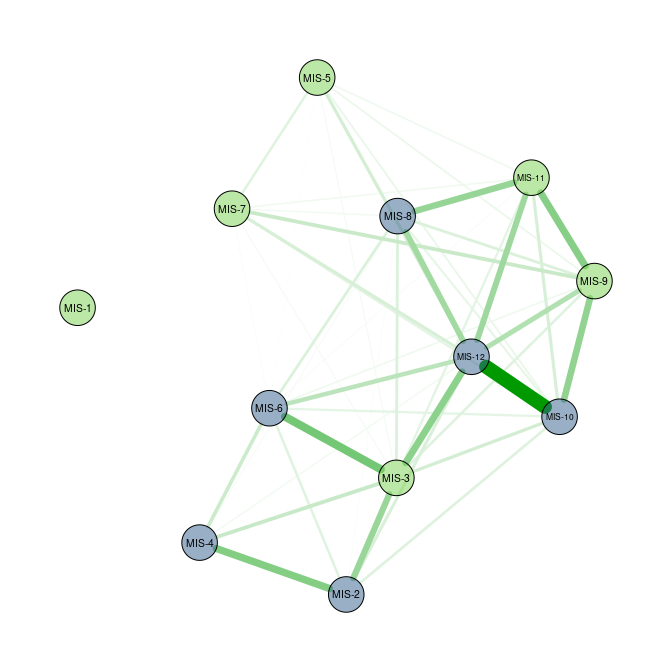
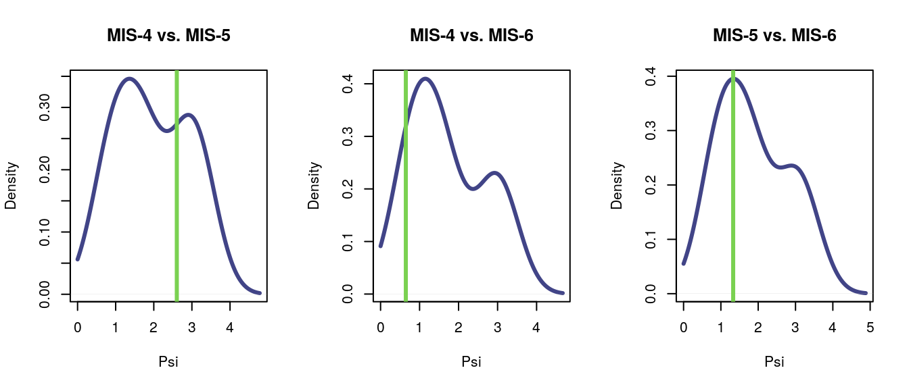
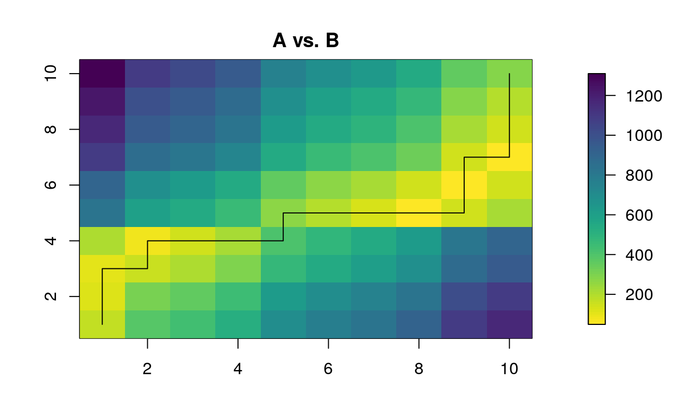

distantia: an R package to compute the dissimilarity between
multivariate time-series
================

<!-- README.md is generated from README.Rmd. Please edit that file -->

<!-- badges: start -->

[](https://zenodo.org/badge/latestdoi/187805264)

<!-- badges: end -->

## Summary

The package **distantia** allows to measure the dissimilarity between
multivariate time-series (*sequences* hereafter). The package assumes
that the target sequences are ordered along a given dimension, being
depth and time the most common ones, but others such as latitude or
elevation are also suitable. Furthermore, the target sequences can be
regular or irregular, and have their samples aligned (same
age/time/depth) or unaligned (different age/time/depth). The only
requirement is that the sequences must have at least two (but ideally
more) columns with the same name and units.

In this document I briefly explain the logics behind the method, show
how to use it, and demonstrate how the **distantia** package introduces
useful tools to compare multivariate time-series. The topics covered in
this document are:

  - Installation of the package.
  - Comparing two irregular non-aligned sequences.
  - Comparing multiple irregular non-aligned sequences.
  - Comparing regular aligned sequences.
  - Restricted permutation test to assess the significance of
    dissimilarity values.
  - Assessing the contribution of a variable to the dissimilarity
    between two sequences.
  - Finding the section in a long sequence more similar to a given short
    sequence (irregular sequences).
  - Finding the section in a long sequence more similar to a given short
    sequence (regular sequences).
  - Sequence slotting: combining samples of two sequences into a single
    composite sequence.
  - Tranferring an attribute from one sequence to another: direct and
    interpolated modes.

## Installation

You can install the released version of distantia from
[CRAN](https://CRAN.R-project.org) with:

``` r
install.packages("distantia")
```

And the development version from [GitHub](https://github.com/) with:

``` r
install.packages("devtools")
library(devtools)
devtools::install_github("BlasBenito/distantia")
```

Loading the library, plus other helper libraries:

``` r
library(distantia)
library(ggplot2)
library(viridis)
library(kableExtra)
library(qgraph)
library(tidyr)
```

## Comparing two irregular non-aligned sequences

This section relies on two example datasets based on the Abernethy
pollen core (Birks and Mathewes, 1978):

``` r
data(sequenceA)
data(sequenceB)

str(sequenceA)
#> 'data.frame':    49 obs. of  9 variables:
#>  $ betula: int  79 113 51 130 31 59 78 71 140 150 ...
#>  $ pinus : int  271 320 420 470 450 425 386 397 310 323 ...
#>  $ corylu: int  36 42 39 6 6 12 29 52 50 34 ...
#>  $ junipe: int  0 0 0 0 0 0 2 2 2 2 ...
#>  $ empetr: int  4 4 2 0 3 0 0 0 0 0 ...
#>  $ gramin: int  7 3 1 2 2 2 0 6 4 11 ...
#>  $ cypera: int  25 11 12 4 3 3 2 3 3 2 ...
#>  $ artemi: int  0 0 0 0 0 0 0 0 0 0 ...
#>  $ rumex : int  0 0 0 0 0 0 0 0 0 0 ...
str(sequenceB)
#> 'data.frame':    41 obs. of  8 variables:
#>  $ betula: int  19 18 30 26 31 24 23 48 29 23 ...
#>  $ pinus : int  175 119 99 101 99 97 105 112 108 110 ...
#>  $ corylu: int  NA 28 37 29 30 28 34 46 16 21 ...
#>  $ junipe: int  2 1 0 0 0 0 0 0 0 0 ...
#>  $ gramin: int  34 36 2 0 1 2 1 0 6 2 ...
#>  $ cypera: int  39 44 20 18 10 9 6 12 3 11 ...
#>  $ artemi: int  1 0 0 0 0 0 0 0 0 0 ...
#>  $ rumex : int  0 4 1 0 0 0 0 0 0 1 ...

kable(sequenceA[1:15, ], caption = "Sequence A")
```

<table>

<caption>

Sequence A

</caption>

<thead>

<tr>

<th style="text-align:right;">

betula

</th>

<th style="text-align:right;">

pinus

</th>

<th style="text-align:right;">

corylu

</th>

<th style="text-align:right;">

junipe

</th>

<th style="text-align:right;">

empetr

</th>

<th style="text-align:right;">

gramin

</th>

<th style="text-align:right;">

cypera

</th>

<th style="text-align:right;">

artemi

</th>

<th style="text-align:right;">

rumex

</th>

</tr>

</thead>

<tbody>

<tr>

<td style="text-align:right;">

79

</td>

<td style="text-align:right;">

271

</td>

<td style="text-align:right;">

36

</td>

<td style="text-align:right;">

0

</td>

<td style="text-align:right;">

4

</td>

<td style="text-align:right;">

7

</td>

<td style="text-align:right;">

25

</td>

<td style="text-align:right;">

0

</td>

<td style="text-align:right;">

0

</td>

</tr>

<tr>

<td style="text-align:right;">

113

</td>

<td style="text-align:right;">

320

</td>

<td style="text-align:right;">

42

</td>

<td style="text-align:right;">

0

</td>

<td style="text-align:right;">

4

</td>

<td style="text-align:right;">

3

</td>

<td style="text-align:right;">

11

</td>

<td style="text-align:right;">

0

</td>

<td style="text-align:right;">

0

</td>

</tr>

<tr>

<td style="text-align:right;">

51

</td>

<td style="text-align:right;">

420

</td>

<td style="text-align:right;">

39

</td>

<td style="text-align:right;">

0

</td>

<td style="text-align:right;">

2

</td>

<td style="text-align:right;">

1

</td>

<td style="text-align:right;">

12

</td>

<td style="text-align:right;">

0

</td>

<td style="text-align:right;">

0

</td>

</tr>

<tr>

<td style="text-align:right;">

130

</td>

<td style="text-align:right;">

470

</td>

<td style="text-align:right;">

6

</td>

<td style="text-align:right;">

0

</td>

<td style="text-align:right;">

0

</td>

<td style="text-align:right;">

2

</td>

<td style="text-align:right;">

4

</td>

<td style="text-align:right;">

0

</td>

<td style="text-align:right;">

0

</td>

</tr>

<tr>

<td style="text-align:right;">

31

</td>

<td style="text-align:right;">

450

</td>

<td style="text-align:right;">

6

</td>

<td style="text-align:right;">

0

</td>

<td style="text-align:right;">

3

</td>

<td style="text-align:right;">

2

</td>

<td style="text-align:right;">

3

</td>

<td style="text-align:right;">

0

</td>

<td style="text-align:right;">

0

</td>

</tr>

<tr>

<td style="text-align:right;">

59

</td>

<td style="text-align:right;">

425

</td>

<td style="text-align:right;">

12

</td>

<td style="text-align:right;">

0

</td>

<td style="text-align:right;">

0

</td>

<td style="text-align:right;">

2

</td>

<td style="text-align:right;">

3

</td>

<td style="text-align:right;">

0

</td>

<td style="text-align:right;">

0

</td>

</tr>

<tr>

<td style="text-align:right;">

78

</td>

<td style="text-align:right;">

386

</td>

<td style="text-align:right;">

29

</td>

<td style="text-align:right;">

2

</td>

<td style="text-align:right;">

0

</td>

<td style="text-align:right;">

0

</td>

<td style="text-align:right;">

2

</td>

<td style="text-align:right;">

0

</td>

<td style="text-align:right;">

0

</td>

</tr>

<tr>

<td style="text-align:right;">

71

</td>

<td style="text-align:right;">

397

</td>

<td style="text-align:right;">

52

</td>

<td style="text-align:right;">

2

</td>

<td style="text-align:right;">

0

</td>

<td style="text-align:right;">

6

</td>

<td style="text-align:right;">

3

</td>

<td style="text-align:right;">

0

</td>

<td style="text-align:right;">

0

</td>

</tr>

<tr>

<td style="text-align:right;">

140

</td>

<td style="text-align:right;">

310

</td>

<td style="text-align:right;">

50

</td>

<td style="text-align:right;">

2

</td>

<td style="text-align:right;">

0

</td>

<td style="text-align:right;">

4

</td>

<td style="text-align:right;">

3

</td>

<td style="text-align:right;">

0

</td>

<td style="text-align:right;">

0

</td>

</tr>

<tr>

<td style="text-align:right;">

150

</td>

<td style="text-align:right;">

323

</td>

<td style="text-align:right;">

34

</td>

<td style="text-align:right;">

2

</td>

<td style="text-align:right;">

0

</td>

<td style="text-align:right;">

11

</td>

<td style="text-align:right;">

2

</td>

<td style="text-align:right;">

0

</td>

<td style="text-align:right;">

0

</td>

</tr>

<tr>

<td style="text-align:right;">

175

</td>

<td style="text-align:right;">

317

</td>

<td style="text-align:right;">

37

</td>

<td style="text-align:right;">

2

</td>

<td style="text-align:right;">

0

</td>

<td style="text-align:right;">

11

</td>

<td style="text-align:right;">

3

</td>

<td style="text-align:right;">

0

</td>

<td style="text-align:right;">

0

</td>

</tr>

<tr>

<td style="text-align:right;">

181

</td>

<td style="text-align:right;">

345

</td>

<td style="text-align:right;">

28

</td>

<td style="text-align:right;">

3

</td>

<td style="text-align:right;">

0

</td>

<td style="text-align:right;">

7

</td>

<td style="text-align:right;">

3

</td>

<td style="text-align:right;">

0

</td>

<td style="text-align:right;">

0

</td>

</tr>

<tr>

<td style="text-align:right;">

153

</td>

<td style="text-align:right;">

285

</td>

<td style="text-align:right;">

36

</td>

<td style="text-align:right;">

2

</td>

<td style="text-align:right;">

0

</td>

<td style="text-align:right;">

8

</td>

<td style="text-align:right;">

3

</td>

<td style="text-align:right;">

0

</td>

<td style="text-align:right;">

1

</td>

</tr>

<tr>

<td style="text-align:right;">

214

</td>

<td style="text-align:right;">

315

</td>

<td style="text-align:right;">

54

</td>

<td style="text-align:right;">

2

</td>

<td style="text-align:right;">

1

</td>

<td style="text-align:right;">

13

</td>

<td style="text-align:right;">

5

</td>

<td style="text-align:right;">

0

</td>

<td style="text-align:right;">

0

</td>

</tr>

<tr>

<td style="text-align:right;">

200

</td>

<td style="text-align:right;">

210

</td>

<td style="text-align:right;">

41

</td>

<td style="text-align:right;">

6

</td>

<td style="text-align:right;">

0

</td>

<td style="text-align:right;">

10

</td>

<td style="text-align:right;">

4

</td>

<td style="text-align:right;">

0

</td>

<td style="text-align:right;">

0

</td>

</tr>

</tbody>

</table>

``` r
kable(sequenceB[1:15, ], caption = "Sequence B")
```

<table>

<caption>

Sequence B

</caption>

<thead>

<tr>

<th style="text-align:right;">

betula

</th>

<th style="text-align:right;">

pinus

</th>

<th style="text-align:right;">

corylu

</th>

<th style="text-align:right;">

junipe

</th>

<th style="text-align:right;">

gramin

</th>

<th style="text-align:right;">

cypera

</th>

<th style="text-align:right;">

artemi

</th>

<th style="text-align:right;">

rumex

</th>

</tr>

</thead>

<tbody>

<tr>

<td style="text-align:right;">

19

</td>

<td style="text-align:right;">

175

</td>

<td style="text-align:right;">

NA

</td>

<td style="text-align:right;">

2

</td>

<td style="text-align:right;">

34

</td>

<td style="text-align:right;">

39

</td>

<td style="text-align:right;">

1

</td>

<td style="text-align:right;">

0

</td>

</tr>

<tr>

<td style="text-align:right;">

18

</td>

<td style="text-align:right;">

119

</td>

<td style="text-align:right;">

28

</td>

<td style="text-align:right;">

1

</td>

<td style="text-align:right;">

36

</td>

<td style="text-align:right;">

44

</td>

<td style="text-align:right;">

0

</td>

<td style="text-align:right;">

4

</td>

</tr>

<tr>

<td style="text-align:right;">

30

</td>

<td style="text-align:right;">

99

</td>

<td style="text-align:right;">

37

</td>

<td style="text-align:right;">

0

</td>

<td style="text-align:right;">

2

</td>

<td style="text-align:right;">

20

</td>

<td style="text-align:right;">

0

</td>

<td style="text-align:right;">

1

</td>

</tr>

<tr>

<td style="text-align:right;">

26

</td>

<td style="text-align:right;">

101

</td>

<td style="text-align:right;">

29

</td>

<td style="text-align:right;">

0

</td>

<td style="text-align:right;">

0

</td>

<td style="text-align:right;">

18

</td>

<td style="text-align:right;">

0

</td>

<td style="text-align:right;">

0

</td>

</tr>

<tr>

<td style="text-align:right;">

31

</td>

<td style="text-align:right;">

99

</td>

<td style="text-align:right;">

30

</td>

<td style="text-align:right;">

0

</td>

<td style="text-align:right;">

1

</td>

<td style="text-align:right;">

10

</td>

<td style="text-align:right;">

0

</td>

<td style="text-align:right;">

0

</td>

</tr>

<tr>

<td style="text-align:right;">

24

</td>

<td style="text-align:right;">

97

</td>

<td style="text-align:right;">

28

</td>

<td style="text-align:right;">

0

</td>

<td style="text-align:right;">

2

</td>

<td style="text-align:right;">

9

</td>

<td style="text-align:right;">

0

</td>

<td style="text-align:right;">

0

</td>

</tr>

<tr>

<td style="text-align:right;">

23

</td>

<td style="text-align:right;">

105

</td>

<td style="text-align:right;">

34

</td>

<td style="text-align:right;">

0

</td>

<td style="text-align:right;">

1

</td>

<td style="text-align:right;">

6

</td>

<td style="text-align:right;">

0

</td>

<td style="text-align:right;">

0

</td>

</tr>

<tr>

<td style="text-align:right;">

48

</td>

<td style="text-align:right;">

112

</td>

<td style="text-align:right;">

46

</td>

<td style="text-align:right;">

0

</td>

<td style="text-align:right;">

0

</td>

<td style="text-align:right;">

12

</td>

<td style="text-align:right;">

0

</td>

<td style="text-align:right;">

0

</td>

</tr>

<tr>

<td style="text-align:right;">

29

</td>

<td style="text-align:right;">

108

</td>

<td style="text-align:right;">

16

</td>

<td style="text-align:right;">

0

</td>

<td style="text-align:right;">

6

</td>

<td style="text-align:right;">

3

</td>

<td style="text-align:right;">

0

</td>

<td style="text-align:right;">

0

</td>

</tr>

<tr>

<td style="text-align:right;">

23

</td>

<td style="text-align:right;">

110

</td>

<td style="text-align:right;">

21

</td>

<td style="text-align:right;">

0

</td>

<td style="text-align:right;">

2

</td>

<td style="text-align:right;">

11

</td>

<td style="text-align:right;">

0

</td>

<td style="text-align:right;">

1

</td>

</tr>

<tr>

<td style="text-align:right;">

5

</td>

<td style="text-align:right;">

119

</td>

<td style="text-align:right;">

19

</td>

<td style="text-align:right;">

0

</td>

<td style="text-align:right;">

1

</td>

<td style="text-align:right;">

1

</td>

<td style="text-align:right;">

0

</td>

<td style="text-align:right;">

0

</td>

</tr>

<tr>

<td style="text-align:right;">

30

</td>

<td style="text-align:right;">

105

</td>

<td style="text-align:right;">

NA

</td>

<td style="text-align:right;">

0

</td>

<td style="text-align:right;">

9

</td>

<td style="text-align:right;">

7

</td>

<td style="text-align:right;">

0

</td>

<td style="text-align:right;">

0

</td>

</tr>

<tr>

<td style="text-align:right;">

22

</td>

<td style="text-align:right;">

116

</td>

<td style="text-align:right;">

17

</td>

<td style="text-align:right;">

0

</td>

<td style="text-align:right;">

1

</td>

<td style="text-align:right;">

7

</td>

<td style="text-align:right;">

0

</td>

<td style="text-align:right;">

0

</td>

</tr>

<tr>

<td style="text-align:right;">

24

</td>

<td style="text-align:right;">

115

</td>

<td style="text-align:right;">

20

</td>

<td style="text-align:right;">

0

</td>

<td style="text-align:right;">

2

</td>

<td style="text-align:right;">

4

</td>

<td style="text-align:right;">

0

</td>

<td style="text-align:right;">

0

</td>

</tr>

<tr>

<td style="text-align:right;">

26

</td>

<td style="text-align:right;">

119

</td>

<td style="text-align:right;">

23

</td>

<td style="text-align:right;">

0

</td>

<td style="text-align:right;">

4

</td>

<td style="text-align:right;">

0

</td>

<td style="text-align:right;">

0

</td>

<td style="text-align:right;">

0

</td>

</tr>

</tbody>

</table>

Notice that **sequenceB** has a few NA values (that were introduced to
serve as an example). The function **prepareSequences** gets them ready
for analysis by matching colum names and handling empty data. It allows
to merge two (or more) multivariate time-series into a single table
ready for further analyses. Note that, since the data represents pollen
abundances, a *Hellinger* transformation (square root of the relative
proportions of each taxa) is applied.

``` r
AB.sequences <- prepareSequences(
  sequence.A = sequenceA,
  sequence.A.name = "A",
  sequence.B = sequenceB,
  sequence.B.name = "B",
  merge.mode = "complete",
  if.empty.cases = "zero",
  transformation = "hellinger"
)

kable(AB.sequences[1:15, ], digits = 4)
```

<table>

<thead>

<tr>

<th style="text-align:left;">

id

</th>

<th style="text-align:right;">

betula

</th>

<th style="text-align:right;">

pinus

</th>

<th style="text-align:right;">

corylu

</th>

<th style="text-align:right;">

junipe

</th>

<th style="text-align:right;">

empetr

</th>

<th style="text-align:right;">

gramin

</th>

<th style="text-align:right;">

cypera

</th>

<th style="text-align:right;">

artemi

</th>

<th style="text-align:right;">

rumex

</th>

</tr>

</thead>

<tbody>

<tr>

<td style="text-align:left;">

A

</td>

<td style="text-align:right;">

0.4327

</td>

<td style="text-align:right;">

0.8014

</td>

<td style="text-align:right;">

0.2921

</td>

<td style="text-align:right;">

0.0002

</td>

<td style="text-align:right;">

0.0974

</td>

<td style="text-align:right;">

0.1288

</td>

<td style="text-align:right;">

0.2434

</td>

<td style="text-align:right;">

2e-04

</td>

<td style="text-align:right;">

0.0002

</td>

</tr>

<tr>

<td style="text-align:left;">

A

</td>

<td style="text-align:right;">

0.4788

</td>

<td style="text-align:right;">

0.8057

</td>

<td style="text-align:right;">

0.2919

</td>

<td style="text-align:right;">

0.0001

</td>

<td style="text-align:right;">

0.0901

</td>

<td style="text-align:right;">

0.0780

</td>

<td style="text-align:right;">

0.1494

</td>

<td style="text-align:right;">

1e-04

</td>

<td style="text-align:right;">

0.0001

</td>

</tr>

<tr>

<td style="text-align:left;">

A

</td>

<td style="text-align:right;">

0.3117

</td>

<td style="text-align:right;">

0.8944

</td>

<td style="text-align:right;">

0.2726

</td>

<td style="text-align:right;">

0.0001

</td>

<td style="text-align:right;">

0.0617

</td>

<td style="text-align:right;">

0.0436

</td>

<td style="text-align:right;">

0.1512

</td>

<td style="text-align:right;">

1e-04

</td>

<td style="text-align:right;">

0.0001

</td>

</tr>

<tr>

<td style="text-align:left;">

A

</td>

<td style="text-align:right;">

0.4609

</td>

<td style="text-align:right;">

0.8763

</td>

<td style="text-align:right;">

0.0990

</td>

<td style="text-align:right;">

0.0001

</td>

<td style="text-align:right;">

0.0001

</td>

<td style="text-align:right;">

0.0572

</td>

<td style="text-align:right;">

0.0808

</td>

<td style="text-align:right;">

1e-04

</td>

<td style="text-align:right;">

0.0001

</td>

</tr>

<tr>

<td style="text-align:left;">

A

</td>

<td style="text-align:right;">

0.2503

</td>

<td style="text-align:right;">

0.9535

</td>

<td style="text-align:right;">

0.1101

</td>

<td style="text-align:right;">

0.0001

</td>

<td style="text-align:right;">

0.0778

</td>

<td style="text-align:right;">

0.0636

</td>

<td style="text-align:right;">

0.0778

</td>

<td style="text-align:right;">

1e-04

</td>

<td style="text-align:right;">

0.0001

</td>

</tr>

<tr>

<td style="text-align:left;">

A

</td>

<td style="text-align:right;">

0.3432

</td>

<td style="text-align:right;">

0.9210

</td>

<td style="text-align:right;">

0.1548

</td>

<td style="text-align:right;">

0.0001

</td>

<td style="text-align:right;">

0.0001

</td>

<td style="text-align:right;">

0.0632

</td>

<td style="text-align:right;">

0.0774

</td>

<td style="text-align:right;">

1e-04

</td>

<td style="text-align:right;">

0.0001

</td>

</tr>

<tr>

<td style="text-align:left;">

A

</td>

<td style="text-align:right;">

0.3962

</td>

<td style="text-align:right;">

0.8813

</td>

<td style="text-align:right;">

0.2416

</td>

<td style="text-align:right;">

0.0634

</td>

<td style="text-align:right;">

0.0001

</td>

<td style="text-align:right;">

0.0001

</td>

<td style="text-align:right;">

0.0634

</td>

<td style="text-align:right;">

1e-04

</td>

<td style="text-align:right;">

0.0001

</td>

</tr>

<tr>

<td style="text-align:left;">

A

</td>

<td style="text-align:right;">

0.3657

</td>

<td style="text-align:right;">

0.8647

</td>

<td style="text-align:right;">

0.3129

</td>

<td style="text-align:right;">

0.0614

</td>

<td style="text-align:right;">

0.0001

</td>

<td style="text-align:right;">

0.1063

</td>

<td style="text-align:right;">

0.0752

</td>

<td style="text-align:right;">

1e-04

</td>

<td style="text-align:right;">

0.0001

</td>

</tr>

<tr>

<td style="text-align:left;">

A

</td>

<td style="text-align:right;">

0.5245

</td>

<td style="text-align:right;">

0.7804

</td>

<td style="text-align:right;">

0.3134

</td>

<td style="text-align:right;">

0.0627

</td>

<td style="text-align:right;">

0.0001

</td>

<td style="text-align:right;">

0.0886

</td>

<td style="text-align:right;">

0.0768

</td>

<td style="text-align:right;">

1e-04

</td>

<td style="text-align:right;">

0.0001

</td>

</tr>

<tr>

<td style="text-align:left;">

A

</td>

<td style="text-align:right;">

0.5361

</td>

<td style="text-align:right;">

0.7866

</td>

<td style="text-align:right;">

0.2552

</td>

<td style="text-align:right;">

0.0619

</td>

<td style="text-align:right;">

0.0001

</td>

<td style="text-align:right;">

0.1452

</td>

<td style="text-align:right;">

0.0619

</td>

<td style="text-align:right;">

1e-04

</td>

<td style="text-align:right;">

0.0001

</td>

</tr>

<tr>

<td style="text-align:left;">

A

</td>

<td style="text-align:right;">

0.5667

</td>

<td style="text-align:right;">

0.7627

</td>

<td style="text-align:right;">

0.2606

</td>

<td style="text-align:right;">

0.0606

</td>

<td style="text-align:right;">

0.0001

</td>

<td style="text-align:right;">

0.1421

</td>

<td style="text-align:right;">

0.0742

</td>

<td style="text-align:right;">

1e-04

</td>

<td style="text-align:right;">

0.0001

</td>

</tr>

<tr>

<td style="text-align:left;">

A

</td>

<td style="text-align:right;">

0.5650

</td>

<td style="text-align:right;">

0.7800

</td>

<td style="text-align:right;">

0.2222

</td>

<td style="text-align:right;">

0.0727

</td>

<td style="text-align:right;">

0.0001

</td>

<td style="text-align:right;">

0.1111

</td>

<td style="text-align:right;">

0.0727

</td>

<td style="text-align:right;">

1e-04

</td>

<td style="text-align:right;">

0.0001

</td>

</tr>

<tr>

<td style="text-align:left;">

A

</td>

<td style="text-align:right;">

0.5599

</td>

<td style="text-align:right;">

0.7642

</td>

<td style="text-align:right;">

0.2716

</td>

<td style="text-align:right;">

0.0640

</td>

<td style="text-align:right;">

0.0001

</td>

<td style="text-align:right;">

0.1280

</td>

<td style="text-align:right;">

0.0784

</td>

<td style="text-align:right;">

1e-04

</td>

<td style="text-align:right;">

0.0453

</td>

</tr>

<tr>

<td style="text-align:left;">

A

</td>

<td style="text-align:right;">

0.5952

</td>

<td style="text-align:right;">

0.7222

</td>

<td style="text-align:right;">

0.2990

</td>

<td style="text-align:right;">

0.0575

</td>

<td style="text-align:right;">

0.0407

</td>

<td style="text-align:right;">

0.1467

</td>

<td style="text-align:right;">

0.0910

</td>

<td style="text-align:right;">

1e-04

</td>

<td style="text-align:right;">

0.0001

</td>

</tr>

<tr>

<td style="text-align:left;">

A

</td>

<td style="text-align:right;">

0.6516

</td>

<td style="text-align:right;">

0.6677

</td>

<td style="text-align:right;">

0.2950

</td>

<td style="text-align:right;">

0.1129

</td>

<td style="text-align:right;">

0.0001

</td>

<td style="text-align:right;">

0.1457

</td>

<td style="text-align:right;">

0.0922

</td>

<td style="text-align:right;">

1e-04

</td>

<td style="text-align:right;">

0.0001

</td>

</tr>

</tbody>

</table>

The computation of dissimilarity between two multivariate sequences
requires several steps.

**1. Computation of a distance matrix** among the samples of both
sequences. It is computed by the **distanceMatrix** function, which
allows the user to select a distance metric (so far the ones implemented
are *manhattan*, *euclidean*, *chi*, and *hellinger*). The function
**plotMatrix** allows an easy visualization of the distance matrix.

``` r
#computing distance matrix
AB.distance.matrix <- distanceMatrix(
  sequences = AB.sequences,
  method = "manhattan"
)

#plotting distance matrix
plotMatrix(
  distance.matrix = AB.distance.matrix,
  color.palette = "viridis")
```


**2. Computation of the least-cost path within the distance matrix.**
This step uses a *dynamic programming algorithm* to find the least-cost
when moving between the cell 1,1 of the matrix (lower left in the image
above) and the last cell of the matrix (opposite corner). It does so by
solving first every partial solution (in the neighborhood of every cell
in the matrix), and then propagating the sum towards the opposite
extreme of the matrix. It can be done in two different ways, the first
involving an orthogonal search only (either one step on the *x* axis or
one step on the *y* axis at a time), or can include a diagonal search as
well (the previous one plus the possibility of moving one step along
both axes simultaneously). The boolean argumnet *diagonal* controls what
option is being used (diagonals are used when it is set to *TRUE*)

The value of the upper-right cell in the plotted matrix (actually, the
lower-right cell in the actual data matrix, the matrix is rotated in the
plot) is the sum of the minimum distance across all samples of both
time-series.

``` r
AB.least.cost.matrix <- leastCostMatrix(
  distance.matrix = AB.distance.matrix,
  diagonal = FALSE
)
```

The function **leastCostPath** finds the least-cost path in the matrix
above. It returns a dataframe with the coordinates of the cells within
the path, the distance between consecutive cells, and the cumulative
distance of any given step in the path. It can be used to plot the path,
which helps to better understand the alignmnet between both sequences.

``` r
AB.least.cost.path <- leastCostPath(
  distance.matrix = AB.distance.matrix,
  least.cost.matrix = AB.least.cost.matrix,
  diagonal = FALSE
  )

kable(AB.least.cost.path[[1]][1:15, ], digits = 4)
```

<table>

<thead>

<tr>

<th style="text-align:right;">

A

</th>

<th style="text-align:right;">

B

</th>

<th style="text-align:right;">

distance

</th>

<th style="text-align:right;">

cumulative.distance

</th>

</tr>

</thead>

<tbody>

<tr>

<td style="text-align:right;">

49

</td>

<td style="text-align:right;">

41

</td>

<td style="text-align:right;">

2.0278

</td>

<td style="text-align:right;">

77.5398

</td>

</tr>

<tr>

<td style="text-align:right;">

49

</td>

<td style="text-align:right;">

40

</td>

<td style="text-align:right;">

1.7083

</td>

<td style="text-align:right;">

74.4425

</td>

</tr>

<tr>

<td style="text-align:right;">

48

</td>

<td style="text-align:right;">

40

</td>

<td style="text-align:right;">

1.0461

</td>

<td style="text-align:right;">

72.7342

</td>

</tr>

<tr>

<td style="text-align:right;">

48

</td>

<td style="text-align:right;">

39

</td>

<td style="text-align:right;">

0.9972

</td>

<td style="text-align:right;">

71.6881

</td>

</tr>

<tr>

<td style="text-align:right;">

47

</td>

<td style="text-align:right;">

39

</td>

<td style="text-align:right;">

1.0389

</td>

<td style="text-align:right;">

70.6909

</td>

</tr>

<tr>

<td style="text-align:right;">

46

</td>

<td style="text-align:right;">

39

</td>

<td style="text-align:right;">

0.9777

</td>

<td style="text-align:right;">

69.6520

</td>

</tr>

<tr>

<td style="text-align:right;">

45

</td>

<td style="text-align:right;">

39

</td>

<td style="text-align:right;">

1.3507

</td>

<td style="text-align:right;">

68.6743

</td>

</tr>

<tr>

<td style="text-align:right;">

44

</td>

<td style="text-align:right;">

39

</td>

<td style="text-align:right;">

1.3165

</td>

<td style="text-align:right;">

67.3236

</td>

</tr>

<tr>

<td style="text-align:right;">

43

</td>

<td style="text-align:right;">

39

</td>

<td style="text-align:right;">

1.4085

</td>

<td style="text-align:right;">

66.0071

</td>

</tr>

<tr>

<td style="text-align:right;">

42

</td>

<td style="text-align:right;">

39

</td>

<td style="text-align:right;">

1.3132

</td>

<td style="text-align:right;">

64.5986

</td>

</tr>

<tr>

<td style="text-align:right;">

42

</td>

<td style="text-align:right;">

38

</td>

<td style="text-align:right;">

1.5524

</td>

<td style="text-align:right;">

63.2853

</td>

</tr>

<tr>

<td style="text-align:right;">

42

</td>

<td style="text-align:right;">

37

</td>

<td style="text-align:right;">

1.2139

</td>

<td style="text-align:right;">

61.7329

</td>

</tr>

<tr>

<td style="text-align:right;">

42

</td>

<td style="text-align:right;">

36

</td>

<td style="text-align:right;">

1.6284

</td>

<td style="text-align:right;">

60.5191

</td>

</tr>

<tr>

<td style="text-align:right;">

42

</td>

<td style="text-align:right;">

35

</td>

<td style="text-align:right;">

1.7988

</td>

<td style="text-align:right;">

58.8907

</td>

</tr>

<tr>

<td style="text-align:right;">

41

</td>

<td style="text-align:right;">

35

</td>

<td style="text-align:right;">

1.2870

</td>

<td style="text-align:right;">

57.0919

</td>

</tr>

</tbody>

</table>

``` r

par(mfrow=c(2,1))
plotMatrix(
  distance.matrix = AB.least.cost.matrix,
  least.cost.path = AB.least.cost.path,
  color.palette = "viridis"
  )
```


Computing the least-cost path based on diagonals only requires to set
the *diagonal* argument to *TRUE*.

``` r
#computing the least cost using diagonals
AB.least.cost.matrix.diagonal <- leastCostMatrix(
  distance.matrix = AB.distance.matrix,
  diagonal = TRUE
)

#computing least cost path using diagonals
AB.least.cost.path.diagonal <- leastCostPath(
  distance.matrix = AB.distance.matrix,
  least.cost.matrix = AB.least.cost.matrix.diagonal,
  diagonal = TRUE
  )

plotMatrix(
  distance.matrix = AB.least.cost.matrix.diagonal,
  least.cost.path = AB.least.cost.path.diagonal,
  color.palette = "viridis"
  )
```


Hereafter only the results of the orthogonal search will be shown.

**3. Getting the least-cost value.** The least-cost path file contains
the distances between all samples paired in the least-cost path.

``` r
AB.least.cost <- leastCost(
  least.cost.path = AB.least.cost.path
  )
AB.least.cost
#> $`A|B`
#> [1] 76.47026
```

**4. Autosum, or sum of the distances among adjacent samples on each
sequence.** This is another requirement to compute a normalized measure
of dissimilarity. It just computes the distance between adjacent samples
of each sequence and sums them up. Notice that the output is a list with
named slots. Lists are the main output device of this package, I’ll
explain later why.

``` r
AB.autosum <- autoSum(
  sequences = AB.sequences,
  named.list = AB.least.cost,
  method = "manhattan"
  )
AB.autosum
#> $`A|B`
#> [1] 46.86205
```

**5. Compute dissimilarity.** The dissimilarity measure used in this
package is named **psi**, that was first described in the book
[“Numerical methods in Quaternary pollen
analysis”](https://onlinelibrary.wiley.com/doi/abs/10.1002/gea.3340010406)
(Birks and Gordon, 1985). **Psi** is computed as follows:

  
}{\\sum{A_{i-j}} + \\sum{B_{i-j}}} +1")  

where:

  -  is the sum of
    diatances of the least-cost
    path.
  -  is the autosum of one of the
    sequences.
  -  is the autosum of the other sequence.

Which basically is the least-cost normalizado by the autosum of both
sequences. The **psi** function only requires the least cost, and the
autosum of both sequences, as follows. Notice that in the output list,
the slot with the psi value is named after the two sequences separated
by a vertical line (“A|B”). This convention will be followed by any
function in the package that returns objects resulting from comparing
two sequences.

``` r
AB.psi <- psi(
  least.cost = AB.least.cost,
  autosum = AB.autosum
  )
AB.psi
#> $`A|B`
#> [1] 2.263633
```

In any case, the output of **psi** is a list, that can be transformed to
a dataframe or a matrix by using the **formatPsi** function.

``` r
#to dataframe
AB.psi.dataframe <- formatPsi(
  psi.values = AB.psi,
  to = "dataframe")
kable(AB.psi.dataframe, digits = 4)
```

<table>

<thead>

<tr>

<th style="text-align:left;">

A

</th>

<th style="text-align:left;">

B

</th>

<th style="text-align:right;">

psi

</th>

</tr>

</thead>

<tbody>

<tr>

<td style="text-align:left;">

A

</td>

<td style="text-align:left;">

B

</td>

<td style="text-align:right;">

2.2636

</td>

</tr>

</tbody>

</table>

All the steps required to compute **psi**, including the format options
provided by **formatPsi** are wrapped together in the function
**workflowPsi**, that works as follows with its default configuration:

``` r
AB.psi <- workflowPsi(
  sequences = AB.sequences,
  grouping.column = "id"
)
AB.psi
#>   A B      psi
#> 1 A B 2.263633
```

The function allows to exclude particular columns from the analysis
(argument *exclude.columns*), select different distance metrics
(argument *method*), use diagonals to find the least-cost path (argument
*diagonal*), or measure psi by ignoring blocks in the least-cost path
(argument *ignore.blocks*). Since we have observed several blocks in the
least-cost path, below we compute psi by ignoring them. This will lead
to a lower psi value.

``` r
AB.psi.no.blocks <- workflowPsi(
  sequences = AB.sequences,
  grouping.column = "id",
  ignore.blocks = TRUE
)
AB.psi.no.blocks
#>   A B      psi
#> 1 A B 1.635143
```

# Comparing multiple irregular non-aligned sequences

The package can work seamlessly with any given number of sequences, as
long as there is memory enough available. To do so, almost every
function uses the package
[“foreach”](https://CRAN.R-project.org/package=foreach), that allows
to parallelize the execution of the functions by using all the
processors in your machine but one. This speeds up operations
considerably.

The example dataset *sequencesMIS* contains 12 sections of the same
sequence belonging to different marine isotopic stages identified by a
column named “MIS”. MIS stages with odd numbers are generally
interpreted as warm periods (interglacials), while the odd ones are
interpreted as cold periods (glacials). In any case, this interpretation
is not important to illustrate this capability of the library.

``` r
data(sequencesMIS)
kable(head(sequencesMIS, n=15), digits = 4)
```

<table>

<thead>

<tr>

<th style="text-align:left;">

MIS

</th>

<th style="text-align:right;">

Quercus

</th>

<th style="text-align:right;">

Betula

</th>

<th style="text-align:right;">

Pinus

</th>

<th style="text-align:right;">

Alnus

</th>

<th style="text-align:right;">

Tilia

</th>

<th style="text-align:right;">

Carpinus

</th>

</tr>

</thead>

<tbody>

<tr>

<td style="text-align:left;">

MIS-1

</td>

<td style="text-align:right;">

55

</td>

<td style="text-align:right;">

1

</td>

<td style="text-align:right;">

5

</td>

<td style="text-align:right;">

3

</td>

<td style="text-align:right;">

4

</td>

<td style="text-align:right;">

5

</td>

</tr>

<tr>

<td style="text-align:left;">

MIS-1

</td>

<td style="text-align:right;">

86

</td>

<td style="text-align:right;">

21

</td>

<td style="text-align:right;">

35

</td>

<td style="text-align:right;">

8

</td>

<td style="text-align:right;">

0

</td>

<td style="text-align:right;">

10

</td>

</tr>

<tr>

<td style="text-align:left;">

MIS-1

</td>

<td style="text-align:right;">

120

</td>

<td style="text-align:right;">

15

</td>

<td style="text-align:right;">

8

</td>

<td style="text-align:right;">

1

</td>

<td style="text-align:right;">

0

</td>

<td style="text-align:right;">

1

</td>

</tr>

<tr>

<td style="text-align:left;">

MIS-1

</td>

<td style="text-align:right;">

138

</td>

<td style="text-align:right;">

16

</td>

<td style="text-align:right;">

12

</td>

<td style="text-align:right;">

6

</td>

<td style="text-align:right;">

1

</td>

<td style="text-align:right;">

3

</td>

</tr>

<tr>

<td style="text-align:left;">

MIS-1

</td>

<td style="text-align:right;">

130

</td>

<td style="text-align:right;">

12

</td>

<td style="text-align:right;">

17

</td>

<td style="text-align:right;">

2

</td>

<td style="text-align:right;">

1

</td>

<td style="text-align:right;">

1

</td>

</tr>

<tr>

<td style="text-align:left;">

MIS-1

</td>

<td style="text-align:right;">

128

</td>

<td style="text-align:right;">

0

</td>

<td style="text-align:right;">

6

</td>

<td style="text-align:right;">

4

</td>

<td style="text-align:right;">

2

</td>

<td style="text-align:right;">

2

</td>

</tr>

<tr>

<td style="text-align:left;">

MIS-1

</td>

<td style="text-align:right;">

140

</td>

<td style="text-align:right;">

0

</td>

<td style="text-align:right;">

19

</td>

<td style="text-align:right;">

9

</td>

<td style="text-align:right;">

4

</td>

<td style="text-align:right;">

0

</td>

</tr>

<tr>

<td style="text-align:left;">

MIS-1

</td>

<td style="text-align:right;">

113

</td>

<td style="text-align:right;">

0

</td>

<td style="text-align:right;">

15

</td>

<td style="text-align:right;">

12

</td>

<td style="text-align:right;">

2

</td>

<td style="text-align:right;">

5

</td>

</tr>

<tr>

<td style="text-align:left;">

MIS-1

</td>

<td style="text-align:right;">

98

</td>

<td style="text-align:right;">

0

</td>

<td style="text-align:right;">

27

</td>

<td style="text-align:right;">

2

</td>

<td style="text-align:right;">

2

</td>

<td style="text-align:right;">

0

</td>

</tr>

<tr>

<td style="text-align:left;">

MIS-1

</td>

<td style="text-align:right;">

92

</td>

<td style="text-align:right;">

1

</td>

<td style="text-align:right;">

16

</td>

<td style="text-align:right;">

7

</td>

<td style="text-align:right;">

3

</td>

<td style="text-align:right;">

0

</td>

</tr>

<tr>

<td style="text-align:left;">

MIS-1

</td>

<td style="text-align:right;">

73

</td>

<td style="text-align:right;">

3

</td>

<td style="text-align:right;">

22

</td>

<td style="text-align:right;">

3

</td>

<td style="text-align:right;">

0

</td>

<td style="text-align:right;">

0

</td>

</tr>

<tr>

<td style="text-align:left;">

MIS-1

</td>

<td style="text-align:right;">

91

</td>

<td style="text-align:right;">

1

</td>

<td style="text-align:right;">

21

</td>

<td style="text-align:right;">

3

</td>

<td style="text-align:right;">

7

</td>

<td style="text-align:right;">

0

</td>

</tr>

<tr>

<td style="text-align:left;">

MIS-1

</td>

<td style="text-align:right;">

148

</td>

<td style="text-align:right;">

1

</td>

<td style="text-align:right;">

22

</td>

<td style="text-align:right;">

1

</td>

<td style="text-align:right;">

4

</td>

<td style="text-align:right;">

0

</td>

</tr>

<tr>

<td style="text-align:left;">

MIS-1

</td>

<td style="text-align:right;">

148

</td>

<td style="text-align:right;">

0

</td>

<td style="text-align:right;">

1

</td>

<td style="text-align:right;">

7

</td>

<td style="text-align:right;">

13

</td>

<td style="text-align:right;">

0

</td>

</tr>

<tr>

<td style="text-align:left;">

MIS-1

</td>

<td style="text-align:right;">

149

</td>

<td style="text-align:right;">

1

</td>

<td style="text-align:right;">

2

</td>

<td style="text-align:right;">

5

</td>

<td style="text-align:right;">

4

</td>

<td style="text-align:right;">

0

</td>

</tr>

</tbody>

</table>

``` r
unique(sequencesMIS$MIS)
#>  [1] "MIS-1"  "MIS-2"  "MIS-3"  "MIS-4"  "MIS-5"  "MIS-6"  "MIS-7" 
#>  [8] "MIS-8"  "MIS-9"  "MIS-10" "MIS-11" "MIS-12"
```

The dataset is checked and prepared with **prepareSequences** (note the
change in the argument *grouping.column*).

``` r
MIS.sequences <- prepareSequences(
  sequences = sequencesMIS,
  grouping.column = "MIS",
  if.empty.cases = "zero",
  transformation = "hellinger"
)
```

The dissimilarity measure **psi** can be computed for every combination
of sequences through the function **workflowPsi** shown below.

``` r
MIS.psi <- workflowPsi(
  sequences = MIS.sequences,
  grouping.column = "MIS",
  method = "euclidean",
  diagonal = FALSE,
  ignore.blocks = TRUE
)

#ordered with lower psi on top
kable(MIS.psi[order(MIS.psi$psi), ], digits = 4)
```

<table>

<thead>

<tr>

<th style="text-align:left;">

</th>

<th style="text-align:left;">

A

</th>

<th style="text-align:left;">

B

</th>

<th style="text-align:right;">

psi

</th>

</tr>

</thead>

<tbody>

<tr>

<td style="text-align:left;">

40

</td>

<td style="text-align:left;">

MIS-5

</td>

<td style="text-align:left;">

MIS-7

</td>

<td style="text-align:right;">

0.7184

</td>

</tr>

<tr>

<td style="text-align:left;">

45

</td>

<td style="text-align:left;">

MIS-5

</td>

<td style="text-align:left;">

MIS-12

</td>

<td style="text-align:right;">

0.7345

</td>

</tr>

<tr>

<td style="text-align:left;">

12

</td>

<td style="text-align:left;">

MIS-2

</td>

<td style="text-align:left;">

MIS-3

</td>

<td style="text-align:right;">

0.7459

</td>

</tr>

<tr>

<td style="text-align:left;">

60

</td>

<td style="text-align:left;">

MIS-8

</td>

<td style="text-align:left;">

MIS-12

</td>

<td style="text-align:right;">

0.7463

</td>

</tr>

<tr>

<td style="text-align:left;">

44

</td>

<td style="text-align:left;">

MIS-5

</td>

<td style="text-align:left;">

MIS-11

</td>

<td style="text-align:right;">

0.7722

</td>

</tr>

<tr>

<td style="text-align:left;">

30

</td>

<td style="text-align:left;">

MIS-3

</td>

<td style="text-align:left;">

MIS-12

</td>

<td style="text-align:right;">

0.8043

</td>

</tr>

<tr>

<td style="text-align:left;">

28

</td>

<td style="text-align:left;">

MIS-3

</td>

<td style="text-align:left;">

MIS-10

</td>

<td style="text-align:right;">

0.9298

</td>

</tr>

<tr>

<td style="text-align:left;">

53

</td>

<td style="text-align:left;">

MIS-7

</td>

<td style="text-align:left;">

MIS-9

</td>

<td style="text-align:right;">

0.9519

</td>

</tr>

<tr>

<td style="text-align:left;">

42

</td>

<td style="text-align:left;">

MIS-5

</td>

<td style="text-align:left;">

MIS-9

</td>

<td style="text-align:right;">

0.9586

</td>

</tr>

<tr>

<td style="text-align:left;">

58

</td>

<td style="text-align:left;">

MIS-8

</td>

<td style="text-align:left;">

MIS-10

</td>

<td style="text-align:right;">

0.9884

</td>

</tr>

<tr>

<td style="text-align:left;">

59

</td>

<td style="text-align:left;">

MIS-8

</td>

<td style="text-align:left;">

MIS-11

</td>

<td style="text-align:right;">

0.9970

</td>

</tr>

<tr>

<td style="text-align:left;">

65

</td>

<td style="text-align:left;">

MIS-10

</td>

<td style="text-align:left;">

MIS-12

</td>

<td style="text-align:right;">

1.0155

</td>

</tr>

<tr>

<td style="text-align:left;">

63

</td>

<td style="text-align:left;">

MIS-9

</td>

<td style="text-align:left;">

MIS-12

</td>

<td style="text-align:right;">

1.0347

</td>

</tr>

<tr>

<td style="text-align:left;">

48

</td>

<td style="text-align:left;">

MIS-6

</td>

<td style="text-align:left;">

MIS-9

</td>

<td style="text-align:right;">

1.0348

</td>

</tr>

<tr>

<td style="text-align:left;">

23

</td>

<td style="text-align:left;">

MIS-3

</td>

<td style="text-align:left;">

MIS-5

</td>

<td style="text-align:right;">

1.0386

</td>

</tr>

<tr>

<td style="text-align:left;">

41

</td>

<td style="text-align:left;">

MIS-5

</td>

<td style="text-align:left;">

MIS-8

</td>

<td style="text-align:right;">

1.0396

</td>

</tr>

<tr>

<td style="text-align:left;">

64

</td>

<td style="text-align:left;">

MIS-10

</td>

<td style="text-align:left;">

MIS-11

</td>

<td style="text-align:right;">

1.0413

</td>

</tr>

<tr>

<td style="text-align:left;">

57

</td>

<td style="text-align:left;">

MIS-8

</td>

<td style="text-align:left;">

MIS-9

</td>

<td style="text-align:right;">

1.0884

</td>

</tr>

<tr>

<td style="text-align:left;">

61

</td>

<td style="text-align:left;">

MIS-9

</td>

<td style="text-align:left;">

MIS-10

</td>

<td style="text-align:right;">

1.1518

</td>

</tr>

<tr>

<td style="text-align:left;">

54

</td>

<td style="text-align:left;">

MIS-7

</td>

<td style="text-align:left;">

MIS-10

</td>

<td style="text-align:right;">

1.1532

</td>

</tr>

<tr>

<td style="text-align:left;">

62

</td>

<td style="text-align:left;">

MIS-9

</td>

<td style="text-align:left;">

MIS-11

</td>

<td style="text-align:right;">

1.1651

</td>

</tr>

<tr>

<td style="text-align:left;">

26

</td>

<td style="text-align:left;">

MIS-3

</td>

<td style="text-align:left;">

MIS-8

</td>

<td style="text-align:right;">

1.1732

</td>

</tr>

<tr>

<td style="text-align:left;">

51

</td>

<td style="text-align:left;">

MIS-6

</td>

<td style="text-align:left;">

MIS-12

</td>

<td style="text-align:right;">

1.1744

</td>

</tr>

<tr>

<td style="text-align:left;">

21

</td>

<td style="text-align:left;">

MIS-2

</td>

<td style="text-align:left;">

MIS-12

</td>

<td style="text-align:right;">

1.1820

</td>

</tr>

<tr>

<td style="text-align:left;">

55

</td>

<td style="text-align:left;">

MIS-7

</td>

<td style="text-align:left;">

MIS-11

</td>

<td style="text-align:right;">

1.1925

</td>

</tr>

<tr>

<td style="text-align:left;">

66

</td>

<td style="text-align:left;">

MIS-11

</td>

<td style="text-align:left;">

MIS-12

</td>

<td style="text-align:right;">

1.1948

</td>

</tr>

<tr>

<td style="text-align:left;">

43

</td>

<td style="text-align:left;">

MIS-5

</td>

<td style="text-align:left;">

MIS-10

</td>

<td style="text-align:right;">

1.2184

</td>

</tr>

<tr>

<td style="text-align:left;">

27

</td>

<td style="text-align:left;">

MIS-3

</td>

<td style="text-align:left;">

MIS-9

</td>

<td style="text-align:right;">

1.2332

</td>

</tr>

<tr>

<td style="text-align:left;">

39

</td>

<td style="text-align:left;">

MIS-5

</td>

<td style="text-align:left;">

MIS-6

</td>

<td style="text-align:right;">

1.2394

</td>

</tr>

<tr>

<td style="text-align:left;">

56

</td>

<td style="text-align:left;">

MIS-7

</td>

<td style="text-align:left;">

MIS-12

</td>

<td style="text-align:right;">

1.2522

</td>

</tr>

<tr>

<td style="text-align:left;">

19

</td>

<td style="text-align:left;">

MIS-2

</td>

<td style="text-align:left;">

MIS-10

</td>

<td style="text-align:right;">

1.2533

</td>

</tr>

<tr>

<td style="text-align:left;">

49

</td>

<td style="text-align:left;">

MIS-6

</td>

<td style="text-align:left;">

MIS-10

</td>

<td style="text-align:right;">

1.2756

</td>

</tr>

<tr>

<td style="text-align:left;">

29

</td>

<td style="text-align:left;">

MIS-3

</td>

<td style="text-align:left;">

MIS-11

</td>

<td style="text-align:right;">

1.2939

</td>

</tr>

<tr>

<td style="text-align:left;">

52

</td>

<td style="text-align:left;">

MIS-7

</td>

<td style="text-align:left;">

MIS-8

</td>

<td style="text-align:right;">

1.3848

</td>

</tr>

<tr>

<td style="text-align:left;">

32

</td>

<td style="text-align:left;">

MIS-4

</td>

<td style="text-align:left;">

MIS-6

</td>

<td style="text-align:right;">

1.3997

</td>

</tr>

<tr>

<td style="text-align:left;">

15

</td>

<td style="text-align:left;">

MIS-2

</td>

<td style="text-align:left;">

MIS-6

</td>

<td style="text-align:right;">

1.4545

</td>

</tr>

<tr>

<td style="text-align:left;">

24

</td>

<td style="text-align:left;">

MIS-3

</td>

<td style="text-align:left;">

MIS-6

</td>

<td style="text-align:right;">

1.4584

</td>

</tr>

<tr>

<td style="text-align:left;">

6

</td>

<td style="text-align:left;">

MIS-1

</td>

<td style="text-align:left;">

MIS-7

</td>

<td style="text-align:right;">

1.4641

</td>

</tr>

<tr>

<td style="text-align:left;">

35

</td>

<td style="text-align:left;">

MIS-4

</td>

<td style="text-align:left;">

MIS-9

</td>

<td style="text-align:right;">

1.5180

</td>

</tr>

<tr>

<td style="text-align:left;">

46

</td>

<td style="text-align:left;">

MIS-6

</td>

<td style="text-align:left;">

MIS-7

</td>

<td style="text-align:right;">

1.5226

</td>

</tr>

<tr>

<td style="text-align:left;">

7

</td>

<td style="text-align:left;">

MIS-1

</td>

<td style="text-align:left;">

MIS-8

</td>

<td style="text-align:right;">

1.5310

</td>

</tr>

<tr>

<td style="text-align:left;">

22

</td>

<td style="text-align:left;">

MIS-3

</td>

<td style="text-align:left;">

MIS-4

</td>

<td style="text-align:right;">

1.5340

</td>

</tr>

<tr>

<td style="text-align:left;">

25

</td>

<td style="text-align:left;">

MIS-3

</td>

<td style="text-align:left;">

MIS-7

</td>

<td style="text-align:right;">

1.5348

</td>

</tr>

<tr>

<td style="text-align:left;">

3

</td>

<td style="text-align:left;">

MIS-1

</td>

<td style="text-align:left;">

MIS-4

</td>

<td style="text-align:right;">

1.5495

</td>

</tr>

<tr>

<td style="text-align:left;">

11

</td>

<td style="text-align:left;">

MIS-1

</td>

<td style="text-align:left;">

MIS-12

</td>

<td style="text-align:right;">

1.5587

</td>

</tr>

<tr>

<td style="text-align:left;">

17

</td>

<td style="text-align:left;">

MIS-2

</td>

<td style="text-align:left;">

MIS-8

</td>

<td style="text-align:right;">

1.5641

</td>

</tr>

<tr>

<td style="text-align:left;">

10

</td>

<td style="text-align:left;">

MIS-1

</td>

<td style="text-align:left;">

MIS-11

</td>

<td style="text-align:right;">

1.5652

</td>

</tr>

<tr>

<td style="text-align:left;">

4

</td>

<td style="text-align:left;">

MIS-1

</td>

<td style="text-align:left;">

MIS-5

</td>

<td style="text-align:right;">

1.5865

</td>

</tr>

<tr>

<td style="text-align:left;">

38

</td>

<td style="text-align:left;">

MIS-4

</td>

<td style="text-align:left;">

MIS-12

</td>

<td style="text-align:right;">

1.5897

</td>

</tr>

<tr>

<td style="text-align:left;">

47

</td>

<td style="text-align:left;">

MIS-6

</td>

<td style="text-align:left;">

MIS-8

</td>

<td style="text-align:right;">

1.6252

</td>

</tr>

<tr>

<td style="text-align:left;">

14

</td>

<td style="text-align:left;">

MIS-2

</td>

<td style="text-align:left;">

MIS-5

</td>

<td style="text-align:right;">

1.6763

</td>

</tr>

<tr>

<td style="text-align:left;">

50

</td>

<td style="text-align:left;">

MIS-6

</td>

<td style="text-align:left;">

MIS-11

</td>

<td style="text-align:right;">

1.7222

</td>

</tr>

<tr>

<td style="text-align:left;">

8

</td>

<td style="text-align:left;">

MIS-1

</td>

<td style="text-align:left;">

MIS-9

</td>

<td style="text-align:right;">

1.7457

</td>

</tr>

<tr>

<td style="text-align:left;">

33

</td>

<td style="text-align:left;">

MIS-4

</td>

<td style="text-align:left;">

MIS-7

</td>

<td style="text-align:right;">

1.7775

</td>

</tr>

<tr>

<td style="text-align:left;">

34

</td>

<td style="text-align:left;">

MIS-4

</td>

<td style="text-align:left;">

MIS-8

</td>

<td style="text-align:right;">

1.8285

</td>

</tr>

<tr>

<td style="text-align:left;">

9

</td>

<td style="text-align:left;">

MIS-1

</td>

<td style="text-align:left;">

MIS-10

</td>

<td style="text-align:right;">

1.8302

</td>

</tr>

<tr>

<td style="text-align:left;">

5

</td>

<td style="text-align:left;">

MIS-1

</td>

<td style="text-align:left;">

MIS-6

</td>

<td style="text-align:right;">

1.8356

</td>

</tr>

<tr>

<td style="text-align:left;">

16

</td>

<td style="text-align:left;">

MIS-2

</td>

<td style="text-align:left;">

MIS-7

</td>

<td style="text-align:right;">

1.9265

</td>

</tr>

<tr>

<td style="text-align:left;">

36

</td>

<td style="text-align:left;">

MIS-4

</td>

<td style="text-align:left;">

MIS-10

</td>

<td style="text-align:right;">

1.9576

</td>

</tr>

<tr>

<td style="text-align:left;">

2

</td>

<td style="text-align:left;">

MIS-1

</td>

<td style="text-align:left;">

MIS-3

</td>

<td style="text-align:right;">

2.0756

</td>

</tr>

<tr>

<td style="text-align:left;">

1

</td>

<td style="text-align:left;">

MIS-1

</td>

<td style="text-align:left;">

MIS-2

</td>

<td style="text-align:right;">

2.0880

</td>

</tr>

<tr>

<td style="text-align:left;">

18

</td>

<td style="text-align:left;">

MIS-2

</td>

<td style="text-align:left;">

MIS-9

</td>

<td style="text-align:right;">

2.1036

</td>

</tr>

<tr>

<td style="text-align:left;">

20

</td>

<td style="text-align:left;">

MIS-2

</td>

<td style="text-align:left;">

MIS-11

</td>

<td style="text-align:right;">

2.5381

</td>

</tr>

<tr>

<td style="text-align:left;">

31

</td>

<td style="text-align:left;">

MIS-4

</td>

<td style="text-align:left;">

MIS-5

</td>

<td style="text-align:right;">

2.9230

</td>

</tr>

<tr>

<td style="text-align:left;">

37

</td>

<td style="text-align:left;">

MIS-4

</td>

<td style="text-align:left;">

MIS-11

</td>

<td style="text-align:right;">

3.1200

</td>

</tr>

<tr>

<td style="text-align:left;">

13

</td>

<td style="text-align:left;">

MIS-2

</td>

<td style="text-align:left;">

MIS-4

</td>

<td style="text-align:right;">

3.5272

</td>

</tr>

</tbody>

</table>

A dataframe like this can be plotted as an adjacency network with the
**qgraph** package as follows:

``` r
#psi values to matrix
MIS.psi.matrix <- formatPsi(
  psi.values = MIS.psi,
  to = "matrix"
)

#dissimilariy to distance
MIS.distance <- 1/MIS.psi.matrix**4

#plotting network
qgraph::qgraph(MIS.distance, 
       layout='spring', 
       vsize=5,
       labels = colnames(MIS.distance),
       colors = viridis::viridis(2, begin = 0.3, end = 0.8, alpha = 0.5, direction = -1)
       )
```


Or as a matrix with **ggplot2**.

``` r
#ordering factors to get a triangular matrix
MIS.psi$A <- factor(MIS.psi$A, levels=unique(sequencesMIS$MIS))
MIS.psi$B <- factor(MIS.psi$B, levels=unique(sequencesMIS$MIS))

#plotting matrix
ggplot(data=na.omit(MIS.psi), aes(x=A, y=B, size=psi, color=psi)) + 
  geom_point() +
  viridis::scale_color_viridis(direction = -1) +
  guides(size = FALSE)
```



The dataframe of dissimilarities between pairs of sequences can be also
used to analyze the drivers of dissimilarity. To do so, attributes such
as differences in time (when sequences represent different times) or
distance (when sequences represent different sites) between sequences,
or differences between physical/climatic attributes between sequences
such as topography or climate can be added to the table, so models such
as  (were A, B, and C are these attributes) can be
fitted.

``` r
#cleaning environment for next example
rm(MIS.distance, MIS.psi, MIS.psi.matrix, MIS.sequences, sequencesMIS)
```

# Comparing regular aligned sequences

This section assumes that the target multivariate time-series have the
same number of samples/rows, and samples have the same time/depth/order
if there is a time/age/depth column available. In this particular case,
distances are computed only between samples with the same
time/depth/order, and no distance matrix (nor least cost analysis) is
required. When the argument *paired.samples* in **prepareSequences** is
set to TRUE, the function checks if the sequences have the same number
of rows, and, if *time.column* is provided, it selects the samples that
have valid time/depth columns for every sequence in the dataset.

Here we test these ideas with the **climate** dataset included in the
library. It represents simulated palaeoclimate over 200 ky. at four
sites identified by the column *sequenceId*. Note that this time the
transformation applied is “scaled”, which uses the **scale** function of
R base to center and scale the data.

``` r
#loading sample data
data(climate)

#preparing sequences
climate <- prepareSequences(
  sequences = climate,
  grouping.column = "sequenceId",
  time.column = "time",
  paired.samples = TRUE,
  transformation = "scale"
  )
```

The function **distancePairedSamples** computes the between paired
samples (same order/time/age/depth), and therefore does not use the
least cost algorithm to minimize the distances between sequences shown
above. If the argument *time.column* is not provided, or if it’s
provided but *same.time* is false, the samples are paired by their order
(first sample of one sequence vs. the first sample of the other
sequence, the second against the second, and so on), and samples that
only have an age for one of the sequences are removed from the
comparison. This is useful to compare subsets of the same sequence, or
subsets of different sequences belonging to different times.

If there is a *time.column* and *same.time* is set to true, only samples
with the same time/age/depth are compared. This is useful to compare
sequences taken at the same time in different sites.

The result is a list, each slot named as the id of the given sequence
according to *grouping.columns*, and containing a vector with pairwise
distances. Each vector position is named after *time.column* if
available.

``` r
climate.distances <- distancePairedSamples(
  sequences = climate,
  grouping.column = "sequenceId",
  time.column = "time",
  same.time = TRUE,
  exclude.columns = NULL,
  method = "euclidean",
  sum.distances = FALSE
  )

str(climate.distances)
#> List of 6
#>  $ 1|2: Named num [1:200] 3.7 3.77 3.63 3.25 2.71 ...
#>   ..- attr(*, "names")= chr [1:200] "1" "2" "3" "4" ...
#>  $ 1|3: Named num [1:200] 1.476 1.014 0.954 0.707 0.575 ...
#>   ..- attr(*, "names")= chr [1:200] "1" "2" "3" "4" ...
#>  $ 1|4: Named num [1:200] 3.91 4.1 4.19 3.83 3.4 ...
#>   ..- attr(*, "names")= chr [1:200] "1" "2" "3" "4" ...
#>  $ 2|3: Named num [1:200] 3.23 3.37 3.09 2.78 2.49 ...
#>   ..- attr(*, "names")= chr [1:200] "1" "2" "3" "4" ...
#>  $ 2|4: Named num [1:200] 0.273 0.375 0.613 0.668 0.842 ...
#>   ..- attr(*, "names")= chr [1:200] "1" "2" "3" "4" ...
#>  $ 3|4: Named num [1:200] 3.38 3.7 3.65 3.37 3.13 ...
#>   ..- attr(*, "names")= chr [1:200] "1" "2" "3" "4" ...
```

If the argument *sum.distances* is set to TRUE, it sums them up, doing
in fact the same work done by **distanceMatrix**, **leastCostMatrix**
and **leastCost** at once.

``` r
climate.distances <- distancePairedSamples(
  sequences = climate,
  grouping.column = "sequenceId",
  time.column = "time",
  exclude.columns = NULL,
  same.time = TRUE,
  method = "euclidean",
  sum.distances = TRUE
  )
climate.distances
#> $`1|2`
#> [1] 481.1319
#> 
#> $`1|3`
#> [1] 390.9833
#> 
#> $`1|4`
#> [1] 578.7799
#> 
#> $`2|3`
#> [1] 461.0812
#> 
#> $`2|4`
#> [1] 372.4791
#> 
#> $`3|4`
#> [1] 433.914
```

Computing *psi* from there only requires the autosum of each sequence,
and the application of the **psi** function.

``` r
#computing autosum
climate.autosum <- autoSum(
  sequences = climate,
  named.list = climate.distances,
  grouping.column = "sequenceId",
  time.column = "time",
  method = "euclidean"
)

#computing psi
climate.psi <- psi(
  least.cost = climate.distances,
  autosum = climate.autosum
)

climate.psi
#> $`1|2`
#> [1] 3.246703
#> 
#> $`1|3`
#> [1] 2.57016
#> 
#> $`1|4`
#> [1] 3.879143
#> 
#> $`2|3`
#> [1] 3.603999
#> 
#> $`2|4`
#> [1] 2.4092
#> 
#> $`3|4`
#> [1] 3.11387
```

The function **workflowPsi** executes this sequences when the argument
*paired.samples* is set to TRUE, as follows.

``` r
climate.psi <- workflowPsi(
  sequences = climate,
  grouping.column = "sequenceId",
  time.column = "time",
  method = "manhattan",
  paired.samples = TRUE, #this bit is important
  format = "dataframe"
)
kable(climate.psi, digits = 4)
```

<table>

<thead>

<tr>

<th style="text-align:left;">

A

</th>

<th style="text-align:left;">

B

</th>

<th style="text-align:right;">

psi

</th>

</tr>

</thead>

<tbody>

<tr>

<td style="text-align:left;">

1

</td>

<td style="text-align:left;">

2

</td>

<td style="text-align:right;">

3.3839

</td>

</tr>

<tr>

<td style="text-align:left;">

1

</td>

<td style="text-align:left;">

3

</td>

<td style="text-align:right;">

2.7732

</td>

</tr>

<tr>

<td style="text-align:left;">

1

</td>

<td style="text-align:left;">

4

</td>

<td style="text-align:right;">

4.0484

</td>

</tr>

<tr>

<td style="text-align:left;">

2

</td>

<td style="text-align:left;">

3

</td>

<td style="text-align:right;">

3.7670

</td>

</tr>

<tr>

<td style="text-align:left;">

2

</td>

<td style="text-align:left;">

4

</td>

<td style="text-align:right;">

2.5570

</td>

</tr>

<tr>

<td style="text-align:left;">

3

</td>

<td style="text-align:left;">

4

</td>

<td style="text-align:right;">

3.1753

</td>

</tr>

</tbody>

</table>

``` r
#cleaning workspace for next example
rm(climate, climate.autosum, climate.distances, climate.psi)
```

# Restricted permutation test to assess the significance of dissimilarity values

One question that may arise when comparing time series is “to what
extent are dissimilarity values random?”. Answering this question
requires to compare a given dissimilarity value (*psi*) with a
distribution of dissimilarity values resulting from chance. However… how
do we simulate chance in a multivariate time-series? The natural answer
is “permutation”. Since samples in a multivariate time-series are
ordered, re-shuffling samples is out of the question, but it is possible
to re-shuffle the values of the variables within each sample. This kind
of permutation is named “restricted permutation”.

A restricted permutation test on *psi* values requires the following
steps:

  - Compute the *real psi* on two given sequences A and B.
  - Repeat the following steps several times (99 to 999):
      - For each case of each column of A and B, randomly apply one of
        these actions:
          - Leave it as is.
          - Replace it with the previous case.
          - Replace it with the next case.
      - Compute *randomized psi* between A and B and store the value.
  - Add *real psi* to the pool of *randomized psi*.
  - Compute the proportion of *randomized psi* that is equal or lower
    than *real psi*.

Such a proportion represents the probability of obtaining a value lower
than *real psi* by chance.

Since the restricted permutation only happens at a local scale within
each column of each sequence, the probability values returned are **very
conservative** and shouldn’t be interpreted in the same way p-values are
interpreted.

The process described above has been implemented in the
**workflowNullPsi** function. We will apply it to three groups of the
*sequencesMIS* dataset.

``` r
#getting example data
data(sequencesMIS)

#working with 3 groups (to make this fast)
sequencesMIS <- sequencesMIS[sequencesMIS$MIS %in% c("MIS-4", "MIS-5", "MIS-6"),]

#preparing sequences
sequencesMIS <- prepareSequences(
  sequences = sequencesMIS,
  grouping.column = "MIS",
  transformation = "hellinger"
)
```

The computation of the null psi values goes as follows:

``` r
random.psi <- workflowNullPsi(
  sequences = sequencesMIS,
  grouping.column = "MIS",
  method = "euclidean",
  paired.samples = FALSE,
  repetitions = 9 #recommended values: 99, 999
)
```

Note that the number of repetitions has been set to 9 in order to
speed-up execution. The actual number should be 99, and ideally, 999.

The output is a list with two dataframes, **psi** and **p**.

The dataframe **psi** contains the real and random psi values. The
column *psi* contains the dissimilarity between the sequences in the
columns *A* and *B*. The columns *r1* to *r9* contain the psi values
obtained from permutations of the sequences.

``` r
kable(random.psi$psi, digits = 4)
```

<table>

<thead>

<tr>

<th style="text-align:left;">

A

</th>

<th style="text-align:left;">

B

</th>

<th style="text-align:right;">

psi

</th>

<th style="text-align:right;">

r1

</th>

<th style="text-align:right;">

r2

</th>

<th style="text-align:right;">

r3

</th>

<th style="text-align:right;">

r4

</th>

<th style="text-align:right;">

r5

</th>

<th style="text-align:right;">

r6

</th>

<th style="text-align:right;">

r7

</th>

<th style="text-align:right;">

r8

</th>

<th style="text-align:right;">

r9

</th>

</tr>

</thead>

<tbody>

<tr>

<td style="text-align:left;">

MIS-4

</td>

<td style="text-align:left;">

MIS-5

</td>

<td style="text-align:right;">

2.6038

</td>

<td style="text-align:right;">

2.9827

</td>

<td style="text-align:right;">

0.8791

</td>

<td style="text-align:right;">

1.6974

</td>

<td style="text-align:right;">

3.1546

</td>

<td style="text-align:right;">

1.0251

</td>

<td style="text-align:right;">

1.7565

</td>

<td style="text-align:right;">

3.1783

</td>

<td style="text-align:right;">

0.8153

</td>

<td style="text-align:right;">

1.6238

</td>

</tr>

<tr>

<td style="text-align:left;">

MIS-4

</td>

<td style="text-align:left;">

MIS-6

</td>

<td style="text-align:right;">

0.6479

</td>

<td style="text-align:right;">

3.0132

</td>

<td style="text-align:right;">

0.9105

</td>

<td style="text-align:right;">

1.6063

</td>

<td style="text-align:right;">

3.0645

</td>

<td style="text-align:right;">

0.9529

</td>

<td style="text-align:right;">

1.6198

</td>

<td style="text-align:right;">

2.8848

</td>

<td style="text-align:right;">

0.8745

</td>

<td style="text-align:right;">

1.5570

</td>

</tr>

<tr>

<td style="text-align:left;">

MIS-5

</td>

<td style="text-align:left;">

MIS-6

</td>

<td style="text-align:right;">

1.3293

</td>

<td style="text-align:right;">

2.8559

</td>

<td style="text-align:right;">

1.0097

</td>

<td style="text-align:right;">

1.7238

</td>

<td style="text-align:right;">

3.3189

</td>

<td style="text-align:right;">

0.9323

</td>

<td style="text-align:right;">

2.0051

</td>

<td style="text-align:right;">

3.0321

</td>

<td style="text-align:right;">

0.7924

</td>

<td style="text-align:right;">

1.6838

</td>

</tr>

</tbody>

</table>

The information in this dataframe can be easily plotted as follows:

``` r
#extracting the dataframe
psi <- random.psi[[1]]

#colors
cols <- viridis::viridis(2, begin = 0.2, end = 0.8)

#multipanel plot
par(mfrow=c(1,3))
for(i in 1:nrow(psi)){
  plot(density(x = t(psi[i, 3:ncol(psi)]), from = 0), 
       main = paste(psi[i, 1], " vs. ",  psi[i, 2], sep=""),
       xlab = "Psi",
       col = cols[1],
       lwd = 3
       )
  abline(v = psi[i, 3], 
         col = cols[2], 
         lwd=3
         )
}
```



According to this data, the psi value obtained for MIS-4 and MIS-6 is
more robust (less likely obtained by chance) the the other two. The
dataframe *p* contains the probability of obtaining the real *psi* value
by chance for each combination of
sequences.

``` r
kable(random.psi$p)
```

<table>

<thead>

<tr>

<th style="text-align:left;">

A

</th>

<th style="text-align:left;">

B

</th>

<th style="text-align:right;">

p

</th>

</tr>

</thead>

<tbody>

<tr>

<td style="text-align:left;">

MIS-4

</td>

<td style="text-align:left;">

MIS-5

</td>

<td style="text-align:right;">

0.7

</td>

</tr>

<tr>

<td style="text-align:left;">

MIS-4

</td>

<td style="text-align:left;">

MIS-6

</td>

<td style="text-align:right;">

0.1

</td>

</tr>

<tr>

<td style="text-align:left;">

MIS-5

</td>

<td style="text-align:left;">

MIS-6

</td>

<td style="text-align:right;">

0.4

</td>

</tr>

</tbody>

</table>

# Assessing the contribution of a variable to the dissimilarity between two sequences

*What variables are more important in explaining the dissimilarity
between two sequences?*, or in other words, *what variables contribute
the most to the dissimilarity between two sequences?* One reasonable
answer is: the one that reduces dissimilarity the most when removed from
the data.

This section explains how to use the function **workflowImportance** to
evaluate the importance of given variables in explaining differences
between sequences.

First, we prepare the data. It is again *sequencesMIS*, but with only
three groups selected (MIS 4 to 6) to simplify the analysis.

``` r
#getting example data
data(sequencesMIS)

#getting three groups only to simplify
sequencesMIS <- sequencesMIS[sequencesMIS$MIS %in% c("MIS-4", "MIS-5", "MIS-6"),]

#preparing sequences
sequences <- prepareSequences(
  sequences = sequencesMIS,
  grouping.column = "MIS",
  time.column = NULL,
  merge.mode = "complete",
  exclude.columns = NULL
)
```

The workflow function is pretty similar to the ones explained above. It
allows to work with paired samples (aligned time-series) or with
unaligned ones by switching between **workflowPsi** and
**workflowPsiPairedSamples** as requested by the user through the
argument *paired.samples*. Unlike the other functions in the package,
that parallelize the execution of combinations of sequences, this one
parallelizes the computation of *psi* on combinations of columns,
removing one column each time.

**WARNING: the argument ‘exclude.columns’ of ‘workflowImportance’ does
not work in version 1.0.0 (available in CRAN), but the bug is fixed in
version 1.0.1 (available in GitHub). If you are using 1.0.0, I recommend
you to subset ‘sequences’ so only the grouping column and the numeric
columns to be compared are available for the function.**

``` r
psi.importance <- workflowImportance(
  sequences = sequencesMIS,
  grouping.column = "MIS",
  time.column = NULL,
  exclude.columns = NULL,
  method = "manhattan",
  diagonal = FALSE,
  parallel.execution = TRUE,
  paired.samples = FALSE
  )
```

The output is a list with two slots named *psi* and *psi.drop*.

The dataframe **psi** contains psi values for each combination of
variables (named in the coluns *A* and *B*) computed for all columns in
the column *All variables*, and one column per variable named *Without
variable\_name* containing the psi value when that variable is removed
from the compared sequences.

``` r
kable(psi.importance$psi, digits = 4)
```

<table>

<thead>

<tr>

<th style="text-align:left;">

A

</th>

<th style="text-align:left;">

B

</th>

<th style="text-align:right;">

All variables

</th>

<th style="text-align:right;">

Without Carpinus

</th>

<th style="text-align:right;">

Without Tilia

</th>

<th style="text-align:right;">

Without Alnus

</th>

<th style="text-align:right;">

Without Pinus

</th>

<th style="text-align:right;">

Without Betula

</th>

<th style="text-align:right;">

Without Quercus

</th>

</tr>

</thead>

<tbody>

<tr>

<td style="text-align:left;">

MIS-4

</td>

<td style="text-align:left;">

MIS-5

</td>

<td style="text-align:right;">

2.1933

</td>

<td style="text-align:right;">

2.2094

</td>

<td style="text-align:right;">

2.2095

</td>

<td style="text-align:right;">

2.2627

</td>

<td style="text-align:right;">

2.8821

</td>

<td style="text-align:right;">

2.2340

</td>

<td style="text-align:right;">

0.8940

</td>

</tr>

<tr>

<td style="text-align:left;">

MIS-4

</td>

<td style="text-align:left;">

MIS-6

</td>

<td style="text-align:right;">

0.7012

</td>

<td style="text-align:right;">

0.6937

</td>

<td style="text-align:right;">

0.7007

</td>

<td style="text-align:right;">

0.6878

</td>

<td style="text-align:right;">

0.7158

</td>

<td style="text-align:right;">

0.6902

</td>

<td style="text-align:right;">

0.5883

</td>

</tr>

<tr>

<td style="text-align:left;">

MIS-5

</td>

<td style="text-align:left;">

MIS-6

</td>

<td style="text-align:right;">

1.4473

</td>

<td style="text-align:right;">

1.4393

</td>

<td style="text-align:right;">

1.4563

</td>

<td style="text-align:right;">

1.4706

</td>

<td style="text-align:right;">

1.7039

</td>

<td style="text-align:right;">

1.4866

</td>

<td style="text-align:right;">

0.7359

</td>

</tr>

</tbody>

</table>

This table can be plotted as a bar plot as follows:

``` r
#extracting object
psi.df <- psi.importance$psi

#to long format
psi.df.long <- tidyr::gather(psi.df, variable, psi, 3:ncol(psi.df))

#creating column with names of the sequences
psi.df.long$name <- paste(psi.df.long$A, psi.df.long$B, sep=" - ")

#plot
ggplot(data=psi.df.long, aes(x=variable, y=psi, fill=psi)) + 
  geom_bar(stat = "identity") + 
  coord_flip() + 
  facet_wrap("name") +
  scale_fill_viridis() +
  ggtitle("Contribution of separated variables to dissimilarity.") +
  labs(fill = "Psi")
```


The second table, named **psi.drop** contains the drop in psi values, in
percentage, when the given variable is removed from the analysis. Large
positive numbers indicate that dissimilarity drops (increase in
similarity) when the given variable is removed, confirming that the
variable is important to explain the dissimilarity between both
sequences. Negative values indicate an increase in dissimilarity between
the sequences when the variable is dropped.

In summary:

  - High psi-drop value: variable contributes to dissimilarity.
  - Low or negative psi-drop value: variable contributes to similarity.

<!-- end list -->

``` r
kable(psi.importance$psi.drop)
```

<table>

<thead>

<tr>

<th style="text-align:left;">

A

</th>

<th style="text-align:left;">

B

</th>

<th style="text-align:right;">

Carpinus

</th>

<th style="text-align:right;">

Tilia

</th>

<th style="text-align:right;">

Alnus

</th>

<th style="text-align:right;">

Pinus

</th>

<th style="text-align:right;">

Betula

</th>

<th style="text-align:right;">

Quercus

</th>

</tr>

</thead>

<tbody>

<tr>

<td style="text-align:left;">

MIS-4

</td>

<td style="text-align:left;">

MIS-5

</td>

<td style="text-align:right;">

\-0.73

</td>

<td style="text-align:right;">

\-0.74

</td>

<td style="text-align:right;">

\-3.16

</td>

<td style="text-align:right;">

\-31.40

</td>

<td style="text-align:right;">

\-1.85

</td>

<td style="text-align:right;">

59.24

</td>

</tr>

<tr>

<td style="text-align:left;">

MIS-4

</td>

<td style="text-align:left;">

MIS-6

</td>

<td style="text-align:right;">

1.07

</td>

<td style="text-align:right;">

0.08

</td>

<td style="text-align:right;">

1.91

</td>

<td style="text-align:right;">

\-2.09

</td>

<td style="text-align:right;">

1.57

</td>

<td style="text-align:right;">

16.10

</td>

</tr>

<tr>

<td style="text-align:left;">

MIS-5

</td>

<td style="text-align:left;">

MIS-6

</td>

<td style="text-align:right;">

0.56

</td>

<td style="text-align:right;">

\-0.62

</td>

<td style="text-align:right;">

\-1.61

</td>

<td style="text-align:right;">

\-17.73

</td>

<td style="text-align:right;">

\-2.71

</td>

<td style="text-align:right;">

49.15

</td>

</tr>

</tbody>

</table>

``` r
#extracting object
psi.drop.df <- psi.importance$psi.drop

#to long format
psi.drop.df.long <- tidyr::gather(psi.drop.df, variable, psi, 3:ncol(psi.drop.df))

#creating column with names of the sequences
psi.drop.df.long$name <- paste(psi.drop.df.long$A, psi.drop.df.long$B, sep=" - ")

#plot
ggplot(data=psi.drop.df.long, aes(x=variable, y=psi, fill=psi)) + 
  geom_bar(stat = "identity") + 
  coord_flip() + 
  facet_wrap("name") +
  scale_fill_viridis(direction = -1) +
  ggtitle("Drop in dissimilarity when variables are removed.") +
  ylab("Drop in dissimilarity (%)") +
  labs(fill = "Psi drop (%)")
```


``` r
#cleaning environment for next example
rm(psi.df, psi.df.long, psi.drop.df, psi.drop.df.long, psi.importance, sequences, sequencesMIS)
```

# Finding the section in a long sequence more similar to a given short sequence (irregular time-series)

In this scenario the user has one short and one long sequence, and the
goal is to find the section in the long sequence that better matches the
short one. To recreate this scenario we will use the dataset
*sequencesMIS*. We will extract the first 10 samples as short sequence,
and the first 40 samples as long sequence. These small subsets are
selected to speed-up the execution time of this example.

A more realistic example would be to select, for example, the group
“MIS-5” as short sequence, and the complete sequence as long sequence,
in order to find what segments in *sequencesMIS* is more similar to the
“MIS-5” group.

``` r
#loading the data
data(sequencesMIS)

#removing grouping column
sequencesMIS$MIS <- NULL

#subsetting to get the short sequence
MIS.short <- sequencesMIS[1:10, ]

#subsetting to get the long sequence
MIS.long <- sequencesMIS[1:40, ]
```

The sequences have to be prepared and transformed. For simplicity, the
sequences are named *short* and *long*, and the grouping column is named
*id*, but the user can name them at will. Since the data represents
community composition, a Hellinger transformation is applied.

``` r
MIS.short.long <- prepareSequences(
  sequence.A = MIS.short,
  sequence.A.name = "short",
  sequence.B = MIS.long,
  sequence.B.name = "long",
  grouping.column = "id",
  transformation = "hellinger"
)
kable(MIS.short.long, digits = 4)
```

<table>

<thead>

<tr>

<th style="text-align:left;">

id

</th>

<th style="text-align:right;">

Quercus

</th>

<th style="text-align:right;">

Betula

</th>

<th style="text-align:right;">

Pinus

</th>

<th style="text-align:right;">

Alnus

</th>

<th style="text-align:right;">

Tilia

</th>

<th style="text-align:right;">

Carpinus

</th>

</tr>

</thead>

<tbody>

<tr>

<td style="text-align:left;">

short

</td>

<td style="text-align:right;">

0.8680

</td>

<td style="text-align:right;">

0.1170

</td>

<td style="text-align:right;">

0.2617

</td>

<td style="text-align:right;">

0.2027

</td>

<td style="text-align:right;">

0.2341

</td>

<td style="text-align:right;">

0.2617

</td>

</tr>

<tr>

<td style="text-align:left;">

short

</td>

<td style="text-align:right;">

0.7331

</td>

<td style="text-align:right;">

0.3623

</td>

<td style="text-align:right;">

0.4677

</td>

<td style="text-align:right;">

0.2236

</td>

<td style="text-align:right;">

0.0002

</td>

<td style="text-align:right;">

0.2500

</td>

</tr>

<tr>

<td style="text-align:left;">

short

</td>

<td style="text-align:right;">

0.9097

</td>

<td style="text-align:right;">

0.3216

</td>

<td style="text-align:right;">

0.2349

</td>

<td style="text-align:right;">

0.0830

</td>

<td style="text-align:right;">

0.0003

</td>

<td style="text-align:right;">

0.0830

</td>

</tr>

<tr>

<td style="text-align:left;">

short

</td>

<td style="text-align:right;">

0.8855

</td>

<td style="text-align:right;">

0.3015

</td>

<td style="text-align:right;">

0.2611

</td>

<td style="text-align:right;">

0.1846

</td>

<td style="text-align:right;">

0.0754

</td>

<td style="text-align:right;">

0.1306

</td>

</tr>

<tr>

<td style="text-align:left;">

short

</td>

<td style="text-align:right;">

0.8931

</td>

<td style="text-align:right;">

0.2713

</td>

<td style="text-align:right;">

0.3229

</td>

<td style="text-align:right;">

0.1108

</td>

<td style="text-align:right;">

0.0783

</td>

<td style="text-align:right;">

0.0783

</td>

</tr>

<tr>

<td style="text-align:left;">

short

</td>

<td style="text-align:right;">

0.9494

</td>

<td style="text-align:right;">

0.0003

</td>

<td style="text-align:right;">

0.2056

</td>

<td style="text-align:right;">

0.1678

</td>

<td style="text-align:right;">

0.1187

</td>

<td style="text-align:right;">

0.1187

</td>

</tr>

<tr>

<td style="text-align:left;">

short

</td>

<td style="text-align:right;">

0.9022

</td>

<td style="text-align:right;">

0.0002

</td>

<td style="text-align:right;">

0.3324

</td>

<td style="text-align:right;">

0.2287

</td>

<td style="text-align:right;">

0.1525

</td>

<td style="text-align:right;">

0.0002

</td>

</tr>

<tr>

<td style="text-align:left;">

short

</td>

<td style="text-align:right;">

0.8768

</td>

<td style="text-align:right;">

0.0003

</td>

<td style="text-align:right;">

0.3194

</td>

<td style="text-align:right;">

0.2857

</td>

<td style="text-align:right;">

0.1166

</td>

<td style="text-align:right;">

0.1844

</td>

</tr>

<tr>

<td style="text-align:left;">

short

</td>

<td style="text-align:right;">

0.8716

</td>

<td style="text-align:right;">

0.0003

</td>

<td style="text-align:right;">

0.4575

</td>

<td style="text-align:right;">

0.1245

</td>

<td style="text-align:right;">

0.1245

</td>

<td style="text-align:right;">

0.0003

</td>

</tr>

<tr>

<td style="text-align:left;">

short

</td>

<td style="text-align:right;">

0.8793

</td>

<td style="text-align:right;">

0.0917

</td>

<td style="text-align:right;">

0.3667

</td>

<td style="text-align:right;">

0.2425

</td>

<td style="text-align:right;">

0.1588

</td>

<td style="text-align:right;">

0.0003

</td>

</tr>

<tr>

<td style="text-align:left;">

long

</td>

<td style="text-align:right;">

0.8680

</td>

<td style="text-align:right;">

0.1170

</td>

<td style="text-align:right;">

0.2617

</td>

<td style="text-align:right;">

0.2027

</td>

<td style="text-align:right;">

0.2341

</td>

<td style="text-align:right;">

0.2617

</td>

</tr>

<tr>

<td style="text-align:left;">

long

</td>

<td style="text-align:right;">

0.7331

</td>

<td style="text-align:right;">

0.3623

</td>

<td style="text-align:right;">

0.4677

</td>

<td style="text-align:right;">

0.2236

</td>

<td style="text-align:right;">

0.0002

</td>

<td style="text-align:right;">

0.2500

</td>

</tr>

<tr>

<td style="text-align:left;">

long

</td>

<td style="text-align:right;">

0.9097

</td>

<td style="text-align:right;">

0.3216

</td>

<td style="text-align:right;">

0.2349

</td>

<td style="text-align:right;">

0.0830

</td>

<td style="text-align:right;">

0.0003

</td>

<td style="text-align:right;">

0.0830

</td>

</tr>

<tr>

<td style="text-align:left;">

long

</td>

<td style="text-align:right;">

0.8855

</td>

<td style="text-align:right;">

0.3015

</td>

<td style="text-align:right;">

0.2611

</td>

<td style="text-align:right;">

0.1846

</td>

<td style="text-align:right;">

0.0754

</td>

<td style="text-align:right;">

0.1306

</td>

</tr>

<tr>

<td style="text-align:left;">

long

</td>

<td style="text-align:right;">

0.8931

</td>

<td style="text-align:right;">

0.2713

</td>

<td style="text-align:right;">

0.3229

</td>

<td style="text-align:right;">

0.1108

</td>

<td style="text-align:right;">

0.0783

</td>

<td style="text-align:right;">

0.0783

</td>

</tr>

<tr>

<td style="text-align:left;">

long

</td>

<td style="text-align:right;">

0.9494

</td>

<td style="text-align:right;">

0.0003

</td>

<td style="text-align:right;">

0.2056

</td>

<td style="text-align:right;">

0.1678

</td>

<td style="text-align:right;">

0.1187

</td>

<td style="text-align:right;">

0.1187

</td>

</tr>

<tr>

<td style="text-align:left;">

long

</td>

<td style="text-align:right;">

0.9022

</td>

<td style="text-align:right;">

0.0002

</td>

<td style="text-align:right;">

0.3324

</td>

<td style="text-align:right;">

0.2287

</td>

<td style="text-align:right;">

0.1525

</td>

<td style="text-align:right;">

0.0002

</td>

</tr>

<tr>

<td style="text-align:left;">

long

</td>

<td style="text-align:right;">

0.8768

</td>

<td style="text-align:right;">

0.0003

</td>

<td style="text-align:right;">

0.3194

</td>

<td style="text-align:right;">

0.2857

</td>

<td style="text-align:right;">

0.1166

</td>

<td style="text-align:right;">

0.1844

</td>

</tr>

<tr>

<td style="text-align:left;">

long

</td>

<td style="text-align:right;">

0.8716

</td>

<td style="text-align:right;">

0.0003

</td>

<td style="text-align:right;">

0.4575

</td>

<td style="text-align:right;">

0.1245

</td>

<td style="text-align:right;">

0.1245

</td>

<td style="text-align:right;">

0.0003

</td>

</tr>

<tr>

<td style="text-align:left;">

long

</td>

<td style="text-align:right;">

0.8793

</td>

<td style="text-align:right;">

0.0917

</td>

<td style="text-align:right;">

0.3667

</td>

<td style="text-align:right;">

0.2425

</td>

<td style="text-align:right;">

0.1588

</td>

<td style="text-align:right;">

0.0003

</td>

</tr>

<tr>

<td style="text-align:left;">

long

</td>

<td style="text-align:right;">

0.8502

</td>

<td style="text-align:right;">

0.1723

</td>

<td style="text-align:right;">

0.4667

</td>

<td style="text-align:right;">

0.1723

</td>

<td style="text-align:right;">

0.0003

</td>

<td style="text-align:right;">

0.0003

</td>

</tr>

<tr>

<td style="text-align:left;">

long

</td>

<td style="text-align:right;">

0.8601

</td>

<td style="text-align:right;">

0.0902

</td>

<td style="text-align:right;">

0.4132

</td>

<td style="text-align:right;">

0.1562

</td>

<td style="text-align:right;">

0.2386

</td>

<td style="text-align:right;">

0.0003

</td>

</tr>

<tr>

<td style="text-align:left;">

long

</td>

<td style="text-align:right;">

0.9170

</td>

<td style="text-align:right;">

0.0754

</td>

<td style="text-align:right;">

0.3536

</td>

<td style="text-align:right;">

0.0754

</td>

<td style="text-align:right;">

0.1508

</td>

<td style="text-align:right;">

0.0002

</td>

</tr>

<tr>

<td style="text-align:left;">

long

</td>

<td style="text-align:right;">

0.9358

</td>

<td style="text-align:right;">

0.0002

</td>

<td style="text-align:right;">

0.0769

</td>

<td style="text-align:right;">

0.2035

</td>

<td style="text-align:right;">

0.2774

</td>

<td style="text-align:right;">

0.0002

</td>

</tr>

<tr>

<td style="text-align:left;">

long

</td>

<td style="text-align:right;">

0.9620

</td>

<td style="text-align:right;">

0.0788

</td>

<td style="text-align:right;">

0.1115

</td>

<td style="text-align:right;">

0.1762

</td>

<td style="text-align:right;">

0.1576

</td>

<td style="text-align:right;">

0.0002

</td>

</tr>

<tr>

<td style="text-align:left;">

long

</td>

<td style="text-align:right;">

0.8692

</td>

<td style="text-align:right;">

0.0005

</td>

<td style="text-align:right;">

0.4714

</td>

<td style="text-align:right;">

0.1491

</td>

<td style="text-align:right;">

0.0005

</td>

<td style="text-align:right;">

0.0005

</td>

</tr>

<tr>

<td style="text-align:left;">

long

</td>

<td style="text-align:right;">

0.9315

</td>

<td style="text-align:right;">

0.0003

</td>

<td style="text-align:right;">

0.2227

</td>

<td style="text-align:right;">

0.0909

</td>

<td style="text-align:right;">

0.2727

</td>

<td style="text-align:right;">

0.0003

</td>

</tr>

<tr>

<td style="text-align:left;">

long

</td>

<td style="text-align:right;">

0.8919

</td>

<td style="text-align:right;">

0.1508

</td>

<td style="text-align:right;">

0.3482

</td>

<td style="text-align:right;">

0.1741

</td>

<td style="text-align:right;">

0.1741

</td>

<td style="text-align:right;">

0.0003

</td>

</tr>

<tr>

<td style="text-align:left;">

long

</td>

<td style="text-align:right;">

0.8722

</td>

<td style="text-align:right;">

0.2265

</td>

<td style="text-align:right;">

0.2615

</td>

<td style="text-align:right;">

0.2615

</td>

<td style="text-align:right;">

0.2265

</td>

<td style="text-align:right;">

0.0003

</td>

</tr>

<tr>

<td style="text-align:left;">

long

</td>

<td style="text-align:right;">

0.8882

</td>

<td style="text-align:right;">

0.3496

</td>

<td style="text-align:right;">

0.2108

</td>

<td style="text-align:right;">

0.0003

</td>

<td style="text-align:right;">

0.2108

</td>

<td style="text-align:right;">

0.0003

</td>

</tr>

<tr>

<td style="text-align:left;">

long

</td>

<td style="text-align:right;">

0.7977

</td>

<td style="text-align:right;">

0.0010

</td>

<td style="text-align:right;">

0.4264

</td>

<td style="text-align:right;">

0.4264

</td>

<td style="text-align:right;">

0.0010

</td>

<td style="text-align:right;">

0.0010

</td>

</tr>

<tr>

<td style="text-align:left;">

long

</td>

<td style="text-align:right;">

0.9295

</td>

<td style="text-align:right;">

0.1549

</td>

<td style="text-align:right;">

0.1549

</td>

<td style="text-align:right;">

0.2828

</td>

<td style="text-align:right;">

0.0894

</td>

<td style="text-align:right;">

0.0003

</td>

</tr>

<tr>

<td style="text-align:left;">

long

</td>

<td style="text-align:right;">

0.9225

</td>

<td style="text-align:right;">

0.1786

</td>

<td style="text-align:right;">

0.1031

</td>

<td style="text-align:right;">

0.3262

</td>

<td style="text-align:right;">

0.0003

</td>

<td style="text-align:right;">

0.0003

</td>

</tr>

<tr>

<td style="text-align:left;">

long

</td>

<td style="text-align:right;">

0.9010

</td>

<td style="text-align:right;">

0.1407

</td>

<td style="text-align:right;">

0.2814

</td>

<td style="text-align:right;">

0.1990

</td>

<td style="text-align:right;">

0.2225

</td>

<td style="text-align:right;">

0.0003

</td>

</tr>

<tr>

<td style="text-align:left;">

long

</td>

<td style="text-align:right;">

0.8898

</td>

<td style="text-align:right;">

0.3819

</td>

<td style="text-align:right;">

0.2500

</td>

<td style="text-align:right;">

0.0005

</td>

<td style="text-align:right;">

0.0005

</td>

<td style="text-align:right;">

0.0005

</td>

</tr>

<tr>

<td style="text-align:left;">

long

</td>

<td style="text-align:right;">

0.8935

</td>

<td style="text-align:right;">

0.2593

</td>

<td style="text-align:right;">

0.3550

</td>

<td style="text-align:right;">

0.0003

</td>

<td style="text-align:right;">

0.0917

</td>

<td style="text-align:right;">

0.0003

</td>

</tr>

<tr>

<td style="text-align:left;">

long

</td>

<td style="text-align:right;">

0.8452

</td>

<td style="text-align:right;">

0.3780

</td>

<td style="text-align:right;">

0.3780

</td>

<td style="text-align:right;">

0.0008

</td>

<td style="text-align:right;">

0.0008

</td>

<td style="text-align:right;">

0.0008

</td>

</tr>

<tr>

<td style="text-align:left;">

long

</td>

<td style="text-align:right;">

0.6070

</td>

<td style="text-align:right;">

0.3244

</td>

<td style="text-align:right;">

0.6489

</td>

<td style="text-align:right;">

0.0007

</td>

<td style="text-align:right;">

0.3244

</td>

<td style="text-align:right;">

0.0007

</td>

</tr>

<tr>

<td style="text-align:left;">

long

</td>

<td style="text-align:right;">

0.0010

</td>

<td style="text-align:right;">

0.5222

</td>

<td style="text-align:right;">

0.8528

</td>

<td style="text-align:right;">

0.0010

</td>

<td style="text-align:right;">

0.0010

</td>

<td style="text-align:right;">

0.0010

</td>

</tr>

<tr>

<td style="text-align:left;">

long

</td>

<td style="text-align:right;">

0.0011

</td>

<td style="text-align:right;">

0.4714

</td>

<td style="text-align:right;">

0.8819

</td>

<td style="text-align:right;">

0.0011

</td>

<td style="text-align:right;">

0.0011

</td>

<td style="text-align:right;">

0.0011

</td>

</tr>

<tr>

<td style="text-align:left;">

long

</td>

<td style="text-align:right;">

0.5000

</td>

<td style="text-align:right;">

0.6124

</td>

<td style="text-align:right;">

0.6124

</td>

<td style="text-align:right;">

0.0011

</td>

<td style="text-align:right;">

0.0011

</td>

<td style="text-align:right;">

0.0011

</td>

</tr>

<tr>

<td style="text-align:left;">

long

</td>

<td style="text-align:right;">

0.0010

</td>

<td style="text-align:right;">

0.4472

</td>

<td style="text-align:right;">

0.8944

</td>

<td style="text-align:right;">

0.0010

</td>

<td style="text-align:right;">

0.0010

</td>

<td style="text-align:right;">

0.0010

</td>

</tr>

<tr>

<td style="text-align:left;">

long

</td>

<td style="text-align:right;">

0.0006

</td>

<td style="text-align:right;">

0.3922

</td>

<td style="text-align:right;">

0.8987

</td>

<td style="text-align:right;">

0.1961

</td>

<td style="text-align:right;">

0.0006

</td>

<td style="text-align:right;">

0.0006

</td>

</tr>

<tr>

<td style="text-align:left;">

long

</td>

<td style="text-align:right;">

0.0007

</td>

<td style="text-align:right;">

0.3086

</td>

<td style="text-align:right;">

0.9512

</td>

<td style="text-align:right;">

0.0007

</td>

<td style="text-align:right;">

0.0007

</td>

<td style="text-align:right;">

0.0007

</td>

</tr>

<tr>

<td style="text-align:left;">

long

</td>

<td style="text-align:right;">

0.2041

</td>

<td style="text-align:right;">

0.2887

</td>

<td style="text-align:right;">

0.9129

</td>

<td style="text-align:right;">

0.2041

</td>

<td style="text-align:right;">

0.0005

</td>

<td style="text-align:right;">

0.0005

</td>

</tr>

<tr>

<td style="text-align:left;">

long

</td>

<td style="text-align:right;">

0.0007

</td>

<td style="text-align:right;">

0.3162

</td>

<td style="text-align:right;">

0.9220

</td>

<td style="text-align:right;">

0.2236

</td>

<td style="text-align:right;">

0.0007

</td>

<td style="text-align:right;">

0.0007

</td>

</tr>

<tr>

<td style="text-align:left;">

long

</td>

<td style="text-align:right;">

0.2611

</td>

<td style="text-align:right;">

0.3371

</td>

<td style="text-align:right;">

0.8919

</td>

<td style="text-align:right;">

0.1508

</td>

<td style="text-align:right;">

0.0005

</td>

<td style="text-align:right;">

0.0005

</td>

</tr>

<tr>

<td style="text-align:left;">

long

</td>

<td style="text-align:right;">

0.0006

</td>

<td style="text-align:right;">

0.3536

</td>

<td style="text-align:right;">

0.9186

</td>

<td style="text-align:right;">

0.1768

</td>

<td style="text-align:right;">

0.0006

</td>

<td style="text-align:right;">

0.0006

</td>

</tr>

<tr>

<td style="text-align:left;">

long

</td>

<td style="text-align:right;">

0.1104

</td>

<td style="text-align:right;">

0.2469

</td>

<td style="text-align:right;">

0.9627

</td>

<td style="text-align:right;">

0.0003

</td>

<td style="text-align:right;">

0.0003

</td>

<td style="text-align:right;">

0.0003

</td>

</tr>

<tr>

<td style="text-align:left;">

long

</td>

<td style="text-align:right;">

0.0004

</td>

<td style="text-align:right;">

0.1796

</td>

<td style="text-align:right;">

0.9837

</td>

<td style="text-align:right;">

0.0004

</td>

<td style="text-align:right;">

0.0004

</td>

<td style="text-align:right;">

0.0004

</td>

</tr>

</tbody>

</table>

The function **workflowPartialMatch** shown below is going to subset the
long sequence in sizes between *min.length* and *max.length*. In the
example below this search space is reduced to the minimum (the rows of
*MIS.short* plus and minus one) to speed-up the execution of this
example. If left empty, the length of the segment in the long sequence
to be matched will have the same number of samples as the short
sequence. In the example below we look for segments of the same length,
two samples shorter, and two samples longer than the shorter sequence.

``` r
MIS.psi <- workflowPartialMatch(
  sequences = MIS.short.long,
  grouping.column = "id",
  method = "euclidean",
  paired.samples = FALSE,
  min.length = nrow(MIS.short),
  max.length = nrow(MIS.short)
)
```

The function returns a dataframe with three columns: *first.row* (first
row of the matched segment of the long sequence), *last.row* (last row
of the matched segment of the long sequence), and *psi* (ordered from
lower to higher). In this case, since the long sequence contains the
short sequence, the first row shows a perfect match.

``` r
kable(MIS.psi[1:15, ], digits = 4)
```

<table>

<thead>

<tr>

<th style="text-align:right;">

first.row

</th>

<th style="text-align:right;">

last.row

</th>

<th style="text-align:right;">

psi

</th>

</tr>

</thead>

<tbody>

<tr>

<td style="text-align:right;">

1

</td>

<td style="text-align:right;">

10

</td>

<td style="text-align:right;">

0.0000

</td>

</tr>

<tr>

<td style="text-align:right;">

2

</td>

<td style="text-align:right;">

11

</td>

<td style="text-align:right;">

0.0988

</td>

</tr>

<tr>

<td style="text-align:right;">

3

</td>

<td style="text-align:right;">

12

</td>

<td style="text-align:right;">

0.1394

</td>

</tr>

<tr>

<td style="text-align:right;">

4

</td>

<td style="text-align:right;">

13

</td>

<td style="text-align:right;">

0.1412

</td>

</tr>

<tr>

<td style="text-align:right;">

5

</td>

<td style="text-align:right;">

14

</td>

<td style="text-align:right;">

0.3108

</td>

</tr>

<tr>

<td style="text-align:right;">

6

</td>

<td style="text-align:right;">

15

</td>

<td style="text-align:right;">

0.6959

</td>

</tr>

<tr>

<td style="text-align:right;">

7

</td>

<td style="text-align:right;">

16

</td>

<td style="text-align:right;">

0.8607

</td>

</tr>

<tr>

<td style="text-align:right;">

8

</td>

<td style="text-align:right;">

17

</td>

<td style="text-align:right;">

0.9114

</td>

</tr>

<tr>

<td style="text-align:right;">

10

</td>

<td style="text-align:right;">

19

</td>

<td style="text-align:right;">

0.9415

</td>

</tr>

<tr>

<td style="text-align:right;">

9

</td>

<td style="text-align:right;">

18

</td>

<td style="text-align:right;">

1.0264

</td>

</tr>

<tr>

<td style="text-align:right;">

11

</td>

<td style="text-align:right;">

20

</td>

<td style="text-align:right;">

1.1342

</td>

</tr>

<tr>

<td style="text-align:right;">

13

</td>

<td style="text-align:right;">

22

</td>

<td style="text-align:right;">

1.1877

</td>

</tr>

<tr>

<td style="text-align:right;">

12

</td>

<td style="text-align:right;">

21

</td>

<td style="text-align:right;">

1.2179

</td>

</tr>

<tr>

<td style="text-align:right;">

17

</td>

<td style="text-align:right;">

26

</td>

<td style="text-align:right;">

1.2744

</td>

</tr>

<tr>

<td style="text-align:right;">

15

</td>

<td style="text-align:right;">

24

</td>

<td style="text-align:right;">

1.2869

</td>

</tr>

</tbody>

</table>

Subsetting the long sequence to obtain the segment best matching with
the short sequence goes as follows.

``` r
#indices of the best matching segment
best.match.indices <- MIS.psi[1, "first.row"]:MIS.psi[1, "last.row"]

#subsetting by these indices
best.match <- MIS.long[best.match.indices, ]
```

``` r
#cleaning workspace
rm(best.match, MIS.long, MIS.psi, MIS.short, MIS.short.long, sequencesMIS, best.match.indices)
```

# Finding the section in a long sequence more similar to a given short sequence (regular time-series, paired samples)

When regular time-series are provided, and the analysis needs to be done
comparing only aligned samples, the argument *paired.samples* can be set
to TRUE, and instead of the least-cost algorithm to find the minimized
distance between sequences, the function **distancePairedSamples**
(shown above) is used to compute the distance between sequences of the
same length (short sequence versus subsets of the long sequence). In
such a case, the arguments *min.length* and *max.length* are irrelevant,
and the sample-size of the matching segments in the long sequence have
equals the sample-size of the short sequence. This application is ideal
when the user has regular time-series.

The example below shows how it is done with the *climateShort* and
*climateLong* datasets. The goal is to find the subset in *climateLong*,
with lengths between *min.length* and *max.length*, better matching
*climateShort*, with the same number of rows (11) as *climateShort*.

``` r
#loading sample data
data(climateLong) #has "age" column
data(climateShort) #no "age" column

#merging and scaling both datasets
climate.short.long <- prepareSequences(
  sequence.A = climateShort,
  sequence.A.name = "short",
  sequence.B = climateLong,
  sequence.B.name = "long",
  time.column = "age",
  grouping.column = "id",
  transformation = "scale"
)
#> Warning in prepareSequences(sequence.A = climateShort, sequence.A.name
#> = "short", : I couldn't find 'time.column' in 'sequenceA'. Added one and
#> filled it with NA.

#computing psi
climate.psi <- workflowPartialMatch(
  sequences = climate.short.long,
  grouping.column = "id",
  time.column = "age",
  method = "manhattan",
  paired.samples = FALSE,
  min.length = nrow(climateShort),
  max.length = nrow(climateShort)
)
kable(climate.psi[1:10, ], digits = 4)
```

<table>

<thead>

<tr>

<th style="text-align:right;">

first.row

</th>

<th style="text-align:right;">

last.row

</th>

<th style="text-align:right;">

psi

</th>

</tr>

</thead>

<tbody>

<tr>

<td style="text-align:right;">

17

</td>

<td style="text-align:right;">

27

</td>

<td style="text-align:right;">

0.5391

</td>

</tr>

<tr>

<td style="text-align:right;">

18

</td>

<td style="text-align:right;">

28

</td>

<td style="text-align:right;">

0.5648

</td>

</tr>

<tr>

<td style="text-align:right;">

16

</td>

<td style="text-align:right;">

26

</td>

<td style="text-align:right;">

0.6322

</td>

</tr>

<tr>

<td style="text-align:right;">

19

</td>

<td style="text-align:right;">

29

</td>

<td style="text-align:right;">

0.9364

</td>

</tr>

<tr>

<td style="text-align:right;">

20

</td>

<td style="text-align:right;">

30

</td>

<td style="text-align:right;">

0.9610

</td>

</tr>

<tr>

<td style="text-align:right;">

15

</td>

<td style="text-align:right;">

25

</td>

<td style="text-align:right;">

1.0283

</td>

</tr>

<tr>

<td style="text-align:right;">

21

</td>

<td style="text-align:right;">

31

</td>

<td style="text-align:right;">

1.2569

</td>

</tr>

<tr>

<td style="text-align:right;">

22

</td>

<td style="text-align:right;">

32

</td>

<td style="text-align:right;">

1.4469

</td>

</tr>

<tr>

<td style="text-align:right;">

14

</td>

<td style="text-align:right;">

24

</td>

<td style="text-align:right;">

1.7621

</td>

</tr>

<tr>

<td style="text-align:right;">

136

</td>

<td style="text-align:right;">

146

</td>

<td style="text-align:right;">

1.8243

</td>

</tr>

</tbody>

</table>

Since *climateShort* is a subset of *climateLong*, there is a perfect
match from the rows 17 to 27.

The output table can be used to easily plot similarity over the indices
of the long dataset.

``` r
#reordering table by index of climateLong
climate.psi <- climate.psi[with(climate.psi, order(first.row, last.row)), ]

#plot
plot(climate.psi$first.row, 
     climate.psi$psi, 
     type = "l", 
     xlab = "Rows of the long sequence", 
     ylab = "Dissimilarity (psi)"
     )
```


``` r
#cleaning workspace
rm(climateLong, climateShort, climate.short.long, climate.psi)
```

# Sequence slotting: combining samples of two sequences into a single composite sequence

Under this scenario, the objective is to combine two sequences in order
to obtain a single composite sequence. The basic assumption followed by
the algorithm building the composite sequence is *most similar samples
should go together, but respecting the original ordering of the
sequences*. Therefore, the output will contain the samples in both
sequences ordered in a way that minimizes the multivariate distance
between consecutive samples. This scenario assumes that at least one of
the sequences do not have a time/age/depth column, or that the values in
such a column are uncertain. In any case, time/age/depth is not
considered as a factor in the generation of the composite sequence.

The example below uses the **pollenGP** dataset, which contains 200
samples, with 40 pollen types each. To create a smalle case study, the
code below separates the first 20 samples of the sequence into two
different sequences with 10 randomly selected samples each. Even though
this scenario assumes that these sequences do not have depth or age,
these columns will be kept so the result can be assessed. That is why
these columns are added to the *exclude.columns* argument. Also, note
that the argument *transformation* is set to “none”, so the output is
not transformed, and the outcome can be easily interpreted. This will
give more weight to the most abundant taxa, which will in fact guide the
slotting.

``` r
#loading the data
data(pollenGP)

#getting first 20 samples
pollenGP <- pollenGP[1:20, ]

#sampling indices
set.seed(10) #to get same result every time
sampling.indices <- sort(sample(1:20, 10))

#subsetting the sequence
A <- pollenGP[sampling.indices, ]
B <- pollenGP[-sampling.indices, ]

#preparing the sequences
AB <- prepareSequences(
  sequence.A = A,
  sequence.A.name = "A",
  sequence.B = B,
  sequence.B.name = "B",
  grouping.column = "id",
  exclude.columns = c("depth", "age"),
  transformation = "none"
)
kable(AB[1:15, ], digits = 4)
```

<table>

<thead>

<tr>

<th style="text-align:left;">

id

</th>

<th style="text-align:right;">

depth

</th>

<th style="text-align:right;">

age

</th>

<th style="text-align:right;">

Abies

</th>

<th style="text-align:right;">

Juniperus

</th>

<th style="text-align:right;">

Hedera

</th>

<th style="text-align:right;">

Plantago

</th>

<th style="text-align:right;">

Boraginaceae

</th>

<th style="text-align:right;">

Crassulaceae

</th>

<th style="text-align:right;">

Pinus

</th>

<th style="text-align:right;">

Ranunculaceae

</th>

<th style="text-align:right;">

Rhamnus

</th>

<th style="text-align:right;">

Caryophyllaceae

</th>

<th style="text-align:right;">

Dipsacaceae

</th>

<th style="text-align:right;">

Betula

</th>

<th style="text-align:right;">

Acer

</th>

<th style="text-align:right;">

Armeria

</th>

<th style="text-align:right;">

Tilia

</th>

<th style="text-align:right;">

Hippophae

</th>

<th style="text-align:right;">

Salix

</th>

<th style="text-align:right;">

Thalictrum

</th>

<th style="text-align:right;">

Labiatae

</th>

<th style="text-align:right;">

Valeriana

</th>

<th style="text-align:right;">

Nymphaea

</th>

<th style="text-align:right;">

Umbelliferae

</th>

<th style="text-align:right;">

Sanguisorba\_minor

</th>

<th style="text-align:right;">

Plantago.lanceolata

</th>

<th style="text-align:right;">

Campanulaceae

</th>

<th style="text-align:right;">

Asteroideae

</th>

<th style="text-align:right;">

Gentiana

</th>

<th style="text-align:right;">

Fraxinus

</th>

<th style="text-align:right;">

Cichorioideae

</th>

<th style="text-align:right;">

Taxus

</th>

<th style="text-align:right;">

Rumex

</th>

<th style="text-align:right;">

Cedrus

</th>

<th style="text-align:right;">

Ranunculus.subgen..Batrachium

</th>

<th style="text-align:right;">

Cyperaceae

</th>

<th style="text-align:right;">

Corylus

</th>

<th style="text-align:right;">

Myriophyllum

</th>

<th style="text-align:right;">

Filipendula

</th>

<th style="text-align:right;">

Vitis

</th>

<th style="text-align:right;">

Rubiaceae

</th>

<th style="text-align:right;">

Polypodium

</th>

</tr>

</thead>

<tbody>

<tr>

<td style="text-align:left;">

A

</td>

<td style="text-align:right;">

3

</td>

<td style="text-align:right;">

3.97

</td>

<td style="text-align:right;">

11243

</td>

<td style="text-align:right;">

0

</td>

<td style="text-align:right;">

5

</td>

<td style="text-align:right;">

12

</td>

<td style="text-align:right;">

21

</td>

<td style="text-align:right;">

95

</td>

<td style="text-align:right;">

0

</td>

<td style="text-align:right;">

20

</td>

<td style="text-align:right;">

0

</td>

<td style="text-align:right;">

0

</td>

<td style="text-align:right;">

6

</td>

<td style="text-align:right;">

1

</td>

<td style="text-align:right;">

0

</td>

<td style="text-align:right;">

7

</td>

<td style="text-align:right;">

0

</td>

<td style="text-align:right;">

0

</td>

<td style="text-align:right;">

1

</td>

<td style="text-align:right;">

0

</td>

<td style="text-align:right;">

0

</td>

<td style="text-align:right;">

2

</td>

<td style="text-align:right;">

0

</td>

<td style="text-align:right;">

11

</td>

<td style="text-align:right;">

1

</td>

<td style="text-align:right;">

0

</td>

<td style="text-align:right;">

0

</td>

<td style="text-align:right;">

0

</td>

<td style="text-align:right;">

0

</td>

<td style="text-align:right;">

0

</td>

<td style="text-align:right;">

0

</td>

<td style="text-align:right;">

0

</td>

<td style="text-align:right;">

0

</td>

<td style="text-align:right;">

0

</td>

<td style="text-align:right;">

0

</td>

<td style="text-align:right;">

0

</td>

<td style="text-align:right;">

0

</td>

<td style="text-align:right;">

4

</td>

<td style="text-align:right;">

4

</td>

<td style="text-align:right;">

0

</td>

<td style="text-align:right;">

0

</td>

<td style="text-align:right;">

0

</td>

</tr>

<tr>

<td style="text-align:left;">

A

</td>

<td style="text-align:right;">

6

</td>

<td style="text-align:right;">

4.05

</td>

<td style="text-align:right;">

11459

</td>

<td style="text-align:right;">

0

</td>

<td style="text-align:right;">

20

</td>

<td style="text-align:right;">

73

</td>

<td style="text-align:right;">

94

</td>

<td style="text-align:right;">

1

</td>

<td style="text-align:right;">

0

</td>

<td style="text-align:right;">

0

</td>

<td style="text-align:right;">

0

</td>

<td style="text-align:right;">

0

</td>

<td style="text-align:right;">

1

</td>

<td style="text-align:right;">

10

</td>

<td style="text-align:right;">

0

</td>

<td style="text-align:right;">

2

</td>

<td style="text-align:right;">

0

</td>

<td style="text-align:right;">

0

</td>

<td style="text-align:right;">

3

</td>

<td style="text-align:right;">

0

</td>

<td style="text-align:right;">

1

</td>

<td style="text-align:right;">

3

</td>

<td style="text-align:right;">

0

</td>

<td style="text-align:right;">

0

</td>

<td style="text-align:right;">

3

</td>

<td style="text-align:right;">

0

</td>

<td style="text-align:right;">

0

</td>

<td style="text-align:right;">

0

</td>

<td style="text-align:right;">

0

</td>

<td style="text-align:right;">

3

</td>

<td style="text-align:right;">

0

</td>

<td style="text-align:right;">

0

</td>

<td style="text-align:right;">

2

</td>

<td style="text-align:right;">

0

</td>

<td style="text-align:right;">

0

</td>

<td style="text-align:right;">

0

</td>

<td style="text-align:right;">

0

</td>

<td style="text-align:right;">

0

</td>

<td style="text-align:right;">

0

</td>

<td style="text-align:right;">

1

</td>

<td style="text-align:right;">

0

</td>

<td style="text-align:right;">

0

</td>

</tr>

<tr>

<td style="text-align:left;">

A

</td>

<td style="text-align:right;">

7

</td>

<td style="text-align:right;">

4.07

</td>

<td style="text-align:right;">

11514

</td>

<td style="text-align:right;">

0

</td>

<td style="text-align:right;">

20

</td>

<td style="text-align:right;">

80

</td>

<td style="text-align:right;">

100

</td>

<td style="text-align:right;">

0

</td>

<td style="text-align:right;">

0

</td>

<td style="text-align:right;">

0

</td>

<td style="text-align:right;">

0

</td>

<td style="text-align:right;">

0

</td>

<td style="text-align:right;">

10

</td>

<td style="text-align:right;">

4

</td>

<td style="text-align:right;">

0

</td>

<td style="text-align:right;">

0

</td>

<td style="text-align:right;">

1

</td>

<td style="text-align:right;">

0

</td>

<td style="text-align:right;">

0

</td>

<td style="text-align:right;">

0

</td>

<td style="text-align:right;">

0

</td>

<td style="text-align:right;">

3

</td>

<td style="text-align:right;">

0

</td>

<td style="text-align:right;">

0

</td>

<td style="text-align:right;">

1

</td>

<td style="text-align:right;">

0

</td>

<td style="text-align:right;">

0

</td>

<td style="text-align:right;">

0

</td>

<td style="text-align:right;">

0

</td>

<td style="text-align:right;">

8

</td>

<td style="text-align:right;">

1

</td>

<td style="text-align:right;">

0

</td>

<td style="text-align:right;">

0

</td>

<td style="text-align:right;">

0

</td>

<td style="text-align:right;">

0

</td>

<td style="text-align:right;">

0

</td>

<td style="text-align:right;">

1

</td>

<td style="text-align:right;">

2

</td>

<td style="text-align:right;">

1

</td>

<td style="text-align:right;">

0

</td>

<td style="text-align:right;">

1

</td>

<td style="text-align:right;">

0

</td>

</tr>

<tr>

<td style="text-align:left;">

A

</td>

<td style="text-align:right;">

8

</td>

<td style="text-align:right;">

4.10

</td>

<td style="text-align:right;">

11595

</td>

<td style="text-align:right;">

0

</td>

<td style="text-align:right;">

34

</td>

<td style="text-align:right;">

80

</td>

<td style="text-align:right;">

155

</td>

<td style="text-align:right;">

0

</td>

<td style="text-align:right;">

0

</td>

<td style="text-align:right;">

0

</td>

<td style="text-align:right;">

2

</td>

<td style="text-align:right;">

0

</td>

<td style="text-align:right;">

2

</td>

<td style="text-align:right;">

13

</td>

<td style="text-align:right;">

0

</td>

<td style="text-align:right;">

0

</td>

<td style="text-align:right;">

0

</td>

<td style="text-align:right;">

0

</td>

<td style="text-align:right;">

1

</td>

<td style="text-align:right;">

0

</td>

<td style="text-align:right;">

0

</td>

<td style="text-align:right;">

2

</td>

<td style="text-align:right;">

0

</td>

<td style="text-align:right;">

0

</td>

<td style="text-align:right;">

2

</td>

<td style="text-align:right;">

0

</td>

<td style="text-align:right;">

0

</td>

<td style="text-align:right;">

0

</td>

<td style="text-align:right;">

0

</td>

<td style="text-align:right;">

6

</td>

<td style="text-align:right;">

0

</td>

<td style="text-align:right;">

0

</td>

<td style="text-align:right;">

0

</td>

<td style="text-align:right;">

0

</td>

<td style="text-align:right;">

0

</td>

<td style="text-align:right;">

0

</td>

<td style="text-align:right;">

1

</td>

<td style="text-align:right;">

1

</td>

<td style="text-align:right;">

0

</td>

<td style="text-align:right;">

0

</td>

<td style="text-align:right;">

1

</td>

<td style="text-align:right;">

0

</td>

</tr>

<tr>

<td style="text-align:left;">

A

</td>

<td style="text-align:right;">

9

</td>

<td style="text-align:right;">

4.17

</td>

<td style="text-align:right;">

11784

</td>

<td style="text-align:right;">

0

</td>

<td style="text-align:right;">

22

</td>

<td style="text-align:right;">

44

</td>

<td style="text-align:right;">

131

</td>

<td style="text-align:right;">

0

</td>

<td style="text-align:right;">

0

</td>

<td style="text-align:right;">

0

</td>

<td style="text-align:right;">

0

</td>

<td style="text-align:right;">

0

</td>

<td style="text-align:right;">

1

</td>

<td style="text-align:right;">

13

</td>

<td style="text-align:right;">

0

</td>

<td style="text-align:right;">

0

</td>

<td style="text-align:right;">

0

</td>

<td style="text-align:right;">

0

</td>

<td style="text-align:right;">

5

</td>

<td style="text-align:right;">

0

</td>

<td style="text-align:right;">

0

</td>

<td style="text-align:right;">

5

</td>

<td style="text-align:right;">

0

</td>

<td style="text-align:right;">

0

</td>

<td style="text-align:right;">

3

</td>

<td style="text-align:right;">

0

</td>

<td style="text-align:right;">

0

</td>

<td style="text-align:right;">

0

</td>

<td style="text-align:right;">

0

</td>

<td style="text-align:right;">

6

</td>

<td style="text-align:right;">

0

</td>

<td style="text-align:right;">

0

</td>

<td style="text-align:right;">

0

</td>

<td style="text-align:right;">

0

</td>

<td style="text-align:right;">

2

</td>

<td style="text-align:right;">

0

</td>

<td style="text-align:right;">

1

</td>

<td style="text-align:right;">

0

</td>

<td style="text-align:right;">

0

</td>

<td style="text-align:right;">

2

</td>

<td style="text-align:right;">

0

</td>

<td style="text-align:right;">

0

</td>

</tr>

<tr>

<td style="text-align:left;">

A

</td>

<td style="text-align:right;">

10

</td>

<td style="text-align:right;">

4.20

</td>

<td style="text-align:right;">

11865

</td>

<td style="text-align:right;">

0

</td>

<td style="text-align:right;">

35

</td>

<td style="text-align:right;">

30

</td>

<td style="text-align:right;">

112

</td>

<td style="text-align:right;">

0

</td>

<td style="text-align:right;">

0

</td>

<td style="text-align:right;">

0

</td>

<td style="text-align:right;">

0

</td>

<td style="text-align:right;">

0

</td>

<td style="text-align:right;">

4

</td>

<td style="text-align:right;">

8

</td>

<td style="text-align:right;">

0

</td>

<td style="text-align:right;">

0

</td>

<td style="text-align:right;">

0

</td>

<td style="text-align:right;">

2

</td>

<td style="text-align:right;">

2

</td>

<td style="text-align:right;">

0

</td>

<td style="text-align:right;">

1

</td>

<td style="text-align:right;">

2

</td>

<td style="text-align:right;">

0

</td>

<td style="text-align:right;">

0

</td>

<td style="text-align:right;">

7

</td>

<td style="text-align:right;">

0

</td>

<td style="text-align:right;">

1

</td>

<td style="text-align:right;">

0

</td>

<td style="text-align:right;">

0

</td>

<td style="text-align:right;">

10

</td>

<td style="text-align:right;">

1

</td>

<td style="text-align:right;">

0

</td>

<td style="text-align:right;">

0

</td>

<td style="text-align:right;">

0

</td>

<td style="text-align:right;">

1

</td>

<td style="text-align:right;">

0

</td>

<td style="text-align:right;">

1

</td>

<td style="text-align:right;">

1

</td>

<td style="text-align:right;">

0

</td>

<td style="text-align:right;">

2

</td>

<td style="text-align:right;">

1

</td>

<td style="text-align:right;">

0

</td>

</tr>

<tr>

<td style="text-align:left;">

A

</td>

<td style="text-align:right;">

11

</td>

<td style="text-align:right;">

4.22

</td>

<td style="text-align:right;">

11919

</td>

<td style="text-align:right;">

0

</td>

<td style="text-align:right;">

30

</td>

<td style="text-align:right;">

45

</td>

<td style="text-align:right;">

150

</td>

<td style="text-align:right;">

0

</td>

<td style="text-align:right;">

0

</td>

<td style="text-align:right;">

0

</td>

<td style="text-align:right;">

0

</td>

<td style="text-align:right;">

0

</td>

<td style="text-align:right;">

4

</td>

<td style="text-align:right;">

11

</td>

<td style="text-align:right;">

0

</td>

<td style="text-align:right;">

0

</td>

<td style="text-align:right;">

0

</td>

<td style="text-align:right;">

0

</td>

<td style="text-align:right;">

2

</td>

<td style="text-align:right;">

0

</td>

<td style="text-align:right;">

3

</td>

<td style="text-align:right;">

1

</td>

<td style="text-align:right;">

0

</td>

<td style="text-align:right;">

0

</td>

<td style="text-align:right;">

1

</td>

<td style="text-align:right;">

0

</td>

<td style="text-align:right;">

0

</td>

<td style="text-align:right;">

0

</td>

<td style="text-align:right;">

0

</td>

<td style="text-align:right;">

13

</td>

<td style="text-align:right;">

1

</td>

<td style="text-align:right;">

0

</td>

<td style="text-align:right;">

0

</td>

<td style="text-align:right;">

0

</td>

<td style="text-align:right;">

0

</td>

<td style="text-align:right;">

0

</td>

<td style="text-align:right;">

0

</td>

<td style="text-align:right;">

0

</td>

<td style="text-align:right;">

0

</td>

<td style="text-align:right;">

2

</td>

<td style="text-align:right;">

1

</td>

<td style="text-align:right;">

0

</td>

</tr>

<tr>

<td style="text-align:left;">

A

</td>

<td style="text-align:right;">

12

</td>

<td style="text-align:right;">

4.25

</td>

<td style="text-align:right;">

12000

</td>

<td style="text-align:right;">

0

</td>

<td style="text-align:right;">

44

</td>

<td style="text-align:right;">

35

</td>

<td style="text-align:right;">

150

</td>

<td style="text-align:right;">

0

</td>

<td style="text-align:right;">

0

</td>

<td style="text-align:right;">

0

</td>

<td style="text-align:right;">

0

</td>

<td style="text-align:right;">

0

</td>

<td style="text-align:right;">

2

</td>

<td style="text-align:right;">

8

</td>

<td style="text-align:right;">

0

</td>

<td style="text-align:right;">

0

</td>

<td style="text-align:right;">

0

</td>

<td style="text-align:right;">

0

</td>

<td style="text-align:right;">

3

</td>

<td style="text-align:right;">

0

</td>

<td style="text-align:right;">

1

</td>

<td style="text-align:right;">

0

</td>

<td style="text-align:right;">

0

</td>

<td style="text-align:right;">

0

</td>

<td style="text-align:right;">

5

</td>

<td style="text-align:right;">

0

</td>

<td style="text-align:right;">

0

</td>

<td style="text-align:right;">

0

</td>

<td style="text-align:right;">

0

</td>

<td style="text-align:right;">

6

</td>

<td style="text-align:right;">

3

</td>

<td style="text-align:right;">

0

</td>

<td style="text-align:right;">

0

</td>

<td style="text-align:right;">

0

</td>

<td style="text-align:right;">

0

</td>

<td style="text-align:right;">

0

</td>

<td style="text-align:right;">

0

</td>

<td style="text-align:right;">

2

</td>

<td style="text-align:right;">

0

</td>

<td style="text-align:right;">

1

</td>

<td style="text-align:right;">

0

</td>

<td style="text-align:right;">

0

</td>

</tr>

<tr>

<td style="text-align:left;">

A

</td>

<td style="text-align:right;">

15

</td>

<td style="text-align:right;">

4.32

</td>

<td style="text-align:right;">

12189

</td>

<td style="text-align:right;">

0

</td>

<td style="text-align:right;">

43

</td>

<td style="text-align:right;">

17

</td>

<td style="text-align:right;">

120

</td>

<td style="text-align:right;">

0

</td>

<td style="text-align:right;">

0

</td>

<td style="text-align:right;">

0

</td>

<td style="text-align:right;">

0

</td>

<td style="text-align:right;">

0

</td>

<td style="text-align:right;">

2

</td>

<td style="text-align:right;">

15

</td>

<td style="text-align:right;">

0

</td>

<td style="text-align:right;">

0

</td>

<td style="text-align:right;">

1

</td>

<td style="text-align:right;">

1

</td>

<td style="text-align:right;">

2

</td>

<td style="text-align:right;">

0

</td>

<td style="text-align:right;">

0

</td>

<td style="text-align:right;">

2

</td>

<td style="text-align:right;">

0

</td>

<td style="text-align:right;">

0

</td>

<td style="text-align:right;">

5

</td>

<td style="text-align:right;">

1

</td>

<td style="text-align:right;">

0

</td>

<td style="text-align:right;">

0

</td>

<td style="text-align:right;">

0

</td>

<td style="text-align:right;">

6

</td>

<td style="text-align:right;">

2

</td>

<td style="text-align:right;">

0

</td>

<td style="text-align:right;">

2

</td>

<td style="text-align:right;">

0

</td>

<td style="text-align:right;">

1

</td>

<td style="text-align:right;">

0

</td>

<td style="text-align:right;">

2

</td>

<td style="text-align:right;">

1

</td>

<td style="text-align:right;">

0

</td>

<td style="text-align:right;">

0

</td>

<td style="text-align:right;">

0

</td>

<td style="text-align:right;">

0

</td>

</tr>

<tr>

<td style="text-align:left;">

A

</td>

<td style="text-align:right;">

16

</td>

<td style="text-align:right;">

4.35

</td>

<td style="text-align:right;">

12270

</td>

<td style="text-align:right;">

0

</td>

<td style="text-align:right;">

36

</td>

<td style="text-align:right;">

25

</td>

<td style="text-align:right;">

91

</td>

<td style="text-align:right;">

0

</td>

<td style="text-align:right;">

0

</td>

<td style="text-align:right;">

2

</td>

<td style="text-align:right;">

0

</td>

<td style="text-align:right;">

0

</td>

<td style="text-align:right;">

6

</td>

<td style="text-align:right;">

17

</td>

<td style="text-align:right;">

0

</td>

<td style="text-align:right;">

0

</td>

<td style="text-align:right;">

1

</td>

<td style="text-align:right;">

0

</td>

<td style="text-align:right;">

5

</td>

<td style="text-align:right;">

0

</td>

<td style="text-align:right;">

4

</td>

<td style="text-align:right;">

3

</td>

<td style="text-align:right;">

0

</td>

<td style="text-align:right;">

1

</td>

<td style="text-align:right;">

6

</td>

<td style="text-align:right;">

0

</td>

<td style="text-align:right;">

0

</td>

<td style="text-align:right;">

1

</td>

<td style="text-align:right;">

0

</td>

<td style="text-align:right;">

1

</td>

<td style="text-align:right;">

2

</td>

<td style="text-align:right;">

0

</td>

<td style="text-align:right;">

0

</td>

<td style="text-align:right;">

1

</td>

<td style="text-align:right;">

0

</td>

<td style="text-align:right;">

0

</td>

<td style="text-align:right;">

0

</td>

<td style="text-align:right;">

1

</td>

<td style="text-align:right;">

0

</td>

<td style="text-align:right;">

1

</td>

<td style="text-align:right;">

1

</td>

<td style="text-align:right;">

1

</td>

</tr>

<tr>

<td style="text-align:left;">

B

</td>

<td style="text-align:right;">

1

</td>

<td style="text-align:right;">

3.92

</td>

<td style="text-align:right;">

11108

</td>

<td style="text-align:right;">

0

</td>

<td style="text-align:right;">

7

</td>

<td style="text-align:right;">

0

</td>

<td style="text-align:right;">

5

</td>

<td style="text-align:right;">

20

</td>

<td style="text-align:right;">

0

</td>

<td style="text-align:right;">

13

</td>

<td style="text-align:right;">

0

</td>

<td style="text-align:right;">

2

</td>

<td style="text-align:right;">

1

</td>

<td style="text-align:right;">

0

</td>

<td style="text-align:right;">

2

</td>

<td style="text-align:right;">

41

</td>

<td style="text-align:right;">

0

</td>

<td style="text-align:right;">

0

</td>

<td style="text-align:right;">

0

</td>

<td style="text-align:right;">

0

</td>

<td style="text-align:right;">

0

</td>

<td style="text-align:right;">

0

</td>

<td style="text-align:right;">

0

</td>

<td style="text-align:right;">

0

</td>

<td style="text-align:right;">

1

</td>

<td style="text-align:right;">

0

</td>

<td style="text-align:right;">

8

</td>

<td style="text-align:right;">

0

</td>

<td style="text-align:right;">

0

</td>

<td style="text-align:right;">

0

</td>

<td style="text-align:right;">

0

</td>

<td style="text-align:right;">

0

</td>

<td style="text-align:right;">

0

</td>

<td style="text-align:right;">

0

</td>

<td style="text-align:right;">

0

</td>

<td style="text-align:right;">

0

</td>

<td style="text-align:right;">

0

</td>

<td style="text-align:right;">

0

</td>

<td style="text-align:right;">

60

</td>

<td style="text-align:right;">

2

</td>

<td style="text-align:right;">

0

</td>

<td style="text-align:right;">

0

</td>

</tr>

<tr>

<td style="text-align:left;">

B

</td>

<td style="text-align:right;">

2

</td>

<td style="text-align:right;">

3.95

</td>

<td style="text-align:right;">

11189

</td>

<td style="text-align:right;">

0

</td>

<td style="text-align:right;">

3

</td>

<td style="text-align:right;">

3

</td>

<td style="text-align:right;">

15

</td>

<td style="text-align:right;">

47

</td>

<td style="text-align:right;">

0

</td>

<td style="text-align:right;">

15

</td>

<td style="text-align:right;">

0

</td>

<td style="text-align:right;">

3

</td>

<td style="text-align:right;">

1

</td>

<td style="text-align:right;">

0

</td>

<td style="text-align:right;">

3

</td>

<td style="text-align:right;">

28

</td>

<td style="text-align:right;">

0

</td>

<td style="text-align:right;">

0

</td>

<td style="text-align:right;">

0

</td>

<td style="text-align:right;">

0

</td>

<td style="text-align:right;">

0

</td>

<td style="text-align:right;">

0

</td>

<td style="text-align:right;">

0

</td>

<td style="text-align:right;">

3

</td>

<td style="text-align:right;">

0

</td>

<td style="text-align:right;">

0

</td>

<td style="text-align:right;">

2

</td>

<td style="text-align:right;">

0

</td>

<td style="text-align:right;">

4

</td>

<td style="text-align:right;">

1

</td>

<td style="text-align:right;">

0

</td>

<td style="text-align:right;">

0

</td>

<td style="text-align:right;">

0

</td>

<td style="text-align:right;">

0

</td>

<td style="text-align:right;">

1

</td>

<td style="text-align:right;">

0

</td>

<td style="text-align:right;">

0

</td>

<td style="text-align:right;">

0

</td>

<td style="text-align:right;">

87

</td>

<td style="text-align:right;">

0

</td>

<td style="text-align:right;">

0

</td>

<td style="text-align:right;">

0

</td>

</tr>

<tr>

<td style="text-align:left;">

B

</td>

<td style="text-align:right;">

4

</td>

<td style="text-align:right;">

4.00

</td>

<td style="text-align:right;">

11324

</td>

<td style="text-align:right;">

0

</td>

<td style="text-align:right;">

8

</td>

<td style="text-align:right;">

43

</td>

<td style="text-align:right;">

60

</td>

<td style="text-align:right;">

65

</td>

<td style="text-align:right;">

0

</td>

<td style="text-align:right;">

10

</td>

<td style="text-align:right;">

0

</td>

<td style="text-align:right;">

0

</td>

<td style="text-align:right;">

2

</td>

<td style="text-align:right;">

4

</td>

<td style="text-align:right;">

0

</td>

<td style="text-align:right;">

0

</td>

<td style="text-align:right;">

0

</td>

<td style="text-align:right;">

0

</td>

<td style="text-align:right;">

0

</td>

<td style="text-align:right;">

0

</td>

<td style="text-align:right;">

0

</td>

<td style="text-align:right;">

2

</td>

<td style="text-align:right;">

0

</td>

<td style="text-align:right;">

4

</td>

<td style="text-align:right;">

0

</td>

<td style="text-align:right;">

0

</td>

<td style="text-align:right;">

0

</td>

<td style="text-align:right;">

0

</td>

<td style="text-align:right;">

0

</td>

<td style="text-align:right;">

0

</td>

<td style="text-align:right;">

0

</td>

<td style="text-align:right;">

0

</td>

<td style="text-align:right;">

0

</td>

<td style="text-align:right;">

0

</td>

<td style="text-align:right;">

0

</td>

<td style="text-align:right;">

0

</td>

<td style="text-align:right;">

0

</td>

<td style="text-align:right;">

1

</td>

<td style="text-align:right;">

11

</td>

<td style="text-align:right;">

0

</td>

<td style="text-align:right;">

2

</td>

<td style="text-align:right;">

0

</td>

</tr>

<tr>

<td style="text-align:left;">

B

</td>

<td style="text-align:right;">

5

</td>

<td style="text-align:right;">

4.02

</td>

<td style="text-align:right;">

11378

</td>

<td style="text-align:right;">

0

</td>

<td style="text-align:right;">

44

</td>

<td style="text-align:right;">

76

</td>

<td style="text-align:right;">

110

</td>

<td style="text-align:right;">

0

</td>

<td style="text-align:right;">

0

</td>

<td style="text-align:right;">

0

</td>

<td style="text-align:right;">

0

</td>

<td style="text-align:right;">

0

</td>

<td style="text-align:right;">

2

</td>

<td style="text-align:right;">

11

</td>

<td style="text-align:right;">

0

</td>

<td style="text-align:right;">

0

</td>

<td style="text-align:right;">

0

</td>

<td style="text-align:right;">

0

</td>

<td style="text-align:right;">

3

</td>

<td style="text-align:right;">

0

</td>

<td style="text-align:right;">

1

</td>

<td style="text-align:right;">

3

</td>

<td style="text-align:right;">

0

</td>

<td style="text-align:right;">

0

</td>

<td style="text-align:right;">

5

</td>

<td style="text-align:right;">

0

</td>

<td style="text-align:right;">

0

</td>

<td style="text-align:right;">

1

</td>

<td style="text-align:right;">

0

</td>

<td style="text-align:right;">

6

</td>

<td style="text-align:right;">

0

</td>

<td style="text-align:right;">

0

</td>

<td style="text-align:right;">

1

</td>

<td style="text-align:right;">

0

</td>

<td style="text-align:right;">

1

</td>

<td style="text-align:right;">

0

</td>

<td style="text-align:right;">

0

</td>

<td style="text-align:right;">

0

</td>

<td style="text-align:right;">

0

</td>

<td style="text-align:right;">

1

</td>

<td style="text-align:right;">

1

</td>

<td style="text-align:right;">

1

</td>

</tr>

<tr>

<td style="text-align:left;">

B

</td>

<td style="text-align:right;">

13

</td>

<td style="text-align:right;">

4.27

</td>

<td style="text-align:right;">

12054

</td>

<td style="text-align:right;">

0

</td>

<td style="text-align:right;">

37

</td>

<td style="text-align:right;">

30

</td>

<td style="text-align:right;">

150

</td>

<td style="text-align:right;">

0

</td>

<td style="text-align:right;">

0

</td>

<td style="text-align:right;">

1

</td>

<td style="text-align:right;">

0

</td>

<td style="text-align:right;">

0

</td>

<td style="text-align:right;">

6

</td>

<td style="text-align:right;">

10

</td>

<td style="text-align:right;">

0

</td>

<td style="text-align:right;">

0

</td>

<td style="text-align:right;">

0

</td>

<td style="text-align:right;">

0

</td>

<td style="text-align:right;">

7

</td>

<td style="text-align:right;">

0

</td>

<td style="text-align:right;">

2

</td>

<td style="text-align:right;">

2

</td>

<td style="text-align:right;">

0

</td>

<td style="text-align:right;">

0

</td>

<td style="text-align:right;">

6

</td>

<td style="text-align:right;">

0

</td>

<td style="text-align:right;">

0

</td>

<td style="text-align:right;">

0

</td>

<td style="text-align:right;">

0

</td>

<td style="text-align:right;">

7

</td>

<td style="text-align:right;">

1

</td>

<td style="text-align:right;">

0

</td>

<td style="text-align:right;">

0

</td>

<td style="text-align:right;">

0

</td>

<td style="text-align:right;">

0

</td>

<td style="text-align:right;">

0

</td>

<td style="text-align:right;">

0

</td>

<td style="text-align:right;">

3

</td>

<td style="text-align:right;">

0

</td>

<td style="text-align:right;">

4

</td>

<td style="text-align:right;">

0

</td>

<td style="text-align:right;">

0

</td>

</tr>

</tbody>

</table>

``` r
rm(sampling.indices)
```

Once the sequences are prepared, the function **workflowSlotting** will
allow to combine (slot) them. The function computes a distance matrix
between the samples in both sequences according to the *method*
argument, computes the least cost matrix, and generates the least cost
path.

``` r
AB.combined <- workflowSlotting(
  sequences = AB,
  grouping.column = "id",
  time.column = "age", 
  exclude.columns = "depth",
  method = "euclidean",
  plot = TRUE
)
```



The function reads the least cost path in order to find the combination
of samples of both sequences that minimizes dissimilarity, constrained
by the order of the samples on each sequence. The output dataframe has a
column named *original.index*, which has the index of each sample in the
original datasets.

``` r
kable(AB.combined[1:15,1:10], format = "html", digits = 4)
```

<table>

<thead>

<tr>

<th style="text-align:left;">

</th>

<th style="text-align:left;">

id

</th>

<th style="text-align:right;">

original.index

</th>

<th style="text-align:right;">

depth

</th>

<th style="text-align:right;">

age

</th>

<th style="text-align:right;">

Abies

</th>

<th style="text-align:right;">

Juniperus

</th>

<th style="text-align:right;">

Hedera

</th>

<th style="text-align:right;">

Plantago

</th>

<th style="text-align:right;">

Boraginaceae

</th>

<th style="text-align:right;">

Crassulaceae

</th>

</tr>

</thead>

<tbody>

<tr>

<td style="text-align:left;">

1

</td>

<td style="text-align:left;">

A

</td>

<td style="text-align:right;">

1

</td>

<td style="text-align:right;">

3

</td>

<td style="text-align:right;">

3.97

</td>

<td style="text-align:right;">

11243

</td>

<td style="text-align:right;">

0

</td>

<td style="text-align:right;">

5

</td>

<td style="text-align:right;">

12

</td>

<td style="text-align:right;">

21

</td>

<td style="text-align:right;">

95

</td>

</tr>

<tr>

<td style="text-align:left;">

11

</td>

<td style="text-align:left;">

B

</td>

<td style="text-align:right;">

1

</td>

<td style="text-align:right;">

1

</td>

<td style="text-align:right;">

3.92

</td>

<td style="text-align:right;">

11108

</td>

<td style="text-align:right;">

0

</td>

<td style="text-align:right;">

7

</td>

<td style="text-align:right;">

0

</td>

<td style="text-align:right;">

5

</td>

<td style="text-align:right;">

20

</td>

</tr>

<tr>

<td style="text-align:left;">

12

</td>

<td style="text-align:left;">

B

</td>

<td style="text-align:right;">

2

</td>

<td style="text-align:right;">

2

</td>

<td style="text-align:right;">

3.95

</td>

<td style="text-align:right;">

11189

</td>

<td style="text-align:right;">

0

</td>

<td style="text-align:right;">

3

</td>

<td style="text-align:right;">

3

</td>

<td style="text-align:right;">

15

</td>

<td style="text-align:right;">

47

</td>

</tr>

<tr>

<td style="text-align:left;">

13

</td>

<td style="text-align:left;">

B

</td>

<td style="text-align:right;">

3

</td>

<td style="text-align:right;">

4

</td>

<td style="text-align:right;">

4.00

</td>

<td style="text-align:right;">

11324

</td>

<td style="text-align:right;">

0

</td>

<td style="text-align:right;">

8

</td>

<td style="text-align:right;">

43

</td>

<td style="text-align:right;">

60

</td>

<td style="text-align:right;">

65

</td>

</tr>

<tr>

<td style="text-align:left;">

2

</td>

<td style="text-align:left;">

A

</td>

<td style="text-align:right;">

2

</td>

<td style="text-align:right;">

6

</td>

<td style="text-align:right;">

4.05

</td>

<td style="text-align:right;">

11459

</td>

<td style="text-align:right;">

0

</td>

<td style="text-align:right;">

20

</td>

<td style="text-align:right;">

73

</td>

<td style="text-align:right;">

94

</td>

<td style="text-align:right;">

1

</td>

</tr>

<tr>

<td style="text-align:left;">

14

</td>

<td style="text-align:left;">

B

</td>

<td style="text-align:right;">

4

</td>

<td style="text-align:right;">

5

</td>

<td style="text-align:right;">

4.02

</td>

<td style="text-align:right;">

11378

</td>

<td style="text-align:right;">

0

</td>

<td style="text-align:right;">

44

</td>

<td style="text-align:right;">

76

</td>

<td style="text-align:right;">

110

</td>

<td style="text-align:right;">

0

</td>

</tr>

<tr>

<td style="text-align:left;">

3

</td>

<td style="text-align:left;">

A

</td>

<td style="text-align:right;">

3

</td>

<td style="text-align:right;">

7

</td>

<td style="text-align:right;">

4.07

</td>

<td style="text-align:right;">

11514

</td>

<td style="text-align:right;">

0

</td>

<td style="text-align:right;">

20

</td>

<td style="text-align:right;">

80

</td>

<td style="text-align:right;">

100

</td>

<td style="text-align:right;">

0

</td>

</tr>

<tr>

<td style="text-align:left;">

4

</td>

<td style="text-align:left;">

A

</td>

<td style="text-align:right;">

4

</td>

<td style="text-align:right;">

8

</td>

<td style="text-align:right;">

4.10

</td>

<td style="text-align:right;">

11595

</td>

<td style="text-align:right;">

0

</td>

<td style="text-align:right;">

34

</td>

<td style="text-align:right;">

80

</td>

<td style="text-align:right;">

155

</td>

<td style="text-align:right;">

0

</td>

</tr>

<tr>

<td style="text-align:left;">

5

</td>

<td style="text-align:left;">

A

</td>

<td style="text-align:right;">

5

</td>

<td style="text-align:right;">

9

</td>

<td style="text-align:right;">

4.17

</td>

<td style="text-align:right;">

11784

</td>

<td style="text-align:right;">

0

</td>

<td style="text-align:right;">

22

</td>

<td style="text-align:right;">

44

</td>

<td style="text-align:right;">

131

</td>

<td style="text-align:right;">

0

</td>

</tr>

<tr>

<td style="text-align:left;">

15

</td>

<td style="text-align:left;">

B

</td>

<td style="text-align:right;">

5

</td>

<td style="text-align:right;">

13

</td>

<td style="text-align:right;">

4.27

</td>

<td style="text-align:right;">

12054

</td>

<td style="text-align:right;">

0

</td>

<td style="text-align:right;">

37

</td>

<td style="text-align:right;">

30

</td>

<td style="text-align:right;">

150

</td>

<td style="text-align:right;">

0

</td>

</tr>

<tr>

<td style="text-align:left;">

6

</td>

<td style="text-align:left;">

A

</td>

<td style="text-align:right;">

6

</td>

<td style="text-align:right;">

10

</td>

<td style="text-align:right;">

4.20

</td>

<td style="text-align:right;">

11865

</td>

<td style="text-align:right;">

0

</td>

<td style="text-align:right;">

35

</td>

<td style="text-align:right;">

30

</td>

<td style="text-align:right;">

112

</td>

<td style="text-align:right;">

0

</td>

</tr>

<tr>

<td style="text-align:left;">

7

</td>

<td style="text-align:left;">

A

</td>

<td style="text-align:right;">

7

</td>

<td style="text-align:right;">

11

</td>

<td style="text-align:right;">

4.22

</td>

<td style="text-align:right;">

11919

</td>

<td style="text-align:right;">

0

</td>

<td style="text-align:right;">

30

</td>

<td style="text-align:right;">

45

</td>

<td style="text-align:right;">

150

</td>

<td style="text-align:right;">

0

</td>

</tr>

<tr>

<td style="text-align:left;">

8

</td>

<td style="text-align:left;">

A

</td>

<td style="text-align:right;">

8

</td>

<td style="text-align:right;">

12

</td>

<td style="text-align:right;">

4.25

</td>

<td style="text-align:right;">

12000

</td>

<td style="text-align:right;">

0

</td>

<td style="text-align:right;">

44

</td>

<td style="text-align:right;">

35

</td>

<td style="text-align:right;">

150

</td>

<td style="text-align:right;">

0

</td>

</tr>

<tr>

<td style="text-align:left;">

9

</td>

<td style="text-align:left;">

A

</td>

<td style="text-align:right;">

9

</td>

<td style="text-align:right;">

15

</td>

<td style="text-align:right;">

4.32

</td>

<td style="text-align:right;">

12189

</td>

<td style="text-align:right;">

0

</td>

<td style="text-align:right;">

43

</td>

<td style="text-align:right;">

17

</td>

<td style="text-align:right;">

120

</td>

<td style="text-align:right;">

0

</td>

</tr>

<tr>

<td style="text-align:left;">

16

</td>

<td style="text-align:left;">

B

</td>

<td style="text-align:right;">

6

</td>

<td style="text-align:right;">

14

</td>

<td style="text-align:right;">

4.30

</td>

<td style="text-align:right;">

12135

</td>

<td style="text-align:right;">

0

</td>

<td style="text-align:right;">

50

</td>

<td style="text-align:right;">

10

</td>

<td style="text-align:right;">

120

</td>

<td style="text-align:right;">

0

</td>

</tr>

</tbody>

</table>

Note that several samples (highlighted in bold) show inverted ages with
respect to the previous samples. This is expected, since the slotting
algorithm only takes into account distance/dissimilarity between
adjacent samples to generate the
ordering.


``` r
#cleaning workspace
rm(A, B, AB, AB.combined, pollenGP, cols, taxon, y.lim)
```

# Transferring an attribute from one sequence to another

This scenario assumes that the user has two multivariate sequences, one
of them with a given attribute (age/time) that needs to be transferred
to the other sequence by using similarity/dissimilarity (constrained by
sample order) as a transfer criterion.

The code below prepares the data for the example. The sequence
**pollenGP** is the reference sequence, and contains the column *age*.
The sequence **pollenX** is the target sequence, without an *age*
column. We generate it by taking 40 random samples between the samples
50 and 100 of **pollenGP**. The sequences are prepared with
*prepareSequences*, as usual, with the identificators “GP” and “X”

``` r
#loading sample dataset
data(pollenGP)

#subset pollenGP to make a shorter dataset
pollenGP <- pollenGP[1:50, ]

#generating a subset of pollenGP 
set.seed(10)
pollenX <- pollenGP[sort(sample(1:50, 40)), ]

#we separate the age column
pollenX.age <- pollenX$age

#and remove the age values from pollenX
pollenX$age <- NULL
pollenX$depth <- NULL

#removing some samples from pollenGP
#so pollenX is not a perfect subset of pollenGP
pollenGP <- pollenGP[-sample(1:50, 10), ]

#prepare sequences
GP.X <- prepareSequences(
  sequence.A = pollenGP,
  sequence.A.name = "GP",
  sequence.B = pollenX,
  sequence.B.name = "X",
  grouping.column = "id",
  time.column = "age",
  exclude.columns = "depth",
  transformation = "none"
)
```

The transfer of “age” values from *GP* to *X* can be done in two ways,
both constrained by sample order:

  - **Direct**: each sample in *X* gets the age of its most similar
    sample in *GP*.
  - **Interpolated**: each sample in *X* gets an age interpolated from
    the ages of the two most similar samples in *GP*. The interpolation
    is weighted by the similarity between the samples.

## Direct transfer

A direct transfer of an attribute from the samples of one sequence to
the samples of another requires to compute a distance matrix between
samples, the least cost matrix and its least cost path (both with the
option *diagonal* activated), and to parse the least cost path file to
assign attribute values. This is done by the function
**workflowTransfer** with the option .

``` r
#parameters
X.new <- workflowTransfer(
  sequences = GP.X,
  grouping.column = "id",
  time.column = "age",
  method = "manhattan",
  transfer.what = "age",
  transfer.from = "GP",
  transfer.to = "X",
  mode = "direct"
  )

kable(X.new[1:15, ], digits = 4)
```

<table>

<thead>

<tr>

<th style="text-align:left;">

</th>

<th style="text-align:left;">

id

</th>

<th style="text-align:right;">

depth

</th>

<th style="text-align:right;">

age

</th>

<th style="text-align:right;">

Abies

</th>

<th style="text-align:right;">

Juniperus

</th>

<th style="text-align:right;">

Hedera

</th>

<th style="text-align:right;">

Plantago

</th>

<th style="text-align:right;">

Boraginaceae

</th>

<th style="text-align:right;">

Crassulaceae

</th>

<th style="text-align:right;">

Pinus

</th>

<th style="text-align:right;">

Ranunculaceae

</th>

<th style="text-align:right;">

Rhamnus

</th>

<th style="text-align:right;">

Caryophyllaceae

</th>

<th style="text-align:right;">

Dipsacaceae

</th>

<th style="text-align:right;">

Betula

</th>

<th style="text-align:right;">

Acer

</th>

<th style="text-align:right;">

Armeria

</th>

<th style="text-align:right;">

Tilia

</th>

<th style="text-align:right;">

Hippophae

</th>

<th style="text-align:right;">

Salix

</th>

<th style="text-align:right;">

Thalictrum

</th>

<th style="text-align:right;">

Labiatae

</th>

<th style="text-align:right;">

Valeriana

</th>

<th style="text-align:right;">

Nymphaea

</th>

<th style="text-align:right;">

Umbelliferae

</th>

<th style="text-align:right;">

Sanguisorba\_minor

</th>

<th style="text-align:right;">

Plantago.lanceolata

</th>

<th style="text-align:right;">

Campanulaceae

</th>

<th style="text-align:right;">

Asteroideae

</th>

<th style="text-align:right;">

Gentiana

</th>

<th style="text-align:right;">

Fraxinus

</th>

<th style="text-align:right;">

Cichorioideae

</th>

<th style="text-align:right;">

Taxus

</th>

<th style="text-align:right;">

Rumex

</th>

<th style="text-align:right;">

Cedrus

</th>

<th style="text-align:right;">

Ranunculus.subgen..Batrachium

</th>

<th style="text-align:right;">

Cyperaceae

</th>

<th style="text-align:right;">

Corylus

</th>

<th style="text-align:right;">

Myriophyllum

</th>

<th style="text-align:right;">

Filipendula

</th>

<th style="text-align:right;">

Vitis

</th>

<th style="text-align:right;">

Rubiaceae

</th>

<th style="text-align:right;">

Polypodium

</th>

</tr>

</thead>

<tbody>

<tr>

<td style="text-align:left;">

41

</td>

<td style="text-align:left;">

X

</td>

<td style="text-align:right;">

0

</td>

<td style="text-align:right;">

3.92

</td>

<td style="text-align:right;">

11108

</td>

<td style="text-align:right;">

0

</td>

<td style="text-align:right;">

7

</td>

<td style="text-align:right;">

0

</td>

<td style="text-align:right;">

5

</td>

<td style="text-align:right;">

20

</td>

<td style="text-align:right;">

0

</td>

<td style="text-align:right;">

13

</td>

<td style="text-align:right;">

0

</td>

<td style="text-align:right;">

2

</td>

<td style="text-align:right;">

1

</td>

<td style="text-align:right;">

0

</td>

<td style="text-align:right;">

2

</td>

<td style="text-align:right;">

41

</td>

<td style="text-align:right;">

0

</td>

<td style="text-align:right;">

0

</td>

<td style="text-align:right;">

0

</td>

<td style="text-align:right;">

0

</td>

<td style="text-align:right;">

0

</td>

<td style="text-align:right;">

0

</td>

<td style="text-align:right;">

0

</td>

<td style="text-align:right;">

0

</td>

<td style="text-align:right;">

1

</td>

<td style="text-align:right;">

0

</td>

<td style="text-align:right;">

8

</td>

<td style="text-align:right;">

0

</td>

<td style="text-align:right;">

0

</td>

<td style="text-align:right;">

0

</td>

<td style="text-align:right;">

0

</td>

<td style="text-align:right;">

0

</td>

<td style="text-align:right;">

0

</td>

<td style="text-align:right;">

0

</td>

<td style="text-align:right;">

0

</td>

<td style="text-align:right;">

0

</td>

<td style="text-align:right;">

0

</td>

<td style="text-align:right;">

0

</td>

<td style="text-align:right;">

60

</td>

<td style="text-align:right;">

2

</td>

<td style="text-align:right;">

0

</td>

<td style="text-align:right;">

0

</td>

</tr>

<tr>

<td style="text-align:left;">

42

</td>

<td style="text-align:left;">

X

</td>

<td style="text-align:right;">

0

</td>

<td style="text-align:right;">

4.00

</td>

<td style="text-align:right;">

11324

</td>

<td style="text-align:right;">

0

</td>

<td style="text-align:right;">

8

</td>

<td style="text-align:right;">

43

</td>

<td style="text-align:right;">

60

</td>

<td style="text-align:right;">

65

</td>

<td style="text-align:right;">

0

</td>

<td style="text-align:right;">

10

</td>

<td style="text-align:right;">

0

</td>

<td style="text-align:right;">

0

</td>

<td style="text-align:right;">

2

</td>

<td style="text-align:right;">

4

</td>

<td style="text-align:right;">

0

</td>

<td style="text-align:right;">

0

</td>

<td style="text-align:right;">

0

</td>

<td style="text-align:right;">

0

</td>

<td style="text-align:right;">

0

</td>

<td style="text-align:right;">

0

</td>

<td style="text-align:right;">

0

</td>

<td style="text-align:right;">

2

</td>

<td style="text-align:right;">

0

</td>

<td style="text-align:right;">

4

</td>

<td style="text-align:right;">

0

</td>

<td style="text-align:right;">

0

</td>

<td style="text-align:right;">

0

</td>

<td style="text-align:right;">

0

</td>

<td style="text-align:right;">

0

</td>

<td style="text-align:right;">

0

</td>

<td style="text-align:right;">

0

</td>

<td style="text-align:right;">

0

</td>

<td style="text-align:right;">

0

</td>

<td style="text-align:right;">

0

</td>

<td style="text-align:right;">

0

</td>

<td style="text-align:right;">

0

</td>

<td style="text-align:right;">

0

</td>

<td style="text-align:right;">

1

</td>

<td style="text-align:right;">

11

</td>

<td style="text-align:right;">

0

</td>

<td style="text-align:right;">

2

</td>

<td style="text-align:right;">

0

</td>

</tr>

<tr>

<td style="text-align:left;">

43

</td>

<td style="text-align:left;">

X

</td>

<td style="text-align:right;">

0

</td>

<td style="text-align:right;">

4.02

</td>

<td style="text-align:right;">

11378

</td>

<td style="text-align:right;">

0

</td>

<td style="text-align:right;">

44

</td>

<td style="text-align:right;">

76

</td>

<td style="text-align:right;">

110

</td>

<td style="text-align:right;">

0

</td>

<td style="text-align:right;">

0

</td>

<td style="text-align:right;">

0

</td>

<td style="text-align:right;">

0

</td>

<td style="text-align:right;">

0

</td>

<td style="text-align:right;">

2

</td>

<td style="text-align:right;">

11

</td>

<td style="text-align:right;">

0

</td>

<td style="text-align:right;">

0

</td>

<td style="text-align:right;">

0

</td>

<td style="text-align:right;">

0

</td>

<td style="text-align:right;">

3

</td>

<td style="text-align:right;">

0

</td>

<td style="text-align:right;">

1

</td>

<td style="text-align:right;">

3

</td>

<td style="text-align:right;">

0

</td>

<td style="text-align:right;">

0

</td>

<td style="text-align:right;">

5

</td>

<td style="text-align:right;">

0

</td>

<td style="text-align:right;">

0

</td>

<td style="text-align:right;">

1

</td>

<td style="text-align:right;">

0

</td>

<td style="text-align:right;">

6

</td>

<td style="text-align:right;">

0

</td>

<td style="text-align:right;">

0

</td>

<td style="text-align:right;">

1

</td>

<td style="text-align:right;">

0

</td>

<td style="text-align:right;">

1

</td>

<td style="text-align:right;">

0

</td>

<td style="text-align:right;">

0

</td>

<td style="text-align:right;">

0

</td>

<td style="text-align:right;">

0

</td>

<td style="text-align:right;">

1

</td>

<td style="text-align:right;">

1

</td>

<td style="text-align:right;">

1

</td>

</tr>

<tr>

<td style="text-align:left;">

44

</td>

<td style="text-align:left;">

X

</td>

<td style="text-align:right;">

0

</td>

<td style="text-align:right;">

4.05

</td>

<td style="text-align:right;">

11459

</td>

<td style="text-align:right;">

0

</td>

<td style="text-align:right;">

20

</td>

<td style="text-align:right;">

73

</td>

<td style="text-align:right;">

94

</td>

<td style="text-align:right;">

1

</td>

<td style="text-align:right;">

0

</td>

<td style="text-align:right;">

0

</td>

<td style="text-align:right;">

0

</td>

<td style="text-align:right;">

0

</td>

<td style="text-align:right;">

1

</td>

<td style="text-align:right;">

10

</td>

<td style="text-align:right;">

0

</td>

<td style="text-align:right;">

2

</td>

<td style="text-align:right;">

0

</td>

<td style="text-align:right;">

0

</td>

<td style="text-align:right;">

3

</td>

<td style="text-align:right;">

0

</td>

<td style="text-align:right;">

1

</td>

<td style="text-align:right;">

3

</td>

<td style="text-align:right;">

0

</td>

<td style="text-align:right;">

0

</td>

<td style="text-align:right;">

3

</td>

<td style="text-align:right;">

0

</td>

<td style="text-align:right;">

0

</td>

<td style="text-align:right;">

0

</td>

<td style="text-align:right;">

0

</td>

<td style="text-align:right;">

3

</td>

<td style="text-align:right;">

0

</td>

<td style="text-align:right;">

0

</td>

<td style="text-align:right;">

2

</td>

<td style="text-align:right;">

0

</td>

<td style="text-align:right;">

0

</td>

<td style="text-align:right;">

0

</td>

<td style="text-align:right;">

0

</td>

<td style="text-align:right;">

0

</td>

<td style="text-align:right;">

0

</td>

<td style="text-align:right;">

1

</td>

<td style="text-align:right;">

0

</td>

<td style="text-align:right;">

0

</td>

</tr>

<tr>

<td style="text-align:left;">

45

</td>

<td style="text-align:left;">

X

</td>

<td style="text-align:right;">

0

</td>

<td style="text-align:right;">

4.07

</td>

<td style="text-align:right;">

11514

</td>

<td style="text-align:right;">

0

</td>

<td style="text-align:right;">

20

</td>

<td style="text-align:right;">

80

</td>

<td style="text-align:right;">

100

</td>

<td style="text-align:right;">

0

</td>

<td style="text-align:right;">

0

</td>

<td style="text-align:right;">

0

</td>

<td style="text-align:right;">

0

</td>

<td style="text-align:right;">

0

</td>

<td style="text-align:right;">

10

</td>

<td style="text-align:right;">

4

</td>

<td style="text-align:right;">

0

</td>

<td style="text-align:right;">

0

</td>

<td style="text-align:right;">

1

</td>

<td style="text-align:right;">

0

</td>

<td style="text-align:right;">

0

</td>

<td style="text-align:right;">

0

</td>

<td style="text-align:right;">

0

</td>

<td style="text-align:right;">

3

</td>

<td style="text-align:right;">

0

</td>

<td style="text-align:right;">

0

</td>

<td style="text-align:right;">

1

</td>

<td style="text-align:right;">

0

</td>

<td style="text-align:right;">

0

</td>

<td style="text-align:right;">

0

</td>

<td style="text-align:right;">

0

</td>

<td style="text-align:right;">

8

</td>

<td style="text-align:right;">

1

</td>

<td style="text-align:right;">

0

</td>

<td style="text-align:right;">

0

</td>

<td style="text-align:right;">

0

</td>

<td style="text-align:right;">

0

</td>

<td style="text-align:right;">

0

</td>

<td style="text-align:right;">

1

</td>

<td style="text-align:right;">

2

</td>

<td style="text-align:right;">

1

</td>

<td style="text-align:right;">

0

</td>

<td style="text-align:right;">

1

</td>

<td style="text-align:right;">

0

</td>

</tr>

<tr>

<td style="text-align:left;">

46

</td>

<td style="text-align:left;">

X

</td>

<td style="text-align:right;">

0

</td>

<td style="text-align:right;">

4.07

</td>

<td style="text-align:right;">

11595

</td>

<td style="text-align:right;">

0

</td>

<td style="text-align:right;">

34

</td>

<td style="text-align:right;">

80

</td>

<td style="text-align:right;">

155

</td>

<td style="text-align:right;">

0

</td>

<td style="text-align:right;">

0

</td>

<td style="text-align:right;">

0

</td>

<td style="text-align:right;">

2

</td>

<td style="text-align:right;">

0

</td>

<td style="text-align:right;">

2

</td>

<td style="text-align:right;">

13

</td>

<td style="text-align:right;">

0

</td>

<td style="text-align:right;">

0

</td>

<td style="text-align:right;">

0

</td>

<td style="text-align:right;">

0

</td>

<td style="text-align:right;">

1

</td>

<td style="text-align:right;">

0

</td>

<td style="text-align:right;">

0

</td>

<td style="text-align:right;">

2

</td>

<td style="text-align:right;">

0

</td>

<td style="text-align:right;">

0

</td>

<td style="text-align:right;">

2

</td>

<td style="text-align:right;">

0

</td>

<td style="text-align:right;">

0

</td>

<td style="text-align:right;">

0

</td>

<td style="text-align:right;">

0

</td>

<td style="text-align:right;">

6

</td>

<td style="text-align:right;">

0

</td>

<td style="text-align:right;">

0

</td>

<td style="text-align:right;">

0

</td>

<td style="text-align:right;">

0

</td>

<td style="text-align:right;">

0

</td>

<td style="text-align:right;">

0

</td>

<td style="text-align:right;">

1

</td>

<td style="text-align:right;">

1

</td>

<td style="text-align:right;">

0

</td>

<td style="text-align:right;">

0

</td>

<td style="text-align:right;">

1

</td>

<td style="text-align:right;">

0

</td>

</tr>

<tr>

<td style="text-align:left;">

47

</td>

<td style="text-align:left;">

X

</td>

<td style="text-align:right;">

0

</td>

<td style="text-align:right;">

4.17

</td>

<td style="text-align:right;">

11784

</td>

<td style="text-align:right;">

0

</td>

<td style="text-align:right;">

22

</td>

<td style="text-align:right;">

44

</td>

<td style="text-align:right;">

131

</td>

<td style="text-align:right;">

0

</td>

<td style="text-align:right;">

0

</td>

<td style="text-align:right;">

0

</td>

<td style="text-align:right;">

0

</td>

<td style="text-align:right;">

0

</td>

<td style="text-align:right;">

1

</td>

<td style="text-align:right;">

13

</td>

<td style="text-align:right;">

0

</td>

<td style="text-align:right;">

0

</td>

<td style="text-align:right;">

0

</td>

<td style="text-align:right;">

0

</td>

<td style="text-align:right;">

5

</td>

<td style="text-align:right;">

0

</td>

<td style="text-align:right;">

0

</td>

<td style="text-align:right;">

5

</td>

<td style="text-align:right;">

0

</td>

<td style="text-align:right;">

0

</td>

<td style="text-align:right;">

3

</td>

<td style="text-align:right;">

0

</td>

<td style="text-align:right;">

0

</td>

<td style="text-align:right;">

0

</td>

<td style="text-align:right;">

0

</td>

<td style="text-align:right;">

6

</td>

<td style="text-align:right;">

0

</td>

<td style="text-align:right;">

0

</td>

<td style="text-align:right;">

0

</td>

<td style="text-align:right;">

0

</td>

<td style="text-align:right;">

2

</td>

<td style="text-align:right;">

0

</td>

<td style="text-align:right;">

1

</td>

<td style="text-align:right;">

0

</td>

<td style="text-align:right;">

0

</td>

<td style="text-align:right;">

2

</td>

<td style="text-align:right;">

0

</td>

<td style="text-align:right;">

0

</td>

</tr>

<tr>

<td style="text-align:left;">

48

</td>

<td style="text-align:left;">

X

</td>

<td style="text-align:right;">

0

</td>

<td style="text-align:right;">

4.20

</td>

<td style="text-align:right;">

11865

</td>

<td style="text-align:right;">

0

</td>

<td style="text-align:right;">

35

</td>

<td style="text-align:right;">

30

</td>

<td style="text-align:right;">

112

</td>

<td style="text-align:right;">

0

</td>

<td style="text-align:right;">

0

</td>

<td style="text-align:right;">

0

</td>

<td style="text-align:right;">

0

</td>

<td style="text-align:right;">

0

</td>

<td style="text-align:right;">

4

</td>

<td style="text-align:right;">

8

</td>

<td style="text-align:right;">

0

</td>

<td style="text-align:right;">

0

</td>

<td style="text-align:right;">

0

</td>

<td style="text-align:right;">

2

</td>

<td style="text-align:right;">

2

</td>

<td style="text-align:right;">

0

</td>

<td style="text-align:right;">

1

</td>

<td style="text-align:right;">

2

</td>

<td style="text-align:right;">

0

</td>

<td style="text-align:right;">

0

</td>

<td style="text-align:right;">

7

</td>

<td style="text-align:right;">

0

</td>

<td style="text-align:right;">

1

</td>

<td style="text-align:right;">

0

</td>

<td style="text-align:right;">

0

</td>

<td style="text-align:right;">

10

</td>

<td style="text-align:right;">

1

</td>

<td style="text-align:right;">

0

</td>

<td style="text-align:right;">

0

</td>

<td style="text-align:right;">

0

</td>

<td style="text-align:right;">

1

</td>

<td style="text-align:right;">

0

</td>

<td style="text-align:right;">

1

</td>

<td style="text-align:right;">

1

</td>

<td style="text-align:right;">

0

</td>

<td style="text-align:right;">

2

</td>

<td style="text-align:right;">

1

</td>

<td style="text-align:right;">

0

</td>

</tr>

<tr>

<td style="text-align:left;">

49

</td>

<td style="text-align:left;">

X

</td>

<td style="text-align:right;">

0

</td>

<td style="text-align:right;">

4.22

</td>

<td style="text-align:right;">

11919

</td>

<td style="text-align:right;">

0

</td>

<td style="text-align:right;">

30

</td>

<td style="text-align:right;">

45

</td>

<td style="text-align:right;">

150

</td>

<td style="text-align:right;">

0

</td>

<td style="text-align:right;">

0

</td>

<td style="text-align:right;">

0

</td>

<td style="text-align:right;">

0

</td>

<td style="text-align:right;">

0

</td>

<td style="text-align:right;">

4

</td>

<td style="text-align:right;">

11

</td>

<td style="text-align:right;">

0

</td>

<td style="text-align:right;">

0

</td>

<td style="text-align:right;">

0

</td>

<td style="text-align:right;">

0

</td>

<td style="text-align:right;">

2

</td>

<td style="text-align:right;">

0

</td>

<td style="text-align:right;">

3

</td>

<td style="text-align:right;">

1

</td>

<td style="text-align:right;">

0

</td>

<td style="text-align:right;">

0

</td>

<td style="text-align:right;">

1

</td>

<td style="text-align:right;">

0

</td>

<td style="text-align:right;">

0

</td>

<td style="text-align:right;">

0

</td>

<td style="text-align:right;">

0

</td>

<td style="text-align:right;">

13

</td>

<td style="text-align:right;">

1

</td>

<td style="text-align:right;">

0

</td>

<td style="text-align:right;">

0

</td>

<td style="text-align:right;">

0

</td>

<td style="text-align:right;">

0

</td>

<td style="text-align:right;">

0

</td>

<td style="text-align:right;">

0

</td>

<td style="text-align:right;">

0

</td>

<td style="text-align:right;">

0

</td>

<td style="text-align:right;">

2

</td>

<td style="text-align:right;">

1

</td>

<td style="text-align:right;">

0

</td>

</tr>

<tr>

<td style="text-align:left;">

50

</td>

<td style="text-align:left;">

X

</td>

<td style="text-align:right;">

0

</td>

<td style="text-align:right;">

4.25

</td>

<td style="text-align:right;">

12000

</td>

<td style="text-align:right;">

0

</td>

<td style="text-align:right;">

44

</td>

<td style="text-align:right;">

35

</td>

<td style="text-align:right;">

150

</td>

<td style="text-align:right;">

0

</td>

<td style="text-align:right;">

0

</td>

<td style="text-align:right;">

0

</td>

<td style="text-align:right;">

0

</td>

<td style="text-align:right;">

0

</td>

<td style="text-align:right;">

2

</td>

<td style="text-align:right;">

8

</td>

<td style="text-align:right;">

0

</td>

<td style="text-align:right;">

0

</td>

<td style="text-align:right;">

0

</td>

<td style="text-align:right;">

0

</td>

<td style="text-align:right;">

3

</td>

<td style="text-align:right;">

0

</td>

<td style="text-align:right;">

1

</td>

<td style="text-align:right;">

0

</td>

<td style="text-align:right;">

0

</td>

<td style="text-align:right;">

0

</td>

<td style="text-align:right;">

5

</td>

<td style="text-align:right;">

0

</td>

<td style="text-align:right;">

0

</td>

<td style="text-align:right;">

0

</td>

<td style="text-align:right;">

0

</td>

<td style="text-align:right;">

6

</td>

<td style="text-align:right;">

3

</td>

<td style="text-align:right;">

0

</td>

<td style="text-align:right;">

0

</td>

<td style="text-align:right;">

0

</td>

<td style="text-align:right;">

0

</td>

<td style="text-align:right;">

0

</td>

<td style="text-align:right;">

0

</td>

<td style="text-align:right;">

2

</td>

<td style="text-align:right;">

0

</td>

<td style="text-align:right;">

1

</td>

<td style="text-align:right;">

0

</td>

<td style="text-align:right;">

0

</td>

</tr>

<tr>

<td style="text-align:left;">

51

</td>

<td style="text-align:left;">

X

</td>

<td style="text-align:right;">

0

</td>

<td style="text-align:right;">

4.25

</td>

<td style="text-align:right;">

12054

</td>

<td style="text-align:right;">

0

</td>

<td style="text-align:right;">

37

</td>

<td style="text-align:right;">

30

</td>

<td style="text-align:right;">

150

</td>

<td style="text-align:right;">

0

</td>

<td style="text-align:right;">

0

</td>

<td style="text-align:right;">

1

</td>

<td style="text-align:right;">

0

</td>

<td style="text-align:right;">

0

</td>

<td style="text-align:right;">

6

</td>

<td style="text-align:right;">

10

</td>

<td style="text-align:right;">

0

</td>

<td style="text-align:right;">

0

</td>

<td style="text-align:right;">

0

</td>

<td style="text-align:right;">

0

</td>

<td style="text-align:right;">

7

</td>

<td style="text-align:right;">

0

</td>

<td style="text-align:right;">

2

</td>

<td style="text-align:right;">

2

</td>

<td style="text-align:right;">

0

</td>

<td style="text-align:right;">

0

</td>

<td style="text-align:right;">

6

</td>

<td style="text-align:right;">

0

</td>

<td style="text-align:right;">

0

</td>

<td style="text-align:right;">

0

</td>

<td style="text-align:right;">

0

</td>

<td style="text-align:right;">

7

</td>

<td style="text-align:right;">

1

</td>

<td style="text-align:right;">

0

</td>

<td style="text-align:right;">

0

</td>

<td style="text-align:right;">

0

</td>

<td style="text-align:right;">

0

</td>

<td style="text-align:right;">

0

</td>

<td style="text-align:right;">

0

</td>

<td style="text-align:right;">

3

</td>

<td style="text-align:right;">

0

</td>

<td style="text-align:right;">

4

</td>

<td style="text-align:right;">

0

</td>

<td style="text-align:right;">

0

</td>

</tr>

<tr>

<td style="text-align:left;">

52

</td>

<td style="text-align:left;">

X

</td>

<td style="text-align:right;">

0

</td>

<td style="text-align:right;">

4.32

</td>

<td style="text-align:right;">

12135

</td>

<td style="text-align:right;">

0

</td>

<td style="text-align:right;">

50

</td>

<td style="text-align:right;">

10

</td>

<td style="text-align:right;">

120

</td>

<td style="text-align:right;">

0

</td>

<td style="text-align:right;">

0

</td>

<td style="text-align:right;">

0

</td>

<td style="text-align:right;">

0

</td>

<td style="text-align:right;">

0

</td>

<td style="text-align:right;">

1

</td>

<td style="text-align:right;">

7

</td>

<td style="text-align:right;">

0

</td>

<td style="text-align:right;">

0

</td>

<td style="text-align:right;">

0

</td>

<td style="text-align:right;">

0

</td>

<td style="text-align:right;">

1

</td>

<td style="text-align:right;">

0

</td>

<td style="text-align:right;">

0

</td>

<td style="text-align:right;">

1

</td>

<td style="text-align:right;">

0

</td>

<td style="text-align:right;">

0

</td>

<td style="text-align:right;">

8

</td>

<td style="text-align:right;">

0

</td>

<td style="text-align:right;">

0

</td>

<td style="text-align:right;">

0

</td>

<td style="text-align:right;">

0

</td>

<td style="text-align:right;">

8

</td>

<td style="text-align:right;">

2

</td>

<td style="text-align:right;">

0

</td>

<td style="text-align:right;">

2

</td>

<td style="text-align:right;">

0

</td>

<td style="text-align:right;">

0

</td>

<td style="text-align:right;">

0

</td>

<td style="text-align:right;">

0

</td>

<td style="text-align:right;">

0

</td>

<td style="text-align:right;">

0

</td>

<td style="text-align:right;">

1

</td>

<td style="text-align:right;">

0

</td>

<td style="text-align:right;">

0

</td>

</tr>

<tr>

<td style="text-align:left;">

53

</td>

<td style="text-align:left;">

X

</td>

<td style="text-align:right;">

0

</td>

<td style="text-align:right;">

4.32

</td>

<td style="text-align:right;">

12189

</td>

<td style="text-align:right;">

0

</td>

<td style="text-align:right;">

43

</td>

<td style="text-align:right;">

17

</td>

<td style="text-align:right;">

120

</td>

<td style="text-align:right;">

0

</td>

<td style="text-align:right;">

0

</td>

<td style="text-align:right;">

0

</td>

<td style="text-align:right;">

0

</td>

<td style="text-align:right;">

0

</td>

<td style="text-align:right;">

2

</td>

<td style="text-align:right;">

15

</td>

<td style="text-align:right;">

0

</td>

<td style="text-align:right;">

0

</td>

<td style="text-align:right;">

1

</td>

<td style="text-align:right;">

1

</td>

<td style="text-align:right;">

2

</td>

<td style="text-align:right;">

0

</td>

<td style="text-align:right;">

0

</td>

<td style="text-align:right;">

2

</td>

<td style="text-align:right;">

0

</td>

<td style="text-align:right;">

0

</td>

<td style="text-align:right;">

5

</td>

<td style="text-align:right;">

1

</td>

<td style="text-align:right;">

0

</td>

<td style="text-align:right;">

0

</td>

<td style="text-align:right;">

0

</td>

<td style="text-align:right;">

6

</td>

<td style="text-align:right;">

2

</td>

<td style="text-align:right;">

0

</td>

<td style="text-align:right;">

2

</td>

<td style="text-align:right;">

0

</td>

<td style="text-align:right;">

1

</td>

<td style="text-align:right;">

0

</td>

<td style="text-align:right;">

2

</td>

<td style="text-align:right;">

1

</td>

<td style="text-align:right;">

0

</td>

<td style="text-align:right;">

0

</td>

<td style="text-align:right;">

0

</td>

<td style="text-align:right;">

0

</td>

</tr>

<tr>

<td style="text-align:left;">

54

</td>

<td style="text-align:left;">

X

</td>

<td style="text-align:right;">

0

</td>

<td style="text-align:right;">

4.40

</td>

<td style="text-align:right;">

12324

</td>

<td style="text-align:right;">

0

</td>

<td style="text-align:right;">

50

</td>

<td style="text-align:right;">

11

</td>

<td style="text-align:right;">

86

</td>

<td style="text-align:right;">

0

</td>

<td style="text-align:right;">

0

</td>

<td style="text-align:right;">

0

</td>

<td style="text-align:right;">

0

</td>

<td style="text-align:right;">

0

</td>

<td style="text-align:right;">

2

</td>

<td style="text-align:right;">

15

</td>

<td style="text-align:right;">

0

</td>

<td style="text-align:right;">

0

</td>

<td style="text-align:right;">

2

</td>

<td style="text-align:right;">

1

</td>

<td style="text-align:right;">

4

</td>

<td style="text-align:right;">

0

</td>

<td style="text-align:right;">

5

</td>

<td style="text-align:right;">

3

</td>

<td style="text-align:right;">

0

</td>

<td style="text-align:right;">

0

</td>

<td style="text-align:right;">

6

</td>

<td style="text-align:right;">

0

</td>

<td style="text-align:right;">

0

</td>

<td style="text-align:right;">

0

</td>

<td style="text-align:right;">

0

</td>

<td style="text-align:right;">

5

</td>

<td style="text-align:right;">

1

</td>

<td style="text-align:right;">

0

</td>

<td style="text-align:right;">

2

</td>

<td style="text-align:right;">

0

</td>

<td style="text-align:right;">

0

</td>

<td style="text-align:right;">

1

</td>

<td style="text-align:right;">

1

</td>

<td style="text-align:right;">

0

</td>

<td style="text-align:right;">

0

</td>

<td style="text-align:right;">

3

</td>

<td style="text-align:right;">

1

</td>

<td style="text-align:right;">

0

</td>

</tr>

<tr>

<td style="text-align:left;">

55

</td>

<td style="text-align:left;">

X

</td>

<td style="text-align:right;">

0

</td>

<td style="text-align:right;">

4.40

</td>

<td style="text-align:right;">

12405

</td>

<td style="text-align:right;">

0

</td>

<td style="text-align:right;">

51

</td>

<td style="text-align:right;">

6

</td>

<td style="text-align:right;">

70

</td>

<td style="text-align:right;">

0

</td>

<td style="text-align:right;">

0

</td>

<td style="text-align:right;">

0

</td>

<td style="text-align:right;">

0

</td>

<td style="text-align:right;">

0

</td>

<td style="text-align:right;">

1

</td>

<td style="text-align:right;">

16

</td>

<td style="text-align:right;">

0

</td>

<td style="text-align:right;">

0

</td>

<td style="text-align:right;">

4

</td>

<td style="text-align:right;">

1

</td>

<td style="text-align:right;">

2

</td>

<td style="text-align:right;">

0

</td>

<td style="text-align:right;">

4

</td>

<td style="text-align:right;">

2

</td>

<td style="text-align:right;">

0

</td>

<td style="text-align:right;">

0

</td>

<td style="text-align:right;">

5

</td>

<td style="text-align:right;">

2

</td>

<td style="text-align:right;">

0

</td>

<td style="text-align:right;">

0

</td>

<td style="text-align:right;">

0

</td>

<td style="text-align:right;">

1

</td>

<td style="text-align:right;">

2

</td>

<td style="text-align:right;">

0

</td>

<td style="text-align:right;">

1

</td>

<td style="text-align:right;">

0

</td>

<td style="text-align:right;">

0

</td>

<td style="text-align:right;">

0

</td>

<td style="text-align:right;">

0

</td>

<td style="text-align:right;">

0

</td>

<td style="text-align:right;">

0

</td>

<td style="text-align:right;">

0

</td>

<td style="text-align:right;">

3

</td>

<td style="text-align:right;">

1

</td>

</tr>

</tbody>

</table>

The algorithm finds the most similar samples, and transfers attribute
values directly between them. This can result in duplicated attribute
values, as highlighted in the table above. The Pearson correlation
between the original ages (stored in *pollenX.age*) and the assigned
ones is 0.9996, so it can be concluded that in spite of its simplicity,
this algorithm yields accurate results.

``` r
#cleaning workspace
rm(GP.X, pollenX, X.new, pollenX.age)
```

## Interpolated transfer

If we consider:

  - Two samples  and
     of
    the sequence .
  - Each one with a value the attribute
    ,
    
    and .
  - One sample  of the sequence .
  - With an **unknown attribute**
    .
  - The multivariate distance
     between the samples
    
    and .
  - The multivariate distance
     between the samples
    
    and .
  - The weight , computed as ")
  - The weight , computed as ")

The unknwon value
 is
computed as:

  
  

The code below exemplifies the operation, using the samples 1 and 4 of
the dataset *pollenGP* as  and , and the
sample 3 as .

``` r
#loading data
data(pollenGP)

#samples in A
Ai <- pollenGP[1, 3:ncol(pollenGP)]
Aj <- pollenGP[4, 3:ncol(pollenGP)]

#ages of the samples in A
Ati <- pollenGP[1, "age"]
Atj <- pollenGP[4, "age"]

#sample in B
Bk <- pollenGP[2, 3:ncol(pollenGP)]

#computing distances between Bk, Ai, and Aj
DBkAi <- distance(Bk, Ai)
DBkAj <- distance(Bk, Aj)

#normalizing the distances to 1
wi <- DBkAi / (DBkAi + DBkAj)
wj <- DBkAj / (DBkAi + DBkAj)

#computing  Btk
Btk <- wi * Ati + wj * Atj
```

The table below shows the observed versus the predicted values for
.

``` r
temp.df <- data.frame(Observed = pollenGP[3, "age"], Predicted = Btk)
kable(t(temp.df), digits = 4)
```

<table>

<tbody>

<tr>

<td style="text-align:left;">

Observed

</td>

<td style="text-align:right;">

3.9700

</td>

</tr>

<tr>

<td style="text-align:left;">

Predicted

</td>

<td style="text-align:right;">

3.9735

</td>

</tr>

</tbody>

</table>

Below we create some example data, where a subset of *pollenGP* will be
the donor of age values, and another subset of it, named *pollenX* will
be the receiver of the age values.

``` r
#loading sample dataset
data(pollenGP)

#subset pollenGP to make a shorter dataset
pollenGP <- pollenGP[1:50, ]

#generating a subset of pollenGP 
set.seed(10)
pollenX <- pollenGP[sort(sample(1:50, 40)), ]

#we separate the age column
pollenX.age <- pollenX$age

#and remove the age values from pollenX
pollenX$age <- NULL
pollenX$depth <- NULL

#removing some samples from pollenGP
#so pollenX is not a perfect subset of pollenGP
pollenGP <- pollenGP[-sample(1:50, 10), ]

#prepare sequences
GP.X <- prepareSequences(
  sequence.A = pollenGP,
  sequence.A.name = "GP",
  sequence.B = pollenX,
  sequence.B.name = "X",
  grouping.column = "id",
  time.column = "age",
  exclude.columns = "depth",
  transformation = "none"
)
```

To transfer attributes from *GP* to *X* we use the **workflowTransfer**
function with the option *mode = “interpolate”*.

``` r
#parameters
X.new <- workflowTransfer(
  sequences = GP.X,
  grouping.column = "id",
  time.column = "age",
  method = "manhattan",
  transfer.what = "age",
  transfer.from = "GP",
  transfer.to = "X",
  mode = "interpolated"
  )

kable(X.new[1:15, ], digits = 4)  %>% 
  row_spec(c(8, 13), bold = T)
```

<table>

<thead>

<tr>

<th style="text-align:left;">

</th>

<th style="text-align:left;">

id

</th>

<th style="text-align:right;">

depth

</th>

<th style="text-align:right;">

age

</th>

<th style="text-align:right;">

Abies

</th>

<th style="text-align:right;">

Juniperus

</th>

<th style="text-align:right;">

Hedera

</th>

<th style="text-align:right;">

Plantago

</th>

<th style="text-align:right;">

Boraginaceae

</th>

<th style="text-align:right;">

Crassulaceae

</th>

<th style="text-align:right;">

Pinus

</th>

<th style="text-align:right;">

Ranunculaceae

</th>

<th style="text-align:right;">

Rhamnus

</th>

<th style="text-align:right;">

Caryophyllaceae

</th>

<th style="text-align:right;">

Dipsacaceae

</th>

<th style="text-align:right;">

Betula

</th>

<th style="text-align:right;">

Acer

</th>

<th style="text-align:right;">

Armeria

</th>

<th style="text-align:right;">

Tilia

</th>

<th style="text-align:right;">

Hippophae

</th>

<th style="text-align:right;">

Salix

</th>

<th style="text-align:right;">

Thalictrum

</th>

<th style="text-align:right;">

Labiatae

</th>

<th style="text-align:right;">

Valeriana

</th>

<th style="text-align:right;">

Nymphaea

</th>

<th style="text-align:right;">

Umbelliferae

</th>

<th style="text-align:right;">

Sanguisorba\_minor

</th>

<th style="text-align:right;">

Plantago.lanceolata

</th>

<th style="text-align:right;">

Campanulaceae

</th>

<th style="text-align:right;">

Asteroideae

</th>

<th style="text-align:right;">

Gentiana

</th>

<th style="text-align:right;">

Fraxinus

</th>

<th style="text-align:right;">

Cichorioideae

</th>

<th style="text-align:right;">

Taxus

</th>

<th style="text-align:right;">

Rumex

</th>

<th style="text-align:right;">

Cedrus

</th>

<th style="text-align:right;">

Ranunculus.subgen..Batrachium

</th>

<th style="text-align:right;">

Cyperaceae

</th>

<th style="text-align:right;">

Corylus

</th>

<th style="text-align:right;">

Myriophyllum

</th>

<th style="text-align:right;">

Filipendula

</th>

<th style="text-align:right;">

Vitis

</th>

<th style="text-align:right;">

Rubiaceae

</th>

<th style="text-align:right;">

Polypodium

</th>

</tr>

</thead>

<tbody>

<tr>

<td style="text-align:left;">

41

</td>

<td style="text-align:left;">

X

</td>

<td style="text-align:right;">

0

</td>

<td style="text-align:right;">

3.9498

</td>

<td style="text-align:right;">

11108

</td>

<td style="text-align:right;">

0

</td>

<td style="text-align:right;">

7

</td>

<td style="text-align:right;">

0

</td>

<td style="text-align:right;">

5

</td>

<td style="text-align:right;">

20

</td>

<td style="text-align:right;">

0

</td>

<td style="text-align:right;">

13

</td>

<td style="text-align:right;">

0

</td>

<td style="text-align:right;">

2

</td>

<td style="text-align:right;">

1

</td>

<td style="text-align:right;">

0

</td>

<td style="text-align:right;">

2

</td>

<td style="text-align:right;">

41

</td>

<td style="text-align:right;">

0

</td>

<td style="text-align:right;">

0

</td>

<td style="text-align:right;">

0

</td>

<td style="text-align:right;">

0

</td>

<td style="text-align:right;">

0

</td>

<td style="text-align:right;">

0

</td>

<td style="text-align:right;">

0

</td>

<td style="text-align:right;">

0

</td>

<td style="text-align:right;">

1

</td>

<td style="text-align:right;">

0

</td>

<td style="text-align:right;">

8

</td>

<td style="text-align:right;">

0

</td>

<td style="text-align:right;">

0

</td>

<td style="text-align:right;">

0

</td>

<td style="text-align:right;">

0

</td>

<td style="text-align:right;">

0

</td>

<td style="text-align:right;">

0

</td>

<td style="text-align:right;">

0

</td>

<td style="text-align:right;">

0

</td>

<td style="text-align:right;">

0

</td>

<td style="text-align:right;">

0

</td>

<td style="text-align:right;">

0

</td>

<td style="text-align:right;">

60

</td>

<td style="text-align:right;">

2

</td>

<td style="text-align:right;">

0

</td>

<td style="text-align:right;">

0

</td>

</tr>

<tr>

<td style="text-align:left;">

42

</td>

<td style="text-align:left;">

X

</td>

<td style="text-align:right;">

0

</td>

<td style="text-align:right;">

3.9705

</td>

<td style="text-align:right;">

11324

</td>

<td style="text-align:right;">

0

</td>

<td style="text-align:right;">

8

</td>

<td style="text-align:right;">

43

</td>

<td style="text-align:right;">

60

</td>

<td style="text-align:right;">

65

</td>

<td style="text-align:right;">

0

</td>

<td style="text-align:right;">

10

</td>

<td style="text-align:right;">

0

</td>

<td style="text-align:right;">

0

</td>

<td style="text-align:right;">

2

</td>

<td style="text-align:right;">

4

</td>

<td style="text-align:right;">

0

</td>

<td style="text-align:right;">

0

</td>

<td style="text-align:right;">

0

</td>

<td style="text-align:right;">

0

</td>

<td style="text-align:right;">

0

</td>

<td style="text-align:right;">

0

</td>

<td style="text-align:right;">

0

</td>

<td style="text-align:right;">

2

</td>

<td style="text-align:right;">

0

</td>

<td style="text-align:right;">

4

</td>

<td style="text-align:right;">

0

</td>

<td style="text-align:right;">

0

</td>

<td style="text-align:right;">

0

</td>

<td style="text-align:right;">

0

</td>

<td style="text-align:right;">

0

</td>

<td style="text-align:right;">

0

</td>

<td style="text-align:right;">

0

</td>

<td style="text-align:right;">

0

</td>

<td style="text-align:right;">

0

</td>

<td style="text-align:right;">

0

</td>

<td style="text-align:right;">

0

</td>

<td style="text-align:right;">

0

</td>

<td style="text-align:right;">

0

</td>

<td style="text-align:right;">

1

</td>

<td style="text-align:right;">

11

</td>

<td style="text-align:right;">

0

</td>

<td style="text-align:right;">

2

</td>

<td style="text-align:right;">

0

</td>

</tr>

<tr>

<td style="text-align:left;">

43

</td>

<td style="text-align:left;">

X

</td>

<td style="text-align:right;">

0

</td>

<td style="text-align:right;">

4.0003

</td>

<td style="text-align:right;">

11378

</td>

<td style="text-align:right;">

0

</td>

<td style="text-align:right;">

44

</td>

<td style="text-align:right;">

76

</td>

<td style="text-align:right;">

110

</td>

<td style="text-align:right;">

0

</td>

<td style="text-align:right;">

0

</td>

<td style="text-align:right;">

0

</td>

<td style="text-align:right;">

0

</td>

<td style="text-align:right;">

0

</td>

<td style="text-align:right;">

2

</td>

<td style="text-align:right;">

11

</td>

<td style="text-align:right;">

0

</td>

<td style="text-align:right;">

0

</td>

<td style="text-align:right;">

0

</td>

<td style="text-align:right;">

0

</td>

<td style="text-align:right;">

3

</td>

<td style="text-align:right;">

0

</td>

<td style="text-align:right;">

1

</td>

<td style="text-align:right;">

3

</td>

<td style="text-align:right;">

0

</td>

<td style="text-align:right;">

0

</td>

<td style="text-align:right;">

5

</td>

<td style="text-align:right;">

0

</td>

<td style="text-align:right;">

0

</td>

<td style="text-align:right;">

1

</td>

<td style="text-align:right;">

0

</td>

<td style="text-align:right;">

6

</td>

<td style="text-align:right;">

0

</td>

<td style="text-align:right;">

0

</td>

<td style="text-align:right;">

1

</td>

<td style="text-align:right;">

0

</td>

<td style="text-align:right;">

1

</td>

<td style="text-align:right;">

0

</td>

<td style="text-align:right;">

0

</td>

<td style="text-align:right;">

0

</td>

<td style="text-align:right;">

0

</td>

<td style="text-align:right;">

1

</td>

<td style="text-align:right;">

1

</td>

<td style="text-align:right;">

1

</td>

</tr>

<tr>

<td style="text-align:left;">

44

</td>

<td style="text-align:left;">

X

</td>

<td style="text-align:right;">

0

</td>

<td style="text-align:right;">

4.0212

</td>

<td style="text-align:right;">

11459

</td>

<td style="text-align:right;">

0

</td>

<td style="text-align:right;">

20

</td>

<td style="text-align:right;">

73

</td>

<td style="text-align:right;">

94

</td>

<td style="text-align:right;">

1

</td>

<td style="text-align:right;">

0

</td>

<td style="text-align:right;">

0

</td>

<td style="text-align:right;">

0

</td>

<td style="text-align:right;">

0

</td>

<td style="text-align:right;">

1

</td>

<td style="text-align:right;">

10

</td>

<td style="text-align:right;">

0

</td>

<td style="text-align:right;">

2

</td>

<td style="text-align:right;">

0

</td>

<td style="text-align:right;">

0

</td>

<td style="text-align:right;">

3

</td>

<td style="text-align:right;">

0

</td>

<td style="text-align:right;">

1

</td>

<td style="text-align:right;">

3

</td>

<td style="text-align:right;">

0

</td>

<td style="text-align:right;">

0

</td>

<td style="text-align:right;">

3

</td>

<td style="text-align:right;">

0

</td>

<td style="text-align:right;">

0

</td>

<td style="text-align:right;">

0

</td>

<td style="text-align:right;">

0

</td>

<td style="text-align:right;">

3

</td>

<td style="text-align:right;">

0

</td>

<td style="text-align:right;">

0

</td>

<td style="text-align:right;">

2

</td>

<td style="text-align:right;">

0

</td>

<td style="text-align:right;">

0

</td>

<td style="text-align:right;">

0

</td>

<td style="text-align:right;">

0

</td>

<td style="text-align:right;">

0

</td>

<td style="text-align:right;">

0

</td>

<td style="text-align:right;">

1

</td>

<td style="text-align:right;">

0

</td>

<td style="text-align:right;">

0

</td>

</tr>

<tr>

<td style="text-align:left;">

45

</td>

<td style="text-align:left;">

X

</td>

<td style="text-align:right;">

0

</td>

<td style="text-align:right;">

4.0512

</td>

<td style="text-align:right;">

11514

</td>

<td style="text-align:right;">

0

</td>

<td style="text-align:right;">

20

</td>

<td style="text-align:right;">

80

</td>

<td style="text-align:right;">

100

</td>

<td style="text-align:right;">

0

</td>

<td style="text-align:right;">

0

</td>

<td style="text-align:right;">

0

</td>

<td style="text-align:right;">

0

</td>

<td style="text-align:right;">

0

</td>

<td style="text-align:right;">

10

</td>

<td style="text-align:right;">

4

</td>

<td style="text-align:right;">

0

</td>

<td style="text-align:right;">

0

</td>

<td style="text-align:right;">

1

</td>

<td style="text-align:right;">

0

</td>

<td style="text-align:right;">

0

</td>

<td style="text-align:right;">

0

</td>

<td style="text-align:right;">

0

</td>

<td style="text-align:right;">

3

</td>

<td style="text-align:right;">

0

</td>

<td style="text-align:right;">

0

</td>

<td style="text-align:right;">

1

</td>

<td style="text-align:right;">

0

</td>

<td style="text-align:right;">

0

</td>

<td style="text-align:right;">

0

</td>

<td style="text-align:right;">

0

</td>

<td style="text-align:right;">

8

</td>

<td style="text-align:right;">

1

</td>

<td style="text-align:right;">

0

</td>

<td style="text-align:right;">

0

</td>

<td style="text-align:right;">

0

</td>

<td style="text-align:right;">

0

</td>

<td style="text-align:right;">

0

</td>

<td style="text-align:right;">

1

</td>

<td style="text-align:right;">

2

</td>

<td style="text-align:right;">

1

</td>

<td style="text-align:right;">

0

</td>

<td style="text-align:right;">

1

</td>

<td style="text-align:right;">

0

</td>

</tr>

<tr>

<td style="text-align:left;">

46

</td>

<td style="text-align:left;">

X

</td>

<td style="text-align:right;">

0

</td>

<td style="text-align:right;">

4.1308

</td>

<td style="text-align:right;">

11595

</td>

<td style="text-align:right;">

0

</td>

<td style="text-align:right;">

34

</td>

<td style="text-align:right;">

80

</td>

<td style="text-align:right;">

155

</td>

<td style="text-align:right;">

0

</td>

<td style="text-align:right;">

0

</td>

<td style="text-align:right;">

0

</td>

<td style="text-align:right;">

2

</td>

<td style="text-align:right;">

0

</td>

<td style="text-align:right;">

2

</td>

<td style="text-align:right;">

13

</td>

<td style="text-align:right;">

0

</td>

<td style="text-align:right;">

0

</td>

<td style="text-align:right;">

0

</td>

<td style="text-align:right;">

0

</td>

<td style="text-align:right;">

1

</td>

<td style="text-align:right;">

0

</td>

<td style="text-align:right;">

0

</td>

<td style="text-align:right;">

2

</td>

<td style="text-align:right;">

0

</td>

<td style="text-align:right;">

0

</td>

<td style="text-align:right;">

2

</td>

<td style="text-align:right;">

0

</td>

<td style="text-align:right;">

0

</td>

<td style="text-align:right;">

0

</td>

<td style="text-align:right;">

0

</td>

<td style="text-align:right;">

6

</td>

<td style="text-align:right;">

0

</td>

<td style="text-align:right;">

0

</td>

<td style="text-align:right;">

0

</td>

<td style="text-align:right;">

0

</td>

<td style="text-align:right;">

0

</td>

<td style="text-align:right;">

0

</td>

<td style="text-align:right;">

1

</td>

<td style="text-align:right;">

1

</td>

<td style="text-align:right;">

0

</td>

<td style="text-align:right;">

0

</td>

<td style="text-align:right;">

1

</td>

<td style="text-align:right;">

0

</td>

</tr>

<tr>

<td style="text-align:left;">

47

</td>

<td style="text-align:left;">

X

</td>

<td style="text-align:right;">

0

</td>

<td style="text-align:right;">

4.1985

</td>

<td style="text-align:right;">

11784

</td>

<td style="text-align:right;">

0

</td>

<td style="text-align:right;">

22

</td>

<td style="text-align:right;">

44

</td>

<td style="text-align:right;">

131

</td>

<td style="text-align:right;">

0

</td>

<td style="text-align:right;">

0

</td>

<td style="text-align:right;">

0

</td>

<td style="text-align:right;">

0

</td>

<td style="text-align:right;">

0

</td>

<td style="text-align:right;">

1

</td>

<td style="text-align:right;">

13

</td>

<td style="text-align:right;">

0

</td>

<td style="text-align:right;">

0

</td>

<td style="text-align:right;">

0

</td>

<td style="text-align:right;">

0

</td>

<td style="text-align:right;">

5

</td>

<td style="text-align:right;">

0

</td>

<td style="text-align:right;">

0

</td>

<td style="text-align:right;">

5

</td>

<td style="text-align:right;">

0

</td>

<td style="text-align:right;">

0

</td>

<td style="text-align:right;">

3

</td>

<td style="text-align:right;">

0

</td>

<td style="text-align:right;">

0

</td>

<td style="text-align:right;">

0

</td>

<td style="text-align:right;">

0

</td>

<td style="text-align:right;">

6

</td>

<td style="text-align:right;">

0

</td>

<td style="text-align:right;">

0

</td>

<td style="text-align:right;">

0

</td>

<td style="text-align:right;">

0

</td>

<td style="text-align:right;">

2

</td>

<td style="text-align:right;">

0

</td>

<td style="text-align:right;">

1

</td>

<td style="text-align:right;">

0

</td>

<td style="text-align:right;">

0

</td>

<td style="text-align:right;">

2

</td>

<td style="text-align:right;">

0

</td>

<td style="text-align:right;">

0

</td>

</tr>

<tr>

<td style="text-align:left;font-weight: bold;">

48

</td>

<td style="text-align:left;font-weight: bold;">

X

</td>

<td style="text-align:right;font-weight: bold;">

0

</td>

<td style="text-align:right;font-weight: bold;">

NA

</td>

<td style="text-align:right;font-weight: bold;">

11865

</td>

<td style="text-align:right;font-weight: bold;">

0

</td>

<td style="text-align:right;font-weight: bold;">

35

</td>

<td style="text-align:right;font-weight: bold;">

30

</td>

<td style="text-align:right;font-weight: bold;">

112

</td>

<td style="text-align:right;font-weight: bold;">

0

</td>

<td style="text-align:right;font-weight: bold;">

0

</td>

<td style="text-align:right;font-weight: bold;">

0

</td>

<td style="text-align:right;font-weight: bold;">

0

</td>

<td style="text-align:right;font-weight: bold;">

0

</td>

<td style="text-align:right;font-weight: bold;">

4

</td>

<td style="text-align:right;font-weight: bold;">

8

</td>

<td style="text-align:right;font-weight: bold;">

0

</td>

<td style="text-align:right;font-weight: bold;">

0

</td>

<td style="text-align:right;font-weight: bold;">

0

</td>

<td style="text-align:right;font-weight: bold;">

2

</td>

<td style="text-align:right;font-weight: bold;">

2

</td>

<td style="text-align:right;font-weight: bold;">

0

</td>

<td style="text-align:right;font-weight: bold;">

1

</td>

<td style="text-align:right;font-weight: bold;">

2

</td>

<td style="text-align:right;font-weight: bold;">

0

</td>

<td style="text-align:right;font-weight: bold;">

0

</td>

<td style="text-align:right;font-weight: bold;">

7

</td>

<td style="text-align:right;font-weight: bold;">

0

</td>

<td style="text-align:right;font-weight: bold;">

1

</td>

<td style="text-align:right;font-weight: bold;">

0

</td>

<td style="text-align:right;font-weight: bold;">

0

</td>

<td style="text-align:right;font-weight: bold;">

10

</td>

<td style="text-align:right;font-weight: bold;">

1

</td>

<td style="text-align:right;font-weight: bold;">

0

</td>

<td style="text-align:right;font-weight: bold;">

0

</td>

<td style="text-align:right;font-weight: bold;">

0

</td>

<td style="text-align:right;font-weight: bold;">

1

</td>

<td style="text-align:right;font-weight: bold;">

0

</td>

<td style="text-align:right;font-weight: bold;">

1

</td>

<td style="text-align:right;font-weight: bold;">

1

</td>

<td style="text-align:right;font-weight: bold;">

0

</td>

<td style="text-align:right;font-weight: bold;">

2

</td>

<td style="text-align:right;font-weight: bold;">

1

</td>

<td style="text-align:right;font-weight: bold;">

0

</td>

</tr>

<tr>

<td style="text-align:left;">

49

</td>

<td style="text-align:left;">

X

</td>

<td style="text-align:right;">

0

</td>

<td style="text-align:right;">

4.2014

</td>

<td style="text-align:right;">

11919

</td>

<td style="text-align:right;">

0

</td>

<td style="text-align:right;">

30

</td>

<td style="text-align:right;">

45

</td>

<td style="text-align:right;">

150

</td>

<td style="text-align:right;">

0

</td>

<td style="text-align:right;">

0

</td>

<td style="text-align:right;">

0

</td>

<td style="text-align:right;">

0

</td>

<td style="text-align:right;">

0

</td>

<td style="text-align:right;">

4

</td>

<td style="text-align:right;">

11

</td>

<td style="text-align:right;">

0

</td>

<td style="text-align:right;">

0

</td>

<td style="text-align:right;">

0

</td>

<td style="text-align:right;">

0

</td>

<td style="text-align:right;">

2

</td>

<td style="text-align:right;">

0

</td>

<td style="text-align:right;">

3

</td>

<td style="text-align:right;">

1

</td>

<td style="text-align:right;">

0

</td>

<td style="text-align:right;">

0

</td>

<td style="text-align:right;">

1

</td>

<td style="text-align:right;">

0

</td>

<td style="text-align:right;">

0

</td>

<td style="text-align:right;">

0

</td>

<td style="text-align:right;">

0

</td>

<td style="text-align:right;">

13

</td>

<td style="text-align:right;">

1

</td>

<td style="text-align:right;">

0

</td>

<td style="text-align:right;">

0

</td>

<td style="text-align:right;">

0

</td>

<td style="text-align:right;">

0

</td>

<td style="text-align:right;">

0

</td>

<td style="text-align:right;">

0

</td>

<td style="text-align:right;">

0

</td>

<td style="text-align:right;">

0

</td>

<td style="text-align:right;">

2

</td>

<td style="text-align:right;">

1

</td>

<td style="text-align:right;">

0

</td>

</tr>

<tr>

<td style="text-align:left;">

50

</td>

<td style="text-align:left;">

X

</td>

<td style="text-align:right;">

0

</td>

<td style="text-align:right;">

4.2223

</td>

<td style="text-align:right;">

12000

</td>

<td style="text-align:right;">

0

</td>

<td style="text-align:right;">

44

</td>

<td style="text-align:right;">

35

</td>

<td style="text-align:right;">

150

</td>

<td style="text-align:right;">

0

</td>

<td style="text-align:right;">

0

</td>

<td style="text-align:right;">

0

</td>

<td style="text-align:right;">

0

</td>

<td style="text-align:right;">

0

</td>

<td style="text-align:right;">

2

</td>

<td style="text-align:right;">

8

</td>

<td style="text-align:right;">

0

</td>

<td style="text-align:right;">

0

</td>

<td style="text-align:right;">

0

</td>

<td style="text-align:right;">

0

</td>

<td style="text-align:right;">

3

</td>

<td style="text-align:right;">

0

</td>

<td style="text-align:right;">

1

</td>

<td style="text-align:right;">

0

</td>

<td style="text-align:right;">

0

</td>

<td style="text-align:right;">

0

</td>

<td style="text-align:right;">

5

</td>

<td style="text-align:right;">

0

</td>

<td style="text-align:right;">

0

</td>

<td style="text-align:right;">

0

</td>

<td style="text-align:right;">

0

</td>

<td style="text-align:right;">

6

</td>

<td style="text-align:right;">

3

</td>

<td style="text-align:right;">

0

</td>

<td style="text-align:right;">

0

</td>

<td style="text-align:right;">

0

</td>

<td style="text-align:right;">

0

</td>

<td style="text-align:right;">

0

</td>

<td style="text-align:right;">

0

</td>

<td style="text-align:right;">

2

</td>

<td style="text-align:right;">

0

</td>

<td style="text-align:right;">

1

</td>

<td style="text-align:right;">

0

</td>

<td style="text-align:right;">

0

</td>

</tr>

<tr>

<td style="text-align:left;">

51

</td>

<td style="text-align:left;">

X

</td>

<td style="text-align:right;">

0

</td>

<td style="text-align:right;">

4.2301

</td>

<td style="text-align:right;">

12054

</td>

<td style="text-align:right;">

0

</td>

<td style="text-align:right;">

37

</td>

<td style="text-align:right;">

30

</td>

<td style="text-align:right;">

150

</td>

<td style="text-align:right;">

0

</td>

<td style="text-align:right;">

0

</td>

<td style="text-align:right;">

1

</td>

<td style="text-align:right;">

0

</td>

<td style="text-align:right;">

0

</td>

<td style="text-align:right;">

6

</td>

<td style="text-align:right;">

10

</td>

<td style="text-align:right;">

0

</td>

<td style="text-align:right;">

0

</td>

<td style="text-align:right;">

0

</td>

<td style="text-align:right;">

0

</td>

<td style="text-align:right;">

7

</td>

<td style="text-align:right;">

0

</td>

<td style="text-align:right;">

2

</td>

<td style="text-align:right;">

2

</td>

<td style="text-align:right;">

0

</td>

<td style="text-align:right;">

0

</td>

<td style="text-align:right;">

6

</td>

<td style="text-align:right;">

0

</td>

<td style="text-align:right;">

0

</td>

<td style="text-align:right;">

0

</td>

<td style="text-align:right;">

0

</td>

<td style="text-align:right;">

7

</td>

<td style="text-align:right;">

1

</td>

<td style="text-align:right;">

0

</td>

<td style="text-align:right;">

0

</td>

<td style="text-align:right;">

0

</td>

<td style="text-align:right;">

0

</td>

<td style="text-align:right;">

0

</td>

<td style="text-align:right;">

0

</td>

<td style="text-align:right;">

3

</td>

<td style="text-align:right;">

0

</td>

<td style="text-align:right;">

4

</td>

<td style="text-align:right;">

0

</td>

<td style="text-align:right;">

0

</td>

</tr>

<tr>

<td style="text-align:left;">

52

</td>

<td style="text-align:left;">

X

</td>

<td style="text-align:right;">

0

</td>

<td style="text-align:right;">

4.2726

</td>

<td style="text-align:right;">

12135

</td>

<td style="text-align:right;">

0

</td>

<td style="text-align:right;">

50

</td>

<td style="text-align:right;">

10

</td>

<td style="text-align:right;">

120

</td>

<td style="text-align:right;">

0

</td>

<td style="text-align:right;">

0

</td>

<td style="text-align:right;">

0

</td>

<td style="text-align:right;">

0

</td>

<td style="text-align:right;">

0

</td>

<td style="text-align:right;">

1

</td>

<td style="text-align:right;">

7

</td>

<td style="text-align:right;">

0

</td>

<td style="text-align:right;">

0

</td>

<td style="text-align:right;">

0

</td>

<td style="text-align:right;">

0

</td>

<td style="text-align:right;">

1

</td>

<td style="text-align:right;">

0

</td>

<td style="text-align:right;">

0

</td>

<td style="text-align:right;">

1

</td>

<td style="text-align:right;">

0

</td>

<td style="text-align:right;">

0

</td>

<td style="text-align:right;">

8

</td>

<td style="text-align:right;">

0

</td>

<td style="text-align:right;">

0

</td>

<td style="text-align:right;">

0

</td>

<td style="text-align:right;">

0

</td>

<td style="text-align:right;">

8

</td>

<td style="text-align:right;">

2

</td>

<td style="text-align:right;">

0

</td>

<td style="text-align:right;">

2

</td>

<td style="text-align:right;">

0

</td>

<td style="text-align:right;">

0

</td>

<td style="text-align:right;">

0

</td>

<td style="text-align:right;">

0

</td>

<td style="text-align:right;">

0

</td>

<td style="text-align:right;">

0

</td>

<td style="text-align:right;">

1

</td>

<td style="text-align:right;">

0

</td>

<td style="text-align:right;">

0

</td>

</tr>

<tr>

<td style="text-align:left;font-weight: bold;">

53

</td>

<td style="text-align:left;font-weight: bold;">

X

</td>

<td style="text-align:right;font-weight: bold;">

0

</td>

<td style="text-align:right;font-weight: bold;">

NA

</td>

<td style="text-align:right;font-weight: bold;">

12189

</td>

<td style="text-align:right;font-weight: bold;">

0

</td>

<td style="text-align:right;font-weight: bold;">

43

</td>

<td style="text-align:right;font-weight: bold;">

17

</td>

<td style="text-align:right;font-weight: bold;">

120

</td>

<td style="text-align:right;font-weight: bold;">

0

</td>

<td style="text-align:right;font-weight: bold;">

0

</td>

<td style="text-align:right;font-weight: bold;">

0

</td>

<td style="text-align:right;font-weight: bold;">

0

</td>

<td style="text-align:right;font-weight: bold;">

0

</td>

<td style="text-align:right;font-weight: bold;">

2

</td>

<td style="text-align:right;font-weight: bold;">

15

</td>

<td style="text-align:right;font-weight: bold;">

0

</td>

<td style="text-align:right;font-weight: bold;">

0

</td>

<td style="text-align:right;font-weight: bold;">

1

</td>

<td style="text-align:right;font-weight: bold;">

1

</td>

<td style="text-align:right;font-weight: bold;">

2

</td>

<td style="text-align:right;font-weight: bold;">

0

</td>

<td style="text-align:right;font-weight: bold;">

0

</td>

<td style="text-align:right;font-weight: bold;">

2

</td>

<td style="text-align:right;font-weight: bold;">

0

</td>

<td style="text-align:right;font-weight: bold;">

0

</td>

<td style="text-align:right;font-weight: bold;">

5

</td>

<td style="text-align:right;font-weight: bold;">

1

</td>

<td style="text-align:right;font-weight: bold;">

0

</td>

<td style="text-align:right;font-weight: bold;">

0

</td>

<td style="text-align:right;font-weight: bold;">

0

</td>

<td style="text-align:right;font-weight: bold;">

6

</td>

<td style="text-align:right;font-weight: bold;">

2

</td>

<td style="text-align:right;font-weight: bold;">

0

</td>

<td style="text-align:right;font-weight: bold;">

2

</td>

<td style="text-align:right;font-weight: bold;">

0

</td>

<td style="text-align:right;font-weight: bold;">

1

</td>

<td style="text-align:right;font-weight: bold;">

0

</td>

<td style="text-align:right;font-weight: bold;">

2

</td>

<td style="text-align:right;font-weight: bold;">

1

</td>

<td style="text-align:right;font-weight: bold;">

0

</td>

<td style="text-align:right;font-weight: bold;">

0

</td>

<td style="text-align:right;font-weight: bold;">

0

</td>

<td style="text-align:right;font-weight: bold;">

0

</td>

</tr>

<tr>

<td style="text-align:left;">

54

</td>

<td style="text-align:left;">

X

</td>

<td style="text-align:right;">

0

</td>

<td style="text-align:right;">

4.3521

</td>

<td style="text-align:right;">

12324

</td>

<td style="text-align:right;">

0

</td>

<td style="text-align:right;">

50

</td>

<td style="text-align:right;">

11

</td>

<td style="text-align:right;">

86

</td>

<td style="text-align:right;">

0

</td>

<td style="text-align:right;">

0

</td>

<td style="text-align:right;">

0

</td>

<td style="text-align:right;">

0

</td>

<td style="text-align:right;">

0

</td>

<td style="text-align:right;">

2

</td>

<td style="text-align:right;">

15

</td>

<td style="text-align:right;">

0

</td>

<td style="text-align:right;">

0

</td>

<td style="text-align:right;">

2

</td>

<td style="text-align:right;">

1

</td>

<td style="text-align:right;">

4

</td>

<td style="text-align:right;">

0

</td>

<td style="text-align:right;">

5

</td>

<td style="text-align:right;">

3

</td>

<td style="text-align:right;">

0

</td>

<td style="text-align:right;">

0

</td>

<td style="text-align:right;">

6

</td>

<td style="text-align:right;">

0

</td>

<td style="text-align:right;">

0

</td>

<td style="text-align:right;">

0

</td>

<td style="text-align:right;">

0

</td>

<td style="text-align:right;">

5

</td>

<td style="text-align:right;">

1

</td>

<td style="text-align:right;">

0

</td>

<td style="text-align:right;">

2

</td>

<td style="text-align:right;">

0

</td>

<td style="text-align:right;">

0

</td>

<td style="text-align:right;">

1

</td>

<td style="text-align:right;">

1

</td>

<td style="text-align:right;">

0

</td>

<td style="text-align:right;">

0

</td>

<td style="text-align:right;">

3

</td>

<td style="text-align:right;">

1

</td>

<td style="text-align:right;">

0

</td>

</tr>

<tr>

<td style="text-align:left;">

55

</td>

<td style="text-align:left;">

X

</td>

<td style="text-align:right;">

0

</td>

<td style="text-align:right;">

4.4177

</td>

<td style="text-align:right;">

12405

</td>

<td style="text-align:right;">

0

</td>

<td style="text-align:right;">

51

</td>

<td style="text-align:right;">

6

</td>

<td style="text-align:right;">

70

</td>

<td style="text-align:right;">

0

</td>

<td style="text-align:right;">

0

</td>

<td style="text-align:right;">

0

</td>

<td style="text-align:right;">

0

</td>

<td style="text-align:right;">

0

</td>

<td style="text-align:right;">

1

</td>

<td style="text-align:right;">

16

</td>

<td style="text-align:right;">

0

</td>

<td style="text-align:right;">

0

</td>

<td style="text-align:right;">

4

</td>

<td style="text-align:right;">

1

</td>

<td style="text-align:right;">

2

</td>

<td style="text-align:right;">

0

</td>

<td style="text-align:right;">

4

</td>

<td style="text-align:right;">

2

</td>

<td style="text-align:right;">

0

</td>

<td style="text-align:right;">

0

</td>

<td style="text-align:right;">

5

</td>

<td style="text-align:right;">

2

</td>

<td style="text-align:right;">

0

</td>

<td style="text-align:right;">

0

</td>

<td style="text-align:right;">

0

</td>

<td style="text-align:right;">

1

</td>

<td style="text-align:right;">

2

</td>

<td style="text-align:right;">

0

</td>

<td style="text-align:right;">

1

</td>

<td style="text-align:right;">

0

</td>

<td style="text-align:right;">

0

</td>

<td style="text-align:right;">

0

</td>

<td style="text-align:right;">

0

</td>

<td style="text-align:right;">

0

</td>

<td style="text-align:right;">

0

</td>

<td style="text-align:right;">

0

</td>

<td style="text-align:right;">

3

</td>

<td style="text-align:right;">

1

</td>

</tr>

</tbody>

</table>

When interpolated values of the *age* column (transferred attribute via
interpolation) show the value *NA*, it means that the interpolation
yielded an age lower than the previous one. This happens when the same
 and
 are used to evaluate
two or more different samples
, and the second
 is more similar to
 than the first one.
These NA values can be removed with *na.omit()*, or interpolated with
the functions
[imputeTS::na.interpolation](https://www.rdocumentation.org/packages/imputeTS/versions/2.7/topics/na.interpolation)
or
[zoo::na.approx](https://www.rdocumentation.org/packages/zoo/versions/1.8-6/topics/na.approx).

Without taking into account these *NA* values, the Pearson correlation
of the interpolated ages with the real ones is 0.9984.

**IMPORTANT:** the interpretation of the interpolated ages requires a
careful consideration. Please, don’t do it blindly, because this
algorithm has its limitations. For example, significant hiatuses in the
data can introduce wild variations in interpolated ages.
