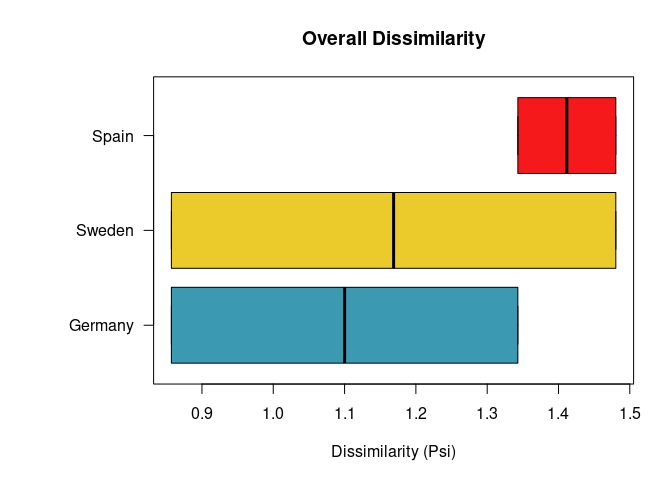

# distantia: Time Series Dissimilarity Analysis with Dynamic Time Warping

<!-- README.md is generated from README.Rmd. Please edit that file -->
<!-- badges: start -->

[](https://zenodo.org/badge/latestdoi/187805264)
[](https://CRAN.R-project.org/package=distantia)
[](https://CRAN.R-project.org/package=distantia)
[](https://github.com/BlasBenito/distantia/actions/workflows/R-CMD-check.yaml)

<!-- badges: end -->

## Warning

Version 2.0.0 of `distantia` is a full re-write from scratch and **will
break existing workflows**. Please refer to the
[Changelog](https://blasbenito.github.io/distantia/news/index.html) for
details before updating.

## Summary

The `distantia` package has undergone a major overhaul to enhance
performance and usability. Core functions are now implemented in C++ for
faster execution and improved memory efficiency, with streamlined R
wrappers to simplify user interaction.

Function and argument names have been updated to offer a more intuitive
experience. Additionally, most time series operations are now powered by
the [zoo](https://cran.r-project.org/web/packages/zoo/index.html)
library to provide a consistent and efficient data handling.

Version 2.0 introduces “time series lists” (`tsl`), which are lists of
zoo objects. A comprehensive suite of functions named `tsl_...()` have
been added to the pacakge to generate, resample, transform, analyze, and
visualize univariate, multivariate, regular, or irregular time series.
Many of these functions support a parallelized execution via the
[future](https://future.futureverse.org/) package, and progress bars as
provided by the package [progressr](https://progressr.futureverse.org/).

Finally, to further aid learning and experimentation, new example
datasets from different disicplines and tools to simulate time series
are also included.

## Citation

If you find this package useful, please cite it as:

*Blas M. Benito, H. John B. Birks (2020). distantia: an open-source
toolset to quantify dissimilarity between multivariate ecological
time-series. Ecography, 43(5), 660-667. doi:
[10.1111/ecog.04895](https://nsojournals.onlinelibrary.wiley.com/doi/10.1111/ecog.04895).*

*Blas M. Benito (2024). distantia: A Toolset for Time Series
Dissimilarity Analysis. R package version 2.0.0. url:
<https://blasbenito.github.io/distantia/>.*

## Main Improvements in Version 2.0.0

1.  **High computational speed**: The logics for the time series
    dissimilarity analysis provided by `distantia()` and
    `distantia_importance()` are now implemented in a C++ backend
    designed for speed. This new feature, combined with a
    parallelization setup provided by the
    [future](https://future.futureverse.org/) makes dissimilarity
    analysis for large datasets blazing fast.
2.  **Usage of zoo objects**: Individual time series in distantia are
    now [zoo](https://cran.r-project.org/package=zoo) objects, which
    support regular and irregular time series with various index types
    (e.g., Date, POSIXct), enable efficient handling and manipulation,
    and offer robust tools for alignment, merging, and filling missing
    values.
3.  **Time Series Lists and associated toolset**: Groups of time series
    to compare are stored in Time Series Lists (TSL), which are lists of
    zoo objects. The package also comes with a complete toolset to
    create, manage, transform, aggregate, and visualize TSLs, with the
    objective of providing a smooth user experience.

## Install

The package `distantia` can be installed from CRAN.

``` r
install.packages("distantia")
```

The development version can be installed from GitHub.

``` r
remotes::install_github(
  repo = "blasbenito/distantia", 
  ref = "main"
  )
```

Previous versions are in the “archive_xxx” branches of the GitHub
repository.

``` r
remotes::install_github(
  repo = "blasbenito/distantia", 
  ref = "archive_v1.0.2"
  )
```

## Getting Started

This section provides a minimal example on how to use `distantia`.
Please, check the **Articles** section for further details.

### Setup

The code below loads the required packages, and defines a
parallelization backend.

``` r
#required packages
library(distantia)
library(future)
library(parallelly)
library(tmap)

#parallelization setup
future::plan(
  future::multisession,
  workers = parallelly::availableCores() - 1
  )

#progress bar (does not work in Rmarkdown)
#progressr::handlers(global = TRUE)
```

### Example data

The data frame `fagus_dynamics` contains time series of enhanced
vegetation index, rainfall, and temperature on stands of *Fagus
sylvatica* in three countries.

``` r
#load example data
data(
  fagus_dynamics,
  fagus_coordiantes 
  )
#> Warning in data(fagus_dynamics, fagus_coordiantes): data set
#> 'fagus_coordiantes' not found

head(fagus_dynamics)
#>    name       time    evi rainfall temperature
#> 1 Spain 2001-01-01 0.1929    199.8         8.1
#> 5 Spain 2001-02-01 0.2423     50.6         7.8
#> 6 Spain 2001-03-01 0.2761    170.9        11.0
#> 7 Spain 2001-04-01 0.3961     62.7        10.4
#> 8 Spain 2001-05-01 0.4445     52.7        14.1
#> 9 Spain 2001-06-01 0.6434     23.1        17.6
```

The sf data frame `fagus_coordinates` contains the site coordinates.

``` r
fagus_coordinates
#> Simple feature collection with 3 features and 3 fields
#> Geometry type: POINT
#> Dimension:     XY
#> Bounding box:  xmin: -2.857322 ymin: 43.17743 xmax: 12.99502 ymax: 56.40471
#> Geodetic CRS:  WGS 84
#>           name         x        y                   geometry
#> 400443   Spain -2.857322 43.17743 POINT (-2.857322 43.17743)
#> 230572 Germany  7.517013 49.32505  POINT (7.517013 49.32505)
#> 511784  Sweden 12.995025 56.40471  POINT (12.99502 56.40471)
```

### Converting to TSL

The function `tsl_initialize()` transforms the target data frame into a
time series list, which is a list of zoo objects.

``` r
tsl <- tsl_initialize(
  x = fagus_dynamics,
  name_column = "name",
  time_column = "time"
)

lapply(tsl, class)
#> $Germany
#> [1] "zoo"
#> 
#> $Spain
#> [1] "zoo"
#> 
#> $Sweden
#> [1] "zoo"
```

A quick visualization of the TSL shows that the variables are in
different scales:

``` r
tsl_plot(
  tsl = tsl,
  guide_columns = 3
)
```

 The
function `tsl_transform()` helps apply common transformations to all zoo
time series in a TSL. Please note that the function `f_scale` uses the
global mean and standard deviation across all time series to perform the
scaling.

``` r
tsl <- tsl_transform(
  tsl = tsl,
  f = f_scale
)

tsl_plot(
  tsl = tsl,
  guide_columns = 3
)
```

 \###
Dissimilarity Analysis

The function `distantia()` computes the dissimilarity between pairs of
time series using dynamic time warping. Higher values indicate higher
dissimilarity.

``` r
df <- distantia(
  tsl = tsl
)

df[, c("x", "y", "psi")]
#>         x      y       psi
#> 1 Germany  Spain 1.3429956
#> 2 Germany Sweden 0.8571217
#> 3   Spain Sweden 1.4803954
```

``` r
distantia_boxplot(df = df)
```



    #> $stats
    #>           [,1]      [,2]     [,3]
    #> [1,] 0.8571217 0.8571217 1.342996
    #> [2,] 0.8571217 0.8571217 1.342996
    #> [3,] 1.1000587 1.1687586 1.411696
    #> [4,] 1.3429956 1.4803954 1.480395
    #> [5,] 1.3429956 1.4803954 1.480395
    #> 
    #> $n
    #> [1] 2 2 2
    #> 
    #> $conf
    #>           [,1]      [,2]     [,3]
    #> [1,] 0.5572264 0.4724193 1.258188
    #> [2,] 1.6428909 1.8650979 1.565203
    #> 
    #> $out
    #> numeric(0)
    #> 
    #> $group
    #> numeric(0)
    #> 
    #> $names
    #> [1] "Germany" "Sweden"  "Spain"

## Getting help

If you encounter bugs or issues with the documentation, please [file a
issue on GitHub](https://github.com/BlasBenito/distantia/issues).
