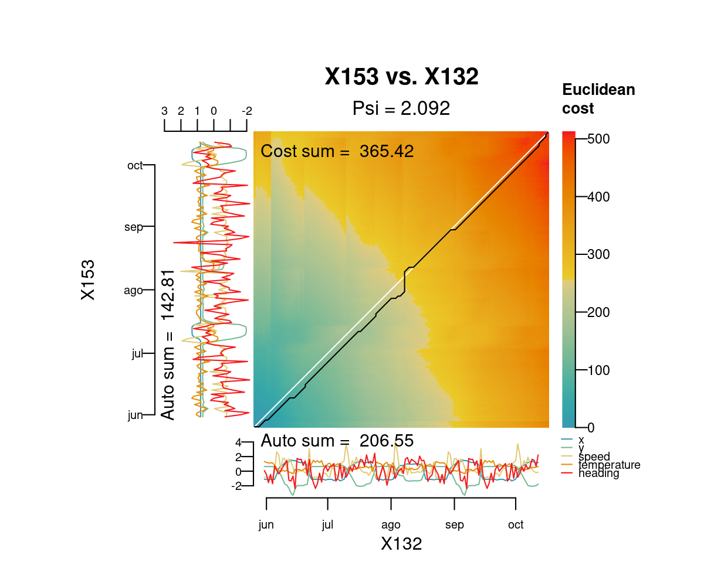
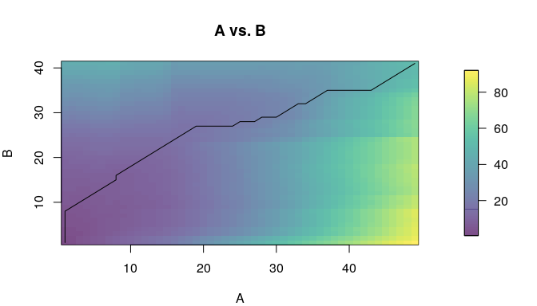
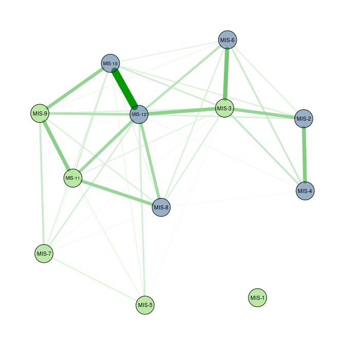
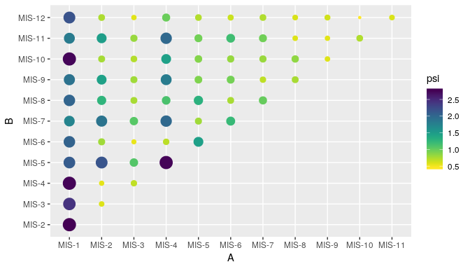
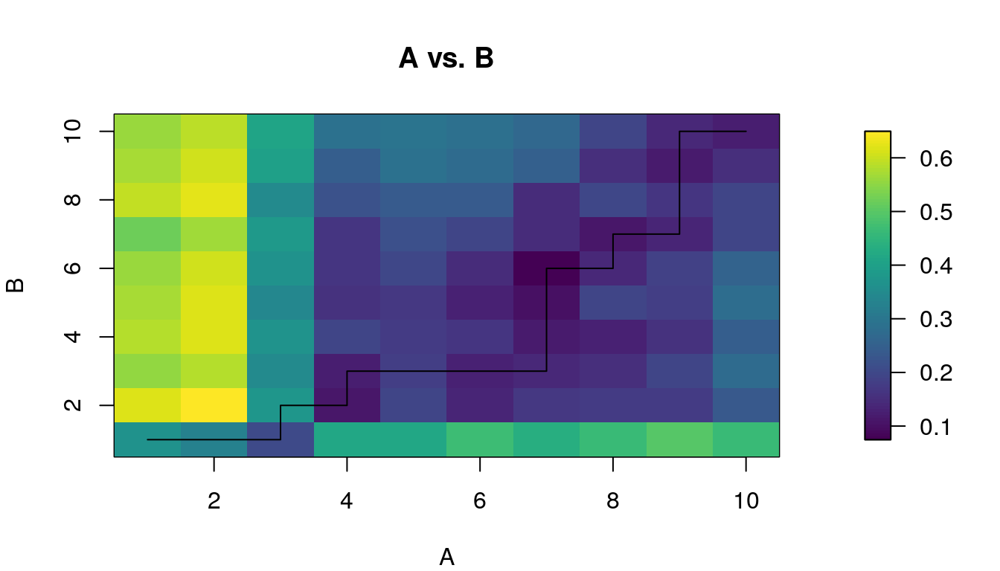

<!-- README.md is generated from README.Rmd. Please edit that file -->

# distantia

<!-- badges: start -->

<!-- badges: end -->

The package **distantia** allows to measure the dissimilarity between
multivariate time-series (*sequences* hereafter). The package assumes
that the target sequences are ordered along a given dimension, being
depth and time the most common ones, but others such as latitude or
elevation are also suitable. Furthermore, the target sequences can be
regular or irregular, and have their samples aligned (same
age/time/depth) or unaligned (different age/time/depth). The only
requirement is that the sequences must have at least two (but ideally
more) columns with the same name and units.

In this document I briefly explain the logics behind the method, show
how to use it, and demonstrate how the **distantia** package introduces
useful tools to compare multivariate time-series.

## Installation

You can install the released version of distantia from
[CRAN](https://CRAN.R-project.org) with:

``` r
# install.packages("distantia")
```

And the development version from [GitHub](https://github.com/) with:

``` r
install.packages("devtools")
library(devtools)
devtools::install_github("BlasBenito/distantia")
```

Loading the library, plus other helper libraries:

``` r
library(distantia)
library(ggplot2)
library(viridis)
library(kableExtra)
library(qgraph)
library(tidyr)
```

## Working with two irregular and unaligned sequences

### Preparing the data

This section assumes that the user wants to compare two sequences. The
package provides two example datasets based on the Abernethy pollen core
(Birks and Mathewes, 1978):

``` r
data(sequenceA)
data(sequenceB)

str(sequenceA)
#> 'data.frame':    49 obs. of  9 variables:
#>  $ betula: int  79 113 51 130 31 59 78 71 140 150 ...
#>  $ pinus : int  271 320 420 470 450 425 386 397 310 323 ...
#>  $ corylu: int  36 42 39 6 6 12 29 52 50 34 ...
#>  $ junipe: int  0 0 0 0 0 0 2 2 2 2 ...
#>  $ empetr: int  4 4 2 0 3 0 0 0 0 0 ...
#>  $ gramin: int  7 3 1 2 2 2 0 6 4 11 ...
#>  $ cypera: int  25 11 12 4 3 3 2 3 3 2 ...
#>  $ artemi: int  0 0 0 0 0 0 0 0 0 0 ...
#>  $ rumex : int  0 0 0 0 0 0 0 0 0 0 ...
str(sequenceB)
#> 'data.frame':    41 obs. of  8 variables:
#>  $ betula: int  19 18 30 26 31 24 23 48 29 23 ...
#>  $ pinus : int  175 119 99 101 99 97 105 112 108 110 ...
#>  $ corylu: int  NA 28 37 29 30 28 34 46 16 21 ...
#>  $ junipe: int  2 1 0 0 0 0 0 0 0 0 ...
#>  $ gramin: int  34 36 2 0 1 2 1 0 6 2 ...
#>  $ cypera: int  39 44 20 18 10 9 6 12 3 11 ...
#>  $ artemi: int  1 0 0 0 0 0 0 0 0 0 ...
#>  $ rumex : int  0 4 1 0 0 0 0 0 0 1 ...

kable(sequenceA, caption = "Sequence A")
```

<table>

<caption>

Sequence A

</caption>

<thead>

<tr>

<th style="text-align:right;">

betula

</th>

<th style="text-align:right;">

pinus

</th>

<th style="text-align:right;">

corylu

</th>

<th style="text-align:right;">

junipe

</th>

<th style="text-align:right;">

empetr

</th>

<th style="text-align:right;">

gramin

</th>

<th style="text-align:right;">

cypera

</th>

<th style="text-align:right;">

artemi

</th>

<th style="text-align:right;">

rumex

</th>

</tr>

</thead>

<tbody>

<tr>

<td style="text-align:right;">

79

</td>

<td style="text-align:right;">

271

</td>

<td style="text-align:right;">

36

</td>

<td style="text-align:right;">

0

</td>

<td style="text-align:right;">

4

</td>

<td style="text-align:right;">

7

</td>

<td style="text-align:right;">

25

</td>

<td style="text-align:right;">

0

</td>

<td style="text-align:right;">

0

</td>

</tr>

<tr>

<td style="text-align:right;">

113

</td>

<td style="text-align:right;">

320

</td>

<td style="text-align:right;">

42

</td>

<td style="text-align:right;">

0

</td>

<td style="text-align:right;">

4

</td>

<td style="text-align:right;">

3

</td>

<td style="text-align:right;">

11

</td>

<td style="text-align:right;">

0

</td>

<td style="text-align:right;">

0

</td>

</tr>

<tr>

<td style="text-align:right;">

51

</td>

<td style="text-align:right;">

420

</td>

<td style="text-align:right;">

39

</td>

<td style="text-align:right;">

0

</td>

<td style="text-align:right;">

2

</td>

<td style="text-align:right;">

1

</td>

<td style="text-align:right;">

12

</td>

<td style="text-align:right;">

0

</td>

<td style="text-align:right;">

0

</td>

</tr>

<tr>

<td style="text-align:right;">

130

</td>

<td style="text-align:right;">

470

</td>

<td style="text-align:right;">

6

</td>

<td style="text-align:right;">

0

</td>

<td style="text-align:right;">

0

</td>

<td style="text-align:right;">

2

</td>

<td style="text-align:right;">

4

</td>

<td style="text-align:right;">

0

</td>

<td style="text-align:right;">

0

</td>

</tr>

<tr>

<td style="text-align:right;">

31

</td>

<td style="text-align:right;">

450

</td>

<td style="text-align:right;">

6

</td>

<td style="text-align:right;">

0

</td>

<td style="text-align:right;">

3

</td>

<td style="text-align:right;">

2

</td>

<td style="text-align:right;">

3

</td>

<td style="text-align:right;">

0

</td>

<td style="text-align:right;">

0

</td>

</tr>

<tr>

<td style="text-align:right;">

59

</td>

<td style="text-align:right;">

425

</td>

<td style="text-align:right;">

12

</td>

<td style="text-align:right;">

0

</td>

<td style="text-align:right;">

0

</td>

<td style="text-align:right;">

2

</td>

<td style="text-align:right;">

3

</td>

<td style="text-align:right;">

0

</td>

<td style="text-align:right;">

0

</td>

</tr>

<tr>

<td style="text-align:right;">

78

</td>

<td style="text-align:right;">

386

</td>

<td style="text-align:right;">

29

</td>

<td style="text-align:right;">

2

</td>

<td style="text-align:right;">

0

</td>

<td style="text-align:right;">

0

</td>

<td style="text-align:right;">

2

</td>

<td style="text-align:right;">

0

</td>

<td style="text-align:right;">

0

</td>

</tr>

<tr>

<td style="text-align:right;">

71

</td>

<td style="text-align:right;">

397

</td>

<td style="text-align:right;">

52

</td>

<td style="text-align:right;">

2

</td>

<td style="text-align:right;">

0

</td>

<td style="text-align:right;">

6

</td>

<td style="text-align:right;">

3

</td>

<td style="text-align:right;">

0

</td>

<td style="text-align:right;">

0

</td>

</tr>

<tr>

<td style="text-align:right;">

140

</td>

<td style="text-align:right;">

310

</td>

<td style="text-align:right;">

50

</td>

<td style="text-align:right;">

2

</td>

<td style="text-align:right;">

0

</td>

<td style="text-align:right;">

4

</td>

<td style="text-align:right;">

3

</td>

<td style="text-align:right;">

0

</td>

<td style="text-align:right;">

0

</td>

</tr>

<tr>

<td style="text-align:right;">

150

</td>

<td style="text-align:right;">

323

</td>

<td style="text-align:right;">

34

</td>

<td style="text-align:right;">

2

</td>

<td style="text-align:right;">

0

</td>

<td style="text-align:right;">

11

</td>

<td style="text-align:right;">

2

</td>

<td style="text-align:right;">

0

</td>

<td style="text-align:right;">

0

</td>

</tr>

<tr>

<td style="text-align:right;">

175

</td>

<td style="text-align:right;">

317

</td>

<td style="text-align:right;">

37

</td>

<td style="text-align:right;">

2

</td>

<td style="text-align:right;">

0

</td>

<td style="text-align:right;">

11

</td>

<td style="text-align:right;">

3

</td>

<td style="text-align:right;">

0

</td>

<td style="text-align:right;">

0

</td>

</tr>

<tr>

<td style="text-align:right;">

181

</td>

<td style="text-align:right;">

345

</td>

<td style="text-align:right;">

28

</td>

<td style="text-align:right;">

3

</td>

<td style="text-align:right;">

0

</td>

<td style="text-align:right;">

7

</td>

<td style="text-align:right;">

3

</td>

<td style="text-align:right;">

0

</td>

<td style="text-align:right;">

0

</td>

</tr>

<tr>

<td style="text-align:right;">

153

</td>

<td style="text-align:right;">

285

</td>

<td style="text-align:right;">

36

</td>

<td style="text-align:right;">

2

</td>

<td style="text-align:right;">

0

</td>

<td style="text-align:right;">

8

</td>

<td style="text-align:right;">

3

</td>

<td style="text-align:right;">

0

</td>

<td style="text-align:right;">

1

</td>

</tr>

<tr>

<td style="text-align:right;">

214

</td>

<td style="text-align:right;">

315

</td>

<td style="text-align:right;">

54

</td>

<td style="text-align:right;">

2

</td>

<td style="text-align:right;">

1

</td>

<td style="text-align:right;">

13

</td>

<td style="text-align:right;">

5

</td>

<td style="text-align:right;">

0

</td>

<td style="text-align:right;">

0

</td>

</tr>

<tr>

<td style="text-align:right;">

200

</td>

<td style="text-align:right;">

210

</td>

<td style="text-align:right;">

41

</td>

<td style="text-align:right;">

6

</td>

<td style="text-align:right;">

0

</td>

<td style="text-align:right;">

10

</td>

<td style="text-align:right;">

4

</td>

<td style="text-align:right;">

0

</td>

<td style="text-align:right;">

0

</td>

</tr>

<tr>

<td style="text-align:right;">

360

</td>

<td style="text-align:right;">

91

</td>

<td style="text-align:right;">

105

</td>

<td style="text-align:right;">

5

</td>

<td style="text-align:right;">

0

</td>

<td style="text-align:right;">

20

</td>

<td style="text-align:right;">

7

</td>

<td style="text-align:right;">

0

</td>

<td style="text-align:right;">

0

</td>

</tr>

<tr>

<td style="text-align:right;">

285

</td>

<td style="text-align:right;">

26

</td>

<td style="text-align:right;">

120

</td>

<td style="text-align:right;">

1

</td>

<td style="text-align:right;">

1

</td>

<td style="text-align:right;">

13

</td>

<td style="text-align:right;">

4

</td>

<td style="text-align:right;">

0

</td>

<td style="text-align:right;">

0

</td>

</tr>

<tr>

<td style="text-align:right;">

357

</td>

<td style="text-align:right;">

25

</td>

<td style="text-align:right;">

130

</td>

<td style="text-align:right;">

1

</td>

<td style="text-align:right;">

3

</td>

<td style="text-align:right;">

12

</td>

<td style="text-align:right;">

6

</td>

<td style="text-align:right;">

0

</td>

<td style="text-align:right;">

0

</td>

</tr>

<tr>

<td style="text-align:right;">

304

</td>

<td style="text-align:right;">

11

</td>

<td style="text-align:right;">

151

</td>

<td style="text-align:right;">

0

</td>

<td style="text-align:right;">

3

</td>

<td style="text-align:right;">

10

</td>

<td style="text-align:right;">

4

</td>

<td style="text-align:right;">

0

</td>

<td style="text-align:right;">

0

</td>

</tr>

<tr>

<td style="text-align:right;">

365

</td>

<td style="text-align:right;">

9

</td>

<td style="text-align:right;">

150

</td>

<td style="text-align:right;">

0

</td>

<td style="text-align:right;">

4

</td>

<td style="text-align:right;">

19

</td>

<td style="text-align:right;">

5

</td>

<td style="text-align:right;">

0

</td>

<td style="text-align:right;">

0

</td>

</tr>

<tr>

<td style="text-align:right;">

375

</td>

<td style="text-align:right;">

12

</td>

<td style="text-align:right;">

116

</td>

<td style="text-align:right;">

1

</td>

<td style="text-align:right;">

2

</td>

<td style="text-align:right;">

18

</td>

<td style="text-align:right;">

11

</td>

<td style="text-align:right;">

0

</td>

<td style="text-align:right;">

0

</td>

</tr>

<tr>

<td style="text-align:right;">

365

</td>

<td style="text-align:right;">

9

</td>

<td style="text-align:right;">

138

</td>

<td style="text-align:right;">

5

</td>

<td style="text-align:right;">

2

</td>

<td style="text-align:right;">

19

</td>

<td style="text-align:right;">

6

</td>

<td style="text-align:right;">

0

</td>

<td style="text-align:right;">

0

</td>

</tr>

<tr>

<td style="text-align:right;">

382

</td>

<td style="text-align:right;">

10

</td>

<td style="text-align:right;">

92

</td>

<td style="text-align:right;">

4

</td>

<td style="text-align:right;">

3

</td>

<td style="text-align:right;">

13

</td>

<td style="text-align:right;">

1

</td>

<td style="text-align:right;">

0

</td>

<td style="text-align:right;">

2

</td>

</tr>

<tr>

<td style="text-align:right;">

390

</td>

<td style="text-align:right;">

12

</td>

<td style="text-align:right;">

98

</td>

<td style="text-align:right;">

8

</td>

<td style="text-align:right;">

3

</td>

<td style="text-align:right;">

14

</td>

<td style="text-align:right;">

5

</td>

<td style="text-align:right;">

0

</td>

<td style="text-align:right;">

1

</td>

</tr>

<tr>

<td style="text-align:right;">

361

</td>

<td style="text-align:right;">

8

</td>

<td style="text-align:right;">

72

</td>

<td style="text-align:right;">

32

</td>

<td style="text-align:right;">

8

</td>

<td style="text-align:right;">

20

</td>

<td style="text-align:right;">

5

</td>

<td style="text-align:right;">

0

</td>

<td style="text-align:right;">

1

</td>

</tr>

<tr>

<td style="text-align:right;">

405

</td>

<td style="text-align:right;">

12

</td>

<td style="text-align:right;">

37

</td>

<td style="text-align:right;">

31

</td>

<td style="text-align:right;">

8

</td>

<td style="text-align:right;">

23

</td>

<td style="text-align:right;">

4

</td>

<td style="text-align:right;">

0

</td>

<td style="text-align:right;">

3

</td>

</tr>

<tr>

<td style="text-align:right;">

386

</td>

<td style="text-align:right;">

16

</td>

<td style="text-align:right;">

10

</td>

<td style="text-align:right;">

62

</td>

<td style="text-align:right;">

18

</td>

<td style="text-align:right;">

18

</td>

<td style="text-align:right;">

7

</td>

<td style="text-align:right;">

0

</td>

<td style="text-align:right;">

6

</td>

</tr>

<tr>

<td style="text-align:right;">

411

</td>

<td style="text-align:right;">

21

</td>

<td style="text-align:right;">

8

</td>

<td style="text-align:right;">

55

</td>

<td style="text-align:right;">

10

</td>

<td style="text-align:right;">

55

</td>

<td style="text-align:right;">

14

</td>

<td style="text-align:right;">

0

</td>

<td style="text-align:right;">

8

</td>

</tr>

<tr>

<td style="text-align:right;">

394

</td>

<td style="text-align:right;">

13

</td>

<td style="text-align:right;">

12

</td>

<td style="text-align:right;">

64

</td>

<td style="text-align:right;">

11

</td>

<td style="text-align:right;">

34

</td>

<td style="text-align:right;">

13

</td>

<td style="text-align:right;">

0

</td>

<td style="text-align:right;">

5

</td>

</tr>

<tr>

<td style="text-align:right;">

338

</td>

<td style="text-align:right;">

24

</td>

<td style="text-align:right;">

6

</td>

<td style="text-align:right;">

128

</td>

<td style="text-align:right;">

9

</td>

<td style="text-align:right;">

45

</td>

<td style="text-align:right;">

16

</td>

<td style="text-align:right;">

0

</td>

<td style="text-align:right;">

6

</td>

</tr>

<tr>

<td style="text-align:right;">

311

</td>

<td style="text-align:right;">

4

</td>

<td style="text-align:right;">

1

</td>

<td style="text-align:right;">

132

</td>

<td style="text-align:right;">

31

</td>

<td style="text-align:right;">

78

</td>

<td style="text-align:right;">

12

</td>

<td style="text-align:right;">

1

</td>

<td style="text-align:right;">

1

</td>

</tr>

<tr>

<td style="text-align:right;">

236

</td>

<td style="text-align:right;">

9

</td>

<td style="text-align:right;">

5

</td>

<td style="text-align:right;">

206

</td>

<td style="text-align:right;">

19

</td>

<td style="text-align:right;">

45

</td>

<td style="text-align:right;">

13

</td>

<td style="text-align:right;">

0

</td>

<td style="text-align:right;">

7

</td>

</tr>

<tr>

<td style="text-align:right;">

98

</td>

<td style="text-align:right;">

12

</td>

<td style="text-align:right;">

5

</td>

<td style="text-align:right;">

108

</td>

<td style="text-align:right;">

122

</td>

<td style="text-align:right;">

110

</td>

<td style="text-align:right;">

49

</td>

<td style="text-align:right;">

0

</td>

<td style="text-align:right;">

7

</td>

</tr>

<tr>

<td style="text-align:right;">

8

</td>

<td style="text-align:right;">

3

</td>

<td style="text-align:right;">

0

</td>

<td style="text-align:right;">

1

</td>

<td style="text-align:right;">

4

</td>

<td style="text-align:right;">

74

</td>

<td style="text-align:right;">

43

</td>

<td style="text-align:right;">

28

</td>

<td style="text-align:right;">

26

</td>

</tr>

<tr>

<td style="text-align:right;">

16

</td>

<td style="text-align:right;">

21

</td>

<td style="text-align:right;">

1

</td>

<td style="text-align:right;">

0

</td>

<td style="text-align:right;">

4

</td>

<td style="text-align:right;">

31

</td>

<td style="text-align:right;">

46

</td>

<td style="text-align:right;">

143

</td>

<td style="text-align:right;">

35

</td>

</tr>

<tr>

<td style="text-align:right;">

20

</td>

<td style="text-align:right;">

14

</td>

<td style="text-align:right;">

0

</td>

<td style="text-align:right;">

0

</td>

<td style="text-align:right;">

8

</td>

<td style="text-align:right;">

19

</td>

<td style="text-align:right;">

18

</td>

<td style="text-align:right;">

132

</td>

<td style="text-align:right;">

27

</td>

</tr>

<tr>

<td style="text-align:right;">

14

</td>

<td style="text-align:right;">

14

</td>

<td style="text-align:right;">

2

</td>

<td style="text-align:right;">

1

</td>

<td style="text-align:right;">

4

</td>

<td style="text-align:right;">

19

</td>

<td style="text-align:right;">

10

</td>

<td style="text-align:right;">

97

</td>

<td style="text-align:right;">

31

</td>

</tr>

<tr>

<td style="text-align:right;">

18

</td>

<td style="text-align:right;">

7

</td>

<td style="text-align:right;">

1

</td>

<td style="text-align:right;">

1

</td>

<td style="text-align:right;">

10

</td>

<td style="text-align:right;">

13

</td>

<td style="text-align:right;">

18

</td>

<td style="text-align:right;">

214

</td>

<td style="text-align:right;">

11

</td>

</tr>

<tr>

<td style="text-align:right;">

23

</td>

<td style="text-align:right;">

11

</td>

<td style="text-align:right;">

1

</td>

<td style="text-align:right;">

0

</td>

<td style="text-align:right;">

8

</td>

<td style="text-align:right;">

19

</td>

<td style="text-align:right;">

14

</td>

<td style="text-align:right;">

130

</td>

<td style="text-align:right;">

12

</td>

</tr>

<tr>

<td style="text-align:right;">

24

</td>

<td style="text-align:right;">

2

</td>

<td style="text-align:right;">

1

</td>

<td style="text-align:right;">

4

</td>

<td style="text-align:right;">

10

</td>

<td style="text-align:right;">

23

</td>

<td style="text-align:right;">

22

</td>

<td style="text-align:right;">

193

</td>

<td style="text-align:right;">

16

</td>

</tr>

<tr>

<td style="text-align:right;">

26

</td>

<td style="text-align:right;">

9

</td>

<td style="text-align:right;">

1

</td>

<td style="text-align:right;">

3

</td>

<td style="text-align:right;">

10

</td>

<td style="text-align:right;">

18

</td>

<td style="text-align:right;">

16

</td>

<td style="text-align:right;">

134

</td>

<td style="text-align:right;">

4

</td>

</tr>

<tr>

<td style="text-align:right;">

167

</td>

<td style="text-align:right;">

26

</td>

<td style="text-align:right;">

7

</td>

<td style="text-align:right;">

68

</td>

<td style="text-align:right;">

119

</td>

<td style="text-align:right;">

102

</td>

<td style="text-align:right;">

64

</td>

<td style="text-align:right;">

2

</td>

<td style="text-align:right;">

28

</td>

</tr>

<tr>

<td style="text-align:right;">

183

</td>

<td style="text-align:right;">

6

</td>

<td style="text-align:right;">

4

</td>

<td style="text-align:right;">

13

</td>

<td style="text-align:right;">

200

</td>

<td style="text-align:right;">

69

</td>

<td style="text-align:right;">

47

</td>

<td style="text-align:right;">

8

</td>

<td style="text-align:right;">

26

</td>

</tr>

<tr>

<td style="text-align:right;">

118

</td>

<td style="text-align:right;">

5

</td>

<td style="text-align:right;">

3

</td>

<td style="text-align:right;">

0

</td>

<td style="text-align:right;">

202

</td>

<td style="text-align:right;">

119

</td>

<td style="text-align:right;">

70

</td>

<td style="text-align:right;">

7

</td>

<td style="text-align:right;">

21

</td>

</tr>

<tr>

<td style="text-align:right;">

100

</td>

<td style="text-align:right;">

1

</td>

<td style="text-align:right;">

1

</td>

<td style="text-align:right;">

0

</td>

<td style="text-align:right;">

190

</td>

<td style="text-align:right;">

81

</td>

<td style="text-align:right;">

36

</td>

<td style="text-align:right;">

6

</td>

<td style="text-align:right;">

97

</td>

</tr>

<tr>

<td style="text-align:right;">

7

</td>

<td style="text-align:right;">

3

</td>

<td style="text-align:right;">

0

</td>

<td style="text-align:right;">

2

</td>

<td style="text-align:right;">

3

</td>

<td style="text-align:right;">

38

</td>

<td style="text-align:right;">

10

</td>

<td style="text-align:right;">

2

</td>

<td style="text-align:right;">

30

</td>

</tr>

<tr>

<td style="text-align:right;">

3

</td>

<td style="text-align:right;">

2

</td>

<td style="text-align:right;">

0

</td>

<td style="text-align:right;">

0

</td>

<td style="text-align:right;">

1

</td>

<td style="text-align:right;">

21

</td>

<td style="text-align:right;">

7

</td>

<td style="text-align:right;">

2

</td>

<td style="text-align:right;">

36

</td>

</tr>

<tr>

<td style="text-align:right;">

8

</td>

<td style="text-align:right;">

9

</td>

<td style="text-align:right;">

1

</td>

<td style="text-align:right;">

0

</td>

<td style="text-align:right;">

4

</td>

<td style="text-align:right;">

15

</td>

<td style="text-align:right;">

12

</td>

<td style="text-align:right;">

1

</td>

<td style="text-align:right;">

30

</td>

</tr>

<tr>

<td style="text-align:right;">

1

</td>

<td style="text-align:right;">

2

</td>

<td style="text-align:right;">

1

</td>

<td style="text-align:right;">

0

</td>

<td style="text-align:right;">

1

</td>

<td style="text-align:right;">

9

</td>

<td style="text-align:right;">

20

</td>

<td style="text-align:right;">

4

</td>

<td style="text-align:right;">

35

</td>

</tr>

</tbody>

</table>

``` r
kable(sequenceB, caption = "Sequence B")
```

<table>

<caption>

Sequence B

</caption>

<thead>

<tr>

<th style="text-align:right;">

betula

</th>

<th style="text-align:right;">

pinus

</th>

<th style="text-align:right;">

corylu

</th>

<th style="text-align:right;">

junipe

</th>

<th style="text-align:right;">

gramin

</th>

<th style="text-align:right;">

cypera

</th>

<th style="text-align:right;">

artemi

</th>

<th style="text-align:right;">

rumex

</th>

</tr>

</thead>

<tbody>

<tr>

<td style="text-align:right;">

19

</td>

<td style="text-align:right;">

175

</td>

<td style="text-align:right;">

NA

</td>

<td style="text-align:right;">

2

</td>

<td style="text-align:right;">

34

</td>

<td style="text-align:right;">

39

</td>

<td style="text-align:right;">

1

</td>

<td style="text-align:right;">

0

</td>

</tr>

<tr>

<td style="text-align:right;">

18

</td>

<td style="text-align:right;">

119

</td>

<td style="text-align:right;">

28

</td>

<td style="text-align:right;">

1

</td>

<td style="text-align:right;">

36

</td>

<td style="text-align:right;">

44

</td>

<td style="text-align:right;">

0

</td>

<td style="text-align:right;">

4

</td>

</tr>

<tr>

<td style="text-align:right;">

30

</td>

<td style="text-align:right;">

99

</td>

<td style="text-align:right;">

37

</td>

<td style="text-align:right;">

0

</td>

<td style="text-align:right;">

2

</td>

<td style="text-align:right;">

20

</td>

<td style="text-align:right;">

0

</td>

<td style="text-align:right;">

1

</td>

</tr>

<tr>

<td style="text-align:right;">

26

</td>

<td style="text-align:right;">

101

</td>

<td style="text-align:right;">

29

</td>

<td style="text-align:right;">

0

</td>

<td style="text-align:right;">

0

</td>

<td style="text-align:right;">

18

</td>

<td style="text-align:right;">

0

</td>

<td style="text-align:right;">

0

</td>

</tr>

<tr>

<td style="text-align:right;">

31

</td>

<td style="text-align:right;">

99

</td>

<td style="text-align:right;">

30

</td>

<td style="text-align:right;">

0

</td>

<td style="text-align:right;">

1

</td>

<td style="text-align:right;">

10

</td>

<td style="text-align:right;">

0

</td>

<td style="text-align:right;">

0

</td>

</tr>

<tr>

<td style="text-align:right;">

24

</td>

<td style="text-align:right;">

97

</td>

<td style="text-align:right;">

28

</td>

<td style="text-align:right;">

0

</td>

<td style="text-align:right;">

2

</td>

<td style="text-align:right;">

9

</td>

<td style="text-align:right;">

0

</td>

<td style="text-align:right;">

0

</td>

</tr>

<tr>

<td style="text-align:right;">

23

</td>

<td style="text-align:right;">

105

</td>

<td style="text-align:right;">

34

</td>

<td style="text-align:right;">

0

</td>

<td style="text-align:right;">

1

</td>

<td style="text-align:right;">

6

</td>

<td style="text-align:right;">

0

</td>

<td style="text-align:right;">

0

</td>

</tr>

<tr>

<td style="text-align:right;">

48

</td>

<td style="text-align:right;">

112

</td>

<td style="text-align:right;">

46

</td>

<td style="text-align:right;">

0

</td>

<td style="text-align:right;">

0

</td>

<td style="text-align:right;">

12

</td>

<td style="text-align:right;">

0

</td>

<td style="text-align:right;">

0

</td>

</tr>

<tr>

<td style="text-align:right;">

29

</td>

<td style="text-align:right;">

108

</td>

<td style="text-align:right;">

16

</td>

<td style="text-align:right;">

0

</td>

<td style="text-align:right;">

6

</td>

<td style="text-align:right;">

3

</td>

<td style="text-align:right;">

0

</td>

<td style="text-align:right;">

0

</td>

</tr>

<tr>

<td style="text-align:right;">

23

</td>

<td style="text-align:right;">

110

</td>

<td style="text-align:right;">

21

</td>

<td style="text-align:right;">

0

</td>

<td style="text-align:right;">

2

</td>

<td style="text-align:right;">

11

</td>

<td style="text-align:right;">

0

</td>

<td style="text-align:right;">

1

</td>

</tr>

<tr>

<td style="text-align:right;">

5

</td>

<td style="text-align:right;">

119

</td>

<td style="text-align:right;">

19

</td>

<td style="text-align:right;">

0

</td>

<td style="text-align:right;">

1

</td>

<td style="text-align:right;">

1

</td>

<td style="text-align:right;">

0

</td>

<td style="text-align:right;">

0

</td>

</tr>

<tr>

<td style="text-align:right;">

30

</td>

<td style="text-align:right;">

105

</td>

<td style="text-align:right;">

NA

</td>

<td style="text-align:right;">

0

</td>

<td style="text-align:right;">

9

</td>

<td style="text-align:right;">

7

</td>

<td style="text-align:right;">

0

</td>

<td style="text-align:right;">

0

</td>

</tr>

<tr>

<td style="text-align:right;">

22

</td>

<td style="text-align:right;">

116

</td>

<td style="text-align:right;">

17

</td>

<td style="text-align:right;">

0

</td>

<td style="text-align:right;">

1

</td>

<td style="text-align:right;">

7

</td>

<td style="text-align:right;">

0

</td>

<td style="text-align:right;">

0

</td>

</tr>

<tr>

<td style="text-align:right;">

24

</td>

<td style="text-align:right;">

115

</td>

<td style="text-align:right;">

20

</td>

<td style="text-align:right;">

0

</td>

<td style="text-align:right;">

2

</td>

<td style="text-align:right;">

4

</td>

<td style="text-align:right;">

0

</td>

<td style="text-align:right;">

0

</td>

</tr>

<tr>

<td style="text-align:right;">

26

</td>

<td style="text-align:right;">

119

</td>

<td style="text-align:right;">

23

</td>

<td style="text-align:right;">

0

</td>

<td style="text-align:right;">

4

</td>

<td style="text-align:right;">

0

</td>

<td style="text-align:right;">

0

</td>

<td style="text-align:right;">

0

</td>

</tr>

<tr>

<td style="text-align:right;">

18

</td>

<td style="text-align:right;">

130

</td>

<td style="text-align:right;">

37

</td>

<td style="text-align:right;">

0

</td>

<td style="text-align:right;">

2

</td>

<td style="text-align:right;">

3

</td>

<td style="text-align:right;">

0

</td>

<td style="text-align:right;">

0

</td>

</tr>

<tr>

<td style="text-align:right;">

27

</td>

<td style="text-align:right;">

118

</td>

<td style="text-align:right;">

18

</td>

<td style="text-align:right;">

0

</td>

<td style="text-align:right;">

6

</td>

<td style="text-align:right;">

10

</td>

<td style="text-align:right;">

0

</td>

<td style="text-align:right;">

0

</td>

</tr>

<tr>

<td style="text-align:right;">

35

</td>

<td style="text-align:right;">

100

</td>

<td style="text-align:right;">

38

</td>

<td style="text-align:right;">

0

</td>

<td style="text-align:right;">

NA

</td>

<td style="text-align:right;">

15

</td>

<td style="text-align:right;">

0

</td>

<td style="text-align:right;">

0

</td>

</tr>

<tr>

<td style="text-align:right;">

29

</td>

<td style="text-align:right;">

112

</td>

<td style="text-align:right;">

10

</td>

<td style="text-align:right;">

0

</td>

<td style="text-align:right;">

26

</td>

<td style="text-align:right;">

14

</td>

<td style="text-align:right;">

0

</td>

<td style="text-align:right;">

0

</td>

</tr>

<tr>

<td style="text-align:right;">

42

</td>

<td style="text-align:right;">

102

</td>

<td style="text-align:right;">

15

</td>

<td style="text-align:right;">

0

</td>

<td style="text-align:right;">

50

</td>

<td style="text-align:right;">

12

</td>

<td style="text-align:right;">

0

</td>

<td style="text-align:right;">

0

</td>

</tr>

<tr>

<td style="text-align:right;">

42

</td>

<td style="text-align:right;">

96

</td>

<td style="text-align:right;">

30

</td>

<td style="text-align:right;">

0

</td>

<td style="text-align:right;">

67

</td>

<td style="text-align:right;">

16

</td>

<td style="text-align:right;">

0

</td>

<td style="text-align:right;">

0

</td>

</tr>

<tr>

<td style="text-align:right;">

45

</td>

<td style="text-align:right;">

95

</td>

<td style="text-align:right;">

18

</td>

<td style="text-align:right;">

1

</td>

<td style="text-align:right;">

108

</td>

<td style="text-align:right;">

17

</td>

<td style="text-align:right;">

0

</td>

<td style="text-align:right;">

0

</td>

</tr>

<tr>

<td style="text-align:right;">

22

</td>

<td style="text-align:right;">

175

</td>

<td style="text-align:right;">

6

</td>

<td style="text-align:right;">

1

</td>

<td style="text-align:right;">

20

</td>

<td style="text-align:right;">

9

</td>

<td style="text-align:right;">

0

</td>

<td style="text-align:right;">

0

</td>

</tr>

<tr>

<td style="text-align:right;">

81

</td>

<td style="text-align:right;">

59

</td>

<td style="text-align:right;">

59

</td>

<td style="text-align:right;">

1

</td>

<td style="text-align:right;">

9

</td>

<td style="text-align:right;">

4

</td>

<td style="text-align:right;">

0

</td>

<td style="text-align:right;">

0

</td>

</tr>

<tr>

<td style="text-align:right;">

116

</td>

<td style="text-align:right;">

28

</td>

<td style="text-align:right;">

NA

</td>

<td style="text-align:right;">

1

</td>

<td style="text-align:right;">

11

</td>

<td style="text-align:right;">

2

</td>

<td style="text-align:right;">

0

</td>

<td style="text-align:right;">

2

</td>

</tr>

<tr>

<td style="text-align:right;">

130

</td>

<td style="text-align:right;">

14

</td>

<td style="text-align:right;">

201

</td>

<td style="text-align:right;">

1

</td>

<td style="text-align:right;">

14

</td>

<td style="text-align:right;">

8

</td>

<td style="text-align:right;">

0

</td>

<td style="text-align:right;">

0

</td>

</tr>

<tr>

<td style="text-align:right;">

183

</td>

<td style="text-align:right;">

11

</td>

<td style="text-align:right;">

154

</td>

<td style="text-align:right;">

1

</td>

<td style="text-align:right;">

18

</td>

<td style="text-align:right;">

5

</td>

<td style="text-align:right;">

0

</td>

<td style="text-align:right;">

0

</td>

</tr>

<tr>

<td style="text-align:right;">

187

</td>

<td style="text-align:right;">

8

</td>

<td style="text-align:right;">

144

</td>

<td style="text-align:right;">

4

</td>

<td style="text-align:right;">

11

</td>

<td style="text-align:right;">

3

</td>

<td style="text-align:right;">

0

</td>

<td style="text-align:right;">

1

</td>

</tr>

<tr>

<td style="text-align:right;">

188

</td>

<td style="text-align:right;">

7

</td>

<td style="text-align:right;">

98

</td>

<td style="text-align:right;">

33

</td>

<td style="text-align:right;">

19

</td>

<td style="text-align:right;">

11

</td>

<td style="text-align:right;">

0

</td>

<td style="text-align:right;">

3

</td>

</tr>

<tr>

<td style="text-align:right;">

137

</td>

<td style="text-align:right;">

9

</td>

<td style="text-align:right;">

122

</td>

<td style="text-align:right;">

13

</td>

<td style="text-align:right;">

18

</td>

<td style="text-align:right;">

4

</td>

<td style="text-align:right;">

0

</td>

<td style="text-align:right;">

3

</td>

</tr>

<tr>

<td style="text-align:right;">

123

</td>

<td style="text-align:right;">

25

</td>

<td style="text-align:right;">

75

</td>

<td style="text-align:right;">

53

</td>

<td style="text-align:right;">

18

</td>

<td style="text-align:right;">

4

</td>

<td style="text-align:right;">

1

</td>

<td style="text-align:right;">

2

</td>

</tr>

<tr>

<td style="text-align:right;">

230

</td>

<td style="text-align:right;">

20

</td>

<td style="text-align:right;">

79

</td>

<td style="text-align:right;">

178

</td>

<td style="text-align:right;">

56

</td>

<td style="text-align:right;">

32

</td>

<td style="text-align:right;">

0

</td>

<td style="text-align:right;">

NA

</td>

</tr>

<tr>

<td style="text-align:right;">

131

</td>

<td style="text-align:right;">

19

</td>

<td style="text-align:right;">

87

</td>

<td style="text-align:right;">

97

</td>

<td style="text-align:right;">

62

</td>

<td style="text-align:right;">

19

</td>

<td style="text-align:right;">

0

</td>

<td style="text-align:right;">

NA

</td>

</tr>

<tr>

<td style="text-align:right;">

89

</td>

<td style="text-align:right;">

9

</td>

<td style="text-align:right;">

48

</td>

<td style="text-align:right;">

0

</td>

<td style="text-align:right;">

21

</td>

<td style="text-align:right;">

4

</td>

<td style="text-align:right;">

6

</td>

<td style="text-align:right;">

NA

</td>

</tr>

<tr>

<td style="text-align:right;">

25

</td>

<td style="text-align:right;">

20

</td>

<td style="text-align:right;">

11

</td>

<td style="text-align:right;">

6

</td>

<td style="text-align:right;">

20

</td>

<td style="text-align:right;">

14

</td>

<td style="text-align:right;">

42

</td>

<td style="text-align:right;">

NA

</td>

</tr>

<tr>

<td style="text-align:right;">

56

</td>

<td style="text-align:right;">

89

</td>

<td style="text-align:right;">

26

</td>

<td style="text-align:right;">

0

</td>

<td style="text-align:right;">

39

</td>

<td style="text-align:right;">

26

</td>

<td style="text-align:right;">

1

</td>

<td style="text-align:right;">

33

</td>

</tr>

<tr>

<td style="text-align:right;">

41

</td>

<td style="text-align:right;">

9

</td>

<td style="text-align:right;">

17

</td>

<td style="text-align:right;">

13

</td>

<td style="text-align:right;">

40

</td>

<td style="text-align:right;">

20

</td>

<td style="text-align:right;">

15

</td>

<td style="text-align:right;">

21

</td>

</tr>

<tr>

<td style="text-align:right;">

43

</td>

<td style="text-align:right;">

7

</td>

<td style="text-align:right;">

12

</td>

<td style="text-align:right;">

3

</td>

<td style="text-align:right;">

66

</td>

<td style="text-align:right;">

18

</td>

<td style="text-align:right;">

11

</td>

<td style="text-align:right;">

55

</td>

</tr>

<tr>

<td style="text-align:right;">

89

</td>

<td style="text-align:right;">

9

</td>

<td style="text-align:right;">

7

</td>

<td style="text-align:right;">

2

</td>

<td style="text-align:right;">

76

</td>

<td style="text-align:right;">

45

</td>

<td style="text-align:right;">

11

</td>

<td style="text-align:right;">

73

</td>

</tr>

<tr>

<td style="text-align:right;">

65

</td>

<td style="text-align:right;">

35

</td>

<td style="text-align:right;">

NA

</td>

<td style="text-align:right;">

3

</td>

<td style="text-align:right;">

36

</td>

<td style="text-align:right;">

29

</td>

<td style="text-align:right;">

1

</td>

<td style="text-align:right;">

35

</td>

</tr>

<tr>

<td style="text-align:right;">

20

</td>

<td style="text-align:right;">

27

</td>

<td style="text-align:right;">

9

</td>

<td style="text-align:right;">

1

</td>

<td style="text-align:right;">

9

</td>

<td style="text-align:right;">

13

</td>

<td style="text-align:right;">

27

</td>

<td style="text-align:right;">

4

</td>

</tr>

</tbody>

</table>

Notice that **sequenceB** has a few NA values (that were introduced to
serve as an example). The function **prepareSequences** gets them ready
for analysis by matching colum names and handling empty data. It allows
to merge two (or more) multivariate time-series into a single table
ready for further analyses. Note that, since the data represents pollen
abundances, a *Hellinger* transformation (square root of the relative
proportions of each taxa) is applied.

``` r
help(prepareSequences)

AB.sequences <- prepareSequences(
  sequence.A = sequenceA,
  sequence.A.name = "A",
  sequence.B = sequenceB,
  sequence.B.name = "B",
  merge.mode = "complete",
  if.empty.cases = "zero",
  transformation = "hellinger"
)

kable(AB.sequences)
```

<table>

<thead>

<tr>

<th style="text-align:left;">

id

</th>

<th style="text-align:right;">

betula

</th>

<th style="text-align:right;">

pinus

</th>

<th style="text-align:right;">

corylu

</th>

<th style="text-align:right;">

junipe

</th>

<th style="text-align:right;">

empetr

</th>

<th style="text-align:right;">

gramin

</th>

<th style="text-align:right;">

cypera

</th>

<th style="text-align:right;">

artemi

</th>

<th style="text-align:right;">

rumex

</th>

</tr>

</thead>

<tbody>

<tr>

<td style="text-align:left;">

A

</td>

<td style="text-align:right;">

0.4326705

</td>

<td style="text-align:right;">

0.8013614

</td>

<td style="text-align:right;">

0.2920754

</td>

<td style="text-align:right;">

0.0001539

</td>

<td style="text-align:right;">

0.0973585

</td>

<td style="text-align:right;">

0.1287932

</td>

<td style="text-align:right;">

0.2433962

</td>

<td style="text-align:right;">

0.0001539

</td>

<td style="text-align:right;">

0.0001539

</td>

</tr>

<tr>

<td style="text-align:left;">

A

</td>

<td style="text-align:right;">

0.4787577

</td>

<td style="text-align:right;">

0.8056595

</td>

<td style="text-align:right;">

0.2918779

</td>

<td style="text-align:right;">

0.0001424

</td>

<td style="text-align:right;">

0.0900755

</td>

<td style="text-align:right;">

0.0780076

</td>

<td style="text-align:right;">

0.1493733

</td>

<td style="text-align:right;">

0.0001424

</td>

<td style="text-align:right;">

0.0001424

</td>

</tr>

<tr>

<td style="text-align:left;">

A

</td>

<td style="text-align:right;">

0.3116775

</td>

<td style="text-align:right;">

0.8944272

</td>

<td style="text-align:right;">

0.2725540

</td>

<td style="text-align:right;">

0.0001380

</td>

<td style="text-align:right;">

0.0617213

</td>

<td style="text-align:right;">

0.0436436

</td>

<td style="text-align:right;">

0.1511858

</td>

<td style="text-align:right;">

0.0001380

</td>

<td style="text-align:right;">

0.0001380

</td>

</tr>

<tr>

<td style="text-align:left;">

A

</td>

<td style="text-align:right;">

0.4608886

</td>

<td style="text-align:right;">

0.8763411

</td>

<td style="text-align:right;">

0.0990148

</td>

<td style="text-align:right;">

0.0001278

</td>

<td style="text-align:right;">

0.0001278

</td>

<td style="text-align:right;">

0.0571662

</td>

<td style="text-align:right;">

0.0808452

</td>

<td style="text-align:right;">

0.0001278

</td>

<td style="text-align:right;">

0.0001278

</td>

</tr>

<tr>

<td style="text-align:left;">

A

</td>

<td style="text-align:right;">

0.2502524

</td>

<td style="text-align:right;">

0.9534626

</td>

<td style="text-align:right;">

0.1100964

</td>

<td style="text-align:right;">

0.0001421

</td>

<td style="text-align:right;">

0.0778499

</td>

<td style="text-align:right;">

0.0635642

</td>

<td style="text-align:right;">

0.0778499

</td>

<td style="text-align:right;">

0.0001421

</td>

<td style="text-align:right;">

0.0001421

</td>

</tr>

<tr>

<td style="text-align:left;">

A

</td>

<td style="text-align:right;">

0.3431683

</td>

<td style="text-align:right;">

0.9210338

</td>

<td style="text-align:right;">

0.1547646

</td>

<td style="text-align:right;">

0.0001413

</td>

<td style="text-align:right;">

0.0001413

</td>

<td style="text-align:right;">

0.0631824

</td>

<td style="text-align:right;">

0.0773823

</td>

<td style="text-align:right;">

0.0001413

</td>

<td style="text-align:right;">

0.0001413

</td>

</tr>

<tr>

<td style="text-align:left;">

A

</td>

<td style="text-align:right;">

0.3961586

</td>

<td style="text-align:right;">

0.8812831

</td>

<td style="text-align:right;">

0.2415576

</td>

<td style="text-align:right;">

0.0634361

</td>

<td style="text-align:right;">

0.0001418

</td>

<td style="text-align:right;">

0.0001418

</td>

<td style="text-align:right;">

0.0634361

</td>

<td style="text-align:right;">

0.0001418

</td>

<td style="text-align:right;">

0.0001418

</td>

</tr>

<tr>

<td style="text-align:left;">

A

</td>

<td style="text-align:right;">

0.3656637

</td>

<td style="text-align:right;">

0.8646652

</td>

<td style="text-align:right;">

0.3129352

</td>

<td style="text-align:right;">

0.0613716

</td>

<td style="text-align:right;">

0.0001372

</td>

<td style="text-align:right;">

0.1062988

</td>

<td style="text-align:right;">

0.0751646

</td>

<td style="text-align:right;">

0.0001372

</td>

<td style="text-align:right;">

0.0001372

</td>

</tr>

<tr>

<td style="text-align:left;">

A

</td>

<td style="text-align:right;">

0.5244512

</td>

<td style="text-align:right;">

0.7804084

</td>

<td style="text-align:right;">

0.3134196

</td>

<td style="text-align:right;">

0.0626839

</td>

<td style="text-align:right;">

0.0001402

</td>

<td style="text-align:right;">

0.0886484

</td>

<td style="text-align:right;">

0.0767718

</td>

<td style="text-align:right;">

0.0001402

</td>

<td style="text-align:right;">

0.0001402

</td>

</tr>

<tr>

<td style="text-align:left;">

A

</td>

<td style="text-align:right;">

0.5360563

</td>

<td style="text-align:right;">

0.7866218

</td>

<td style="text-align:right;">

0.2552138

</td>

<td style="text-align:right;">

0.0618984

</td>

<td style="text-align:right;">

0.0001384

</td>

<td style="text-align:right;">

0.1451647

</td>

<td style="text-align:right;">

0.0618984

</td>

<td style="text-align:right;">

0.0001384

</td>

<td style="text-align:right;">

0.0001384

</td>

</tr>

<tr>

<td style="text-align:left;">

A

</td>

<td style="text-align:right;">

0.5666577

</td>

<td style="text-align:right;">

0.7626607

</td>

<td style="text-align:right;">

0.2605569

</td>

<td style="text-align:right;">

0.0605783

</td>

<td style="text-align:right;">

0.0001355

</td>

<td style="text-align:right;">

0.1420686

</td>

<td style="text-align:right;">

0.0741929

</td>

<td style="text-align:right;">

0.0001355

</td>

<td style="text-align:right;">

0.0001355

</td>

</tr>

<tr>

<td style="text-align:left;">

A

</td>

<td style="text-align:right;">

0.5649991

</td>

<td style="text-align:right;">

0.7800420

</td>

<td style="text-align:right;">

0.2222222

</td>

<td style="text-align:right;">

0.0727393

</td>

<td style="text-align:right;">

0.0001328

</td>

<td style="text-align:right;">

0.1111111

</td>

<td style="text-align:right;">

0.0727393

</td>

<td style="text-align:right;">

0.0001328

</td>

<td style="text-align:right;">

0.0001328

</td>

</tr>

<tr>

<td style="text-align:left;">

A

</td>

<td style="text-align:right;">

0.5599327

</td>

<td style="text-align:right;">

0.7642096

</td>

<td style="text-align:right;">

0.2716072

</td>

<td style="text-align:right;">

0.0640184

</td>

<td style="text-align:right;">

0.0001431

</td>

<td style="text-align:right;">

0.1280369

</td>

<td style="text-align:right;">

0.0784063

</td>

<td style="text-align:right;">

0.0001431

</td>

<td style="text-align:right;">

0.0452679

</td>

</tr>

<tr>

<td style="text-align:left;">

A

</td>

<td style="text-align:right;">

0.5952349

</td>

<td style="text-align:right;">

0.7221656

</td>

<td style="text-align:right;">

0.2990050

</td>

<td style="text-align:right;">

0.0575435

</td>

<td style="text-align:right;">

0.0406894

</td>

<td style="text-align:right;">

0.1467078

</td>

<td style="text-align:right;">

0.0909843

</td>

<td style="text-align:right;">

0.0001287

</td>

<td style="text-align:right;">

0.0001287

</td>

</tr>

<tr>

<td style="text-align:left;">

A

</td>

<td style="text-align:right;">

0.6516352

</td>

<td style="text-align:right;">

0.6677274

</td>

<td style="text-align:right;">

0.2950404

</td>

<td style="text-align:right;">

0.1128665

</td>

<td style="text-align:right;">

0.0001457

</td>

<td style="text-align:right;">

0.1457101

</td>

<td style="text-align:right;">

0.0921551

</td>

<td style="text-align:right;">

0.0001457

</td>

<td style="text-align:right;">

0.0001457

</td>

</tr>

<tr>

<td style="text-align:left;">

A

</td>

<td style="text-align:right;">

0.7824608

</td>

<td style="text-align:right;">

0.3933979

</td>

<td style="text-align:right;">

0.4225771

</td>

<td style="text-align:right;">

0.0922139

</td>

<td style="text-align:right;">

0.0001304

</td>

<td style="text-align:right;">

0.1844278

</td>

<td style="text-align:right;">

0.1091089

</td>

<td style="text-align:right;">

0.0001304

</td>

<td style="text-align:right;">

0.0001304

</td>

</tr>

<tr>

<td style="text-align:left;">

A

</td>

<td style="text-align:right;">

0.7958224

</td>

<td style="text-align:right;">

0.2403701

</td>

<td style="text-align:right;">

0.5163978

</td>

<td style="text-align:right;">

0.0471405

</td>

<td style="text-align:right;">

0.0471405

</td>

<td style="text-align:right;">

0.1699673

</td>

<td style="text-align:right;">

0.0942809

</td>

<td style="text-align:right;">

0.0001491

</td>

<td style="text-align:right;">

0.0001491

</td>

</tr>

<tr>

<td style="text-align:left;">

A

</td>

<td style="text-align:right;">

0.8176425

</td>

<td style="text-align:right;">

0.2163712

</td>

<td style="text-align:right;">

0.4934022

</td>

<td style="text-align:right;">

0.0432742

</td>

<td style="text-align:right;">

0.0749532

</td>

<td style="text-align:right;">

0.1499063

</td>

<td style="text-align:right;">

0.1059998

</td>

<td style="text-align:right;">

0.0001368

</td>

<td style="text-align:right;">

0.0001368

</td>

</tr>

<tr>

<td style="text-align:left;">

A

</td>

<td style="text-align:right;">

0.7933471

</td>

<td style="text-align:right;">

0.1509116

</td>

<td style="text-align:right;">

0.5591327

</td>

<td style="text-align:right;">

0.0001439

</td>

<td style="text-align:right;">

0.0788110

</td>

<td style="text-align:right;">

0.1438886

</td>

<td style="text-align:right;">

0.0910031

</td>

<td style="text-align:right;">

0.0001439

</td>

<td style="text-align:right;">

0.0001439

</td>

</tr>

<tr>

<td style="text-align:left;">

A

</td>

<td style="text-align:right;">

0.8131616

</td>

<td style="text-align:right;">

0.1276885

</td>

<td style="text-align:right;">

0.5212860

</td>

<td style="text-align:right;">

0.0001346

</td>

<td style="text-align:right;">

0.0851257

</td>

<td style="text-align:right;">

0.1855271

</td>

<td style="text-align:right;">

0.0951734

</td>

<td style="text-align:right;">

0.0001346

</td>

<td style="text-align:right;">

0.0001346

</td>

</tr>

<tr>

<td style="text-align:left;">

A

</td>

<td style="text-align:right;">

0.8372183

</td>

<td style="text-align:right;">

0.1497662

</td>

<td style="text-align:right;">

0.4656419

</td>

<td style="text-align:right;">

0.0432338

</td>

<td style="text-align:right;">

0.0611418

</td>

<td style="text-align:right;">

0.1834253

</td>

<td style="text-align:right;">

0.1433902

</td>

<td style="text-align:right;">

0.0001367

</td>

<td style="text-align:right;">

0.0001367

</td>

</tr>

<tr>

<td style="text-align:left;">

A

</td>

<td style="text-align:right;">

0.8191190

</td>

<td style="text-align:right;">

0.1286239

</td>

<td style="text-align:right;">

0.5036630

</td>

<td style="text-align:right;">

0.0958706

</td>

<td style="text-align:right;">

0.0606339

</td>

<td style="text-align:right;">

0.1868862

</td>

<td style="text-align:right;">

0.1050210

</td>

<td style="text-align:right;">

0.0001356

</td>

<td style="text-align:right;">

0.0001356

</td>

</tr>

<tr>

<td style="text-align:left;">

A

</td>

<td style="text-align:right;">

0.8680159

</td>

<td style="text-align:right;">

0.1404417

</td>

<td style="text-align:right;">

0.4259807

</td>

<td style="text-align:right;">

0.0888231

</td>

<td style="text-align:right;">

0.0769231

</td>

<td style="text-align:right;">

0.1601282

</td>

<td style="text-align:right;">

0.0444116

</td>

<td style="text-align:right;">

0.0001404

</td>

<td style="text-align:right;">

0.0628074

</td>

</tr>

<tr>

<td style="text-align:left;">

A

</td>

<td style="text-align:right;">

0.8570083

</td>

<td style="text-align:right;">

0.1503292

</td>

<td style="text-align:right;">

0.4296015

</td>

<td style="text-align:right;">

0.1227433

</td>

<td style="text-align:right;">

0.0751646

</td>

<td style="text-align:right;">

0.1623741

</td>

<td style="text-align:right;">

0.0970371

</td>

<td style="text-align:right;">

0.0001372

</td>

<td style="text-align:right;">

0.0433963

</td>

</tr>

<tr>

<td style="text-align:left;">

A

</td>

<td style="text-align:right;">

0.8438196

</td>

<td style="text-align:right;">

0.1256149

</td>

<td style="text-align:right;">

0.3768446

</td>

<td style="text-align:right;">

0.2512297

</td>

<td style="text-align:right;">

0.1256149

</td>

<td style="text-align:right;">

0.1986145

</td>

<td style="text-align:right;">

0.0993073

</td>

<td style="text-align:right;">

0.0001404

</td>

<td style="text-align:right;">

0.0444116

</td>

</tr>

<tr>

<td style="text-align:left;">

A

</td>

<td style="text-align:right;">

0.8799878

</td>

<td style="text-align:right;">

0.1514746

</td>

<td style="text-align:right;">

0.2659806

</td>

<td style="text-align:right;">

0.2434613

</td>

<td style="text-align:right;">

0.1236785

</td>

<td style="text-align:right;">

0.2097071

</td>

<td style="text-align:right;">

0.0874539

</td>

<td style="text-align:right;">

0.0001383

</td>

<td style="text-align:right;">

0.0757373

</td>

</tr>

<tr>

<td style="text-align:left;">

A

</td>

<td style="text-align:right;">

0.8590982

</td>

<td style="text-align:right;">

0.1749078

</td>

<td style="text-align:right;">

0.1382767

</td>

<td style="text-align:right;">

0.3443063

</td>

<td style="text-align:right;">

0.1855177

</td>

<td style="text-align:right;">

0.1855177

</td>

<td style="text-align:right;">

0.1156906

</td>

<td style="text-align:right;">

0.0001383

</td>

<td style="text-align:right;">

0.1071087

</td>

</tr>

<tr>

<td style="text-align:left;">

A

</td>

<td style="text-align:right;">

0.8403485

</td>

<td style="text-align:right;">

0.1899539

</td>

<td style="text-align:right;">

0.1172421

</td>

<td style="text-align:right;">

0.3074113

</td>

<td style="text-align:right;">

0.1310806

</td>

<td style="text-align:right;">

0.3074113

</td>

<td style="text-align:right;">

0.1550967

</td>

<td style="text-align:right;">

0.0001311

</td>

<td style="text-align:right;">

0.1172421

</td>

</tr>

<tr>

<td style="text-align:left;">

A

</td>

<td style="text-align:right;">

0.8494773

</td>

<td style="text-align:right;">

0.1543033

</td>

<td style="text-align:right;">

0.1482499

</td>

<td style="text-align:right;">

0.3423684

</td>

<td style="text-align:right;">

0.1419384

</td>

<td style="text-align:right;">

0.2495417

</td>

<td style="text-align:right;">

0.1543033

</td>

<td style="text-align:right;">

0.0001353

</td>

<td style="text-align:right;">

0.0956949

</td>

</tr>

<tr>

<td style="text-align:left;">

A

</td>

<td style="text-align:right;">

0.7687061

</td>

<td style="text-align:right;">

0.2048366

</td>

<td style="text-align:right;">

0.1024183

</td>

<td style="text-align:right;">

0.4730499

</td>

<td style="text-align:right;">

0.1254363

</td>

<td style="text-align:right;">

0.2804841

</td>

<td style="text-align:right;">

0.1672484

</td>

<td style="text-align:right;">

0.0001322

</td>

<td style="text-align:right;">

0.1024183

</td>

</tr>

<tr>

<td style="text-align:left;">

A

</td>

<td style="text-align:right;">

0.7380098

</td>

<td style="text-align:right;">

0.0836974

</td>

<td style="text-align:right;">

0.0418487

</td>

<td style="text-align:right;">

0.4808049

</td>

<td style="text-align:right;">

0.2330037

</td>

<td style="text-align:right;">

0.3695977

</td>

<td style="text-align:right;">

0.1449681

</td>

<td style="text-align:right;">

0.0418487

</td>

<td style="text-align:right;">

0.0418487

</td>

</tr>

<tr>

<td style="text-align:left;">

A

</td>

<td style="text-align:right;">

0.6610878

</td>

<td style="text-align:right;">

0.1290994

</td>

<td style="text-align:right;">

0.0962250

</td>

<td style="text-align:right;">

0.6176419

</td>

<td style="text-align:right;">

0.1875771

</td>

<td style="text-align:right;">

0.2886751

</td>

<td style="text-align:right;">

0.1551582

</td>

<td style="text-align:right;">

0.0001361

</td>

<td style="text-align:right;">

0.1138550

</td>

</tr>

<tr>

<td style="text-align:left;">

A

</td>

<td style="text-align:right;">

0.4379279

</td>

<td style="text-align:right;">

0.1532428

</td>

<td style="text-align:right;">

0.0989178

</td>

<td style="text-align:right;">

0.4597285

</td>

<td style="text-align:right;">

0.4886180

</td>

<td style="text-align:right;">

0.4639657

</td>

<td style="text-align:right;">

0.3096618

</td>

<td style="text-align:right;">

0.0001399

</td>

<td style="text-align:right;">

0.1170411

</td>

</tr>

<tr>

<td style="text-align:left;">

A

</td>

<td style="text-align:right;">

0.2068351

</td>

<td style="text-align:right;">

0.1266601

</td>

<td style="text-align:right;">

0.0002312

</td>

<td style="text-align:right;">

0.0731272

</td>

<td style="text-align:right;">

0.1462545

</td>

<td style="text-align:right;">

0.6290643

</td>

<td style="text-align:right;">

0.4795274

</td>

<td style="text-align:right;">

0.3869530

</td>

<td style="text-align:right;">

0.3728772

</td>

</tr>

<tr>

<td style="text-align:left;">

A

</td>

<td style="text-align:right;">

0.2321035

</td>

<td style="text-align:right;">

0.2659080

</td>

<td style="text-align:right;">

0.0580259

</td>

<td style="text-align:right;">

0.0001835

</td>

<td style="text-align:right;">

0.1160518

</td>

<td style="text-align:right;">

0.3230745

</td>

<td style="text-align:right;">

0.3935507

</td>

<td style="text-align:right;">

0.6938887

</td>

<td style="text-align:right;">

0.3432858

</td>

</tr>

<tr>

<td style="text-align:left;">

A

</td>

<td style="text-align:right;">

0.2898855

</td>

<td style="text-align:right;">

0.2425356

</td>

<td style="text-align:right;">

0.0002050

</td>

<td style="text-align:right;">

0.0002050

</td>

<td style="text-align:right;">

0.1833397

</td>

<td style="text-align:right;">

0.2825454

</td>

<td style="text-align:right;">

0.2750095

</td>

<td style="text-align:right;">

0.7447293

</td>

<td style="text-align:right;">

0.3368165

</td>

</tr>

<tr>

<td style="text-align:left;">

A

</td>

<td style="text-align:right;">

0.2700309

</td>

<td style="text-align:right;">

0.2700309

</td>

<td style="text-align:right;">

0.1020621

</td>

<td style="text-align:right;">

0.0721688

</td>

<td style="text-align:right;">

0.1443376

</td>

<td style="text-align:right;">

0.3145764

</td>

<td style="text-align:right;">

0.2282177

</td>

<td style="text-align:right;">

0.7107801

</td>

<td style="text-align:right;">

0.4018188

</td>

</tr>

<tr>

<td style="text-align:left;">

A

</td>

<td style="text-align:right;">

0.2478577

</td>

<td style="text-align:right;">

0.1545664

</td>

<td style="text-align:right;">

0.0584206

</td>

<td style="text-align:right;">

0.0584206

</td>

<td style="text-align:right;">

0.1847422

</td>

<td style="text-align:right;">

0.2106386

</td>

<td style="text-align:right;">

0.2478577

</td>

<td style="text-align:right;">

0.8546200

</td>

<td style="text-align:right;">

0.1937593

</td>

</tr>

<tr>

<td style="text-align:left;">

A

</td>

<td style="text-align:right;">

0.3248147

</td>

<td style="text-align:right;">

0.2246302

</td>

<td style="text-align:right;">

0.0677285

</td>

<td style="text-align:right;">

0.0002142

</td>

<td style="text-align:right;">

0.1915653

</td>

<td style="text-align:right;">

0.2952219

</td>

<td style="text-align:right;">

0.2534170

</td>

<td style="text-align:right;">

0.7722242

</td>

<td style="text-align:right;">

0.2346186

</td>

</tr>

<tr>

<td style="text-align:left;">

A

</td>

<td style="text-align:right;">

0.2852296

</td>

<td style="text-align:right;">

0.0823387

</td>

<td style="text-align:right;">

0.0582223

</td>

<td style="text-align:right;">

0.1164445

</td>

<td style="text-align:right;">

0.1841149

</td>

<td style="text-align:right;">

0.2792241

</td>

<td style="text-align:right;">

0.2730866

</td>

<td style="text-align:right;">

0.8088494

</td>

<td style="text-align:right;">

0.2328890

</td>

</tr>

<tr>

<td style="text-align:left;">

A

</td>

<td style="text-align:right;">

0.3429972

</td>

<td style="text-align:right;">

0.2018018

</td>

<td style="text-align:right;">

0.0672673

</td>

<td style="text-align:right;">

0.1165103

</td>

<td style="text-align:right;">

0.2127178

</td>

<td style="text-align:right;">

0.2853909

</td>

<td style="text-align:right;">

0.2690691

</td>

<td style="text-align:right;">

0.7786751

</td>

<td style="text-align:right;">

0.1345346

</td>

</tr>

<tr>

<td style="text-align:left;">

A

</td>

<td style="text-align:right;">

0.5352097

</td>

<td style="text-align:right;">

0.2111798

</td>

<td style="text-align:right;">

0.1095758

</td>

<td style="text-align:right;">

0.3415232

</td>

<td style="text-align:right;">

0.4517927

</td>

<td style="text-align:right;">

0.4182788

</td>

<td style="text-align:right;">

0.3313261

</td>

<td style="text-align:right;">

0.0585707

</td>

<td style="text-align:right;">

0.2191516

</td>

</tr>

<tr>

<td style="text-align:left;">

A

</td>

<td style="text-align:right;">

0.5737044

</td>

<td style="text-align:right;">

0.1038815

</td>

<td style="text-align:right;">

0.0848189

</td>

<td style="text-align:right;">

0.1529094

</td>

<td style="text-align:right;">

0.5997601

</td>

<td style="text-align:right;">

0.3522793

</td>

<td style="text-align:right;">

0.2907445

</td>

<td style="text-align:right;">

0.1199520

</td>

<td style="text-align:right;">

0.2162466

</td>

</tr>

<tr>

<td style="text-align:left;">

A

</td>

<td style="text-align:right;">

0.4653104

</td>

<td style="text-align:right;">

0.0957826

</td>

<td style="text-align:right;">

0.0741929

</td>

<td style="text-align:right;">

0.0001355

</td>

<td style="text-align:right;">

0.6088039

</td>

<td style="text-align:right;">

0.4672779

</td>

<td style="text-align:right;">

0.3583858

</td>

<td style="text-align:right;">

0.1133315

</td>

<td style="text-align:right;">

0.1962960

</td>

</tr>

<tr>

<td style="text-align:left;">

A

</td>

<td style="text-align:right;">

0.4419417

</td>

<td style="text-align:right;">

0.0441942

</td>

<td style="text-align:right;">

0.0441942

</td>

<td style="text-align:right;">

0.0001398

</td>

<td style="text-align:right;">

0.6091746

</td>

<td style="text-align:right;">

0.3977476

</td>

<td style="text-align:right;">

0.2651650

</td>

<td style="text-align:right;">

0.1082532

</td>

<td style="text-align:right;">

0.4352621

</td>

</tr>

<tr>

<td style="text-align:left;">

A

</td>

<td style="text-align:right;">

0.2714483

</td>

<td style="text-align:right;">

0.1777047

</td>

<td style="text-align:right;">

0.0003244

</td>

<td style="text-align:right;">

0.1450952

</td>

<td style="text-align:right;">

0.1777047

</td>

<td style="text-align:right;">

0.6324555

</td>

<td style="text-align:right;">

0.3244428

</td>

<td style="text-align:right;">

0.1450952

</td>

<td style="text-align:right;">

0.5619515

</td>

</tr>

<tr>

<td style="text-align:left;">

A

</td>

<td style="text-align:right;">

0.2041241

</td>

<td style="text-align:right;">

0.1666666

</td>

<td style="text-align:right;">

0.0003727

</td>

<td style="text-align:right;">

0.0003727

</td>

<td style="text-align:right;">

0.1178511

</td>

<td style="text-align:right;">

0.5400616

</td>

<td style="text-align:right;">

0.3118047

</td>

<td style="text-align:right;">

0.1666666

</td>

<td style="text-align:right;">

0.7071067

</td>

</tr>

<tr>

<td style="text-align:left;">

A

</td>

<td style="text-align:right;">

0.3162277

</td>

<td style="text-align:right;">

0.3354102

</td>

<td style="text-align:right;">

0.1118034

</td>

<td style="text-align:right;">

0.0003536

</td>

<td style="text-align:right;">

0.2236068

</td>

<td style="text-align:right;">

0.4330127

</td>

<td style="text-align:right;">

0.3872983

</td>

<td style="text-align:right;">

0.1118034

</td>

<td style="text-align:right;">

0.6123724

</td>

</tr>

<tr>

<td style="text-align:left;">

A

</td>

<td style="text-align:right;">

0.1170411

</td>

<td style="text-align:right;">

0.1655212

</td>

<td style="text-align:right;">

0.1170411

</td>

<td style="text-align:right;">

0.0003701

</td>

<td style="text-align:right;">

0.1170411

</td>

<td style="text-align:right;">

0.3511234

</td>

<td style="text-align:right;">

0.5234239

</td>

<td style="text-align:right;">

0.2340823

</td>

<td style="text-align:right;">

0.6924247

</td>

</tr>

<tr>

<td style="text-align:left;">

B

</td>

<td style="text-align:right;">

0.2652741

</td>

<td style="text-align:right;">

0.8050764

</td>

<td style="text-align:right;">

0.0001925

</td>

<td style="text-align:right;">

0.0860663

</td>

<td style="text-align:right;">

0.0001925

</td>

<td style="text-align:right;">

0.3548604

</td>

<td style="text-align:right;">

0.3800585

</td>

<td style="text-align:right;">

0.0608581

</td>

<td style="text-align:right;">

0.0001925

</td>

</tr>

<tr>

<td style="text-align:left;">

B

</td>

<td style="text-align:right;">

0.2683281

</td>

<td style="text-align:right;">

0.6899275

</td>

<td style="text-align:right;">

0.3346640

</td>

<td style="text-align:right;">

0.0632456

</td>

<td style="text-align:right;">

0.0002000

</td>

<td style="text-align:right;">

0.3794733

</td>

<td style="text-align:right;">

0.4195235

</td>

<td style="text-align:right;">

0.0002000

</td>

<td style="text-align:right;">

0.1264911

</td>

</tr>

<tr>

<td style="text-align:left;">

B

</td>

<td style="text-align:right;">

0.3984095

</td>

<td style="text-align:right;">

0.7237468

</td>

<td style="text-align:right;">

0.4424558

</td>

<td style="text-align:right;">

0.0002300

</td>

<td style="text-align:right;">

0.0002300

</td>

<td style="text-align:right;">

0.1028689

</td>

<td style="text-align:right;">

0.3253000

</td>

<td style="text-align:right;">

0.0002300

</td>

<td style="text-align:right;">

0.0727393

</td>

</tr>

<tr>

<td style="text-align:left;">

B

</td>

<td style="text-align:right;">

0.3865556

</td>

<td style="text-align:right;">

0.7618790

</td>

<td style="text-align:right;">

0.4082482

</td>

<td style="text-align:right;">

0.0002397

</td>

<td style="text-align:right;">

0.0002397

</td>

<td style="text-align:right;">

0.0002397

</td>

<td style="text-align:right;">

0.3216337

</td>

<td style="text-align:right;">

0.0002397

</td>

<td style="text-align:right;">

0.0002397

</td>

</tr>

<tr>

<td style="text-align:left;">

B

</td>

<td style="text-align:right;">

0.4257775

</td>

<td style="text-align:right;">

0.7608858

</td>

<td style="text-align:right;">

0.4188539

</td>

<td style="text-align:right;">

0.0002418

</td>

<td style="text-align:right;">

0.0002418

</td>

<td style="text-align:right;">

0.0764719

</td>

<td style="text-align:right;">

0.2418254

</td>

<td style="text-align:right;">

0.0002418

</td>

<td style="text-align:right;">

0.0002418

</td>

</tr>

<tr>

<td style="text-align:left;">

B

</td>

<td style="text-align:right;">

0.3872983

</td>

<td style="text-align:right;">

0.7786205

</td>

<td style="text-align:right;">

0.4183300

</td>

<td style="text-align:right;">

0.0002500

</td>

<td style="text-align:right;">

0.0002500

</td>

<td style="text-align:right;">

0.1118034

</td>

<td style="text-align:right;">

0.2371708

</td>

<td style="text-align:right;">

0.0002500

</td>

<td style="text-align:right;">

0.0002500

</td>

</tr>

<tr>

<td style="text-align:left;">

B

</td>

<td style="text-align:right;">

0.3689101

</td>

<td style="text-align:right;">

0.7882269

</td>

<td style="text-align:right;">

0.4485347

</td>

<td style="text-align:right;">

0.0002433

</td>

<td style="text-align:right;">

0.0002433

</td>

<td style="text-align:right;">

0.0769231

</td>

<td style="text-align:right;">

0.1884223

</td>

<td style="text-align:right;">

0.0002433

</td>

<td style="text-align:right;">

0.0002433

</td>

</tr>

<tr>

<td style="text-align:left;">

B

</td>

<td style="text-align:right;">

0.4692371

</td>

<td style="text-align:right;">

0.7167715

</td>

<td style="text-align:right;">

0.4593573

</td>

<td style="text-align:right;">

0.0002142

</td>

<td style="text-align:right;">

0.0002142

</td>

<td style="text-align:right;">

0.0002142

</td>

<td style="text-align:right;">

0.2346185

</td>

<td style="text-align:right;">

0.0002142

</td>

<td style="text-align:right;">

0.0002142

</td>

</tr>

<tr>

<td style="text-align:left;">

B

</td>

<td style="text-align:right;">

0.4230985

</td>

<td style="text-align:right;">

0.8164965

</td>

<td style="text-align:right;">

0.3142696

</td>

<td style="text-align:right;">

0.0002485

</td>

<td style="text-align:right;">

0.0002485

</td>

<td style="text-align:right;">

0.1924501

</td>

<td style="text-align:right;">

0.1360827

</td>

<td style="text-align:right;">

0.0002485

</td>

<td style="text-align:right;">

0.0002485

</td>

</tr>

<tr>

<td style="text-align:left;">

B

</td>

<td style="text-align:right;">

0.3700064

</td>

<td style="text-align:right;">

0.8091735

</td>

<td style="text-align:right;">

0.3535534

</td>

<td style="text-align:right;">

0.0002440

</td>

<td style="text-align:right;">

0.0002440

</td>

<td style="text-align:right;">

0.1091089

</td>

<td style="text-align:right;">

0.2558831

</td>

<td style="text-align:right;">

0.0002440

</td>

<td style="text-align:right;">

0.0771517

</td>

</tr>

<tr>

<td style="text-align:left;">

B

</td>

<td style="text-align:right;">

0.1856953

</td>

<td style="text-align:right;">

0.9059191

</td>

<td style="text-align:right;">

0.3619868

</td>

<td style="text-align:right;">

0.0002626

</td>

<td style="text-align:right;">

0.0002626

</td>

<td style="text-align:right;">

0.0830455

</td>

<td style="text-align:right;">

0.0830455

</td>

<td style="text-align:right;">

0.0002626

</td>

<td style="text-align:right;">

0.0002626

</td>

</tr>

<tr>

<td style="text-align:left;">

B

</td>

<td style="text-align:right;">

0.4457302

</td>

<td style="text-align:right;">

0.8338849

</td>

<td style="text-align:right;">

0.0002573

</td>

<td style="text-align:right;">

0.0002573

</td>

<td style="text-align:right;">

0.0002573

</td>

<td style="text-align:right;">

0.2441365

</td>

<td style="text-align:right;">

0.2153082

</td>

<td style="text-align:right;">

0.0002573

</td>

<td style="text-align:right;">

0.0002573

</td>

</tr>

<tr>

<td style="text-align:left;">

B

</td>

<td style="text-align:right;">

0.3673817

</td>

<td style="text-align:right;">

0.8435972

</td>

<td style="text-align:right;">

0.3229465

</td>

<td style="text-align:right;">

0.0002477

</td>

<td style="text-align:right;">

0.0002477

</td>

<td style="text-align:right;">

0.0783260

</td>

<td style="text-align:right;">

0.2072312

</td>

<td style="text-align:right;">

0.0002477

</td>

<td style="text-align:right;">

0.0002477

</td>

</tr>

<tr>

<td style="text-align:left;">

B

</td>

<td style="text-align:right;">

0.3813850

</td>

<td style="text-align:right;">

0.8348470

</td>

<td style="text-align:right;">

0.3481553

</td>

<td style="text-align:right;">

0.0002462

</td>

<td style="text-align:right;">

0.0002462

</td>

<td style="text-align:right;">

0.1100964

</td>

<td style="text-align:right;">

0.1556998

</td>

<td style="text-align:right;">

0.0002462

</td>

<td style="text-align:right;">

0.0002462

</td>

</tr>

<tr>

<td style="text-align:left;">

B

</td>

<td style="text-align:right;">

0.3887965

</td>

<td style="text-align:right;">

0.8317814

</td>

<td style="text-align:right;">

0.3656787

</td>

<td style="text-align:right;">

0.0002411

</td>

<td style="text-align:right;">

0.0002411

</td>

<td style="text-align:right;">

0.1524985

</td>

<td style="text-align:right;">

0.0002411

</td>

<td style="text-align:right;">

0.0002411

</td>

<td style="text-align:right;">

0.0002411

</td>

</tr>

<tr>

<td style="text-align:left;">

B

</td>

<td style="text-align:right;">

0.3077935

</td>

<td style="text-align:right;">

0.8271701

</td>

<td style="text-align:right;">

0.4412899

</td>

<td style="text-align:right;">

0.0002294

</td>

<td style="text-align:right;">

0.0002294

</td>

<td style="text-align:right;">

0.1025978

</td>

<td style="text-align:right;">

0.1256562

</td>

<td style="text-align:right;">

0.0002294

</td>

<td style="text-align:right;">

0.0002294

</td>

</tr>

<tr>

<td style="text-align:left;">

B

</td>

<td style="text-align:right;">

0.3883786

</td>

<td style="text-align:right;">

0.8119222

</td>

<td style="text-align:right;">

0.3171098

</td>

<td style="text-align:right;">

0.0002364

</td>

<td style="text-align:right;">

0.0002364

</td>

<td style="text-align:right;">

0.1830834

</td>

<td style="text-align:right;">

0.2363597

</td>

<td style="text-align:right;">

0.0002364

</td>

<td style="text-align:right;">

0.0002364

</td>

</tr>

<tr>

<td style="text-align:left;">

B

</td>

<td style="text-align:right;">

0.4314744

</td>

<td style="text-align:right;">

0.7293249

</td>

<td style="text-align:right;">

0.4495860

</td>

<td style="text-align:right;">

0.0002306

</td>

<td style="text-align:right;">

0.0002306

</td>

<td style="text-align:right;">

0.0002306

</td>

<td style="text-align:right;">

0.2824663

</td>

<td style="text-align:right;">

0.0002306

</td>

<td style="text-align:right;">

0.0002306

</td>

</tr>

<tr>

<td style="text-align:left;">

B

</td>

<td style="text-align:right;">

0.3896568

</td>

<td style="text-align:right;">

0.7657593

</td>

<td style="text-align:right;">

0.2288144

</td>

<td style="text-align:right;">

0.0002288

</td>

<td style="text-align:right;">

0.0002288

</td>

<td style="text-align:right;">

0.3689521

</td>

<td style="text-align:right;">

0.2707368

</td>

<td style="text-align:right;">

0.0002288

</td>

<td style="text-align:right;">

0.0002288

</td>

</tr>

<tr>

<td style="text-align:left;">

B

</td>

<td style="text-align:right;">

0.4359418

</td>

<td style="text-align:right;">

0.6793662

</td>

<td style="text-align:right;">

0.2605250

</td>

<td style="text-align:right;">

0.0002127

</td>

<td style="text-align:right;">

0.0002127

</td>

<td style="text-align:right;">

0.4756515

</td>

<td style="text-align:right;">

0.2330207

</td>

<td style="text-align:right;">

0.0002127

</td>

<td style="text-align:right;">

0.0002127

</td>

</tr>

<tr>

<td style="text-align:left;">

B

</td>

<td style="text-align:right;">

0.4090607

</td>

<td style="text-align:right;">

0.6184416

</td>

<td style="text-align:right;">

0.3457194

</td>

<td style="text-align:right;">

0.0001996

</td>

<td style="text-align:right;">

0.0001996

</td>

<td style="text-align:right;">

0.5166548

</td>

<td style="text-align:right;">

0.2524777

</td>

<td style="text-align:right;">

0.0001996

</td>

<td style="text-align:right;">

0.0001996

</td>

</tr>

<tr>

<td style="text-align:left;">

B

</td>

<td style="text-align:right;">

0.3980586

</td>

<td style="text-align:right;">

0.5783658

</td>

<td style="text-align:right;">

0.2517544

</td>

<td style="text-align:right;">

0.0593391

</td>

<td style="text-align:right;">

0.0001876

</td>

<td style="text-align:right;">

0.6166698

</td>

<td style="text-align:right;">

0.2446613

</td>

<td style="text-align:right;">

0.0001876

</td>

<td style="text-align:right;">

0.0001876

</td>

</tr>

<tr>

<td style="text-align:left;">

B

</td>

<td style="text-align:right;">

0.3072793

</td>

<td style="text-align:right;">

0.8666446

</td>

<td style="text-align:right;">

0.1604714

</td>

<td style="text-align:right;">

0.0655122

</td>

<td style="text-align:right;">

0.0002072

</td>

<td style="text-align:right;">

0.2929793

</td>

<td style="text-align:right;">

0.1965365

</td>

<td style="text-align:right;">

0.0002072

</td>

<td style="text-align:right;">

0.0002072

</td>

</tr>

<tr>

<td style="text-align:left;">

B

</td>

<td style="text-align:right;">

0.6166698

</td>

<td style="text-align:right;">

0.5263034

</td>

<td style="text-align:right;">

0.5263034

</td>

<td style="text-align:right;">

0.0685189

</td>

<td style="text-align:right;">

0.0002167

</td>

<td style="text-align:right;">

0.2055566

</td>

<td style="text-align:right;">

0.1370377

</td>

<td style="text-align:right;">

0.0002167

</td>

<td style="text-align:right;">

0.0002167

</td>

</tr>

<tr>

<td style="text-align:left;">

B

</td>

<td style="text-align:right;">

0.8514692

</td>

<td style="text-align:right;">

0.4183300

</td>

<td style="text-align:right;">

0.0002500

</td>

<td style="text-align:right;">

0.0790569

</td>

<td style="text-align:right;">

0.0002500

</td>

<td style="text-align:right;">

0.2622022

</td>

<td style="text-align:right;">

0.1118034

</td>

<td style="text-align:right;">

0.0002500

</td>

<td style="text-align:right;">

0.1118034

</td>

</tr>

<tr>

<td style="text-align:left;">

B

</td>

<td style="text-align:right;">

0.5943575

</td>

<td style="text-align:right;">

0.1950474

</td>

<td style="text-align:right;">

0.7390505

</td>

<td style="text-align:right;">

0.0521286

</td>

<td style="text-align:right;">

0.0001648

</td>

<td style="text-align:right;">

0.1950474

</td>

<td style="text-align:right;">

0.1474420

</td>

<td style="text-align:right;">

0.0001648

</td>

<td style="text-align:right;">

0.0001648

</td>

</tr>

<tr>

<td style="text-align:left;">

B

</td>

<td style="text-align:right;">

0.7013811

</td>

<td style="text-align:right;">

0.1719590

</td>

<td style="text-align:right;">

0.6434116

</td>

<td style="text-align:right;">

0.0518476

</td>

<td style="text-align:right;">

0.0001640

</td>

<td style="text-align:right;">

0.2199707

</td>

<td style="text-align:right;">

0.1159347

</td>

<td style="text-align:right;">

0.0001640

</td>

<td style="text-align:right;">

0.0001640

</td>

</tr>

<tr>

<td style="text-align:left;">

B

</td>

<td style="text-align:right;">

0.7227353

</td>

<td style="text-align:right;">

0.1494870

</td>

<td style="text-align:right;">

0.6342197

</td>

<td style="text-align:right;">

0.1057033

</td>

<td style="text-align:right;">

0.0001671

</td>

<td style="text-align:right;">

0.1752891

</td>

<td style="text-align:right;">

0.0915417

</td>

<td style="text-align:right;">

0.0001671

</td>

<td style="text-align:right;">

0.0528516

</td>

</tr>

<tr>

<td style="text-align:left;">

B

</td>

<td style="text-align:right;">

0.7236552

</td>

<td style="text-align:right;">

0.1396374

</td>

<td style="text-align:right;">

0.5224753

</td>

<td style="text-align:right;">

0.3031864

</td>

<td style="text-align:right;">

0.0001669

</td>

<td style="text-align:right;">

0.2300539

</td>

<td style="text-align:right;">

0.1750448

</td>

<td style="text-align:right;">

0.0001669

</td>

<td style="text-align:right;">

0.0914141

</td>

</tr>

<tr>

<td style="text-align:left;">

B

</td>

<td style="text-align:right;">

0.6691131

</td>

<td style="text-align:right;">

0.1714986

</td>

<td style="text-align:right;">

0.6314212

</td>

<td style="text-align:right;">

0.2061156

</td>

<td style="text-align:right;">

0.0001808

</td>

<td style="text-align:right;">

0.2425356

</td>

<td style="text-align:right;">

0.1143324

</td>

<td style="text-align:right;">

0.0001808

</td>

<td style="text-align:right;">

0.0990148

</td>

</tr>

<tr>

<td style="text-align:left;">

B

</td>

<td style="text-align:right;">

0.6392479

</td>

<td style="text-align:right;">

0.2881952

</td>

<td style="text-align:right;">

0.4991687

</td>

<td style="text-align:right;">

0.4196186

</td>

<td style="text-align:right;">

0.0001823

</td>

<td style="text-align:right;">

0.2445417

</td>

<td style="text-align:right;">

0.1152781

</td>

<td style="text-align:right;">

0.0576390

</td>

<td style="text-align:right;">

0.0815139

</td>

</tr>

<tr>

<td style="text-align:left;">

B

</td>

<td style="text-align:right;">

0.6217352

</td>

<td style="text-align:right;">

0.1833397

</td>

<td style="text-align:right;">

0.3643804

</td>

<td style="text-align:right;">

0.5469549

</td>

<td style="text-align:right;">

0.0001296

</td>

<td style="text-align:right;">

0.3067860

</td>

<td style="text-align:right;">

0.2319084

</td>

<td style="text-align:right;">

0.0001296

</td>

<td style="text-align:right;">

0.0001296

</td>

</tr>

<tr>

<td style="text-align:left;">

B

</td>

<td style="text-align:right;">

0.5618386

</td>

<td style="text-align:right;">

0.2139699

</td>

<td style="text-align:right;">

0.4578630

</td>

<td style="text-align:right;">

0.4834614

</td>

<td style="text-align:right;">

0.0001552

</td>

<td style="text-align:right;">

0.3865198

</td>

<td style="text-align:right;">

0.2139699

</td>

<td style="text-align:right;">

0.0001552

</td>

<td style="text-align:right;">

0.0001552

</td>

</tr>

<tr>

<td style="text-align:left;">

B

</td>

<td style="text-align:right;">

0.7091014

</td>

<td style="text-align:right;">

0.2254938

</td>

<td style="text-align:right;">

0.5207556

</td>

<td style="text-align:right;">

0.0002377

</td>

<td style="text-align:right;">

0.0002377

</td>

<td style="text-align:right;">

0.3444475

</td>

<td style="text-align:right;">

0.1503292

</td>

<td style="text-align:right;">

0.1841149

</td>

<td style="text-align:right;">

0.0002377

</td>

</tr>

<tr>

<td style="text-align:left;">

B

</td>

<td style="text-align:right;">

0.4256282

</td>

<td style="text-align:right;">

0.3806935

</td>

<td style="text-align:right;">

0.2823298

</td>

<td style="text-align:right;">

0.2085144

</td>

<td style="text-align:right;">

0.0002692

</td>

<td style="text-align:right;">

0.3806935

</td>

<td style="text-align:right;">

0.3185110

</td>

<td style="text-align:right;">

0.5516772

</td>

<td style="text-align:right;">

0.0002692

</td>

</tr>

<tr>

<td style="text-align:left;">

B

</td>

<td style="text-align:right;">

0.4554200

</td>

<td style="text-align:right;">

0.5741338

</td>

<td style="text-align:right;">

0.3103164

</td>

<td style="text-align:right;">

0.0001925

</td>

<td style="text-align:right;">

0.0001925

</td>

<td style="text-align:right;">

0.3800585

</td>

<td style="text-align:right;">

0.3103164

</td>

<td style="text-align:right;">

0.0608581

</td>

<td style="text-align:right;">

0.3496029

</td>

</tr>

<tr>

<td style="text-align:left;">

B

</td>

<td style="text-align:right;">

0.4826536

</td>

<td style="text-align:right;">

0.2261335

</td>

<td style="text-align:right;">

0.3107908

</td>

<td style="text-align:right;">

0.2717786

</td>

<td style="text-align:right;">

0.0002384

</td>

<td style="text-align:right;">

0.4767313

</td>

<td style="text-align:right;">

0.3370999

</td>

<td style="text-align:right;">

0.2919371

</td>

<td style="text-align:right;">

0.3454246

</td>

</tr>

<tr>

<td style="text-align:left;">

B

</td>

<td style="text-align:right;">

0.4472136

</td>

<td style="text-align:right;">

0.1804387

</td>

<td style="text-align:right;">

0.2362498

</td>

<td style="text-align:right;">

0.1181249

</td>

<td style="text-align:right;">

0.0002157

</td>

<td style="text-align:right;">

0.5540548

</td>

<td style="text-align:right;">

0.2893457

</td>

<td style="text-align:right;">

0.2261919

</td>

<td style="text-align:right;">

0.5057805

</td>

</tr>

<tr>

<td style="text-align:left;">

B

</td>

<td style="text-align:right;">

0.5340940

</td>

<td style="text-align:right;">

0.1698416

</td>

<td style="text-align:right;">

0.1497862

</td>

<td style="text-align:right;">

0.0800641

</td>

<td style="text-align:right;">

0.0001790

</td>

<td style="text-align:right;">

0.4935481

</td>

<td style="text-align:right;">

0.3797773

</td>

<td style="text-align:right;">

0.1877669

</td>

<td style="text-align:right;">

0.4837090

</td>

</tr>

<tr>

<td style="text-align:left;">

B

</td>

<td style="text-align:right;">

0.5644709

</td>

<td style="text-align:right;">

0.4142084

</td>

<td style="text-align:right;">

0.0002214

</td>

<td style="text-align:right;">

0.1212678

</td>

<td style="text-align:right;">

0.0002214

</td>

<td style="text-align:right;">

0.4200840

</td>

<td style="text-align:right;">

0.3770369

</td>

<td style="text-align:right;">

0.0700140

</td>

<td style="text-align:right;">

0.4142084

</td>

</tr>

<tr>

<td style="text-align:left;">

B

</td>

<td style="text-align:right;">

0.4264014

</td>

<td style="text-align:right;">

0.4954337

</td>

<td style="text-align:right;">

0.2860388

</td>

<td style="text-align:right;">

0.0953463

</td>

<td style="text-align:right;">

0.0003015

</td>

<td style="text-align:right;">

0.2860388

</td>

<td style="text-align:right;">

0.3437758

</td>

<td style="text-align:right;">

0.4954337

</td>

<td style="text-align:right;">

0.1906925

</td>

</tr>

</tbody>

</table>

### Computation of dissimilarity

The computation of dissimlarity between two sequences requires several
steps.

**1. Computation of a distance matrix** among the samples of both
sequences. It is computed by the **distanceMatrix** function, which
allows the user to select a distance metric (so far the ones implemented
are *manhattan*, *euclidean*, *chi*, and *hellinger*). The function
**plotMatrix** allows an easy visualization of the distance matrix.

``` r
#computing distance matrix
AB.distance.matrix <- distanceMatrix(
  sequences = AB.sequences,
  method = "manhattan"
)

#plotting distance matrix
plotMatrix(
  distance.matrix = AB.distance.matrix,
  color.palette = "viridis")
```


**2. Computation of the least-cost matrix within the distance matrix.**
This step uses a *dynamic programming algorithm* to find the least-cost
when moving between the cell 1,1 of the matrix (lower left in the image
above) and the last cell of the matrix (opposite corner). It does so by
solving first every partial solution (in the neighborhood of every cell
in the matrix), and then propagating the sum towards the opposite
extreme of the matrix.

The value of the upper-right cell in the plotted matrix (actually, the
lower-right cell in the actual data matrix, the matrix is rotated in the
plot) is the sum of the minimum distance across all samples of both
time-series.

``` r
AB.least.cost.matrix <- leastCostMatrix(
  distance.matrix = AB.distance.matrix
)

plotMatrix(
  distance.matrix = AB.least.cost.matrix,
  color.palette = "viridis")
```


**Optional** In this optional step, the function **leastCostPath** finds
the least-cost path in the matrix above. It returns a dataframe with the
coordinates of the cells within the path, the distance between
consecutive cells, and the cumulative distance of any given step in the
path. It can be used to plot the path, which helps to better understand
the alignmnet between both sequences.

This dataframe will be used later on to generate other products, such
the *slotting* of both sequences (a unique sequences with the samples of
both sequences in the order that minimizes the distance between
consecutive samples), or to transfer attributes such as age/time/depth
from one sequence with them to another without them. **Note: these
applications are not yet implemented**.

``` r
AB.least.cost.path <- leastCostPath(
  distance.matrix = AB.distance.matrix,
  least.cost.matrix = AB.least.cost.matrix
  )

kable(AB.least.cost.path)
```

<table class="kable_wrapper">

<tbody>

<tr>

<td>

<table>

<thead>

<tr>

<th style="text-align:right;">

A

</th>

<th style="text-align:right;">

B

</th>

<th style="text-align:right;">

distance

</th>

<th style="text-align:right;">

cumulative.distance

</th>

</tr>

</thead>

<tbody>

<tr>

<td style="text-align:right;">

49

</td>

<td style="text-align:right;">

41

</td>

<td style="text-align:right;">

2.0278025

</td>

<td style="text-align:right;">

77.539808

</td>

</tr>

<tr>

<td style="text-align:right;">

49

</td>

<td style="text-align:right;">

40

</td>

<td style="text-align:right;">

1.7082863

</td>

<td style="text-align:right;">

74.442460

</td>

</tr>

<tr>

<td style="text-align:right;">

48

</td>

<td style="text-align:right;">

40

</td>

<td style="text-align:right;">

1.0460665

</td>

<td style="text-align:right;">

72.734174

</td>

</tr>

<tr>

<td style="text-align:right;">

48

</td>

<td style="text-align:right;">

39

</td>

<td style="text-align:right;">

0.9972394

</td>

<td style="text-align:right;">

71.688107

</td>

</tr>

<tr>

<td style="text-align:right;">

47

</td>

<td style="text-align:right;">

39

</td>

<td style="text-align:right;">

1.0389058

</td>

<td style="text-align:right;">

70.690868

</td>

</tr>

<tr>

<td style="text-align:right;">

46

</td>

<td style="text-align:right;">

39

</td>

<td style="text-align:right;">

0.9776833

</td>

<td style="text-align:right;">

69.651962

</td>

</tr>

<tr>

<td style="text-align:right;">

45

</td>

<td style="text-align:right;">

39

</td>

<td style="text-align:right;">

1.3506849

</td>

<td style="text-align:right;">

68.674279

</td>

</tr>

<tr>

<td style="text-align:right;">

44

</td>

<td style="text-align:right;">

39

</td>

<td style="text-align:right;">

1.3164994

</td>

<td style="text-align:right;">

67.323594

</td>

</tr>

<tr>

<td style="text-align:right;">

43

</td>

<td style="text-align:right;">

39

</td>

<td style="text-align:right;">

1.4085429

</td>

<td style="text-align:right;">

66.007095

</td>

</tr>

<tr>

<td style="text-align:right;">

42

</td>

<td style="text-align:right;">

39

</td>

<td style="text-align:right;">

1.3132110

</td>

<td style="text-align:right;">

64.598552

</td>

</tr>

<tr>

<td style="text-align:right;">

42

</td>

<td style="text-align:right;">

38

</td>

<td style="text-align:right;">

1.5523930

</td>

<td style="text-align:right;">

63.285341

</td>

</tr>

<tr>

<td style="text-align:right;">

42

</td>

<td style="text-align:right;">

37

</td>

<td style="text-align:right;">

1.2138892

</td>

<td style="text-align:right;">

61.732948

</td>

</tr>

<tr>

<td style="text-align:right;">

42

</td>

<td style="text-align:right;">

36

</td>

<td style="text-align:right;">

1.6283838

</td>

<td style="text-align:right;">

60.519058

</td>

</tr>

<tr>

<td style="text-align:right;">

42

</td>

<td style="text-align:right;">

35

</td>

<td style="text-align:right;">

1.7987708

</td>

<td style="text-align:right;">

58.890675

</td>

</tr>

<tr>

<td style="text-align:right;">

41

</td>

<td style="text-align:right;">

35

</td>

<td style="text-align:right;">

1.2870456

</td>

<td style="text-align:right;">

57.091904

</td>

</tr>

<tr>

<td style="text-align:right;">

40

</td>

<td style="text-align:right;">

35

</td>

<td style="text-align:right;">

1.5754623

</td>

<td style="text-align:right;">

55.804858

</td>

</tr>

<tr>

<td style="text-align:right;">

39

</td>

<td style="text-align:right;">

35

</td>

<td style="text-align:right;">

1.4765363

</td>

<td style="text-align:right;">

54.229396

</td>

</tr>

<tr>

<td style="text-align:right;">

38

</td>

<td style="text-align:right;">

35

</td>

<td style="text-align:right;">

1.6995147

</td>

<td style="text-align:right;">

52.752860

</td>

</tr>

<tr>

<td style="text-align:right;">

37

</td>

<td style="text-align:right;">

35

</td>

<td style="text-align:right;">

1.4440045

</td>

<td style="text-align:right;">

51.053345

</td>

</tr>

<tr>

<td style="text-align:right;">

36

</td>

<td style="text-align:right;">

35

</td>

<td style="text-align:right;">

1.6186543

</td>

<td style="text-align:right;">

49.609341

</td>

</tr>

<tr>

<td style="text-align:right;">

35

</td>

<td style="text-align:right;">

35

</td>

<td style="text-align:right;">

1.4746143

</td>

<td style="text-align:right;">

47.990686

</td>

</tr>

<tr>

<td style="text-align:right;">

34

</td>

<td style="text-align:right;">

35

</td>

<td style="text-align:right;">

1.9830171

</td>

<td style="text-align:right;">

46.516072

</td>

</tr>

<tr>

<td style="text-align:right;">

33

</td>

<td style="text-align:right;">

35

</td>

<td style="text-align:right;">

1.9231560

</td>

<td style="text-align:right;">

44.533055

</td>

</tr>

<tr>

<td style="text-align:right;">

33

</td>

<td style="text-align:right;">

34

</td>

<td style="text-align:right;">

2.2927627

</td>

<td style="text-align:right;">

42.609899

</td>

</tr>

<tr>

<td style="text-align:right;">

33

</td>

<td style="text-align:right;">

33

</td>

<td style="text-align:right;">

1.3458177

</td>

<td style="text-align:right;">

40.317136

</td>

</tr>

<tr>

<td style="text-align:right;">

32

</td>

<td style="text-align:right;">

33

</td>

<td style="text-align:right;">

1.1377353

</td>

<td style="text-align:right;">

38.971319

</td>

</tr>

<tr>

<td style="text-align:right;">

32

</td>

<td style="text-align:right;">

32

</td>

<td style="text-align:right;">

0.8284756

</td>

<td style="text-align:right;">

37.833583

</td>

</tr>

<tr>

<td style="text-align:right;">

31

</td>

<td style="text-align:right;">

32

</td>

<td style="text-align:right;">

1.0706628

</td>

<td style="text-align:right;">

37.005108

</td>

</tr>

<tr>

<td style="text-align:right;">

30

</td>

<td style="text-align:right;">

32

</td>

<td style="text-align:right;">

0.8228948

</td>

<td style="text-align:right;">

35.934445

</td>

</tr>

<tr>

<td style="text-align:right;">

30

</td>

<td style="text-align:right;">

31

</td>

<td style="text-align:right;">

0.9545765

</td>

<td style="text-align:right;">

35.111550

</td>

</tr>

<tr>

<td style="text-align:right;">

29

</td>

<td style="text-align:right;">

31

</td>

<td style="text-align:right;">

1.0297564

</td>

<td style="text-align:right;">

34.156974

</td>

</tr>

<tr>

<td style="text-align:right;">

29

</td>

<td style="text-align:right;">

30

</td>

<td style="text-align:right;">

1.0090836

</td>

<td style="text-align:right;">

33.127217

</td>

</tr>

<tr>

<td style="text-align:right;">

29

</td>

<td style="text-align:right;">

29

</td>

<td style="text-align:right;">

0.7402086

</td>

<td style="text-align:right;">

32.118134

</td>

</tr>

<tr>

<td style="text-align:right;">

28

</td>

<td style="text-align:right;">

29

</td>

<td style="text-align:right;">

0.8305509

</td>

<td style="text-align:right;">

31.377925

</td>

</tr>

<tr>

<td style="text-align:right;">

27

</td>

<td style="text-align:right;">

29

</td>

<td style="text-align:right;">

0.9009962

</td>

<td style="text-align:right;">

30.547374

</td>

</tr>

<tr>

<td style="text-align:right;">

26

</td>

<td style="text-align:right;">

29

</td>

<td style="text-align:right;">

0.7315443

</td>

<td style="text-align:right;">

29.646378

</td>

</tr>

<tr>

<td style="text-align:right;">

25

</td>

<td style="text-align:right;">

29

</td>

<td style="text-align:right;">

0.6114283

</td>

<td style="text-align:right;">

28.914834

</td>

</tr>

<tr>

<td style="text-align:right;">

24

</td>

<td style="text-align:right;">

29

</td>

<td style="text-align:right;">

0.6860946

</td>

<td style="text-align:right;">

28.303405

</td>

</tr>

<tr>

<td style="text-align:right;">

24

</td>

<td style="text-align:right;">

28

</td>

<td style="text-align:right;">

0.4596664

</td>

<td style="text-align:right;">

27.617311

</td>

</tr>

<tr>

<td style="text-align:right;">

23

</td>

<td style="text-align:right;">

28

</td>

<td style="text-align:right;">

0.5284746

</td>

<td style="text-align:right;">

27.157644

</td>

</tr>

<tr>

<td style="text-align:right;">

22

</td>

<td style="text-align:right;">

28

</td>

<td style="text-align:right;">

0.3959269

</td>

<td style="text-align:right;">

26.629170

</td>

</tr>

<tr>

<td style="text-align:right;">

22

</td>

<td style="text-align:right;">

27

</td>

<td style="text-align:right;">

0.4493693

</td>

<td style="text-align:right;">

26.233243

</td>

</tr>

<tr>

<td style="text-align:right;">

21

</td>

<td style="text-align:right;">

27

</td>

<td style="text-align:right;">

0.4694466

</td>

<td style="text-align:right;">

25.783874

</td>

</tr>

<tr>

<td style="text-align:right;">

20

</td>

<td style="text-align:right;">

27

</td>

<td style="text-align:right;">

0.4701150

</td>

<td style="text-align:right;">

25.314427

</td>

</tr>

<tr>

<td style="text-align:right;">

19

</td>

<td style="text-align:right;">

27

</td>

<td style="text-align:right;">

0.4286967

</td>

<td style="text-align:right;">

24.844312

</td>

</tr>

<tr>

<td style="text-align:right;">

18

</td>

<td style="text-align:right;">

27

</td>

<td style="text-align:right;">

0.4740991

</td>

<td style="text-align:right;">

24.415615

</td>

</tr>

<tr>

<td style="text-align:right;">

17

</td>

<td style="text-align:right;">

27

</td>

<td style="text-align:right;">

0.4132368

</td>

<td style="text-align:right;">

23.941516

</td>

</tr>

<tr>

<td style="text-align:right;">

17

</td>

<td style="text-align:right;">

26

</td>

<td style="text-align:right;">

0.5996767

</td>

<td style="text-align:right;">

23.528280

</td>

</tr>

<tr>

<td style="text-align:right;">

16

</td>

<td style="text-align:right;">

26

</td>

<td style="text-align:right;">

0.7920683

</td>

<td style="text-align:right;">

22.928603

</td>

</tr>

<tr>

<td style="text-align:right;">

16

</td>

<td style="text-align:right;">

25

</td>

<td style="text-align:right;">

0.7218056

</td>

<td style="text-align:right;">

22.136534

</td>

</tr>

<tr>

<td style="text-align:right;">

16

</td>

<td style="text-align:right;">

24

</td>

<td style="text-align:right;">

0.4754342

</td>

<td style="text-align:right;">

21.414729

</td>

</tr>

<tr>

<td style="text-align:right;">

15

</td>

<td style="text-align:right;">

24

</td>

<td style="text-align:right;">

0.5569421

</td>

<td style="text-align:right;">

20.939295

</td>

</tr>

<tr>

<td style="text-align:right;">

14

</td>

<td style="text-align:right;">

24

</td>

<td style="text-align:right;">

0.6011218

</td>

<td style="text-align:right;">

20.382353

</td>

</tr>

<tr>

<td style="text-align:right;">

14

</td>

<td style="text-align:right;">

23

</td>

<td style="text-align:right;">

0.8713998

</td>

<td style="text-align:right;">

19.781231

</td>

</tr>

<tr>

<td style="text-align:right;">

14

</td>

<td style="text-align:right;">

22

</td>

<td style="text-align:right;">

1.0542809

</td>

<td style="text-align:right;">

18.909831

</td>

</tr>

<tr>

<td style="text-align:right;">

14

</td>

<td style="text-align:right;">

21

</td>

<td style="text-align:right;">

0.9660287

</td>

<td style="text-align:right;">

17.855550

</td>

</tr>

<tr>

<td style="text-align:right;">

14

</td>

<td style="text-align:right;">

20

</td>

<td style="text-align:right;">

0.8095282

</td>

<td style="text-align:right;">

16.889521

</td>

</tr>

<tr>

<td style="text-align:right;">

14

</td>

<td style="text-align:right;">

19

</td>

<td style="text-align:right;">

0.8193348

</td>

<td style="text-align:right;">

16.079993

</td>

</tr>

<tr>

<td style="text-align:right;">

14

</td>

<td style="text-align:right;">

18

</td>

<td style="text-align:right;">

0.7574356

</td>

<td style="text-align:right;">

15.260658

</td>

</tr>

<tr>

<td style="text-align:right;">

14

</td>

<td style="text-align:right;">

17

</td>

<td style="text-align:right;">

0.5944444

</td>

<td style="text-align:right;">

14.503223

</td>

</tr>

<tr>

<td style="text-align:right;">

13

</td>

<td style="text-align:right;">

17

</td>

<td style="text-align:right;">

0.5867692

</td>

<td style="text-align:right;">

13.908778

</td>

</tr>

<tr>

<td style="text-align:right;">

12

</td>

<td style="text-align:right;">

17

</td>

<td style="text-align:right;">

0.6117946

</td>

<td style="text-align:right;">

13.322009

</td>

</tr>

<tr>

<td style="text-align:right;">

11

</td>

<td style="text-align:right;">

17

</td>

<td style="text-align:right;">

0.5479197

</td>

<td style="text-align:right;">

12.710214

</td>

</tr>

<tr>

<td style="text-align:right;">

10

</td>

<td style="text-align:right;">

17

</td>

<td style="text-align:right;">

0.5092099

</td>

<td style="text-align:right;">

12.162295

</td>

</tr>

<tr>

<td style="text-align:right;">

9

</td>

<td style="text-align:right;">

17

</td>

<td style="text-align:right;">

0.4880357

</td>

<td style="text-align:right;">

11.653085

</td>

</tr>

<tr>

<td style="text-align:right;">

8

</td>

<td style="text-align:right;">

17

</td>

<td style="text-align:right;">

0.3790449

</td>

<td style="text-align:right;">

11.165049

</td>

</tr>

<tr>

<td style="text-align:right;">

8

</td>

<td style="text-align:right;">

16

</td>

<td style="text-align:right;">

0.3393314

</td>

<td style="text-align:right;">

10.786004

</td>

</tr>

<tr>

<td style="text-align:right;">

8

</td>

<td style="text-align:right;">

15

</td>

<td style="text-align:right;">

0.2913255

</td>

<td style="text-align:right;">

10.446673

</td>

</tr>

<tr>

<td style="text-align:right;">

8

</td>

<td style="text-align:right;">

14

</td>

<td style="text-align:right;">

0.2265446

</td>

<td style="text-align:right;">

10.155347

</td>

</tr>

<tr>

<td style="text-align:right;">

8

</td>

<td style="text-align:right;">

13

</td>

<td style="text-align:right;">

0.2542919

</td>

<td style="text-align:right;">

9.928803

</td>

</tr>

<tr>

<td style="text-align:right;">

7

</td>

<td style="text-align:right;">

13

</td>

<td style="text-align:right;">

0.4333369

</td>

<td style="text-align:right;">

9.674511

</td>

</tr>

<tr>

<td style="text-align:right;">

6

</td>

<td style="text-align:right;">

13

</td>

<td style="text-align:right;">

0.4152501

</td>

<td style="text-align:right;">

9.241174

</td>

</tr>

<tr>

<td style="text-align:right;">

5

</td>

<td style="text-align:right;">

13

</td>

<td style="text-align:right;">

0.6619068

</td>

<td style="text-align:right;">

8.825924

</td>

</tr>

<tr>

<td style="text-align:right;">

4

</td>

<td style="text-align:right;">

13

</td>

<td style="text-align:right;">

0.4982079

</td>

<td style="text-align:right;">

8.164017

</td>

</tr>

<tr>

<td style="text-align:right;">

3

</td>

<td style="text-align:right;">

13

</td>

<td style="text-align:right;">

0.3094572

</td>

<td style="text-align:right;">

7.665809

</td>

</tr>

<tr>

<td style="text-align:right;">

2

</td>

<td style="text-align:right;">

13

</td>

<td style="text-align:right;">

0.3287023

</td>

<td style="text-align:right;">

7.356352

</td>

</tr>

<tr>

<td style="text-align:right;">

1

</td>

<td style="text-align:right;">

13

</td>

<td style="text-align:right;">

0.3224199

</td>

<td style="text-align:right;">

7.027649

</td>

</tr>

<tr>

<td style="text-align:right;">

1

</td>

<td style="text-align:right;">

12

</td>

<td style="text-align:right;">

0.5782440

</td>

<td style="text-align:right;">

6.705230

</td>

</tr>

<tr>

<td style="text-align:right;">

1

</td>

<td style="text-align:right;">

11

</td>

<td style="text-align:right;">

0.7249646

</td>

<td style="text-align:right;">

6.126986

</td>

</tr>

<tr>

<td style="text-align:right;">

1

</td>

<td style="text-align:right;">

10

</td>

<td style="text-align:right;">

0.3384177

</td>

<td style="text-align:right;">

5.402021

</td>

</tr>

<tr>

<td style="text-align:right;">

1

</td>

<td style="text-align:right;">

9

</td>

<td style="text-align:right;">

0.3152653

</td>

<td style="text-align:right;">

5.063603

</td>

</tr>

<tr>

<td style="text-align:right;">

1

</td>

<td style="text-align:right;">

8

</td>

<td style="text-align:right;">

0.5231200

</td>

<td style="text-align:right;">

4.748338

</td>

</tr>

<tr>

<td style="text-align:right;">

1

</td>

<td style="text-align:right;">

7

</td>

<td style="text-align:right;">

0.4375814

</td>

<td style="text-align:right;">

4.225218

</td>

</tr>

<tr>

<td style="text-align:right;">

1

</td>

<td style="text-align:right;">

6

</td>

<td style="text-align:right;">

0.3149795

</td>

<td style="text-align:right;">

3.787637

</td>

</tr>

<tr>

<td style="text-align:right;">

1

</td>

<td style="text-align:right;">

5

</td>

<td style="text-align:right;">

0.3254193

</td>

<td style="text-align:right;">

3.472657

</td>

</tr>

<tr>

<td style="text-align:right;">

1

</td>

<td style="text-align:right;">

4

</td>

<td style="text-align:right;">

0.5059372

</td>

<td style="text-align:right;">

3.147238

</td>

</tr>

<tr>

<td style="text-align:right;">

1

</td>

<td style="text-align:right;">

3

</td>

<td style="text-align:right;">

0.5399500

</td>

<td style="text-align:right;">

2.641301

</td>

</tr>

<tr>

<td style="text-align:right;">

1

</td>

<td style="text-align:right;">

2

</td>

<td style="text-align:right;">

1.0318056

</td>

<td style="text-align:right;">

2.101351

</td>

</tr>

<tr>

<td style="text-align:right;">

1

</td>

<td style="text-align:right;">

1

</td>

<td style="text-align:right;">

1.0695450

</td>

<td style="text-align:right;">

1.069545

</td>

</tr>

</tbody>

</table>

</td>

</tr>

</tbody>

</table>

``` r

par(mfrow=c(2,1))
plotMatrix(
  distance.matrix = AB.distance.matrix,
  least.cost.path = AB.least.cost.path,
  color.palette = viridis(100, alpha = 0.7)
  )
```



``` r
plotMatrix(
  distance.matrix = AB.least.cost.matrix,
  least.cost.path = AB.least.cost.path,
  color.palette = viridis(100, alpha = 0.7)
  )
```


**Optional: least cost path using diagonals**.

The least cost path can be computed also in diagonal, which allows to
pair together these samples with the higher similarity that contribute
to minimize the overall cost of the least cost path.

``` r
#computing the least cost using diagonals
diagonal.least.cost <- leastCostMatrix(
  distance.matrix = AB.distance.matrix,
  diagonal = TRUE
)

#computing least cost path using diagonals
diagonal.least.cost.path <- leastCostPath(
  distance.matrix = AB.distance.matrix,
  least.cost.matrix = AB.least.cost.matrix,
  diagonal = TRUE
  )

plotMatrix(
  distance.matrix = diagonal.least.cost,
  least.cost.path = diagonal.least.cost.path,
  color.palette = viridis(100, alpha = 0.7)
  )
```



Using diagonals is useful when the goal is to transfer attributes (time,
age, depth, etc) from one sequence with them to another sequence without
them. This will be shown later **NOTE: not implemented yet**.

**3. Getting the least-cost value.** The Upper right cell of the
least-cost matrix in the image of the least-cost matrix (lower right
cell in the actual data-matrix) holds the cumulative sum of the
least-cost path. This value will be used later to compute dissimilarity.

``` r
AB.least.cost <- leastCost(
  least.cost.matrix = AB.least.cost.matrix
  )
AB.least.cost
#> $`A|B`
#> [1] 77.53981
```

**4. Autosum, or sum of the distances among adjacent samples on each
sequence.** This is another requirement to compute a normalized measure
of dissimilarity. It just computes the distance between adjacent samples
of each sequence and sums them up. Notice that the output is a list with
named slots. Lists are the main output device of this package, I’ll
explain later why.

``` r
AB.autosum <- autoSum(
  sequences = AB.sequences,
  method = "manhattan"
  )
AB.autosum
#> $A
#> [1] 22.6535
#> 
#> $B
#> [1] 24.20855
```

**5. Compute dissimilarity.** The dissimilarity measure used in this
package is named **psi**, that was first described in the book
[“Numerical methods in Quaternary pollen
analysis”](https://onlinelibrary.wiley.com/doi/abs/10.1002/gea.3340010406)
(Birks and Gordon, 1985). **Psi** is computed as
follows:

\[\psi = \frac{LC - (\sum{A_{i-j}} + \sum{B_{i-j}})}{\sum{A_{i-j}} + \sum{B_{i-j}}} \]

where:

  - \(LC\) is the least-cost computed by **leastCostMatrix**.
  - \(\sum{A_{i-j}}\) is the autosum of one of the sequences.
  - \(\sum{B_{i-j}}\) is the autosum of the other sequence.

Which basically is the least-cost normalizado by the autosum of both
sequences. The **psi** function only requires the least cost, and the
autosum of both sequences, as follows. Notice that in the output list,
the slot with the psi value is named after the two sequences separated
by a vertical line (“A|B”). This convention will be followed by any
function in the package that returns objects resulting from comparing
two sequences.

``` r
AB.psi <- psi(
  least.cost = AB.least.cost,
  autosum = AB.autosum
  )
AB.psi
#> $`A|B`
#> [1] 2.309279
```

The output of **psi** is a list, that can be transformed to a dataframe
or a matrix by using the **formatPsi** function.

``` r
#to dataframe
AB.psi.dataframe <- formatPsi(
  psi.values = AB.psi,
  to = "dataframe")
kable(AB.psi.dataframe)
```

<table>

<thead>

<tr>

<th style="text-align:left;">

A

</th>

<th style="text-align:left;">

B

</th>

<th style="text-align:right;">

psi

</th>

</tr>

</thead>

<tbody>

<tr>

<td style="text-align:left;">

A

</td>

<td style="text-align:left;">

B

</td>

<td style="text-align:right;">

2.309279

</td>

</tr>

</tbody>

</table>

``` r
#to matrix
AB.psi.matrix <- formatPsi(
  psi.values = AB.psi,
  to = "matrix")
kable(AB.psi.matrix)
```

<table>

<thead>

<tr>

<th style="text-align:left;">

</th>

<th style="text-align:right;">

A

</th>

<th style="text-align:right;">

B

</th>

</tr>

</thead>

<tbody>

<tr>

<td style="text-align:left;">

A

</td>

<td style="text-align:right;">

0.000000

</td>

<td style="text-align:right;">

2.309279

</td>

</tr>

<tr>

<td style="text-align:left;">

B

</td>

<td style="text-align:right;">

2.309279

</td>

<td style="text-align:right;">

0.000000

</td>

</tr>

</tbody>

</table>

Or can also be transformed from matrix to dataframe, or from dataframe
to matrix, as convenient.

``` r
#from matrix to dataframe again
AB.psi.dataframe <- formatPsi(
  psi.values = AB.psi.matrix,
  to = "dataframe")
kable(AB.psi.dataframe)
```

<table>

<thead>

<tr>

<th style="text-align:left;">

A

</th>

<th style="text-align:left;">

B

</th>

<th style="text-align:right;">

psi

</th>

</tr>

</thead>

<tbody>

<tr>

<td style="text-align:left;">

A

</td>

<td style="text-align:left;">

B

</td>

<td style="text-align:right;">

2.309279

</td>

</tr>

</tbody>

</table>

``` r
#or from dataframe to matrix
AB.psi.matrix <- formatPsi(
  psi.values = AB.psi.dataframe,
  to = "matrix"
)
kable(AB.psi.matrix)
```

<table>

<thead>

<tr>

<th style="text-align:left;">

</th>

<th style="text-align:right;">

A

</th>

<th style="text-align:right;">

B

</th>

</tr>

</thead>

<tbody>

<tr>

<td style="text-align:left;">

A

</td>

<td style="text-align:right;">

0.000000

</td>

<td style="text-align:right;">

2.309279

</td>

</tr>

<tr>

<td style="text-align:left;">

B

</td>

<td style="text-align:right;">

2.309279

</td>

<td style="text-align:right;">

0.000000

</td>

</tr>

</tbody>

</table>

All the steps required to compute **psi**, including the format options
provided by **formatPsi** are wrapped together in the function
**workflowPsi**, that works as follows:

``` r
AB.psi <- workflowPsi(
  sequences = AB.sequences,
  grouping.column = "id",
  method = "manhattan",
  format = "dataframe"
)
AB.psi
#>   A B      psi
#> 1 A B 2.309279
```

``` r
#cleaning environment for next example
rm(AB.autosum, AB.distance.matrix, AB.least.cost, AB.least.cost.matrix, AB.least.cost.path, AB.psi, AB.psi.dataframe, AB.psi.matrix, AB.sequences, sequenceA, sequenceB, diagonal.least.cost, diagonal.least.cost.path)
```

# Workflow to compare multiple sequences

The package can work seamlessly with any given number of sequences, as
long as there is memory enough available. To do so, almost every
function uses the package
[“foreach”](https://cran.r-project.org/web/packages/foreach/index.html),
that allows to parallelize the execution of the functions by using all
the processors in your machine but one. This speeds up operations
considerably.

## Preparing the data

The example dataset *sequencesMIS* contains 12 sections of the same
sequence belonging to different marine isotopic stages identified by a
column named “MIS”. MIS stages with odd numbers are interglacials, while
the odd ones are glacials.

``` r
data(sequencesMIS)
kable(head(sequencesMIS, n=15))
```

<table>

<thead>

<tr>

<th style="text-align:left;">

MIS

</th>

<th style="text-align:right;">

Quercus

</th>

<th style="text-align:right;">

Betula

</th>

<th style="text-align:right;">

Pinus

</th>

<th style="text-align:right;">

Alnus

</th>

<th style="text-align:right;">

Tilia

</th>

<th style="text-align:right;">

Carpinus

</th>

</tr>

</thead>

<tbody>

<tr>

<td style="text-align:left;">

MIS-1

</td>

<td style="text-align:right;">

55

</td>

<td style="text-align:right;">

1

</td>

<td style="text-align:right;">

5

</td>

<td style="text-align:right;">

3

</td>

<td style="text-align:right;">

4

</td>

<td style="text-align:right;">

5

</td>

</tr>

<tr>

<td style="text-align:left;">

MIS-1

</td>

<td style="text-align:right;">

86

</td>

<td style="text-align:right;">

21

</td>

<td style="text-align:right;">

35

</td>

<td style="text-align:right;">

8

</td>

<td style="text-align:right;">

0

</td>

<td style="text-align:right;">

10

</td>

</tr>

<tr>

<td style="text-align:left;">

MIS-1

</td>

<td style="text-align:right;">

120

</td>

<td style="text-align:right;">

15

</td>

<td style="text-align:right;">

8

</td>

<td style="text-align:right;">

1

</td>

<td style="text-align:right;">

0

</td>

<td style="text-align:right;">

1

</td>

</tr>

<tr>

<td style="text-align:left;">

MIS-1

</td>

<td style="text-align:right;">

138

</td>

<td style="text-align:right;">

16

</td>

<td style="text-align:right;">

12

</td>

<td style="text-align:right;">

6

</td>

<td style="text-align:right;">

1

</td>

<td style="text-align:right;">

3

</td>

</tr>

<tr>

<td style="text-align:left;">

MIS-1

</td>

<td style="text-align:right;">

130

</td>

<td style="text-align:right;">

12

</td>

<td style="text-align:right;">

17

</td>

<td style="text-align:right;">

2

</td>

<td style="text-align:right;">

1

</td>

<td style="text-align:right;">

1

</td>

</tr>

<tr>

<td style="text-align:left;">

MIS-1

</td>

<td style="text-align:right;">

128

</td>

<td style="text-align:right;">

0

</td>

<td style="text-align:right;">

6

</td>

<td style="text-align:right;">

4

</td>

<td style="text-align:right;">

2

</td>

<td style="text-align:right;">

2

</td>

</tr>

<tr>

<td style="text-align:left;">

MIS-1

</td>

<td style="text-align:right;">

140

</td>

<td style="text-align:right;">

0

</td>

<td style="text-align:right;">

19

</td>

<td style="text-align:right;">

9

</td>

<td style="text-align:right;">

4

</td>

<td style="text-align:right;">

0

</td>

</tr>

<tr>

<td style="text-align:left;">

MIS-1

</td>

<td style="text-align:right;">

113

</td>

<td style="text-align:right;">

0

</td>

<td style="text-align:right;">

15

</td>

<td style="text-align:right;">

12

</td>

<td style="text-align:right;">

2

</td>

<td style="text-align:right;">

5

</td>

</tr>

<tr>

<td style="text-align:left;">

MIS-1

</td>

<td style="text-align:right;">

98

</td>

<td style="text-align:right;">

0

</td>

<td style="text-align:right;">

27

</td>

<td style="text-align:right;">

2

</td>

<td style="text-align:right;">

2

</td>

<td style="text-align:right;">

0

</td>

</tr>

<tr>

<td style="text-align:left;">

MIS-1

</td>

<td style="text-align:right;">

92

</td>

<td style="text-align:right;">

1

</td>

<td style="text-align:right;">

16

</td>

<td style="text-align:right;">

7

</td>

<td style="text-align:right;">

3

</td>

<td style="text-align:right;">

0

</td>

</tr>

<tr>

<td style="text-align:left;">

MIS-1

</td>

<td style="text-align:right;">

73

</td>

<td style="text-align:right;">

3

</td>

<td style="text-align:right;">

22

</td>

<td style="text-align:right;">

3

</td>

<td style="text-align:right;">

0

</td>

<td style="text-align:right;">

0

</td>

</tr>

<tr>

<td style="text-align:left;">

MIS-1

</td>

<td style="text-align:right;">

91

</td>

<td style="text-align:right;">

1

</td>

<td style="text-align:right;">

21

</td>

<td style="text-align:right;">

3

</td>

<td style="text-align:right;">

7

</td>

<td style="text-align:right;">

0

</td>

</tr>

<tr>

<td style="text-align:left;">

MIS-1

</td>

<td style="text-align:right;">

148

</td>

<td style="text-align:right;">

1

</td>

<td style="text-align:right;">

22

</td>

<td style="text-align:right;">

1

</td>

<td style="text-align:right;">

4

</td>

<td style="text-align:right;">

0

</td>

</tr>

<tr>

<td style="text-align:left;">

MIS-1

</td>

<td style="text-align:right;">

148

</td>

<td style="text-align:right;">

0

</td>

<td style="text-align:right;">

1

</td>

<td style="text-align:right;">

7

</td>

<td style="text-align:right;">

13

</td>

<td style="text-align:right;">

0

</td>

</tr>

<tr>

<td style="text-align:left;">

MIS-1

</td>

<td style="text-align:right;">

149

</td>

<td style="text-align:right;">

1

</td>

<td style="text-align:right;">

2

</td>

<td style="text-align:right;">

5

</td>

<td style="text-align:right;">

4

</td>

<td style="text-align:right;">

0

</td>

</tr>

</tbody>

</table>

``` r
unique(sequencesMIS$MIS)
#>  [1] "MIS-1"  "MIS-2"  "MIS-3"  "MIS-4"  "MIS-5"  "MIS-6"  "MIS-7" 
#>  [8] "MIS-8"  "MIS-9"  "MIS-10" "MIS-11" "MIS-12"
```

The dataset is checked and prepared with **prepareSequences** (note the
change in the argument *grouping.column*).

``` r
MIS.sequences <- prepareSequences(
  sequences = sequencesMIS,
  grouping.column = "MIS",
  if.empty.cases = "zero",
  transformation = "hellinger"
)
```

The dissimilarity measure **psi** can be computed for every combination
of sequences through the function **workflowPsi** shown below. Note the
argument *output* that allows to select either “dataframe” (ordered from
lower to higher dissimilarity) or “matrix” to obtain an output with a
given structure (if empty, the function returns a list).

``` r
MIS.psi <- workflowPsi(
  sequences = MIS.sequences,
  grouping.column = "MIS",
  time.column = NULL,
  exclude.columns = NULL,
  method = "manhattan",
  diagonal = FALSE,
  format = "dataframe"
)

#ordered with lower psi on top
kable(MIS.psi[order(MIS.psi$psi), ])
```

<table>

<thead>

<tr>

<th style="text-align:left;">

</th>

<th style="text-align:left;">

A

</th>

<th style="text-align:left;">

B

</th>

<th style="text-align:right;">

psi

</th>

</tr>

</thead>

<tbody>

<tr>

<td style="text-align:left;">

65

</td>

<td style="text-align:left;">

MIS-10

</td>

<td style="text-align:left;">

MIS-12

</td>

<td style="text-align:right;">

0.4655965

</td>

</tr>

<tr>

<td style="text-align:left;">

24

</td>

<td style="text-align:left;">

MIS-3

</td>

<td style="text-align:left;">

MIS-6

</td>

<td style="text-align:right;">

0.5412159

</td>

</tr>

<tr>

<td style="text-align:left;">

13

</td>

<td style="text-align:left;">

MIS-2

</td>

<td style="text-align:left;">

MIS-4

</td>

<td style="text-align:right;">

0.5559788

</td>

</tr>

<tr>

<td style="text-align:left;">

62

</td>

<td style="text-align:left;">

MIS-9

</td>

<td style="text-align:left;">

MIS-11

</td>

<td style="text-align:right;">

0.5638978

</td>

</tr>

<tr>

<td style="text-align:left;">

30

</td>

<td style="text-align:left;">

MIS-3

</td>

<td style="text-align:left;">

MIS-12

</td>

<td style="text-align:right;">

0.5686386

</td>

</tr>

<tr>

<td style="text-align:left;">

61

</td>

<td style="text-align:left;">

MIS-9

</td>

<td style="text-align:left;">

MIS-10

</td>

<td style="text-align:right;">

0.5772478

</td>

</tr>

<tr>

<td style="text-align:left;">

59

</td>

<td style="text-align:left;">

MIS-8

</td>

<td style="text-align:left;">

MIS-11

</td>

<td style="text-align:right;">

0.5840980

</td>

</tr>

<tr>

<td style="text-align:left;">

12

</td>

<td style="text-align:left;">

MIS-2

</td>

<td style="text-align:left;">

MIS-3

</td>

<td style="text-align:right;">

0.5842554

</td>

</tr>

<tr>

<td style="text-align:left;">

66

</td>

<td style="text-align:left;">

MIS-11

</td>

<td style="text-align:left;">

MIS-12

</td>

<td style="text-align:right;">

0.5948580

</td>

</tr>

<tr>

<td style="text-align:left;">

60

</td>

<td style="text-align:left;">

MIS-8

</td>

<td style="text-align:left;">

MIS-12

</td>

<td style="text-align:right;">

0.6003819

</td>

</tr>

<tr>

<td style="text-align:left;">

63

</td>

<td style="text-align:left;">

MIS-9

</td>

<td style="text-align:left;">

MIS-12

</td>

<td style="text-align:right;">

0.6265718

</td>

</tr>

<tr>

<td style="text-align:left;">

51

</td>

<td style="text-align:left;">

MIS-6

</td>

<td style="text-align:left;">

MIS-12

</td>

<td style="text-align:right;">

0.6487371

</td>

</tr>

<tr>

<td style="text-align:left;">

22

</td>

<td style="text-align:left;">

MIS-3

</td>

<td style="text-align:left;">

MIS-4

</td>

<td style="text-align:right;">

0.6830391

</td>

</tr>

<tr>

<td style="text-align:left;">

53

</td>

<td style="text-align:left;">

MIS-7

</td>

<td style="text-align:left;">

MIS-9

</td>

<td style="text-align:right;">

0.6877439

</td>

</tr>

<tr>

<td style="text-align:left;">

32

</td>

<td style="text-align:left;">

MIS-4

</td>

<td style="text-align:left;">

MIS-6

</td>

<td style="text-align:right;">

0.6963869

</td>

</tr>

<tr>

<td style="text-align:left;">

28

</td>

<td style="text-align:left;">

MIS-3

</td>

<td style="text-align:left;">

MIS-10

</td>

<td style="text-align:right;">

0.7231155

</td>

</tr>

<tr>

<td style="text-align:left;">

45

</td>

<td style="text-align:left;">

MIS-5

</td>

<td style="text-align:left;">

MIS-12

</td>

<td style="text-align:right;">

0.7273897

</td>

</tr>

<tr>

<td style="text-align:left;">

64

</td>

<td style="text-align:left;">

MIS-10

</td>

<td style="text-align:left;">

MIS-11

</td>

<td style="text-align:right;">

0.7360762

</td>

</tr>

<tr>

<td style="text-align:left;">

56

</td>

<td style="text-align:left;">

MIS-7

</td>

<td style="text-align:left;">

MIS-12

</td>

<td style="text-align:right;">

0.7378027

</td>

</tr>

<tr>

<td style="text-align:left;">

21

</td>

<td style="text-align:left;">

MIS-2

</td>

<td style="text-align:left;">

MIS-12

</td>

<td style="text-align:right;">

0.7443624

</td>

</tr>

<tr>

<td style="text-align:left;">

26

</td>

<td style="text-align:left;">

MIS-3

</td>

<td style="text-align:left;">

MIS-8

</td>

<td style="text-align:right;">

0.7620616

</td>

</tr>

<tr>

<td style="text-align:left;">

47

</td>

<td style="text-align:left;">

MIS-6

</td>

<td style="text-align:left;">

MIS-8

</td>

<td style="text-align:right;">

0.7630045

</td>

</tr>

<tr>

<td style="text-align:left;">

57

</td>

<td style="text-align:left;">

MIS-8

</td>

<td style="text-align:left;">

MIS-9

</td>

<td style="text-align:right;">

0.7647864

</td>

</tr>

<tr>

<td style="text-align:left;">

19

</td>

<td style="text-align:left;">

MIS-2

</td>

<td style="text-align:left;">

MIS-10

</td>

<td style="text-align:right;">

0.7737231

</td>

</tr>

<tr>

<td style="text-align:left;">

27

</td>

<td style="text-align:left;">

MIS-3

</td>

<td style="text-align:left;">

MIS-9

</td>

<td style="text-align:right;">

0.7884040

</td>

</tr>

<tr>

<td style="text-align:left;">

40

</td>

<td style="text-align:left;">

MIS-5

</td>

<td style="text-align:left;">

MIS-7

</td>

<td style="text-align:right;">

0.7900328

</td>

</tr>

<tr>

<td style="text-align:left;">

15

</td>

<td style="text-align:left;">

MIS-2

</td>

<td style="text-align:left;">

MIS-6

</td>

<td style="text-align:right;">

0.7912261

</td>

</tr>

<tr>

<td style="text-align:left;">

54

</td>

<td style="text-align:left;">

MIS-7

</td>

<td style="text-align:left;">

MIS-10

</td>

<td style="text-align:right;">

0.8146643

</td>

</tr>

<tr>

<td style="text-align:left;">

29

</td>

<td style="text-align:left;">

MIS-3

</td>

<td style="text-align:left;">

MIS-11

</td>

<td style="text-align:right;">

0.8182415

</td>

</tr>

<tr>

<td style="text-align:left;">

49

</td>

<td style="text-align:left;">

MIS-6

</td>

<td style="text-align:left;">

MIS-10

</td>

<td style="text-align:right;">

0.8244312

</td>

</tr>

<tr>

<td style="text-align:left;">

58

</td>

<td style="text-align:left;">

MIS-8

</td>

<td style="text-align:left;">

MIS-10

</td>

<td style="text-align:right;">

0.8452010

</td>

</tr>

<tr>

<td style="text-align:left;">

43

</td>

<td style="text-align:left;">

MIS-5

</td>

<td style="text-align:left;">

MIS-10

</td>

<td style="text-align:right;">

0.8881715

</td>

</tr>

<tr>

<td style="text-align:left;">

42

</td>

<td style="text-align:left;">

MIS-5

</td>

<td style="text-align:left;">

MIS-9

</td>

<td style="text-align:right;">

0.9064549

</td>

</tr>

<tr>

<td style="text-align:left;">

48

</td>

<td style="text-align:left;">

MIS-6

</td>

<td style="text-align:left;">

MIS-9

</td>

<td style="text-align:right;">

0.9500206

</td>

</tr>

<tr>

<td style="text-align:left;">

44

</td>

<td style="text-align:left;">

MIS-5

</td>

<td style="text-align:left;">

MIS-11

</td>

<td style="text-align:right;">

0.9556498

</td>

</tr>

<tr>

<td style="text-align:left;">

55

</td>

<td style="text-align:left;">

MIS-7

</td>

<td style="text-align:left;">

MIS-11

</td>

<td style="text-align:right;">

0.9617672

</td>

</tr>

<tr>

<td style="text-align:left;">

38

</td>

<td style="text-align:left;">

MIS-4

</td>

<td style="text-align:left;">

MIS-12

</td>

<td style="text-align:right;">

0.9874468

</td>

</tr>

<tr>

<td style="text-align:left;">

52

</td>

<td style="text-align:left;">

MIS-7

</td>

<td style="text-align:left;">

MIS-8

</td>

<td style="text-align:right;">

1.0042156

</td>

</tr>

<tr>

<td style="text-align:left;">

25

</td>

<td style="text-align:left;">

MIS-3

</td>

<td style="text-align:left;">

MIS-7

</td>

<td style="text-align:right;">

1.0657600

</td>

</tr>

<tr>

<td style="text-align:left;">

23

</td>

<td style="text-align:left;">

MIS-3

</td>

<td style="text-align:left;">

MIS-5

</td>

<td style="text-align:right;">

1.0807166

</td>

</tr>

<tr>

<td style="text-align:left;">

34

</td>

<td style="text-align:left;">

MIS-4

</td>

<td style="text-align:left;">

MIS-8

</td>

<td style="text-align:right;">

1.1241460

</td>

</tr>

<tr>

<td style="text-align:left;">

50

</td>

<td style="text-align:left;">

MIS-6

</td>

<td style="text-align:left;">

MIS-11

</td>

<td style="text-align:right;">

1.1681069

</td>

</tr>

<tr>

<td style="text-align:left;">

46

</td>

<td style="text-align:left;">

MIS-6

</td>

<td style="text-align:left;">

MIS-7

</td>

<td style="text-align:right;">

1.2159951

</td>

</tr>

<tr>

<td style="text-align:left;">

17

</td>

<td style="text-align:left;">

MIS-2

</td>

<td style="text-align:left;">

MIS-8

</td>

<td style="text-align:right;">

1.2658341

</td>

</tr>

<tr>

<td style="text-align:left;">

41

</td>

<td style="text-align:left;">

MIS-5

</td>

<td style="text-align:left;">

MIS-8

</td>

<td style="text-align:right;">

1.2963873

</td>

</tr>

<tr>

<td style="text-align:left;">

18

</td>

<td style="text-align:left;">

MIS-2

</td>

<td style="text-align:left;">

MIS-9

</td>

<td style="text-align:right;">

1.4516817

</td>

</tr>

<tr>

<td style="text-align:left;">

36

</td>

<td style="text-align:left;">

MIS-4

</td>

<td style="text-align:left;">

MIS-10

</td>

<td style="text-align:right;">

1.4583572

</td>

</tr>

<tr>

<td style="text-align:left;">

39

</td>

<td style="text-align:left;">

MIS-5

</td>

<td style="text-align:left;">

MIS-6

</td>

<td style="text-align:right;">

1.4667379

</td>

</tr>

<tr>

<td style="text-align:left;">

20

</td>

<td style="text-align:left;">

MIS-2

</td>

<td style="text-align:left;">

MIS-11

</td>

<td style="text-align:right;">

1.4832391

</td>

</tr>

<tr>

<td style="text-align:left;">

6

</td>

<td style="text-align:left;">

MIS-1

</td>

<td style="text-align:left;">

MIS-7

</td>

<td style="text-align:right;">

1.7292747

</td>

</tr>

<tr>

<td style="text-align:left;">

35

</td>

<td style="text-align:left;">

MIS-4

</td>

<td style="text-align:left;">

MIS-9

</td>

<td style="text-align:right;">

1.8135703

</td>

</tr>

<tr>

<td style="text-align:left;">

10

</td>

<td style="text-align:left;">

MIS-1

</td>

<td style="text-align:left;">

MIS-11

</td>

<td style="text-align:right;">

1.8177286

</td>

</tr>

<tr>

<td style="text-align:left;">

16

</td>

<td style="text-align:left;">

MIS-2

</td>

<td style="text-align:left;">

MIS-7

</td>

<td style="text-align:right;">

1.8868716

</td>

</tr>

<tr>

<td style="text-align:left;">

8

</td>

<td style="text-align:left;">

MIS-1

</td>

<td style="text-align:left;">

MIS-9

</td>

<td style="text-align:right;">

1.8991965

</td>

</tr>

<tr>

<td style="text-align:left;">

33

</td>

<td style="text-align:left;">

MIS-4

</td>

<td style="text-align:left;">

MIS-7

</td>

<td style="text-align:right;">

1.9876661

</td>

</tr>

<tr>

<td style="text-align:left;">

37

</td>

<td style="text-align:left;">

MIS-4

</td>

<td style="text-align:left;">

MIS-11

</td>

<td style="text-align:right;">

1.9948832

</td>

</tr>

<tr>

<td style="text-align:left;">

7

</td>

<td style="text-align:left;">

MIS-1

</td>

<td style="text-align:left;">

MIS-8

</td>

<td style="text-align:right;">

2.0263867

</td>

</tr>

<tr>

<td style="text-align:left;">

5

</td>

<td style="text-align:left;">

MIS-1

</td>

<td style="text-align:left;">

MIS-6

</td>

<td style="text-align:right;">

2.0409417

</td>

</tr>

<tr>

<td style="text-align:left;">

4

</td>

<td style="text-align:left;">

MIS-1

</td>

<td style="text-align:left;">

MIS-5

</td>

<td style="text-align:right;">

2.1045531

</td>

</tr>

<tr>

<td style="text-align:left;">

14

</td>

<td style="text-align:left;">

MIS-2

</td>

<td style="text-align:left;">

MIS-5

</td>

<td style="text-align:right;">

2.1584500

</td>

</tr>

<tr>

<td style="text-align:left;">

11

</td>

<td style="text-align:left;">

MIS-1

</td>

<td style="text-align:left;">

MIS-12

</td>

<td style="text-align:right;">

2.1738421

</td>

</tr>

<tr>

<td style="text-align:left;">

2

</td>

<td style="text-align:left;">

MIS-1

</td>

<td style="text-align:left;">

MIS-3

</td>

<td style="text-align:right;">

2.4295169

</td>

</tr>

<tr>

<td style="text-align:left;">

9

</td>

<td style="text-align:left;">

MIS-1

</td>

<td style="text-align:left;">

MIS-10

</td>

<td style="text-align:right;">

2.7392387

</td>

</tr>

<tr>

<td style="text-align:left;">

31

</td>

<td style="text-align:left;">

MIS-4

</td>

<td style="text-align:left;">

MIS-5

</td>

<td style="text-align:right;">

2.7452389

</td>

</tr>

<tr>

<td style="text-align:left;">

3

</td>

<td style="text-align:left;">

MIS-1

</td>

<td style="text-align:left;">

MIS-4

</td>

<td style="text-align:right;">

2.7456742

</td>

</tr>

<tr>

<td style="text-align:left;">

1

</td>

<td style="text-align:left;">

MIS-1

</td>

<td style="text-align:left;">

MIS-2

</td>

<td style="text-align:right;">

2.7670422

</td>

</tr>

</tbody>

</table>

A dataframe like this can be plotted as an adjacency network with the
**qgraph** package as follows:

``` r
#psi values to matrix
MIS.psi.matrix <- formatPsi(
  psi.values = MIS.psi,
  to = "matrix"
)

#dissimilariy to distance
MIS.distance <- 1/MIS.psi.matrix**4

#plotting network
qgraph::qgraph(MIS.distance, 
       layout='spring', 
       vsize=5,
       labels = colnames(MIS.distance),
       colors = viridis::viridis(2, begin = 0.3, end = 0.8, alpha = 0.5, direction = -1)
       )
#> Warning in qgraph::qgraph(MIS.distance, layout = "spring", vsize =
#> 5, labels = colnames(MIS.distance), : The following arguments are not
#> documented and likely not arguments of qgraph and thus ignored: colors
```



Or as a matrix with **ggplot2**.

``` r
#ordering factors to get a triangular matrix
MIS.psi$A <- factor(MIS.psi$A, levels=unique(sequencesMIS$MIS))
MIS.psi$B <- factor(MIS.psi$B, levels=unique(sequencesMIS$MIS))

#plotting matrix
ggplot(data=na.omit(MIS.psi), aes(x=A, y=B, size=psi, color=psi)) + 
  geom_point() +
  viridis::scale_color_viridis(direction = -1) +
  guides(size = FALSE)
```



The dataframe of dissimilarities between pairs of sequences can be also
used to analyze the drivers of dissimilarity. To do so, attributes such
as differences in time (when sequences represent different times) or
distance (when sequences represent different sites) between sequences,
or differences between physical/climatic attributes between sequences
such as topography or climate can be added to the table, so models such
as \(psi = A + B + C\) (were A, B, and C are these attributes) can be
fitted.

``` r
#cleaning environment for next example
rm(MIS.distance, MIS.psi, MIS.psi.matrix, MIS.sequences, sequencesMIS)
```

# Working with aligned multivariate time-series

This section assumes that the target multivariate time-series have the
same number of samples/rows, and samples have the same time/depth/order
if there is a time/age/depth column available. In this particular case,
distances are computed only between samples with the same
time/depth/order, and no distance matrix (nor least cost analysis) is
required. When the argument *paired.samples* in **prepareSequences** is
set to TRUE, the function checks if the sequences have the same number
of rows, and, if *time.column* is provided, it selects the samples that
have valid time/depth columns for every sequence in the dataset.

Here we test these ideas with the **climate** dataset included in the
library. It represents simulated palaeoclimate over 200 ky. at four
sites identified by the column *sequenceId*. Note that this time the
transformation applied is “scaled”, which uses the **scale** function of
R base to center and scale the data.

``` r
#loading sample data
data(climate)

#preparing sequences
climate <- prepareSequences(
  sequences = climate,
  grouping.column = "sequenceId",
  time.column = "time",
  paired.samples = TRUE,
  transformation = "scale"
  )
```

The function **distancePairedSamples** computes the between paired
samples (same order/time/age/depth), and therefore does not use the
least cost algorithm to minimize the distances between sequences shown
above. If the argument *time.column* is not provided, or if it’s
provided but *same.time* is false, the samples are paired by their order
(first sample of one sequence vs. the first sample of the other
sequence, the second against the second, and so on), and samples that
only have an age for one of the sequences are removed from the
comparison. This is useful to compare subsets of the same sequence, or
subsets of different sequences belonging to different times.

If there is a *time.column* and *same.time* is set to true, only samples
with the same time/age/depth are compared. This is useful to compare
sequences taken at the same time in different sites.

The result is a list, each slot named as the id of the given sequence
according to *grouping.columns*, and containing a vector with pairwise
distances. Each vector position is named after *time.column* if
available.

``` r
climate.distances <- distancePairedSamples(
  sequences = climate,
  grouping.column = "sequenceId",
  time.column = "time",
  same.time = TRUE,
  exclude.columns = NULL,
  method = "manhattan",
  sum.distances = FALSE
  )

str(climate.distances)
#> List of 6
#>  $ 1|2: Named num [1:200] 6.13 6.15 5.76 4.97 4.04 ...
#>   ..- attr(*, "names")= chr [1:200] "1" "2" "3" "4" ...
#>  $ 1|3: Named num [1:200] 2.354 1.681 1.404 0.906 1.043 ...
#>   ..- attr(*, "names")= chr [1:200] "1" "2" "3" "4" ...
#>  $ 1|4: Named num [1:200] 6.56 6.82 6.79 6.07 5.04 ...
#>   ..- attr(*, "names")= chr [1:200] "1" "2" "3" "4" ...
#>  $ 2|3: Named num [1:200] 5.76 5.75 5.21 4.52 4.19 ...
#>   ..- attr(*, "names")= chr [1:200] "1" "2" "3" "4" ...
#>  $ 2|4: Named num [1:200] 0.432 0.667 1.025 1.161 1.449 ...
#>   ..- attr(*, "names")= chr [1:200] "1" "2" "3" "4" ...
#>  $ 3|4: Named num [1:200] 5.92 6.39 6.23 5.63 4.88 ...
#>   ..- attr(*, "names")= chr [1:200] "1" "2" "3" "4" ...
```

If the argument *sum.distances* is set to TRUE, it sums them up, doing
in fact the same work done by **distanceMatrix**, **leastCostMatrix**
and **leastCost** at once.

``` r
climate.distances <- distancePairedSamples(
  sequences = climate,
  grouping.column = "sequenceId",
  time.column = "time",
  exclude.columns = NULL,
  same.time = TRUE,
  method = "manhattan",
  sum.distances = TRUE
  )
climate.distances
#> $`1|2`
#> [1] 859.1105
#> 
#> $`1|3`
#> [1] 712.0338
#> 
#> $`1|4`
#> [1] 1034.932
#> 
#> $`2|3`
#> [1] 819.8022
#> 
#> $`2|4`
#> [1] 669.1838
#> 
#> $`3|4`
#> [1] 755.5203
```

Computing *psi* from there only requires the autosum of each sequence,
and the application of the **psi** function.

``` r
#computing autosum
climate.autosum <- autoSum(
  sequences = climate,
  grouping.column = "sequenceId",
  time.column = "time",
  method = "manhattan"
)

#computing psi
climate.psi <- psi(
  least.cost = climate.distances,
  autosum = climate.autosum
)

climate.psi
#> $`1|2`
#> [1] 3.378791
#> 
#> $`1|3`
#> [1] 2.767909
#> 
#> $`1|4`
#> [1] 4.043498
#> 
#> $`2|3`
#> [1] 3.761143
#> 
#> $`2|4`
#> [1] 2.551667
#> 
#> $`3|4`
#> [1] 3.169788
```

The function **workflowPsi** executes this sequences when the argument
*paired.samples* is set to TRUE, as follows.

``` r
climate.psi <- workflowPsi(
  sequences = climate,
  grouping.column = "sequenceId",
  time.column = "time",
  method = "manhattan",
  paired.samples = TRUE, #this bit is important
  format = "dataframe"
)
kable(climate.psi)
```

<table>

<thead>

<tr>

<th style="text-align:left;">

A

</th>

<th style="text-align:left;">

B

</th>

<th style="text-align:right;">

psi

</th>

</tr>

</thead>

<tbody>

<tr>

<td style="text-align:left;">

1

</td>

<td style="text-align:left;">

2

</td>

<td style="text-align:right;">

3.378792

</td>

</tr>

<tr>

<td style="text-align:left;">

1

</td>

<td style="text-align:left;">

3

</td>

<td style="text-align:right;">

2.767909

</td>

</tr>

<tr>

<td style="text-align:left;">

1

</td>

<td style="text-align:left;">

4

</td>

<td style="text-align:right;">

4.043498

</td>

</tr>

<tr>

<td style="text-align:left;">

2

</td>

<td style="text-align:left;">

3

</td>

<td style="text-align:right;">

3.761143

</td>

</tr>

<tr>

<td style="text-align:left;">

2

</td>

<td style="text-align:left;">

4

</td>

<td style="text-align:right;">

2.551667

</td>

</tr>

<tr>

<td style="text-align:left;">

3

</td>

<td style="text-align:left;">

4

</td>

<td style="text-align:right;">

3.169788

</td>

</tr>

</tbody>

</table>

``` r
#cleaning workspace for next example
rm(climate, climate.autosum, climate.distances, climate.psi)
```

# Variable contribution to dissimilarity

*What variables are more important in explaining the dissimilarity
between two sequences?*, or in other words, *what variables contribute
the most to the dissimilarity between two sequences?* One reasonable
answer is: the one that reduces dissimilarity the most when removed from
the data.

This section explains how to use the function **workflowImportance** to
evaluate the importance of given variables in explaining differences
between sequences.

First, we prepare the data. It is again *sequencesMIS*, but with only
three groups selected (MIS 4 to 6) to simplify the analysis.

``` r
#getting example data
data(sequencesMIS)
sequences <- sequencesMIS[sequencesMIS$MIS %in% c("MIS-4", "MIS-5", "MIS-6"),]

#preparing sequences
sequences <- prepareSequences(
  sequences = sequences,
  grouping.column = "MIS",
  time.column = NULL,
  merge.mode = "complete",
  exclude.columns = NULL
)
```

The workflow function is pretty similar to the ones explained above. It
allows to work with paired samples (aligned time-series) or with
unaligned ones by switching between **workflowPsi** and
**workflowPsiPairedSamples** as requested by the user through the
argument *paired.samples*. Unlike the other functions in the package,
that parallelize the execution of combinations of sequences, this one
parallelizes the computation of *psi* on combinations of columns,
removing one column each time.

``` r
psi.importance <- workflowImportance(
  sequences = sequences,
  grouping.column = "MIS",
  time.column = NULL,
  exclude.columns = NULL,
  method = "manhattan",
  diagonal = FALSE,
  parallel.execution = TRUE,
  paired.samples = FALSE
  )
```

The output is a list with two slots named *psi* and *psi.drop*.

The dataframe **psi** contains psi values for each combination of
variables (named in the coluns *A* and *B*) computed for all columns in
the column *All variables*, and one column per variable named *Without
variable\_name* containing the psi value when that variable is removed
from the compared sequences.

``` r
kable(psi.importance$psi)
```

<table>

<thead>

<tr>

<th style="text-align:left;">

A

</th>

<th style="text-align:left;">

B

</th>

<th style="text-align:right;">

All variables

</th>

<th style="text-align:right;">

Without Carpinus

</th>

<th style="text-align:right;">

Without Tilia

</th>

<th style="text-align:right;">

Without Alnus

</th>

<th style="text-align:right;">

Without Pinus

</th>

<th style="text-align:right;">

Without Betula

</th>

<th style="text-align:right;">

Without Quercus

</th>

</tr>

</thead>

<tbody>

<tr>

<td style="text-align:left;">

MIS-4

</td>

<td style="text-align:left;">

MIS-5

</td>

<td style="text-align:right;">

2.2093189

</td>

<td style="text-align:right;">

2.2259252

</td>

<td style="text-align:right;">

2.2257251

</td>

<td style="text-align:right;">

2.2785647

</td>

<td style="text-align:right;">

2.8885304

</td>

<td style="text-align:right;">

2.2504687

</td>

<td style="text-align:right;">

0.9185784

</td>

</tr>

<tr>

<td style="text-align:left;">

MIS-4

</td>

<td style="text-align:left;">

MIS-6

</td>

<td style="text-align:right;">

0.7144578

</td>

<td style="text-align:right;">

0.7070218

</td>

<td style="text-align:right;">

0.7139409

</td>

<td style="text-align:right;">

0.6954575

</td>

<td style="text-align:right;">

0.7377049

</td>

<td style="text-align:right;">

0.7044718

</td>

<td style="text-align:right;">

0.6032934

</td>

</tr>

<tr>

<td style="text-align:left;">

MIS-5

</td>

<td style="text-align:left;">

MIS-6

</td>

<td style="text-align:right;">

1.4622262

</td>

<td style="text-align:right;">

1.4546153

</td>

<td style="text-align:right;">

1.4713855

</td>

<td style="text-align:right;">

1.4857865

</td>

<td style="text-align:right;">

1.7097289

</td>

<td style="text-align:right;">

1.5019596

</td>

<td style="text-align:right;">

0.7573137

</td>

</tr>

</tbody>

</table>

This table can be plotted as a bar plot as follows:

``` r
#extracting object
psi.df <- psi.importance$psi

#to long format
psi.df.long <- tidyr::gather(psi.df, variable, psi, 3:ncol(psi.df))

#creating column with names of the sequences
psi.df.long$name <- paste(psi.df.long$A, psi.df.long$B, sep=" - ")

#plot
ggplot(data=psi.df.long, aes(x=variable, y=psi, fill=psi)) + 
  geom_bar(stat = "identity") + 
  coord_flip() + 
  facet_wrap("name") +
  scale_fill_viridis() +
  ggtitle("Contribution of separated variables to dissimilarity.") +
  labs(fill = "Psi")
```


The second table, named **psi.drop** contains the drop in psi values, in
percentage, when the given variable is removed from the analysis. Large
positive numbers indicate that dissimilarity drops (increase in
similarity) when the given variable is removed, confirming that the
variable is important to explain the dissimilarity between both
sequences. Negative values indicate an increase in dissimilarity between
the sequences when the variable is dropped.

In summary:

  - High psi-drop value: variable contributes to dissimilarity.
  - Low or negative psi-drop value: variable contributes to similarity.

<!-- end list -->

``` r
kable(psi.importance$psi.drop)
```

<table>

<thead>

<tr>

<th style="text-align:left;">

A

</th>

<th style="text-align:left;">

B

</th>

<th style="text-align:right;">

Carpinus

</th>

<th style="text-align:right;">

Tilia

</th>

<th style="text-align:right;">

Alnus

</th>

<th style="text-align:right;">

Pinus

</th>

<th style="text-align:right;">

Betula

</th>

<th style="text-align:right;">

Quercus

</th>

</tr>

</thead>

<tbody>

<tr>

<td style="text-align:left;">

MIS-4

</td>

<td style="text-align:left;">

MIS-5

</td>

<td style="text-align:right;">

\-0.75

</td>

<td style="text-align:right;">

\-0.74

</td>

<td style="text-align:right;">

\-3.13

</td>

<td style="text-align:right;">

\-30.74

</td>

<td style="text-align:right;">

\-1.86

</td>

<td style="text-align:right;">

58.42

</td>

</tr>

<tr>

<td style="text-align:left;">

MIS-4

</td>

<td style="text-align:left;">

MIS-6

</td>

<td style="text-align:right;">

1.04

</td>

<td style="text-align:right;">

0.07

</td>

<td style="text-align:right;">

2.66

</td>

<td style="text-align:right;">

\-3.25

</td>

<td style="text-align:right;">

1.40

</td>

<td style="text-align:right;">

15.56

</td>

</tr>

<tr>

<td style="text-align:left;">

MIS-5

</td>

<td style="text-align:left;">

MIS-6

</td>

<td style="text-align:right;">

0.52

</td>

<td style="text-align:right;">

\-0.63

</td>

<td style="text-align:right;">

\-1.61

</td>

<td style="text-align:right;">

\-16.93

</td>

<td style="text-align:right;">

\-2.72

</td>

<td style="text-align:right;">

48.21

</td>

</tr>

</tbody>

</table>

``` r
#extracting object
psi.drop.df <- psi.importance$psi.drop

#to long format
psi.drop.df.long <- tidyr::gather(psi.drop.df, variable, psi, 3:ncol(psi.drop.df))

#creating column with names of the sequences
psi.drop.df.long$name <- paste(psi.drop.df.long$A, psi.drop.df.long$B, sep=" - ")

#plot
ggplot(data=psi.drop.df.long, aes(x=variable, y=psi, fill=psi)) + 
  geom_bar(stat = "identity") + 
  coord_flip() + 
  facet_wrap("name") +
  scale_fill_viridis(direction = -1) +
  ggtitle("Drop in dissimilarity when variables are removed.") +
  ylab("Drop in dissimilarity (%)") +
  labs(fill = "Psi drop (%)")
```


``` r
#cleaning environment for next example
rm(psi.df, psi.df.long, psi.drop.df, psi.drop.df.long, psi.importance, sequences, sequencesMIS)
```

# Finding the section in a long sequence more similar to a given short sequence (irregular time-series)

In this scenario the user has one short and one long sequence, and the
goal is to find the section in the long sequence that better matches the
short one. To recreate this scenario we will use the dataset
*sequencesMIS*. We will extract the first 10 samples as short sequence,
and the first 40 samples as long sequence. These small subsets are
selected to speed-up the execution time of this example.

A more realistic example would be to select, for example, the group
“MIS-5” as short sequence, and the complete sequence as long sequence,
in order to find what segments in *sequencesMIS* is more similar to the
“MIS-5” group.

``` r
#loading the data
data(sequencesMIS)

#removing grouping column
sequencesMIS$MIS <- NULL

#subsetting to get the short sequence
MIS.short <- sequencesMIS[1:10, ]

#subsetting to get the long sequence
MIS.long <- sequencesMIS[1:40, ]
```

The sequences have to be prepared and transformed. For simplicity, the
sequences are named *short* and *long*, and the grouping column is named
*id*, but the user can name them at will. Since the data represents
community composition, a Hellinger transformation is applied.

``` r
MIS.short.long <- prepareSequences(
  sequence.A = MIS.short,
  sequence.A.name = "short",
  sequence.B = MIS.long,
  sequence.B.name = "long",
  grouping.column = "id",
  transformation = "hellinger"
)
kable(MIS.short.long)
```

<table>

<thead>

<tr>

<th style="text-align:left;">

id

</th>

<th style="text-align:right;">

Quercus

</th>

<th style="text-align:right;">

Betula

</th>

<th style="text-align:right;">

Pinus

</th>

<th style="text-align:right;">

Alnus

</th>

<th style="text-align:right;">

Tilia

</th>

<th style="text-align:right;">

Carpinus

</th>

</tr>

</thead>

<tbody>

<tr>

<td style="text-align:left;">

short

</td>

<td style="text-align:right;">

0.8680004

</td>

<td style="text-align:right;">

0.1170411

</td>

<td style="text-align:right;">

0.2617120

</td>

<td style="text-align:right;">

0.2027212

</td>

<td style="text-align:right;">

0.2340823

</td>

<td style="text-align:right;">

0.2617120

</td>

</tr>

<tr>

<td style="text-align:left;">

short

</td>

<td style="text-align:right;">

0.7331439

</td>

<td style="text-align:right;">

0.3622844

</td>

<td style="text-align:right;">

0.4677072

</td>

<td style="text-align:right;">

0.2236068

</td>

<td style="text-align:right;">

0.0002500

</td>

<td style="text-align:right;">

0.2500000

</td>

</tr>

<tr>

<td style="text-align:left;">

short

</td>

<td style="text-align:right;">

0.9097176

</td>

<td style="text-align:right;">

0.3216337

</td>

<td style="text-align:right;">

0.2348881

</td>

<td style="text-align:right;">

0.0830455

</td>

<td style="text-align:right;">

0.0002626

</td>

<td style="text-align:right;">

0.0830455

</td>

</tr>

<tr>

<td style="text-align:left;">

short

</td>

<td style="text-align:right;">

0.8854891

</td>

<td style="text-align:right;">

0.3015113

</td>

<td style="text-align:right;">

0.2611165

</td>

<td style="text-align:right;">

0.1846372

</td>

<td style="text-align:right;">

0.0753778

</td>

<td style="text-align:right;">

0.1305582

</td>

</tr>

<tr>

<td style="text-align:left;">

short

</td>

<td style="text-align:right;">

0.8930543

</td>

<td style="text-align:right;">

0.2713294

</td>

<td style="text-align:right;">

0.3229466

</td>

<td style="text-align:right;">

0.1107698

</td>

<td style="text-align:right;">

0.0783260

</td>

<td style="text-align:right;">

0.0783260

</td>

</tr>

<tr>

<td style="text-align:left;">

short

</td>

<td style="text-align:right;">

0.9494253

</td>

<td style="text-align:right;">

0.0002654

</td>

<td style="text-align:right;">

0.2055566

</td>

<td style="text-align:right;">

0.1678363

</td>

<td style="text-align:right;">

0.1186782

</td>

<td style="text-align:right;">

0.1186782

</td>

</tr>

<tr>

<td style="text-align:left;">

short

</td>

<td style="text-align:right;">

0.9021937

</td>

<td style="text-align:right;">

0.0002411

</td>

<td style="text-align:right;">

0.3323629

</td>

<td style="text-align:right;">

0.2287478

</td>

<td style="text-align:right;">

0.1524986

</td>

<td style="text-align:right;">

0.0002411

</td>

</tr>

<tr>

<td style="text-align:left;">

short

</td>

<td style="text-align:right;">

0.8767596

</td>

<td style="text-align:right;">

0.0002608

</td>

<td style="text-align:right;">

0.3194383

</td>

<td style="text-align:right;">

0.2857143

</td>

<td style="text-align:right;">

0.1166424

</td>

<td style="text-align:right;">

0.1844278

</td>

</tr>

<tr>

<td style="text-align:left;">

short

</td>

<td style="text-align:right;">

0.8716019

</td>

<td style="text-align:right;">

0.0002784

</td>

<td style="text-align:right;">

0.4574957

</td>

<td style="text-align:right;">

0.1245146

</td>

<td style="text-align:right;">

0.1245146

</td>

<td style="text-align:right;">

0.0002784

</td>

</tr>

<tr>

<td style="text-align:left;">

short

</td>

<td style="text-align:right;">

0.8792663

</td>

<td style="text-align:right;">

0.0916698

</td>

<td style="text-align:right;">

0.3666794

</td>

<td style="text-align:right;">

0.2425356

</td>

<td style="text-align:right;">

0.1587768

</td>

<td style="text-align:right;">

0.0002899

</td>

</tr>

<tr>

<td style="text-align:left;">

long

</td>

<td style="text-align:right;">

0.8680004

</td>

<td style="text-align:right;">

0.1170411

</td>

<td style="text-align:right;">

0.2617120

</td>

<td style="text-align:right;">

0.2027212

</td>

<td style="text-align:right;">

0.2340823

</td>

<td style="text-align:right;">

0.2617120

</td>

</tr>

<tr>

<td style="text-align:left;">

long

</td>

<td style="text-align:right;">

0.7331439

</td>

<td style="text-align:right;">

0.3622844

</td>

<td style="text-align:right;">

0.4677072

</td>

<td style="text-align:right;">

0.2236068

</td>

<td style="text-align:right;">

0.0002500

</td>

<td style="text-align:right;">

0.2500000

</td>

</tr>

<tr>

<td style="text-align:left;">

long

</td>

<td style="text-align:right;">

0.9097176

</td>

<td style="text-align:right;">

0.3216337

</td>

<td style="text-align:right;">

0.2348881

</td>

<td style="text-align:right;">

0.0830455

</td>

<td style="text-align:right;">

0.0002626

</td>

<td style="text-align:right;">

0.0830455

</td>

</tr>

<tr>

<td style="text-align:left;">

long

</td>

<td style="text-align:right;">

0.8854891

</td>

<td style="text-align:right;">

0.3015113

</td>

<td style="text-align:right;">

0.2611165

</td>

<td style="text-align:right;">

0.1846372

</td>

<td style="text-align:right;">

0.0753778

</td>

<td style="text-align:right;">

0.1305582

</td>

</tr>

<tr>

<td style="text-align:left;">

long

</td>

<td style="text-align:right;">

0.8930543

</td>

<td style="text-align:right;">

0.2713294

</td>

<td style="text-align:right;">

0.3229466

</td>

<td style="text-align:right;">

0.1107698

</td>

<td style="text-align:right;">

0.0783260

</td>

<td style="text-align:right;">

0.0783260

</td>

</tr>

<tr>

<td style="text-align:left;">

long

</td>

<td style="text-align:right;">

0.9494253

</td>

<td style="text-align:right;">

0.0002654

</td>

<td style="text-align:right;">

0.2055566

</td>

<td style="text-align:right;">

0.1678363

</td>

<td style="text-align:right;">

0.1186782

</td>

<td style="text-align:right;">

0.1186782

</td>

</tr>

<tr>

<td style="text-align:left;">

long

</td>

<td style="text-align:right;">

0.9021937

</td>

<td style="text-align:right;">

0.0002411

</td>

<td style="text-align:right;">

0.3323629

</td>

<td style="text-align:right;">

0.2287478

</td>

<td style="text-align:right;">

0.1524986

</td>

<td style="text-align:right;">

0.0002411

</td>

</tr>

<tr>

<td style="text-align:left;">

long

</td>

<td style="text-align:right;">

0.8767596

</td>

<td style="text-align:right;">

0.0002608

</td>

<td style="text-align:right;">

0.3194383

</td>

<td style="text-align:right;">

0.2857143

</td>

<td style="text-align:right;">

0.1166424

</td>

<td style="text-align:right;">

0.1844278

</td>

</tr>

<tr>

<td style="text-align:left;">

long

</td>

<td style="text-align:right;">

0.8716019

</td>

<td style="text-align:right;">

0.0002784

</td>

<td style="text-align:right;">

0.4574957

</td>

<td style="text-align:right;">

0.1245146

</td>

<td style="text-align:right;">

0.1245146

</td>

<td style="text-align:right;">

0.0002784

</td>

</tr>

<tr>

<td style="text-align:left;">

long

</td>

<td style="text-align:right;">

0.8792663

</td>

<td style="text-align:right;">

0.0916698

</td>

<td style="text-align:right;">

0.3666794

</td>

<td style="text-align:right;">

0.2425356

</td>

<td style="text-align:right;">

0.1587768

</td>

<td style="text-align:right;">

0.0002899

</td>

</tr>

<tr>

<td style="text-align:left;">

long

</td>

<td style="text-align:right;">

0.8501601

</td>

<td style="text-align:right;">

0.1723455

</td>

<td style="text-align:right;">

0.4667138

</td>

<td style="text-align:right;">

0.1723455

</td>

<td style="text-align:right;">

0.0003147

</td>

<td style="text-align:right;">

0.0003147

</td>

</tr>

<tr>

<td style="text-align:left;">

long

</td>

<td style="text-align:right;">

0.8601380

</td>

<td style="text-align:right;">

0.0901670

</td>

<td style="text-align:right;">

0.4131969

</td>

<td style="text-align:right;">

0.1561738

</td>

<td style="text-align:right;">

0.2385594

</td>

<td style="text-align:right;">

0.0002851

</td>

</tr>

<tr>

<td style="text-align:left;">

long

</td>

<td style="text-align:right;">

0.9170109

</td>

<td style="text-align:right;">

0.0753778

</td>

<td style="text-align:right;">

0.3535534

</td>

<td style="text-align:right;">

0.0753778

</td>

<td style="text-align:right;">

0.1507557

</td>

<td style="text-align:right;">

0.0002384

</td>

</tr>

<tr>

<td style="text-align:left;">

long

</td>

<td style="text-align:right;">

0.9358096

</td>

<td style="text-align:right;">

0.0002433

</td>

<td style="text-align:right;">

0.0769231

</td>

<td style="text-align:right;">

0.2035193

</td>

<td style="text-align:right;">

0.2773501

</td>

<td style="text-align:right;">

0.0002433

</td>

</tr>

<tr>

<td style="text-align:left;">

long

</td>

<td style="text-align:right;">

0.9620113

</td>

<td style="text-align:right;">

0.0788110

</td>

<td style="text-align:right;">

0.1114556

</td>

<td style="text-align:right;">

0.1762268

</td>

<td style="text-align:right;">

0.1576221

</td>

<td style="text-align:right;">

0.0002492

</td>

</tr>

<tr>

<td style="text-align:left;">

long

</td>

<td style="text-align:right;">

0.8692267

</td>

<td style="text-align:right;">

0.0004714

</td>

<td style="text-align:right;">

0.4714044

</td>

<td style="text-align:right;">

0.1490711

</td>

<td style="text-align:right;">

0.0004714

</td>

<td style="text-align:right;">

0.0004714

</td>

</tr>

<tr>

<td style="text-align:left;">

long

</td>

<td style="text-align:right;">

0.9315409

</td>

<td style="text-align:right;">

0.0002875

</td>

<td style="text-align:right;">

0.2226809

</td>

<td style="text-align:right;">

0.0909091

</td>

<td style="text-align:right;">

0.2727273

</td>

<td style="text-align:right;">

0.0002875

</td>

</tr>

<tr>

<td style="text-align:left;">

long

</td>

<td style="text-align:right;">

0.8918826

</td>

<td style="text-align:right;">

0.1507557

</td>

<td style="text-align:right;">

0.3481553

</td>

<td style="text-align:right;">

0.1740776

</td>

<td style="text-align:right;">

0.1740776

</td>

<td style="text-align:right;">

0.0002752

</td>

</tr>

<tr>

<td style="text-align:left;">

long

</td>

<td style="text-align:right;">

0.8721718

</td>

<td style="text-align:right;">

0.2264554

</td>

<td style="text-align:right;">

0.2614882

</td>

<td style="text-align:right;">

0.2614882

</td>

<td style="text-align:right;">

0.2264554

</td>

<td style="text-align:right;">

0.0002924

</td>

</tr>

<tr>

<td style="text-align:left;">

long

</td>

<td style="text-align:right;">

0.8881941

</td>

<td style="text-align:right;">

0.3496029

</td>

<td style="text-align:right;">

0.2108185

</td>

<td style="text-align:right;">

0.0003333

</td>

<td style="text-align:right;">

0.2108185

</td>

<td style="text-align:right;">

0.0003333

</td>

</tr>

<tr>

<td style="text-align:left;">

long

</td>

<td style="text-align:right;">

0.7977229

</td>

<td style="text-align:right;">

0.0009535

</td>

<td style="text-align:right;">

0.4264009

</td>

<td style="text-align:right;">

0.4264009

</td>

<td style="text-align:right;">

0.0009535

</td>

<td style="text-align:right;">

0.0009535

</td>

</tr>

<tr>

<td style="text-align:left;">

long

</td>

<td style="text-align:right;">

0.9295160

</td>

<td style="text-align:right;">

0.1549193

</td>

<td style="text-align:right;">

0.1549193

</td>

<td style="text-align:right;">

0.2828427

</td>

<td style="text-align:right;">

0.0894427

</td>

<td style="text-align:right;">

0.0002828

</td>

</tr>

<tr>

<td style="text-align:left;">

long

</td>

<td style="text-align:right;">

0.9225311

</td>

<td style="text-align:right;">

0.1786474

</td>

<td style="text-align:right;">

0.1031421

</td>

<td style="text-align:right;">

0.3261640

</td>

<td style="text-align:right;">

0.0003262

</td>

<td style="text-align:right;">

0.0003262

</td>

</tr>

<tr>

<td style="text-align:left;">

long

</td>

<td style="text-align:right;">

0.9010445

</td>

<td style="text-align:right;">

0.1407195

</td>

<td style="text-align:right;">

0.2814390

</td>

<td style="text-align:right;">

0.1990074

</td>

<td style="text-align:right;">

0.2224971

</td>

<td style="text-align:right;">

0.0003147

</td>

</tr>

<tr>

<td style="text-align:left;">

long

</td>

<td style="text-align:right;">

0.8897562

</td>

<td style="text-align:right;">

0.3818812

</td>

<td style="text-align:right;">

0.2499999

</td>

<td style="text-align:right;">

0.0004564

</td>

<td style="text-align:right;">

0.0004564

</td>

<td style="text-align:right;">

0.0004564

</td>

</tr>

<tr>

<td style="text-align:left;">

long

</td>

<td style="text-align:right;">

0.8934871

</td>

<td style="text-align:right;">

0.2592815

</td>

<td style="text-align:right;">

0.3550358

</td>

<td style="text-align:right;">

0.0002899

</td>

<td style="text-align:right;">

0.0916698

</td>

<td style="text-align:right;">

0.0002899

</td>

</tr>

<tr>

<td style="text-align:left;">

long

</td>

<td style="text-align:right;">

0.8451533

</td>

<td style="text-align:right;">

0.3779641

</td>

<td style="text-align:right;">

0.3779641

</td>

<td style="text-align:right;">

0.0008452

</td>

<td style="text-align:right;">

0.0008452

</td>

<td style="text-align:right;">

0.0008452

</td>

</tr>

<tr>

<td style="text-align:left;">

long

</td>

<td style="text-align:right;">

0.6069767

</td>

<td style="text-align:right;">

0.3244427

</td>

<td style="text-align:right;">

0.6488853

</td>

<td style="text-align:right;">

0.0007255

</td>

<td style="text-align:right;">

0.3244427

</td>

<td style="text-align:right;">

0.0007255

</td>

</tr>

<tr>

<td style="text-align:left;">

long

</td>

<td style="text-align:right;">

0.0009535

</td>

<td style="text-align:right;">

0.5222320

</td>

<td style="text-align:right;">

0.8528013

</td>

<td style="text-align:right;">

0.0009535

</td>

<td style="text-align:right;">

0.0009535

</td>

<td style="text-align:right;">

0.0009535

</td>

</tr>

<tr>

<td style="text-align:left;">

long

</td>

<td style="text-align:right;">

0.0010541

</td>

<td style="text-align:right;">

0.4714035

</td>

<td style="text-align:right;">

0.8819151

</td>

<td style="text-align:right;">

0.0010541

</td>

<td style="text-align:right;">

0.0010541

</td>

<td style="text-align:right;">

0.0010541

</td>

</tr>

<tr>

<td style="text-align:left;">

long

</td>

<td style="text-align:right;">

0.4999991

</td>

<td style="text-align:right;">

0.6123713

</td>

<td style="text-align:right;">

0.6123713

</td>

<td style="text-align:right;">

0.0011180

</td>

<td style="text-align:right;">

0.0011180

</td>

<td style="text-align:right;">

0.0011180

</td>

</tr>

<tr>

<td style="text-align:left;">

long

</td>

<td style="text-align:right;">

0.0010000

</td>

<td style="text-align:right;">

0.4472127

</td>

<td style="text-align:right;">

0.8944254

</td>

<td style="text-align:right;">

0.0010000

</td>

<td style="text-align:right;">

0.0010000

</td>

<td style="text-align:right;">

0.0010000

</td>

</tr>

<tr>

<td style="text-align:left;">

long

</td>

<td style="text-align:right;">

0.0006202

</td>

<td style="text-align:right;">

0.3922320

</td>

<td style="text-align:right;">

0.8987165

</td>

<td style="text-align:right;">

0.1961160

</td>

<td style="text-align:right;">

0.0006202

</td>

<td style="text-align:right;">

0.0006202

</td>

</tr>

<tr>

<td style="text-align:left;">

long

</td>

<td style="text-align:right;">

0.0006901

</td>

<td style="text-align:right;">

0.3086064

</td>

<td style="text-align:right;">

0.9511888

</td>

<td style="text-align:right;">

0.0006901

</td>

<td style="text-align:right;">

0.0006901

</td>

<td style="text-align:right;">

0.0006901

</td>

</tr>

<tr>

<td style="text-align:left;">

long

</td>

<td style="text-align:right;">

0.2041241

</td>

<td style="text-align:right;">

0.2886751

</td>

<td style="text-align:right;">

0.9128707

</td>

<td style="text-align:right;">

0.2041241

</td>

<td style="text-align:right;">

0.0004564

</td>

<td style="text-align:right;">

0.0004564

</td>

</tr>

<tr>

<td style="text-align:left;">

long

</td>

<td style="text-align:right;">

0.0007071

</td>

<td style="text-align:right;">

0.3162275

</td>

<td style="text-align:right;">

0.9219538

</td>

<td style="text-align:right;">

0.2236066

</td>

<td style="text-align:right;">

0.0007071

</td>

<td style="text-align:right;">

0.0007071

</td>

</tr>

<tr>

<td style="text-align:left;">

long

</td>

<td style="text-align:right;">

0.2611164

</td>

<td style="text-align:right;">

0.3370999

</td>

<td style="text-align:right;">

0.8918824

</td>

<td style="text-align:right;">

0.1507556

</td>

<td style="text-align:right;">

0.0004767

</td>

<td style="text-align:right;">

0.0004767

</td>

</tr>

<tr>

<td style="text-align:left;">

long

</td>

<td style="text-align:right;">

0.0005590

</td>

<td style="text-align:right;">

0.3535532

</td>

<td style="text-align:right;">

0.9185582

</td>

<td style="text-align:right;">

0.1767766

</td>

<td style="text-align:right;">

0.0005590

</td>

<td style="text-align:right;">

0.0005590

</td>

</tr>

<tr>

<td style="text-align:left;">

long

</td>

<td style="text-align:right;">

0.1104315

</td>

<td style="text-align:right;">

0.2469324

</td>

<td style="text-align:right;">

0.9627195

</td>

<td style="text-align:right;">

0.0003492

</td>

<td style="text-align:right;">

0.0003492

</td>

<td style="text-align:right;">

0.0003492

</td>

</tr>

<tr>

<td style="text-align:left;">

long

</td>

<td style="text-align:right;">

0.0004016

</td>

<td style="text-align:right;">

0.1796052

</td>

<td style="text-align:right;">

0.9837384

</td>

<td style="text-align:right;">

0.0004016

</td>

<td style="text-align:right;">

0.0004016

</td>

<td style="text-align:right;">

0.0004016

</td>

</tr>

</tbody>

</table>

The function **worflowShortInLong** shown below is going to subset the
long sequence in sizes between *min.length* and *max.length*. In the
example below this search space is reduced to the minimum (the rows of
*MIS.short* plus and minus one) to speed-up the execution of this
example. If left empty, the length of the segment in the long sequence
to be matched will have the same number of samples as the short
sequence. In the example below we look for segments of the same length,
two samples shorter, and two samples longer than the shorter sequence.

``` r
MIS.psi <- worflowShortInLong(
  sequences = MIS.short.long,
  grouping.column = "id",
  method = "manhattan",
  paired.samples = FALSE,
  min.length = nrow(MIS.short) - 2,
  max.length = nrow(MIS.short) + 2
)
```

The function returns a dataframe with three columns: *first.row* (first
row of the matched segment of the long sequence), *last.row* (last row
of the matched segment of the long sequence), and *psi* (ordered from
lower to higher). In this case, since the long sequence contains the
short sequence, the first row shows a perfect match.

``` r
kable(MIS.psi[1:10, ])
```

<table>

<thead>

<tr>

<th style="text-align:right;">

first.row

</th>

<th style="text-align:right;">

last.row

</th>

<th style="text-align:right;">

psi

</th>

</tr>

</thead>

<tbody>

<tr>

<td style="text-align:right;">

1

</td>

<td style="text-align:right;">

10

</td>

<td style="text-align:right;">

0.0000000

</td>

</tr>

<tr>

<td style="text-align:right;">

1

</td>

<td style="text-align:right;">

9

</td>

<td style="text-align:right;">

0.0418679

</td>

</tr>

<tr>

<td style="text-align:right;">

1

</td>

<td style="text-align:right;">

11

</td>

<td style="text-align:right;">

0.0489761

</td>

</tr>

<tr>

<td style="text-align:right;">

1

</td>

<td style="text-align:right;">

12

</td>

<td style="text-align:right;">

0.0539883

</td>

</tr>

<tr>

<td style="text-align:right;">

1

</td>

<td style="text-align:right;">

8

</td>

<td style="text-align:right;">

0.1167524

</td>

</tr>

<tr>

<td style="text-align:right;">

2

</td>

<td style="text-align:right;">

10

</td>

<td style="text-align:right;">

0.3337916

</td>

</tr>

<tr>

<td style="text-align:right;">

4

</td>

<td style="text-align:right;">

12

</td>

<td style="text-align:right;">

0.3407637

</td>

</tr>

<tr>

<td style="text-align:right;">

4

</td>

<td style="text-align:right;">

11

</td>

<td style="text-align:right;">

0.3506767

</td>

</tr>

<tr>

<td style="text-align:right;">

4

</td>

<td style="text-align:right;">

13

</td>

<td style="text-align:right;">

0.3514268

</td>

</tr>

<tr>

<td style="text-align:right;">

2

</td>

<td style="text-align:right;">

12

</td>

<td style="text-align:right;">

0.3602654

</td>

</tr>

</tbody>

</table>

Subsetting the long sequence to obtain the segment best matching with
the short sequence goes as follows.

``` r
#indices of the best matching segment
best.match.indices <- MIS.psi[1, "first.row"]:MIS.psi[1, "last.row"]

#subsetting by these indices
best.match <- MIS.long[best.match.indices, ]

#testing that the values in the best matching segment and the short sequence are identical
best.match == MIS.short
#>    Quercus Betula Pinus Alnus Tilia Carpinus
#> 1     TRUE   TRUE  TRUE  TRUE  TRUE     TRUE
#> 2     TRUE   TRUE  TRUE  TRUE  TRUE     TRUE
#> 3     TRUE   TRUE  TRUE  TRUE  TRUE     TRUE
#> 4     TRUE   TRUE  TRUE  TRUE  TRUE     TRUE
#> 5     TRUE   TRUE  TRUE  TRUE  TRUE     TRUE
#> 6     TRUE   TRUE  TRUE  TRUE  TRUE     TRUE
#> 7     TRUE   TRUE  TRUE  TRUE  TRUE     TRUE
#> 8     TRUE   TRUE  TRUE  TRUE  TRUE     TRUE
#> 9     TRUE   TRUE  TRUE  TRUE  TRUE     TRUE
#> 10    TRUE   TRUE  TRUE  TRUE  TRUE     TRUE
```

``` r
#cleaning workspace
rm(best.match, MIS.long, MIS.psi, MIS.short, MIS.short.long, sequencesMIS, best.match.indices)
```

# Finding the section in a long sequence more similar to a given short sequence (regular time-series, paired samples)

When regular time-series are provided, and the analysis needs to be done
comparing only aligned samples, the argument *paired.samples* can be set
to TRUE, and instead of the least-cost algorithm to find the minimized
distance between sequences, the function **distancePairedSamples**
(shown above) is used to compute the distance between sequences of the
same length (short sequence versus subsets of the long sequence). In
such a case, the arguments *min.length* and *max.length* are irrelevant,
and the sample-size of the matching segments in the long sequence have
equals the sample-size of the short sequence. This application is ideal
when the user has regular time-series.

The example below shows how it is done with the *climateShort* and
*climateLong* datasets. The goal is to find the subset in *climateLong*
better matching *climateShort*, with the same number of rows (11) as
*climateShort*.

``` r
#loading sample data
data(climateLong) #has "age" column
data(climateShort) #no "age" column

#merging and scaling both datasets
climate.short.long <- prepareSequences(
  sequence.A = climateShort,
  sequence.A.name = "short",
  sequence.B = climateLong,
  sequence.B.name = "long",
  time.column = "age",
  grouping.column = "id",
  transformation = "scale"
)
#> Warning in prepareSequences(sequence.A = climateShort, sequence.A.name
#> = "short", : I couldn't find 'time.column' in 'sequenceA'. Added one and
#> filled it with NA.

#computing psi
climate.psi <- worflowShortInLong(
  sequences = climate.short.long,
  grouping.column = "id",
  time.column = "age",
  method = "manhattan",
  paired.samples = TRUE
)
kable(climate.psi[1:10, ])
```

<table>

<thead>

<tr>

<th style="text-align:right;">

first.row

</th>

<th style="text-align:right;">

last.row

</th>

<th style="text-align:right;">

psi

</th>

</tr>

</thead>

<tbody>

<tr>

<td style="text-align:right;">

17

</td>

<td style="text-align:right;">

27

</td>

<td style="text-align:right;">

0.0000000

</td>

</tr>

<tr>

<td style="text-align:right;">

16

</td>

<td style="text-align:right;">

26

</td>

<td style="text-align:right;">

0.0659978

</td>

</tr>

<tr>

<td style="text-align:right;">

135

</td>

<td style="text-align:right;">

145

</td>

<td style="text-align:right;">

0.0885492

</td>

</tr>

<tr>

<td style="text-align:right;">

18

</td>

<td style="text-align:right;">

28

</td>

<td style="text-align:right;">

0.1179542

</td>

</tr>

<tr>

<td style="text-align:right;">

134

</td>

<td style="text-align:right;">

144

</td>

<td style="text-align:right;">

0.2600501

</td>

</tr>

<tr>

<td style="text-align:right;">

629

</td>

<td style="text-align:right;">

639

</td>

<td style="text-align:right;">

0.4430551

</td>

</tr>

<tr>

<td style="text-align:right;">

15

</td>

<td style="text-align:right;">

25

</td>

<td style="text-align:right;">

0.4562356

</td>

</tr>

<tr>

<td style="text-align:right;">

19

</td>

<td style="text-align:right;">

29

</td>

<td style="text-align:right;">

0.4565022

</td>

</tr>

<tr>

<td style="text-align:right;">

136

</td>

<td style="text-align:right;">

146

</td>

<td style="text-align:right;">

0.4902160

</td>

</tr>

<tr>

<td style="text-align:right;">

631

</td>

<td style="text-align:right;">

641

</td>

<td style="text-align:right;">

0.4971670

</td>

</tr>

</tbody>

</table>

Since *climateShort* is a subset of *climateLong*, there is a perfect
match from the rows 17 to 27.

In this case the solutions are computed among sequences of the same
length, and with distances computed only between aligned samples.

``` r
#cleaning workspace
rm(climateLong, climateShort, climate.short.long, climate.psi)
```

# Sequence slotting: combining samples of two sequences into a single composite sequence

**THIS SECTION IS A WORK IN PROGRESS**

Under this scenario, the objective is to combine two sequences in order
to obtain a single composite sequence containing the samples in both
sequences ordered in a way that minimizes the multivariate distance
between consecutive samples.

Within this scenario, there are two possibilities: 1) None of the
sequences has a *time.column* containing time/age/depth values; 2) One
of the sequences has a *time.column*.

## None of the sequences has time/age/depth columns.

In this case, the target is to obtain a single ordered sequence
containing the samples of both sequences (a.k.a, a composite sequence).

To develop this study case I will use the **pollenGP** dataset, which
contains 200 samples, with 40 pollen types each, and will separate the
first 20 samples into two different datasets with 10 randomly selected
samples each. We assume that these sequences do not have depth or age,
but these columns will be kept so the result can be assessed. That is
why these columns are added to the *exclude.columns* argument.

``` r
#loading the data
data(pollenGP)

#getting first 20 samples
pollenGP <- pollenGP[1:20, ]

#sampling indices
set.seed(10) #to get same result every time
sampling.indices <- sort(sample(1:20, 10))

#subsetting the sequence
A <- pollenGP[sampling.indices, ]
B <- pollenGP[-sampling.indices, ]

#preparing the sequences
AB <- prepareSequences(
  sequence.A = A,
  sequence.A.name = "A",
  sequence.B = B,
  sequence.B.name = "B",
  exclude.columns = c("depth", "age"),
  transformation = "hellinger"
)
kable(AB)
```

<table>

<thead>

<tr>

<th style="text-align:right;">

depth

</th>

<th style="text-align:right;">

age

</th>

<th style="text-align:left;">

id

</th>

<th style="text-align:right;">

Abies

</th>

<th style="text-align:right;">

Juniperus

</th>

<th style="text-align:right;">

Hedera

</th>

<th style="text-align:right;">

Plantago

</th>

<th style="text-align:right;">

Boraginaceae

</th>

<th style="text-align:right;">

Crassulaceae

</th>

<th style="text-align:right;">

Pinus

</th>

<th style="text-align:right;">

Ranunculaceae

</th>

<th style="text-align:right;">

Rhamnus

</th>

<th style="text-align:right;">

Caryophyllaceae

</th>

<th style="text-align:right;">

Dipsacaceae

</th>

<th style="text-align:right;">

Betula

</th>

<th style="text-align:right;">

Acer

</th>

<th style="text-align:right;">

Armeria

</th>

<th style="text-align:right;">

Tilia

</th>

<th style="text-align:right;">

Hippophae

</th>

<th style="text-align:right;">

Salix

</th>

<th style="text-align:right;">

Thalictrum

</th>

<th style="text-align:right;">

Labiatae

</th>

<th style="text-align:right;">

Valeriana

</th>

<th style="text-align:right;">

Nymphaea

</th>

<th style="text-align:right;">

Umbelliferae

</th>

<th style="text-align:right;">

Sanguisorba\_minor

</th>

<th style="text-align:right;">

Plantago.lanceolata

</th>

<th style="text-align:right;">

Campanulaceae

</th>

<th style="text-align:right;">

Asteroideae

</th>

<th style="text-align:right;">

Gentiana

</th>

<th style="text-align:right;">

Fraxinus

</th>

<th style="text-align:right;">

Cichorioideae

</th>

<th style="text-align:right;">

Taxus

</th>

<th style="text-align:right;">

Rumex

</th>

<th style="text-align:right;">

Cedrus

</th>

<th style="text-align:right;">

Ranunculus.subgen..Batrachium

</th>

<th style="text-align:right;">

Cyperaceae

</th>

<th style="text-align:right;">

Corylus

</th>

<th style="text-align:right;">

Myriophyllum

</th>

<th style="text-align:right;">

Filipendula

</th>

<th style="text-align:right;">

Vitis

</th>

<th style="text-align:right;">

Rubiaceae

</th>

<th style="text-align:right;">

Polypodium

</th>

</tr>

</thead>

<tbody>

<tr>

<td style="text-align:right;">

3

</td>

<td style="text-align:right;">

3.97

</td>

<td style="text-align:left;">

A

</td>

<td style="text-align:right;">

0.9916559

</td>

<td style="text-align:right;">

2.96e-05

</td>

<td style="text-align:right;">

0.0209124

</td>

<td style="text-align:right;">

0.0323974

</td>

<td style="text-align:right;">

0.0428578

</td>

<td style="text-align:right;">

0.0911553

</td>

<td style="text-align:right;">

2.96e-05

</td>

<td style="text-align:right;">

0.0418249

</td>

<td style="text-align:right;">

0.0000296

</td>

<td style="text-align:right;">

0.0000296

</td>

<td style="text-align:right;">

0.0229084

</td>

<td style="text-align:right;">

0.0093523

</td>

<td style="text-align:right;">

0.0000296

</td>

<td style="text-align:right;">

0.0247439

</td>

<td style="text-align:right;">

0.0000296

</td>

<td style="text-align:right;">

0.0000296

</td>

<td style="text-align:right;">

0.0093523

</td>

<td style="text-align:right;">

2.96e-05

</td>

<td style="text-align:right;">

0.0000296

</td>

<td style="text-align:right;">

0.0132262

</td>

<td style="text-align:right;">

0.0000296

</td>

<td style="text-align:right;">

0.0310182

</td>

<td style="text-align:right;">

0.0093523

</td>

<td style="text-align:right;">

0.0000296

</td>

<td style="text-align:right;">

0.0000296

</td>

<td style="text-align:right;">

0.0000296

</td>

<td style="text-align:right;">

0.0000296

</td>

<td style="text-align:right;">

0.0000296

</td>

<td style="text-align:right;">

0.0000296

</td>

<td style="text-align:right;">

2.96e-05

</td>

<td style="text-align:right;">

0.0000296

</td>

<td style="text-align:right;">

0.0000296

</td>

<td style="text-align:right;">

0.0000296

</td>

<td style="text-align:right;">

0.0000296

</td>

<td style="text-align:right;">

0.0000296

</td>

<td style="text-align:right;">

0.0187047

</td>

<td style="text-align:right;">

0.0187047

</td>

<td style="text-align:right;">

0.0000296

</td>

<td style="text-align:right;">

0.0000296

</td>

<td style="text-align:right;">

0.0000296

</td>

</tr>

<tr>

<td style="text-align:right;">

6

</td>

<td style="text-align:right;">

4.05

</td>

<td style="text-align:left;">

A

</td>

<td style="text-align:right;">

0.9906638

</td>

<td style="text-align:right;">

2.93e-05

</td>

<td style="text-align:right;">

0.0413874

</td>

<td style="text-align:right;">

0.0790705

</td>

<td style="text-align:right;">

0.0897257

</td>

<td style="text-align:right;">

0.0092545

</td>

<td style="text-align:right;">

2.93e-05

</td>

<td style="text-align:right;">

0.0000293

</td>

<td style="text-align:right;">

0.0000293

</td>

<td style="text-align:right;">

0.0000293

</td>

<td style="text-align:right;">

0.0092545

</td>

<td style="text-align:right;">

0.0292653

</td>

<td style="text-align:right;">

0.0000293

</td>

<td style="text-align:right;">

0.0130878

</td>

<td style="text-align:right;">

0.0000293

</td>

<td style="text-align:right;">

0.0000293

</td>

<td style="text-align:right;">

0.0160293

</td>

<td style="text-align:right;">

2.93e-05

</td>

<td style="text-align:right;">

0.0092545

</td>

<td style="text-align:right;">

0.0160293

</td>

<td style="text-align:right;">

0.0000293

</td>

<td style="text-align:right;">

0.0000293

</td>

<td style="text-align:right;">

0.0160293

</td>

<td style="text-align:right;">

0.0000293

</td>

<td style="text-align:right;">

0.0000293

</td>

<td style="text-align:right;">

0.0000293

</td>

<td style="text-align:right;">

0.0000293

</td>

<td style="text-align:right;">

0.0160293

</td>

<td style="text-align:right;">

0.0000293

</td>

<td style="text-align:right;">

2.93e-05

</td>

<td style="text-align:right;">

0.0130878

</td>

<td style="text-align:right;">

0.0000293

</td>

<td style="text-align:right;">

0.0000293

</td>

<td style="text-align:right;">

0.0000293

</td>

<td style="text-align:right;">

0.0000293

</td>

<td style="text-align:right;">

0.0000293

</td>

<td style="text-align:right;">

0.0000293

</td>

<td style="text-align:right;">

0.0092545

</td>

<td style="text-align:right;">

0.0000293

</td>

<td style="text-align:right;">

0.0000293

</td>

</tr>

<tr>

<td style="text-align:right;">

7

</td>

<td style="text-align:right;">

4.07

</td>

<td style="text-align:left;">

A

</td>

<td style="text-align:right;">

0.9900329

</td>

<td style="text-align:right;">

2.92e-05

</td>

<td style="text-align:right;">

0.0412621

</td>

<td style="text-align:right;">

0.0825242

</td>

<td style="text-align:right;">

0.0922649

</td>

<td style="text-align:right;">

0.0000292

</td>

<td style="text-align:right;">

2.92e-05

</td>

<td style="text-align:right;">

0.0000292

</td>

<td style="text-align:right;">

0.0000292

</td>

<td style="text-align:right;">

0.0000292

</td>

<td style="text-align:right;">

0.0291767

</td>

<td style="text-align:right;">

0.0184530

</td>

<td style="text-align:right;">

0.0000292

</td>

<td style="text-align:right;">

0.0000292

</td>

<td style="text-align:right;">

0.0092265

</td>

<td style="text-align:right;">

0.0000292

</td>

<td style="text-align:right;">

0.0000292

</td>

<td style="text-align:right;">

2.92e-05

</td>

<td style="text-align:right;">

0.0000292

</td>

<td style="text-align:right;">

0.0159807

</td>

<td style="text-align:right;">

0.0000292

</td>

<td style="text-align:right;">

0.0000292

</td>

<td style="text-align:right;">

0.0092265

</td>

<td style="text-align:right;">

0.0000292

</td>

<td style="text-align:right;">

0.0000292

</td>

<td style="text-align:right;">

0.0000292

</td>

<td style="text-align:right;">

0.0000292

</td>

<td style="text-align:right;">

0.0260965

</td>

<td style="text-align:right;">

0.0092265

</td>

<td style="text-align:right;">

2.92e-05

</td>

<td style="text-align:right;">

0.0000292

</td>

<td style="text-align:right;">

0.0000292

</td>

<td style="text-align:right;">

0.0000292

</td>

<td style="text-align:right;">

0.0000292

</td>

<td style="text-align:right;">

0.0092265

</td>

<td style="text-align:right;">

0.0130482

</td>

<td style="text-align:right;">

0.0092265

</td>

<td style="text-align:right;">

0.0000292

</td>

<td style="text-align:right;">

0.0092265

</td>

<td style="text-align:right;">

0.0000292

</td>

</tr>

<tr>

<td style="text-align:right;">

8

</td>

<td style="text-align:right;">

4.10

</td>

<td style="text-align:left;">

A

</td>

<td style="text-align:right;">

0.9873091

</td>

<td style="text-align:right;">

2.90e-05

</td>

<td style="text-align:right;">

0.0534635

</td>

<td style="text-align:right;">

0.0820092

</td>

<td style="text-align:right;">

0.1141520

</td>

<td style="text-align:right;">

0.0000290

</td>

<td style="text-align:right;">

2.90e-05

</td>

<td style="text-align:right;">

0.0000290

</td>

<td style="text-align:right;">

0.0129668

</td>

<td style="text-align:right;">

0.0000290

</td>

<td style="text-align:right;">

0.0129668

</td>

<td style="text-align:right;">

0.0330590

</td>

<td style="text-align:right;">

0.0000290

</td>

<td style="text-align:right;">

0.0000290

</td>

<td style="text-align:right;">

0.0000290

</td>

<td style="text-align:right;">

0.0000290

</td>

<td style="text-align:right;">

0.0091689

</td>

<td style="text-align:right;">

2.90e-05

</td>

<td style="text-align:right;">

0.0000290

</td>

<td style="text-align:right;">

0.0129668

</td>

<td style="text-align:right;">

0.0000290

</td>

<td style="text-align:right;">

0.0000290

</td>

<td style="text-align:right;">

0.0129668

</td>

<td style="text-align:right;">

0.0000290

</td>

<td style="text-align:right;">

0.0000290

</td>

<td style="text-align:right;">

0.0000290

</td>

<td style="text-align:right;">

0.0000290

</td>

<td style="text-align:right;">

0.0224592

</td>

<td style="text-align:right;">

0.0000290

</td>

<td style="text-align:right;">

2.90e-05

</td>

<td style="text-align:right;">

0.0000290

</td>

<td style="text-align:right;">

0.0000290

</td>

<td style="text-align:right;">

0.0000290

</td>

<td style="text-align:right;">

0.0000290

</td>

<td style="text-align:right;">

0.0091689

</td>

<td style="text-align:right;">

0.0091689

</td>

<td style="text-align:right;">

0.0000290

</td>

<td style="text-align:right;">

0.0000290

</td>

<td style="text-align:right;">

0.0091689

</td>

<td style="text-align:right;">

0.0000290

</td>

</tr>

<tr>

<td style="text-align:right;">

9

</td>

<td style="text-align:right;">

4.17

</td>

<td style="text-align:left;">

A

</td>

<td style="text-align:right;">

0.9901755

</td>

<td style="text-align:right;">

2.88e-05

</td>

<td style="text-align:right;">

0.0427836

</td>

<td style="text-align:right;">

0.0605051

</td>

<td style="text-align:right;">

0.1044002

</td>

<td style="text-align:right;">

0.0000288

</td>

<td style="text-align:right;">

2.88e-05

</td>

<td style="text-align:right;">

0.0000288

</td>

<td style="text-align:right;">

0.0000288

</td>

<td style="text-align:right;">

0.0000288

</td>

<td style="text-align:right;">

0.0091215

</td>

<td style="text-align:right;">

0.0328880

</td>

<td style="text-align:right;">

0.0000288

</td>

<td style="text-align:right;">

0.0000288

</td>

<td style="text-align:right;">

0.0000288

</td>

<td style="text-align:right;">

0.0000288

</td>

<td style="text-align:right;">

0.0203963

</td>

<td style="text-align:right;">

2.88e-05

</td>

<td style="text-align:right;">

0.0000288

</td>

<td style="text-align:right;">

0.0203963

</td>

<td style="text-align:right;">

0.0000288

</td>

<td style="text-align:right;">

0.0000288

</td>

<td style="text-align:right;">

0.0157989

</td>

<td style="text-align:right;">

0.0000288

</td>

<td style="text-align:right;">

0.0000288

</td>

<td style="text-align:right;">

0.0000288

</td>

<td style="text-align:right;">

0.0000288

</td>

<td style="text-align:right;">

0.0223430

</td>

<td style="text-align:right;">

0.0000288

</td>

<td style="text-align:right;">

2.88e-05

</td>

<td style="text-align:right;">

0.0000288

</td>

<td style="text-align:right;">

0.0000288

</td>

<td style="text-align:right;">

0.0128997

</td>

<td style="text-align:right;">

0.0000288

</td>

<td style="text-align:right;">

0.0091215

</td>

<td style="text-align:right;">

0.0000288

</td>

<td style="text-align:right;">

0.0000288

</td>

<td style="text-align:right;">

0.0128997

</td>

<td style="text-align:right;">

0.0000288

</td>

<td style="text-align:right;">

0.0000288

</td>

</tr>

<tr>

<td style="text-align:right;">

10

</td>

<td style="text-align:right;">

4.20

</td>

<td style="text-align:left;">

A

</td>

<td style="text-align:right;">

0.9908150

</td>

<td style="text-align:right;">

2.88e-05

</td>

<td style="text-align:right;">

0.0538137

</td>

<td style="text-align:right;">

0.0498218

</td>

<td style="text-align:right;">

0.0962648

</td>

<td style="text-align:right;">

0.0000288

</td>

<td style="text-align:right;">

2.88e-05

</td>

<td style="text-align:right;">

0.0000288

</td>

<td style="text-align:right;">

0.0000288

</td>

<td style="text-align:right;">

0.0000288

</td>

<td style="text-align:right;">

0.0181923

</td>

<td style="text-align:right;">

0.0257279

</td>

<td style="text-align:right;">

0.0000288

</td>

<td style="text-align:right;">

0.0000288

</td>

<td style="text-align:right;">

0.0000288

</td>

<td style="text-align:right;">

0.0128639

</td>

<td style="text-align:right;">

0.0128639

</td>

<td style="text-align:right;">

2.88e-05

</td>

<td style="text-align:right;">

0.0090962

</td>

<td style="text-align:right;">

0.0128639

</td>

<td style="text-align:right;">

0.0000288

</td>

<td style="text-align:right;">

0.0000288

</td>

<td style="text-align:right;">

0.0240662

</td>

<td style="text-align:right;">

0.0000288

</td>

<td style="text-align:right;">

0.0090962

</td>

<td style="text-align:right;">

0.0000288

</td>

<td style="text-align:right;">

0.0000288

</td>

<td style="text-align:right;">

0.0287646

</td>

<td style="text-align:right;">

0.0090962

</td>

<td style="text-align:right;">

2.88e-05

</td>

<td style="text-align:right;">

0.0000288

</td>

<td style="text-align:right;">

0.0000288

</td>

<td style="text-align:right;">

0.0090962

</td>

<td style="text-align:right;">

0.0000288

</td>

<td style="text-align:right;">

0.0090962

</td>

<td style="text-align:right;">

0.0090962

</td>

<td style="text-align:right;">

0.0000288

</td>

<td style="text-align:right;">

0.0128639

</td>

<td style="text-align:right;">

0.0090962

</td>

<td style="text-align:right;">

0.0000288

</td>

</tr>

<tr>

<td style="text-align:right;">

11

</td>

<td style="text-align:right;">

4.22

</td>

<td style="text-align:left;">

A

</td>

<td style="text-align:right;">

0.9891059

</td>

<td style="text-align:right;">

2.86e-05

</td>

<td style="text-align:right;">

0.0496231

</td>

<td style="text-align:right;">

0.0607756

</td>

<td style="text-align:right;">

0.1109605

</td>

<td style="text-align:right;">

0.0000286

</td>

<td style="text-align:right;">

2.86e-05

</td>

<td style="text-align:right;">

0.0000286

</td>

<td style="text-align:right;">

0.0000286

</td>

<td style="text-align:right;">

0.0000286

</td>

<td style="text-align:right;">

0.0181198

</td>

<td style="text-align:right;">

0.0300483

</td>

<td style="text-align:right;">

0.0000286

</td>

<td style="text-align:right;">

0.0000286

</td>

<td style="text-align:right;">

0.0000286

</td>

<td style="text-align:right;">

0.0000286

</td>

<td style="text-align:right;">

0.0128126

</td>

<td style="text-align:right;">

2.86e-05

</td>

<td style="text-align:right;">

0.0156922

</td>

<td style="text-align:right;">

0.0090599

</td>

<td style="text-align:right;">

0.0000286

</td>

<td style="text-align:right;">

0.0000286

</td>

<td style="text-align:right;">

0.0090599

</td>

<td style="text-align:right;">

0.0000286

</td>

<td style="text-align:right;">

0.0000286

</td>

<td style="text-align:right;">

0.0000286

</td>

<td style="text-align:right;">

0.0000286

</td>

<td style="text-align:right;">

0.0326659

</td>

<td style="text-align:right;">

0.0090599

</td>

<td style="text-align:right;">

2.86e-05

</td>

<td style="text-align:right;">

0.0000286

</td>

<td style="text-align:right;">

0.0000286

</td>

<td style="text-align:right;">

0.0000286

</td>

<td style="text-align:right;">

0.0000286

</td>

<td style="text-align:right;">

0.0000286

</td>

<td style="text-align:right;">

0.0000286

</td>

<td style="text-align:right;">

0.0000286

</td>

<td style="text-align:right;">

0.0128126

</td>

<td style="text-align:right;">

0.0090599

</td>

<td style="text-align:right;">

0.0000286

</td>

</tr>

<tr>

<td style="text-align:right;">

12

</td>

<td style="text-align:right;">

4.25

</td>

<td style="text-align:left;">

A

</td>

<td style="text-align:right;">

0.9893396

</td>

<td style="text-align:right;">

2.86e-05

</td>

<td style="text-align:right;">

0.0599075

</td>

<td style="text-align:right;">

0.0534304

</td>

<td style="text-align:right;">

0.1106115

</td>

<td style="text-align:right;">

0.0000286

</td>

<td style="text-align:right;">

2.86e-05

</td>

<td style="text-align:right;">

0.0000286

</td>

<td style="text-align:right;">

0.0000286

</td>

<td style="text-align:right;">

0.0000286

</td>

<td style="text-align:right;">

0.0127723

</td>

<td style="text-align:right;">

0.0255446

</td>

<td style="text-align:right;">

0.0000286

</td>

<td style="text-align:right;">

0.0000286

</td>

<td style="text-align:right;">

0.0000286

</td>

<td style="text-align:right;">

0.0000286

</td>

<td style="text-align:right;">

0.0156428

</td>

<td style="text-align:right;">

2.86e-05

</td>

<td style="text-align:right;">

0.0090314

</td>

<td style="text-align:right;">

0.0000286

</td>

<td style="text-align:right;">

0.0000286

</td>

<td style="text-align:right;">

0.0000286

</td>

<td style="text-align:right;">

0.0201948

</td>

<td style="text-align:right;">

0.0000286

</td>

<td style="text-align:right;">

0.0000286

</td>

<td style="text-align:right;">

0.0000286

</td>

<td style="text-align:right;">

0.0000286

</td>

<td style="text-align:right;">

0.0221223

</td>

<td style="text-align:right;">

0.0156428

</td>

<td style="text-align:right;">

2.86e-05

</td>

<td style="text-align:right;">

0.0000286

</td>

<td style="text-align:right;">

0.0000286

</td>

<td style="text-align:right;">

0.0000286

</td>

<td style="text-align:right;">

0.0000286

</td>

<td style="text-align:right;">

0.0000286

</td>

<td style="text-align:right;">

0.0127723

</td>

<td style="text-align:right;">

0.0000286

</td>

<td style="text-align:right;">

0.0090314

</td>

<td style="text-align:right;">

0.0000286

</td>

<td style="text-align:right;">

0.0000286

</td>

</tr>

<tr>

<td style="text-align:right;">

15

</td>

<td style="text-align:right;">

4.32

</td>

<td style="text-align:left;">

A

</td>

<td style="text-align:right;">

0.9909760

</td>

<td style="text-align:right;">

2.84e-05

</td>

<td style="text-align:right;">

0.0588591

</td>

<td style="text-align:right;">

0.0370087

</td>

<td style="text-align:right;">

0.0983263

</td>

<td style="text-align:right;">

0.0000284

</td>

<td style="text-align:right;">

2.84e-05

</td>

<td style="text-align:right;">

0.0000284

</td>

<td style="text-align:right;">

0.0000284

</td>

<td style="text-align:right;">

0.0000284

</td>

<td style="text-align:right;">

0.0126939

</td>

<td style="text-align:right;">

0.0347636

</td>

<td style="text-align:right;">

0.0000284

</td>

<td style="text-align:right;">

0.0000284

</td>

<td style="text-align:right;">

0.0089759

</td>

<td style="text-align:right;">

0.0089759

</td>

<td style="text-align:right;">

0.0126939

</td>

<td style="text-align:right;">

2.84e-05

</td>

<td style="text-align:right;">

0.0000284

</td>

<td style="text-align:right;">

0.0126939

</td>

<td style="text-align:right;">

0.0000284

</td>

<td style="text-align:right;">

0.0000284

</td>

<td style="text-align:right;">

0.0200708

</td>

<td style="text-align:right;">

0.0089759

</td>

<td style="text-align:right;">

0.0000284

</td>

<td style="text-align:right;">

0.0000284

</td>

<td style="text-align:right;">

0.0000284

</td>

<td style="text-align:right;">

0.0219864

</td>

<td style="text-align:right;">

0.0126939

</td>

<td style="text-align:right;">

2.84e-05

</td>

<td style="text-align:right;">

0.0126939

</td>

<td style="text-align:right;">

0.0000284

</td>

<td style="text-align:right;">

0.0089759

</td>

<td style="text-align:right;">

0.0000284

</td>

<td style="text-align:right;">

0.0126939

</td>

<td style="text-align:right;">

0.0089759

</td>

<td style="text-align:right;">

0.0000284

</td>

<td style="text-align:right;">

0.0000284

</td>

<td style="text-align:right;">

0.0000284

</td>

<td style="text-align:right;">

0.0000284

</td>

</tr>

<tr>

<td style="text-align:right;">

16

</td>

<td style="text-align:right;">

4.35

</td>

<td style="text-align:left;">

A

</td>

<td style="text-align:right;">

0.9917098

</td>

<td style="text-align:right;">

2.83e-05

</td>

<td style="text-align:right;">

0.0537172

</td>

<td style="text-align:right;">

0.0447644

</td>

<td style="text-align:right;">

0.0854049

</td>

<td style="text-align:right;">

0.0000283

</td>

<td style="text-align:right;">

2.83e-05

</td>

<td style="text-align:right;">

0.0126613

</td>

<td style="text-align:right;">

0.0000283

</td>

<td style="text-align:right;">

0.0000283

</td>

<td style="text-align:right;">

0.0219300

</td>

<td style="text-align:right;">

0.0369136

</td>

<td style="text-align:right;">

0.0000283

</td>

<td style="text-align:right;">

0.0000283

</td>

<td style="text-align:right;">

0.0089529

</td>

<td style="text-align:right;">

0.0000283

</td>

<td style="text-align:right;">

0.0200192

</td>

<td style="text-align:right;">

2.83e-05

</td>

<td style="text-align:right;">

0.0179057

</td>

<td style="text-align:right;">

0.0155068

</td>

<td style="text-align:right;">

0.0000283

</td>

<td style="text-align:right;">

0.0089529

</td>

<td style="text-align:right;">

0.0219300

</td>

<td style="text-align:right;">

0.0000283

</td>

<td style="text-align:right;">

0.0000283

</td>

<td style="text-align:right;">

0.0089529

</td>

<td style="text-align:right;">

0.0000283

</td>

<td style="text-align:right;">

0.0089529

</td>

<td style="text-align:right;">

0.0126613

</td>

<td style="text-align:right;">

2.83e-05

</td>

<td style="text-align:right;">

0.0000283

</td>

<td style="text-align:right;">

0.0089529

</td>

<td style="text-align:right;">

0.0000283

</td>

<td style="text-align:right;">

0.0000283

</td>

<td style="text-align:right;">

0.0000283

</td>

<td style="text-align:right;">

0.0089529

</td>

<td style="text-align:right;">

0.0000283

</td>

<td style="text-align:right;">

0.0089529

</td>

<td style="text-align:right;">

0.0089529

</td>

<td style="text-align:right;">

0.0089529

</td>

</tr>

<tr>

<td style="text-align:right;">

1

</td>

<td style="text-align:right;">

3.92

</td>

<td style="text-align:left;">

B

</td>

<td style="text-align:right;">

0.9927867

</td>

<td style="text-align:right;">

2.98e-05

</td>

<td style="text-align:right;">

0.0249222

</td>

<td style="text-align:right;">

0.0000298

</td>

<td style="text-align:right;">

0.0210631

</td>

<td style="text-align:right;">

0.0421263

</td>

<td style="text-align:right;">

2.98e-05

</td>

<td style="text-align:right;">

0.0339633

</td>

<td style="text-align:right;">

0.0000298

</td>

<td style="text-align:right;">

0.0133215

</td>

<td style="text-align:right;">

0.0094197

</td>

<td style="text-align:right;">

0.0000298

</td>

<td style="text-align:right;">

0.0133215

</td>

<td style="text-align:right;">

0.0603156

</td>

<td style="text-align:right;">

0.0000298

</td>

<td style="text-align:right;">

0.0000298

</td>

<td style="text-align:right;">

0.0000298

</td>

<td style="text-align:right;">

2.98e-05

</td>

<td style="text-align:right;">

0.0000298

</td>

<td style="text-align:right;">

0.0000298

</td>

<td style="text-align:right;">

0.0000298

</td>

<td style="text-align:right;">

0.0000298

</td>

<td style="text-align:right;">

0.0094197

</td>

<td style="text-align:right;">

0.0000298

</td>

<td style="text-align:right;">

0.0266430

</td>

<td style="text-align:right;">

0.0000298

</td>

<td style="text-align:right;">

0.0000298

</td>

<td style="text-align:right;">

0.0000298

</td>

<td style="text-align:right;">

0.0000298

</td>

<td style="text-align:right;">

2.98e-05

</td>

<td style="text-align:right;">

0.0000298

</td>

<td style="text-align:right;">

0.0000298

</td>

<td style="text-align:right;">

0.0000298

</td>

<td style="text-align:right;">

0.0000298

</td>

<td style="text-align:right;">

0.0000298

</td>

<td style="text-align:right;">

0.0000298

</td>

<td style="text-align:right;">

0.0729648

</td>

<td style="text-align:right;">

0.0133215

</td>

<td style="text-align:right;">

0.0000298

</td>

<td style="text-align:right;">

0.0000298

</td>

</tr>

<tr>

<td style="text-align:right;">

2

</td>

<td style="text-align:right;">

3.95

</td>

<td style="text-align:left;">

B

</td>

<td style="text-align:right;">

0.9904852

</td>

<td style="text-align:right;">

2.96e-05

</td>

<td style="text-align:right;">

0.0162186

</td>

<td style="text-align:right;">

0.0162186

</td>

<td style="text-align:right;">

0.0362659

</td>

<td style="text-align:right;">

0.0641950

</td>

<td style="text-align:right;">

2.96e-05

</td>

<td style="text-align:right;">

0.0362659

</td>

<td style="text-align:right;">

0.0000296

</td>

<td style="text-align:right;">

0.0162186

</td>

<td style="text-align:right;">

0.0093638

</td>

<td style="text-align:right;">

0.0000296

</td>

<td style="text-align:right;">

0.0162186

</td>

<td style="text-align:right;">

0.0495486

</td>

<td style="text-align:right;">

0.0000296

</td>

<td style="text-align:right;">

0.0000296

</td>

<td style="text-align:right;">

0.0000296

</td>

<td style="text-align:right;">

2.96e-05

</td>

<td style="text-align:right;">

0.0000296

</td>

<td style="text-align:right;">

0.0000296

</td>

<td style="text-align:right;">

0.0000296

</td>

<td style="text-align:right;">

0.0162186

</td>

<td style="text-align:right;">

0.0000296

</td>

<td style="text-align:right;">

0.0000296

</td>

<td style="text-align:right;">

0.0132424

</td>

<td style="text-align:right;">

0.0000296

</td>

<td style="text-align:right;">

0.0187276

</td>

<td style="text-align:right;">

0.0093638

</td>

<td style="text-align:right;">

0.0000296

</td>

<td style="text-align:right;">

2.96e-05

</td>

<td style="text-align:right;">

0.0000296

</td>

<td style="text-align:right;">

0.0000296

</td>

<td style="text-align:right;">

0.0093638

</td>

<td style="text-align:right;">

0.0000296

</td>

<td style="text-align:right;">

0.0000296

</td>

<td style="text-align:right;">

0.0000296

</td>

<td style="text-align:right;">

0.0873398

</td>

<td style="text-align:right;">

0.0000296

</td>

<td style="text-align:right;">

0.0000296

</td>

<td style="text-align:right;">

0.0000296

</td>

</tr>

<tr>

<td style="text-align:right;">

4

</td>

<td style="text-align:right;">

4.00

</td>

<td style="text-align:left;">

B

</td>

<td style="text-align:right;">

0.9907688

</td>

<td style="text-align:right;">

2.94e-05

</td>

<td style="text-align:right;">

0.0263340

</td>

<td style="text-align:right;">

0.0610529

</td>

<td style="text-align:right;">

0.0721187

</td>

<td style="text-align:right;">

0.0750635

</td>

<td style="text-align:right;">

2.94e-05

</td>

<td style="text-align:right;">

0.0294423

</td>

<td style="text-align:right;">

0.0000294

</td>

<td style="text-align:right;">

0.0000294

</td>

<td style="text-align:right;">

0.0131670

</td>

<td style="text-align:right;">

0.0186210

</td>

<td style="text-align:right;">

0.0000294

</td>

<td style="text-align:right;">

0.0000294

</td>

<td style="text-align:right;">

0.0000294

</td>

<td style="text-align:right;">

0.0000294

</td>

<td style="text-align:right;">

0.0000294

</td>

<td style="text-align:right;">

2.94e-05

</td>

<td style="text-align:right;">

0.0000294

</td>

<td style="text-align:right;">

0.0131670

</td>

<td style="text-align:right;">

0.0000294

</td>

<td style="text-align:right;">

0.0186210

</td>

<td style="text-align:right;">

0.0000294

</td>

<td style="text-align:right;">

0.0000294

</td>

<td style="text-align:right;">

0.0000294

</td>

<td style="text-align:right;">

0.0000294

</td>

<td style="text-align:right;">

0.0000294

</td>

<td style="text-align:right;">

0.0000294

</td>

<td style="text-align:right;">

0.0000294

</td>

<td style="text-align:right;">

2.94e-05

</td>

<td style="text-align:right;">

0.0000294

</td>

<td style="text-align:right;">

0.0000294

</td>

<td style="text-align:right;">

0.0000294

</td>

<td style="text-align:right;">

0.0000294

</td>

<td style="text-align:right;">

0.0000294

</td>

<td style="text-align:right;">

0.0093105

</td>

<td style="text-align:right;">

0.0308794

</td>

<td style="text-align:right;">

0.0000294

</td>

<td style="text-align:right;">

0.0131670

</td>

<td style="text-align:right;">

0.0000294

</td>

</tr>

<tr>

<td style="text-align:right;">

5

</td>

<td style="text-align:right;">

4.02

</td>

<td style="text-align:left;">

B

</td>

<td style="text-align:right;">

0.9884694

</td>

<td style="text-align:right;">

2.93e-05

</td>

<td style="text-align:right;">

0.0614691

</td>

<td style="text-align:right;">

0.0807862

</td>

<td style="text-align:right;">

0.0971911

</td>

<td style="text-align:right;">

0.0000293

</td>

<td style="text-align:right;">

2.93e-05

</td>

<td style="text-align:right;">

0.0000293

</td>

<td style="text-align:right;">

0.0000293

</td>

<td style="text-align:right;">

0.0000293

</td>

<td style="text-align:right;">

0.0131052

</td>

<td style="text-align:right;">

0.0307345

</td>

<td style="text-align:right;">

0.0000293

</td>

<td style="text-align:right;">

0.0000293

</td>

<td style="text-align:right;">

0.0000293

</td>

<td style="text-align:right;">

0.0000293

</td>

<td style="text-align:right;">

0.0160506

</td>

<td style="text-align:right;">

2.93e-05

</td>

<td style="text-align:right;">

0.0092668

</td>

<td style="text-align:right;">

0.0160506

</td>

<td style="text-align:right;">

0.0000293

</td>

<td style="text-align:right;">

0.0000293

</td>

<td style="text-align:right;">

0.0207212

</td>

<td style="text-align:right;">

0.0000293

</td>

<td style="text-align:right;">

0.0000293

</td>

<td style="text-align:right;">

0.0092668

</td>

<td style="text-align:right;">

0.0000293

</td>

<td style="text-align:right;">

0.0226990

</td>

<td style="text-align:right;">

0.0000293

</td>

<td style="text-align:right;">

2.93e-05

</td>

<td style="text-align:right;">

0.0092668

</td>

<td style="text-align:right;">

0.0000293

</td>

<td style="text-align:right;">

0.0092668

</td>

<td style="text-align:right;">

0.0000293

</td>

<td style="text-align:right;">

0.0000293

</td>

<td style="text-align:right;">

0.0000293

</td>

<td style="text-align:right;">

0.0000293

</td>

<td style="text-align:right;">

0.0092668

</td>

<td style="text-align:right;">

0.0092668

</td>

<td style="text-align:right;">

0.0092668

</td>

</tr>

<tr>

<td style="text-align:right;">

13

</td>

<td style="text-align:right;">

4.27

</td>

<td style="text-align:left;">

B

</td>

<td style="text-align:right;">

0.9891456

</td>

<td style="text-align:right;">

2.85e-05

</td>

<td style="text-align:right;">

0.0548019

</td>

<td style="text-align:right;">

0.0493464

</td>

<td style="text-align:right;">

0.1103419

</td>

<td style="text-align:right;">

0.0000285

</td>

<td style="text-align:right;">

2.85e-05

</td>

<td style="text-align:right;">

0.0090094

</td>

<td style="text-align:right;">

0.0000285

</td>

<td style="text-align:right;">

0.0000285

</td>

<td style="text-align:right;">

0.0220684

</td>

<td style="text-align:right;">

0.0284901

</td>

<td style="text-align:right;">

0.0000285

</td>

<td style="text-align:right;">

0.0000285

</td>

<td style="text-align:right;">

0.0000285

</td>

<td style="text-align:right;">

0.0000285

</td>

<td style="text-align:right;">

0.0238366

</td>

<td style="text-align:right;">

2.85e-05

</td>

<td style="text-align:right;">

0.0127412

</td>

<td style="text-align:right;">

0.0127412

</td>

<td style="text-align:right;">

0.0000285

</td>

<td style="text-align:right;">

0.0000285

</td>

<td style="text-align:right;">

0.0220684

</td>

<td style="text-align:right;">

0.0000285

</td>

<td style="text-align:right;">

0.0000285

</td>

<td style="text-align:right;">

0.0000285

</td>

<td style="text-align:right;">

0.0000285

</td>

<td style="text-align:right;">

0.0238366

</td>

<td style="text-align:right;">

0.0090094

</td>

<td style="text-align:right;">

2.85e-05

</td>

<td style="text-align:right;">

0.0000285

</td>

<td style="text-align:right;">

0.0000285

</td>

<td style="text-align:right;">

0.0000285

</td>

<td style="text-align:right;">

0.0000285

</td>

<td style="text-align:right;">

0.0000285

</td>

<td style="text-align:right;">

0.0156047

</td>

<td style="text-align:right;">

0.0000285

</td>

<td style="text-align:right;">

0.0180187

</td>

<td style="text-align:right;">

0.0000285

</td>

<td style="text-align:right;">

0.0000285

</td>

</tr>

<tr>

<td style="text-align:right;">

14

</td>

<td style="text-align:right;">

4.30

</td>

<td style="text-align:left;">

B

</td>

<td style="text-align:right;">

0.9914179

</td>

<td style="text-align:right;">

2.85e-05

</td>

<td style="text-align:right;">

0.0636388

</td>

<td style="text-align:right;">

0.0284601

</td>

<td style="text-align:right;">

0.0985888

</td>

<td style="text-align:right;">

0.0000285

</td>

<td style="text-align:right;">

2.85e-05

</td>

<td style="text-align:right;">

0.0000285

</td>

<td style="text-align:right;">

0.0000285

</td>

<td style="text-align:right;">

0.0000285

</td>

<td style="text-align:right;">

0.0089999

</td>

<td style="text-align:right;">

0.0238115

</td>

<td style="text-align:right;">

0.0000285

</td>

<td style="text-align:right;">

0.0000285

</td>

<td style="text-align:right;">

0.0000285

</td>

<td style="text-align:right;">

0.0000285

</td>

<td style="text-align:right;">

0.0089999

</td>

<td style="text-align:right;">

2.85e-05

</td>

<td style="text-align:right;">

0.0000285

</td>

<td style="text-align:right;">

0.0089999

</td>

<td style="text-align:right;">

0.0000285

</td>

<td style="text-align:right;">

0.0000285

</td>

<td style="text-align:right;">

0.0254555

</td>

<td style="text-align:right;">

0.0000285

</td>

<td style="text-align:right;">

0.0000285

</td>

<td style="text-align:right;">

0.0000285

</td>

<td style="text-align:right;">

0.0000285

</td>

<td style="text-align:right;">

0.0254555

</td>

<td style="text-align:right;">

0.0127278

</td>

<td style="text-align:right;">

2.85e-05

</td>

<td style="text-align:right;">

0.0127278

</td>

<td style="text-align:right;">

0.0000285

</td>

<td style="text-align:right;">

0.0000285

</td>

<td style="text-align:right;">

0.0000285

</td>

<td style="text-align:right;">

0.0000285

</td>

<td style="text-align:right;">

0.0000285

</td>

<td style="text-align:right;">

0.0000285

</td>

<td style="text-align:right;">

0.0089999

</td>

<td style="text-align:right;">

0.0000285

</td>

<td style="text-align:right;">

0.0000285

</td>

</tr>

<tr>

<td style="text-align:right;">

17

</td>

<td style="text-align:right;">

4.37

</td>

<td style="text-align:left;">

B

</td>

<td style="text-align:right;">

0.9920228

</td>

<td style="text-align:right;">

2.83e-05

</td>

<td style="text-align:right;">

0.0631874

</td>

<td style="text-align:right;">

0.0296375

</td>

<td style="text-align:right;">

0.0828696

</td>

<td style="text-align:right;">

0.0000283

</td>

<td style="text-align:right;">

2.83e-05

</td>

<td style="text-align:right;">

0.0000283

</td>

<td style="text-align:right;">

0.0000283

</td>

<td style="text-align:right;">

0.0000283

</td>

<td style="text-align:right;">

0.0126375

</td>

<td style="text-align:right;">

0.0346092

</td>

<td style="text-align:right;">

0.0000283

</td>

<td style="text-align:right;">

0.0000283

</td>

<td style="text-align:right;">

0.0126375

</td>

<td style="text-align:right;">

0.0089361

</td>

<td style="text-align:right;">

0.0178721

</td>

<td style="text-align:right;">

2.83e-05

</td>

<td style="text-align:right;">

0.0199816

</td>

<td style="text-align:right;">

0.0154777

</td>

<td style="text-align:right;">

0.0000283

</td>

<td style="text-align:right;">

0.0000283

</td>

<td style="text-align:right;">

0.0218888

</td>

<td style="text-align:right;">

0.0000283

</td>

<td style="text-align:right;">

0.0000283

</td>

<td style="text-align:right;">

0.0000283

</td>

<td style="text-align:right;">

0.0000283

</td>

<td style="text-align:right;">

0.0199816

</td>

<td style="text-align:right;">

0.0089361

</td>

<td style="text-align:right;">

2.83e-05

</td>

<td style="text-align:right;">

0.0126375

</td>

<td style="text-align:right;">

0.0000283

</td>

<td style="text-align:right;">

0.0000283

</td>

<td style="text-align:right;">

0.0089361

</td>

<td style="text-align:right;">

0.0089361

</td>

<td style="text-align:right;">

0.0000283

</td>

<td style="text-align:right;">

0.0000283

</td>

<td style="text-align:right;">

0.0154777

</td>

<td style="text-align:right;">

0.0089361

</td>

<td style="text-align:right;">

0.0000283

</td>

</tr>

<tr>

<td style="text-align:right;">

18

</td>

<td style="text-align:right;">

4.40

</td>

<td style="text-align:left;">

B

</td>

<td style="text-align:right;">

0.9931386

</td>

<td style="text-align:right;">

2.82e-05

</td>

<td style="text-align:right;">

0.0636790

</td>

<td style="text-align:right;">

0.0218417

</td>

<td style="text-align:right;">

0.0746037

</td>

<td style="text-align:right;">

0.0000282

</td>

<td style="text-align:right;">

2.82e-05

</td>

<td style="text-align:right;">

0.0000282

</td>

<td style="text-align:right;">

0.0000282

</td>

<td style="text-align:right;">

0.0000282

</td>

<td style="text-align:right;">

0.0089169

</td>

<td style="text-align:right;">

0.0356674

</td>

<td style="text-align:right;">

0.0000282

</td>

<td style="text-align:right;">

0.0000282

</td>

<td style="text-align:right;">

0.0178337

</td>

<td style="text-align:right;">

0.0089169

</td>

<td style="text-align:right;">

0.0126103

</td>

<td style="text-align:right;">

2.82e-05

</td>

<td style="text-align:right;">

0.0178337

</td>

<td style="text-align:right;">

0.0126103

</td>

<td style="text-align:right;">

0.0000282

</td>

<td style="text-align:right;">

0.0000282

</td>

<td style="text-align:right;">

0.0199387

</td>

<td style="text-align:right;">

0.0126103

</td>

<td style="text-align:right;">

0.0000282

</td>

<td style="text-align:right;">

0.0000282

</td>

<td style="text-align:right;">

0.0000282

</td>

<td style="text-align:right;">

0.0089169

</td>

<td style="text-align:right;">

0.0126103

</td>

<td style="text-align:right;">

2.82e-05

</td>

<td style="text-align:right;">

0.0089169

</td>

<td style="text-align:right;">

0.0000282

</td>

<td style="text-align:right;">

0.0000282

</td>

<td style="text-align:right;">

0.0000282

</td>

<td style="text-align:right;">

0.0000282

</td>

<td style="text-align:right;">

0.0000282

</td>

<td style="text-align:right;">

0.0000282

</td>

<td style="text-align:right;">

0.0000282

</td>

<td style="text-align:right;">

0.0154444

</td>

<td style="text-align:right;">

0.0089169

</td>

</tr>

<tr>

<td style="text-align:right;">

19

</td>

<td style="text-align:right;">

4.42

</td>

<td style="text-align:left;">

B

</td>

<td style="text-align:right;">

0.9930501

</td>

<td style="text-align:right;">

2.81e-05

</td>

<td style="text-align:right;">

0.0700528

</td>

<td style="text-align:right;">

0.0198937

</td>

<td style="text-align:right;">

0.0653772

</td>

<td style="text-align:right;">

0.0000281

</td>

<td style="text-align:right;">

2.81e-05

</td>

<td style="text-align:right;">

0.0088967

</td>

<td style="text-align:right;">

0.0000281

</td>

<td style="text-align:right;">

0.0000281

</td>

<td style="text-align:right;">

0.0177934

</td>

<td style="text-align:right;">

0.0281339

</td>

<td style="text-align:right;">

0.0000281

</td>

<td style="text-align:right;">

0.0000281

</td>

<td style="text-align:right;">

0.0088967

</td>

<td style="text-align:right;">

0.0000281

</td>

<td style="text-align:right;">

0.0088967

</td>

<td style="text-align:right;">

2.81e-05

</td>

<td style="text-align:right;">

0.0320776

</td>

<td style="text-align:right;">

0.0177934

</td>

<td style="text-align:right;">

0.0000281

</td>

<td style="text-align:right;">

0.0000281

</td>

<td style="text-align:right;">

0.0281339

</td>

<td style="text-align:right;">

0.0000281

</td>

<td style="text-align:right;">

0.0000281

</td>

<td style="text-align:right;">

0.0088967

</td>

<td style="text-align:right;">

0.0000281

</td>

<td style="text-align:right;">

0.0088967

</td>

<td style="text-align:right;">

0.0177934

</td>

<td style="text-align:right;">

2.81e-05

</td>

<td style="text-align:right;">

0.0088967

</td>

<td style="text-align:right;">

0.0000281

</td>

<td style="text-align:right;">

0.0088967

</td>

<td style="text-align:right;">

0.0000281

</td>

<td style="text-align:right;">

0.0088967

</td>

<td style="text-align:right;">

0.0000281

</td>

<td style="text-align:right;">

0.0000281

</td>

<td style="text-align:right;">

0.0000281

</td>

<td style="text-align:right;">

0.0000281

</td>

<td style="text-align:right;">

0.0088967

</td>

</tr>

<tr>

<td style="text-align:right;">

20

</td>

<td style="text-align:right;">

4.45

</td>

<td style="text-align:left;">

B

</td>

<td style="text-align:right;">

0.9936422

</td>

<td style="text-align:right;">

2.81e-05

</td>

<td style="text-align:right;">

0.0715353

</td>

<td style="text-align:right;">

0.0198403

</td>

<td style="text-align:right;">

0.0601787

</td>

<td style="text-align:right;">

0.0000281

</td>

<td style="text-align:right;">

2.81e-05

</td>

<td style="text-align:right;">

0.0000281

</td>

<td style="text-align:right;">

0.0000281

</td>

<td style="text-align:right;">

0.0000281

</td>

<td style="text-align:right;">

0.0153683

</td>

<td style="text-align:right;">

0.0343645

</td>

<td style="text-align:right;">

0.0000281

</td>

<td style="text-align:right;">

0.0000281

</td>

<td style="text-align:right;">

0.0088729

</td>

<td style="text-align:right;">

0.0088729

</td>

<td style="text-align:right;">

0.0125481

</td>

<td style="text-align:right;">

2.81e-05

</td>

<td style="text-align:right;">

0.0198403

</td>

<td style="text-align:right;">

0.0153683

</td>

<td style="text-align:right;">

0.0088729

</td>

<td style="text-align:right;">

0.0000281

</td>

<td style="text-align:right;">

0.0266186

</td>

<td style="text-align:right;">

0.0000281

</td>

<td style="text-align:right;">

0.0000281

</td>

<td style="text-align:right;">

0.0000281

</td>

<td style="text-align:right;">

0.0000281

</td>

<td style="text-align:right;">

0.0000281

</td>

<td style="text-align:right;">

0.0088729

</td>

<td style="text-align:right;">

2.81e-05

</td>

<td style="text-align:right;">

0.0000281

</td>

<td style="text-align:right;">

0.0088729

</td>

<td style="text-align:right;">

0.0088729

</td>

<td style="text-align:right;">

0.0000281

</td>

<td style="text-align:right;">

0.0088729

</td>

<td style="text-align:right;">

0.0000281

</td>

<td style="text-align:right;">

0.0000281

</td>

<td style="text-align:right;">

0.0000281

</td>

<td style="text-align:right;">

0.0088729

</td>

<td style="text-align:right;">

0.0000281

</td>

</tr>

</tbody>

</table>

``` r
rm(A, B, pollenGP, sampling.indices)
```

First, we need to obtain the least-cost path from the distance matrix.

``` r
#distance matrix
AB.distance.matrix <- distanceMatrix(
  sequences = AB,
  exclude.columns = c("depth", "age"),
)

#least cost matrix
AB.least.cost.matrix <- leastCostMatrix(
  distance.matrix = AB.distance.matrix,
  diagonal = FALSE
)

#least cost path
AB.least.cost.path <- leastCostPath(
  distance.matrix = AB.distance.matrix,
  least.cost.matrix = AB.least.cost.matrix,
  diagonal = FALSE
)

kable(AB.least.cost.path)
```

<table class="kable_wrapper">

<tbody>

<tr>

<td>

<table>

<thead>

<tr>

<th style="text-align:right;">

A

</th>

<th style="text-align:right;">

B

</th>

<th style="text-align:right;">

distance

</th>

<th style="text-align:right;">

cumulative.distance

</th>

</tr>

</thead>

<tbody>

<tr>

<td style="text-align:right;">

10

</td>

<td style="text-align:right;">

10

</td>

<td style="text-align:right;">

0.1988371

</td>

<td style="text-align:right;">

3.6632022

</td>

</tr>

<tr>

<td style="text-align:right;">

10

</td>

<td style="text-align:right;">

9

</td>

<td style="text-align:right;">

0.1896285

</td>

<td style="text-align:right;">

3.0967852

</td>

</tr>

<tr>

<td style="text-align:right;">

10

</td>

<td style="text-align:right;">

8

</td>

<td style="text-align:right;">

0.1748553

</td>

<td style="text-align:right;">

2.9071568

</td>

</tr>

<tr>

<td style="text-align:right;">

9

</td>

<td style="text-align:right;">

8

</td>

<td style="text-align:right;">

0.1530080

</td>

<td style="text-align:right;">

2.7323015

</td>

</tr>

<tr>

<td style="text-align:right;">

9

</td>

<td style="text-align:right;">

7

</td>

<td style="text-align:right;">

0.1315353

</td>

<td style="text-align:right;">

2.5792935

</td>

</tr>

<tr>

<td style="text-align:right;">

9

</td>

<td style="text-align:right;">

6

</td>

<td style="text-align:right;">

0.1113641

</td>

<td style="text-align:right;">

2.4477582

</td>

</tr>

<tr>

<td style="text-align:right;">

8

</td>

<td style="text-align:right;">

6

</td>

<td style="text-align:right;">

0.1099115

</td>

<td style="text-align:right;">

2.3363941

</td>

</tr>

<tr>

<td style="text-align:right;">

8

</td>

<td style="text-align:right;">

5

</td>

<td style="text-align:right;">

0.0775346

</td>

<td style="text-align:right;">

2.2264826

</td>

</tr>

<tr>

<td style="text-align:right;">

7

</td>

<td style="text-align:right;">

5

</td>

<td style="text-align:right;">

0.1011159

</td>

<td style="text-align:right;">

2.1489480

</td>

</tr>

<tr>

<td style="text-align:right;">

6

</td>

<td style="text-align:right;">

5

</td>

<td style="text-align:right;">

0.1153570

</td>

<td style="text-align:right;">

2.0478322

</td>

</tr>

<tr>

<td style="text-align:right;">

5

</td>

<td style="text-align:right;">

5

</td>

<td style="text-align:right;">

0.1396924

</td>

<td style="text-align:right;">

1.9324751

</td>

</tr>

<tr>

<td style="text-align:right;">

5

</td>

<td style="text-align:right;">

4

</td>

<td style="text-align:right;">

0.1305467

</td>

<td style="text-align:right;">

1.7927827

</td>

</tr>

<tr>

<td style="text-align:right;">

4

</td>

<td style="text-align:right;">

4

</td>

<td style="text-align:right;">

0.1345201

</td>

<td style="text-align:right;">

1.6622360

</td>

</tr>

<tr>

<td style="text-align:right;">

3

</td>

<td style="text-align:right;">

4

</td>

<td style="text-align:right;">

0.1930473

</td>

<td style="text-align:right;">

1.5277160

</td>

</tr>

<tr>

<td style="text-align:right;">

2

</td>

<td style="text-align:right;">

4

</td>

<td style="text-align:right;">

0.1112619

</td>

<td style="text-align:right;">

1.3346687

</td>

</tr>

<tr>

<td style="text-align:right;">

2

</td>

<td style="text-align:right;">

3

</td>

<td style="text-align:right;">

0.3278547

</td>

<td style="text-align:right;">

1.2234067

</td>

</tr>

<tr>

<td style="text-align:right;">

1

</td>

<td style="text-align:right;">

3

</td>

<td style="text-align:right;">

0.2022357

</td>

<td style="text-align:right;">

0.8955520

</td>

</tr>

<tr>

<td style="text-align:right;">

1

</td>

<td style="text-align:right;">

2

</td>

<td style="text-align:right;">

0.3257364

</td>

<td style="text-align:right;">

0.6933163

</td>

</tr>

<tr>

<td style="text-align:right;">

1

</td>

<td style="text-align:right;">

1

</td>

<td style="text-align:right;">

0.3675799

</td>

<td style="text-align:right;">

0.3675799

</td>

</tr>

</tbody>

</table>

</td>

</tr>

</tbody>

</table>

``` r

#visualizing output
plotMatrix(
  distance.matrix = AB.distance.matrix,
  least.cost.path = AB.least.cost.path,
  color.palette = "viridis"
)
```



``` r

rm(AB.distance.matrix, AB.least.cost.matrix)
```

**Next: generating composite sequence from the least-cost path
dataframe**

``` r
#input parameters
sequences <- AB
grouping.column <- "id"
least.cost.path <- AB.least.cost.path

#iterating throught he list least.cost.path
#for each element in least.cost.path
i <- 1

#secondary parameters
sequence.names <- unlist(strsplit(names(least.cost.path)[i], split='|', fixed=TRUE))

#extracting and flipping least.cost.path
path <- least.cost.path[[i]]
path <- path[nrow(path):1, ]

#separating sequences
for(k in 1:2){
sequences[sequences[, grouping.column] == sequence.names[k], "index"] <- order(unique(path[, sequence.names[k]]))
}

#creating output dataframe
sequences.combined <- sequences
sequences.combined[] <- NA

#indices
indices <- list()
indices[[1]] <- path[, sequence.names[1]]
indices[[2]] <- path[, sequence.names[2]]
names(indices) <- sequence.names

#defining dynamic variables
target.sequence <- sequence.names[1]
target.index <- indices[[target.sequence]][1]
```

``` r
#iterating through AB.index.unique
##################################
for(j in 1:nrow(sequences.combined)){

if(target.index %in% indices[[target.sequence]]){
  
  #target.index is repeated in target.sequence
  if(sum(indices[[target.sequence]] == target.index) > 1){
    
    #switch sequence
    target.sequence <- sequence.names[sequence.names != target.sequence]
    
    #change target.index to the first index of the given sequence
    target.index <- indices[[target.sequence]][1]
    
    #print changes
    message(paste("Adding line ", target.index, " of sequence ", target.sequence, sep=""))
    
    #adds the line to sequences.combined
    sequences.combined[j, ] <- sequences[which(sequences[ , grouping.column] == target.sequence & sequences$index == target.index), ]
    
    #removes the index from the given sequence
    indices[[target.sequence]] <- indices[[target.sequence]][indices[[target.sequence]] != target.index]
    
    #increases the target index
    target.index <- target.index + 1
    
  } else {
    
    #target index is not repeated
    
    #print changes
    message(paste("Adding line ", target.index, " of sequence ", target.sequence, sep=""))
    
    #adds the line to sequences.combined
    sequences.combined[j, ] <- sequences[which(sequences[ , grouping.column] == target.sequence & sequences$index == target.index), ]
    
    #removes the index from the given sequence
    indices[[target.sequence]] <- indices[[target.sequence]][indices[[target.sequence]] != target.index]
    
    #increases the target index
    target.index <- target.index + 1
    
  }
  
} else {
  
  #target.index not in target sequence
  
  #switch sequence
  target.sequence <- sequence.names[sequence.names != target.sequence]
    
  #change target.index to the first index of the given sequence
  target.index <- indices[[target.sequence]][1]
  
      #print changes
    message(paste("Adding line ", target.index, " of sequence ", target.sequence, sep=""))
    
    #adds the line to sequences.combined
    sequences.combined[j, ] <- sequences[which(sequences[ , grouping.column] == target.sequence & sequences$index == target.index), ]
    
    #removes the index from the given sequence
    indices[[target.sequence]] <- indices[[target.sequence]][indices[[target.sequence]] != target.index]
    
    #increases the target index
    target.index <- target.index + 1
  
}
    
}
#> Adding line 1 of sequence B
#> Adding line 2 of sequence B
#> Adding line 1 of sequence A
#> Adding line 3 of sequence B
#> Adding line 2 of sequence A
#> Adding line 3 of sequence A
#> Adding line 4 of sequence A
#> Adding line 4 of sequence B
#> Adding line 5 of sequence A
#> Adding line 6 of sequence A
#> Adding line 7 of sequence A
#> Adding line 5 of sequence B
#> Adding line 8 of sequence A
#> Adding line 6 of sequence B
#> Adding line 7 of sequence B
#> Adding line 9 of sequence A
#> Adding line 8 of sequence B
#> Adding line 9 of sequence B
#> Adding line 10 of sequence B
#> Adding line 10 of sequence A
```

## One of the sequences has a time/age/depth column.

# Attribute transfer
