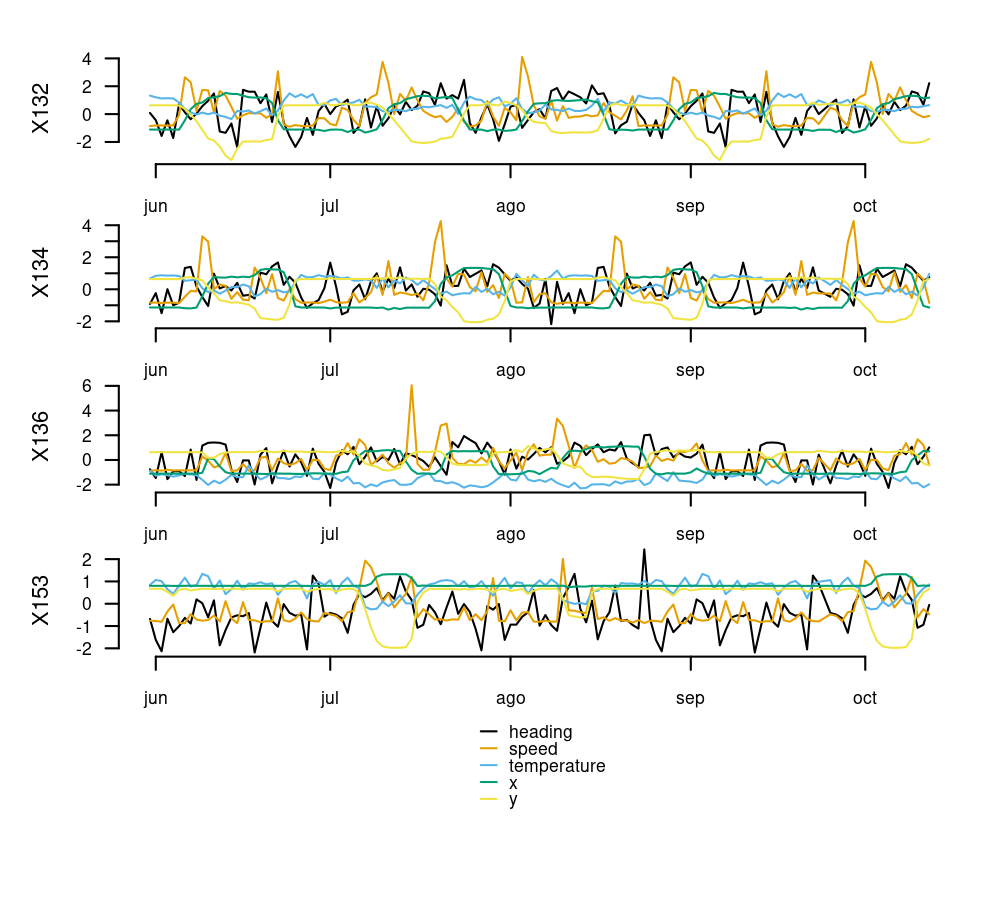
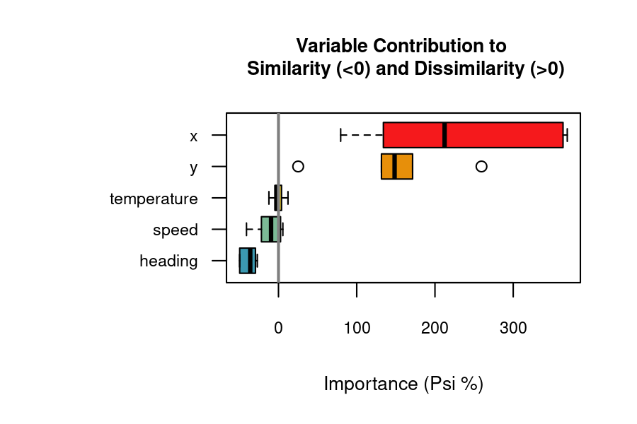
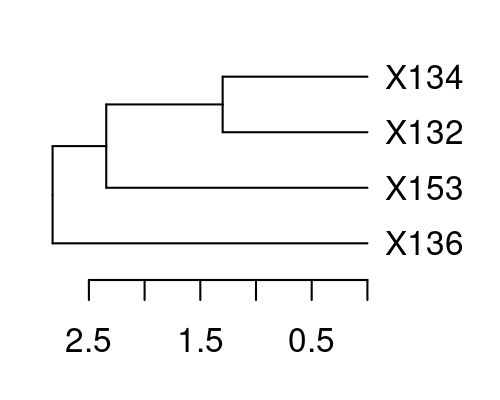

# `distantia` Time Series Dissimilarity <a href="https://github.com/BlasBenito/distantia"></a>

<!-- README.md is generated from README.Rmd. Please edit that file -->
<!-- badges: start -->

[](https://zenodo.org/badge/latestdoi/187805264)
[](https://CRAN.R-project.org/package=distantia)
[](https://CRAN.R-project.org/package=distantia)
[](https://github.com/BlasBenito/distantia/actions/workflows/R-CMD-check.yaml)

<!-- badges: end -->

## Warning

Version 2.0.0 of `distantia` is a full re-write of the original package
and **will break existing workflows** before **making them better**.
Please refer to the
[Changelog](https://blasbenito.github.io/distantia/news/index.html) for
details before updating.

## Summary

The R package **`distantia`** offers an efficient, feature-rich toolkit
for managing, comparing, and analyzing time series data. It is designed
to handle a wide range of scenarios, including:

- Multivariate or univariate time series.
- Regular or irregular sampling.
- Time series of different lengths.

### Key Features

#### Comprehensive Analytical Tools

- 10 distance metrics: see `distantia::distances`.
- The normalized dissimilarity metric `psi`.
- Three Dynamic Time Warping (DTW) methods for shape-based comparisons.
- A Lock-Step method for sample-to-sample alignment.
- Restricted permutation tests for robust inferential support.
- Variable Importance Analysis: assessment of contribution to
  dissimilarity of individual variables in multivariate time series.
- Hierarchical and K-means clustering of time series based on
  dissimilarity matrices.

#### Computational Efficiency

- A **C++ back-end** powered by [Rcpp](https://www.rcpp.org/).
- **Parallel processing** managed through the
  [future](https://future.futureverse.org/) package.
- **Efficient data handling** via
  [zoo](https://cran.r-project.org/web/packages/zoo/index.html).

#### Time Series Management Tools

- Introduces **time series lists (`tsl`)**, a versatile format for
  handling collections of time series stored as lists of `zoo` objects.
- Includes a suite of `tsl_...()` functions for generating, resampling,
  transforming, analyzing, and visualizing both univariate and
  multivariate time series.

## Citation

If you find this package useful, please cite it as:

*Blas M. Benito, H. John B. Birks (2020). distantia: an open-source
toolset to quantify dissimilarity between multivariate ecological
time-series. Ecography, 43(5), 660-667. doi:
[10.1111/ecog.04895](https://nsojournals.onlinelibrary.wiley.com/doi/10.1111/ecog.04895).*

*Blas M. Benito (2024). distantia: A Toolset for Time Series
Dissimilarity Analysis. R package version 2.0.0. url:
<https://blasbenito.github.io/distantia/>.*

## Install

The package `distantia` can be installed from CRAN.

``` r
install.packages("distantia")
```

The development version can be installed from GitHub.

``` r
remotes::install_github(
  repo = "blasbenito/distantia", 
  ref = "development"
  )
```

## Getting Started

This section showcases several features of the package `distantia`.
Please, check the **Articles** section for further details.

### Setup

All heavy duty functions in `distantia` now support a parallelization
backend and progress bars.

``` r
library(distantia)
library(future)
library(parallelly)

#parallelization setup
future::plan(
  future::multisession,
  workers = parallelly::availableCores() - 1
  )

#progress bar (does not work in Rmarkdown)
#progressr::handlers(global = TRUE)
```

### Example Data

The `albatross` data frame contains daily GPS data of 4 individuals of
Waved Albatross in the Pacific captured during the summer of 2008. Below
are the first 10 rows of this data frame:

    #>   name       time         x         y     speed temperature  heading
    #> 1 X132 2008-05-31 -89.62097 -1.389512 0.1473333    29.06667 212.0307
    #> 2 X132 2008-06-01 -89.62101 -1.389508 0.2156250    28.25000 184.0337
    #> 3 X132 2008-06-02 -89.62101 -1.389503 0.2143750    27.68750 123.1269
    #> 4 X132 2008-06-03 -89.62099 -1.389508 0.2018750    27.81250 183.4600
    #> 5 X132 2008-06-04 -89.62098 -1.389507 0.2256250    27.68750 114.8931
    #> 6 X132 2008-06-05 -89.62925 -1.425734 1.3706667    25.73333 245.8033

The `albatross` data is converted to *Time Series List* with
`tsl_initialize()`, and scaled and centered with `tsl_transform()` and
`f_scale`, to facilitate shape-based comparisons and variable importance
analyses.

``` r
tsl <- tsl_initialize(
  x = albatross,
  name_column = "name",
  time_column = "time",
  lock_step = TRUE
) |> 
  tsl_transform(
    f = f_scale
  )

tsl_plot(
  tsl = tsl,
  ylim = "relative"
)
```



### Dissimilarity Analysis

#### Lock-Step Analysis

Lock-step analysis performs direct sample-to-sample comparisons without
time distortion. It requires time series of the same length, observed at
the same times.

``` r
df_ls <- distantia(
  tsl = tsl,
  lock_step = TRUE
)

df_ls[, c("x", "y", "psi")]
#>      x    y      psi
#> 6 X136 X153 1.515698
#> 5 X134 X153 1.703707
#> 3 X132 X153 1.726095
#> 4 X134 X136 1.745060
#> 1 X132 X134 1.811480
#> 2 X132 X136 1.837204
```

The “psi” column contains normalized dissimilarity values and is used to
sort the data frame from lowest to highest dissimilarity (the first row
shows the most similar time series).

The function `distantia_boxplot()` helps quickly identify time series
that are either more dissimilar (top) or similar (bottom) to others.

``` r
distantia_boxplot(df = df_ls)
```


#### Dynamic Time Warping

By default, the function `distantia()` calculates the dissimilarity
between pairs of time series using dynamic time warping (DTW) with
weighted diagonals by default. This approach is useful for time series
shifted due to factors such as varying phenology, asynchronous behavior,
or non-overlapping sampling periods.

``` r
df_dtw <- distantia(
  tsl = tsl
)

df_dtw[, c("x", "y", "psi")]
#>      x    y      psi
#> 1 X132 X134 1.209322
#> 4 X134 X136 1.337882
#> 2 X132 X136 1.440403
#> 5 X134 X153 1.442791
#> 6 X136 X153 1.466519
#> 3 X132 X153 1.790897
```

The function `distantia_plot()` provides detailed insights into the
alignment between a pair of time series resulting from DTW.

``` r
distantia_plot(
  tsl = tsl[c("X132", "X153")]
)
```


Deviations from the perfect diagonal in the least-cost path reveal
adjustments made by DTW to align time series by shape rather than time.
Vertical or horizontal segments indicate one sample of a time series is
matched with multiple samples of another.

### Permutation Test

`distantia` implements restricted permutation tests to assess the
significance of dissimilarity scores, supporting various configurations
based on data assumptions.

For example, the configuration below rearranges complete rows within
7-day blocks, assuming strong dependencies within rows and between
observations close in time.

``` r
df_dtw <- distantia(
  tsl = tsl,
  repetitions = 1000,
  permutation = "restricted_by_row",
  block_size = 7
)

df_dtw[, c("x", "y", "psi", "p_value")]
#>      x    y      psi p_value
#> 1 X132 X134 1.209322   0.001
#> 4 X134 X136 1.337882   0.001
#> 2 X132 X136 1.440403   0.003
#> 5 X134 X153 1.442791   0.001
#> 6 X136 X153 1.466519   0.001
#> 3 X132 X153 1.790897   0.248
```

The “p_value” column represents the fraction of permutations yielding a
psi score lower than the observed value. It indicates the strength of
similarity between two time series. A significance threshold (e.g.,
0.05, depending on iterations) helps identify strongly similar or
dissimilar pairs.

### Variable Importance

When comparing multivariate time series, certain variables contribute
more to similarity or dissimilarity. The `distantia_importance()`
function uses a leave-one-out algorithm to quantify each variable’s
contribution.

``` r
df_importance <- distantia_importance(
  tsl = tsl
)

df_importance[, c("x", "y", "variable", "importance", "effect")]
#>       x    y    variable  importance               effect
#> 1  X132 X134           x 151.4845183 decreases similarity
#> 2  X132 X134           y 137.9871963 decreases similarity
#> 3  X132 X134       speed  -8.5695768 increases similarity
#> 4  X132 X134 temperature  12.1560062 decreases similarity
#> 5  X132 X134     heading -37.5712802 increases similarity
#> 6  X132 X136           x 134.0615862 decreases similarity
#> 7  X132 X136           y 171.4272268 decreases similarity
#> 8  X132 X136       speed -21.8177540 increases similarity
#> 9  X132 X136 temperature  -0.7049952 increases similarity
#> 10 X132 X136     heading -27.0675745 increases similarity
#> 11 X132 X153           x 363.6775843 decreases similarity
#> 12 X132 X153           y 259.4641204 decreases similarity
#> 13 X132 X153       speed -40.8790600 increases similarity
#> 14 X132 X153 temperature -12.2307646 increases similarity
#> 15 X132 X153     heading -49.5883487 increases similarity
#> 16 X134 X136           x  79.4974807 decreases similarity
#> 17 X134 X136           y 131.6027786 decreases similarity
#> 18 X134 X136       speed   2.6287070 decreases similarity
#> 19 X134 X136 temperature   3.8804616 decreases similarity
#> 20 X134 X136     heading -29.4241555 increases similarity
#> 21 X134 X153           x 369.0825054 decreases similarity
#> 22 X134 X153           y 158.8073779 decreases similarity
#> 23 X134 X153       speed -10.3829941 increases similarity
#> 24 X134 X153 temperature  -4.4291460 increases similarity
#> 25 X134 X153     heading -49.6994243 increases similarity
#> 26 X136 X153           x 273.1341218 decreases similarity
#> 27 X136 X153           y  25.1517493 decreases similarity
#> 28 X136 X153       speed   5.6063404 decreases similarity
#> 29 X136 X153 temperature  -4.1899552 increases similarity
#> 30 X136 X153     heading -34.6100591 increases similarity
```

Positive “importance” values indicate variables increasing differences
between time series, while negative values indicate variables enhancing
similarity. The function documentation provides more details on how
importance scores are computed.

The `distantia_boxplot()` function can provide insights into which
variables contribute the most to similarity or dissimilarity.

``` r
distantia_boxplot(
  df = df_importance
)
```



### Clustering

`distantia` provides tools for grouping time series by dissimilarity
using hierarchical clustering or k-means.

``` r
dtw_hclust <- distantia_cluster_hclust(
  df = df_dtw,
  clusters = NULL, #automatic mode
  method = NULL    #automatic mode
  )

#cluster object
dtw_hclust$cluster_object
#> 
#> Call:
#> stats::hclust(d = d_dist, method = method)
#> 
#> Cluster method   : ward.D 
#> Number of objects: 4
```

``` r

#number of clusters
dtw_hclust$clusters
#> [1] 2
```

``` r

#clustering data frame
#group label in column "cluster"
#negatives in column "silhouette_width" higlight anomalous cluster assignation
dtw_hclust$df
#>   name cluster silhouette_width
#> 1 X132       1       0.26022412
#> 2 X134       1       0.11726523
#> 3 X136       1       0.05276177
#> 4 X153       2       0.00000000
```

``` r

#tree plot
par(mar=c(3,1,1,3))

plot(
  x = stats::as.dendrogram(
    dtw_hclust$cluster_object
    ),
  horiz = TRUE
)
```



## Getting help

If you encounter bugs or issues with the documentation, please [file a
issue on GitHub](https://github.com/BlasBenito/distantia/issues).
