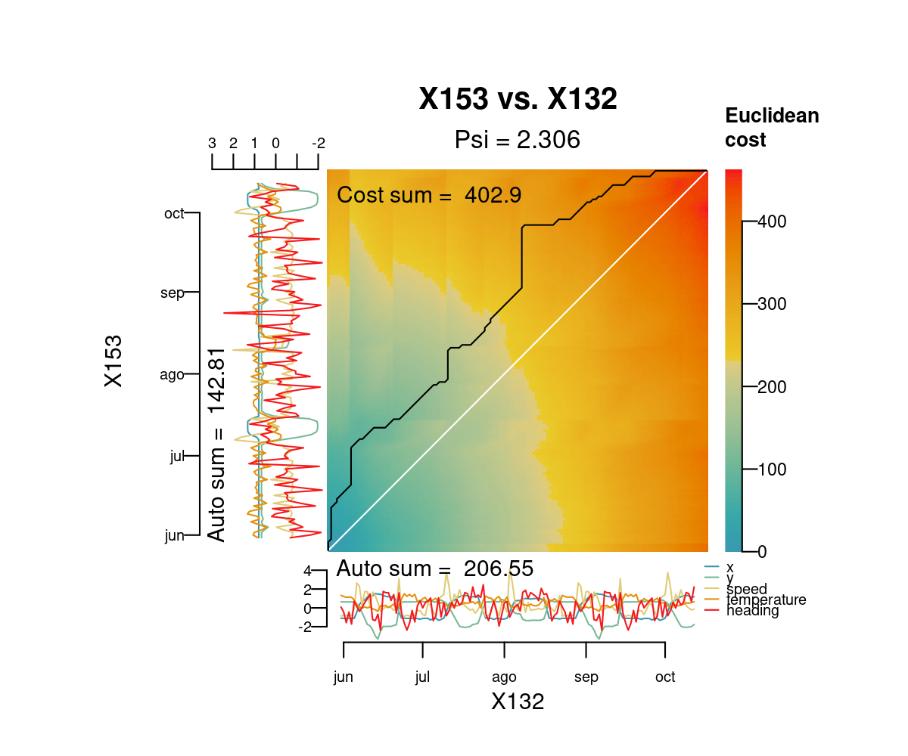

<!-- README.md is generated from README.Rmd. Please edit that file -->

# distantia

<!-- badges: start -->

<!-- badges: end -->

The package **distantia** implements the *sequence slotting* method
proposed described in [“Numerical methods in Quaternary pollen
analysis”](https://onlinelibrary.wiley.com/doi/abs/10.1002/gea.3340010406)
(Birks and Gordon, 1985). In this document I briefly explain the logics
behind the method, and the extensions and new applications implementd in
the **distantia** package

## Installation

You can install the released version of distantia from
[CRAN](https://CRAN.R-project.org) with:

``` r
# install.packages("distantia")
```

And the development version from [GitHub](https://github.com/) with:

``` r
# install.packages("devtools")
# devtools::install_github("BlasBenito/distantia")
```

Loading the library, plus other helper libraries:

``` r
library(distantia)
library(kableExtra)
```

## Logics behind the method

The objective of this method is to **compute the dissimilarity between
two (or more) multivariate time-series** (hereafter, *sequences*). These
sequences can be either regular (same time between consecutive samples)
or irregular (different time between consecutive samples), and can be
aligned (same number of samples) or unaligned (different number of
samples).

The only restrictions are that any given entity represented by a column
must have the same name in both datasets, and that these sequences must
be ordered (in time, depth, rank) from top to bottom in the given
dataframe.

The package provides two example datasets based on the Abernethy pollen
core (Birks and Mathewes (1978):

``` r
data(sequenceA)
data(sequenceB)

str(sequenceA)
#> 'data.frame':    49 obs. of  9 variables:
#>  $ betula: int  79 113 51 130 31 59 78 71 140 150 ...
#>  $ pinus : int  271 320 420 470 450 425 386 397 310 323 ...
#>  $ corylu: int  36 42 39 6 6 12 29 52 50 34 ...
#>  $ junipe: int  0 0 0 0 0 0 2 2 2 2 ...
#>  $ empetr: int  4 4 2 0 3 0 0 0 0 0 ...
#>  $ gramin: int  7 3 1 2 2 2 0 6 4 11 ...
#>  $ cypera: int  25 11 12 4 3 3 2 3 3 2 ...
#>  $ artemi: int  0 0 0 0 0 0 0 0 0 0 ...
#>  $ rumex : int  0 0 0 0 0 0 0 0 0 0 ...
str(sequenceB)
#> 'data.frame':    41 obs. of  8 variables:
#>  $ betula: int  19 18 30 26 31 24 23 48 29 23 ...
#>  $ pinus : int  175 119 99 101 99 97 105 112 108 110 ...
#>  $ corylu: int  NA 28 37 29 30 28 34 46 16 21 ...
#>  $ junipe: int  2 1 0 0 0 0 0 0 0 0 ...
#>  $ gramin: int  34 36 2 0 1 2 1 0 6 2 ...
#>  $ cypera: int  39 44 20 18 10 9 6 12 3 11 ...
#>  $ artemi: int  1 0 0 0 0 0 0 0 0 0 ...
#>  $ rumex : int  0 4 1 0 0 0 0 0 0 1 ...

kable(sequenceA, caption = "Sequence A")
```

<table>

<caption>

Sequence A

</caption>

<thead>

<tr>

<th style="text-align:right;">

betula

</th>

<th style="text-align:right;">

pinus

</th>

<th style="text-align:right;">

corylu

</th>

<th style="text-align:right;">

junipe

</th>

<th style="text-align:right;">

empetr

</th>

<th style="text-align:right;">

gramin

</th>

<th style="text-align:right;">

cypera

</th>

<th style="text-align:right;">

artemi

</th>

<th style="text-align:right;">

rumex

</th>

</tr>

</thead>

<tbody>

<tr>

<td style="text-align:right;">

79

</td>

<td style="text-align:right;">

271

</td>

<td style="text-align:right;">

36

</td>

<td style="text-align:right;">

0

</td>

<td style="text-align:right;">

4

</td>

<td style="text-align:right;">

7

</td>

<td style="text-align:right;">

25

</td>

<td style="text-align:right;">

0

</td>

<td style="text-align:right;">

0

</td>

</tr>

<tr>

<td style="text-align:right;">

113

</td>

<td style="text-align:right;">

320

</td>

<td style="text-align:right;">

42

</td>

<td style="text-align:right;">

0

</td>

<td style="text-align:right;">

4

</td>

<td style="text-align:right;">

3

</td>

<td style="text-align:right;">

11

</td>

<td style="text-align:right;">

0

</td>

<td style="text-align:right;">

0

</td>

</tr>

<tr>

<td style="text-align:right;">

51

</td>

<td style="text-align:right;">

420

</td>

<td style="text-align:right;">

39

</td>

<td style="text-align:right;">

0

</td>

<td style="text-align:right;">

2

</td>

<td style="text-align:right;">

1

</td>

<td style="text-align:right;">

12

</td>

<td style="text-align:right;">

0

</td>

<td style="text-align:right;">

0

</td>

</tr>

<tr>

<td style="text-align:right;">

130

</td>

<td style="text-align:right;">

470

</td>

<td style="text-align:right;">

6

</td>

<td style="text-align:right;">

0

</td>

<td style="text-align:right;">

0

</td>

<td style="text-align:right;">

2

</td>

<td style="text-align:right;">

4

</td>

<td style="text-align:right;">

0

</td>

<td style="text-align:right;">

0

</td>

</tr>

<tr>

<td style="text-align:right;">

31

</td>

<td style="text-align:right;">

450

</td>

<td style="text-align:right;">

6

</td>

<td style="text-align:right;">

0

</td>

<td style="text-align:right;">

3

</td>

<td style="text-align:right;">

2

</td>

<td style="text-align:right;">

3

</td>

<td style="text-align:right;">

0

</td>

<td style="text-align:right;">

0

</td>

</tr>

<tr>

<td style="text-align:right;">

59

</td>

<td style="text-align:right;">

425

</td>

<td style="text-align:right;">

12

</td>

<td style="text-align:right;">

0

</td>

<td style="text-align:right;">

0

</td>

<td style="text-align:right;">

2

</td>

<td style="text-align:right;">

3

</td>

<td style="text-align:right;">

0

</td>

<td style="text-align:right;">

0

</td>

</tr>

<tr>

<td style="text-align:right;">

78

</td>

<td style="text-align:right;">

386

</td>

<td style="text-align:right;">

29

</td>

<td style="text-align:right;">

2

</td>

<td style="text-align:right;">

0

</td>

<td style="text-align:right;">

0

</td>

<td style="text-align:right;">

2

</td>

<td style="text-align:right;">

0

</td>

<td style="text-align:right;">

0

</td>

</tr>

<tr>

<td style="text-align:right;">

71

</td>

<td style="text-align:right;">

397

</td>

<td style="text-align:right;">

52

</td>

<td style="text-align:right;">

2

</td>

<td style="text-align:right;">

0

</td>

<td style="text-align:right;">

6

</td>

<td style="text-align:right;">

3

</td>

<td style="text-align:right;">

0

</td>

<td style="text-align:right;">

0

</td>

</tr>

<tr>

<td style="text-align:right;">

140

</td>

<td style="text-align:right;">

310

</td>

<td style="text-align:right;">

50

</td>

<td style="text-align:right;">

2

</td>

<td style="text-align:right;">

0

</td>

<td style="text-align:right;">

4

</td>

<td style="text-align:right;">

3

</td>

<td style="text-align:right;">

0

</td>

<td style="text-align:right;">

0

</td>

</tr>

<tr>

<td style="text-align:right;">

150

</td>

<td style="text-align:right;">

323

</td>

<td style="text-align:right;">

34

</td>

<td style="text-align:right;">

2

</td>

<td style="text-align:right;">

0

</td>

<td style="text-align:right;">

11

</td>

<td style="text-align:right;">

2

</td>

<td style="text-align:right;">

0

</td>

<td style="text-align:right;">

0

</td>

</tr>

<tr>

<td style="text-align:right;">

175

</td>

<td style="text-align:right;">

317

</td>

<td style="text-align:right;">

37

</td>

<td style="text-align:right;">

2

</td>

<td style="text-align:right;">

0

</td>

<td style="text-align:right;">

11

</td>

<td style="text-align:right;">

3

</td>

<td style="text-align:right;">

0

</td>

<td style="text-align:right;">

0

</td>

</tr>

<tr>

<td style="text-align:right;">

181

</td>

<td style="text-align:right;">

345

</td>

<td style="text-align:right;">

28

</td>

<td style="text-align:right;">

3

</td>

<td style="text-align:right;">

0

</td>

<td style="text-align:right;">

7

</td>

<td style="text-align:right;">

3

</td>

<td style="text-align:right;">

0

</td>

<td style="text-align:right;">

0

</td>

</tr>

<tr>

<td style="text-align:right;">

153

</td>

<td style="text-align:right;">

285

</td>

<td style="text-align:right;">

36

</td>

<td style="text-align:right;">

2

</td>

<td style="text-align:right;">

0

</td>

<td style="text-align:right;">

8

</td>

<td style="text-align:right;">

3

</td>

<td style="text-align:right;">

0

</td>

<td style="text-align:right;">

1

</td>

</tr>

<tr>

<td style="text-align:right;">

214

</td>

<td style="text-align:right;">

315

</td>

<td style="text-align:right;">

54

</td>

<td style="text-align:right;">

2

</td>

<td style="text-align:right;">

1

</td>

<td style="text-align:right;">

13

</td>

<td style="text-align:right;">

5

</td>

<td style="text-align:right;">

0

</td>

<td style="text-align:right;">

0

</td>

</tr>

<tr>

<td style="text-align:right;">

200

</td>

<td style="text-align:right;">

210

</td>

<td style="text-align:right;">

41

</td>

<td style="text-align:right;">

6

</td>

<td style="text-align:right;">

0

</td>

<td style="text-align:right;">

10

</td>

<td style="text-align:right;">

4

</td>

<td style="text-align:right;">

0

</td>

<td style="text-align:right;">

0

</td>

</tr>

<tr>

<td style="text-align:right;">

360

</td>

<td style="text-align:right;">

91

</td>

<td style="text-align:right;">

105

</td>

<td style="text-align:right;">

5

</td>

<td style="text-align:right;">

0

</td>

<td style="text-align:right;">

20

</td>

<td style="text-align:right;">

7

</td>

<td style="text-align:right;">

0

</td>

<td style="text-align:right;">

0

</td>

</tr>

<tr>

<td style="text-align:right;">

285

</td>

<td style="text-align:right;">

26

</td>

<td style="text-align:right;">

120

</td>

<td style="text-align:right;">

1

</td>

<td style="text-align:right;">

1

</td>

<td style="text-align:right;">

13

</td>

<td style="text-align:right;">

4

</td>

<td style="text-align:right;">

0

</td>

<td style="text-align:right;">

0

</td>

</tr>

<tr>

<td style="text-align:right;">

357

</td>

<td style="text-align:right;">

25

</td>

<td style="text-align:right;">

130

</td>

<td style="text-align:right;">

1

</td>

<td style="text-align:right;">

3

</td>

<td style="text-align:right;">

12

</td>

<td style="text-align:right;">

6

</td>

<td style="text-align:right;">

0

</td>

<td style="text-align:right;">

0

</td>

</tr>

<tr>

<td style="text-align:right;">

304

</td>

<td style="text-align:right;">

11

</td>

<td style="text-align:right;">

151

</td>

<td style="text-align:right;">

0

</td>

<td style="text-align:right;">

3

</td>

<td style="text-align:right;">

10

</td>

<td style="text-align:right;">

4

</td>

<td style="text-align:right;">

0

</td>

<td style="text-align:right;">

0

</td>

</tr>

<tr>

<td style="text-align:right;">

365

</td>

<td style="text-align:right;">

9

</td>

<td style="text-align:right;">

150

</td>

<td style="text-align:right;">

0

</td>

<td style="text-align:right;">

4

</td>

<td style="text-align:right;">

19

</td>

<td style="text-align:right;">

5

</td>

<td style="text-align:right;">

0

</td>

<td style="text-align:right;">

0

</td>

</tr>

<tr>

<td style="text-align:right;">

375

</td>

<td style="text-align:right;">

12

</td>

<td style="text-align:right;">

116

</td>

<td style="text-align:right;">

1

</td>

<td style="text-align:right;">

2

</td>

<td style="text-align:right;">

18

</td>

<td style="text-align:right;">

11

</td>

<td style="text-align:right;">

0

</td>

<td style="text-align:right;">

0

</td>

</tr>

<tr>

<td style="text-align:right;">

365

</td>

<td style="text-align:right;">

9

</td>

<td style="text-align:right;">

138

</td>

<td style="text-align:right;">

5

</td>

<td style="text-align:right;">

2

</td>

<td style="text-align:right;">

19

</td>

<td style="text-align:right;">

6

</td>

<td style="text-align:right;">

0

</td>

<td style="text-align:right;">

0

</td>

</tr>

<tr>

<td style="text-align:right;">

382

</td>

<td style="text-align:right;">

10

</td>

<td style="text-align:right;">

92

</td>

<td style="text-align:right;">

4

</td>

<td style="text-align:right;">

3

</td>

<td style="text-align:right;">

13

</td>

<td style="text-align:right;">

1

</td>

<td style="text-align:right;">

0

</td>

<td style="text-align:right;">

2

</td>

</tr>

<tr>

<td style="text-align:right;">

390

</td>

<td style="text-align:right;">

12

</td>

<td style="text-align:right;">

98

</td>

<td style="text-align:right;">

8

</td>

<td style="text-align:right;">

3

</td>

<td style="text-align:right;">

14

</td>

<td style="text-align:right;">

5

</td>

<td style="text-align:right;">

0

</td>

<td style="text-align:right;">

1

</td>

</tr>

<tr>

<td style="text-align:right;">

361

</td>

<td style="text-align:right;">

8

</td>

<td style="text-align:right;">

72

</td>

<td style="text-align:right;">

32

</td>

<td style="text-align:right;">

8

</td>

<td style="text-align:right;">

20

</td>

<td style="text-align:right;">

5

</td>

<td style="text-align:right;">

0

</td>

<td style="text-align:right;">

1

</td>

</tr>

<tr>

<td style="text-align:right;">

405

</td>

<td style="text-align:right;">

12

</td>

<td style="text-align:right;">

37

</td>

<td style="text-align:right;">

31

</td>

<td style="text-align:right;">

8

</td>

<td style="text-align:right;">

23

</td>

<td style="text-align:right;">

4

</td>

<td style="text-align:right;">

0

</td>

<td style="text-align:right;">

3

</td>

</tr>

<tr>

<td style="text-align:right;">

386

</td>

<td style="text-align:right;">

16

</td>

<td style="text-align:right;">

10

</td>

<td style="text-align:right;">

62

</td>

<td style="text-align:right;">

18

</td>

<td style="text-align:right;">

18

</td>

<td style="text-align:right;">

7

</td>

<td style="text-align:right;">

0

</td>

<td style="text-align:right;">

6

</td>

</tr>

<tr>

<td style="text-align:right;">

411

</td>

<td style="text-align:right;">

21

</td>

<td style="text-align:right;">

8

</td>

<td style="text-align:right;">

55

</td>

<td style="text-align:right;">

10

</td>

<td style="text-align:right;">

55

</td>

<td style="text-align:right;">

14

</td>

<td style="text-align:right;">

0

</td>

<td style="text-align:right;">

8

</td>

</tr>

<tr>

<td style="text-align:right;">

394

</td>

<td style="text-align:right;">

13

</td>

<td style="text-align:right;">

12

</td>

<td style="text-align:right;">

64

</td>

<td style="text-align:right;">

11

</td>

<td style="text-align:right;">

34

</td>

<td style="text-align:right;">

13

</td>

<td style="text-align:right;">

0

</td>

<td style="text-align:right;">

5

</td>

</tr>

<tr>

<td style="text-align:right;">

338

</td>

<td style="text-align:right;">

24

</td>

<td style="text-align:right;">

6

</td>

<td style="text-align:right;">

128

</td>

<td style="text-align:right;">

9

</td>

<td style="text-align:right;">

45

</td>

<td style="text-align:right;">

16

</td>

<td style="text-align:right;">

0

</td>

<td style="text-align:right;">

6

</td>

</tr>

<tr>

<td style="text-align:right;">

311

</td>

<td style="text-align:right;">

4

</td>

<td style="text-align:right;">

1

</td>

<td style="text-align:right;">

132

</td>

<td style="text-align:right;">

31

</td>

<td style="text-align:right;">

78

</td>

<td style="text-align:right;">

12

</td>

<td style="text-align:right;">

1

</td>

<td style="text-align:right;">

1

</td>

</tr>

<tr>

<td style="text-align:right;">

236

</td>

<td style="text-align:right;">

9

</td>

<td style="text-align:right;">

5

</td>

<td style="text-align:right;">

206

</td>

<td style="text-align:right;">

19

</td>

<td style="text-align:right;">

45

</td>

<td style="text-align:right;">

13

</td>

<td style="text-align:right;">

0

</td>

<td style="text-align:right;">

7

</td>

</tr>

<tr>

<td style="text-align:right;">

98

</td>

<td style="text-align:right;">

12

</td>

<td style="text-align:right;">

5

</td>

<td style="text-align:right;">

108

</td>

<td style="text-align:right;">

122

</td>

<td style="text-align:right;">

110

</td>

<td style="text-align:right;">

49

</td>

<td style="text-align:right;">

0

</td>

<td style="text-align:right;">

7

</td>

</tr>

<tr>

<td style="text-align:right;">

8

</td>

<td style="text-align:right;">

3

</td>

<td style="text-align:right;">

0

</td>

<td style="text-align:right;">

1

</td>

<td style="text-align:right;">

4

</td>

<td style="text-align:right;">

74

</td>

<td style="text-align:right;">

43

</td>

<td style="text-align:right;">

28

</td>

<td style="text-align:right;">

26

</td>

</tr>

<tr>

<td style="text-align:right;">

16

</td>

<td style="text-align:right;">

21

</td>

<td style="text-align:right;">

1

</td>

<td style="text-align:right;">

0

</td>

<td style="text-align:right;">

4

</td>

<td style="text-align:right;">

31

</td>

<td style="text-align:right;">

46

</td>

<td style="text-align:right;">

143

</td>

<td style="text-align:right;">

35

</td>

</tr>

<tr>

<td style="text-align:right;">

20

</td>

<td style="text-align:right;">

14

</td>

<td style="text-align:right;">

0

</td>

<td style="text-align:right;">

0

</td>

<td style="text-align:right;">

8

</td>

<td style="text-align:right;">

19

</td>

<td style="text-align:right;">

18

</td>

<td style="text-align:right;">

132

</td>

<td style="text-align:right;">

27

</td>

</tr>

<tr>

<td style="text-align:right;">

14

</td>

<td style="text-align:right;">

14

</td>

<td style="text-align:right;">

2

</td>

<td style="text-align:right;">

1

</td>

<td style="text-align:right;">

4

</td>

<td style="text-align:right;">

19

</td>

<td style="text-align:right;">

10

</td>

<td style="text-align:right;">

97

</td>

<td style="text-align:right;">

31

</td>

</tr>

<tr>

<td style="text-align:right;">

18

</td>

<td style="text-align:right;">

7

</td>

<td style="text-align:right;">

1

</td>

<td style="text-align:right;">

1

</td>

<td style="text-align:right;">

10

</td>

<td style="text-align:right;">

13

</td>

<td style="text-align:right;">

18

</td>

<td style="text-align:right;">

214

</td>

<td style="text-align:right;">

11

</td>

</tr>

<tr>

<td style="text-align:right;">

23

</td>

<td style="text-align:right;">

11

</td>

<td style="text-align:right;">

1

</td>

<td style="text-align:right;">

0

</td>

<td style="text-align:right;">

8

</td>

<td style="text-align:right;">

19

</td>

<td style="text-align:right;">

14

</td>

<td style="text-align:right;">

130

</td>

<td style="text-align:right;">

12

</td>

</tr>

<tr>

<td style="text-align:right;">

24

</td>

<td style="text-align:right;">

2

</td>

<td style="text-align:right;">

1

</td>

<td style="text-align:right;">

4

</td>

<td style="text-align:right;">

10

</td>

<td style="text-align:right;">

23

</td>

<td style="text-align:right;">

22

</td>

<td style="text-align:right;">

193

</td>

<td style="text-align:right;">

16

</td>

</tr>

<tr>

<td style="text-align:right;">

26

</td>

<td style="text-align:right;">

9

</td>

<td style="text-align:right;">

1

</td>

<td style="text-align:right;">

3

</td>

<td style="text-align:right;">

10

</td>

<td style="text-align:right;">

18

</td>

<td style="text-align:right;">

16

</td>

<td style="text-align:right;">

134

</td>

<td style="text-align:right;">

4

</td>

</tr>

<tr>

<td style="text-align:right;">

167

</td>

<td style="text-align:right;">

26

</td>

<td style="text-align:right;">

7

</td>

<td style="text-align:right;">

68

</td>

<td style="text-align:right;">

119

</td>

<td style="text-align:right;">

102

</td>

<td style="text-align:right;">

64

</td>

<td style="text-align:right;">

2

</td>

<td style="text-align:right;">

28

</td>

</tr>

<tr>

<td style="text-align:right;">

183

</td>

<td style="text-align:right;">

6

</td>

<td style="text-align:right;">

4

</td>

<td style="text-align:right;">

13

</td>

<td style="text-align:right;">

200

</td>

<td style="text-align:right;">

69

</td>

<td style="text-align:right;">

47

</td>

<td style="text-align:right;">

8

</td>

<td style="text-align:right;">

26

</td>

</tr>

<tr>

<td style="text-align:right;">

118

</td>

<td style="text-align:right;">

5

</td>

<td style="text-align:right;">

3

</td>

<td style="text-align:right;">

0

</td>

<td style="text-align:right;">

202

</td>

<td style="text-align:right;">

119

</td>

<td style="text-align:right;">

70

</td>

<td style="text-align:right;">

7

</td>

<td style="text-align:right;">

21

</td>

</tr>

<tr>

<td style="text-align:right;">

100

</td>

<td style="text-align:right;">

1

</td>

<td style="text-align:right;">

1

</td>

<td style="text-align:right;">

0

</td>

<td style="text-align:right;">

190

</td>

<td style="text-align:right;">

81

</td>

<td style="text-align:right;">

36

</td>

<td style="text-align:right;">

6

</td>

<td style="text-align:right;">

97

</td>

</tr>

<tr>

<td style="text-align:right;">

7

</td>

<td style="text-align:right;">

3

</td>

<td style="text-align:right;">

0

</td>

<td style="text-align:right;">

2

</td>

<td style="text-align:right;">

3

</td>

<td style="text-align:right;">

38

</td>

<td style="text-align:right;">

10

</td>

<td style="text-align:right;">

2

</td>

<td style="text-align:right;">

30

</td>

</tr>

<tr>

<td style="text-align:right;">

3

</td>

<td style="text-align:right;">

2

</td>

<td style="text-align:right;">

0

</td>

<td style="text-align:right;">

0

</td>

<td style="text-align:right;">

1

</td>

<td style="text-align:right;">

21

</td>

<td style="text-align:right;">

7

</td>

<td style="text-align:right;">

2

</td>

<td style="text-align:right;">

36

</td>

</tr>

<tr>

<td style="text-align:right;">

8

</td>

<td style="text-align:right;">

9

</td>

<td style="text-align:right;">

1

</td>

<td style="text-align:right;">

0

</td>

<td style="text-align:right;">

4

</td>

<td style="text-align:right;">

15

</td>

<td style="text-align:right;">

12

</td>

<td style="text-align:right;">

1

</td>

<td style="text-align:right;">

30

</td>

</tr>

<tr>

<td style="text-align:right;">

1

</td>

<td style="text-align:right;">

2

</td>

<td style="text-align:right;">

1

</td>

<td style="text-align:right;">

0

</td>

<td style="text-align:right;">

1

</td>

<td style="text-align:right;">

9

</td>

<td style="text-align:right;">

20

</td>

<td style="text-align:right;">

4

</td>

<td style="text-align:right;">

35

</td>

</tr>

</tbody>

</table>

``` r
kable(sequenceB, caption = "Sequence B")
```

<table>

<caption>

Sequence B

</caption>

<thead>

<tr>

<th style="text-align:right;">

betula

</th>

<th style="text-align:right;">

pinus

</th>

<th style="text-align:right;">

corylu

</th>

<th style="text-align:right;">

junipe

</th>

<th style="text-align:right;">

gramin

</th>

<th style="text-align:right;">

cypera

</th>

<th style="text-align:right;">

artemi

</th>

<th style="text-align:right;">

rumex

</th>

</tr>

</thead>

<tbody>

<tr>

<td style="text-align:right;">

19

</td>

<td style="text-align:right;">

175

</td>

<td style="text-align:right;">

NA

</td>

<td style="text-align:right;">

2

</td>

<td style="text-align:right;">

34

</td>

<td style="text-align:right;">

39

</td>

<td style="text-align:right;">

1

</td>

<td style="text-align:right;">

0

</td>

</tr>

<tr>

<td style="text-align:right;">

18

</td>

<td style="text-align:right;">

119

</td>

<td style="text-align:right;">

28

</td>

<td style="text-align:right;">

1

</td>

<td style="text-align:right;">

36

</td>

<td style="text-align:right;">

44

</td>

<td style="text-align:right;">

0

</td>

<td style="text-align:right;">

4

</td>

</tr>

<tr>

<td style="text-align:right;">

30

</td>

<td style="text-align:right;">

99

</td>

<td style="text-align:right;">

37

</td>

<td style="text-align:right;">

0

</td>

<td style="text-align:right;">

2

</td>

<td style="text-align:right;">

20

</td>

<td style="text-align:right;">

0

</td>

<td style="text-align:right;">

1

</td>

</tr>

<tr>

<td style="text-align:right;">

26

</td>

<td style="text-align:right;">

101

</td>

<td style="text-align:right;">

29

</td>

<td style="text-align:right;">

0

</td>

<td style="text-align:right;">

0

</td>

<td style="text-align:right;">

18

</td>

<td style="text-align:right;">

0

</td>

<td style="text-align:right;">

0

</td>

</tr>

<tr>

<td style="text-align:right;">

31

</td>

<td style="text-align:right;">

99

</td>

<td style="text-align:right;">

30

</td>

<td style="text-align:right;">

0

</td>

<td style="text-align:right;">

1

</td>

<td style="text-align:right;">

10

</td>

<td style="text-align:right;">

0

</td>

<td style="text-align:right;">

0

</td>

</tr>

<tr>

<td style="text-align:right;">

24

</td>

<td style="text-align:right;">

97

</td>

<td style="text-align:right;">

28

</td>

<td style="text-align:right;">

0

</td>

<td style="text-align:right;">

2

</td>

<td style="text-align:right;">

9

</td>

<td style="text-align:right;">

0

</td>

<td style="text-align:right;">

0

</td>

</tr>

<tr>

<td style="text-align:right;">

23

</td>

<td style="text-align:right;">

105

</td>

<td style="text-align:right;">

34

</td>

<td style="text-align:right;">

0

</td>

<td style="text-align:right;">

1

</td>

<td style="text-align:right;">

6

</td>

<td style="text-align:right;">

0

</td>

<td style="text-align:right;">

0

</td>

</tr>

<tr>

<td style="text-align:right;">

48

</td>

<td style="text-align:right;">

112

</td>

<td style="text-align:right;">

46

</td>

<td style="text-align:right;">

0

</td>

<td style="text-align:right;">

0

</td>

<td style="text-align:right;">

12

</td>

<td style="text-align:right;">

0

</td>

<td style="text-align:right;">

0

</td>

</tr>

<tr>

<td style="text-align:right;">

29

</td>

<td style="text-align:right;">

108

</td>

<td style="text-align:right;">

16

</td>

<td style="text-align:right;">

0

</td>

<td style="text-align:right;">

6

</td>

<td style="text-align:right;">

3

</td>

<td style="text-align:right;">

0

</td>

<td style="text-align:right;">

0

</td>

</tr>

<tr>

<td style="text-align:right;">

23

</td>

<td style="text-align:right;">

110

</td>

<td style="text-align:right;">

21

</td>

<td style="text-align:right;">

0

</td>

<td style="text-align:right;">

2

</td>

<td style="text-align:right;">

11

</td>

<td style="text-align:right;">

0

</td>

<td style="text-align:right;">

1

</td>

</tr>

<tr>

<td style="text-align:right;">

5

</td>

<td style="text-align:right;">

119

</td>

<td style="text-align:right;">

19

</td>

<td style="text-align:right;">

0

</td>

<td style="text-align:right;">

1

</td>

<td style="text-align:right;">

1

</td>

<td style="text-align:right;">

0

</td>

<td style="text-align:right;">

0

</td>

</tr>

<tr>

<td style="text-align:right;">

30

</td>

<td style="text-align:right;">

105

</td>

<td style="text-align:right;">

NA

</td>

<td style="text-align:right;">

0

</td>

<td style="text-align:right;">

9

</td>

<td style="text-align:right;">

7

</td>

<td style="text-align:right;">

0

</td>

<td style="text-align:right;">

0

</td>

</tr>

<tr>

<td style="text-align:right;">

22

</td>

<td style="text-align:right;">

116

</td>

<td style="text-align:right;">

17

</td>

<td style="text-align:right;">

0

</td>

<td style="text-align:right;">

1

</td>

<td style="text-align:right;">

7

</td>

<td style="text-align:right;">

0

</td>

<td style="text-align:right;">

0

</td>

</tr>

<tr>

<td style="text-align:right;">

24

</td>

<td style="text-align:right;">

115

</td>

<td style="text-align:right;">

20

</td>

<td style="text-align:right;">

0

</td>

<td style="text-align:right;">

2

</td>

<td style="text-align:right;">

4

</td>

<td style="text-align:right;">

0

</td>

<td style="text-align:right;">

0

</td>

</tr>

<tr>

<td style="text-align:right;">

26

</td>

<td style="text-align:right;">

119

</td>

<td style="text-align:right;">

23

</td>

<td style="text-align:right;">

0

</td>

<td style="text-align:right;">

4

</td>

<td style="text-align:right;">

0

</td>

<td style="text-align:right;">

0

</td>

<td style="text-align:right;">

0

</td>

</tr>

<tr>

<td style="text-align:right;">

18

</td>

<td style="text-align:right;">

130

</td>

<td style="text-align:right;">

37

</td>

<td style="text-align:right;">

0

</td>

<td style="text-align:right;">

2

</td>

<td style="text-align:right;">

3

</td>

<td style="text-align:right;">

0

</td>

<td style="text-align:right;">

0

</td>

</tr>

<tr>

<td style="text-align:right;">

27

</td>

<td style="text-align:right;">

118

</td>

<td style="text-align:right;">

18

</td>

<td style="text-align:right;">

0

</td>

<td style="text-align:right;">

6

</td>

<td style="text-align:right;">

10

</td>

<td style="text-align:right;">

0

</td>

<td style="text-align:right;">

0

</td>

</tr>

<tr>

<td style="text-align:right;">

35

</td>

<td style="text-align:right;">

100

</td>

<td style="text-align:right;">

38

</td>

<td style="text-align:right;">

0

</td>

<td style="text-align:right;">

NA

</td>

<td style="text-align:right;">

15

</td>

<td style="text-align:right;">

0

</td>

<td style="text-align:right;">

0

</td>

</tr>

<tr>

<td style="text-align:right;">

29

</td>

<td style="text-align:right;">

112

</td>

<td style="text-align:right;">

10

</td>

<td style="text-align:right;">

0

</td>

<td style="text-align:right;">

26

</td>

<td style="text-align:right;">

14

</td>

<td style="text-align:right;">

0

</td>

<td style="text-align:right;">

0

</td>

</tr>

<tr>

<td style="text-align:right;">

42

</td>

<td style="text-align:right;">

102

</td>

<td style="text-align:right;">

15

</td>

<td style="text-align:right;">

0

</td>

<td style="text-align:right;">

50

</td>

<td style="text-align:right;">

12

</td>

<td style="text-align:right;">

0

</td>

<td style="text-align:right;">

0

</td>

</tr>

<tr>

<td style="text-align:right;">

42

</td>

<td style="text-align:right;">

96

</td>

<td style="text-align:right;">

30

</td>

<td style="text-align:right;">

0

</td>

<td style="text-align:right;">

67

</td>

<td style="text-align:right;">

16

</td>

<td style="text-align:right;">

0

</td>

<td style="text-align:right;">

0

</td>

</tr>

<tr>

<td style="text-align:right;">

45

</td>

<td style="text-align:right;">

95

</td>

<td style="text-align:right;">

18

</td>

<td style="text-align:right;">

1

</td>

<td style="text-align:right;">

108

</td>

<td style="text-align:right;">

17

</td>

<td style="text-align:right;">

0

</td>

<td style="text-align:right;">

0

</td>

</tr>

<tr>

<td style="text-align:right;">

22

</td>

<td style="text-align:right;">

175

</td>

<td style="text-align:right;">

6

</td>

<td style="text-align:right;">

1

</td>

<td style="text-align:right;">

20

</td>

<td style="text-align:right;">

9

</td>

<td style="text-align:right;">

0

</td>

<td style="text-align:right;">

0

</td>

</tr>

<tr>

<td style="text-align:right;">

81

</td>

<td style="text-align:right;">

59

</td>

<td style="text-align:right;">

59

</td>

<td style="text-align:right;">

1

</td>

<td style="text-align:right;">

9

</td>

<td style="text-align:right;">

4

</td>

<td style="text-align:right;">

0

</td>

<td style="text-align:right;">

0

</td>

</tr>

<tr>

<td style="text-align:right;">

116

</td>

<td style="text-align:right;">

28

</td>

<td style="text-align:right;">

NA

</td>

<td style="text-align:right;">

1

</td>

<td style="text-align:right;">

11

</td>

<td style="text-align:right;">

2

</td>

<td style="text-align:right;">

0

</td>

<td style="text-align:right;">

2

</td>

</tr>

<tr>

<td style="text-align:right;">

130

</td>

<td style="text-align:right;">

14

</td>

<td style="text-align:right;">

201

</td>

<td style="text-align:right;">

1

</td>

<td style="text-align:right;">

14

</td>

<td style="text-align:right;">

8

</td>

<td style="text-align:right;">

0

</td>

<td style="text-align:right;">

0

</td>

</tr>

<tr>

<td style="text-align:right;">

183

</td>

<td style="text-align:right;">

11

</td>

<td style="text-align:right;">

154

</td>

<td style="text-align:right;">

1

</td>

<td style="text-align:right;">

18

</td>

<td style="text-align:right;">

5

</td>

<td style="text-align:right;">

0

</td>

<td style="text-align:right;">

0

</td>

</tr>

<tr>

<td style="text-align:right;">

187

</td>

<td style="text-align:right;">

8

</td>

<td style="text-align:right;">

144

</td>

<td style="text-align:right;">

4

</td>

<td style="text-align:right;">

11

</td>

<td style="text-align:right;">

3

</td>

<td style="text-align:right;">

0

</td>

<td style="text-align:right;">

1

</td>

</tr>

<tr>

<td style="text-align:right;">

188

</td>

<td style="text-align:right;">

7

</td>

<td style="text-align:right;">

98

</td>

<td style="text-align:right;">

33

</td>

<td style="text-align:right;">

19

</td>

<td style="text-align:right;">

11

</td>

<td style="text-align:right;">

0

</td>

<td style="text-align:right;">

3

</td>

</tr>

<tr>

<td style="text-align:right;">

137

</td>

<td style="text-align:right;">

9

</td>

<td style="text-align:right;">

122

</td>

<td style="text-align:right;">

13

</td>

<td style="text-align:right;">

18

</td>

<td style="text-align:right;">

4

</td>

<td style="text-align:right;">

0

</td>

<td style="text-align:right;">

3

</td>

</tr>

<tr>

<td style="text-align:right;">

123

</td>

<td style="text-align:right;">

25

</td>

<td style="text-align:right;">

75

</td>

<td style="text-align:right;">

53

</td>

<td style="text-align:right;">

18

</td>

<td style="text-align:right;">

4

</td>

<td style="text-align:right;">

1

</td>

<td style="text-align:right;">

2

</td>

</tr>

<tr>

<td style="text-align:right;">

230

</td>

<td style="text-align:right;">

20

</td>

<td style="text-align:right;">

79

</td>

<td style="text-align:right;">

178

</td>

<td style="text-align:right;">

56

</td>

<td style="text-align:right;">

32

</td>

<td style="text-align:right;">

0

</td>

<td style="text-align:right;">

NA

</td>

</tr>

<tr>

<td style="text-align:right;">

131

</td>

<td style="text-align:right;">

19

</td>

<td style="text-align:right;">

87

</td>

<td style="text-align:right;">

97

</td>

<td style="text-align:right;">

62

</td>

<td style="text-align:right;">

19

</td>

<td style="text-align:right;">

0

</td>

<td style="text-align:right;">

NA

</td>

</tr>

<tr>

<td style="text-align:right;">

89

</td>

<td style="text-align:right;">

9

</td>

<td style="text-align:right;">

48

</td>

<td style="text-align:right;">

0

</td>

<td style="text-align:right;">

21

</td>

<td style="text-align:right;">

4

</td>

<td style="text-align:right;">

6

</td>

<td style="text-align:right;">

NA

</td>

</tr>

<tr>

<td style="text-align:right;">

25

</td>

<td style="text-align:right;">

20

</td>

<td style="text-align:right;">

11

</td>

<td style="text-align:right;">

6

</td>

<td style="text-align:right;">

20

</td>

<td style="text-align:right;">

14

</td>

<td style="text-align:right;">

42

</td>

<td style="text-align:right;">

NA

</td>

</tr>

<tr>

<td style="text-align:right;">

56

</td>

<td style="text-align:right;">

89

</td>

<td style="text-align:right;">

26

</td>

<td style="text-align:right;">

0

</td>

<td style="text-align:right;">

39

</td>

<td style="text-align:right;">

26

</td>

<td style="text-align:right;">

1

</td>

<td style="text-align:right;">

33

</td>

</tr>

<tr>

<td style="text-align:right;">

41

</td>

<td style="text-align:right;">

9

</td>

<td style="text-align:right;">

17

</td>

<td style="text-align:right;">

13

</td>

<td style="text-align:right;">

40

</td>

<td style="text-align:right;">

20

</td>

<td style="text-align:right;">

15

</td>

<td style="text-align:right;">

21

</td>

</tr>

<tr>

<td style="text-align:right;">

43

</td>

<td style="text-align:right;">

7

</td>

<td style="text-align:right;">

12

</td>

<td style="text-align:right;">

3

</td>

<td style="text-align:right;">

66

</td>

<td style="text-align:right;">

18

</td>

<td style="text-align:right;">

11

</td>

<td style="text-align:right;">

55

</td>

</tr>

<tr>

<td style="text-align:right;">

89

</td>

<td style="text-align:right;">

9

</td>

<td style="text-align:right;">

7

</td>

<td style="text-align:right;">

2

</td>

<td style="text-align:right;">

76

</td>

<td style="text-align:right;">

45

</td>

<td style="text-align:right;">

11

</td>

<td style="text-align:right;">

73

</td>

</tr>

<tr>

<td style="text-align:right;">

65

</td>

<td style="text-align:right;">

35

</td>

<td style="text-align:right;">

NA

</td>

<td style="text-align:right;">

3

</td>

<td style="text-align:right;">

36

</td>

<td style="text-align:right;">

29

</td>

<td style="text-align:right;">

1

</td>

<td style="text-align:right;">

35

</td>

</tr>

<tr>

<td style="text-align:right;">

20

</td>

<td style="text-align:right;">

27

</td>

<td style="text-align:right;">

9

</td>

<td style="text-align:right;">

1

</td>

<td style="text-align:right;">

9

</td>

<td style="text-align:right;">

13

</td>

<td style="text-align:right;">

27

</td>

<td style="text-align:right;">

4

</td>

</tr>

</tbody>

</table>

Notice that **sequenceB** has a few NA values.

The function **prepareSequences** gets them ready for analysis by
matching colum names and handling empty data, as follows:

``` r
help(prepareSequences)

AB.sequences <- prepareSequences(
  sequence.A = sequenceA,
  sequence.A.name = "A",
  sequence.B = sequenceB,
  sequence.B.name = "B",
  merge.mode = "complete",
  if.empty.cases = "zero",
  transformation = "hellinger"
)

kable(AB.sequences)
```

<table>

<thead>

<tr>

<th style="text-align:left;">

id

</th>

<th style="text-align:right;">

betula

</th>

<th style="text-align:right;">

pinus

</th>

<th style="text-align:right;">

corylu

</th>

<th style="text-align:right;">

junipe

</th>

<th style="text-align:right;">

empetr

</th>

<th style="text-align:right;">

gramin

</th>

<th style="text-align:right;">

cypera

</th>

<th style="text-align:right;">

artemi

</th>

<th style="text-align:right;">

rumex

</th>

</tr>

</thead>

<tbody>

<tr>

<td style="text-align:left;">

A

</td>

<td style="text-align:right;">

0.4326704

</td>

<td style="text-align:right;">

0.8013611

</td>

<td style="text-align:right;">

0.2920753

</td>

<td style="text-align:right;">

0.0004868

</td>

<td style="text-align:right;">

0.0973584

</td>

<td style="text-align:right;">

0.1287931

</td>

<td style="text-align:right;">

0.2433961

</td>

<td style="text-align:right;">

0.0004868

</td>

<td style="text-align:right;">

0.0004868

</td>

</tr>

<tr>

<td style="text-align:left;">

A

</td>

<td style="text-align:right;">

0.4787575

</td>

<td style="text-align:right;">

0.8056592

</td>

<td style="text-align:right;">

0.2918778

</td>

<td style="text-align:right;">

0.0004504

</td>

<td style="text-align:right;">

0.0900754

</td>

<td style="text-align:right;">

0.0780076

</td>

<td style="text-align:right;">

0.1493732

</td>

<td style="text-align:right;">

0.0004504

</td>

<td style="text-align:right;">

0.0004504

</td>

</tr>

<tr>

<td style="text-align:left;">

A

</td>

<td style="text-align:right;">

0.3116774

</td>

<td style="text-align:right;">

0.8944269

</td>

<td style="text-align:right;">

0.2725540

</td>

<td style="text-align:right;">

0.0004364

</td>

<td style="text-align:right;">

0.0617213

</td>

<td style="text-align:right;">

0.0436436

</td>

<td style="text-align:right;">

0.1511857

</td>

<td style="text-align:right;">

0.0004364

</td>

<td style="text-align:right;">

0.0004364

</td>

</tr>

<tr>

<td style="text-align:left;">

A

</td>

<td style="text-align:right;">

0.4608884

</td>

<td style="text-align:right;">

0.8763409

</td>

<td style="text-align:right;">

0.0990147

</td>

<td style="text-align:right;">

0.0004042

</td>

<td style="text-align:right;">

0.0004042

</td>

<td style="text-align:right;">

0.0571662

</td>

<td style="text-align:right;">

0.0808452

</td>

<td style="text-align:right;">

0.0004042

</td>

<td style="text-align:right;">

0.0004042

</td>

</tr>

<tr>

<td style="text-align:left;">

A

</td>

<td style="text-align:right;">

0.2502523

</td>

<td style="text-align:right;">

0.9534623

</td>

<td style="text-align:right;">

0.1100963

</td>

<td style="text-align:right;">

0.0004495

</td>

<td style="text-align:right;">

0.0778499

</td>

<td style="text-align:right;">

0.0635642

</td>

<td style="text-align:right;">

0.0778499

</td>

<td style="text-align:right;">

0.0004495

</td>

<td style="text-align:right;">

0.0004495

</td>

</tr>

<tr>

<td style="text-align:left;">

A

</td>

<td style="text-align:right;">

0.3431681

</td>

<td style="text-align:right;">

0.9210335

</td>

<td style="text-align:right;">

0.1547646

</td>

<td style="text-align:right;">

0.0004468

</td>

<td style="text-align:right;">

0.0004468

</td>

<td style="text-align:right;">

0.0631824

</td>

<td style="text-align:right;">

0.0773823

</td>

<td style="text-align:right;">

0.0004468

</td>

<td style="text-align:right;">

0.0004468

</td>

</tr>

<tr>

<td style="text-align:left;">

A

</td>

<td style="text-align:right;">

0.3961585

</td>

<td style="text-align:right;">

0.8812828

</td>

<td style="text-align:right;">

0.2415576

</td>

<td style="text-align:right;">

0.0634361

</td>

<td style="text-align:right;">

0.0004486

</td>

<td style="text-align:right;">

0.0004486

</td>

<td style="text-align:right;">

0.0634361

</td>

<td style="text-align:right;">

0.0004486

</td>

<td style="text-align:right;">

0.0004486

</td>

</tr>

<tr>

<td style="text-align:left;">

A

</td>

<td style="text-align:right;">

0.3656637

</td>

<td style="text-align:right;">

0.8646650

</td>

<td style="text-align:right;">

0.3129351

</td>

<td style="text-align:right;">

0.0613716

</td>

<td style="text-align:right;">

0.0004340

</td>

<td style="text-align:right;">

0.1062988

</td>

<td style="text-align:right;">

0.0751646

</td>

<td style="text-align:right;">

0.0004340

</td>

<td style="text-align:right;">

0.0004340

</td>

</tr>

<tr>

<td style="text-align:left;">

A

</td>

<td style="text-align:right;">

0.5244511

</td>

<td style="text-align:right;">

0.7804082

</td>

<td style="text-align:right;">

0.3134195

</td>

<td style="text-align:right;">

0.0626839

</td>

<td style="text-align:right;">

0.0004432

</td>

<td style="text-align:right;">

0.0886484

</td>

<td style="text-align:right;">

0.0767718

</td>

<td style="text-align:right;">

0.0004432

</td>

<td style="text-align:right;">

0.0004432

</td>

</tr>

<tr>

<td style="text-align:left;">

A

</td>

<td style="text-align:right;">

0.5360561

</td>

<td style="text-align:right;">

0.7866216

</td>

<td style="text-align:right;">

0.2552138

</td>

<td style="text-align:right;">

0.0618984

</td>

<td style="text-align:right;">

0.0004377

</td>

<td style="text-align:right;">

0.1451647

</td>

<td style="text-align:right;">

0.0618984

</td>

<td style="text-align:right;">

0.0004377

</td>

<td style="text-align:right;">

0.0004377

</td>

</tr>

<tr>

<td style="text-align:left;">

A

</td>

<td style="text-align:right;">

0.5666575

</td>

<td style="text-align:right;">

0.7626605

</td>

<td style="text-align:right;">

0.2605568

</td>

<td style="text-align:right;">

0.0605782

</td>

<td style="text-align:right;">

0.0004284

</td>

<td style="text-align:right;">

0.1420686

</td>

<td style="text-align:right;">

0.0741929

</td>

<td style="text-align:right;">

0.0004284

</td>

<td style="text-align:right;">

0.0004284

</td>

</tr>

<tr>

<td style="text-align:left;">

A

</td>

<td style="text-align:right;">

0.5649990

</td>

<td style="text-align:right;">

0.7800418

</td>

<td style="text-align:right;">

0.2222222

</td>

<td style="text-align:right;">

0.0727393

</td>

<td style="text-align:right;">

0.0004200

</td>

<td style="text-align:right;">

0.1111111

</td>

<td style="text-align:right;">

0.0727393

</td>

<td style="text-align:right;">

0.0004200

</td>

<td style="text-align:right;">

0.0004200

</td>

</tr>

<tr>

<td style="text-align:left;">

A

</td>

<td style="text-align:right;">

0.5599326

</td>

<td style="text-align:right;">

0.7642095

</td>

<td style="text-align:right;">

0.2716072

</td>

<td style="text-align:right;">

0.0640184

</td>

<td style="text-align:right;">

0.0004527

</td>

<td style="text-align:right;">

0.1280369

</td>

<td style="text-align:right;">

0.0784062

</td>

<td style="text-align:right;">

0.0004527

</td>

<td style="text-align:right;">

0.0452679

</td>

</tr>

<tr>

<td style="text-align:left;">

A

</td>

<td style="text-align:right;">

0.5952348

</td>

<td style="text-align:right;">

0.7221655

</td>

<td style="text-align:right;">

0.2990049

</td>

<td style="text-align:right;">

0.0575435

</td>

<td style="text-align:right;">

0.0406894

</td>

<td style="text-align:right;">

0.1467078

</td>

<td style="text-align:right;">

0.0909843

</td>

<td style="text-align:right;">

0.0004069

</td>

<td style="text-align:right;">

0.0004069

</td>

</tr>

<tr>

<td style="text-align:left;">

A

</td>

<td style="text-align:right;">

0.6516350

</td>

<td style="text-align:right;">

0.6677272

</td>

<td style="text-align:right;">

0.2950403

</td>

<td style="text-align:right;">

0.1128665

</td>

<td style="text-align:right;">

0.0004608

</td>

<td style="text-align:right;">

0.1457100

</td>

<td style="text-align:right;">

0.0921551

</td>

<td style="text-align:right;">

0.0004608

</td>

<td style="text-align:right;">

0.0004608

</td>

</tr>

<tr>

<td style="text-align:left;">

A

</td>

<td style="text-align:right;">

0.7824606

</td>

<td style="text-align:right;">

0.3933978

</td>

<td style="text-align:right;">

0.4225770

</td>

<td style="text-align:right;">

0.0922139

</td>

<td style="text-align:right;">

0.0004124

</td>

<td style="text-align:right;">

0.1844277

</td>

<td style="text-align:right;">

0.1091089

</td>

<td style="text-align:right;">

0.0004124

</td>

<td style="text-align:right;">

0.0004124

</td>

</tr>

<tr>

<td style="text-align:left;">

A

</td>

<td style="text-align:right;">

0.7958222

</td>

<td style="text-align:right;">

0.2403700

</td>

<td style="text-align:right;">

0.5163977

</td>

<td style="text-align:right;">

0.0471404

</td>

<td style="text-align:right;">

0.0471404

</td>

<td style="text-align:right;">

0.1699673

</td>

<td style="text-align:right;">

0.0942809

</td>

<td style="text-align:right;">

0.0004714

</td>

<td style="text-align:right;">

0.0004714

</td>

</tr>

<tr>

<td style="text-align:left;">

A

</td>

<td style="text-align:right;">

0.8176424

</td>

<td style="text-align:right;">

0.2163711

</td>

<td style="text-align:right;">

0.4934021

</td>

<td style="text-align:right;">

0.0432742

</td>

<td style="text-align:right;">

0.0749532

</td>

<td style="text-align:right;">

0.1499063

</td>

<td style="text-align:right;">

0.1059998

</td>

<td style="text-align:right;">

0.0004327

</td>

<td style="text-align:right;">

0.0004327

</td>

</tr>

<tr>

<td style="text-align:left;">

A

</td>

<td style="text-align:right;">

0.7933468

</td>

<td style="text-align:right;">

0.1509116

</td>

<td style="text-align:right;">

0.5591325

</td>

<td style="text-align:right;">

0.0004550

</td>

<td style="text-align:right;">

0.0788110

</td>

<td style="text-align:right;">

0.1438886

</td>

<td style="text-align:right;">

0.0910031

</td>

<td style="text-align:right;">

0.0004550

</td>

<td style="text-align:right;">

0.0004550

</td>

</tr>

<tr>

<td style="text-align:left;">

A

</td>

<td style="text-align:right;">

0.8131614

</td>

<td style="text-align:right;">

0.1276884

</td>

<td style="text-align:right;">

0.5212859

</td>

<td style="text-align:right;">

0.0004256

</td>

<td style="text-align:right;">

0.0851256

</td>

<td style="text-align:right;">

0.1855270

</td>

<td style="text-align:right;">

0.0951733

</td>

<td style="text-align:right;">

0.0004256

</td>

<td style="text-align:right;">

0.0004256

</td>

</tr>

<tr>

<td style="text-align:left;">

A

</td>

<td style="text-align:right;">

0.8372182

</td>

<td style="text-align:right;">

0.1497661

</td>

<td style="text-align:right;">

0.4656419

</td>

<td style="text-align:right;">

0.0432338

</td>

<td style="text-align:right;">

0.0611418

</td>

<td style="text-align:right;">

0.1834253

</td>

<td style="text-align:right;">

0.1433902

</td>

<td style="text-align:right;">

0.0004323

</td>

<td style="text-align:right;">

0.0004323

</td>

</tr>

<tr>

<td style="text-align:left;">

A

</td>

<td style="text-align:right;">

0.8191188

</td>

<td style="text-align:right;">

0.1286239

</td>

<td style="text-align:right;">

0.5036630

</td>

<td style="text-align:right;">

0.0958706

</td>

<td style="text-align:right;">

0.0606339

</td>

<td style="text-align:right;">

0.1868862

</td>

<td style="text-align:right;">

0.1050210

</td>

<td style="text-align:right;">

0.0004287

</td>

<td style="text-align:right;">

0.0004287

</td>

</tr>

<tr>

<td style="text-align:left;">

A

</td>

<td style="text-align:right;">

0.8680159

</td>

<td style="text-align:right;">

0.1404417

</td>

<td style="text-align:right;">

0.4259807

</td>

<td style="text-align:right;">

0.0888231

</td>

<td style="text-align:right;">

0.0769231

</td>

<td style="text-align:right;">

0.1601281

</td>

<td style="text-align:right;">

0.0444116

</td>

<td style="text-align:right;">

0.0004441

</td>

<td style="text-align:right;">

0.0628074

</td>

</tr>

<tr>

<td style="text-align:left;">

A

</td>

<td style="text-align:right;">

0.8570082

</td>

<td style="text-align:right;">

0.1503292

</td>

<td style="text-align:right;">

0.4296014

</td>

<td style="text-align:right;">

0.1227433

</td>

<td style="text-align:right;">

0.0751646

</td>

<td style="text-align:right;">

0.1623741

</td>

<td style="text-align:right;">

0.0970371

</td>

<td style="text-align:right;">

0.0004340

</td>

<td style="text-align:right;">

0.0433963

</td>

</tr>

<tr>

<td style="text-align:left;">

A

</td>

<td style="text-align:right;">

0.8438195

</td>

<td style="text-align:right;">

0.1256148

</td>

<td style="text-align:right;">

0.3768445

</td>

<td style="text-align:right;">

0.2512297

</td>

<td style="text-align:right;">

0.1256148

</td>

<td style="text-align:right;">

0.1986145

</td>

<td style="text-align:right;">

0.0993073

</td>

<td style="text-align:right;">

0.0004441

</td>

<td style="text-align:right;">

0.0444116

</td>

</tr>

<tr>

<td style="text-align:left;">

A

</td>

<td style="text-align:right;">

0.8799877

</td>

<td style="text-align:right;">

0.1514746

</td>

<td style="text-align:right;">

0.2659806

</td>

<td style="text-align:right;">

0.2434613

</td>

<td style="text-align:right;">

0.1236785

</td>

<td style="text-align:right;">

0.2097071

</td>

<td style="text-align:right;">

0.0874539

</td>

<td style="text-align:right;">

0.0004373

</td>

<td style="text-align:right;">

0.0757373

</td>

</tr>

<tr>

<td style="text-align:left;">

A

</td>

<td style="text-align:right;">

0.8590981

</td>

<td style="text-align:right;">

0.1749078

</td>

<td style="text-align:right;">

0.1382767

</td>

<td style="text-align:right;">

0.3443063

</td>

<td style="text-align:right;">

0.1855177

</td>

<td style="text-align:right;">

0.1855177

</td>

<td style="text-align:right;">

0.1156906

</td>

<td style="text-align:right;">

0.0004373

</td>

<td style="text-align:right;">

0.1071087

</td>

</tr>

<tr>

<td style="text-align:left;">

A

</td>

<td style="text-align:right;">

0.8403484

</td>

<td style="text-align:right;">

0.1899539

</td>

<td style="text-align:right;">

0.1172421

</td>

<td style="text-align:right;">

0.3074113

</td>

<td style="text-align:right;">

0.1310806

</td>

<td style="text-align:right;">

0.3074113

</td>

<td style="text-align:right;">

0.1550967

</td>

<td style="text-align:right;">

0.0004145

</td>

<td style="text-align:right;">

0.1172421

</td>

</tr>

<tr>

<td style="text-align:left;">

A

</td>

<td style="text-align:right;">

0.8494772

</td>

<td style="text-align:right;">

0.1543033

</td>

<td style="text-align:right;">

0.1482498

</td>

<td style="text-align:right;">

0.3423684

</td>

<td style="text-align:right;">

0.1419384

</td>

<td style="text-align:right;">

0.2495417

</td>

<td style="text-align:right;">

0.1543033

</td>

<td style="text-align:right;">

0.0004280

</td>

<td style="text-align:right;">

0.0956949

</td>

</tr>

<tr>

<td style="text-align:left;">

A

</td>

<td style="text-align:right;">

0.7687060

</td>

<td style="text-align:right;">

0.2048366

</td>

<td style="text-align:right;">

0.1024183

</td>

<td style="text-align:right;">

0.4730499

</td>

<td style="text-align:right;">

0.1254363

</td>

<td style="text-align:right;">

0.2804841

</td>

<td style="text-align:right;">

0.1672484

</td>

<td style="text-align:right;">

0.0004181

</td>

<td style="text-align:right;">

0.1024183

</td>

</tr>

<tr>

<td style="text-align:left;">

A

</td>

<td style="text-align:right;">

0.7380098

</td>

<td style="text-align:right;">

0.0836974

</td>

<td style="text-align:right;">

0.0418487

</td>

<td style="text-align:right;">

0.4808049

</td>

<td style="text-align:right;">

0.2330037

</td>

<td style="text-align:right;">

0.3695977

</td>

<td style="text-align:right;">

0.1449681

</td>

<td style="text-align:right;">

0.0418487

</td>

<td style="text-align:right;">

0.0418487

</td>

</tr>

<tr>

<td style="text-align:left;">

A

</td>

<td style="text-align:right;">

0.6610877

</td>

<td style="text-align:right;">

0.1290994

</td>

<td style="text-align:right;">

0.0962250

</td>

<td style="text-align:right;">

0.6176418

</td>

<td style="text-align:right;">

0.1875771

</td>

<td style="text-align:right;">

0.2886751

</td>

<td style="text-align:right;">

0.1551582

</td>

<td style="text-align:right;">

0.0004303

</td>

<td style="text-align:right;">

0.1138550

</td>

</tr>

<tr>

<td style="text-align:left;">

A

</td>

<td style="text-align:right;">

0.4379278

</td>

<td style="text-align:right;">

0.1532428

</td>

<td style="text-align:right;">

0.0989178

</td>

<td style="text-align:right;">

0.4597285

</td>

<td style="text-align:right;">

0.4886180

</td>

<td style="text-align:right;">

0.4639657

</td>

<td style="text-align:right;">

0.3096617

</td>

<td style="text-align:right;">

0.0004424

</td>

<td style="text-align:right;">

0.1170411

</td>

</tr>

<tr>

<td style="text-align:left;">

A

</td>

<td style="text-align:right;">

0.2068350

</td>

<td style="text-align:right;">

0.1266601

</td>

<td style="text-align:right;">

0.0007313

</td>

<td style="text-align:right;">

0.0731272

</td>

<td style="text-align:right;">

0.1462544

</td>

<td style="text-align:right;">

0.6290642

</td>

<td style="text-align:right;">

0.4795273

</td>

<td style="text-align:right;">

0.3869529

</td>

<td style="text-align:right;">

0.3728771

</td>

</tr>

<tr>

<td style="text-align:left;">

A

</td>

<td style="text-align:right;">

0.2321035

</td>

<td style="text-align:right;">

0.2659080

</td>

<td style="text-align:right;">

0.0580259

</td>

<td style="text-align:right;">

0.0005803

</td>

<td style="text-align:right;">

0.1160518

</td>

<td style="text-align:right;">

0.3230744

</td>

<td style="text-align:right;">

0.3935506

</td>

<td style="text-align:right;">

0.6938885

</td>

<td style="text-align:right;">

0.3432857

</td>

</tr>

<tr>

<td style="text-align:left;">

A

</td>

<td style="text-align:right;">

0.2898854

</td>

<td style="text-align:right;">

0.2425355

</td>

<td style="text-align:right;">

0.0006482

</td>

<td style="text-align:right;">

0.0006482

</td>

<td style="text-align:right;">

0.1833396

</td>

<td style="text-align:right;">

0.2825453

</td>

<td style="text-align:right;">

0.2750094

</td>

<td style="text-align:right;">

0.7447291

</td>

<td style="text-align:right;">

0.3368164

</td>

</tr>

<tr>

<td style="text-align:left;">

A

</td>

<td style="text-align:right;">

0.2700309

</td>

<td style="text-align:right;">

0.2700309

</td>

<td style="text-align:right;">

0.1020621

</td>

<td style="text-align:right;">

0.0721688

</td>

<td style="text-align:right;">

0.1443376

</td>

<td style="text-align:right;">

0.3145764

</td>

<td style="text-align:right;">

0.2282177

</td>

<td style="text-align:right;">

0.7107801

</td>

<td style="text-align:right;">

0.4018188

</td>

</tr>

<tr>

<td style="text-align:left;">

A

</td>

<td style="text-align:right;">

0.2478577

</td>

<td style="text-align:right;">

0.1545664

</td>

<td style="text-align:right;">

0.0584206

</td>

<td style="text-align:right;">

0.0584206

</td>

<td style="text-align:right;">

0.1847422

</td>

<td style="text-align:right;">

0.2106386

</td>

<td style="text-align:right;">

0.2478577

</td>

<td style="text-align:right;">

0.8546200

</td>

<td style="text-align:right;">

0.1937593

</td>

</tr>

<tr>

<td style="text-align:left;">

A

</td>

<td style="text-align:right;">

0.3248146

</td>

<td style="text-align:right;">

0.2246301

</td>

<td style="text-align:right;">

0.0677285

</td>

<td style="text-align:right;">

0.0006773

</td>

<td style="text-align:right;">

0.1915652

</td>

<td style="text-align:right;">

0.2952218

</td>

<td style="text-align:right;">

0.2534170

</td>

<td style="text-align:right;">

0.7722241

</td>

<td style="text-align:right;">

0.2346185

</td>

</tr>

<tr>

<td style="text-align:left;">

A

</td>

<td style="text-align:right;">

0.2852296

</td>

<td style="text-align:right;">

0.0823387

</td>

<td style="text-align:right;">

0.0582223

</td>

<td style="text-align:right;">

0.1164445

</td>

<td style="text-align:right;">

0.1841149

</td>

<td style="text-align:right;">

0.2792241

</td>

<td style="text-align:right;">

0.2730866

</td>

<td style="text-align:right;">

0.8088494

</td>

<td style="text-align:right;">

0.2328890

</td>

</tr>

<tr>

<td style="text-align:left;">

A

</td>

<td style="text-align:right;">

0.3429972

</td>

<td style="text-align:right;">

0.2018018

</td>

<td style="text-align:right;">

0.0672673

</td>

<td style="text-align:right;">

0.1165103

</td>

<td style="text-align:right;">

0.2127178

</td>

<td style="text-align:right;">

0.2853909

</td>

<td style="text-align:right;">

0.2690691

</td>

<td style="text-align:right;">

0.7786751

</td>

<td style="text-align:right;">

0.1345346

</td>

</tr>

<tr>

<td style="text-align:left;">

A

</td>

<td style="text-align:right;">

0.5352097

</td>

<td style="text-align:right;">

0.2111798

</td>

<td style="text-align:right;">

0.1095758

</td>

<td style="text-align:right;">

0.3415232

</td>

<td style="text-align:right;">

0.4517927

</td>

<td style="text-align:right;">

0.4182788

</td>

<td style="text-align:right;">

0.3313261

</td>

<td style="text-align:right;">

0.0585707

</td>

<td style="text-align:right;">

0.2191516

</td>

</tr>

<tr>

<td style="text-align:left;">

A

</td>

<td style="text-align:right;">

0.5737044

</td>

<td style="text-align:right;">

0.1038815

</td>

<td style="text-align:right;">

0.0848189

</td>

<td style="text-align:right;">

0.1529094

</td>

<td style="text-align:right;">

0.5997601

</td>

<td style="text-align:right;">

0.3522793

</td>

<td style="text-align:right;">

0.2907445

</td>

<td style="text-align:right;">

0.1199520

</td>

<td style="text-align:right;">

0.2162466

</td>

</tr>

<tr>

<td style="text-align:left;">

A

</td>

<td style="text-align:right;">

0.4653103

</td>

<td style="text-align:right;">

0.0957826

</td>

<td style="text-align:right;">

0.0741929

</td>

<td style="text-align:right;">

0.0004284

</td>

<td style="text-align:right;">

0.6088039

</td>

<td style="text-align:right;">

0.4672778

</td>

<td style="text-align:right;">

0.3583857

</td>

<td style="text-align:right;">

0.1133315

</td>

<td style="text-align:right;">

0.1962960

</td>

</tr>

<tr>

<td style="text-align:left;">

A

</td>

<td style="text-align:right;">

0.4419417

</td>

<td style="text-align:right;">

0.0441942

</td>

<td style="text-align:right;">

0.0441942

</td>

<td style="text-align:right;">

0.0004419

</td>

<td style="text-align:right;">

0.6091746

</td>

<td style="text-align:right;">

0.3977475

</td>

<td style="text-align:right;">

0.2651650

</td>

<td style="text-align:right;">

0.1082532

</td>

<td style="text-align:right;">

0.4352621

</td>

</tr>

<tr>

<td style="text-align:left;">

A

</td>

<td style="text-align:right;">

0.2714482

</td>

<td style="text-align:right;">

0.1777046

</td>

<td style="text-align:right;">

0.0010260

</td>

<td style="text-align:right;">

0.1450952

</td>

<td style="text-align:right;">

0.1777046

</td>

<td style="text-align:right;">

0.6324552

</td>

<td style="text-align:right;">

0.3244427

</td>

<td style="text-align:right;">

0.1450952

</td>

<td style="text-align:right;">

0.5619512

</td>

</tr>

<tr>

<td style="text-align:left;">

A

</td>

<td style="text-align:right;">

0.2041239

</td>

<td style="text-align:right;">

0.1666664

</td>

<td style="text-align:right;">

0.0011785

</td>

<td style="text-align:right;">

0.0011785

</td>

<td style="text-align:right;">

0.1178510

</td>

<td style="text-align:right;">

0.5400610

</td>

<td style="text-align:right;">

0.3118043

</td>

<td style="text-align:right;">

0.1666664

</td>

<td style="text-align:right;">

0.7071058

</td>

</tr>

<tr>

<td style="text-align:left;">

A

</td>

<td style="text-align:right;">

0.3162276

</td>

<td style="text-align:right;">

0.3354100

</td>

<td style="text-align:right;">

0.1118033

</td>

<td style="text-align:right;">

0.0011180

</td>

<td style="text-align:right;">

0.2236067

</td>

<td style="text-align:right;">

0.4330124

</td>

<td style="text-align:right;">

0.3872981

</td>

<td style="text-align:right;">

0.1118033

</td>

<td style="text-align:right;">

0.6123721

</td>

</tr>

<tr>

<td style="text-align:left;">

A

</td>

<td style="text-align:right;">

0.1170411

</td>

<td style="text-align:right;">

0.1655211

</td>

<td style="text-align:right;">

0.1170411

</td>

<td style="text-align:right;">

0.0011704

</td>

<td style="text-align:right;">

0.1170411

</td>

<td style="text-align:right;">

0.3511232

</td>

<td style="text-align:right;">

0.5234236

</td>

<td style="text-align:right;">

0.2340821

</td>

<td style="text-align:right;">

0.6924243

</td>

</tr>

<tr>

<td style="text-align:left;">

B

</td>

<td style="text-align:right;">

0.2652740

</td>

<td style="text-align:right;">

0.8050760

</td>

<td style="text-align:right;">

0.0006086

</td>

<td style="text-align:right;">

0.0860662

</td>

<td style="text-align:right;">

0.0006086

</td>

<td style="text-align:right;">

0.3548602

</td>

<td style="text-align:right;">

0.3800583

</td>

<td style="text-align:right;">

0.0608580

</td>

<td style="text-align:right;">

0.0006086

</td>

</tr>

<tr>

<td style="text-align:left;">

B

</td>

<td style="text-align:right;">

0.2683280

</td>

<td style="text-align:right;">

0.6899273

</td>

<td style="text-align:right;">

0.3346639

</td>

<td style="text-align:right;">

0.0632455

</td>

<td style="text-align:right;">

0.0006325

</td>

<td style="text-align:right;">

0.3794732

</td>

<td style="text-align:right;">

0.4195234

</td>

<td style="text-align:right;">

0.0006325

</td>

<td style="text-align:right;">

0.1264911

</td>

</tr>

<tr>

<td style="text-align:left;">

B

</td>

<td style="text-align:right;">

0.3984092

</td>

<td style="text-align:right;">

0.7237463

</td>

<td style="text-align:right;">

0.4424555

</td>

<td style="text-align:right;">

0.0007274

</td>

<td style="text-align:right;">

0.0007274

</td>

<td style="text-align:right;">

0.1028688

</td>

<td style="text-align:right;">

0.3252998

</td>

<td style="text-align:right;">

0.0007274

</td>

<td style="text-align:right;">

0.0727392

</td>

</tr>

<tr>

<td style="text-align:left;">

B

</td>

<td style="text-align:right;">

0.3865551

</td>

<td style="text-align:right;">

0.7618780

</td>

<td style="text-align:right;">

0.4082477

</td>

<td style="text-align:right;">

0.0007581

</td>

<td style="text-align:right;">

0.0007581

</td>

<td style="text-align:right;">

0.0007581

</td>

<td style="text-align:right;">

0.3216333

</td>

<td style="text-align:right;">

0.0007581

</td>

<td style="text-align:right;">

0.0007581

</td>

</tr>

<tr>

<td style="text-align:left;">

B

</td>

<td style="text-align:right;">

0.4257771

</td>

<td style="text-align:right;">

0.7608850

</td>

<td style="text-align:right;">

0.4188534

</td>

<td style="text-align:right;">

0.0007647

</td>

<td style="text-align:right;">

0.0007647

</td>

<td style="text-align:right;">

0.0764718

</td>

<td style="text-align:right;">

0.2418251

</td>

<td style="text-align:right;">

0.0007647

</td>

<td style="text-align:right;">

0.0007647

</td>

</tr>

<tr>

<td style="text-align:left;">

B

</td>

<td style="text-align:right;">

0.3872979

</td>

<td style="text-align:right;">

0.7786196

</td>

<td style="text-align:right;">

0.4183295

</td>

<td style="text-align:right;">

0.0007906

</td>

<td style="text-align:right;">

0.0007906

</td>

<td style="text-align:right;">

0.1118033

</td>

<td style="text-align:right;">

0.2371705

</td>

<td style="text-align:right;">

0.0007906

</td>

<td style="text-align:right;">

0.0007906

</td>

</tr>

<tr>

<td style="text-align:left;">

B

</td>

<td style="text-align:right;">

0.3689097

</td>

<td style="text-align:right;">

0.7882260

</td>

<td style="text-align:right;">

0.4485342

</td>

<td style="text-align:right;">

0.0007692

</td>

<td style="text-align:right;">

0.0007692

</td>

<td style="text-align:right;">

0.0769230

</td>

<td style="text-align:right;">

0.1884221

</td>

<td style="text-align:right;">

0.0007692

</td>

<td style="text-align:right;">

0.0007692

</td>

</tr>

<tr>

<td style="text-align:left;">

B

</td>

<td style="text-align:right;">

0.4692366

</td>

<td style="text-align:right;">

0.7167707

</td>

<td style="text-align:right;">

0.4593568

</td>

<td style="text-align:right;">

0.0006773

</td>

<td style="text-align:right;">

0.0006773

</td>

<td style="text-align:right;">

0.0006773

</td>

<td style="text-align:right;">

0.2346183

</td>

<td style="text-align:right;">

0.0006773

</td>

<td style="text-align:right;">

0.0006773

</td>

</tr>

<tr>

<td style="text-align:left;">

B

</td>

<td style="text-align:right;">

0.4230980

</td>

<td style="text-align:right;">

0.8164956

</td>

<td style="text-align:right;">

0.3142693

</td>

<td style="text-align:right;">

0.0007857

</td>

<td style="text-align:right;">

0.0007857

</td>

<td style="text-align:right;">

0.1924499

</td>

<td style="text-align:right;">

0.1360826

</td>

<td style="text-align:right;">

0.0007857

</td>

<td style="text-align:right;">

0.0007857

</td>

</tr>

<tr>

<td style="text-align:left;">

B

</td>

<td style="text-align:right;">

0.3700061

</td>

<td style="text-align:right;">

0.8091729

</td>

<td style="text-align:right;">

0.3535531

</td>

<td style="text-align:right;">

0.0007715

</td>

<td style="text-align:right;">

0.0007715

</td>

<td style="text-align:right;">

0.1091088

</td>

<td style="text-align:right;">

0.2558829

</td>

<td style="text-align:right;">

0.0007715

</td>

<td style="text-align:right;">

0.0771516

</td>

</tr>

<tr>

<td style="text-align:left;">

B

</td>

<td style="text-align:right;">

0.1856951

</td>

<td style="text-align:right;">

0.9059180

</td>

<td style="text-align:right;">

0.3619864

</td>

<td style="text-align:right;">

0.0008305

</td>

<td style="text-align:right;">

0.0008305

</td>

<td style="text-align:right;">

0.0830454

</td>

<td style="text-align:right;">

0.0830454

</td>

<td style="text-align:right;">

0.0008305

</td>

<td style="text-align:right;">

0.0008305

</td>

</tr>

<tr>

<td style="text-align:left;">

B

</td>

<td style="text-align:right;">

0.4457296

</td>

<td style="text-align:right;">

0.8338836

</td>

<td style="text-align:right;">

0.0008138

</td>

<td style="text-align:right;">

0.0008138

</td>

<td style="text-align:right;">

0.0008138

</td>

<td style="text-align:right;">

0.2441361

</td>

<td style="text-align:right;">

0.2153078

</td>

<td style="text-align:right;">

0.0008138

</td>

<td style="text-align:right;">

0.0008138

</td>

</tr>

<tr>

<td style="text-align:left;">

B

</td>

<td style="text-align:right;">

0.3673813

</td>

<td style="text-align:right;">

0.8435963

</td>

<td style="text-align:right;">

0.3229462

</td>

<td style="text-align:right;">

0.0007833

</td>

<td style="text-align:right;">

0.0007833

</td>

<td style="text-align:right;">

0.0783259

</td>

<td style="text-align:right;">

0.2072310

</td>

<td style="text-align:right;">

0.0007833

</td>

<td style="text-align:right;">

0.0007833

</td>

</tr>

<tr>

<td style="text-align:left;">

B

</td>

<td style="text-align:right;">

0.3813846

</td>

<td style="text-align:right;">

0.8348461

</td>

<td style="text-align:right;">

0.3481549

</td>

<td style="text-align:right;">

0.0007785

</td>

<td style="text-align:right;">

0.0007785

</td>

<td style="text-align:right;">

0.1100962

</td>

<td style="text-align:right;">

0.1556996

</td>

<td style="text-align:right;">

0.0007785

</td>

<td style="text-align:right;">

0.0007785

</td>

</tr>

<tr>

<td style="text-align:left;">

B

</td>

<td style="text-align:right;">

0.3887960

</td>

<td style="text-align:right;">

0.8317803

</td>

<td style="text-align:right;">

0.3656782

</td>

<td style="text-align:right;">

0.0007625

</td>

<td style="text-align:right;">

0.0007625

</td>

<td style="text-align:right;">

0.1524983

</td>

<td style="text-align:right;">

0.0007625

</td>

<td style="text-align:right;">

0.0007625

</td>

<td style="text-align:right;">

0.0007625

</td>

</tr>

<tr>

<td style="text-align:left;">

B

</td>

<td style="text-align:right;">

0.3077932

</td>

<td style="text-align:right;">

0.8271693

</td>

<td style="text-align:right;">

0.4412895

</td>

<td style="text-align:right;">

0.0007255

</td>

<td style="text-align:right;">

0.0007255

</td>

<td style="text-align:right;">

0.1025977

</td>

<td style="text-align:right;">

0.1256560

</td>

<td style="text-align:right;">

0.0007255

</td>

<td style="text-align:right;">

0.0007255

</td>

</tr>

<tr>

<td style="text-align:left;">

B

</td>

<td style="text-align:right;">

0.3883782

</td>

<td style="text-align:right;">

0.8119214

</td>

<td style="text-align:right;">

0.3171095

</td>

<td style="text-align:right;">

0.0007474

</td>

<td style="text-align:right;">

0.0007474

</td>

<td style="text-align:right;">

0.1830833

</td>

<td style="text-align:right;">

0.2363595

</td>

<td style="text-align:right;">

0.0007474

</td>

<td style="text-align:right;">

0.0007474

</td>

</tr>

<tr>

<td style="text-align:left;">

B

</td>

<td style="text-align:right;">

0.4314739

</td>

<td style="text-align:right;">

0.7293240

</td>

<td style="text-align:right;">

0.4495855

</td>

<td style="text-align:right;">

0.0007293

</td>

<td style="text-align:right;">

0.0007293

</td>

<td style="text-align:right;">

0.0007293

</td>

<td style="text-align:right;">

0.2824660

</td>

<td style="text-align:right;">

0.0007293

</td>

<td style="text-align:right;">

0.0007293

</td>

</tr>

<tr>

<td style="text-align:left;">

B

</td>

<td style="text-align:right;">

0.3896564

</td>

<td style="text-align:right;">

0.7657586

</td>

<td style="text-align:right;">

0.2288141

</td>

<td style="text-align:right;">

0.0007236

</td>

<td style="text-align:right;">

0.0007236

</td>

<td style="text-align:right;">

0.3689517

</td>

<td style="text-align:right;">

0.2707365

</td>

<td style="text-align:right;">

0.0007236

</td>

<td style="text-align:right;">

0.0007236

</td>

</tr>

<tr>

<td style="text-align:left;">

B

</td>

<td style="text-align:right;">

0.4359414

</td>

<td style="text-align:right;">

0.6793656

</td>

<td style="text-align:right;">

0.2605248

</td>

<td style="text-align:right;">

0.0006727

</td>

<td style="text-align:right;">

0.0006727

</td>

<td style="text-align:right;">

0.4756511

</td>

<td style="text-align:right;">

0.2330205

</td>

<td style="text-align:right;">

0.0006727

</td>

<td style="text-align:right;">

0.0006727

</td>

</tr>

<tr>

<td style="text-align:left;">

B

</td>

<td style="text-align:right;">

0.4090604

</td>

<td style="text-align:right;">

0.6184412

</td>

<td style="text-align:right;">

0.3457191

</td>

<td style="text-align:right;">

0.0006312

</td>

<td style="text-align:right;">

0.0006312

</td>

<td style="text-align:right;">

0.5166545

</td>

<td style="text-align:right;">

0.2524776

</td>

<td style="text-align:right;">

0.0006312

</td>

<td style="text-align:right;">

0.0006312

</td>

</tr>

<tr>

<td style="text-align:left;">

B

</td>

<td style="text-align:right;">

0.3980585

</td>

<td style="text-align:right;">

0.5783655

</td>

<td style="text-align:right;">

0.2517543

</td>

<td style="text-align:right;">

0.0593391

</td>

<td style="text-align:right;">

0.0005934

</td>

<td style="text-align:right;">

0.6166695

</td>

<td style="text-align:right;">

0.2446612

</td>

<td style="text-align:right;">

0.0005934

</td>

<td style="text-align:right;">

0.0005934

</td>

</tr>

<tr>

<td style="text-align:left;">

B

</td>

<td style="text-align:right;">

0.3072792

</td>

<td style="text-align:right;">

0.8666441

</td>

<td style="text-align:right;">

0.1604713

</td>

<td style="text-align:right;">

0.0655121

</td>

<td style="text-align:right;">

0.0006551

</td>

<td style="text-align:right;">

0.2929792

</td>

<td style="text-align:right;">

0.1965364

</td>

<td style="text-align:right;">

0.0006551

</td>

<td style="text-align:right;">

0.0006551

</td>

</tr>

<tr>

<td style="text-align:left;">

B

</td>

<td style="text-align:right;">

0.6166694

</td>

<td style="text-align:right;">

0.5263031

</td>

<td style="text-align:right;">

0.5263031

</td>

<td style="text-align:right;">

0.0685188

</td>

<td style="text-align:right;">

0.0006852

</td>

<td style="text-align:right;">

0.2055565

</td>

<td style="text-align:right;">

0.1370376

</td>

<td style="text-align:right;">

0.0006852

</td>

<td style="text-align:right;">

0.0006852

</td>

</tr>

<tr>

<td style="text-align:left;">

B

</td>

<td style="text-align:right;">

0.8514685

</td>

<td style="text-align:right;">

0.4183296

</td>

<td style="text-align:right;">

0.0007906

</td>

<td style="text-align:right;">

0.0790569

</td>

<td style="text-align:right;">

0.0007906

</td>

<td style="text-align:right;">

0.2622020

</td>

<td style="text-align:right;">

0.1118033

</td>

<td style="text-align:right;">

0.0007906

</td>

<td style="text-align:right;">

0.1118033

</td>

</tr>

<tr>

<td style="text-align:left;">

B

</td>

<td style="text-align:right;">

0.5943573

</td>

<td style="text-align:right;">

0.1950473

</td>

<td style="text-align:right;">

0.7390502

</td>

<td style="text-align:right;">

0.0521286

</td>

<td style="text-align:right;">

0.0005213

</td>

<td style="text-align:right;">

0.1950473

</td>

<td style="text-align:right;">

0.1474419

</td>

<td style="text-align:right;">

0.0005213

</td>

<td style="text-align:right;">

0.0005213

</td>

</tr>

<tr>

<td style="text-align:left;">

B

</td>

<td style="text-align:right;">

0.7013808

</td>

<td style="text-align:right;">

0.1719589

</td>

<td style="text-align:right;">

0.6434113

</td>

<td style="text-align:right;">

0.0518476

</td>

<td style="text-align:right;">

0.0005185

</td>

<td style="text-align:right;">

0.2199706

</td>

<td style="text-align:right;">

0.1159347

</td>

<td style="text-align:right;">

0.0005185

</td>

<td style="text-align:right;">

0.0005185

</td>

</tr>

<tr>

<td style="text-align:left;">

B

</td>

<td style="text-align:right;">

0.7227351

</td>

<td style="text-align:right;">

0.1494870

</td>

<td style="text-align:right;">

0.6342195

</td>

<td style="text-align:right;">

0.1057033

</td>

<td style="text-align:right;">

0.0005285

</td>

<td style="text-align:right;">

0.1752890

</td>

<td style="text-align:right;">

0.0915417

</td>

<td style="text-align:right;">

0.0005285

</td>

<td style="text-align:right;">

0.0528516

</td>

</tr>

<tr>

<td style="text-align:left;">

B

</td>

<td style="text-align:right;">

0.7236550

</td>

<td style="text-align:right;">

0.1396374

</td>

<td style="text-align:right;">

0.5224752

</td>

<td style="text-align:right;">

0.3031863

</td>

<td style="text-align:right;">

0.0005278

</td>

<td style="text-align:right;">

0.2300538

</td>

<td style="text-align:right;">

0.1750447

</td>

<td style="text-align:right;">

0.0005278

</td>

<td style="text-align:right;">

0.0914141

</td>

</tr>

<tr>

<td style="text-align:left;">

B

</td>

<td style="text-align:right;">

0.6691129

</td>

<td style="text-align:right;">

0.1714985

</td>

<td style="text-align:right;">

0.6314211

</td>

<td style="text-align:right;">

0.2061156

</td>

<td style="text-align:right;">

0.0005717

</td>

<td style="text-align:right;">

0.2425355

</td>

<td style="text-align:right;">

0.1143324

</td>

<td style="text-align:right;">

0.0005717

</td>

<td style="text-align:right;">

0.0990147

</td>

</tr>

<tr>

<td style="text-align:left;">

B

</td>

<td style="text-align:right;">

0.6392478

</td>

<td style="text-align:right;">

0.2881952

</td>

<td style="text-align:right;">

0.4991687

</td>

<td style="text-align:right;">

0.4196185

</td>

<td style="text-align:right;">

0.0005764

</td>

<td style="text-align:right;">

0.2445417

</td>

<td style="text-align:right;">

0.1152781

</td>

<td style="text-align:right;">

0.0576390

</td>

<td style="text-align:right;">

0.0815139

</td>

</tr>

<tr>

<td style="text-align:left;">

B

</td>

<td style="text-align:right;">

0.6217350

</td>

<td style="text-align:right;">

0.1833397

</td>

<td style="text-align:right;">

0.3643804

</td>

<td style="text-align:right;">

0.5469548

</td>

<td style="text-align:right;">

0.0004100

</td>

<td style="text-align:right;">

0.3067859

</td>

<td style="text-align:right;">

0.2319084

</td>

<td style="text-align:right;">

0.0004100

</td>

<td style="text-align:right;">

0.0004100

</td>

</tr>

<tr>

<td style="text-align:left;">

B

</td>

<td style="text-align:right;">

0.5618384

</td>

<td style="text-align:right;">

0.2139699

</td>

<td style="text-align:right;">

0.4578629

</td>

<td style="text-align:right;">

0.4834612

</td>

<td style="text-align:right;">

0.0004909

</td>

<td style="text-align:right;">

0.3865197

</td>

<td style="text-align:right;">

0.2139699

</td>

<td style="text-align:right;">

0.0004909

</td>

<td style="text-align:right;">

0.0004909

</td>

</tr>

<tr>

<td style="text-align:left;">

B

</td>

<td style="text-align:right;">

0.7091008

</td>

<td style="text-align:right;">

0.2254936

</td>

<td style="text-align:right;">

0.5207552

</td>

<td style="text-align:right;">

0.0007516

</td>

<td style="text-align:right;">

0.0007516

</td>

<td style="text-align:right;">

0.3444472

</td>

<td style="text-align:right;">

0.1503291

</td>

<td style="text-align:right;">

0.1841148

</td>

<td style="text-align:right;">

0.0007516

</td>

</tr>

<tr>

<td style="text-align:left;">

B

</td>

<td style="text-align:right;">

0.4256280

</td>

<td style="text-align:right;">

0.3806932

</td>

<td style="text-align:right;">

0.2823296

</td>

<td style="text-align:right;">

0.2085143

</td>

<td style="text-align:right;">

0.0008513

</td>

<td style="text-align:right;">

0.3806932

</td>

<td style="text-align:right;">

0.3185108

</td>

<td style="text-align:right;">

0.5516769

</td>

<td style="text-align:right;">

0.0008513

</td>

</tr>

<tr>

<td style="text-align:left;">

B

</td>

<td style="text-align:right;">

0.4554199

</td>

<td style="text-align:right;">

0.5741336

</td>

<td style="text-align:right;">

0.3103163

</td>

<td style="text-align:right;">

0.0006086

</td>

<td style="text-align:right;">

0.0006086

</td>

<td style="text-align:right;">

0.3800583

</td>

<td style="text-align:right;">

0.3103163

</td>

<td style="text-align:right;">

0.0608580

</td>

<td style="text-align:right;">

0.3496028

</td>

</tr>

<tr>

<td style="text-align:left;">

B

</td>

<td style="text-align:right;">

0.4826535

</td>

<td style="text-align:right;">

0.2261334

</td>

<td style="text-align:right;">

0.3107907

</td>

<td style="text-align:right;">

0.2717786

</td>

<td style="text-align:right;">

0.0007538

</td>

<td style="text-align:right;">

0.4767312

</td>

<td style="text-align:right;">

0.3370998

</td>

<td style="text-align:right;">

0.2919370

</td>

<td style="text-align:right;">

0.3454245

</td>

</tr>

<tr>

<td style="text-align:left;">

B

</td>

<td style="text-align:right;">

0.4472135

</td>

<td style="text-align:right;">

0.1804387

</td>

<td style="text-align:right;">

0.2362497

</td>

<td style="text-align:right;">

0.1181249

</td>

<td style="text-align:right;">

0.0006820

</td>

<td style="text-align:right;">

0.5540547

</td>

<td style="text-align:right;">

0.2893456

</td>

<td style="text-align:right;">

0.2261919

</td>

<td style="text-align:right;">

0.5057804

</td>

</tr>

<tr>

<td style="text-align:left;">

B

</td>

<td style="text-align:right;">

0.5340939

</td>

<td style="text-align:right;">

0.1698415

</td>

<td style="text-align:right;">

0.1497861

</td>

<td style="text-align:right;">

0.0800641

</td>

<td style="text-align:right;">

0.0005661

</td>

<td style="text-align:right;">

0.4935480

</td>

<td style="text-align:right;">

0.3797772

</td>

<td style="text-align:right;">

0.1877669

</td>

<td style="text-align:right;">

0.4837089

</td>

</tr>

<tr>

<td style="text-align:left;">

B

</td>

<td style="text-align:right;">

0.5644707

</td>

<td style="text-align:right;">

0.4142082

</td>

<td style="text-align:right;">

0.0007001

</td>

<td style="text-align:right;">

0.1212678

</td>

<td style="text-align:right;">

0.0007001

</td>

<td style="text-align:right;">

0.4200838

</td>

<td style="text-align:right;">

0.3770368

</td>

<td style="text-align:right;">

0.0700140

</td>

<td style="text-align:right;">

0.4142082

</td>

</tr>

<tr>

<td style="text-align:left;">

B

</td>

<td style="text-align:right;">

0.4264012

</td>

<td style="text-align:right;">

0.4954335

</td>

<td style="text-align:right;">

0.2860386

</td>

<td style="text-align:right;">

0.0953462

</td>

<td style="text-align:right;">

0.0009535

</td>

<td style="text-align:right;">

0.2860386

</td>

<td style="text-align:right;">

0.3437757

</td>

<td style="text-align:right;">

0.4954335

</td>

<td style="text-align:right;">

0.1906924

</td>

</tr>

</tbody>

</table>

It allows to merge two (or more) multivariate time-series into a single
table ready for the computation of dissimilarity between sequences.

### Computation of dissimilarity

The computation of dissimlarity between two sequences goes as follows:

**1.** Computation of a **distance matrix** among the samples of both
sequences. The image below shows the matrix of distances between pairs
of samples in both sequences. Blue colors indicate low distances, while
red colors indicate larger distances.

``` r
#computing distance matrix
AB.distance.matrix <- distanceMatrix(
  sequences = AB.sequences,
  method = "manhattan"
)

#plotting distance matrix
plotMatrix(distance.matrix = AB.distance.matrix)
```


**2.** Computation of the least cost matrix. This step uses a *dynamic
programming algorithm* to find the least cost when moving between the
cell 1,1 of the matrix (lower left in the image above) and the last cell
of the matrix (opposite corner). It does so by solving first every
partial solution (in the neighborhood of every cell in the matrix), and
then propagating the sum towards the opposite extreme.

The value of the upper-right cell in the plotted matrix (actually, the
lower-right cell in the actual data matrix, the matrix is rotated in the
plot) is the sum of the minimum distance across all samples of both
time-series.

``` r
AB.least.cost.matrix <- leastCostMatrix(
  distance.matrix = AB.distance.matrix
)

plotMatrix(distance.matrix = AB.least.cost.matrix)
```



**Optional** In this optional step the function **leastCostPath** finds
the least cost path in the matrix above. It returns a dataframe with the
coordinates of the cells within the path, the distance between
consecutive cells, and the cumulative distance of any given step in the
path. It can be used to plot the path, which helps to better understand
the alignmnet between both sequences.

``` r
AB.least.cost.path <- leastCostPath(
  distance.matrix = AB.distance.matrix,
  least.cost.matrix = AB.least.cost.matrix
  )

kable(AB.least.cost.path)
```

<table class="kable_wrapper">

<tbody>

<tr>

<td>

<table>

<thead>

<tr>

<th style="text-align:right;">

A

</th>

<th style="text-align:right;">

B

</th>

<th style="text-align:right;">

distance

</th>

<th style="text-align:right;">

cumulative.distance

</th>

</tr>

</thead>

<tbody>

<tr>

<td style="text-align:right;">

49

</td>

<td style="text-align:right;">

41

</td>

<td style="text-align:right;">

2.0263492

</td>

<td style="text-align:right;">

77.494336

</td>

</tr>

<tr>

<td style="text-align:right;">

49

</td>

<td style="text-align:right;">

40

</td>

<td style="text-align:right;">

1.7065276

</td>

<td style="text-align:right;">

74.399857

</td>

</tr>

<tr>

<td style="text-align:right;">

48

</td>

<td style="text-align:right;">

40

</td>

<td style="text-align:right;">

1.0443439

</td>

<td style="text-align:right;">

72.693329

</td>

</tr>

<tr>

<td style="text-align:right;">

48

</td>

<td style="text-align:right;">

39

</td>

<td style="text-align:right;">

0.9960874

</td>

<td style="text-align:right;">

71.648985

</td>

</tr>

<tr>

<td style="text-align:right;">

47

</td>

<td style="text-align:right;">

39

</td>

<td style="text-align:right;">

1.0369063

</td>

<td style="text-align:right;">

70.652898

</td>

</tr>

<tr>

<td style="text-align:right;">

46

</td>

<td style="text-align:right;">

39

</td>

<td style="text-align:right;">

0.9765942

</td>

<td style="text-align:right;">

69.615992

</td>

</tr>

<tr>

<td style="text-align:right;">

45

</td>

<td style="text-align:right;">

39

</td>

<td style="text-align:right;">

1.3499953

</td>

<td style="text-align:right;">

68.639397

</td>

</tr>

<tr>

<td style="text-align:right;">

44

</td>

<td style="text-align:right;">

39

</td>

<td style="text-align:right;">

1.3158191

</td>

<td style="text-align:right;">

67.289402

</td>

</tr>

<tr>

<td style="text-align:right;">

43

</td>

<td style="text-align:right;">

39

</td>

<td style="text-align:right;">

1.4081556

</td>

<td style="text-align:right;">

65.973583

</td>

</tr>

<tr>

<td style="text-align:right;">

42

</td>

<td style="text-align:right;">

39

</td>

<td style="text-align:right;">

1.3128237

</td>

<td style="text-align:right;">

64.565427

</td>

</tr>

<tr>

<td style="text-align:right;">

42

</td>

<td style="text-align:right;">

38

</td>

<td style="text-align:right;">

1.5519266

</td>

<td style="text-align:right;">

63.252603

</td>

</tr>

<tr>

<td style="text-align:right;">

42

</td>

<td style="text-align:right;">

37

</td>

<td style="text-align:right;">

1.2133734

</td>

<td style="text-align:right;">

61.700677

</td>

</tr>

<tr>

<td style="text-align:right;">

42

</td>

<td style="text-align:right;">

36

</td>

<td style="text-align:right;">

1.6275515

</td>

<td style="text-align:right;">

60.487304

</td>

</tr>

<tr>

<td style="text-align:right;">

42

</td>

<td style="text-align:right;">

35

</td>

<td style="text-align:right;">

1.7976067

</td>

<td style="text-align:right;">

58.859752

</td>

</tr>

<tr>

<td style="text-align:right;">

41

</td>

<td style="text-align:right;">

35

</td>

<td style="text-align:right;">

1.2858805

</td>

<td style="text-align:right;">

57.062145

</td>

</tr>

<tr>

<td style="text-align:right;">

40

</td>

<td style="text-align:right;">

35

</td>

<td style="text-align:right;">

1.5742973

</td>

<td style="text-align:right;">

55.776265

</td>

</tr>

<tr>

<td style="text-align:right;">

39

</td>

<td style="text-align:right;">

35

</td>

<td style="text-align:right;">

1.4749082

</td>

<td style="text-align:right;">

54.201968

</td>

</tr>

<tr>

<td style="text-align:right;">

38

</td>

<td style="text-align:right;">

35

</td>

<td style="text-align:right;">

1.6983496

</td>

<td style="text-align:right;">

52.727059

</td>

</tr>

<tr>

<td style="text-align:right;">

37

</td>

<td style="text-align:right;">

35

</td>

<td style="text-align:right;">

1.4428394

</td>

<td style="text-align:right;">

51.028710

</td>

</tr>

<tr>

<td style="text-align:right;">

36

</td>

<td style="text-align:right;">

35

</td>

<td style="text-align:right;">

1.6166027

</td>

<td style="text-align:right;">

49.585870

</td>

</tr>

<tr>

<td style="text-align:right;">

35

</td>

<td style="text-align:right;">

35

</td>

<td style="text-align:right;">

1.4730527

</td>

<td style="text-align:right;">

47.969268

</td>

</tr>

<tr>

<td style="text-align:right;">

34

</td>

<td style="text-align:right;">

35

</td>

<td style="text-align:right;">

1.9813520

</td>

<td style="text-align:right;">

46.496215

</td>

</tr>

<tr>

<td style="text-align:right;">

33

</td>

<td style="text-align:right;">

35

</td>

<td style="text-align:right;">

1.9216889

</td>

<td style="text-align:right;">

44.514863

</td>

</tr>

<tr>

<td style="text-align:right;">

33

</td>

<td style="text-align:right;">

34

</td>

<td style="text-align:right;">

2.2909173

</td>

<td style="text-align:right;">

42.593174

</td>

</tr>

<tr>

<td style="text-align:right;">

33

</td>

<td style="text-align:right;">

33

</td>

<td style="text-align:right;">

1.3451792

</td>

<td style="text-align:right;">

40.302257

</td>

</tr>

<tr>

<td style="text-align:right;">

32

</td>

<td style="text-align:right;">

33

</td>

<td style="text-align:right;">

1.1371053

</td>

<td style="text-align:right;">

38.957077

</td>

</tr>

<tr>

<td style="text-align:right;">

32

</td>

<td style="text-align:right;">

32

</td>

<td style="text-align:right;">

0.8279288

</td>

<td style="text-align:right;">

37.819972

</td>

</tr>

<tr>

<td style="text-align:right;">

31

</td>

<td style="text-align:right;">

32

</td>

<td style="text-align:right;">

1.0698217

</td>

<td style="text-align:right;">

36.992044

</td>

</tr>

<tr>

<td style="text-align:right;">

30

</td>

<td style="text-align:right;">

32

</td>

<td style="text-align:right;">

0.8223396

</td>

<td style="text-align:right;">

35.922222

</td>

</tr>

<tr>

<td style="text-align:right;">

30

</td>

<td style="text-align:right;">

31

</td>

<td style="text-align:right;">

0.9538965

</td>

<td style="text-align:right;">

35.099882

</td>

</tr>

<tr>

<td style="text-align:right;">

29

</td>

<td style="text-align:right;">

31

</td>

<td style="text-align:right;">

1.0290695

</td>

<td style="text-align:right;">

34.145986

</td>

</tr>

<tr>

<td style="text-align:right;">

29

</td>

<td style="text-align:right;">

30

</td>

<td style="text-align:right;">

1.0087909

</td>

<td style="text-align:right;">

33.116916

</td>

</tr>

<tr>

<td style="text-align:right;">

29

</td>

<td style="text-align:right;">

29

</td>

<td style="text-align:right;">

0.7399160

</td>

<td style="text-align:right;">

32.108125

</td>

</tr>

<tr>

<td style="text-align:right;">

28

</td>

<td style="text-align:right;">

29

</td>

<td style="text-align:right;">

0.8302675

</td>

<td style="text-align:right;">

31.368209

</td>

</tr>

<tr>

<td style="text-align:right;">

27

</td>

<td style="text-align:right;">

29

</td>

<td style="text-align:right;">

0.9006972

</td>

<td style="text-align:right;">

30.537942

</td>

</tr>

<tr>

<td style="text-align:right;">

26

</td>

<td style="text-align:right;">

29

</td>

<td style="text-align:right;">

0.7312452

</td>

<td style="text-align:right;">

29.637245

</td>

</tr>

<tr>

<td style="text-align:right;">

25

</td>

<td style="text-align:right;">

29

</td>

<td style="text-align:right;">

0.6111244

</td>

<td style="text-align:right;">

28.905999

</td>

</tr>

<tr>

<td style="text-align:right;">

24

</td>

<td style="text-align:right;">

29

</td>

<td style="text-align:right;">

0.6857977

</td>

<td style="text-align:right;">

28.294875

</td>

</tr>

<tr>

<td style="text-align:right;">

24

</td>

<td style="text-align:right;">

28

</td>

<td style="text-align:right;">

0.4593697

</td>

<td style="text-align:right;">

27.609077

</td>

</tr>

<tr>

<td style="text-align:right;">

23

</td>

<td style="text-align:right;">

28

</td>

<td style="text-align:right;">

0.5281708

</td>

<td style="text-align:right;">

27.149708

</td>

</tr>

<tr>

<td style="text-align:right;">

22

</td>

<td style="text-align:right;">

28

</td>

<td style="text-align:right;">

0.3953405

</td>

<td style="text-align:right;">

26.621537

</td>

</tr>

<tr>

<td style="text-align:right;">

22

</td>

<td style="text-align:right;">

27

</td>

<td style="text-align:right;">

0.4491373

</td>

<td style="text-align:right;">

26.226196

</td>

</tr>

<tr>

<td style="text-align:right;">

21

</td>

<td style="text-align:right;">

27

</td>

<td style="text-align:right;">

0.4692097

</td>

<td style="text-align:right;">

25.777059

</td>

</tr>

<tr>

<td style="text-align:right;">

20

</td>

<td style="text-align:right;">

27

</td>

<td style="text-align:right;">

0.4695962

</td>

<td style="text-align:right;">

25.307849

</td>

</tr>

<tr>

<td style="text-align:right;">

19

</td>

<td style="text-align:right;">

27

</td>

<td style="text-align:right;">

0.4281177

</td>

<td style="text-align:right;">

24.838253

</td>

</tr>

<tr>

<td style="text-align:right;">

18

</td>

<td style="text-align:right;">

27

</td>

<td style="text-align:right;">

0.4738617

</td>

<td style="text-align:right;">

24.410135

</td>

</tr>

<tr>

<td style="text-align:right;">

17

</td>

<td style="text-align:right;">

27

</td>

<td style="text-align:right;">

0.4129465

</td>

<td style="text-align:right;">

23.936274

</td>

</tr>

<tr>

<td style="text-align:right;">

17

</td>

<td style="text-align:right;">

26

</td>

<td style="text-align:right;">

0.5993883

</td>

<td style="text-align:right;">

23.523327

</td>

</tr>

<tr>

<td style="text-align:right;">

16

</td>

<td style="text-align:right;">

26

</td>

<td style="text-align:right;">

0.7922915

</td>

<td style="text-align:right;">

22.923939

</td>

</tr>

<tr>

<td style="text-align:right;">

16

</td>

<td style="text-align:right;">

25

</td>

<td style="text-align:right;">

0.7214991

</td>

<td style="text-align:right;">

22.131647

</td>

</tr>

<tr>

<td style="text-align:right;">

16

</td>

<td style="text-align:right;">

24

</td>

<td style="text-align:right;">

0.4759934

</td>

<td style="text-align:right;">

21.410148

</td>

</tr>

<tr>

<td style="text-align:right;">

15

</td>

<td style="text-align:right;">

24

</td>

<td style="text-align:right;">

0.5574024

</td>

<td style="text-align:right;">

20.934155

</td>

</tr>

<tr>

<td style="text-align:right;">

14

</td>

<td style="text-align:right;">

24

</td>

<td style="text-align:right;">

0.6010333

</td>

<td style="text-align:right;">

20.376752

</td>

</tr>

<tr>

<td style="text-align:right;">

14

</td>

<td style="text-align:right;">

23

</td>

<td style="text-align:right;">

0.8712908

</td>

<td style="text-align:right;">

19.775719

</td>

</tr>

<tr>

<td style="text-align:right;">

14

</td>

<td style="text-align:right;">

22

</td>

<td style="text-align:right;">

1.0541302

</td>

<td style="text-align:right;">

18.904428

</td>

</tr>

<tr>

<td style="text-align:right;">

14

</td>

<td style="text-align:right;">

21

</td>

<td style="text-align:right;">

0.9654721

</td>

<td style="text-align:right;">

17.850298

</td>

</tr>

<tr>

<td style="text-align:right;">

14

</td>

<td style="text-align:right;">

20

</td>

<td style="text-align:right;">

0.8089721

</td>

<td style="text-align:right;">

16.884826

</td>

</tr>

<tr>

<td style="text-align:right;">

14

</td>

<td style="text-align:right;">

19

</td>

<td style="text-align:right;">

0.8187776

</td>

<td style="text-align:right;">

16.075854

</td>

</tr>

<tr>

<td style="text-align:right;">

14

</td>

<td style="text-align:right;">

18

</td>

<td style="text-align:right;">

0.7563793

</td>

<td style="text-align:right;">

15.257076

</td>

</tr>

<tr>

<td style="text-align:right;">

14

</td>

<td style="text-align:right;">

17

</td>

<td style="text-align:right;">

0.5938869

</td>

<td style="text-align:right;">

14.500697

</td>

</tr>

<tr>

<td style="text-align:right;">

13

</td>

<td style="text-align:right;">

17

</td>

<td style="text-align:right;">

0.5861491

</td>

<td style="text-align:right;">

13.906810

</td>

</tr>

<tr>

<td style="text-align:right;">

12

</td>

<td style="text-align:right;">

17

</td>

<td style="text-align:right;">

0.6119543

</td>

<td style="text-align:right;">

13.320661

</td>

</tr>

<tr>

<td style="text-align:right;">

11

</td>

<td style="text-align:right;">

17

</td>

<td style="text-align:right;">

0.5480622

</td>

<td style="text-align:right;">

12.708707

</td>

</tr>

<tr>

<td style="text-align:right;">

10

</td>

<td style="text-align:right;">

17

</td>

<td style="text-align:right;">

0.5093333

</td>

<td style="text-align:right;">

12.160645

</td>

</tr>

<tr>

<td style="text-align:right;">

9

</td>

<td style="text-align:right;">

17

</td>

<td style="text-align:right;">

0.4881477

</td>

<td style="text-align:right;">

11.651311

</td>

</tr>

<tr>

<td style="text-align:right;">

8

</td>

<td style="text-align:right;">

17

</td>

<td style="text-align:right;">

0.3791765

</td>

<td style="text-align:right;">

11.163164

</td>

</tr>

<tr>

<td style="text-align:right;">

8

</td>

<td style="text-align:right;">

16

</td>

<td style="text-align:right;">

0.3394337

</td>

<td style="text-align:right;">

10.783987

</td>

</tr>

<tr>

<td style="text-align:right;">

8

</td>

<td style="text-align:right;">

15

</td>

<td style="text-align:right;">

0.2909565

</td>

<td style="text-align:right;">

10.444553

</td>

</tr>

<tr>

<td style="text-align:right;">

8

</td>

<td style="text-align:right;">

14

</td>

<td style="text-align:right;">

0.2267188

</td>

<td style="text-align:right;">

10.153597

</td>

</tr>

<tr>

<td style="text-align:right;">

8

</td>

<td style="text-align:right;">

13

</td>

<td style="text-align:right;">

0.2544728

</td>

<td style="text-align:right;">

9.926878

</td>

</tr>

<tr>

<td style="text-align:right;">

7

</td>

<td style="text-align:right;">

13

</td>

<td style="text-align:right;">

0.4331815

</td>

<td style="text-align:right;">

9.672405

</td>

</tr>

<tr>

<td style="text-align:right;">

6

</td>

<td style="text-align:right;">

13

</td>

<td style="text-align:right;">

0.4161701

</td>

<td style="text-align:right;">

9.239224

</td>

</tr>

<tr>

<td style="text-align:right;">

5

</td>

<td style="text-align:right;">

13

</td>

<td style="text-align:right;">

0.6620557

</td>

<td style="text-align:right;">

8.823054

</td>

</tr>

<tr>

<td style="text-align:right;">

4

</td>

<td style="text-align:right;">

13

</td>

<td style="text-align:right;">

0.4992449

</td>

<td style="text-align:right;">

8.160998

</td>

</tr>

<tr>

<td style="text-align:right;">

3

</td>

<td style="text-align:right;">

13

</td>

<td style="text-align:right;">

0.3096328

</td>

<td style="text-align:right;">

7.661753

</td>

</tr>

<tr>

<td style="text-align:right;">

2

</td>

<td style="text-align:right;">

13

</td>

<td style="text-align:right;">

0.3288486

</td>

<td style="text-align:right;">

7.352120

</td>

</tr>

<tr>

<td style="text-align:right;">

1

</td>

<td style="text-align:right;">

13

</td>

<td style="text-align:right;">

0.3224920

</td>

<td style="text-align:right;">

7.023272

</td>

</tr>

<tr>

<td style="text-align:right;">

1

</td>

<td style="text-align:right;">

12

</td>

<td style="text-align:right;">

0.5778002

</td>

<td style="text-align:right;">

6.700780

</td>

</tr>

<tr>

<td style="text-align:right;">

1

</td>

<td style="text-align:right;">

11

</td>

<td style="text-align:right;">

0.7251007

</td>

<td style="text-align:right;">

6.122979

</td>

</tr>

<tr>

<td style="text-align:right;">

1

</td>

<td style="text-align:right;">

10

</td>

<td style="text-align:right;">

0.3379461

</td>

<td style="text-align:right;">

5.397879

</td>

</tr>

<tr>

<td style="text-align:right;">

1

</td>

<td style="text-align:right;">

9

</td>

<td style="text-align:right;">

0.3153405

</td>

<td style="text-align:right;">

5.059933

</td>

</tr>

<tr>

<td style="text-align:right;">

1

</td>

<td style="text-align:right;">

8

</td>

<td style="text-align:right;">

0.5225844

</td>

<td style="text-align:right;">

4.744592

</td>

</tr>

<tr>

<td style="text-align:right;">

1

</td>

<td style="text-align:right;">

7

</td>

<td style="text-align:right;">

0.4376354

</td>

<td style="text-align:right;">

4.222008

</td>

</tr>

<tr>

<td style="text-align:right;">

1

</td>

<td style="text-align:right;">

6

</td>

<td style="text-align:right;">

0.3150628

</td>

<td style="text-align:right;">

3.784372

</td>

</tr>

<tr>

<td style="text-align:right;">

1

</td>

<td style="text-align:right;">

5

</td>

<td style="text-align:right;">

0.3254672

</td>

<td style="text-align:right;">

3.469310

</td>

</tr>

<tr>

<td style="text-align:right;">

1

</td>

<td style="text-align:right;">

4

</td>

<td style="text-align:right;">

0.5054572

</td>

<td style="text-align:right;">

3.143842

</td>

</tr>

<tr>

<td style="text-align:right;">

1

</td>

<td style="text-align:right;">

3

</td>

<td style="text-align:right;">

0.5394488

</td>

<td style="text-align:right;">

2.638385

</td>

</tr>

<tr>

<td style="text-align:right;">

1

</td>

<td style="text-align:right;">

2

</td>

<td style="text-align:right;">

1.0308067

</td>

<td style="text-align:right;">

2.098936

</td>

</tr>

<tr>

<td style="text-align:right;">

1

</td>

<td style="text-align:right;">

1

</td>

<td style="text-align:right;">

1.0681297

</td>

<td style="text-align:right;">

1.068130

</td>

</tr>

</tbody>

</table>

</td>

</tr>

</tbody>

</table>

``` r

par(mfrow=c(2,1))
plotMatrix(distance.matrix = AB.distance.matrix,
           least.cost.path = AB.least.cost.path
           )
```


``` r

plotMatrix(distance.matrix = AB.least.cost.matrix,
           least.cost.path = AB.least.cost.path
           )
```


**3.** Getting the least cost value. The Upper right cell of the matrix
in the image of the least cost matrix (lower right cell in the actual
data-matrix) holds the cumulative sum of the least cost path. This value
will be used later on to compute dissimilarity.

``` r
AB.least.cost <- leastCost(least.cost.matrix = AB.least.cost.matrix)
AB.least.cost
#> [1] 77.49434
```

**4.** Autosum, or sum of the distances among adjacent samples on each
sequence. This is another requirement to compute a normalized measure of
dissimilarity. It just computes the distance between adjacent samples
and sums them up.

``` r
AB.autosum <- autoSum(
  sequences = AB.sequences,
  method = "manhattan"
  )
AB.autosum
#> $A
#> [1] 22.64307
#> 
#> $B
#> [1] 24.19666
```

**5.** Compute **psi**. Finally, with the least cost value and the
autosum of the sequences, psi is computed
as:

\[\psi = \frac{LC - (\sum{A_{i-j}} + \sum{B_{i-j}})}{\sum{A_{i-j}} + \sum{B_{i-j}}} \]

where:

  - \[LC\] is the least cost computed by **leastCostMatrix**.
  - \[\sum{A_{i-j}}\] is the autosum of one of the sequences.
  - \[\sum{B_{i-j}}\] is the autosum of the other sequence.

Which basically is the least cost normalizado by the autosum of both
sequences.

``` r
AB.psi <- psi(least.cost = AB.least.cost,
              autosum = AB.autosum)
AB.psi
#> $`A|B`
#> [1] 2.308914
```

All the steps required to compute **psi** are included in the function
**workflowPsi**, that works as follows:

``` r
AB.psi <- workflowPsi(
  sequences = AB.sequences,
  grouping.column = "id",
  method = "manhattan"
)
AB.psi
#> $`A|B`
#> [1] 2.308914
```

# Workflow to compare multiple sequences

The package can work seamlessly with any given number of sequences, as
long as there is memory enough available.

The dataset *sequencesMIS* contains 12 sections of the same sequence
belonging to different marine isotopic stages.

``` r
data(sequencesMIS)
kable(head(sequencesMIS, n=15))
```

<table>

<thead>

<tr>

<th style="text-align:left;">

MIS

</th>

<th style="text-align:right;">

Quercus

</th>

<th style="text-align:right;">

Betula

</th>

<th style="text-align:right;">

Pinus

</th>

<th style="text-align:right;">

Alnus

</th>

<th style="text-align:right;">

Tilia

</th>

<th style="text-align:right;">

Carpinus

</th>

</tr>

</thead>

<tbody>

<tr>

<td style="text-align:left;">

MIS-1

</td>

<td style="text-align:right;">

55

</td>

<td style="text-align:right;">

1

</td>

<td style="text-align:right;">

5

</td>

<td style="text-align:right;">

3

</td>

<td style="text-align:right;">

4

</td>

<td style="text-align:right;">

5

</td>

</tr>

<tr>

<td style="text-align:left;">

MIS-1

</td>

<td style="text-align:right;">

86

</td>

<td style="text-align:right;">

21

</td>

<td style="text-align:right;">

35

</td>

<td style="text-align:right;">

8

</td>

<td style="text-align:right;">

0

</td>

<td style="text-align:right;">

10

</td>

</tr>

<tr>

<td style="text-align:left;">

MIS-1

</td>

<td style="text-align:right;">

120

</td>

<td style="text-align:right;">

15

</td>

<td style="text-align:right;">

8

</td>

<td style="text-align:right;">

1

</td>

<td style="text-align:right;">

0

</td>

<td style="text-align:right;">

1

</td>

</tr>

<tr>

<td style="text-align:left;">

MIS-1

</td>

<td style="text-align:right;">

138

</td>

<td style="text-align:right;">

16

</td>

<td style="text-align:right;">

12

</td>

<td style="text-align:right;">

6

</td>

<td style="text-align:right;">

1

</td>

<td style="text-align:right;">

3

</td>

</tr>

<tr>

<td style="text-align:left;">

MIS-1

</td>

<td style="text-align:right;">

130

</td>

<td style="text-align:right;">

12

</td>

<td style="text-align:right;">

17

</td>

<td style="text-align:right;">

2

</td>

<td style="text-align:right;">

1

</td>

<td style="text-align:right;">

1

</td>

</tr>

<tr>

<td style="text-align:left;">

MIS-1

</td>

<td style="text-align:right;">

128

</td>

<td style="text-align:right;">

0

</td>

<td style="text-align:right;">

6

</td>

<td style="text-align:right;">

4

</td>

<td style="text-align:right;">

2

</td>

<td style="text-align:right;">

2

</td>

</tr>

<tr>

<td style="text-align:left;">

MIS-1

</td>

<td style="text-align:right;">

140

</td>

<td style="text-align:right;">

0

</td>

<td style="text-align:right;">

19

</td>

<td style="text-align:right;">

9

</td>

<td style="text-align:right;">

4

</td>

<td style="text-align:right;">

0

</td>

</tr>

<tr>

<td style="text-align:left;">

MIS-1

</td>

<td style="text-align:right;">

113

</td>

<td style="text-align:right;">

0

</td>

<td style="text-align:right;">

15

</td>

<td style="text-align:right;">

12

</td>

<td style="text-align:right;">

2

</td>

<td style="text-align:right;">

5

</td>

</tr>

<tr>

<td style="text-align:left;">

MIS-1

</td>

<td style="text-align:right;">

98

</td>

<td style="text-align:right;">

0

</td>

<td style="text-align:right;">

27

</td>

<td style="text-align:right;">

2

</td>

<td style="text-align:right;">

2

</td>

<td style="text-align:right;">

0

</td>

</tr>

<tr>

<td style="text-align:left;">

MIS-1

</td>

<td style="text-align:right;">

92

</td>

<td style="text-align:right;">

1

</td>

<td style="text-align:right;">

16

</td>

<td style="text-align:right;">

7

</td>

<td style="text-align:right;">

3

</td>

<td style="text-align:right;">

0

</td>

</tr>

<tr>

<td style="text-align:left;">

MIS-1

</td>

<td style="text-align:right;">

73

</td>

<td style="text-align:right;">

3

</td>

<td style="text-align:right;">

22

</td>

<td style="text-align:right;">

3

</td>

<td style="text-align:right;">

0

</td>

<td style="text-align:right;">

0

</td>

</tr>

<tr>

<td style="text-align:left;">

MIS-1

</td>

<td style="text-align:right;">

91

</td>

<td style="text-align:right;">

1

</td>

<td style="text-align:right;">

21

</td>

<td style="text-align:right;">

3

</td>

<td style="text-align:right;">

7

</td>

<td style="text-align:right;">

0

</td>

</tr>

<tr>

<td style="text-align:left;">

MIS-1

</td>

<td style="text-align:right;">

148

</td>

<td style="text-align:right;">

1

</td>

<td style="text-align:right;">

22

</td>

<td style="text-align:right;">

1

</td>

<td style="text-align:right;">

4

</td>

<td style="text-align:right;">

0

</td>

</tr>

<tr>

<td style="text-align:left;">

MIS-1

</td>

<td style="text-align:right;">

148

</td>

<td style="text-align:right;">

0

</td>

<td style="text-align:right;">

1

</td>

<td style="text-align:right;">

7

</td>

<td style="text-align:right;">

13

</td>

<td style="text-align:right;">

0

</td>

</tr>

<tr>

<td style="text-align:left;">

MIS-1

</td>

<td style="text-align:right;">

149

</td>

<td style="text-align:right;">

1

</td>

<td style="text-align:right;">

2

</td>

<td style="text-align:right;">

5

</td>

<td style="text-align:right;">

4

</td>

<td style="text-align:right;">

0

</td>

</tr>

</tbody>

</table>

``` r
unique(sequencesMIS$MIS)
#>  [1] "MIS-1"  "MIS-2"  "MIS-3"  "MIS-4"  "MIS-5"  "MIS-6"  "MIS-7" 
#>  [8] "MIS-8"  "MIS-9"  "MIS-10" "MIS-11" "MIS-12"
```

The sequences can be prepared with **prepareSequences** (note the change
in the argument *grouping.column*).

``` r
MIS.sequences <- prepareSequences(
  sequences = sequencesMIS,
  grouping.column = "MIS",
  if.empty.cases = "zero",
  transformation = "hellinger"
)
str(MIS.sequences)
#> 'data.frame':    427 obs. of  7 variables:
#>  $ MIS     : chr  "MIS-1" "MIS-1" "MIS-1" "MIS-1" ...
#>  $ Quercus : num  0.868 0.733 0.91 0.885 0.893 ...
#>  $ Betula  : num  0.117 0.362 0.322 0.302 0.271 ...
#>  $ Pinus   : num  0.262 0.468 0.235 0.261 0.323 ...
#>  $ Alnus   : num  0.203 0.224 0.083 0.185 0.111 ...
#>  $ Tilia   : num  0.234082 0.000791 0.00083 0.075378 0.078326 ...
#>  $ Carpinus: num  0.2617 0.25 0.083 0.1306 0.0783 ...
```

And **psi** can be computed through **workflowPsi** as follows. Note the
argument *output* that allows to select either “dataframe” or “matrix”
to obtain an output with a given structure.

``` r
MIS.psi <- workflowPsi(
  sequences = MIS.sequences,
  grouping.column = "MIS",
  time.column = NULL,
  exclude.columns = NULL,
  method = "manhattan",
  diagonal = FALSE,
  output = "dataframe"
)

kable(head(MIS.psi, 20))
```

<table>

<thead>

<tr>

<th style="text-align:left;">

A

</th>

<th style="text-align:left;">

B

</th>

<th style="text-align:right;">

psi

</th>

</tr>

</thead>

<tbody>

<tr>

<td style="text-align:left;">

MIS-1

</td>

<td style="text-align:left;">

MIS-2

</td>

<td style="text-align:right;">

2.7725373

</td>

</tr>

<tr>

<td style="text-align:left;">

MIS-1

</td>

<td style="text-align:left;">

MIS-3

</td>

<td style="text-align:right;">

2.4299782

</td>

</tr>

<tr>

<td style="text-align:left;">

MIS-1

</td>

<td style="text-align:left;">

MIS-4

</td>

<td style="text-align:right;">

2.7456533

</td>

</tr>

<tr>

<td style="text-align:left;">

MIS-1

</td>

<td style="text-align:left;">

MIS-5

</td>

<td style="text-align:right;">

2.1064514

</td>

</tr>

<tr>

<td style="text-align:left;">

MIS-1

</td>

<td style="text-align:left;">

MIS-6

</td>

<td style="text-align:right;">

2.0382396

</td>

</tr>

<tr>

<td style="text-align:left;">

MIS-1

</td>

<td style="text-align:left;">

MIS-7

</td>

<td style="text-align:right;">

1.7298180

</td>

</tr>

<tr>

<td style="text-align:left;">

MIS-1

</td>

<td style="text-align:left;">

MIS-8

</td>

<td style="text-align:right;">

2.0262821

</td>

</tr>

<tr>

<td style="text-align:left;">

MIS-1

</td>

<td style="text-align:left;">

MIS-9

</td>

<td style="text-align:right;">

1.8990660

</td>

</tr>

<tr>

<td style="text-align:left;">

MIS-1

</td>

<td style="text-align:left;">

MIS-10

</td>

<td style="text-align:right;">

2.7390103

</td>

</tr>

<tr>

<td style="text-align:left;">

MIS-1

</td>

<td style="text-align:left;">

MIS-11

</td>

<td style="text-align:right;">

1.8200446

</td>

</tr>

<tr>

<td style="text-align:left;">

MIS-1

</td>

<td style="text-align:left;">

MIS-12

</td>

<td style="text-align:right;">

2.1720497

</td>

</tr>

<tr>

<td style="text-align:left;">

MIS-2

</td>

<td style="text-align:left;">

MIS-3

</td>

<td style="text-align:right;">

0.5877742

</td>

</tr>

<tr>

<td style="text-align:left;">

MIS-2

</td>

<td style="text-align:left;">

MIS-4

</td>

<td style="text-align:right;">

0.5602375

</td>

</tr>

<tr>

<td style="text-align:left;">

MIS-2

</td>

<td style="text-align:left;">

MIS-5

</td>

<td style="text-align:right;">

2.1596580

</td>

</tr>

<tr>

<td style="text-align:left;">

MIS-2

</td>

<td style="text-align:left;">

MIS-6

</td>

<td style="text-align:right;">

0.7912034

</td>

</tr>

<tr>

<td style="text-align:left;">

MIS-2

</td>

<td style="text-align:left;">

MIS-7

</td>

<td style="text-align:right;">

1.8870057

</td>

</tr>

<tr>

<td style="text-align:left;">

MIS-2

</td>

<td style="text-align:left;">

MIS-8

</td>

<td style="text-align:right;">

1.2674807

</td>

</tr>

<tr>

<td style="text-align:left;">

MIS-2

</td>

<td style="text-align:left;">

MIS-9

</td>

<td style="text-align:right;">

1.4514057

</td>

</tr>

<tr>

<td style="text-align:left;">

MIS-2

</td>

<td style="text-align:left;">

MIS-10

</td>

<td style="text-align:right;">

0.7758922

</td>

</tr>

<tr>

<td style="text-align:left;">

MIS-2

</td>

<td style="text-align:left;">

MIS-11

</td>

<td style="text-align:right;">

1.4862577

</td>

</tr>

</tbody>

</table>
