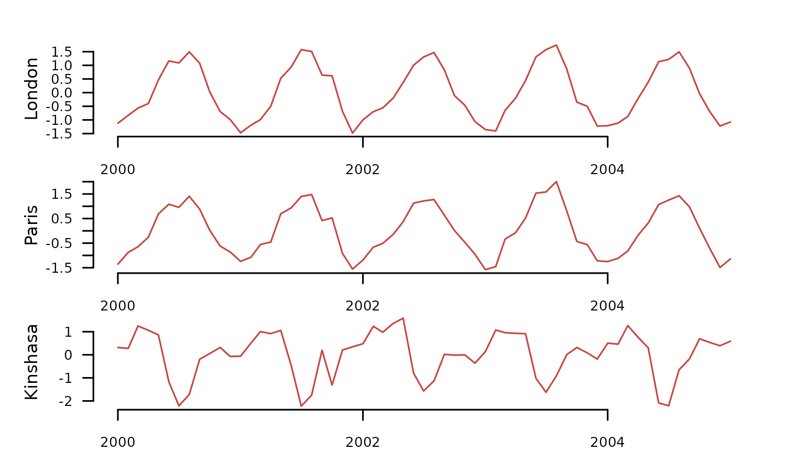
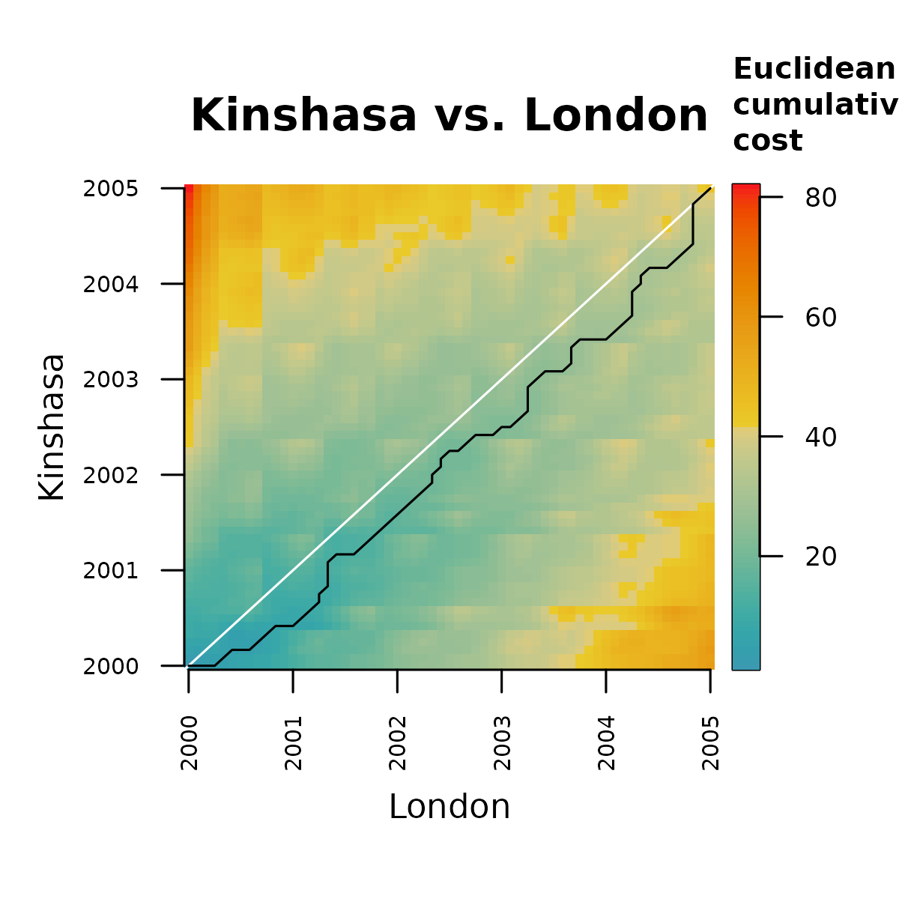
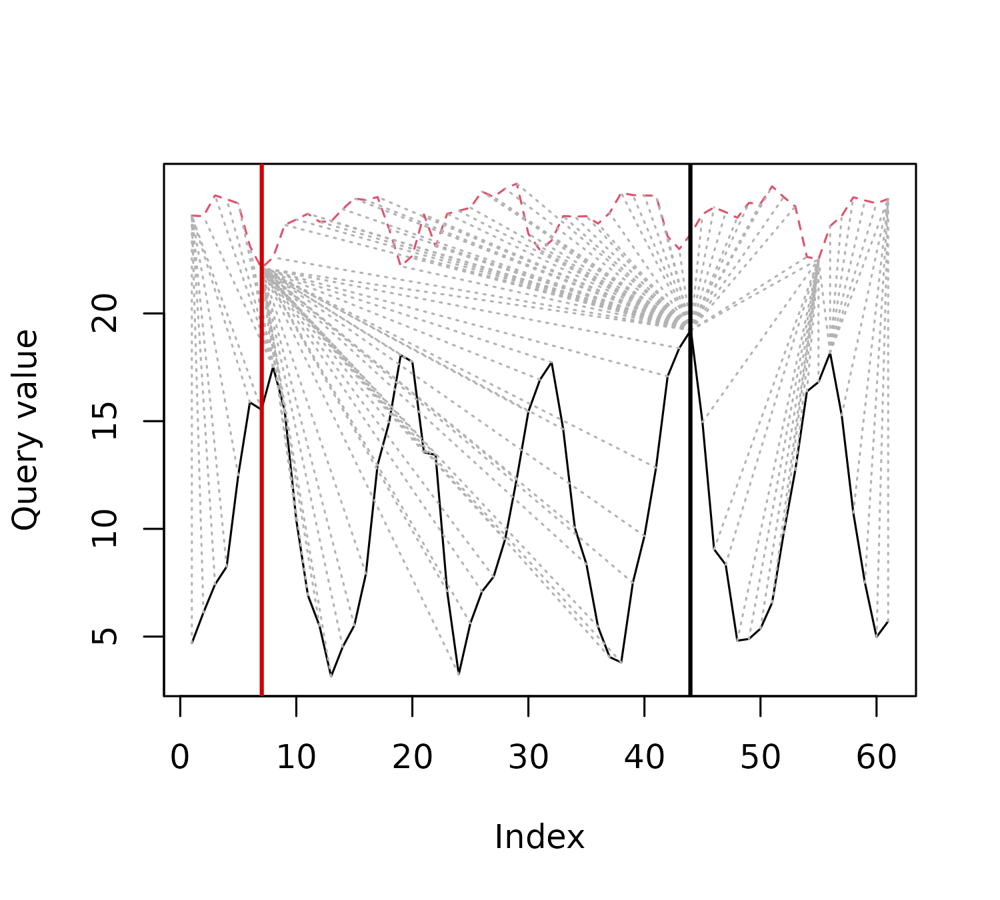
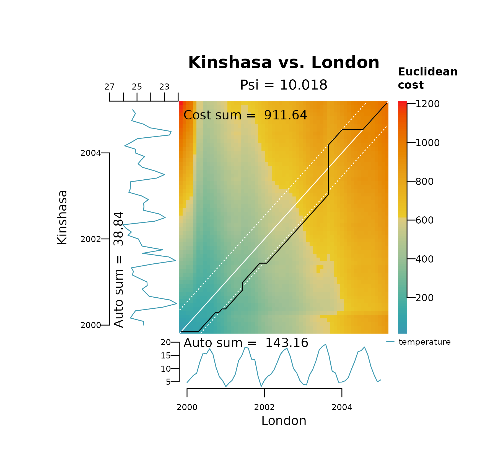

# Dynamic Time Warping vs Lock-Step

## Summary

The R package `distantia` provides tools for comparing time series
through two distinct methods: dynamic time warping (DTW) and lock-step
(LS). These approaches cater to different analysis needs: DTW for
handling temporal shifts and LS for preserving temporal alignment. This
article explores the conceptual foundations of both methods, their
implementation in `distantia`, and showcases their practical use with
code examples.

## Setup

The packages required to run the code in this article are `distantia`
and `dtw`. The latter is not a dependency of `distantia`, but will help
put into context key details of how DTW works.

## Example data

The `cities_temperature` dataset contains monthly temperature records
for 20 cities. The code below transforms it into a Time Series List
(TSL) and selects a subset of three cities with temperature time series
from 2000 to 2005.

``` r
tsl_raw <- distantia::tsl_initialize(
  x = cities_temperature,
  name_column = "name",
  time_column = "time"
) |> 
  distantia::tsl_subset(
    names = c("London", "Paris", "Kinshasa"),
    time = c("2000-01-01", "2005-01-01")
  )

distantia::tsl_plot(
  tsl = tsl_raw,
  ylim = "relative",
  guide = FALSE
)
```


The transformed TSL contains two synchronous time series in the Northern
Hemisphere with similar temperature ranges (London and Paris) and one in
the Southern Hemisphere (Kinshasa) with a higher average and a shifted
temporal pattern.

To facilitate the comparison of DTW and LS, the code below applies the
functions
[`tsl_transform()`](https://blasbenito.github.io/distantia/reference/tsl_transform.md)
with `f_detrend_linear` to remove any long-term trends in the data, and
with `f_scale` to scale and center each time series separately.

``` r
tsl_scaled <- tsl_raw |> 
  distantia::tsl_transform(
    f = distantia::f_detrend_linear
  ) |> 
  distantia::tsl_transform(
    f = distantia::f_scale_local
  )
  
distantia::tsl_plot(
  tsl = tsl_scaled,
  ylim = "relative",
  guide = FALSE
)
```



## Lock-Step (LS)

**Lock-step** methods compare values at corresponding time points,
requiring time series of the same length sampled at identical times.
This approach is well-suited for cases where maintaining the temporal
alignment of the compared time series is crucial. The method is
straightforward and computationally efficient.

In `distantia`, lock-step comparisons are carried out in three steps:

**1.-** Sum the distances between pairs of samples observed at the same
times.

**2.-** Sum the distances between consecutive samples within each time
series.

**3.-** Compute the normalized dissimilarity score *psi*.

Let’s look first at a native R implementation of this idea using
euclidean distances to keep it simple.

``` r
#extracting the data to shorten variable names
x <- tsl_scaled$London
y <- tsl_scaled$Kinshasa

#1.- sum of distances between pairs of samples
step_1 <- sum(sqrt((x - y)^2))

#2.- sum of distances between consecutive samples
step_2 <- sum(
  sqrt(diff(x)^2) + sqrt(diff(y)^2)
  )

#3.- compute normalized dissimilarity score
((2 * step_1) / step_2)
#> [1] 2.791279
```

The function
[`distantia()`](https://blasbenito.github.io/distantia/reference/distantia.md)
performs the same task when `lock_step = TRUE` (default is `FALSE`).

``` r
df <- distantia::distantia(
  tsl = tsl_scaled[c("London", "Kinshasa")],
  lock_step = TRUE,
  distance = "euclidean"
)

df$psi
#> [1] 2.791279
```

The same can be done with the function
[`distantia_ls()`](https://blasbenito.github.io/distantia/reference/distantia_ls.md),
a simplified version of
[`distantia()`](https://blasbenito.github.io/distantia/reference/distantia.md)
for lock-step analysis.

``` r
df <- distantia::distantia_ls(
  tsl = tsl_scaled[c("London", "Kinshasa")]
)

df$psi
#> [1] 2.791279
```

Both functions can compute lock-step dissimilarity scores for all time
series in the argument `tsl` at once.

``` r
df <- distantia::distantia_ls(
  tsl = tsl_scaled
)

df[, c("x", "y", "psi")]
#>        x        y       psi
#> 1 London    Paris 0.2298458
#> 3  Paris Kinshasa 2.7046009
#> 2 London Kinshasa 2.7912785
```

As expected, London and Paris show the most similar temperature time
series, while London and Kinshasa are the most different ones.

## Dynamic Time Warping

Dynamic Time Warping (DTW) warps the time axes of two time series to
maximize pattern similarity, even when temporal shifts are present. This
makes DTW ideal for comparing time series with similar shapes but
misaligned time points. However, it is computationally more intensive
and less efficient than the lock-step method, particularly for large
datasets.

DTW involves three conceptual steps, similar to the lock-step method,
but with additional complexity in the first step:

**1.-** Sum the distances between pairs of samples.

- **1a** Compute a distance matrix between all pairs of samples.

- **1b** Build the least-cost matrix.

- **1c** Find the least-cost path.

- **1d** Sum distances along the least-cost path.

**2.-** Sum distances between consecutive samples within each time
series.

**3.-** Calculate the normalized dissimilarity score *psi* (with a
slightly different formula!).

Now, let’s dive into the code.

The objective of the step **1** is computing the sum of distances
between pairs of samples matched together by the time warping algorithm.

Step **1a** computes the distance matrix between all pairs of samples in
both time series. Notice that all functions to demonstrate the
computation of the normalized dissimilarity score `psi` follow the
naming convention `psi...()`.

``` r
m.dist <- distantia::psi_distance_matrix(
  x = x,
  y = y,
  distance = "euclidean"
)

distantia::utils_matrix_plot(
  m = m.dist,
  diagonal_width = 0
  )
```


Step **1b** involves transforming the distance matrix into a cost
matrix. This transformation requires a dynamic algorithm in which each
new cell adds its own distance to the distance accumulated by its
preceding neighbor. There are two implementations of this method in
`distantia`:

- **orthogonal only**: distance cost is only computed on the *x* and *y*
  axis, ignoring diagonals.
- **orthogonal and diagonal**: distance cost is also computed in
  diagonals, which are weighted by a factor of
  `1.414214 (square root of 2)`.

These options are wrapped in the function
[`psi_cost_matrix()`](https://blasbenito.github.io/distantia/reference/psi_cost_matrix.md),
which by default, like
[`distantia()`](https://blasbenito.github.io/distantia/reference/distantia.md)
uses weighted diagonals.

``` r
m.cost <- distantia::psi_cost_matrix(
  dist_matrix = m.dist,
  diagonal = TRUE #default
)

distantia::utils_matrix_plot(
  m = m.cost,
  diagonal_width = 0
  )
```


In step **1c**, the distance and cost matrices are used to find the
least-cost path.

``` r
m.cost.path <- distantia::psi_cost_path(
  dist_matrix = m.dist,
  cost_matrix = m.cost,
  diagonal = TRUE #default
)

tail(m.cost.path)
#>    x y       dist     cost
#> 76 6 3 0.09082845 4.579160
#> 77 5 2 0.19227643 4.450709
#> 78 4 1 0.71503492 4.178789
#> 79 3 1 0.88127572 3.463754
#> 80 2 1 1.14678108 2.582479
#> 81 1 1 1.43569743 1.435697
```

Notice that the cost path data frame is ordered from bottom to top. The
columns “x” and “y” represent sample indices of the time series London
and Kinshasa. The figure below shows the least cost path on top of the
cost matrix.

``` r
distantia::utils_matrix_plot(
  m = m.cost,
  path = m.cost.path
)
```



The step **1d** finalizes the DTW logic by adding the distances between
pair of samples connected by the least-cost path. This step is just
`sum(m.cost.path$dist)`, but it is implemented in
[`psi_cost_path_sum()`](https://blasbenito.github.io/distantia/reference/psi_cost_path_sum.md),
which also checks that the least cost data frame is correct.

``` r
step_1 <- distantia::psi_cost_path_sum(
  path = m.cost.path
)

step_1
#> [1] 36.18196
```

Step **2** returns the distances between consecutive samples within each
time series, as computed by
[`psi_auto_sum()`](https://blasbenito.github.io/distantia/reference/psi_auto_sum.md).

``` r
step_2 <- distantia::psi_auto_sum(
  x = x,
  y = y,
  distance = "euclidean"
)

step_2
```

Finally, the step **3** computes the normalized dissimilarity score.

``` r
distantia::psi_equation(
  a = step_1,
  b = step_2,
  diagonal = TRUE
)
```

All these individual steps can be performed at once with the function
[`distantia()`](https://blasbenito.github.io/distantia/reference/distantia.md)
by setting the argument `lock_step` to `FALSE`, or with the function
[`distantia_dtw()`](https://blasbenito.github.io/distantia/reference/distantia_dtw.md).

``` r
df <- distantia::distantia(
  tsl = tsl_scaled[c("London", "Kinshasa")],
  lock_step = FALSE,
  distance = "euclidean"
)

df[, c("x", "y", "psi")]
#>        x        y      psi
#> 1 London Kinshasa 1.051902
```

``` r
df <- distantia::distantia_dtw(
  tsl = tsl_scaled[c("London", "Kinshasa")]
)

df[, c("x", "y", "psi")]
#>        x        y      psi
#> 1 London Kinshasa 1.051902
```

As before, both functions can compute dynamic time warping dissimilarity
for all time series in the argument `tsl` at once.

``` r
df <- distantia::distantia_dtw(
  tsl = tsl_scaled
)

df[, c("x", "y", "psi")]
#>        x        y       psi
#> 1 London    Paris 0.2177902
#> 2 London Kinshasa 1.0519019
#> 3  Paris Kinshasa 1.1054414
```

The function
[`distantia_dtw_plot()`](https://blasbenito.github.io/distantia/reference/distantia_dtw_plot.md)
offers a good graphical representation of the warping result and
decomposes the computation of the *psi* dissimilarity score.

``` r
distantia_dtw_plot(
  tsl = tsl_scaled[c("London", "Kinshasa")]
)
```


#### Pitfalls

DTW is an ideal method to compare time series with temporal shifts, and
is applicable to regular and irregular time series with the same or
different numbers of samples.

However, **DTW is highly sensitive to differences in data magnitudes**.
As result, data that is not properly scaled may distort the warping,
leading to .

The plot below represents the DTW alignment of London and Kinshasa on
the raw temperature data. It shows how DTW gets stuck in two local
optima, one in the *y* axis (long horizontal line) at the minimum
temperature in Kinshasa (winter of 2001), and another in the *x* axis
(long vertical line) at the maximum temperature in London (summer of
2003). It also shows a distinctively large dissimilarity score.

``` r
distantia_dtw_plot(
  tsl = tsl_raw[c("London", "Kinshasa")]
)
```


These long horizontal and vertical lines shown above provide an
immediate diagnostic of a **pathological warping**, which happens when a
relatively short segment of one time series maps to a much longer
segment of another.

This is not a particular issue of the DTW algorithm implemented in
`distantia`, but a general behavior of time warping methods. The code
below shows a similar analysis performed with the R package
[`dtw`](https://CRAN.R-project.org/package=dtw). The default
implementation ignores diagonals when building the cost matrix.

``` r
xy_dtw <- dtw::dtw(
  x = tsl_raw$London$temperature,
  y = tsl_raw$Kinshasa$temperature,
  keep = TRUE
  )

plot(xy_dtw, type = "threeway")
```


The “twoway” plot provided by `dtw` shows the alingment as a line bar,
with the sample matches represented as dotted lines, and two vertical
lines highlighting the local optima

``` r
plot(xy_dtw, type = "twoway")
abline(v=0.13, col="red3", lwd = 2)
abline(v=0.70, col="black", lwd = 2)
```



There are two strategies that can be combined to control this issue:
data scaling, and **constrained DTW**.

### Constrained DTW

The function
[`distantia()`](https://blasbenito.github.io/distantia/reference/distantia.md)
implements *Sakoe-Chiba bands* to restrict the flexibility of the
warping path via the `bandwidth` argument. This argument represents the
fraction of space at both sides of the least cost matrix diagonal
allowed for warping. The plots below show the effect of decreasing
`bandwidth` on the area covered by the Sakoe-Chiba bands (shown as white
dashed lines) and how it restricts spread of the alignment between
London and Kinshasa on their raw temperature values.

``` r
distantia_dtw_plot(
  tsl = tsl_raw[c("London", "Kinshasa")],
  bandwidth = 0.2
)
```


``` r
distantia_dtw_plot(
  tsl = tsl_raw[c("London", "Kinshasa")],
  bandwidth = 0.1
)
```



``` r
distantia_dtw_plot(
  tsl = tsl_raw[c("London", "Kinshasa")],
  bandwidth = 0.05
)
```


``` r
distantia_dtw_plot(
  tsl = tsl_raw[c("London", "Kinshasa")],
  bandwidth = 0.025
)
```


Sakoe-Chiba bands cannot fix bad alignments (that’s what data scaling is
for), but can help diagnose them, given a tolerance level.

The code below runs
[`distantia()`](https://blasbenito.github.io/distantia/reference/distantia.md)
for the raw temperature data with two bandwidths: 1 for unrestricted
dynamic time warping, and 0.25 as reference level.

``` r
df <- distantia(
  tsl = tsl_raw,
  bandwidth = c(1, 0.25)
)

df[, c("x", "y", "psi", "bandwidth")]
#>        x        y        psi bandwidth
#> 1 London    Paris  0.4241914      1.00
#> 4 London    Paris  0.4241914      0.25
#> 3  Paris Kinshasa  7.3672711      1.00
#> 6  Paris Kinshasa  7.6432712      0.25
#> 5 London Kinshasa 10.2494423      0.25
#> 2 London Kinshasa 10.7561509      1.00
```

Now, we can compute the psi differences across bandwidths for each pair
of time series

``` r
df |> 
  dplyr::group_by(
    x, y
  ) |> 
  dplyr::summarise(
    psi_diff = diff(psi)
  )
#> `summarise()` has grouped output by 'x'. You can override using the `.groups`
#> argument.
#> # A tibble: 3 × 3
#> # Groups:   x [2]
#>   x      y        psi_diff
#>   <chr>  <chr>       <dbl>
#> 1 London Kinshasa    0.507
#> 2 London Paris       0    
#> 3 Paris  Kinshasa    0.276
```

All pairs of time series with a `psi_diff` higher than zero show warping
paths that go beyond the 0.25 bandwidth.

## Comparing DTW and LS

Dynamic Time Warping (DTW) and Lock-Step (LS) methods differ in scope
and application.

DTW is ideal for comparing data that may be shifted in time due to
positional differences, such as phenological time series observed across
different hemispheres or elevations. It also facilitates the comparison
of time series with varying lengths, observation periods, or sampling
resolutions. This versatility makes DTW a general-purpose tool for time
series analysis.

In contrast, LS is designed for synchronized time series that, at a
minimum, must have the same length. While its scope is narrower, LS is
more intuitive and accurate than DTW for comparing time series without
time shifts, as it measures raw differences directly.

In essence, DTW, with its ability to adjust the time axis, answers the
question, *How similar can these two time series be?*, while LS
addresses the question, “How different are these two time series?”

The code below computes the dissimilarity score of the temperatures in
Paris, London, and Kinshasa using DTW and LS and compares them in a data
frame.

``` r
df_dtw <- distantia(
  tsl = tsl_scaled
)

df_ls <- distantia(
  tsl = tsl_scaled,
  lock_step = TRUE
)

data.frame(
  x = df_dtw$x,
  y = df_dtw$y,
  psi_dtw = round(df_dtw$psi, 3),
  psi_ls = round(df_ls$psi, 3)
)
#>        x        y psi_dtw psi_ls
#> 1 London    Paris   0.218  0.230
#> 2 London Kinshasa   1.052  2.705
#> 3  Paris Kinshasa   1.105  2.791
```

For London and Paris, both DTW and LS show very similar values, because
the time series are very similar and DTW cannot do much else to adjust
them even more. On the other hand, DTW shows much lower values than LS
when Kinshasa comes into play, as it compensates the seasonal shifts in
these time series. In that sense, LS provides a more accurate image of
the raw differences between these time series.

As a clear advantage, LS does not require data normalization for
univariate time series, and therefore can provide a dissimilarity score
in the same units of the variable at hand.

``` r
df_ls <- distantia(
  tsl = tsl_raw,
  lock_step = TRUE
)

df_ls[, c("x", "y", "psi")]
#>        x        y       psi
#> 1 London    Paris 0.4879081
#> 3  Paris Kinshasa 7.5416106
#> 2 London Kinshasa 9.3361647
```

Comparing the dissimilarity scores above with the mean temperatures of
the three cities below can give a sense of how approximate LS scores are
to what we could expect.

``` r
df_stats <- tsl_stats(
  tsl = tsl_raw,
  lags = 0
)

df_stats[, c("name", "mean")]
#>       name     mean
#> 1   London 10.55682
#> 2    Paris 11.53803
#> 3 Kinshasa 24.48500
```

## Closing Thoughts

The `distantia` package strikes a balance between flexibility and
simplicity, enabling a more nuanced exploration of time series data.
With support for both dynamic time warping and lock-step methods, it
provides users with the tools needed to uncover insights while
respecting the unique constraints of their data. Whether you’re working
on sequence alignment or strict temporal comparisons, `distantia` is
designed to adapt to your analytical needs.

I encourage you to give it a try and see how it fits into your
workflows.
