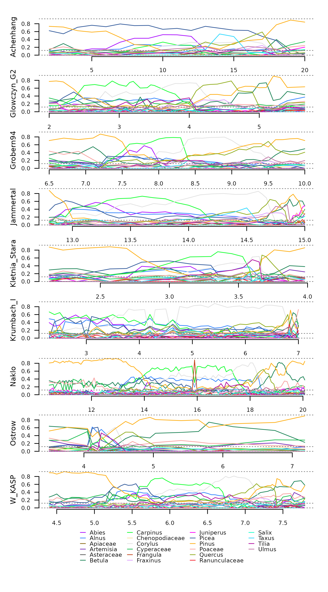

# Mapping Time Series Dissimilarity

## Summary

This article showcases different spatial representations of the outputs
of
[`distantia()`](https://blasbenito.github.io/distantia/reference/distantia.md)
and
[`momentum()`](https://blasbenito.github.io/distantia/reference/momentum.md).

## Setup

``` r
library(distantia, warn.conflicts = FALSE)
library(dplyr, warn.conflicts = FALSE)
library(mapview, warn.conflicts = FALSE)
```

## Mapping Results of `distantia()` Functions

The functions with the prefix `distantia` quantify time series
dissimilarity and provide results that can be represented as maps.

#### Example Data

The examples in this article illustrate how to map dissimilarity scores
using the datasets `covid_prevalence` and `covid_polygons` included with
`distantia`. The dataset comprises time series of weekly Covid-19
prevalence in several California counties.

``` r
tsl <- distantia::tsl_initialize(
  x = distantia::covid_prevalence,
  name_column = "name",
  time_column = "time"
)

distantia::tsl_plot(
  tsl = tsl[1:10],
  columns = 2,
  guide = FALSE
)
```

 The
map below displays the polygons in
[`distantia::covid_counties`](https://blasbenito.github.io/distantia/reference/covid_counties.md)
using
[`mapview()`](https://r-spatial.github.io/mapview/reference/mapView.html).

``` r
mapview::mapview(
  distantia::covid_counties,
  label = "name"
)
```

#### Dissimilarity Analysis

The code in this section prepares several datasets to use in the
different mapping examples:

- `df_psi`: a lock-step dissimilarity data frame with *psi* scores and
  p-values from restricted permutation tests.
- `df_stats`: dissimilarity stats of each time series against all
  others.
- `df_cluster`: a hierarchical clustering based on the dissimilarity
  scores in `df_psi`.

The lock-step dissimilarity analysis shown below includes p-values from
a restricted permutation test. These p-values will be useful as criteria
to select relevant mapping features.

``` r
#parallelization setup
future::plan(
  future::multisession,
  workers = parallelly::availableCores() - 1
  )

#lock-step dissimilarity analysis
df_psi <- distantia::distantia(
  tsl = tsl,
  distance = "euclidean",
  lock_step = TRUE,
  repetitions = 1000,
  permutation = "restricted",
  block_size = 12 #weeks
)

#disable parallelization
future::plan(
  future::sequential
  )

#check resulting data frame
df_psi |> 
  dplyr::select(x, y, psi, p_value) |> 
  dplyr::glimpse()
#> Rows: 630
#> Columns: 4
#> $ x       <chr> "Napa", "Alameda", "Alameda", "Sacramento", "San_Joaquin", "Sa…
#> $ y       <chr> "Solano", "San_Mateo", "Contra_Costa", "Sonoma", "Stanislaus",…
#> $ psi     <dbl> 0.8726115, 1.0656371, 1.1620553, 1.2578125, 1.2919255, 1.29793…
#> $ p_value <dbl> 0.001, 0.001, 0.001, 0.001, 0.001, 0.001, 0.001, 0.001, 0.001,…
```

The code below aggregates *psi* scores in the data frame `df_psi` to
summarize the overall dissimilarity of each time series with all others.

``` r
df_stats <- distantia::distantia_stats(
  df = df_psi
)

df_stats |> 
  dplyr::select(
    name, mean
  ) |> 
  dplyr::glimpse()
#> Rows: 36
#> Columns: 2
#> $ name <chr> "Alameda", "Butte", "Contra_Costa", "El_Dorado", "Fresno", "Humbo…
#> $ mean <dbl> 3.214531, 3.266749, 3.358524, 3.546757, 3.270684, 4.028824, 3.834…
```

The function
[`distantia_cluster_hclust()`](https://blasbenito.github.io/distantia/reference/distantia_cluster_hclust.md)
runs a hierarchical clustering using the *psi* scores in `df_psi` as
clustering criteria.

``` r
df_cluster <- distantia::distantia_cluster_hclust(
  df = df_psi
)$df

df_cluster |> 
  dplyr::select(name, cluster) |>
  dplyr::glimpse()
#> Rows: 36
#> Columns: 2
#> $ name    <chr> "Napa", "Alameda", "Sacramento", "San_Joaquin", "Santa_Clara",…
#> $ cluster <dbl> 1, 2, 2, 1, 3, 2, 2, 3, 2, 1, 1, 1, 2, 1, 2, 4, 2, 1, 1, 1, 2,…
```

#### Network Map

The function
[`distantia_spatial()`](https://blasbenito.github.io/distantia/reference/distantia_spatial.md)
transforms the result of
[`distantia()`](https://blasbenito.github.io/distantia/reference/distantia.md)
to an sf data frame with edges connecting time series coordinates or
polygons. The result can be interpreted as a *dissimilarity network*.

``` r
sf_network <- distantia::distantia_spatial(
  df = df_psi,
  sf = distantia::covid_counties |> 
    dplyr::select(
      name, geometry
    ),
  network = TRUE
)

dplyr::glimpse(sf_network)
#> Rows: 630
#> Columns: 9
#> $ edge_name <chr> "Alameda - Butte", "Alameda - Contra_Costa", "Butte - Contra…
#> $ y         <chr> "Butte", "Contra_Costa", "Contra_Costa", "El_Dorado", "El_Do…
#> $ x         <chr> "Alameda", "Alameda", "Butte", "Contra_Costa", "Butte", "Ala…
#> $ psi       <dbl> 2.962963, 1.162055, 2.733068, 2.767442, 2.327273, 2.483755, …
#> $ p_value   <dbl> 0.048, 0.001, 0.001, 0.016, 0.005, 0.002, 0.045, 0.334, 1.00…
#> $ null_mean <dbl> 3.253452, 2.442545, 3.453084, 3.273194, 2.857149, 3.050181, …
#> $ null_sd   <dbl> 0.16577079, 0.27674638, 0.20054408, 0.22631966, 0.19082565, …
#> $ geometry  <LINESTRING [°]> LINESTRING (-121.8869 37.64..., LINESTRING (-121.…
#> $ length    <dbl> 226007.5, 30278.1, 196579.9, 155203.7, 135288.6, 173206.4, 3…
```

The resulting sf data frame has a field with the edge name, the columns
`x` and `y` with the names of the connected time series, the *psi*
scores and p-values of the dissimilarity data frame, a geometry column
of type LINESTRING defining the network edges, and the `length` of the
edges.

This sf data frame can be mapped right away, but in this case there are
too many pairs of counties to achieve a meaningful map.

``` r
mapview::mapview(
  sf_network,
  layer.name = "Psi",
  label = "edge_name",
  zcol = "psi",
  color = distantia::color_continuous()
)
```

Focusing on particular aspects of the data at hand may help untangle
this mess. For example, the code below subsets edges connecting with
*San Francisco* and its most similar counties in terms of Covid19
prevalence.

``` r
#select pairs of counties
counties <- c(
  "Los_Angeles", 
  "San_Francisco", 
  "Fresno", 
  "San_Joaquin",
  "Monterey"
  )

sf_network_subset <- sf_network[
  which(
    sf_network$x %in% counties & 
      sf_network$y %in% counties
    ), 
  ]

#map country polygons and dissimilarity edges
mapview::mapview(
  covid_counties,
  col.regions = NA,
  alpha.regions = 0,
  color = "black",
  label = "name",
  legend = FALSE,
  map.type = "OpenStreetMap"
) +
  mapview::mapview(
    sf_network_subset,
    layer.name = "Psi",
    label = "edge_name",
    zcol = "psi",
    lwd = 5,
    color = distantia::color_continuous(
      rev = TRUE
      )
  )
```

The function
[`distantia_spatial()`](https://blasbenito.github.io/distantia/reference/distantia_spatial.md)
also has a one-to-many mode designed to help map the dissimilarity of
one time series against all others.

``` r
sf_network <- distantia::distantia_spatial(
  df = df_psi,
  sf = distantia::covid_counties |> 
    dplyr::select(
      name, geometry
    ),
  network = FALSE
)

dplyr::glimpse(sf_network)
#> Rows: 1,295
#> Columns: 7
#> $ x         <chr> "Alameda", "Alameda", "Alameda", "Alameda", "Alameda", "Alam…
#> $ y         <chr> "Alameda", "Butte", "Contra_Costa", "El_Dorado", "Fresno", "…
#> $ psi       <dbl> 0.000000, 2.962963, 1.162055, 2.483755, 3.456869, 3.960000, …
#> $ p_value   <dbl> 0.000, 0.048, 0.001, 0.002, 0.334, 0.984, 0.210, 0.120, 0.98…
#> $ null_mean <dbl> 0.000000, 3.253452, 2.442545, 3.050181, 3.565789, 3.638864, …
#> $ null_sd   <dbl> 0.00000000, 0.16577079, 0.27674638, 0.20253761, 0.23818318, …
#> $ geometry  <MULTIPOLYGON [°]> MULTIPOLYGON (((-121.9907 3..., MULTIPOLYGON ((…
```

This option does not create edges, and instead uses the geometry
introduced in the `sf` argument. This sf data frame is mapped as
follows: when one site in the “x” column is selected, the result shows
the dissimilarity scores of all other sites against the selected one.

``` r
#subset one county
sf_network_subset <- sf_network[
  sf_network$x == "San_Francisco", 
  ]

#one-to-many visualization
mapview::mapview(
    sf_network_subset,
    layer.name = "Psi",
    label = "y",
    zcol = "psi",
    col.regions = distantia::color_continuous(
      rev = TRUE
      )
  )
```

#### Dissimilarity Stats Map

Mapping the dissimilarity stats of each time series may help identify
places that are somewhat *special* because they show a high
dissimilarity with all others, or places that are *average* and have no
distinctive features.

Merging the dissimilarity stats with the sf data frame containing the
county polygons generates the spatial data required for the map.

``` r
sf_stats <- merge(
  x = distantia::covid_counties,
  y = df_stats
) |> 
  dplyr::select(
    mean,
    name
  )
```

The map below uses warm colors to highlight places with a high
dissimilarity with all others, such as Humboldt county in the north west
of the state.

``` r
mapview::mapview(
  sf_stats,
  layer.name = "Psi mean",
  zcol = "mean",
  label = "name",
  col.regions = distantia::color_continuous(
    rev = TRUE
  ),
  alpha.regions = 1
)
```

#### Clustering Map

This section shows how to map the similarity groups resulting from
[`distantia::distantia_cluster_hclust()`](https://blasbenito.github.io/distantia/reference/distantia_cluster_hclust.md)
or
[`distantia::distantia_cluster_kmeans()`](https://blasbenito.github.io/distantia/reference/distantia_cluster_kmeans.md).

The first block in the code below joins the county polygons in
`distantia::covid_polygons` with the clustering data frame `df_cluster`.
This block also generates the variable “alpha” from the column
“silhouette_width”, which represents the strength of membership to the
assigned clustering group.

The second block generates the map, using colors for cluster membership,
and the variable alpha to code the strenght of membership. This setup
allows identifying groups of similar counties while highlighting
counties that somehow do not fully belong to their given group. This is
the case of *Butte*, which is in the group 5, but with a very low
silhouette score.

``` r
#join county polygons with clustering groups
sf_cluster <- distantia::covid_counties |> 
  dplyr::select(name, geometry) |> 
  dplyr::inner_join(
    y = df_cluster,
    by = "name"
  ) |> 
  #remap silhouette score to transparency values
  dplyr::mutate(
    alpha = f_rescale_local(
      x = silhouette_width,
      new_min = 0.1
      )
  )

mapview::mapview(
  sf_cluster,
  layer.name = "Group",
  zcol = "cluster",
  label = "name",
  col.regions = distantia::color_continuous(
    n = max(sf_cluster$cluster)
  ),
  alpha.regions = sf_cluster$alpha
)
```

## Mapping Results of `momentum()`

The `momentum` functions quantify the contribution to dissimilarity of
individual variables in multivariate time series. The results of
`momentum` functions are slightly harder to map due to a high
cardinality (number of time series times number of variables), but
`distantia` provides some tools to face this challenge.

#### Example Data

This example uses the data `eemian_pollen` and `eemian_coordinates`,
which comprises nine irregular time series of pollen counts in Central
Uurope from the Last Interglacial (Eemian period). This data requires a
Hellinger transformation to facilitate dissimilarity analyses.

``` r
tsl <- distantia::tsl_initialize(
  x = distantia::eemian_pollen,
  name_column = "name",
  time_column = "time"
) |> 
  distantia::tsl_transform(
    f = distantia::f_hellinger
  )
#> distantia::utils_prepare_time():  duplicated time indices in 'Krumbach_I':
#> - value 6.8 replaced with 6.825.

distantia::tsl_plot(
  tsl = tsl,
  guide_columns = 4
)
```



#### Importance Analysis

The function
[`momentum_dtw()`](https://blasbenito.github.io/distantia/reference/momentum_dtw.md)
computes variable importance using a jackknife approach. The column
“importance” represents contribution to similarity and dissimilarity
with negative and positive values, respectively.

``` r
df_importance <- momentum_dtw(
  tsl = tsl
)

head(df_importance, n = 20)
#>            x           y      psi       variable importance
#> 1  Achenhang Glowczyn_G2 3.703507          Pinus -67.080631
#> 2  Achenhang Glowczyn_G2 3.703507        Corylus   9.676750
#> 3  Achenhang Glowczyn_G2 3.703507       Carpinus  33.492641
#> 4  Achenhang Glowczyn_G2 3.703507         Betula -43.022468
#> 5  Achenhang Glowczyn_G2 3.703507        Quercus -55.260250
#> 6  Achenhang Glowczyn_G2 3.703507          Alnus  -4.263397
#> 7  Achenhang Glowczyn_G2 3.703507          Picea 247.850696
#> 8  Achenhang Glowczyn_G2 3.703507        Poaceae -56.755172
#> 9  Achenhang Glowczyn_G2 3.703507     Cyperaceae  22.828821
#> 10 Achenhang Glowczyn_G2 3.703507          Abies 102.075066
#> 11 Achenhang Glowczyn_G2 3.703507          Ulmus -58.772493
#> 12 Achenhang Glowczyn_G2 3.703507          Tilia   8.132425
#> 13 Achenhang Glowczyn_G2 3.703507       Frangula   0.000000
#> 14 Achenhang Glowczyn_G2 3.703507      Artemisia -46.360957
#> 15 Achenhang Glowczyn_G2 3.703507       Fraxinus -61.642159
#> 16 Achenhang Glowczyn_G2 3.703507          Taxus -35.976319
#> 17 Achenhang Glowczyn_G2 3.703507      Juniperus -39.601393
#> 18 Achenhang Glowczyn_G2 3.703507 Chenopodiaceae -69.043427
#> 19 Achenhang Glowczyn_G2 3.703507          Salix -54.456046
#> 20 Achenhang Glowczyn_G2 3.703507     Asteraceae -60.049059
#>                  effect
#> 1  increases similarity
#> 2  decreases similarity
#> 3  decreases similarity
#> 4  increases similarity
#> 5  increases similarity
#> 6  increases similarity
#> 7  decreases similarity
#> 8  increases similarity
#> 9  decreases similarity
#> 10 decreases similarity
#> 11 increases similarity
#> 12 decreases similarity
#> 13 increases similarity
#> 14 increases similarity
#> 15 increases similarity
#> 16 increases similarity
#> 17 increases similarity
#> 18 increases similarity
#> 19 increases similarity
#> 20 increases similarity
```

#### Network Map

The function
[`momentum_spatial()`](https://blasbenito.github.io/distantia/reference/momentum_spatial.md),
just like
[`distantia_spatial()`](https://blasbenito.github.io/distantia/reference/distantia_spatial.md),
transforms the results of `momentum` functions to an sf data frame with
edges.

``` r
sf_network <- distantia::momentum_spatial(
  df = df_importance,
  sf = distantia::eemian_coordinates |> 
    dplyr::select(
      name, geometry
    ),
  network = TRUE
)

dplyr::glimpse(sf_network)
#> Rows: 36
#> Columns: 30
#> $ edge_name                  <chr> "Achenhang - Glowczyn_G2", "Achenhang - Gro…
#> $ y                          <chr> "Glowczyn_G2", "Grobern94", "Grobern94", "J…
#> $ x                          <chr> "Achenhang", "Achenhang", "Glowczyn_G2", "A…
#> $ psi                        <dbl> 3.703507, 3.489709, 2.076632, 3.204312, 2.2…
#> $ most_similarity            <chr> "Chenopodiaceae", "Apiaceae", "Salix", "Que…
#> $ most_dissimilarity         <chr> "Picea", "Picea", "Cyperaceae", "Picea", "J…
#> $ importance__Abies          <dbl> 102.0750658, -3.7890809, 31.6222996, -6.339…
#> $ importance__Alnus          <dbl> -4.263397, -52.810333, 17.090801, -28.97179…
#> $ importance__Apiaceae       <dbl> -57.398554, -75.084127, -7.135823, -34.5046…
#> $ importance__Artemisia      <dbl> -46.360957, -12.249132, -7.040055, -42.8159…
#> $ importance__Asteraceae     <dbl> -60.0490590, -65.6509538, -19.6345045, -60.…
#> $ importance__Betula         <dbl> -43.0224683, -35.3757037, -27.7092958, -3.8…
#> $ importance__Carpinus       <dbl> 33.492641, 21.518114, -24.914337, 25.427683…
#> $ importance__Chenopodiaceae <dbl> -69.043427, -47.422851, -30.116905, -59.110…
#> $ importance__Corylus        <dbl> 9.676750, 11.022477, -32.210648, 56.826297,…
#> $ importance__Cyperaceae     <dbl> 22.8288208, -36.4111585, 136.6667217, -62.5…
#> $ importance__Frangula       <dbl> 0.00000, 0.00000, 0.00000, 0.00000, 0.00000…
#> $ importance__Fraxinus       <dbl> -61.6421587, -47.8929848, 30.1905227, -45.1…
#> $ importance__Juniperus      <dbl> -39.6013934, -29.1748819, 104.4894455, -8.6…
#> $ importance__Picea          <dbl> 247.850696, 267.635667, 41.815270, 245.7300…
#> $ importance__Pinus          <dbl> -67.0806314, -38.0894327, 3.0638565, -37.74…
#> $ importance__Poaceae        <dbl> -56.755172, -39.036160, 6.354846, -54.86584…
#> $ importance__Quercus        <dbl> -55.26024973, -35.61050203, 26.90348695, -6…
#> $ importance__Ranunculaceae  <dbl> -55.942707, -65.734744, -25.580045, -27.206…
#> $ importance__Salix          <dbl> -54.45605, -63.81673, -44.30718, -45.18432,…
#> $ importance__Taxus          <dbl> -35.9763194, -47.8640761, 45.9226941, -43.7…
#> $ importance__Tilia          <dbl> 8.1324252, -22.6808392, -22.5884817, -42.04…
#> $ importance__Ulmus          <dbl> -58.7724933, -57.2728168, -36.6160709, -23.…
#> $ geometry                   <LINESTRING [°]> LINESTRING (12.19381 47.753..., …
#> $ length                     <dbl> 771512.45, 437377.26, 536559.23, 187660.13,…
```

Notice that it separates the importance of each variable to a separate
column, and also has two character columns named “most_similarity” and
“most_dissimilarity” with the names of the variables with the highest
and lowest importance scores.

The map below shows the pairs of most similar time series connected with
edges coded after the name of the variable that contributes the most to
their similarity.

``` r
mapview::mapview(
  distantia::eemian_coordinates,
  layer.name = "Eemian sites - m.a.s.l",
  label = "name",
  zcol = "elevation",
  col.regions = distantia::color_continuous()
) +
mapview::mapview(
  sf_network |> 
    dplyr::filter(
      psi < mean(psi)
    ),
  layer.name = "Contributes to Similarity",
  label = "most_similarity",
  zcol = "most_similarity",
  color = distantia::color_discrete(
    n = length(unique(sf_network$most_similarity))
  )
)
```

Filtering the input even further allows to focus on specific features of
the dataset at hand. For example, the map below highlights pairs of time
series with high similarity driven mostly by the taxa “Frangula”.

``` r
mapview::mapview(
  distantia::eemian_coordinates,
  layer.name = "Eemian sites - m.a.s.l",
  label = "name",
  zcol = "elevation",
  col.regions = distantia::color_continuous()
) +
mapview::mapview(
  sf_network |> 
    dplyr::filter(
      psi < mean(psi),
      most_similarity == "Frangula"
    ),
  layer.name = "Contributes to Similarity",
  label = "most_similarity",
  zcol = "most_similarity",
  color = distantia::color_discrete(
    n = 1
  )
)
```

Conversely, we can also map what variable makes these sites more
different.

``` r
mapview::mapview(
  distantia::eemian_coordinates,
  layer.name = "Eemian sites - m.a.s.l",
  label = "name",
  zcol = "elevation",
  col.regions = distantia::color_continuous()
) +
mapview::mapview(
  sf_network |> 
    dplyr::filter(
      psi < mean(psi),
      most_similarity == "Frangula"
    ),
  layer.name = "Contributes to Dissimilarity",
  label = "most_dissimilarity",
  zcol = "most_dissimilarity",
  color = distantia::color_discrete(
    n = length(unique(sf_network$most_dissimilarity))
  )
)
```
