# Handling Time Series Lists

## Summary

The R package `distantia` 2.0 introduces Time Series Lists as obect to
organize time series for dissimilarity analyses, and provides a complete
toolset to manage them.

This article describes Time Series Lists in detail, and showcases the
most common data handling procedures enabled by the new functions
included in the package.

## Introduction to Time Series Lists

In this new version of `distantia`, groups of time series are organized
as named lists of
[zoo](https://cran.r-project.org/web/packages/zoo/index.html) objects.
These lists are named **Time Series Lists** (TSL) within the package,
and are designed to facilitate the parallelization of dissimilarity
analyses.

TSL is not a class by choice, as the idea is keeping them as simple as
possible to grant users the autonomy to create or modify them as needed.

#### Zoo Time Series

The R package `zoo` provides an S3 class of the same name designed to
handle observations ordered by an index. It supports various index
classes, such as Date, POSIXct, or even custom numeric or character
indices, and handles regular and irregular time series equally well.

Other advantages of using zoo objects include a seamless intergration
with base R methods, and built-in tools for alignment, merging, and
subsetting.

Let’s take a look at a little zoo object.

``` r
library(distantia)
#> Loading required package: doFuture
#> Loading required package: foreach
#> Loading required package: future

z <- distantia::zoo_simulate(
  name = "my_zoo",
  cols = 3,
  rows = 10,
  time_range = c(
    "2024-01-01", 
    "2024-12-31"
    ),
  na_fraction = 0.1,
  irregular = TRUE,
  seed = 1
)

zoo_plot(x = z)
```

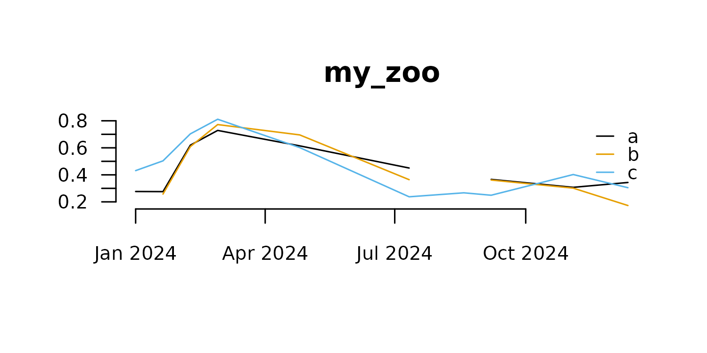

Zoo objects have two main components, a data matrix with the time series
observations, and an index representing time or sample order.

The data matrix is extracted with
[`zoo::coredata()`](https://rdrr.io/pkg/zoo/man/coredata.html).

``` r
zoo::coredata(z)
#>                    a         b         c
#> 2024-01-01 0.2766156        NA 0.4311940
#> 2024-01-20 0.2757911 0.2576964 0.5035254
#> 2024-02-08 0.6195721 0.6088013 0.7032048
#> 2024-02-27 0.7287392 0.7720906 0.8115532
#> 2024-04-25 0.6145089 0.6955610 0.6016670
#> 2024-07-11 0.4504343 0.3641707 0.2375049
#> 2024-08-18        NA        NA 0.2669233
#> 2024-09-06 0.3662741 0.3615319 0.2490074
#> 2024-11-03 0.3074425 0.3016022 0.4022756
#> 2024-12-11 0.3435016 0.1728781 0.3047951
#> attr(,"name")
#> [1] "my_zoo"
class(zoo::coredata(z))
#> [1] "matrix" "array"
```

The core data of a zoo object can also be a vector when the time series
is univariate.

``` r
x <- zoo::zoo(x = runif(10))
is.vector(zoo::coredata(x))
#> [1] TRUE
```

However, this is **frowned upon** in `distantia`, and these vectors
should always be converted to matrices.

``` r
x <- distantia::zoo_vector_to_matrix(x = x)
is.vector(zoo::coredata(x))
#> [1] FALSE
is.matrix(zoo::coredata(x))
#> [1] TRUE
```

The index of zoo time series is extracted with
[`zoo::index()`](https://rdrr.io/pkg/zoo/man/index.html).

``` r
zoo::index(z)
#>  [1] "2024-01-01" "2024-01-20" "2024-02-08" "2024-02-27" "2024-04-25"
#>  [6] "2024-07-11" "2024-08-18" "2024-09-06" "2024-11-03" "2024-12-11"
class(zoo::index(z))
#> [1] "Date"
```

The classes for zoo indices explicitly supported in `distantia` are
`Date`, `POSIXct`, and `numeric`. The function
[`distantia::zoo_time()`](https://blasbenito.github.io/distantia/reference/zoo_time.md)
helps summarize the time features of a zoo object, including the time
class.

``` r
distantia::zoo_time(x = z)
#>     name rows class units   length resolution      begin        end
#> 1 my_zoo   10  Date  days 345.7895   38.42105 2024-01-01 2024-12-11
#>       keywords
#> 1 years, q....
```

Additionally, in `distantia` all zoo objects are expected to have the
attribute `name`.

``` r
attributes(z)$name
#> [1] "my_zoo"
```

This attribute, not part of the `zoo` class, is used to facilitate
plotting operations, and it is managed internally by `tsl_...()`
functions. There are several functions in `distantia` to manage the
names of zoo objects.

``` r
#reset zoo name
z <- distantia::zoo_name_set(
  x = z,
  name = "My_Zoo"
)

#get zoo name
distantia::zoo_name_get(x = z)
#> [1] "My_Zoo"

#clean zoo name
z <- distantia::zoo_name_clean(
  x = z,
  lowercase = TRUE
)

distantia::zoo_name_get(x = z)
#> [1] "my_zoo"
```

This package comes with several functions to manipulate zoo objects:

- [`zoo_name_set()`](https://blasbenito.github.io/distantia/reference/zoo_name_set.md),
  [`zoo_name_get()`](https://blasbenito.github.io/distantia/reference/zoo_name_get.md)
  and
  [`zoo_name_clean()`](https://blasbenito.github.io/distantia/reference/zoo_name_clean.md):
  handle the attribute “name”.
- [`zoo_time()`](https://blasbenito.github.io/distantia/reference/zoo_time.md):
  details of the zoo index.
- [`zoo_aggregate()`](https://blasbenito.github.io/distantia/reference/zoo_aggregate.md):
  time aggregation of zoo objects.
- [`zoo_resample()`](https://blasbenito.github.io/distantia/reference/zoo_resample.md):
  interpolation or extrapolation to a different time, or from irregular
  to regular time.
- `zoo_smooth()`: rolling-window smoothing.
- [`zoo_permute()`](https://blasbenito.github.io/distantia/reference/zoo_permute.md):
  restricted permutation.
- [`zoo_vector_to_matrix()`](https://blasbenito.github.io/distantia/reference/zoo_vector_to_matrix.md)
  and
  [`zoo_to_tsl()`](https://blasbenito.github.io/distantia/reference/zoo_to_tsl.md):
  internal functions to facilitate handling zoo objects within TSLs.

#### Time Series Lists (TSL)

TSLs are *named* lists of zoo time series. The example below shows how
to build a TSL from scratch with zoo objects. But this is not the most
common or comfortable case, so please, visit the section **Creating Time
Series Lists** to find out how to convert your data easily to TSL.

``` r
#create simple tsl
my_tsl <- list(
  A = distantia::zoo_simulate(
    cols = 4,
    na_fraction = 0.2
  ),
  B = distantia::zoo_simulate()
)

names(my_tsl)
#> [1] "A" "B"

class(my_tsl)
#> [1] "list"

#names of the zoo objects
lapply(X = my_tsl, FUN = distantia::zoo_name_get)
#> $A
#> [1] "A"
#> 
#> $B
#> [1] "A"

#class of the objects within the list
lapply(X = my_tsl, FUN = class)
#> $A
#> [1] "zoo"
#> 
#> $B
#> [1] "zoo"
```

TSLs ready for dissimilarity analyses **must follow several rules** to
ensure that dissimilarity analyses run without issues:

- The elements of the list or the zoo objects must be named.
- Time series names cannot be duplicated.
- The coredata of all zoo objects must be of class `matrix`.
- There cannot be NA, Inf, or NaN in the zoo objects.
- All zoo columns must be named.
- All zoo columns must be numeric.
- All zoo objects within the TSL must share at least one column name.
- The index of the zoo objects must be of the same class.

I understand these are way too many rules, but the functions
[`tsl_diagnose()`](https://blasbenito.github.io/distantia/reference/tsl_diagnose.md)
and
[`tsl_repair()`](https://blasbenito.github.io/distantia/reference/tsl_repair.md)
are there to help you forget about them. When applying
[`tsl_diagnose()`](https://blasbenito.github.io/distantia/reference/tsl_diagnose.md)
to `my_tsl` we can see it has several issues.

``` r
distantia::tsl_diagnose(tsl = my_tsl)
#> distantia::tsl_diagnose(): issues in TSL structure:
#> ---------------------------------------------------
#> 
#>   - list and time series names must match and be unique: reset names with distantia::tsl_names_set().
#> 
#> distantia::tsl_diagnose(): issues in TSL values:
#> --------------------------------------------------
#> 
#>   - there are NA, Inf, -Inf, or NaN cases in the time series: interpolate or remove them with distantia::tsl_handle_NA().
```

From there, we can either follow the suggestions, or apply
[`tsl_repair()`](https://blasbenito.github.io/distantia/reference/tsl_repair.md)
directly, as done below.

``` r
my_tsl <- distantia::tsl_repair(tsl = my_tsl)
#> distantia::tsl_repair(): repairs in TSL structure:
#> --------------------------------------------------
#> 
#>   - fixed naming issues.
#> 
#>   - removed exclusive columns not shared across time series.
#> 
#> distantia::tsl_repair(): repairs in TSL values:
#> -------------------------------------------------
#> 
#>   - interpolated NA cases in zoo objects with distantia::tsl_handle_NA().
#> 
```

This function identifies the issues raised up by
[`tsl_diagnose()`](https://blasbenito.github.io/distantia/reference/tsl_diagnose.md)
and repairs them when possible. If
[`tsl_diagnose()`](https://blasbenito.github.io/distantia/reference/tsl_diagnose.md)
is run again, it should stay silent if everything is ok.

``` r
distantia::tsl_diagnose(
  tsl = my_tsl
)
```

From this point, our TSL is ready to go!

``` r
distantia::tsl_plot(
  tsl = my_tsl,
  guide = FALSE
)
```


## Creating TSLs

The function
[`tsl_initialize()`](https://blasbenito.github.io/distantia/reference/tsl_initialize.md)
(with the alias
[`tsl_init()`](https://blasbenito.github.io/distantia/reference/tsl_initialize.md))
is designed to help transform several data structures to Time Series
List.

#### Long Data Frame to TSL

Long and tidy data frames are convenient structures to store
multivariate time series of a reasonable size. For example, the data
frame `fagus_dynamics` shown below has the column “name” identifying
separate time series, the column “time” with observation dates, and
three numeric columns with environmental observations.

``` r
head(fagus_dynamics)
#>    name       time    evi rainfall temperature
#> 1 Spain 2001-01-01 0.1929    199.8         8.1
#> 5 Spain 2001-02-01 0.2423     50.6         7.8
#> 6 Spain 2001-03-01 0.2761    170.9        11.0
#> 7 Spain 2001-04-01 0.3961     62.7        10.4
#> 8 Spain 2001-05-01 0.4445     52.7        14.1
#> 9 Spain 2001-06-01 0.6434     23.1        17.6
```

Transforming this data frame to TSL is quite straightforward:

``` r
tsl <- distantia::tsl_initialize(
  x = fagus_dynamics,
  name_column = "name",
  time_column = "time"
)

#even shorter!
tsl <- distantia::tsl_init(
  x = fagus_dynamics,
  name = "name",
  time = "time"
)

distantia::tsl_plot(
  tsl  = tsl
)
```


Once manipulated and/or analyzed, a TSL can be converted back to data
frame with
[`tsl_to_df()`](https://blasbenito.github.io/distantia/reference/tsl_to_df.md).

``` r
df <- distantia::tsl_to_df(tsl = tsl)
head(df)
#>      name       time    evi rainfall temperature
#> 1 Germany 2001-01-01 0.3539     68.6         2.1
#> 2 Germany 2001-02-01 0.2940     56.6         3.8
#> 3 Germany 2001-03-01 0.3453    128.2         6.8
#> 4 Germany 2001-04-01 0.3924     82.5         8.2
#> 5 Germany 2001-05-01 0.6880     32.7        15.9
#> 6 Germany 2001-06-01 0.6837     70.8        16.0
```

#### Wide Data Frame to TSL

A wide data frame is a useful structure to store univariate time series
observed in different places at the same times.

``` r
head(evi_wide)
#>         time evi_Spain evi_Germany evi_Sweden
#> 1 2001-01-01    0.1929      0.3539     0.1827
#> 5 2001-02-01    0.2423      0.2940     0.1819
#> 6 2001-03-01    0.2761      0.3453     0.2155
#> 7 2001-04-01    0.3961      0.3924     0.2369
#> 8 2001-05-01    0.4445      0.6880     0.5192
#> 9 2001-06-01    0.6434      0.6837     0.5917
```

When no `name_column` is provided,
[`tsl_initialize()`](https://blasbenito.github.io/distantia/reference/tsl_initialize.md)
assumes that each column is a univariate time series.

``` r
tsl <- distantia::tsl_initialize(
  x = evi_wide,
  time_column = "time"
  )

tsl_plot(
  tsl = tsl,
  guide = FALSE
)
```


In this case, the column names of the univariate zoo objects will “x”.

``` r
distantia::tsl_colnames_get(tsl = tsl)
#> $evi_Spain
#> [1] "x"
#> 
#> $evi_Germany
#> [1] "x"
#> 
#> $evi_Sweden
#> [1] "x"
```

This name can be reset as needed with
[`tsl_colnames_set()`](https://blasbenito.github.io/distantia/reference/tsl_colnames_set.md).

``` r
tsl <- distantia::tsl_colnames_set(
  tsl = tsl,
  names = "evi"
)

distantia::tsl_colnames_get(tsl = tsl)
#> $evi_Spain
#> [1] "evi"
#> 
#> $evi_Germany
#> [1] "evi"
#> 
#> $evi_Sweden
#> [1] "evi"
```

This TSL can be converted to data frame, but this time the result is a
long data frame.

``` r
df <- distantia::tsl_to_df(tsl = tsl)
head(df)
#>        name       time    evi
#> 1 evi_Spain 2001-01-01 0.1929
#> 2 evi_Spain 2001-02-01 0.2423
#> 3 evi_Spain 2001-03-01 0.2761
#> 4 evi_Spain 2001-04-01 0.3961
#> 5 evi_Spain 2001-05-01 0.4445
#> 6 evi_Spain 2001-06-01 0.6434
```

#### Vectors and Matrices to TSL

A list of numeric vectors can also be converted to TSL. In this case,
the zoo index is a sequence of integers.

``` r
tsl <- distantia::tsl_initialize(
  x = list(
    a = runif(10),
    b = runif(10)
  )
)

distantia::tsl_plot(
  tsl = tsl,
  guide = FALSE
)
```


The same thing can be done with matrices as well.

``` r
tsl <- distantia::tsl_initialize(
  x = list(
    a = matrix(data = runif(100), ncol = 2, nrow = 50),
    b = matrix(data = runif(100), ncol = 2, nrow = 50)
  )
)

distantia::tsl_plot(
  tsl = tsl,
  guide = FALSE
)
```


## The TSL Toolset

The functions in `distantia` to handle TSLs are named after the pattern
`tsl_...()`. Some of these functions are designed to explore and better
understand your TSLs, while others are designed to manipulate and
transform them to facilitate dissimilarity analyses.

This section offers a complete overview of these functions and their
applications.

#### Parallelization Setup

The functions to manage TSLs **are a bunch of `lapply` in a trench
coat**. Most use
[`future.apply::future_lapply()`](https://future.apply.futureverse.org/reference/future_lapply.html),
a parallelized version of `lapply` from the `future.apply` package, and
a few combine
[`foreach::foreach()`](https://rdrr.io/pkg/foreach/man/foreach.html)
with `doFuture::%iterator%` in shameless parallelized loops.

As such, they all support a parallelization backend provided by the
`future` package, as shown below. However, take in mind that
parallelization is only worth it for very large datasets.

``` r
library(future)
library(parallelly)

future::plan(
  future::multisession,
  workers = parallelly::availableCores() - 1
  )
```

They also support progress bars via the
[`progressr`](https://progressr.futureverse.org/) package. However, this
option, commented in the code below, does not work in Rmarkdown.

``` r
#progress bar (does not work in Rmarkdown)
#progressr::handlers(global = TRUE)
```

#### Explore TSLs

This section showcases all tools available in `distantia` to better
understand our Time Series Lists. Logically, the section starts with
[`distantia::tsl_simulate()`](https://blasbenito.github.io/distantia/reference/tsl_simulate.md),
a function that has nothing to do with such purpose.

``` r
tsl <- distantia::tsl_simulate(
  n = 4,
  cols = 5,
  rows = 1000,
  time_range = c("2010-01-01", "2020-01-01"),
  data_range = c(0, 1),
  seasons = 10,
  na_fraction = 0.1,
  irregular = TRUE
)

tsl_plot(
  tsl = tsl,
  guide = FALSE
  )
```


The simpler tools to explore TSLs are focused on simpler things, like
extracting TSL names and dimensions.

``` r
#time series names
distantia::tsl_names_get(tsl = tsl)
#>   A   B   C   D 
#> "A" "B" "C" "D"

#column names
distantia::tsl_colnames_get(tsl = tsl)
#> $A
#> [1] "a" "b" "c" "d" "e"
#> 
#> $B
#> [1] "a" "b" "c" "d" "e"
#> 
#> $C
#> [1] "a" "b" "c" "d" "e"
#> 
#> $D
#> [1] "a" "b" "c" "d" "e"

#number of columns
distantia::tsl_ncol(tsl = tsl)
#> $A
#> [1] 5
#> 
#> $B
#> [1] 5
#> 
#> $C
#> [1] 5
#> 
#> $D
#> [1] 5

#number of rows
distantia::tsl_nrow(tsl = tsl)
#> $A
#> [1] 895
#> 
#> $B
#> [1] 828
#> 
#> $C
#> [1] 948
#> 
#> $D
#> [1] 755
```

The function
[`tsl_time()`](https://blasbenito.github.io/distantia/reference/tsl_time.md)
summarizes the time features of all time series in a TSL.

``` r
distantia::tsl_time(tsl = tsl)
#>   name rows class units   length resolution      begin        end     keywords
#> 1    A  895  Date  days 3624.449   4.054194 2010-01-15 2019-12-18 years, q....
#> 2    B  828  Date  days 3646.485   4.409293 2010-01-02 2019-12-27 decades,....
#> 3    C  948  Date  days 3638.513   3.842147 2010-01-05 2019-12-23 years, q....
#> 4    D  755  Date  days 3643.532   4.832271 2010-01-04 2019-12-27 years, q....
```

The function
[`tsl_stats()`](https://blasbenito.github.io/distantia/reference/tsl_stats.md),
on the other hand, computes stats by time series and variable to
summarize the TSL values.

``` r
df_stats <- distantia::tsl_stats(
  tsl = tsl, 
  lags = 1 #temporal autocorrelation lag
  )

df_stats
#>    name variable NA_count        min        q1    median        q3       max
#> 1     A        a       95 0.09800680 0.2854132 0.3849914 0.5370719 0.7674207
#> 2     B        a       79 0.13872269 0.3007013 0.3942495 0.4940126 0.6487662
#> 3     C        a      109 0.27719376 0.4101711 0.4665759 0.5036950 0.6624000
#> 4     D        a       84 0.10229087 0.3040870 0.3835407 0.4393233 0.6986380
#> 5     A        b       92 0.18770587 0.4184237 0.5425625 0.7183262 0.9493957
#> 6     B        b       91 0.17210765 0.3897937 0.5482020 0.6652081 0.8337273
#> 7     C        b       82 0.18745969 0.4215132 0.5207325 0.5916581 0.8933747
#> 8     D        b       74 0.27306583 0.4311374 0.4926373 0.5442130 0.6738263
#> 9     A        c       86 0.27818993 0.3897210 0.5338184 0.6072574 0.6982036
#> 10    B        c       72 0.20903477 0.3370288 0.5106152 0.5814762 0.6790678
#> 11    C        c       84 0.24096347 0.3557717 0.5255553 0.6063718 0.7548251
#> 12    D        c       86 0.26436389 0.3780786 0.4232056 0.5317723 0.7708494
#> 13    A        d       74 0.09104849 0.2030033 0.3816940 0.5920768 0.8119424
#> 14    B        d       81 0.14081870 0.2190328 0.3864535 0.5775882 0.7702173
#> 15    C        d       93 0.14189279 0.3069329 0.3949073 0.4852792 0.6477854
#> 16    D        d       58 0.07457297 0.2129388 0.3626525 0.5392032 0.7086870
#> 17    A        e      100 0.09011920 0.4445964 0.5367143 0.6687842 0.8646269
#> 18    B        e       91 0.15213822 0.4179866 0.4870679 0.6072825 0.7692504
#> 19    C        e      106 0.20399463 0.3968680 0.4878493 0.5956665 0.7596875
#> 20    D        e       75 0.08108168 0.3135596 0.3926041 0.5660621 0.7388785
#>         mean         sd     range   iq_range     skewness   kurtosis  ac_lag_1
#> 1  0.4044377 0.15283312 0.6694139 0.25165869  0.135796703 -1.1614189 0.9923687
#> 2  0.3928407 0.12114009 0.5100435 0.19331131 -0.053857813 -1.1259414 0.9909188
#> 3  0.4597313 0.07042273 0.3852063 0.09352395  0.005461071 -0.4426902 0.9923953
#> 4  0.3795733 0.11119890 0.5963471 0.13523637  0.300669286  0.2207331 0.9853184
#> 5  0.5589036 0.18735525 0.7616898 0.29990253  0.009134059 -1.2069282 0.9957449
#> 6  0.5299596 0.16545720 0.6616196 0.27541447 -0.175211756 -1.2978824 0.9962555
#> 7  0.5136854 0.14010779 0.7059150 0.17014492  0.169843739 -0.5512491 0.9963122
#> 8  0.4833612 0.08858408 0.4007605 0.11307562 -0.404070295 -0.5451592 0.9945746
#> 9  0.5011489 0.11874399 0.4200137 0.21753637 -0.089411492 -1.6131048 0.9968411
#> 10 0.4623944 0.13293121 0.4700330 0.24444742 -0.216507414 -1.5854223 0.9975234
#> 11 0.4942972 0.13852011 0.5138616 0.25060008 -0.068798985 -1.4743774 0.9970680
#> 12 0.4593613 0.11521512 0.5064855 0.15369375  0.793200483 -0.3362831 0.9954522
#> 13 0.4019948 0.20923281 0.7208939 0.38907341  0.294977793 -1.4117867 0.9971161
#> 14 0.4008981 0.18935485 0.6293986 0.35855547  0.248743033 -1.5865958 0.9976412
#> 15 0.3961837 0.11144364 0.5058926 0.17834624  0.031279206 -0.9949715 0.9961829
#> 16 0.3773762 0.17764114 0.6341141 0.32626441  0.155830203 -1.4716906 0.9954751
#> 17 0.5404382 0.15653877 0.7745077 0.22418779 -0.086928464 -0.7879823 0.9938024
#> 18 0.5047805 0.12378891 0.6171122 0.18929582  0.023233593 -0.9391389 0.9928882
#> 19 0.4924585 0.12809646 0.5556929 0.19879847  0.138175689 -1.0669619 0.9965584
#> 20 0.4213054 0.15606866 0.6577968 0.25250251  0.064335980 -1.0802679 0.9962378
```

#### Handle NA Cases

The dissimilarity analyses implemented in version 2.0 of `distantia`
**do not support NA cases** in time series lists. There are two
alternate workflows to handle NA cases in time series list.

The first uses
[`tsl_count_NA()`](https://blasbenito.github.io/distantia/reference/tsl_count_NA.md)
and
[`tsl_handle_NA()`](https://blasbenito.github.io/distantia/reference/tsl_handle_NA.md).
The former function converts Inf and NaN to NA and counts NA cases in
each time series, while the latter either omits or imputes NA cases via
[`zoo::na.approx()`](https://rdrr.io/pkg/zoo/man/na.approx.html).

``` r
#count NA
distantia::tsl_count_NA(tsl = tsl) 
#> $A
#> [1] 447
#> 
#> $B
#> [1] 414
#> 
#> $C
#> [1] 474
#> 
#> $D
#> [1] 377

#impute NA cases
tsl_notNA <- distantia::tsl_handle_NA(
  tsl = tsl,
  na_action = "impute"
)

#re-count
distantia::tsl_count_NA(tsl = tsl_notNA) 
#> $A
#> [1] 0
#> 
#> $B
#> [1] 0
#> 
#> $C
#> [1] 0
#> 
#> $D
#> [1] 0
```

The second workflow involves the functions
[`tsl_diagnose()`](https://blasbenito.github.io/distantia/reference/tsl_diagnose.md)
and
[`tsl_repair()`](https://blasbenito.github.io/distantia/reference/tsl_repair.md),
is more general because it addresses other potential issues at once.

``` r
#diagnose issues with NA values
distantia::tsl_diagnose(tsl = tsl)
#> 
#> distantia::tsl_diagnose(): issues in TSL values:
#> --------------------------------------------------
#> 
#>   - there are NA, Inf, -Inf, or NaN cases in the time series: interpolate or remove them with distantia::tsl_handle_NA().

#impute NA cases
tsl <- tsl_repair(tsl = tsl)
#> 
#> distantia::tsl_repair(): repairs in TSL values:
#> -------------------------------------------------
#> 
#>   - interpolated NA cases in zoo objects with distantia::tsl_handle_NA().
#> 

#re-diagnose to check result
distantia::tsl_diagnose(tsl = tsl)
```

#### Subsetting

The function
[`tsl_subset()`](https://blasbenito.github.io/distantia/reference/tsl_subset.md)
helps focus on particular *regions* of a time series list. Additionally,
by default this function returns the numeric columns that are shared
across all time series in a TSL.

``` r
tsl_new <- distantia::tsl_subset(
  tsl = tsl,
  names = c("A", "C", "D"),
  colnames = c("a", "b"),
  time = c("2014-01-01", "2018-01-01"),
  numeric_cols = TRUE,
  shared_cols = TRUE
)

distantia::tsl_plot(
  tsl = tsl_new
  )
```

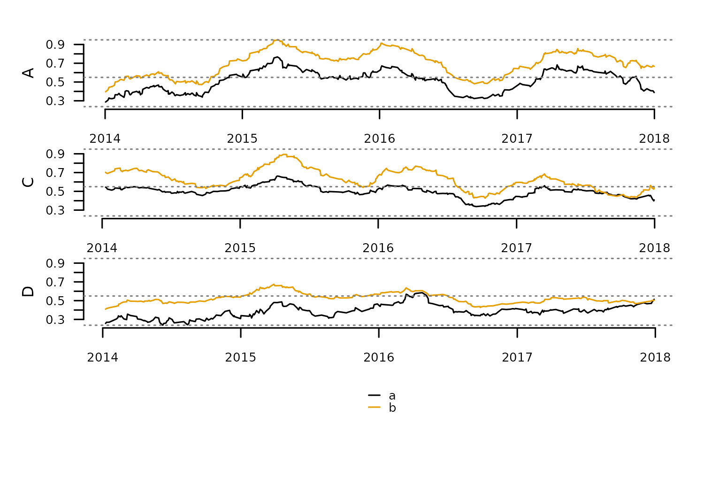

The function
[`tsl_burst()`](https://blasbenito.github.io/distantia/reference/tsl_burst.md)
transforms a multivariate TSL into a univariate TSL by creating a new
zoo object from each column of the original zoo objects. This function
helps apply dissimilarity analysis between individual variables in
multivariate time series.

``` r
#burst multivariate time series to univariate
tsl_univariate <- distantia::tsl_burst(
  tsl = tsl_new
)

#check new time series names
distantia::tsl_names_get(tsl = tsl_univariate)
#>   A__a   A__b   C__a   C__b   D__a   D__b 
#> "A__a" "A__b" "C__a" "C__b" "D__a" "D__b"

#check new column names
distantia::tsl_colnames_get(tsl = tsl_univariate)
#> $A__a
#> [1] "x"
#> 
#> $A__b
#> [1] "x"
#> 
#> $C__a
#> [1] "x"
#> 
#> $C__b
#> [1] "x"
#> 
#> $D__a
#> [1] "x"
#> 
#> $D__b
#> [1] "x"

#plot univariate time series
distantia::tsl_plot(
  tsl = tsl_univariate,
  guide = FALSE
  )
```

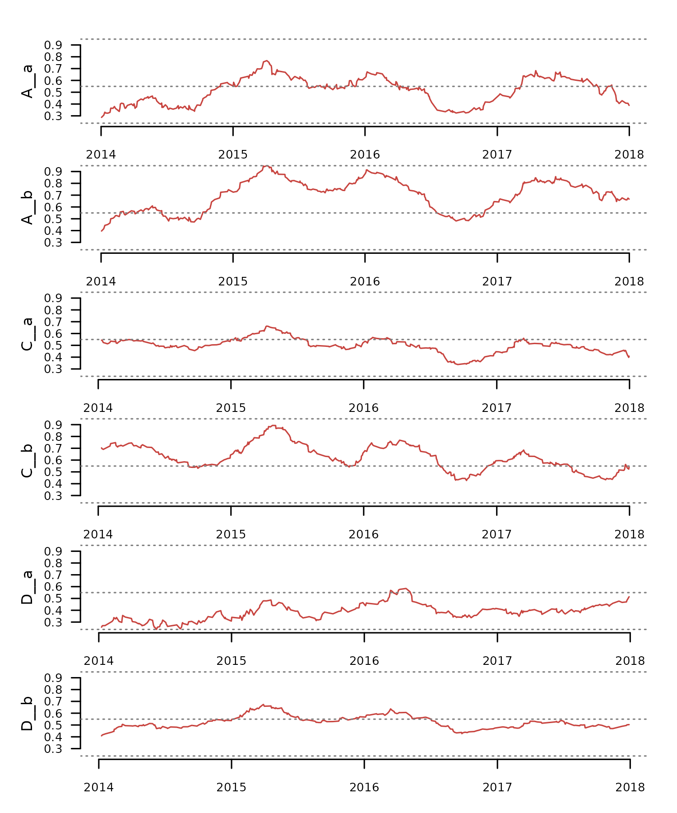

#### Aggregation

Aggregation reduces time series frequency (a.k.a **downsampling**) by
summarizing multiple data points into a single value over a specified
time interval. It results in a reduction in the number of samples,
smooths noise out, can transform irregular time series into regular, and
can generate entirely new time series depending on the aggregation
stats. On the other hand, it obscures fine grain detail and alters
statistical properties such as variance and temporal autocorrelation.

In `distantia`, this operation is supported by the function
[`tsl_aggregate()`](https://blasbenito.github.io/distantia/reference/tsl_aggregate.md),
with two arguments:

- `new_time`: time vector or keyword defining time intervals to
  aggregate over.
- `f`: aggregation function summarizing observations over aggregation
  time intervals.

The code below illustrates this function’s usage to compute yearly
temperature and precipitation indicators from the monthly observations
in the dataset `honeycomb_climate`.

``` r
tsl <- distantia::tsl_init(
  x = distantia::honeycomb_climate,
  name = "cell",
  time = "time"
) |> 
  tsl_subset(
    names = 1:5 #subset first five elements
  )

distantia::tsl_plot(
  tsl = tsl
)
```

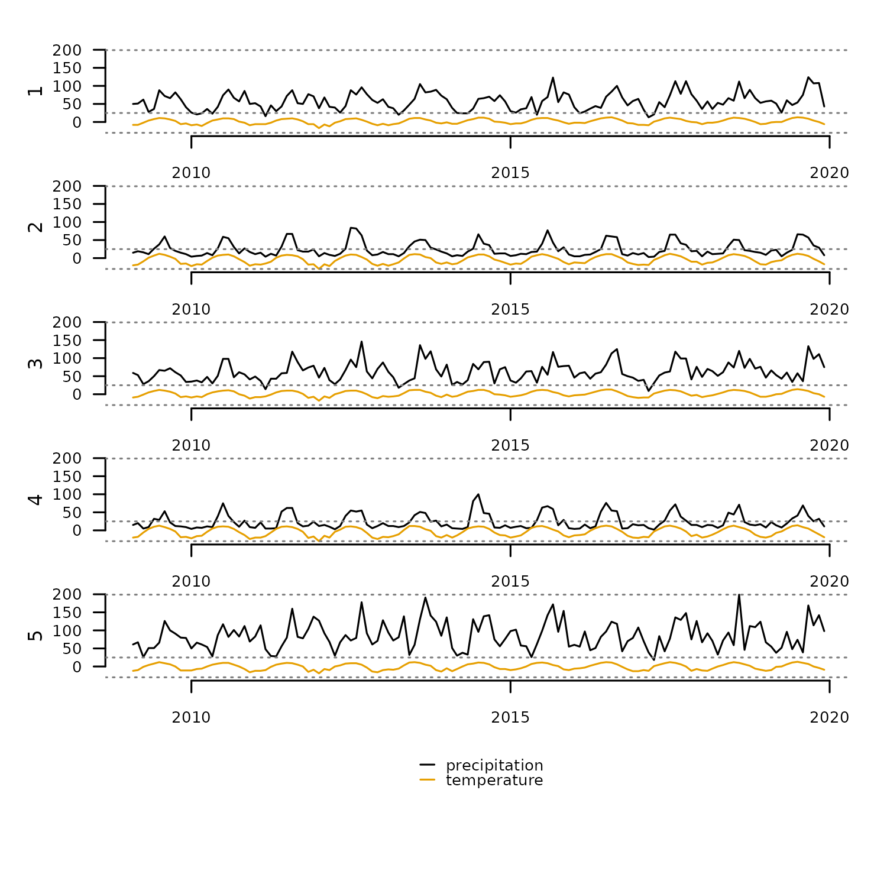

The easiest way to define aggregation intervals in `distantia` is to use
a keyword. The function
[`tsl_time()`](https://blasbenito.github.io/distantia/reference/tsl_time.md)
returns the supported keywords for a given TSL.

``` r
df_time <- distantia::tsl_time(
  tsl = tsl,
  keywords = "aggregate"
  )

df_time$keywords |> 
  unlist() |> 
  unique()
#> [1] "decades"  "years"    "quarters"
```

Let’s focus on “quarters” for the rest of the example.

``` r
interval <- "quarters"
```

The code below subsets the column “temperature” in `tsl`, aggregates by
computing the minimum, maximum, and mean per quarter, and adds a suffix
to each new aggregated column.

``` r
#subset temperature column
tsl_temperature <- distantia::tsl_subset(
  tsl = tsl,
  colnames = "temperature"
)

#compute stats: minimum, maximum, and mean
tsl_temperature_min <- distantia::tsl_aggregate(
  tsl = tsl_temperature,
  new_time = interval,
  f = min
) |> 
  distantia::tsl_colnames_suffix(
    suffix = "_min" #set suffix for aggregated column
  )

tsl_temperature_max <- distantia::tsl_aggregate(
  tsl = tsl_temperature,
  new_time = interval,
  f = max
) |> 
  distantia::tsl_colnames_suffix(
    suffix = "_max"
  )

tsl_temperature_mean <- distantia::tsl_aggregate(
  tsl = tsl_temperature,
  new_time = interval,
  f = mean
) |> 
  distantia::tsl_colnames_suffix(
    suffix = "_mean"
  )
```

Similar steps can be followed to process the variable “precipitation”.

``` r
#subset temperature column
tsl_precipitation <- distantia::tsl_subset(
  tsl = tsl,
  colnames = "precipitation"
)

#compute stats: minimum, maximum, and mean
tsl_precipitation_sum <- distantia::tsl_aggregate(
  tsl = tsl_precipitation,
  new_time = interval,
  f = sum
) |> 
  distantia::tsl_colnames_suffix(
    suffix = "_sum" #set suffix for aggregated column
  )

tsl_precipitation_max <- distantia::tsl_aggregate(
  tsl = tsl_precipitation,
  new_time = interval,
  f = max
) |> 
  distantia::tsl_colnames_suffix(
    suffix = "_max"
  )

tsl_precipitation_min <- distantia::tsl_aggregate(
  tsl = tsl_precipitation,
  new_time = interval,
  f = min
) |> 
  distantia::tsl_colnames_suffix(
    suffix = "_min"
  )
```

Finally, we join all new TSLs together to examine the result.

``` r
tsl_climate_stats <- distantia::tsl_join(
  tsl_temperature_min,
  tsl_temperature_max,
  tsl_temperature_mean,
  tsl_precipitation_sum,
  tsl_precipitation_max,
  tsl_precipitation_min
)

distantia::tsl_plot(
  tsl = tsl_climate_stats,
  ylim = "relative"
)
```


#### Resampling

Resampling is a model-based method to change the frequency of a time
series via interpolation. It is useful to align time series that are
irregular or have different resolutions. It is important to take in mind
that resampling to a frequency much higher than the original will
definitely result in interpolation artifacts and distorted time series.

The code below creates two irregular time series with different number
of rows.

``` r
tsl <- distantia::tsl_init(
  x = list(
    A = zoo_simulate(rows = 100, seasons = 10),
    B = zoo_simulate(rows = 50, seasons = 10)
  )
)

distantia::tsl_plot(
  tsl = tsl, 
  guide = FALSE
  )
```


The time features of this TSL show clear differences in frequency
between these time series.

``` r
distantia::tsl_time(tsl = tsl)[
  , 
  c("name", "rows", "resolution", "begin", "end")
  ]
#>   name rows resolution      begin        end
#> 1    A  100   36.70352 2010-01-01 2019-12-13
#> 2    B   50   74.53061 2010-01-01 2020-01-01
```

By default, if the argument `new_time` is omitted, a linear model
(computed via `zoo:::na.approx()`) is used to resample the TSL to its
average resolution over the intersection of all its time ranges.

``` r
tsl_resampled <- distantia::tsl_resample(
  tsl = tsl
)

distantia::tsl_time(tsl = tsl_resampled)[
  , 
  c("name", "rows", "resolution", "begin", "end")
  ]
#>   name rows resolution      begin        end
#> 1    A   75   49.09459 2010-01-01 2019-12-13
#> 2    B   75   49.09459 2010-01-01 2019-12-13

distantia::tsl_plot(
  tsl = tsl_resampled, 
  guide = FALSE
  )
```

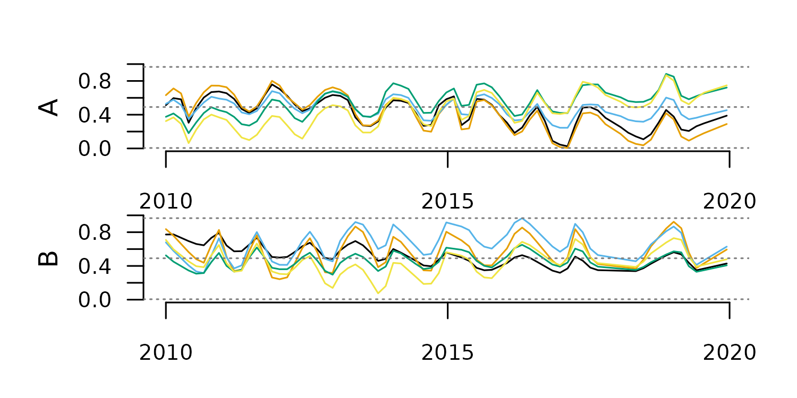

Otherwise, a keyword can be used to define the resampling frequency.
Again, we can find valid keywords using
[`tsl_time()`](https://blasbenito.github.io/distantia/reference/tsl_time.md),
but replacing “aggregate” with “resample” in the argument `keywords`.

``` r
df <- distantia::tsl_time(
  tsl = tsl,
  keywords = "resample"
  )

df$keywords |> 
  unlist() |> 
  unique()
#> [1] "years"    "quarters" "months"   "weeks"
```

``` r
tsl_resampled <- distantia::tsl_resample(
  tsl = tsl,
  new_time = "weeks",
  method = "loess"
)
#> Warning: distantia::zoo_resample(): The time intervals of 'new_time' and 'x'
#> differ in one order of magnitude or more. The output time series might be
#> highly distorted.
#> Warning: UNRELIABLE VALUE: One of the 'future.apply' iterations
#> ('future_lapply-1') unexpectedly generated random numbers without declaring so.
#> There is a risk that those random numbers are not statistically sound and the
#> overall results might be invalid. To fix this, specify 'future.seed=TRUE'. This
#> ensures that proper, parallel-safe random numbers are produced via a parallel
#> RNG method. To disable this check, use 'future.seed = NULL', or set option
#> 'future.rng.onMisuse' to "ignore".

tsl_time(tsl = tsl_resampled)[
  , 
  c("name", "rows", "resolution", "begin", "end")
  ]
#>   name rows resolution      begin        end
#> 1    A  519          7 2010-01-03 2019-12-08
#> 2    B  522          7 2010-01-03 2019-12-29

distantia::tsl_plot(
  tsl = tsl_resampled, 
  guide = FALSE
  )
```

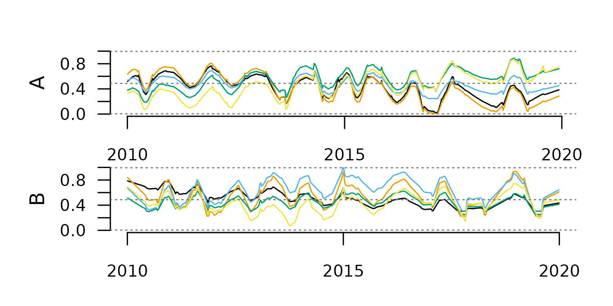

#### Smoothing

Time series smoothing is used to mitigate noise in high-frequency time
series, or to highlight general trends rather than fine-grain details.

The function
[`tsl_smooth()`](https://blasbenito.github.io/distantia/reference/tsl_smooth.md)
implements two smoothing methods: rolling-window and exponential.

To check how these methods work we first need a long and noisy TSL.

``` r
tsl <- distantia::tsl_simulate(
  rows = 1000,
  irregular = FALSE
)

distantia::tsl_plot(
  tsl = tsl,
  guide = FALSE
  )
```

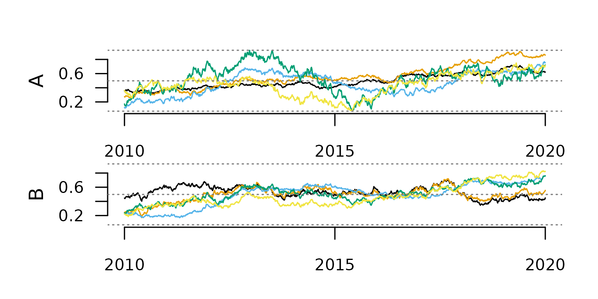

##### Rolling-Window Smoothing

This method computes a statistic over a fixed-width window of
consecutive cases and replaces each central value with the computed
statistic. It should not be applied to highly irregular time series, as
it ignores time distance.

The code below applies this method with two different window sizes.

``` r
#smoothing with window 100
tsl_smooth_100 <- tsl_smooth(
  tsl = tsl,
  window = 100,
  f = mean
)

distantia::tsl_plot(
  tsl = tsl_smooth_100,
  guide = FALSE
  )

#smoothing with window 10
tsl_smooth_10 <- tsl_smooth(
  tsl = tsl,
  window = 10,
  f = mean
)

distantia::tsl_plot(
  tsl = tsl_smooth_10,
  guide = FALSE
  )
```

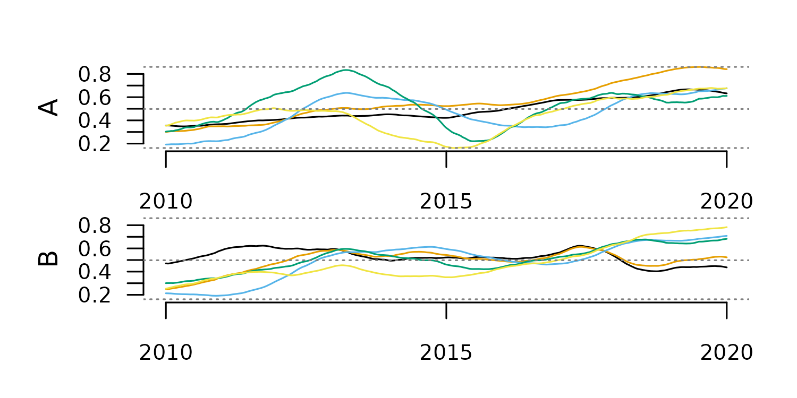
The window size determines the smoothing scale, and with that, the type
of trend highlighted in the smoothing results.

##### Exponential Smoothing

This method generates each new value as the weighted average of the
current value and past smoothed values. This weight is defined by the
argument `alpha` in
[`tsl_smooth()`](https://blasbenito.github.io/distantia/reference/tsl_smooth.md).

``` r
#smoothing with alpha 0.2
tsl_smooth_exp_0.2 <- tsl_smooth(
  tsl = tsl,
  alpha = 0.2
)

distantia::tsl_plot(
  tsl = tsl_smooth_exp_0.2,
  guide = FALSE
  )

#smoothing with alpha 0.8
tsl_smooth_exp_0.8 <- tsl_smooth(
  tsl = tsl,
  alpha = 0.8
)

distantia::tsl_plot(
  tsl = tsl_smooth_exp_0.8,
  guide = FALSE
  )
```


Alpha values closer to zero produce smoother results, as the plots above
show.

#### Transformations

The function
[`tsl_transform()`](https://blasbenito.github.io/distantia/reference/tsl_transform.md)
applies a function `f` to transform the values of a TSL. The names of
the available `f` functions can be listed with
[`f_list()`](https://blasbenito.github.io/distantia/reference/f_list.md).

``` r
distantia::f_list()
#>  [1] "f_binary"             "f_clr"                "f_detrend_difference"
#>  [4] "f_detrend_linear"     "f_detrend_poly"       "f_hellinger"         
#>  [7] "f_log"                "f_percent"            "f_proportion"        
#> [10] "f_proportion_sqrt"    "f_rescale_global"     "f_rescale_local"     
#> [13] "f_scale_global"       "f_scale_local"        "f_trend_linear"      
#> [16] "f_trend_poly"
```

##### Scale Adjustments

Scaling and centering multivariate time series is essential in dynamic
time warping to ensure all variables contribute equally, regardless of
their range or units.

For example, the dataset `fagus_dynamics` has variables in different
units.

``` r
tsl <- distantia::tsl_init(
  x = distantia::fagus_dynamics,
  name = "name",
  time = "time"
)

distantia::tsl_plot(
  tsl = tsl
)
```

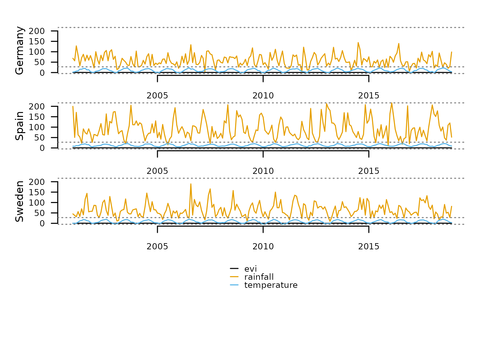

Due to the differences in magnitude between variables, a dynamic time
warping analysis will focus on `rainfall` disproportionately, biasing
the results.

To solve this issue, the package `distantia` implements two flavors of
scaling and/or centering:

- **Local**: each variable is scaled and/or centered independently by
  time series.
- **Global**: each variable is scaled and/or centering using its mean
  and standard deviation across all time series.

``` r
#local scaling
tsl_local_scaling <- distantia::tsl_transform(
  tsl = tsl,
  f = distantia::f_scale_local
)

#global scaling
tsl_global_scaling <- distantia::tsl_transform(
  tsl = tsl,
  f = distantia::f_scale_global
)
```

The stats of both operations show that the global one preserves variable
offsets between locations, while the local one shows an average 0 and
standard deviation 1 across all variables.

``` r
stats_cols <- c("name", "variable", "mean", "sd")

#stats of local scaling
distantia::tsl_stats(
  tsl = tsl_local_scaling
)[, stats_cols]
#>      name    variable                       mean sd
#> 1 Germany         evi -0.00000000000000006831308  1
#> 2   Spain         evi -0.00000000000000002052254  1
#> 3  Sweden         evi  0.00000000000000007098864  1
#> 4 Germany    rainfall -0.00000000000000004628439  1
#> 5   Spain    rainfall -0.00000000000000014522160  1
#> 6  Sweden    rainfall  0.00000000000000021712177  1
#> 7 Germany temperature -0.00000000000000010904564  1
#> 8   Spain temperature  0.00000000000000006240186  1
#> 9  Sweden temperature  0.00000000000000004371794  1

#stats of global scaling
distantia::tsl_stats(
  tsl = tsl_global_scaling
)[, stats_cols]
#>      name    variable         mean        sd
#> 1 Germany         evi  0.274946362 0.8814083
#> 2   Spain         evi -0.198553830 0.7030354
#> 3  Sweden         evi -0.076392533 1.2715132
#> 4 Germany    rainfall -0.322755553 0.7018733
#> 5   Spain    rainfall  0.493472218 1.2122159
#> 6  Sweden    rainfall -0.170716665 0.8176955
#> 7 Germany temperature -0.009510512 1.0589824
#> 8   Spain temperature  0.360302107 0.7534701
#> 9  Sweden temperature -0.350791594 1.0324738
```

The functions `f_rescale_local` and `f_rescale_global` work under the
same principle to rescale variable ranges. By default, these functions
rescale all time series between 0 and 1, but the arguments `new_min` and
`new_max` can receive numeric vectors to set different ranges for
different variables.

``` r
tsl_local_rescaling <- tsl_transform(
  tsl = tsl,
  f = f_rescale_local,
  new_min = 0, #same for all variables
  new_max = c(0, 100, 10)
)

tsl_global_rescaling <- tsl_transform(
  tsl = tsl,
  f = f_rescale_global,
  new_min = 0,
  new_max = c(0, 100, 10)
)
```

The stats below show the results of the local and global rescaling.

``` r
stats_cols <- c("name", "variable", "min", "max")

distantia::tsl_stats(
  tsl = tsl_local_rescaling
)[, stats_cols]
#>      name    variable min max
#> 1 Germany         evi   0   0
#> 2   Spain         evi   0   0
#> 3  Sweden         evi   0   0
#> 4 Germany    rainfall   0 100
#> 5   Spain    rainfall   0 100
#> 6  Sweden    rainfall   0 100
#> 7 Germany temperature   0  10
#> 8   Spain temperature   0  10
#> 9  Sweden temperature   0  10

distantia::tsl_stats(
  tsl = tsl_global_rescaling
)[, stats_cols]
#>      name    variable        min       max
#> 1 Germany         evi 0.03304993 0.8519938
#> 2   Spain         evi 0.16944079 0.7209915
#> 3  Sweden         evi 0.00000000 1.0000000
#> 4 Germany    rainfall 0.00000000 0.6596244
#> 5   Spain    rainfall 0.03615023 1.0000000
#> 6  Sweden    rainfall 0.02206573 0.8732394
#> 7 Germany temperature 0.10035842 1.0000000
#> 8   Spain temperature 0.32974910 0.9462366
#> 9  Sweden temperature 0.00000000 0.8853047
```

##### Trend Adjustments

Removing trends in time series before applying dynamic time warping may
help prevents inflated dissimilarity scores caused by non-stationary
components. Detrending also ensures that the alignment generated by
dynamic time warping focuses on meaningful shape features rather than
being distorted by long-term trends.

The transformation function `f_trend_linear` transforms time series into
their linear trend to help identify whether a time series needs
detrending or not.

The example below applies this function to the `cities_temperature`
dataset.

``` r
#loading cities_temperature as tsl
tsl <- distantia::tsl_init(
  x = distantia::cities_temperature,
  name = "name",
  time = "time"
)

#computing linear trends
tsl_trend <- distantia::tsl_transform(
  tsl = tsl,
  f = distantia::f_trend_linear
)

#plotting linear trends
tsl_plot(
  tsl = tsl_trend,
  columns = 2,
  guide = FALSE,
  line_color = "red4",
  line_width = 1.5
)
```


We can now compute the stats of these linear trends to identify the
cities with a steeper long-term temperature change.

``` r
#compute stats of linear trends
df_stats <- distantia::tsl_stats(
  tsl = tsl_trend,
  lags = 0
)

#arrange from higher to lower range
df_stats[
  order(df_stats$range, decreasing = TRUE), 
  c("name", "range")
  ]
#>                name     range
#> 15           Moscow 1.6821989
#> 12           London 1.3864875
#> 19         Shanghai 1.3791695
#> 16            Paris 1.3286522
#> 6          Istanbul 1.3026069
#> 3             Cairo 1.2096175
#> 20            Tokyo 1.0892597
#> 8           Karachi 1.0320425
#> 18        São Paulo 0.8453958
#> 13      Los Angeles 0.8322052
#> 17   Rio De Janeiro 0.7802845
#> 10            Lagos 0.7670465
#> 9          Kinshasa 0.6908596
#> 7           Jakarta 0.6667040
#> 2            Bogotá 0.4577014
#> 5  Ho Chi Minh City 0.3983325
#> 14           Manila 0.3216708
#> 1           Bangkok 0.2431807
#> 11             Lima 0.2421891
#> 4             Dhaka 0.2317552
```

Now that we identified the issue, the function `f_detrend_linear` helps
remove these temporal trends from the data.

``` r
tsl_detrended <- distantia::tsl_transform(
  tsl = tsl,
  f = distantia::f_detrend_linear
)
```

The code below applies `f_trend_linear` again to demonstrate that the
linear detrending worked as expected.

``` r
tsl_trend <- distantia::tsl_transform(
  tsl = tsl_detrended,
  f = distantia::f_trend_linear
)

df_stats <- distantia::tsl_stats(
  tsl = tsl_trend,
  lags = 0
)

df_stats[, c("name", "range")]
#>                name                      range
#> 1           Bangkok 0.000000000000000328592658
#> 2            Bogotá 0.000000000000000469733136
#> 3             Cairo 0.000000000000000459001688
#> 4             Dhaka 0.000000000000002763544954
#> 5  Ho Chi Minh City 0.000000000000000870648096
#> 6          Istanbul 0.000000000000000138892635
#> 7           Jakarta 0.000000000000001186027325
#> 8           Karachi 0.000000000000002015559408
#> 9          Kinshasa 0.000000000000000414558593
#> 10            Lagos 0.000000000000001005264880
#> 11             Lima 0.000000000000000346991624
#> 12           London 0.000000000000001099455349
#> 13      Los Angeles 0.000000000000000308295579
#> 14           Manila 0.000000000000000006671831
#> 15           Moscow 0.000000000000000528537838
#> 16            Paris 0.000000000000000640646973
#> 17   Rio De Janeiro 0.000000000000001170126628
#> 18        São Paulo 0.000000000000000960621609
#> 19         Shanghai 0.000000000000001204630566
#> 20            Tokyo 0.000000000000000446215307
```

##### Compositional Normalization

The `distantia` package offers several transformations for compositional
data:

- `f_percent`: percentages.
- `f_proportion`: proportions.
- `f_proportion_sqrt`: square root of proportions
- `f_hellinger`: transforms to proportion and applies Hellinger
  transformation.
- `f_clr`: centered log-ratio.
- `f_log`: logarithm transformation.
- `f_binary`: transform continuous data into discrete events.

The example below shows the application of several of these
transformation on the counts dataset `eemian_pollen`.

``` r
tsl_counts <- distantia::tsl_init(
  x = distantia::eemian_pollen,
  name = "name",
  time = "time"
) |> 
  distantia::tsl_subset(
    names = c(1, 2)
  )
#> distantia::utils_prepare_time():  duplicated time indices in 'Krumbach_I':
#> - value 6.8 replaced with 6.825.

distantia::tsl_plot(
  tsl = tsl_counts,
  guide_columns = 4
  )
```

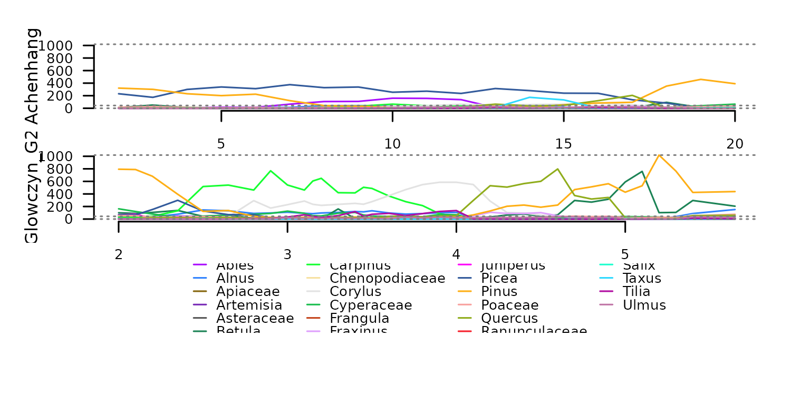
Transformation to percentages with `f_percent`.

``` r
tsl_percent <- distantia::tsl_transform(
  tsl = tsl_counts,
  f = distantia::f_percent
)

distantia::tsl_plot(
  tsl = tsl_percent,
  guide_columns = 4
  )
```

 The
function `f_binary` helps transform continuous data into discrete
events. The code below converts the percentages above into
presence/absence using 5% as threshold. Notice only the variable
“Carpinus” is shown in the plot to facilitate visualization.

``` r
tsl_binary <- distantia::tsl_transform(
  tsl = tsl_percent,
  f = distantia::f_binary,
  threshold = 5
)

distantia::tsl_plot(
  tsl = distantia::tsl_subset(
    tsl = tsl_binary,
    colnames = "Carpinus"
    )
  )
```

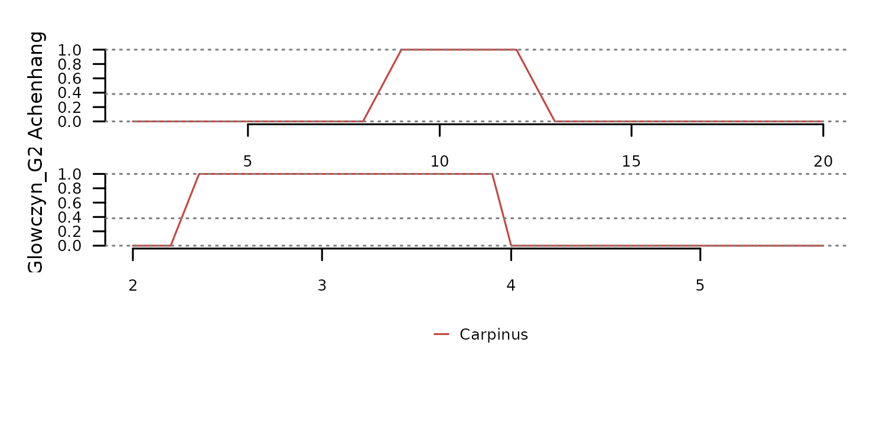

Transformation to square root of proportions with `f_proportion_sqrt`.

``` r
tsl_prop_sqrt <- distantia::tsl_transform(
  tsl = tsl_counts,
  f = distantia::f_proportion_sqrt
)

distantia::tsl_plot(
  tsl = tsl_prop_sqrt,
  guide_columns = 4
  )
```


The function `f_hellinger` transforms the taxa counts to proportions and
the applies the Hellinger transformation.

``` r
tsl_hellinger <- distantia::tsl_transform(
  tsl = tsl_counts,
  f = distantia::f_hellinger
)

tsl_plot(
  tsl = tsl_hellinger, 
  guide_columns = 4
  )
```

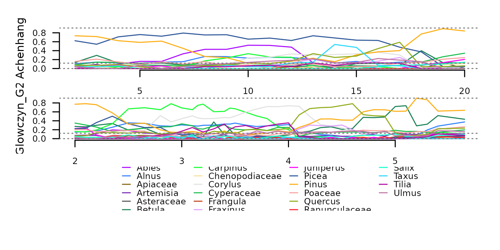

Centered log-ration computed with `f_clr`.

``` r
tsl_clr <- distantia::tsl_transform(
  tsl = tsl_counts,
  f = distantia::f_clr
)

tsl_plot(
  tsl = tsl_clr, 
  guide_columns = 4
  )
```

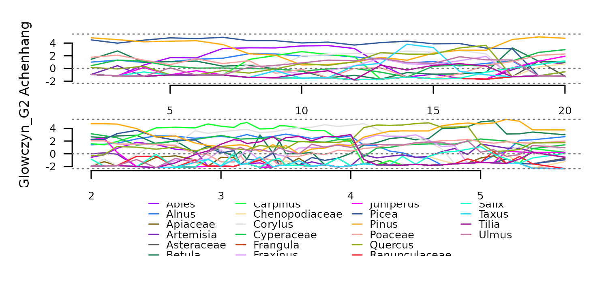
